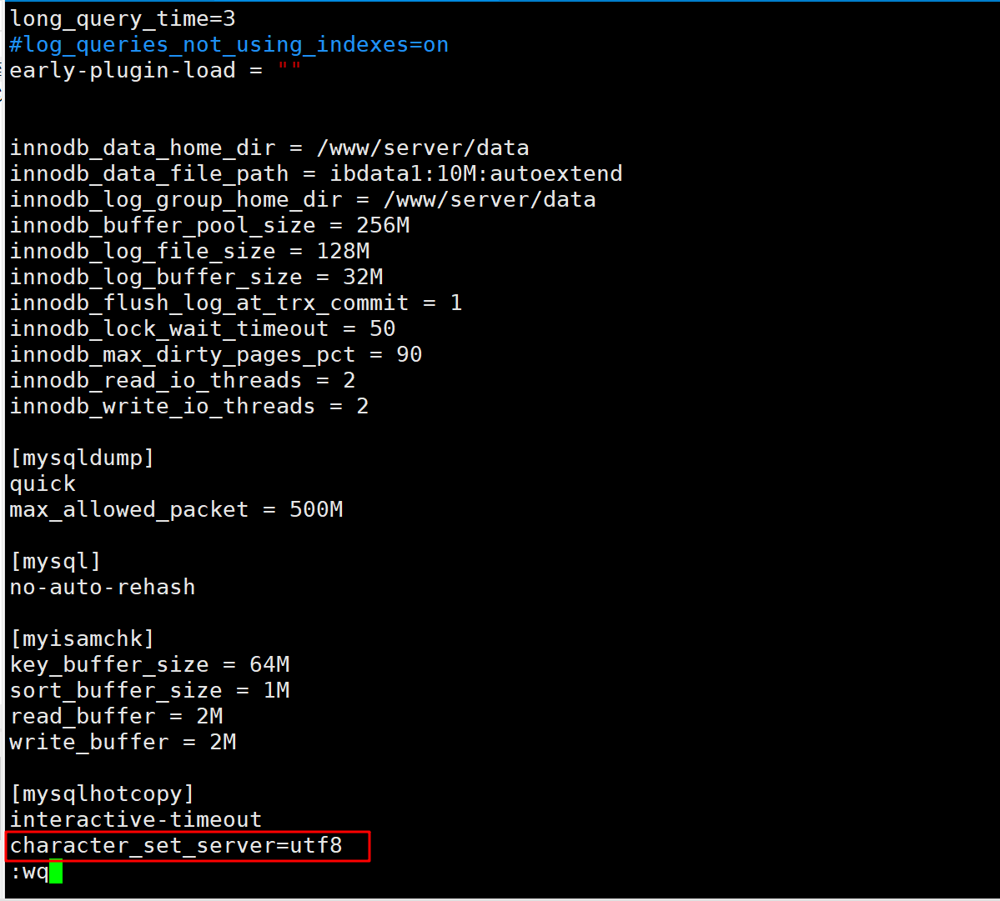

# MySQL简介

 

MySQL是一个关系型数据库管理系统，由瑞典MySQL AB公司开发，目前属于Oracle公司。 
MySQL是一种关联数据库管理系统，将数据保存在不同的表中，而不是将所有数据放在一个大仓库内，这样就增加了速度并提高了灵活性。

Mysql是开源的，所以你不需要支付额外的费用。
Mysql是可以定制的，采用了GPL协议，你可以修改源码来开发自己的Mysql系统。 

Mysql支持大型的数据库。可以处理拥有上千万条记录的大型数据库。
MySQL使用标准的SQL数据语言形式。
Mysql可以允许于多个系统上，并且支持多种语言。这些编程语言包括C、C++、Python、Java、Perl、PHP、Eiffel、Ruby和Tcl等。
MySQL支持大型数据库，支持5000万条记录的数据仓库，32位系统表文件最大可支持4GB，64位系统支持最大的表文件为8TB。

 Oracle收购MySQL

MySQL开源的  实际情况 二次开发  GPL协议

必须开源  遵循GPL协议  

阿里 开源阿里SQL　　　为什么开源是不是有更好的　老的开源　

Android　　　

Apache 协议  松一点

Tomcat　　

标准SQL　　　函数　　工具　　特有的

NoSQL　　Redis　　　

有一个标准　

支持　多语言　　都可以使用MySQL

必考题　　

# Mysql高手是怎样炼成的

数据库内部结构和原理

数据库建模优化

数据库索引建立

SQL语句优化

SQL编程(自定义函数、存储过程、触发器、定时任务)

mysql服务器的安装配置

数据库的性能监控分析与系统优化

各种参数常量设定

主从复制

分布式架构搭建、垂直切割和水平切割

分布式架构搭建、垂直切割和水平切割

数据迁移

容灾备份和恢复

shell或python等脚本语言开发

对开源数据库进行二次开发

数据库内部结构和原理

我的活

数据库建模优化

我的活  设计库表 

zcgl  资产管理   严禁使用 拼音 资产管理

一看就忘了  

英文的缩写  行话   看文档  看规范 

项目开发规范  行业的行话 行业的人知道的

看看规范 按照   能看懂  

用户  客户  买了钱的   用户变客户 

新人  最底层 

以往的项目   照之前同学 改

大厂 中小型创业公司 

分工明确  

稳定  

人员的综合素质

不太规范 

新的技术 新的框架 

数据库索引建立

SQL语句优化

我的  开发人员的活

SQL编程(自定义函数、存储过程、触发器、定时任务)

DBA 运维的

mysql服务器的安装配置

我来   项目有问题 我来解决

我来试一试  能解决的  

测试环境  

数据库的性能监控分析与系统优化

各种参数常量设定

主从复制

给出一个方案 

分布式架构搭建、垂直切割和水平切割

分布式架构搭建、垂直切割和水平切割

方案开发人员出 

运维人员  和 我们接触比较紧密

数据迁移

容灾备份和恢复

shell或python等脚本语言开发

对开源数据库进行二次开发

专家级别的人  才能做  

面试会考到 

Java透彻  专业视频

单表　五百万条数据　　　水平拆分　　分表　　

一台机器　　一套　　数据  表　分到两台服务器

垂直拆分 分数据库   

接触数据库

DBA  运维人员

项目经理 技术经理   

开发人员

定位  快  准确   

精通  七八年   

面试 感觉嘲讽

直接打开高级题  搜索大公司 架构师 提问

一块竞争表现好点 

多走了一部  

设计库 设计表

# MysqlLinux版的安装

mysql5.5

mysql5.7

CentOS

重新装下  

## 下载地址

官网下载地址：http://dev.mysql.com/downloads/mysql/

## 拷贝&解压缩

## 检查工作

检查当前系统是否安装过mysql

 执行安装命令前，先执行查询命令
1、CentOS6
rpm -qa|grep mysql
如果存在mysql-libs的旧版本包如下：

请先执行卸载命令：rpm -e --nodeps  mysql-libs

 1、CentOS7
rpm -qa|grep mariadb
 如果存在如下：

请先执行卸载命令：rpm -e --nodeps  mariadb-libs

检查当前MySQL依赖环境

 执行安装命令前，先执行查询命令
 rpm -qa|grep libaio
如果存在libaio包如下：

  rpm -qa|grep net-tools
 如果存在net-tools包如下：

如果不存在需要到centos安装盘里进行rpm安装

检查/tmp文件夹权限

由于mysql安装过程中，会通过mysql用户在/tmp目录下新建tmp_db文件，所以请给/tmp较大的权限
执行 ：chmod -R 777 /tmp

## 安装

在mysql的安装文件目录下执行：（必须按照顺序执行）
rpm -ivh mysql-community-common-5.7.16-1.el7.x86_64.rpm 
rpm -ivh mysql-community-libs-5.7.16-1.el7.x86_64.rpm
rpm -ivh mysql-community-client-5.7.16-1.el7.x86_64.rpm 
rpm -ivh mysql-community-server-5.7.16-1.el7.x86_64.rpm

如在检查工作时，没有检查mysql依赖环境在安装mysql-community-server会报错

## 查看MySQL安装版本

 执行 mysqladmin --version命令，类似java -version如果打出消息，即为成功。

 通过vim 查看 mysql用户和mysql组 

## mysql服务的初始化

为了保证数据库目录为与文件的所有者为 mysql 登陆用户，如果你是以 root 身份运行 mysql 服务，需要执行下面的命令初始化
mysqld --initialize --user=mysql

另外 --initialize 选项默认以“安全”模式来初始化，则会为 root 用户生成一个密码并将该密码标记为过期，登陆后你需要设置一个新的密码

查看密码：cat /var/log/mysqld.log

root@localhost: 后面就是初始化的密码

## mysql服务的启+停

 

 启动：systemctl start mysqld.service

ps -ef|grep mysqld

关闭：systemctl stop mysqld.service

ps -ef|grep mysqld

## 首次登录

首次登陆通过 mysql -uroot -p进行登录，在Enter password：录入初始化密码

因为初始化密码默认是过期的，所以查看数据库会报错

修改密码：
ALTER USER 'root'@'localhost' IDENTIFIED BY 'new_password'; 
但新密码太简单会报错

设置完密码就可以用新密码登陆，正常使用数据库了

 

 

## MySQL的安装位置

在linux下查看安装目录  ps -ef|grep mysql

参数	路径	解释	备注
--basedir 	/usr/bin 	相关命令目录	mysqladmin mysqldump等命令
--datadir	/var/lib/mysql/ 	mysql数据库文件的存放路径	 
--plugin-dir	/usr/lib64/mysql/plugin	mysql插件存放路径	
--log-error	/var/lib/mysql/jack.atguigu.err	mysql错误日志路径	
--pid-file	/var/run/mysqld/mysqld.pid
 	进程pid文件	
--socket	/var/lib/mysql/mysql.sock	本地连接时用的unix套接字文件	 

	/usr/share/mysql 	配置文件目录	mysql脚本及配置文件
	/etc/systemd/system/multi-user.target.wants/mysqld.service	服务启停相关脚本	

在linux下查看安装目录 ps -ef|grep mysql

 

## 自启动mysql服务

查看mysql是否自启动（默认自启动）
systemctl list-unit-files|grep mysqld.service 

如不是enabled可以运行如下命令设置自启动
systemctl enable mysqld.sercice

## 修改字符集问题

mysql5.7

直接插入中文数据报错。 

 1、修改配置文件
  vim  /etc/my.cnf
在最后加上中文字符集配置
character_set_server=utf8

 2、重新启动mysql
 3、已生成的库表字符集如何变更
 修改数据库的字符集
mysql> alter database mydb character set 'utf8';
修改数据表的字符集
mysql> alter table mytbl convert to  character set 'utf8';