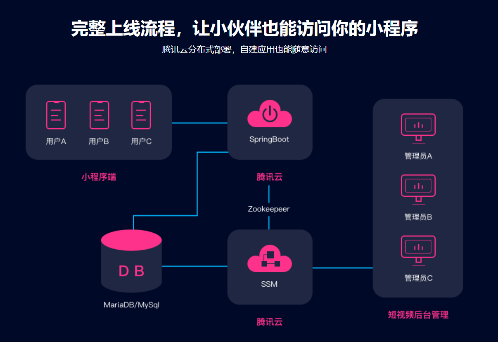
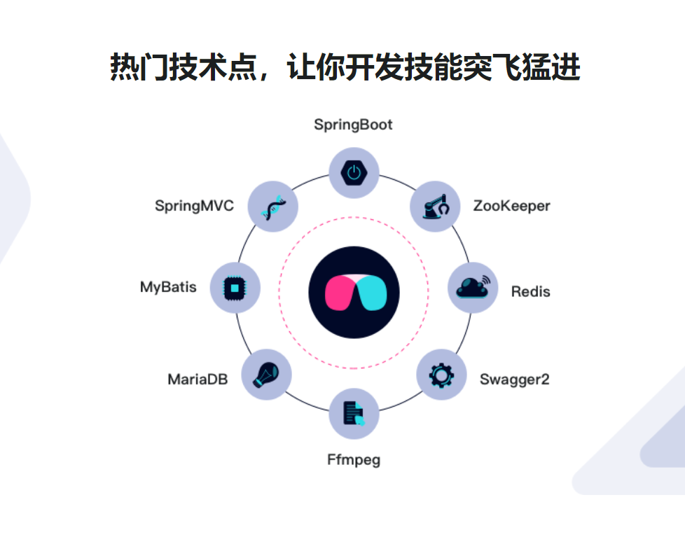

# Java短视频小程序开发 全栈式实战项目

[章节目录](javascript:void(0))

环境参数

# 章节目录

- ##### 第1章 千呼万唤史出来，微信小程序的简要学习

  对微信小程序的大致介绍，如何注册，如何运行第一个demo。并且对微信小程序的基本框架了解并学习，页面组件是如何构成的

  -  1-1 课前必读（不看会错过一个亿）
  -  1-2 微信小程序简介**试看**
  -  1-3 微信小程序的简要注册流程
  -  1-4 微信开发者工具helloworld
  -  1-5 运行微信官方的demo演示
  -  1-6 公有目录与私有目录的工程结构了解
  -  1-7 手写属于自己的第一个demo
  -  1-8 wxss样式文件的使用
  -  1-9 小程序默认加载的页面
  -  1-10 小程序app的生命周期
  -  1-11 小程序中如何调试js文件
  -  1-12 私有页面的生命周期以及导航
  -  1-13 小程序的事件
  -  1-14 小程序抽离公用方法进行模块化
  -  1-15 视图层 - 细说数据绑定
  -  1-16 视图层 - 细说列表渲染
  -  1-17 视图层 - wx：key列表高级特性
  -  1-18 视图层 - 细说条件渲染与条件懒加载模式
  -  1-19 小程序页面通用模板的使用
  -  1-20 wxs模块讲解1 - 页面引用
  -  1-21 wxs模块讲解2 - 模块调用模块
  -  1-22 小程序模板在外部页面引用
  -  1-23 页面引用外部wxml通用页面

- 

  ##### 第2章 微信小程序的基础组件学习

  如何使用flex布局的，针对view视图组件，常用的基础组件进行学习与讲解

  -  2-1 小程序的flex布局
  -  2-2 flex-direction 讲解
  -  2-3 flex-wrap 讲解
  -  2-4 justify-content 讲解
  -  2-5 flex成员元素的样式设置
  -  2-6 小程序的组件介绍
  -  2-7 视图组件 view
  -  2-8 scroll-view 可滚动视图 纵向
  -  2-9 scroll-view 可滚动视图 横向
  -  2-10 swiper 轮播图示例
  -  2-11 可拖动view
  -  2-12 作业 - 可缩放view
  -  2-13 基础组件 - icon
  -  2-14 基础组件 - text
  -  2-15 基础组件 - rich-text 富文本
  -  2-16 基础组件 - progress

- 

  ##### 第3章 form表单组件与小程序前后端通信

  讲解小程序的表单组件以及如何与后端通信，如何内网穿透

  -  3-1 form 组件 - button的使用
  -  3-2 form 组件 - checkbox与lable
  -  3-3 form的提交和重置
  -  3-4 form 组件 - input文本框（上）
  -  3-5 form 组件 - input文本框（下）
  -  3-6 form组件 - picker普通选择器
  -  3-7 form组件 - picker多列选择器
  -  3-8 作业：picker时间日期城市选择器
  -  3-9 form组件 - picker-view
  -  3-10 form组件 - radio单选框
  -  3-11 form组件 - slider滑动选择器
  -  3-12 form组件 - switch开关
  -  3-13 form组件小练习
  -  3-14 导航标签与传值
  -  3-15 image图片组件
  -  3-16 小程序与后端通信 - 内网穿透
  -  3-17 小程序与后端通信 - wx.request使用

- 

  ##### 第4章 产品介绍与数据库设计介绍

  对项目做简单的需求了解，对数据库表设计进行讲解

  -  4-1 短视频项目实战功能演示与简介
  -  4-2 数据库表结构介绍

- 

  ##### 第5章 开发用户登录注册与用户信息

  在小程序端开发用户注册与登录以及个人信息，包括基础项目使用springboot分层搭建，mybatis逆向工程的使用，前后端联调，图片上传，配置swagger等。

  -  5-1 短视频基础项目初始化
  -  5-2 用户注册页面
  -  5-3 Springboot聚合工程介绍
  -  5-4 搭建Springboot分层项目
  -  5-5 使用Springboot版mybatis逆向生成工具
  -  5-6 开发注册用户的接口
  -  5-7 swagger2的使用与接口测试
  -  5-8 小程序注册与后端联调
  -  5-9 作业：用户登录
  -  5-10 登录作业讲解
  -  5-11 wx.loading与页面跳转
  -  5-12 有状态会话与无状态会话基本概念
  -  5-13 安装单机环境的redis
  -  5-14 开发用户redis-session
  -  5-15 "我的"个人信息页面讲解
  -  5-16 开发注销接口
  -  5-17 小程序注销与后端联调
  -  5-18 用户头像上传接口
  -  5-19 用户上传头像联调
  -  5-20 上传头像后更新到数据库
  -  5-21 Springboot静态资源配置，显示图片
  -  5-22 tomcat 虚拟目录配置
  -  5-23 小程序展示头像以及手机端调试
  -  5-24 查询用户信息接口
  -  5-25 小程序个人信息展示联调

- 

  ##### 第6章 上传视频业务流程开发

  这部分重点讲解，主要涉及到上传视频，使用ffmpeg合并视频与背景音乐，获取视频截图

  -  6-1 上传短视频业务流程讲解
  -  6-2 用户选择视频
  -  6-3 选择背景音乐页面讲解
  -  6-4 更新内容介绍
  -  6-5 创建一个自定义组件
  -  6-6 构建静态页面
  -  6-7 动态渲染组件
  -  6-8 通过audio上下文对象播放音频
  -  6-9 实现MP3的播放和暂停
  -  6-10 开发后台bgm列表接口
  -  6-11 bgm页面联调获取背景音乐列表
  -  6-12 开发上传短视频接口，完善swagger测试上传
  -  6-13 视频临时参数传入下一个页面
  -  6-14 小程序端上传短视频联调
  -  6-15 ffmpeg介绍
  -  6-16 ffmpeg的第一个例子
  -  6-17 Java与ffmpeg的结合
  -  6-18 ffmpeg操作视频与bgm的结合
  -  6-19 新版ffmpeg视音频合并的解决方案
  -  6-20 Java合并视音频
  -  6-21 小程序上传视频后调用视频处理工具类联调
  -  6-22 保存视频信息到数据库
  -  6-23 上传封面图保存到数据库
  -  6-24 小程序端上传视频业务流程联调
  -  6-25 联调手机端踩坑小程序
  -  6-26 使用ffmpeg生成截图
  -  6-27 上传视频流程整合视频截图功能
  -  6-28 小程序端与后台联调测试上传流程

- 

  ##### 第7章 视频展示页开发

  主要涉及开发视频主页列表展示，如何做分页，视频详情页展示视频播放，讲解视频组件，开源搜索框的使用，关注点赞用户，举报分享下载等。以及后端的拦截器讲解。

  -  7-1 小程序首页视频列表讲解**试看**
  -  7-2 编写自定义mapper
  -  7-3 视频列表分页查询接口
  -  7-4 首页分页前后端接口联调
  -  7-5 首页视频列表 - 上拉分页
  -  7-6 首页视频列表 - 下拉刷新
  -  7-7 视频组件与api介绍
  -  7-8 视频展示页开发1 - 视频展示页面
  -  7-9 视频展示页开发2 - 图标放置
  -  7-10 开源搜索视频组件的使用，手机端演示
  -  7-11 搜索插件缓存讲解
  -  7-12 修改全局用户对象使用缓存
  -  7-13 查询接口完善以及热搜词保存
  -  7-14 热搜词查询接口开发
  -  7-15 热搜词前后端联调
  -  7-16 搜索功能整合首页列表联调
  -  7-17 热搜查询联调与视频对象的播放与暂停
  -  7-18 上传视频功能复用与测试
  -  7-19 首页进入视频展示页
  -  7-20 横向视频的展示
  -  7-21 小程序的页面拦截
  -  7-22 页面重定向
  -  7-23 拦截器配置与注册
  -  7-24 完善登录拦截并且限制用户只能在一台手机登录
  -  7-25 前后端联调测试拦截器
  -  7-26 点赞与取消点赞后台接口开发
  -  7-27 点赞与取消点赞功能前后端联调
  -  7-28 进入视频展示页面查询后端接口信息
  -  7-29 视频展示页面初始化联调
  -  7-30 查看视频发布者信息
  -  7-31 关注与取消关注接口编写
  -  7-32 关注我前后端联调
  -  7-33 是否关注动态展示
  -  7-34 关注我收尾工作
  -  7-35 作品，收藏，关注 tab动态切换
  -  7-36 作品，收藏，关注 代码讲解
  -  7-37 微信api菜单操作
  -  7-38 保存举报信息接口讲解
  -  7-39 举报前端开发与联调
  -  7-40 分享给好友或微信群
  -  7-41 下载视频到本地

- 

  ##### 第8章 开发视频的留言板

  主要对留言板进行开发，用户留言后分页显示

  -  8-1 保存留言功能开发
  -  8-2 查询留言列表分页接口
  -  8-3 留言列表分页前后端联调
  -  8-4 评论回复sql设计与查询
  -  8-5 页显示回复评论
  -  8-6 评论回复功能开发

- 

  ##### 第9章 开发短视频后台管理系统

  使用ssm分层搭建后台管理系统，开发用户管理视频管理举报管理功能，重点会对bgm功能讲解，会使用到zookeeper让小程序后端所在的云服务器自动下载bgm

  -  9-1 演示后台管理系统，简介页面结构
  -  9-2 搭建项目架构 - 构建parent工程
  -  9-3 搭建项目架构 - 构建common, pojo, mapper和service工程
  -  9-4 搭建项目架构 - 使用mybatis逆向工具生成文件
  -  9-5 搭建项目架构 - 搭建mng工程以及模板介绍
  -  9-6 使用maven-tomcat7插件运行web工程
  -  9-7 登录、登出、拦截器 代码讲解
  -  9-8 上传接口讲解
  -  9-9 异步上传JS编写联调
  -  9-10 tomcat虚拟目录配置与音乐播放
  -  9-11 保存背景音乐bgm到数据库
  -  9-12 jqgrid讲解与bgm列表接口开发
  -  9-13 bgm列表前后端联调与jgqrid对象封装
  -  9-14 自定义列以及删除BGM
  -  9-15 zookeeper简介
  -  9-16 JDK的安装
  -  9-17 zookeeper下载、安装以及配置环境变量
  -  9-18 zookeeper客户端的介绍
  -  9-19 zookeeper模型，节点的CRUD操作
  -  9-20 springmvc与zk curator整合
  -  9-21 curator与springmvc整合调试与测试
  -  9-22 新增与删除bgm写入znode
  -  9-23 springboot与zk curator整合
  -  9-24 消费端监听事件以及触发测试
  -  9-25 监听zk节点下载bgm
  -  9-26 监听zk节点删除bgm
  -  9-27 资源地址使用属性文件统一配置
  -  9-28 用户列表信息查询
  -  9-29 举报管理

- 

  ##### 第10章 项目上线与发布

  主要涉及到两台服务器上进行部署，分别对windows以及linux服务做服务的配置与上线，并且最终对小程序后台配置https

  -  10-1 购买腾讯云服务器
  -  10-2 初识云服务器，安装teamviewer
  -  10-3 安装ffmpeg以及JDK
  -  10-4 安装tomcat，配置安全组
  -  10-5 域名注册备案解析讲解
  -  10-6 ssl证书购买和HTTPS配置
  -  10-7 安装MariaDB，导入sql脚本
  -  10-8 linux云服务器 - 安装JDK环境
  -  10-9 linux云服务器 - 安装tomcat
  -  10-10 linux云服务器 - 安装redis
  -  10-11 linux云服务器 - 安装zookeeper
  -  10-12 部署springboot到云服务器
  -  10-13 部署短视频admin管理后台
  -  10-14 linux云服务器中文乱码配置
  -  10-15 小程序上线审核流程讲解
  -  10-16 课程总结，挥泪再会

- 

  ##### 第11章 课程补充（版本升级）

  本章是更新内容，目的是为了大家可以快速的讲项目升级到新版技术，比如SpringBoot，我会带大家升级到最新版2.1.x,当然还有一些其他地方的升级，总之通过本章的补充学习，大家会收获一些版本升级的知识。

  -  11-1 课程升级介绍
  -  11-2 springboot最新版本升级（2.1.13）**试看**
  -  11-3 升级数据源为HikariCP
  -  11-4 数据源时区与redis超时设置
  -  11-5 升级使用WebMvcConfigurer接口
  -  11-6 在idea中使用mybatis逆向工具
  -  11-7 idea中构建maven聚合工程
  -  11-8 idea运行springboot进行测试

本课程已完结

## 试看

全部试看小节

### 讲师

[**风间影月** ](https://www.imooc.com/t/3078817)全栈工程师

创业公司技术总监, 9年开发和技术管理经验。SUN认证SCJP、PMP、MCP认证。主要从事后端技术和架构领域，有丰富的电商平台与物流平台核心系统的架构设计和开发经验。

 

## 从前端到后台，从开发到上线，带你玩转小程序全栈开发

[课程介绍](https://coding.imooc.com/class/217.html#Anchor)

Spring Boot短视频小程序开发 全栈式实战项目

本课程基于微信小程序和目前主流的后端技术SpringBoot/SpringMVC来实现一个完整的短视频小程序App。通过对本套课程的学习，可以使你独立开发一个短视频小程序并部署到腾讯云上，掌握全栈式开发，更是毕业设计利器！

## Java+微信小程序，六大课程亮点，带你开发最潮短视频应用

基于微信小程序

更便于用户使用，加速流量产生

主流后端开发技术

SpringBoot/SpringMvc

Ffmpeg处理视频+BGM

主流视频处理技术
带你打开视频处理的大门

如何配置HTTPS

加密传输，提高安全性

自动下载背景音乐

后台服务器通过Zookeeper
监听自动下载背景音乐

部署到腾讯云服务器

在Windows上以及Linux上部署
我们的系统。达成一个分布式云部署

## 从前端到后台，让你轻松掌握小程序全栈开发

##### 手把手教学，打造高性价比课程

## 完整上线流程，让小伙伴也能访问你的小程序

##### 腾讯云分布式部署，自建应用也能随意访问

## 热门技术点，让你开发技能突飞猛进

## 学员专享增值服务

问答专区

关于课程的问题都可在问答区随时提问，

讲师会进行集中答疑

源码开放

课程案例代码完全开放给你

你可以根据所学知识，自行修改、优化

## 适合人群

初中级java开发，有基础的大学应届生，
对小程序Java后端开发有感兴趣的用户

## 技术储备要求

需要有一定的Java基础，有html+css+js基础，
了解spring、linux、springboot、springmvc、mybatis，
以及Maven的基本使用，
以及对MySQL/mariaDB
或者其他关系型数据库等有一定的了解

# 环境参数

- 核心框架 Spring Framework，SpringBoot
- 数据库 MyBatis，MariaDB，Druid
- 中间件 zookeeper，redis，swagger2
- 视频处理 FFmpeg
- 前端框架 Bootstrap + Jquery
- 前端分页组件 jqGrid
- 开发工具 eclipse

## 万事俱备 只等你来

- 

  黄月初

  好评

  对于急于找工作的你，这个项目就是你的杀手锏。助你过关斩将拿到offer。公司用的技术栈都有涉及。学完这个项目springboot基本没问题了

- 

  梁天卿

  好评

  老师说要来评价，就来评价一波。课程涉及的知识面很广。从微信小程序，到springboot，程序，再到Zookeeper。老师也是竭尽所能的去回答学员的疑问。满分，好评。

- 

  努力_努力_努力

  好评

  非常棒的课程！！！完全物超所值，老师讲解的非常适合在校大学生学习，但最好有过一点编写项目经验。老师首先是非常基本的讲解微信小程序的编写（其实可以自己查阅开发文档学习，但是有了老师的讲解更为易懂），然后老师使用聚合工程（新知识）编排代码，又有无状态会话，ffmpeg视频工具等等新知识点结合Spring Boot编写后端接口。老师还使用zookeeper分布式开发后台管理系统，对于上线还分window和linux两个例子说明。这对于一个后端学习同学来说非常详细有用，赞!! 但可能该实战课时已经太长，后台管理系统部分内容无法说明太清。但也不影响这门课程的优秀，这暂时是我在慕课网学习过最好的课程！！

[查看全部1064条用户评价](https://coding.imooc.com/class/evaluation/217.html#Anchor)

 

提问

- 
  19

  ### [为什么分了两个后端springboot和springMVC？这课前端部分跟另一门直播课有什么区别？](https://coding.imooc.com/class/consult/detail/24491.html)

  亲，您好~SpringBoot为小程序前端提供restful的接口数据服务，SpringMVC做的后台管理平台，前端部分是从小程序基础讲起的，没有涉及到直播的部分，其他内容比直播那门课的全面一些，祝您学习愉快~

- 
  8

  ### [请问学习了HTML css js 和JAVA SE能学习这课程吗](https://coding.imooc.com/class/consult/detail/25296.html)

  亲，您好~学习这门课需要有一定的Java基础，有html+css+js基础，了解spring、linux、spring、springmvc、mybatis，以及Maven的基本使用， 以及对MySQL/mariaDB或者其他关系型数据库等有一定的了解 。祝您学习愉快~

- 
  4

  ### [您好，学习本门课程需要什么基础知识](https://coding.imooc.com/class/consult/detail/24541.html)

  你好，需要前端基础css js html，后端基础java web mvc，祝学习愉快噢

- 
  4

  ### [这个课程学完，可以将作品部署完整展示出来吗，包含了前端？](https://coding.imooc.com/class/consult/detail/24525.html)

  亲，您好~包含前端，可以展示，最终会部署到腾讯云上，别的小伙伴也能访问你的小程序，祝您学习愉快~

- 
  3

  ### [老师您好请问课程面向的人群和学完能达到的能力大致是？谢谢您](https://coding.imooc.com/class/consult/detail/26241.html)

  你好，只要有java web mvc基础，和前端html css JavaScript 基础即可学习，课程是全栈式分布式开发，学完并且实操可以达到1年左右水平，另外老师附赠很多彩蛋课程，都是十分实用的，让你学有所值，祝学习愉快~~

- 
  3

  ### [你好,这个是所有的代码都带着写,还是只是讲解?](https://coding.imooc.com/class/consult/detail/24662.html)

  你好java后端全部手把手带着写，小程序部分所有js全部手把手带着写，css和页面部分由于课程时间限制会针对模块化进行代码讲解噢，课程主要针对业务处理与代码逻辑，祝学习愉快

[查看全部 153 条已回复的咨询](https://coding.imooc.com/class/consult/217.html)

## 本课程已加入以下学习路线

[SpringBoot从入门到精通本路线旨在帮助想快速掌握SpringBoot应用的工程师，全方位多角度带你升级。4步骤*·*5门课10823人收藏](https://coding.imooc.com/learningpath/route?pathId=8)

### 课前必学

[**Java****SpringBoot**Spring Boot进阶之Web进阶《2小时学习Spring Boot》之进阶教程，针对Web方面的相关技巧中级·98012人在学](https://www.imooc.com/learn/810)

0%

[**Java****SpringBoot**SpringBoot开发常用技术整合SpringBoot 极简开发的框架整合利器中级·88739人在学](https://www.imooc.com/learn/956)

0%

 