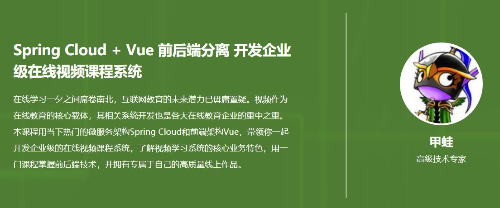
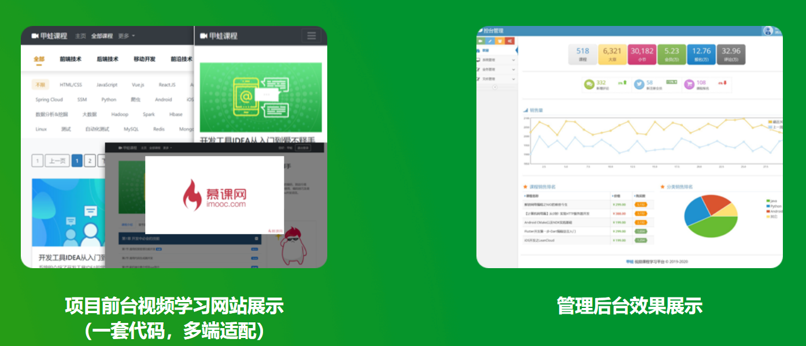
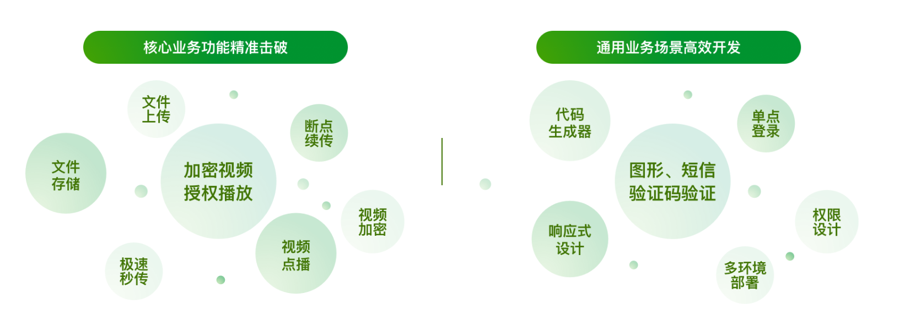
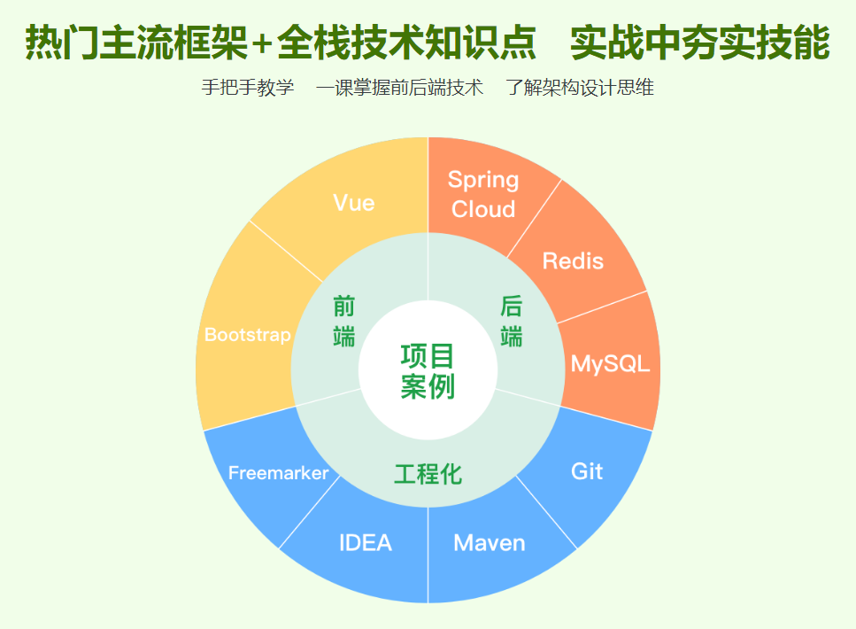

# Spring Cloud + Vue 前后端分离 开发企业级在线视频课程系统

## 冲击在线教育/培训新赛道 从0开始搭建你自己的完整项目作品

SpringCloud+Vue前后端分离开发企业级在线视频课程系统

SpringCloud + Vue 

前后端分离

开发企业级别 在线视频

课程系统

SpringCloud+Vue前后端分离开发企业级在线视频课程系统

SpringCloud + Vue

前后端分离 开发企业级

在线视频 课程系统 

## 冲击在线教育/培训新赛道 从0开始搭建你自己的完整项目作品

在线教育 培训  搭建你自己的完整项目作品

Spring Cloud + Vue 前后端分离 开发企业级在线视频课程系统
在线学习一夕之间席卷南北，互联网教育的未来潜力已毋庸置疑。视频作为在线教育的核心载体，其相关系统开发也是各大在线教育企业的重中之重。本课程用当下热门的微服务架构Spring Cloud和前端架构Vue，带领你一起开发企业级的在线视频课程系统，了解视频学习系统的核心业务特色，用一门课程掌握前后端技术，并拥有专属于自己的高质量线上作品。

视频学习系统的核心业务特色 

全网稀缺的在线视频系统开发课程
仿慕课网构建视频学习网站+管理后台
真正意义上的“完整”项目实战    从0开始搭建你的高质量作品

项目前台视频学习网站展示
（一套代码，多端适配）

**管理后台效果展示**

企业级项目真实开发流程   业务场景一课通
在线视频课程系统功能点全实现    体验大厂适用的项目开发流程

核心业务

核心业务功能精准突破

文件存储 文件上传 极速秒传 断点续传 视频加密 视频点播

加密视频 授权播放 

通用业务场景高效开发

代码生成器 响应式设计 单点登录 权限设计 多环境部署

图形 短信  验证码验证 

热门主流框架+全栈技术知识点   实战中夯实技能
手把手教学    一课掌握前后端技术    了解架构设计思维

适合人群
想要进入大厂工作的初中级Java开发人员；
对全栈技术有需求的开发人员；
想要做技术创业的人员

大厂工作的初中级Java开发人员 

全栈技术有需求的开发人员 

想要做技术创业的人员 

技术储备要求
1. Java基础
2.MySQL基础
3.HTML + CSS+ JavaScript基础

环境参数
后端框架 Spring Cloud Hoxton.RELEASE前端框架 Vue CLI 4.1.1JDK 1.8MySQL 5.7Maven 3.3.9

在线视频  电商  

买东西  看视频   玩转互联网主流业务 

在线视频+电商，玩转互联网主流业务

2门课 总价：*￥736*

超值套餐价格

￥666.00

[立即购买](javascript:;)

Spring Cloud + Vue 前后端分离 开发企业级在线视频课程系统

[Java通用型支付+电商平台双系统实战](https://coding.imooc.com/class/392.html)

在线视频+高性能并发缓存

2门课 总价：*￥787*

超值套餐价格

￥718.00

[立即购买](javascript:;)

Spring Cloud + Vue 前后端分离 开发企业级在线视频课程系统

[玩转Java并发工具，精通JUC，成为并发多面手](https://coding.imooc.com/class/409.html)

十二年Java研发和带团队经验，目前在知名第三方支付公司担任项目经理，负责公司核心支付项目的研发管理工作及技术培训工作，多年的支付相关工作造就了严谨的代码开发风格。专注于Java全栈技术研究和分享，独立完成过多个项目，熟悉项目开发的生命周期，从框架搭建到部署上线。讲课风格以实战为基础，不说废话，只讲干货。

学习一个前后端

负责公司核心支付项目的研发管理工作

第1章 课程导学与准备工作
本章主要介绍为何要带大家学习一个前后端分离的企业级在线视频系统课程，通过本课程学习不仅会掌握Spring Cloud+Vue前后端分离架构，还会掌握到视频文件的处理，包括文件上传、断点续传、文件存储、视频点播、视频加密等核心技术，之后会为大家介绍本课程内容具体安排，最后给出如何学好这门课程的一些学习建议。希望大家...

掌握SpringCloud+Vue前后端分离架构  

视频文件的处理

文件上传

断点续传 文件存储 视频点播 视频加密 核心技术 

大家介绍本课程内容具体安排   最后给出如何学号这门课程的一些学习建议 希望大家 

视频

 1-1 课前必读（不看会错过一个亿）
 1-2 课程介绍及学习指导试看

课程导学与准备工作

课程导学  准备工作

主要介绍为何要带大家学习一个前后端分离的企业级  

在线视频 

前后端分离的企业级

第2章 使用Maven搭建SpringCloud项目
本章将介绍使用Maven搭建SpringCloud微服务项目，学习微服务核心组件：注册中心Eureka和路由Gateway。

 2-1 使用Eureka搭建注册中心
 2-2 搭建业务模块-system
 2-3 搭建路由模块-gateway

使用Maven搭建SpringCloud项目 

学习微服务核心组件 学习微服务核心组件 

注册中心Eureka  路由Gateway

Eureka  Gateway

项目技术整合 

介绍单个SpringBoot的纯后端应用的搭建

集成Mybatis框架及代码生成器 并集成热部署 DevTools 学习单个应用的环境

搭建及提高开发效率的准备

第3章 SpringBoot项目技术整合
本章将介绍单个SpringBoot的纯后端应用的搭建，集成Mybatis框架及代码生成器，并集成热部署DevTools，学习单个应用的环境搭建及提高开发效率的准备。

 3-1 集成持久层框架Mybatis
 3-2 项目优化试看
 3-3 搭建服务模块-server
 3-4 集成mybatis generator试看
第4章 使用Vue cli 4搭建管理控台
本章将介绍Vue cli和bootstrap的使用。Vue是MVVM框架，其代码结构类似于Angular、微信小程序。Bootstrap是一个响应式框架，一套代码可适应PC，手机屏幕。本章使用Vue cli 4 + Bootstrap 3搭建控台管理应用，学习单页面应用搭建及响应式设计。...

Bootstrap [计] 引导程序，辅助程序；自展 

 4-1 使用vue cli创建admin项目
 4-2 集成bootstrap后台管理模板ace
 4-3 集成路由vue-router
 4-4 控台欢迎页面开发

Vue cli和Bootstrap的使用 Vue是MVVM框架 代码结构类似于Angular 微信小程序 

代码结构 

响应式框架 一套代码可适合PC 手机屏幕 

单页面应用搭建及响应式设计

第5章 单表管理功能前后端开发
本章将演示控台单表增删改查的前后端开发，重点学习前后端数据交互，Vue ajax库axios的使用，使用Vue自定义组件制作分页组件，Mybatis分页插件pagehelper的使用等功能。介绍常用的公共组件的使用，包括前端确认框、提示框、等待框，后端复制工具类、统一日志AOP等。...

单表管理功能前后端开发

交互  交互 交互 交互 交互 交互  交互 

公共组件的使用

前端确认框 

 5-1 大章列表查询功能开发1
 5-2 大章列表查询功能开发2
 5-3 大章列表查询功能开发3
 5-4 分页功能开发
 5-5 前端分页组件的使用
 5-6 增加新增大章功能
 5-7 修改删除大章功能
 5-8 集成前端通用组件
 5-9 代码优化
第6章 通用代码生成器开发
本章将演示代码生成器的制作，学习模板引擎freemarker的使用。通过代码生成器可以快速生成dto、service、controller和vue界面代码，再配合上mybatis generator，可以快速完成单表的增删改查管理功能，极大的提高开发效率。另外，本章的知识也可应用于静态页面生成、导出复杂excel等涉及文件生成的场景。...

 6-1 代码生成器原理介绍
 6-2 controller层和service层代码生成
 6-3 dto层代码生成
 6-4 前端vue界面代码生成
 6-5 字段校验和通用字段的处理
 6-6 前端枚举代码生成
 6-7 生成器综合示例
 6-8 生成器升级作业
第7章 核心业务功能开发
本章将演示核心业务功能开发，包括课程、章、节、分类的管理功能，学习前端页面跳转及参数传递，Vue过滤器，前端树形展示插件zTree，富文本框的使用，Spring事务，通用排序功能解决方案等。

 7-1 课程管理功能开发
 7-2 课程时长的保存和显示
 7-3 分类管理功能开发
 7-4 课程和分类关联保存和显示
 7-5 课程内容功能开发
 7-6 课程代码优化
 7-7 讲师管理功能开发
第8章 文件上传功能开发
本章将演示文件模块的开发，会使用SpringBoot + Vue完成文件上传功能，上传的图片支持实时预览显示。文件上传是系统操作中常见的功能，文件有大有小，不可避免带来带宽的问题，单独的文件模块很好的解决这个问题。

 8-1 完成基本的文件上传功能
 8-2 讲师头像的保存与显示
 8-3 文件上传组件开发1
 8-4 文件上传组件开发2
 8-5 增加文件管理功能1
 8-6 增加文件管理功能2
 8-7 文件上传组件的使用
 8-8 作业讲解：课程内容中增加文件管理
第9章 大文件断点续与极速秒传
本章将在上一章的基础上增加大文件断点续传功能。作为一个视频网站，一个文件从几十M到上G，上传一个大文件受网络影响很大，一次上传成功的几率很小，为此我们会在本章完善文件上传功能，支持断点续传并且上传文件时，检查文件是否上传过实现极速秒传。...

 9-1 分片传输的试探
 9-2 分片上传功能开发1
 9-3 分片上传功能开发2
 9-4 分片合并功能开发
 9-5 分片检查与极速秒传
 9-6 文件上传流程图
第10章 基于阿里云OSS的文件上传
在线视频课程的核心内容就是视频，保障视频不外泄是程序的重中之重，所以我们需要对视频做加密处理，本章我们选择阿里云视频加密，阿里云视频点播是对OSS的包装，支持防盗链和视频加密。

 10-1 阿里云OSS简介
 10-2 基于OSS接口的文件上传
 10-3 阿里云视频点播服务介绍
 10-4 基于OSS原生SDK上传视频到点播1
 10-5 基于OSS原生SDK上传视频到点播2
 10-6 视频授权播放功能开发
第11章 用户管理与登录
本章将演示用户管理及控台登录功能的开发，登录拦截是一个管理控台最基本的权限拦截，防止出现未登录用户直接访问控台界面或接口，同时保障系统内部用户的信息安全，介绍单点登录功能的开发，单点登录SSO（Single Sign On）在大型网站设计中非常常见，用户只需要登录一次就可以访问所有相互信任的应用系统，是提升用户体...

 11-1 增加用户管理功能
 11-2 密码的加密传输与加密存储
 11-3 基本的登录功能开发
 11-4 退出登录与记住登录
 11-5 增加登录图形验证码
 11-6 单点登录功能开发
 11-7 前后端登录拦截
 11-8 用户登录流程图
第12章 通用权限设计
本章演示通用权限功能开发，不依赖任何使用第三方框架，使用经典的资源、角色、用户关联，灵活且维护，可以细粒度的控制菜单、按钮、接口的权限，适用于通用后台管理系统的权限管理。

 12-1 通用权限解决方案介绍
 12-2 资源配置管理
 12-3 角色权限管理
 12-4 登录时获取资源权限
 12-5 权限拦截功能开发
第13章 网站开发
本章将制作用于学员使用的网站，学习BootStrap的网站模板的使用，可以让程序员即使不会美工也可以写出漂亮的网站。

 13-1 网站模块的搭建
 13-2 集成bootstrap官方模板
 13-3 首页开发-1
 13-4 首页开发-2
 13-5 课程列表页面开发
 13-6 分类筛选功能开发
 13-7 课程详情页面开发
 13-8 章节显示与视频播放
 13-9 增加会员注册功能
 13-10 增加登录与退出登录功能
 13-11 增加发送短信验证码功能
 13-12 完善登录注册校验功能
 13-13 增加立即报名功能
第14章 项目优化
至此整个项目的主框架和主业务都开发完成了，这一章将对项目做一些优化，比如控台报表显示，spring boot多环境配置，缓存的使用等。

 14-1 项目初始化
 14-2 控台欢迎页开发
 14-3 前后端多环境配置
 14-4 前后端缓存的使用
第15章 课程总结
本章将带大家回顾总结课程重点难点，在课程问答区老师等着与你进一步交流，有问题欢迎大家到课程问答区提问。

 15-1 课程总结
本课程已完结

奉化奔腾JAVA奉化奔腾JAVA  好评
首先，感谢甲蛙老师录制的高质量教学视频！
课程简洁易懂，干货满满！这么用心的课程,不来评价一下，心里实在说不过去；
我买了许多慕客课程，感觉这门课买的最值了!
我现在感觉我喜欢上了用java开发了，通过前9章的学习，学会了Vue以及Vue组件的开发使用、
Restful Api 的设计及调用，文件上传及视频分片上传等等，这些知识都层层推进，讲解的清晰易懂；
课程中，出现这么多的字幕提示，感觉到老师非常用心，并且这些提示也非常实用；
希望老师多出好课程，我会一直关注您的！
最后，我想问一下：老师，您这么优秀，您家人都知道吗？

讲师回复:
感谢你的好评，也希望你能从课程中收货满满。我也会继续努力出高质量课程。
无情慕无情慕  好评
听了快30小时的课了，学到很多新东西，，甲蛙老师的解答非常即时，我也看了其他同学的提问，老师的回答很认真。
老师在课程中加入字幕的方式我非常喜欢（这个一定要吹爆），因为有些很重要的点，可能自己并不在意，但有老师的字幕提示，就可以知道哪些是重点。
希望老师继续以高质量完成整个课程，并在以后也多出高质量的课程（必买）
之所以一直忍着没评论，是怕甲蛙老师看到这么多好评会膨胀（笑..）

讲师回复:
感谢这么用心的评价，字幕可以表达更多的内容，重要的内容加上字幕提示，更容易引起重视，还有一种是课程没提到的，我也会加上字幕作为扩展知识。
布辛布辛  好评
首先说一下，我在慕课听了好多老师的视频，甲蛙老师的课程听的算是比较舒服的，几个优点：
1. 逻辑很清晰，而且讲了很多细节和扩展的知识点，就是有一种上课的感觉，很正式却很舒服；
2. 老师很耐心，虽然我群里没怎么问技术性问题，但群里可以看出来基本上同学有问题，老师都出来回答。
3. 代码版本管理让我大受启发，感觉这种提交代码的方式特别的好，感觉比记笔记都要高端；
4. 建议老师多出课程，最好是全栈类的，从前端到后端，从单体到微服务；

讲师回复:
感谢这么用心的评价，代码管理确实很强大，可以让我们学习和工作更加高效，很期待有更多的实战技巧能和大家分享，一起加油！
04-15 17:53:26慕无忌4358907慕无忌4358907  好评
讲的清晰易懂，课程内容工作上可以直接照搬进行改造。按照视频一步一步跟着敲，就可以搭建自己的项目了。我近期工作上的项目就打算拿这个改造，希望菜单权限相关的内容早点更新出来。

7天前慕无忌4571854慕无忌4571854  好评
挺好，通俗易懂，循序渐进。

07-31 09:25:45qq_慕瓜3456676qq_慕瓜3456676  好评
除了有个别时候老师不重视细节，但是真的真的。讲得十分的好了，如果这个都听不懂的话，建议转行。

07-26 15:39:22拨剌拨剌  好评
课程非常好，快点出新课吧

07-12 16:12:38等待就是浪费_青春等待就是浪费_青春  好评
课程通俗易懂，前后端分离层层递进，是全栈进阶的优质课程，推荐学习！

07-12 14:14:22EurekaAlexEurekaAlex  好评
课程简洁易懂，干货满满！这么用心的课程,不来评价一下，心里实在说不过去,强强强；

05-23 13:52:32匿名用户那***好  好评
感谢甲蛙老师带我"入坑"，让我学习到了微服务这方面的内容，也让我对前端VUE有了一定的基础，老师讲课是层层递进的，很能让人听的懂。唯一的遗憾是，到了最后一步没有项目上线部署环节，让我这种没有项目部署的人来说，的确是少了点什么。还是希望老师能更新一波，讲解一下怎么把项目打包，部署，发布等线上操作。

讲师回复:
感谢对课程的支持，目前课程核心是带大家开发一套在线视频系统，后面会考虑把部署发布给大家补充下

# 章节目录

- ##### 第1章 课程导学与准备工作

  本章主要介绍为何要带大家学习一个前后端分离的企业级在线视频系统课程，通过本课程学习不仅会掌握Spring Cloud+Vue前后端分离架构，还会掌握到视频文件的处理，包括文件上传、断点续传、文件存储、视频点播、视频加密等核心技术，之后会为大家介绍本课程内容具体安排，最后给出如何学好这门课程的一些学习建议。希望大家...

  -  1-1 课前必读（不看会错过一个亿）
  -  1-2 课程介绍及学习指导**试看**

- 

  ##### 第2章 使用Maven搭建SpringCloud项目

  本章将介绍使用Maven搭建SpringCloud微服务项目，学习微服务核心组件：注册中心Eureka和路由Gateway。

  -  2-1 使用Eureka搭建注册中心
  -  2-2 搭建业务模块-system
  -  2-3 搭建路由模块-gateway

- 

  ##### 第3章 SpringBoot项目技术整合

  本章将介绍单个SpringBoot的纯后端应用的搭建，集成Mybatis框架及代码生成器，并集成热部署DevTools，学习单个应用的环境搭建及提高开发效率的准备。

  -  3-1 集成持久层框架Mybatis
  -  3-2 项目优化**试看**
  -  3-3 搭建服务模块-server
  -  3-4 集成mybatis generator**试看**

- 

  ##### 第4章 使用Vue cli 4搭建管理控台

  本章将介绍Vue cli和bootstrap的使用。Vue是MVVM框架，其代码结构类似于Angular、微信小程序。Bootstrap是一个响应式框架，一套代码可适应PC，手机屏幕。本章使用Vue cli 4 + Bootstrap 3搭建控台管理应用，学习单页面应用搭建及响应式设计。...

  -  4-1 使用vue cli创建admin项目
  -  4-2 集成bootstrap后台管理模板ace
  -  4-3 集成路由vue-router
  -  4-4 控台欢迎页面开发

- 

  ##### 第5章 单表管理功能前后端开发

  本章将演示控台单表增删改查的前后端开发，重点学习前后端数据交互，Vue ajax库axios的使用，使用Vue自定义组件制作分页组件，Mybatis分页插件pagehelper的使用等功能。介绍常用的公共组件的使用，包括前端确认框、提示框、等待框，后端复制工具类、统一日志AOP等。...

  -  5-1 大章列表查询功能开发1
  -  5-2 大章列表查询功能开发2
  -  5-3 大章列表查询功能开发3
  -  5-4 分页功能开发
  -  5-5 前端分页组件的使用
  -  5-6 增加新增大章功能
  -  5-7 修改删除大章功能
  -  5-8 集成前端通用组件
  -  5-9 代码优化

- 

  ##### 第6章 通用代码生成器开发

  本章将演示代码生成器的制作，学习模板引擎freemarker的使用。通过代码生成器可以快速生成dto、service、controller和vue界面代码，再配合上mybatis generator，可以快速完成单表的增删改查管理功能，极大的提高开发效率。另外，本章的知识也可应用于静态页面生成、导出复杂excel等涉及文件生成的场景。...

  -  6-1 代码生成器原理介绍
  -  6-2 controller层和service层代码生成
  -  6-3 dto层代码生成
  -  6-4 前端vue界面代码生成
  -  6-5 字段校验和通用字段的处理
  -  6-6 前端枚举代码生成
  -  6-7 生成器综合示例
  -  6-8 生成器升级作业

- 

  ##### 第7章 核心业务功能开发

  本章将演示核心业务功能开发，包括课程、章、节、分类的管理功能，学习前端页面跳转及参数传递，Vue过滤器，前端树形展示插件zTree，富文本框的使用，Spring事务，通用排序功能解决方案等。

  -  7-1 课程管理功能开发
  -  7-2 课程时长的保存和显示
  -  7-3 分类管理功能开发
  -  7-4 课程和分类关联保存和显示
  -  7-5 课程内容功能开发
  -  7-6 课程代码优化
  -  7-7 讲师管理功能开发

- 

  ##### 第8章 文件上传功能开发

  本章将演示文件模块的开发，会使用SpringBoot + Vue完成文件上传功能，上传的图片支持实时预览显示。文件上传是系统操作中常见的功能，文件有大有小，不可避免带来带宽的问题，单独的文件模块很好的解决这个问题。

  -  8-1 完成基本的文件上传功能
  -  8-2 讲师头像的保存与显示
  -  8-3 文件上传组件开发1
  -  8-4 文件上传组件开发2
  -  8-5 增加文件管理功能1
  -  8-6 增加文件管理功能2
  -  8-7 文件上传组件的使用
  -  8-8 作业讲解：课程内容中增加文件管理

- 

  ##### 第9章 大文件断点续与极速秒传

  本章将在上一章的基础上增加大文件断点续传功能。作为一个视频网站，一个文件从几十M到上G，上传一个大文件受网络影响很大，一次上传成功的几率很小，为此我们会在本章完善文件上传功能，支持断点续传并且上传文件时，检查文件是否上传过实现极速秒传。...

  -  9-1 分片传输的试探
  -  9-2 分片上传功能开发1
  -  9-3 分片上传功能开发2
  -  9-4 分片合并功能开发
  -  9-5 分片检查与极速秒传
  -  9-6 文件上传流程图

- 

  ##### 第10章 基于阿里云OSS的文件上传

  在线视频课程的核心内容就是视频，保障视频不外泄是程序的重中之重，所以我们需要对视频做加密处理，本章我们选择阿里云视频加密，阿里云视频点播是对OSS的包装，支持防盗链和视频加密。

  -  10-1 阿里云OSS简介
  -  10-2 基于OSS接口的文件上传
  -  10-3 阿里云视频点播服务介绍
  -  10-4 基于OSS原生SDK上传视频到点播1
  -  10-5 基于OSS原生SDK上传视频到点播2
  -  10-6 视频授权播放功能开发

- 

  ##### 第11章 用户管理与登录

  本章将演示用户管理及控台登录功能的开发，登录拦截是一个管理控台最基本的权限拦截，防止出现未登录用户直接访问控台界面或接口，同时保障系统内部用户的信息安全，介绍单点登录功能的开发，单点登录SSO（Single Sign On）在大型网站设计中非常常见，用户只需要登录一次就可以访问所有相互信任的应用系统，是提升用户体...

  -  11-1 增加用户管理功能
  -  11-2 密码的加密传输与加密存储
  -  11-3 基本的登录功能开发
  -  11-4 退出登录与记住登录
  -  11-5 增加登录图形验证码
  -  11-6 单点登录功能开发
  -  11-7 前后端登录拦截
  -  11-8 用户登录流程图

- 

  ##### 第12章 通用权限设计

  本章演示通用权限功能开发，不依赖任何使用第三方框架，使用经典的资源、角色、用户关联，灵活且维护，可以细粒度的控制菜单、按钮、接口的权限，适用于通用后台管理系统的权限管理。

  -  12-1 通用权限解决方案介绍
  -  12-2 资源配置管理
  -  12-3 角色权限管理
  -  12-4 登录时获取资源权限
  -  12-5 权限拦截功能开发

- 

  ##### 第13章 网站开发

  本章将制作用于学员使用的网站，学习BootStrap的网站模板的使用，可以让程序员即使不会美工也可以写出漂亮的网站。

  -  13-1 网站模块的搭建
  -  13-2 集成bootstrap官方模板
  -  13-3 首页开发-1
  -  13-4 首页开发-2
  -  13-5 课程列表页面开发
  -  13-6 分类筛选功能开发
  -  13-7 课程详情页面开发
  -  13-8 章节显示与视频播放
  -  13-9 增加会员注册功能
  -  13-10 增加登录与退出登录功能
  -  13-11 增加发送短信验证码功能
  -  13-12 完善登录注册校验功能
  -  13-13 增加立即报名功能

- 

  ##### 第14章 项目优化

  至此整个项目的主框架和主业务都开发完成了，这一章将对项目做一些优化，比如控台报表显示，spring boot多环境配置，缓存的使用等。

  -  14-1 项目初始化
  -  14-2 控台欢迎页开发
  -  14-3 前后端多环境配置
  -  14-4 前后端缓存的使用

- 

  ##### 第15章 课程总结

  本章将带大家回顾总结课程重点难点，在课程问答区老师等着与你进一步交流，有问题欢迎大家到课程问答区提问。

  -  15-1 课程总结

本课程已完结

## 冲击在线教育/培训新赛道 从0开始搭建你自己的完整项目作品

Spring Cloud + Vue 前后端分离 开发企业级在线视频课程系统

在线学习一夕之间席卷南北，互联网教育的未来潜力已毋庸置疑。视频作为在线教育的核心载体，其相关系统开发也是各大在线教育企业的重中之重。本课程用当下热门的微服务架构Spring Cloud和前端架构Vue，带领你一起开发企业级的在线视频课程系统，了解视频学习系统的核心业务特色，用一门课程掌握前后端技术，并拥有专属于自己的高质量线上作品。

# 全网稀缺的在线视频系统开发课程 仿慕课网构建视频学习网站+管理后台

#### 真正意义上的“完整”项目实战  从0开始搭建你的高质量作品

项目前台视频学习网站展示
（一套代码，多端适配）

管理后台效果展示

# 企业级项目真实开发流程  业务场景一课通

#### 在线视频课程系统功能点全实现  体验大厂适用的项目开发流程

# 热门主流框架+全栈技术知识点  实战中夯实技能

#### 手把手教学  一课掌握前后端技术  了解架构设计思维

# 学员专享增值服务

问答专区
讲师集中答疑

关于课程的问题都可在问答区随时
提问,讲师会进行集中答疑

源码开放
整套代码下载

课程案例代码完全开放给你，你可
以根据所学知识，自行修改、优化

讲师精选
高效组件/工具

可直接应用于其它项目中，提升你
的开发效率

# 环境参数

- 后端框架 Spring Cloud Hoxton.RELEASE
- 前端框架 Vue CLI 4.1.1
- JDK 1.8
- MySQL 5.7
- Maven 3.3.9