# 第1章 - 项目介绍和工程搭建


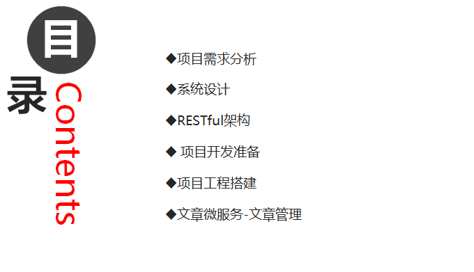


学习目标：

- 了解十次方项目需求；
- 了解前后端分离开发模式
- 理解RESTful
- 完成项目开发环境搭建
- 完成父工程、公共模块和文章微服务的搭建
- 掌握mybatis plus的使用，并开发完成文章微服务中文章的增删改查功能
- 掌握公共异常处理类的使用

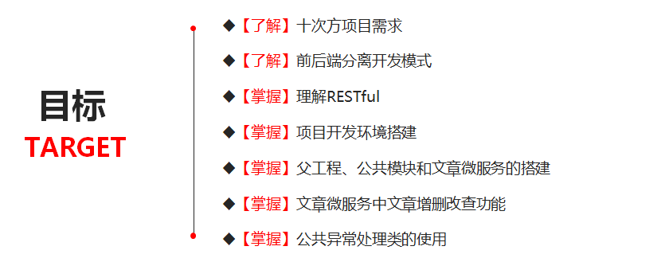


了解十次方项目需求

前后端分离开发模式

理解RESTful

完成项目开发环境搭建

完成父工程 公共模块 文章微服务的搭建

掌握Mybatis plus的使用   开发完成文章微服务中文章的增删改查功能 

掌握公共异常处理类的使用 


爱的十次方

1024

第一天 上午 

MySQL优化  深入学习


跑起来 

前后端分离 

了解需求的  整明白    面试的时候   问题  

理解RESTful   

严格  遵循   风格 


项目介绍   工程搭建


# 1 十次方项目需求分析

## 1.1 项目介绍

十次方是程序员的专属社交平台，包括头条、问答、活动、交友、吐槽、招聘六大频道。

十次方 程序员 专属社交平台


 头条  问答 活动 交友 吐槽 招聘 


头条  抖音  

看新闻  问答  活动 交友  学习  吐槽  招聘 

1024是程序员的专属社交平台 

定位  程序员的专属设计平台 


十次方名称的由来：2的10次方为1024，程序员都懂的。

爱的十次方  1024 

如果你是一位技术大咖，那么赶快发布文章，增加知名度吧。

如果你是一名技术小白，那么赶快到问答频道寻求帮助的，这里高手如云哦！

如果你不想错过各种技术交流会，那么请经常关注活动频道吧。

如果你还是单身，那么赶快到交友频道找到你心仪的另一半。

如果你有太多的苦恼，那么赶快吐个槽吧。

如果你正在找工作或是想跳槽拿高薪，那么来招聘频道淘金吧。

ten  square  十次方

## 1.2 项目需求

> 详见： 资源\文档\十次方需求规格说明书.docx

项目需求  

十次方需求规格说明书  

产品需求说明书

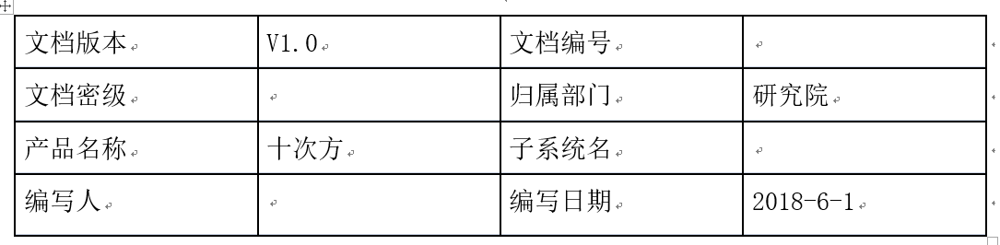

文档版本


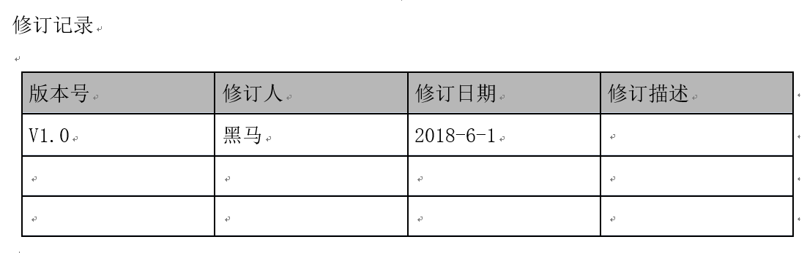


目录
一、简介	4
1、目的	4
2、范围	4
二、用户角色描述	4
三、产品概述	4
1、总体流程	4
2、功能摘要	4
四、产品特性	9
1、登录注册	9
1.1 业务流程图	9
1.2 特性描述	9
2、忘记密码/找回密码	11
2.1 业务流程图	11
2.2 特性描述	11
3、头条	13
3.1 业务流程图	13
3.2 特性描述	13
4、问答	20
4.1 业务流程图	20
4.2 特性描述	20
6、活动	24
6.1 业务流程图	24
6.2 特性描述	24
7、吐槽	26
7.1 业务流程图	26
7.2 特性描述	26
8、招聘	27
8.1 业务流程图	27
8.2 特性描述	27
9、社交	29
9.1 业务流程图	29
9.2 特性描述	31


# 一、简介

## 1、目的

此文档的目的主要是清晰、有层次的定义原型中各个模块的内容来源和相关逻辑

## 2、范围

此文档主要描述社交项目PC端页面涉及的功能点、以及部分交互细节。本文档的主要读者为前端工程师以及后端工程师。

# 二、用户角色描述

 

| 用户角色   | 用户描述                                                     |
| ---------- | ------------------------------------------------------------ |
| 非注册用户 | 仅限浏览平台相关信息，有分享权限                             |
| 注册用户   | 具有浏览、评论、点赞、分享、回答、收藏等权限，可申请专栏，不可发布专栏 |
| 专栏用户   | 可发布专栏                                                   |
| 管理员     | 可对平台所有信息进行管理，有屏蔽、删除权限                   |


非注册用户

仅限浏览平台相关信息 有分享权限

分享权限

注册用户

浏览 评论  点赞 分享 回答  收藏  申请专栏  不可发布专栏

专栏用户  可发布专栏

管理员   可对平台所有信息进行管理  有屏蔽 删除权限 


# 三、产品概述

## 1、总体流程

参见各版块

## 2、功能摘要

 


登录注册   

登录  用户通过手机号 邮箱  密码的形式登录网站

注册 用户手机号 验证码 密码的形式注册网站

三方登录 用户可以通过谷歌 github  微博 QQ 微信 领英  登录网站

登录后已有账号需要进行绑定  如没有账号则需要重新注册新账号进行绑定。

后台针对三方可以开发选择方式

找回密码  用户可以通过绑定的手机号 或 邮箱找回网站密码  

| 登录注册   | 登录                                                         | 用户通过手机号/邮箱+密码的形式登录网站                       |                                                             |
| ---------- | ------------------------------------------------------------ | ------------------------------------------------------------ | ----------------------------------------------------------- |
| 注册       | 用户手机号+验证码+密码的形式注册网站                         |                                                              |                                                             |
| 三方登录   | 用户可以通过谷歌/github/微博/QQ/微信/领英登录网站，登录后已有账号需要进行绑定，如没有账号则需要重新注册新账号进行绑定。（后台针对三方可以开放选择方式） |                                                              |                                                             |
| 找回密码   | 用户可以通过绑定的手机号或邮箱找回网站密码                   |                                                              |                                                             |
| 页头       | logo                                                         | 点击logo可返回网站首页（即头条页面）                         |                                                             |
| 导航       | 点击导航各个板块可进入对应页面（后台可针对各版块进行权重编辑） |                                                              |                                                             |
| 搜索       | 点击搜索输入关键词后，通过回车（Enter）搜索                  |                                                              |                                                             |
| 通知       | 点击可进入通知页面，当有通知时以小红点进行显示               |                                                              |                                                             |
| 发布       | 点击发布按钮可以发布头条、专栏、问答、吐槽                   |                                                              |                                                             |
| 个人中心   | 显示用户头像，点击可进入个人中心                             |                                                              |                                                             |
| 头条       | 分类                                                         | 显示所有资讯/专栏的分类列表（可在后台进行分类的增删改查）    |                                                             |
| 轮播       | 显示系统推荐文章（可在后台进行设置）                         |                                                              |                                                             |
| 活动推荐位 | 显示后台推荐的活动信息（可在后台进行设置）                   |                                                              |                                                             |
| 资讯列表   | 列表                                                         | 显示系统推荐的文章列表                                       |                                                             |
| 关注       | 点击关注按钮可对文章作者进行关注                             |                                                              |                                                             |
| 不感兴趣   | 点击不感兴趣后，系统将不推荐该类型文章                       |                                                              |                                                             |
| 侧栏       | 热门问答                                                     | 显示五条系统中最热门的问答列表                               |                                                             |
| 交友       | 向用户推荐3位相匹配的异性用户                                |                                                              |                                                             |
| 活动日历   | 显示五条最新的活动信息                                       |                                                              |                                                             |
| 广告位     | 显示系统广告位（后台可以进行设置）                           |                                                              |                                                             |
| 分享       | 网址                                                         | 输入需要采集的地址                                           |                                                             |
| 标题       | 显示文章的标题                                               |                                                              |                                                             |
| 频道       | 文章发布的分类                                               |                                                              |                                                             |
| 推荐语     | 输入推荐该文章的亮点、槽点或是自己的感悟                     |                                                              |                                                             |
| 自动获取   | 点击自动获取可通过网址自动获取文章的标题和描述               |                                                              |                                                             |
| 详情页     | 主体                                                         | 标题                                                         | 显示文章的标题                                              |
| 作者       | 显示文章的作者                                               |                                                              |                                                             |
| 时间       | 显示该文章发布时间（如修改则显示最后修改时间）               |                                                              |                                                             |
| 收藏       | 点击收藏后收藏数+1                                           |                                                              |                                                             |
| 正文       | 显示文章正文                                                 |                                                              |                                                             |
| 评论       | 可发布评论也可以回复别人的评论                               |                                                              |                                                             |
| 侧栏       | 作者                                                         | 显示作者基本信息（头像、名称、最近发布的5篇文章）点击关注按钮可以关注该作者，关注后当作者发布新文章后会在通知栏中显示 |                                                             |
| 热门推荐   | 显示系统推荐的文章列表（5条）                                |                                                              |                                                             |
| 热门吐槽   | 显示吐槽板块中热门吐槽（5条）                                |                                                              |                                                             |
| 申请专栏   | 专栏名称                                                     | 用于输入专栏名称（输入名称后系统自行检测是否重名，重名后则在输入框最后进行提示是否可用 |                                                             |
| 专栏地址   | 用于输入专栏地址（输入地址后系统需进行物理验证，尽可输入英文和数字，需要以英文开头，如地址不可用则在输入框最后进行提示） |                                                              |                                                             |
| 专栏简介   | 用于输入专栏简介（限140字）                                  |                                                              |                                                             |
| 发布头条   | 标题                                                         | 用于输入专栏标题（限30字内）                                 |                                                             |
| 分类       | 用于选择专栏所属分类                                         |                                                              |                                                             |
| 标签       | 用于输入标签（标签可用于文章推荐和搜索）                     |                                                              |                                                             |
| 正文       | Markdown 编辑器                                              |                                                              |                                                             |
| 问答       | 列表                                                         | 最新问答                                                     | 显示用户发布的最新问答列表，                                |
| 热门问答   | 显示问答系统中热门问答列表                                   |                                                              |                                                             |
| 等待回答   | 显示等待回答的问答列表                                       |                                                              |                                                             |
| 侧栏       | 发布                                                         | 可发布最新的问答内容                                         |                                                             |
| 热门标签   | 显示问答系统中使用次数最多的标签列表（标签数量可在后台进行设置） |                                                              |                                                             |
| 排行榜     | 显示问答系统中活跃活动排行（活跃的指标包括 发布/回答/评论/点赞） |                                                              |                                                             |
| 发布问题   | 可输入问题标题、标签、详细描述（提问可自动保存草稿，在同一浏览器中打开后可直接显示内容） |                                                              |                                                             |
| 详情页     | 显示问题的详细内容和相关回答（用户可在该页面完成对问题的评论、回答、点赞等操作） |                                                              |                                                             |
| 标签页     | 显示平台中所有的标签，常用标签通过分组形式展示（用户可以在该页面对已关注的标签进行编辑） |                                                              |                                                             |
| 标签详情   | 显示的相关介绍以及该标签下所有的问答、头条、职位、百科       |                                                              |                                                             |
| 全部标签   | 显示平台中所有的标签（标签按照热门程度进行排序）             |                                                              |                                                             |
| 活动       | 筛选                                                         | 可帅选活动的城市和类型                                       |                                                             |
| 列表       | 显示所有的活动列表（可以点击相关按钮选择我想参加还是报名）   |                                                              |                                                             |
| 详情页     | 显示活动的详细内容                                           |                                                              |                                                             |
| 吐槽       | 列表                                                         | 显示所有的吐槽列表（所有内容按最后更新进行排序）             |                                                             |
| 详情页     | 显示吐槽的详细内容和评论内容                                 |                                                              |                                                             |
| 发布吐槽   | 可以输入吐槽的详细内容，内容可以为文字或图文                 |                                                              |                                                             |
| 招聘       | 列表                                                         | 搜索                                                         | 可以通过关键词搜索相关职位可帅选职位城市                    |
| 推荐职位   | 显示4个系统推荐职位（可为人工or机器自动推荐）                |                                                              |                                                             |
| 最新职位   | 显示招聘系统中最新的职位列表                                 |                                                              |                                                             |
| 侧栏       | 显示热门企业前10名                                           |                                                              |                                                             |
| 详情页     |                                                              | 显示职位的详细内容（用户可以进行投递简历和收藏）             |                                                             |
| 搜索结果页 | 显示输入条件后的结果页                                       |                                                              |                                                             |
| 公司首页   | 显示公司的详细信息                                           |                                                              |                                                             |
| 公司招聘   | 显示现在公司正在招聘的信息详情                               |                                                              |                                                             |
| 交友       | 列表                                                         | 显示系统推荐的交友列表                                       |                                                             |
| 侧栏       | 消息                                                         | 显示互相喜欢用户聊天列表                                     |                                                             |
| 用户信息   | 显示用户认证和喜欢被喜欢数                                   |                                                              |                                                             |
| 发布       | 发布交友信息                                                 |                                                              |                                                             |
| 排行榜     | 显示平台中交友形式的排行数据                                 |                                                              |                                                             |
| 广告位     | 广告位                                                       |                                                              |                                                             |
| 好友列表   | 显示所有互相喜欢的用户列表                                   |                                                              |                                                             |
| 对话详情   | 显示用户对话详情页                                           |                                                              |                                                             |
| 完善信息   | 显示用户个人资料详情信息，可以对信息进行相关编辑、修改       |                                                              |                                                             |
| 个人中心   | 我的主页                                                     | 主页                                                         | 展示用户动态/提问的基本信息，详细信息需要到详细页面进行查看 |
| 我的回答   | 展示用户所有在平台中的回答并按时间降序进行排列               |                                                              |                                                             |
| 我的提问   | 展示用户在平台中所有提问并按时间降序进行排列                 |                                                              |                                                             |
| 我的分享   | 展示用户在平台中所有分享并按时间降序进行排列                 |                                                              |                                                             |
| 个人动态   | 展示用户在平台中所有操作，根据操作时间进行将序排列，不分组   |                                                              |                                                             |
| 我的关注   | 展示用户在平台中关注的问题和标签                             |                                                              |                                                             |
| 我的收藏   | 展示用户所有浏览的记录并按时间降序进行排列，可以通过点击清空按钮进行清空 |                                                              |                                                             |
| 浏览记录   | 展示用户详细信息，包括基本信息/工作情况/学历信息             |                                                              |                                                             |
| 账号设置   | 用户可以通过该页面管理自己账号相关内容，以及三方绑定情况     |                                                              |                                                             |
| 单页面     | 单页面                                                       | 显示对应文章内容                                             |                                                             |

 


发布  

头条 专栏  问题 吐槽  

头天 

分类

轮播

活动推荐位   显示后台推荐的活动信息 可在后台进行设置

资讯列表   


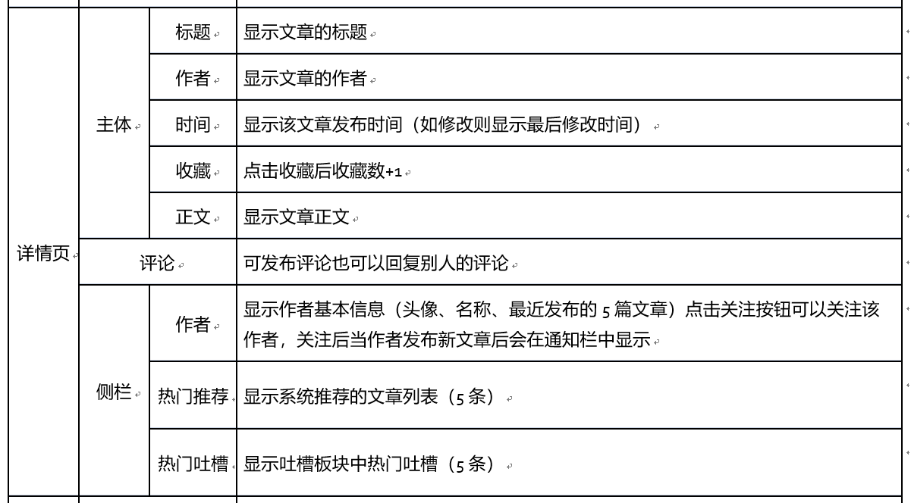


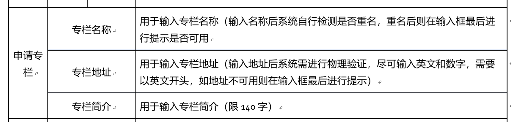


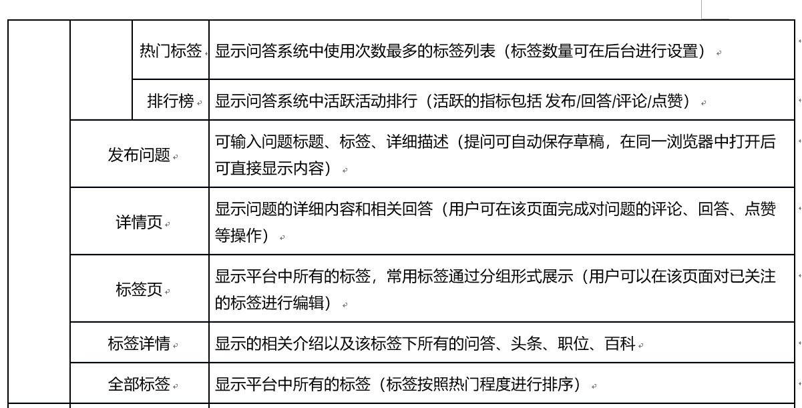


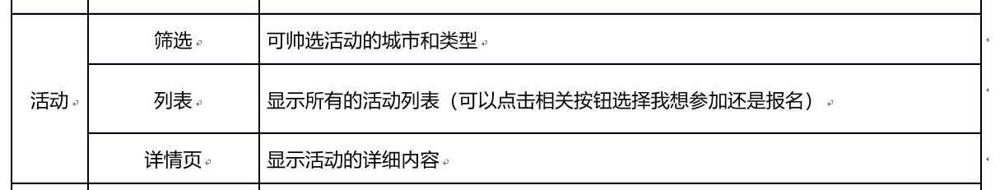


交友

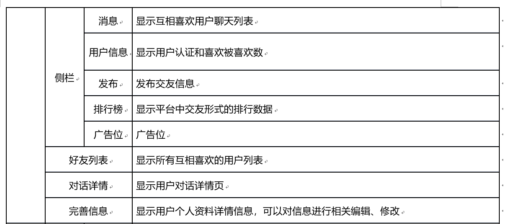


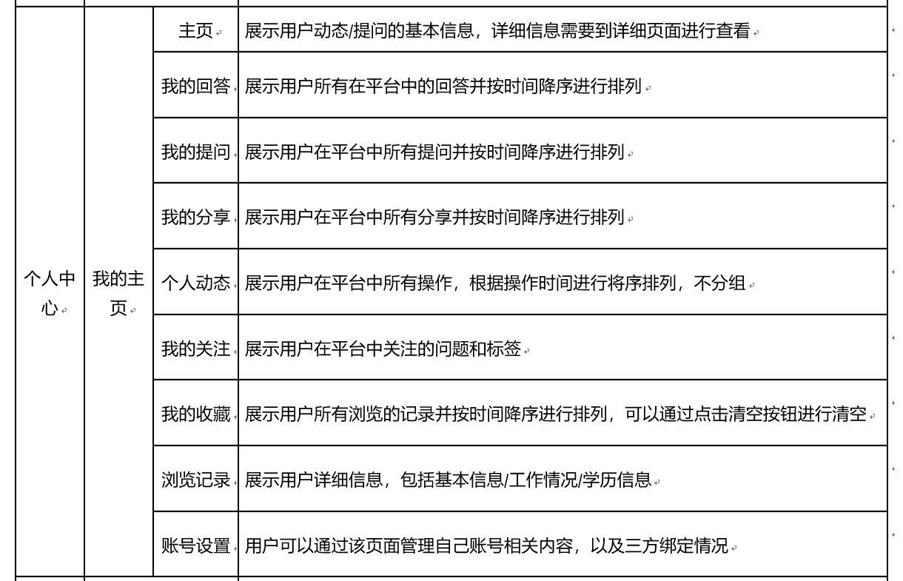


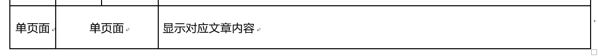

# 四、产品特性

## 1、登录注册

### 1.1 业务流程图

在线版本：https://www.processon.com/view/link/5a0ba695e4b049e7f4fd8d6d 

访问密码：itcast


通用注册登录流程

是否去注册  


### 1.2 特性描述

1.2.1 触发登录条件

当用户点击注册登录按钮时会触发注册登录流程或者用户在未登录情况下在头条板块进行发布、点赞、收藏操作；在问答板块进行回答、点赞、提问、评论、收藏、添加标签操作；在活动版块点击我想参加、立即报名、评论操作；在交友板块发布邀约、点击喜欢、不喜欢、私信按钮、完善信息操作；在吐槽板块评论、点赞、收藏操作；在招聘页面收藏、投简历操作 以上几个操作会触发注册登录条件。


触发登录条件

当用户点击注册登录按钮时会触发注册登录流程或者用户在未登录情况下在头条板块进行发布、点赞、收藏操作  


1.2.2 注册登录页面


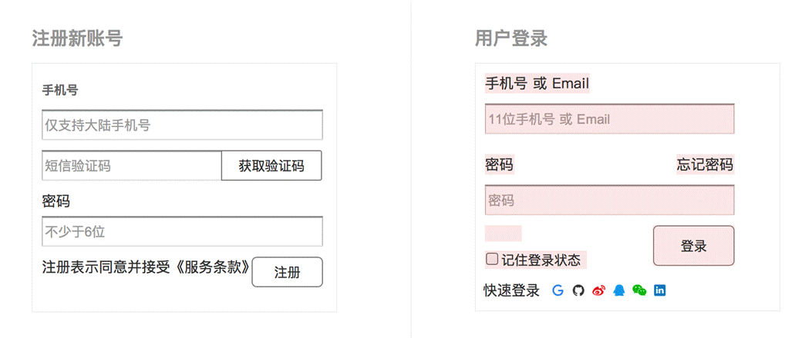

注册新账号

手机号  短信验证码  获取验证码

密码  不少于6位

注册


用户登录

手机号或Email

11位手机号  或 Email

密码  忘记密码

密码

记住登录状态  登录  

快速登录   Google Github Weibo QQ  Wechat  LindedIn


说明：

手机号：通过正则进行手机号码验证，包括位数和运营商字段

验证码：验证码共计6位，有效期5分钟，一分钟内禁止重复发送

密码：至少6位

密码没有验证  数字  字母 等等吗  

1.2.3 三方绑定页面

注册新账号模块


说明：

手机号：通过正则进行手机号码验证，包括位数和运营商字段

验证码：验证码共计6位，有效期5分钟，一分钟内禁止重复发送

 

## 2、忘记密码/找回密码

### 2.1 业务流程图

在线版本：https://www.processon.com/view/link/5a0baeeae4b0143a78b2a989

访问密码：itcast

 

通用找回密码流程

手机找回

邮箱找回

输入手机号码 


### 2.2 特性描述

2.2.1 忘记密码页面


 

 

说明：

1、手机号：输入手机号后通过异步进行检测是否为注册用户

2、找回密码：新密码和重复密码需一致后才可提交

 

手机号

输入手机号后通过一步进行检测是否为注册用户

找回密码 新密码和重复密码需一致后才可提交


找回密码

## 3、头条

### 3.1 业务流程图

在线版本：https://www.processon.com/view/link/5a0bd9c5e4b06bed41d0cec3

访问密码：itcast


普通用户 注册用户  专栏用户

进入网站  浏览文章   分享 

注册用户

发布分享 评论


### 3.2 特性描述

3.2.1 分类导航

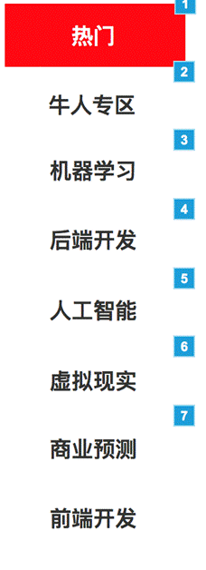

说明：

热门推荐机制：1、在没有浏览信息情况下 通过在问答社区关注标签进行相关头条推荐；2、在没有关注标签和浏览数据情况下，通过用户对默认推荐文章的喜好度进行文章的筛选；3、默认推荐平台中阅读量高的文章

后台：显示板块后台可进行控制和排序

 

 

3.2.2 幻灯片


 

说明：

1、幻灯片最多5条

2、幻灯片切换时间400毫秒

3、鼠标悬停后暂停轮播

 

 

3.2.3 活动展示位


说明：

推荐机制：默认推荐平台中关注度（浏览）高的活动推广图，如平台中有用户浏览数据或关注标签后，根据用户喜好进行推荐。

 

 

3.2.4 文章列表


 

说明：

标题：字数不超过30字符

简介：不超过2行

不感兴趣按钮：点击不感兴趣按钮后，该文章对应的标签将不会推荐给用户，对应内容块消失

 

3.2.4 最后浏览标签


 

说明：

时间：该时间为用户最后刷新网站到当前时间

 

3.2.5 热门问答


说明：

数量：侧栏推荐5条热门问答内容

推荐机制：根据用户浏览日志数据和问答板块关注标签进行推荐

 

 

3.2.6 遇见TA


说明：

推荐规则：默认推荐人气高的用户（浏览量），在获取用户相关浏览数据和兴趣资料后，通过智能推荐方式进行显示

 

3.2.7 活动日历

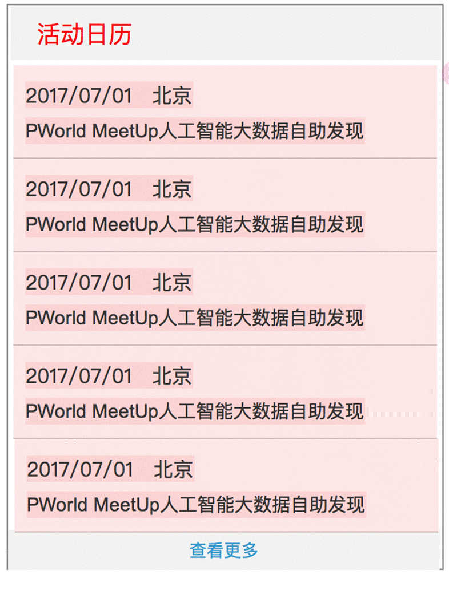

 

说明：

推荐机制：默认显示浏览量高的活动列表，当获取用户浏览信息和关注标签后，通过关注标签推荐相关活动内容

 

 

3.2.8 分享头条

 

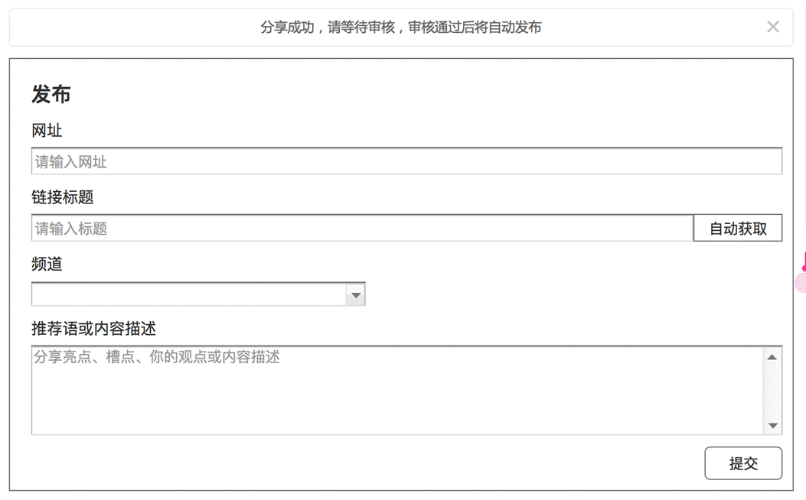

说明：

获取规则：输入网址后通过正则获取标题和内容描述

审核规则：1、标题和简介中不存在国家法律禁止的关键词；2、发布内容符合网站主题内容风格；3、在网站中不存在重复性内容。

 

3.2.9 申请专栏

 


 

说明：

用户申请专栏后系统自动检测是否何用，该检测重点检测是否重名，是否存在非法字符等。

专栏地址仅可使用英文和数字，必须以英文开头

专栏简介最多140字。

提交审核后系统自动审核，审核通过后用户开通发布专栏的权限。

审核规则：

1、专栏名称符合法律规定，无禁止关键词

2、无高度相似的专栏名称

 

3.2.10 发布专栏（头条）


 

说明：

1、专栏长度最长为30字符

2、 标签通过英文逗号和分号分隔

3、编辑器为Markdown 进行左右分栏展示

4、内容每隔30秒进行自动保存，关闭浏览器重启后内容依然可见

 

## 4、问答

### 4.1 业务流程图

在线版本：https://www.processon.com/view/link/5a0c0a89e4b06bed41d0fc8a

访问密码：itcast

 


### 4.2 特性描述

4.2.1 标签

说明：

\1. 用来标识用户的技术方向、问答列表内容会根据用户标签进行定向推荐。

\2. 用户在未选择的情况下 显示推荐标签（系统中浏览量最高的前5个标签）

\3. 关注标签没有数量限制，如一行显示不完直接进行隐藏可以点击更多进行编辑和排序

 

 

4.2.2 标签列表

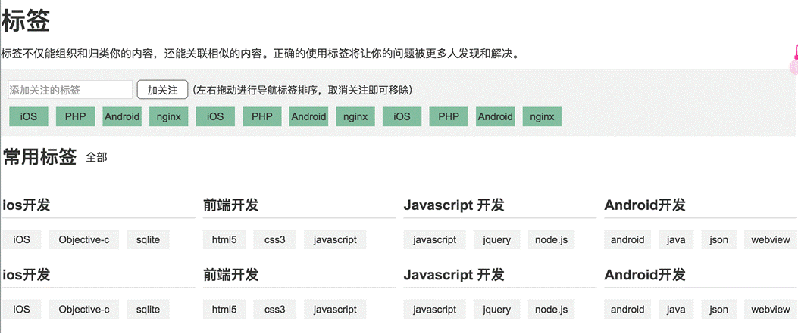

 

说明：
 1、通过搜索框可以搜索想要关注的标签，点击加关注按钮可以对标签进行关注。

\2. 搜索框下方显示的是已关注的标签可以通过拖动的形式对其进行重新排序，并直接影响导航栏中标签的顺序。

\3. 点击全部可进入全部标签的列表页面

\4. 鼠标放在标签正上方后，停顿超过1秒钟会显示浮窗效果

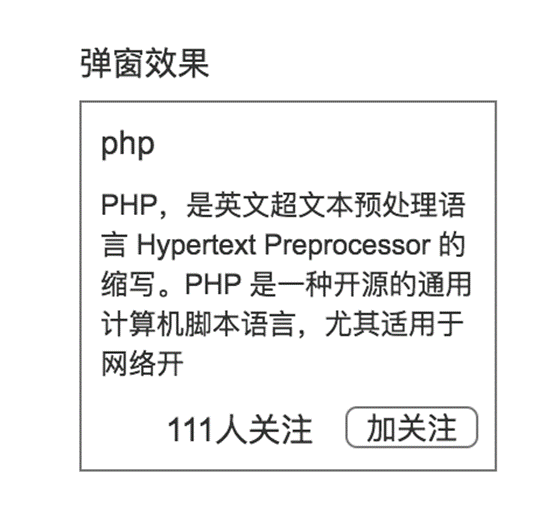

4.2.3 全部标签


说明：

\1. 点击加关注可以关注该标签

\2. 点击标签标题可进入标签的详情页

\3. 关注按钮旁显示关注该标签的用户数

 

4.2.4 标签详情


说明：

\1. 点击关注可关注该标签

\2. 点击标签详细介绍可进入百科界面

\3. 标签详细描述仅显示前140字符，超过140后以百科入口代替

\4. 点击 问答、文章、职位、百科可进入该标签对应的相关内容板块

\5. 点击排序 时间和得票数 可按照时间、得票数进行排序

\6. 每页显示10条记录，超过十条分页显示

4.2.5 提问

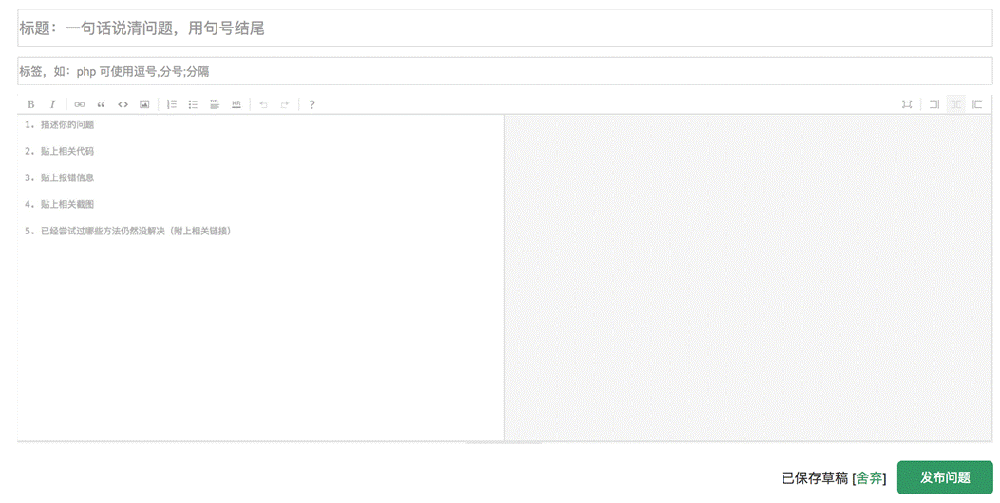

说明：

\1. 标题：标题不能超过64个有效字符，超过后在输入框正下方进行提示

\2. 标签：每次只能添加5个标签，超过后不能继续添加

\3. 编辑区：编辑器为markdown 左侧为源码，右侧可视化区域

\4. 内容30S/次的自动保存，浏览器关闭后下次打开依然可见

 

4.2.6 问题详情

 

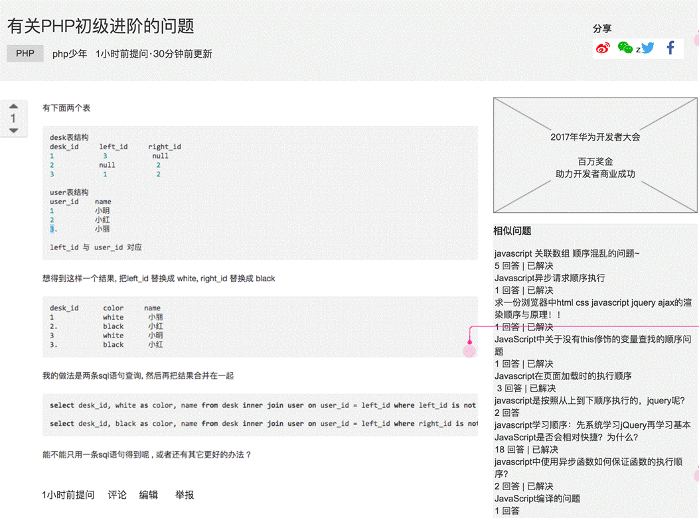说明：

\1. 时间：问题发布成功后，仅显示提问时间，提问规则为多久前提问，当作者对问题重新编辑后，则在发布时间后增加更新时间 规则同上一个时间

\2. 问题正文的左上角的箭头通过点击可对问题权重进行投票，向上为+1，向下为-1，每个用户仅可点击一次。

\3. 评论：点击后显示输入框

\4. 编辑：仅在作者页面显示，用户查看不显示

\5. 举报：点击举报可投诉该问题

 

## 6、活动

### 6.1 业务流程图

无

### 6.2 特性描述

6.2.1 筛选


说明：

两个筛选条件可符合筛选

城市和活动类型根据后台添加为准

 

6.2.2 列表


说明：

\1.   我想参加：点击我想参加后可对用户行为进行记录，作为交友板块推荐的一个指标

\2.   立即报名：可直接跳转到目标网址（官网）进行报名

\3.   点击标题、图片可进入详情页面

 

6.2.3 详情页


说明：

\1.   关注：点击关注主办方后可在通知栏中收到主办方新活动通知

 

## 7、吐槽

### 7.1 业务流程图

无

### 7.2 特性描述

7.2.1 列表


说明：

点赞：每用户可点击一次、赞越多 权重越高

收藏：点击收藏后可在我的收藏中找到

评论：点击评论可进入详情页面，并定位到评论窗口处

 

7.2.2 详情


 

说明：

匿名发布：用户名随机显示，用户注册成功后自动进行分配

评论：评论以弹窗形式呈现

 

7.2.3 发布


说明：

图片：最多长传3张图片

正文：最长140字

 

## 8、招聘

### 8.1 业务流程图

无

### 8.2 特性描述

8.2.1 搜索

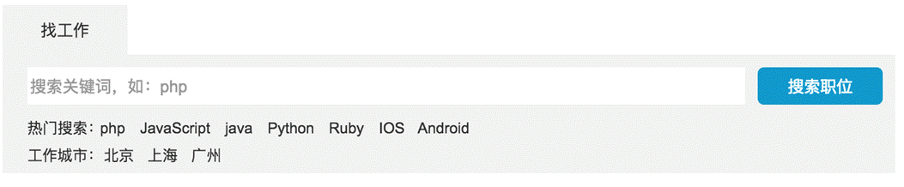

 

说明：

热门搜索：根据平台用户搜索习惯，显示排名前5的关键词

工作城市：根据平台中存在的公司城市进行显示，不存在的城市，则不显示

 

8.2.2 推荐职位


说明：

推荐职位根据用户标签进行定向显示，数量为4个

 

8.2.3 最新职位

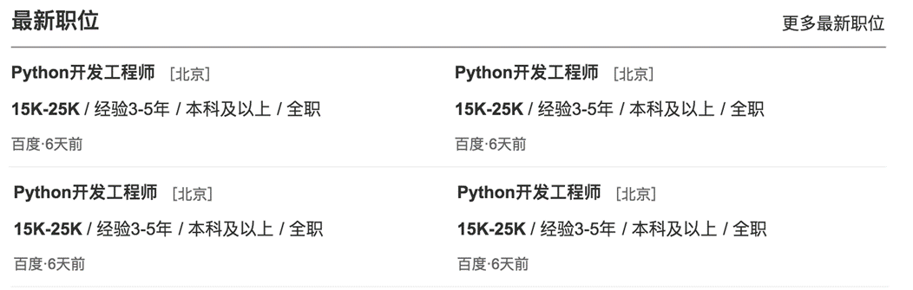

说明:

最新职位：根据时间进行倒叙排列

8.2.4 详情


说明：

收藏：点击收藏后收藏数加1，收藏后该企业发布的任何职位在通知栏中进行通知，再次点击取消收藏

浏览：每打开一次浏览数据加1

投简历：进入三方简历投递页面

发布日期：根据当前时间 显示发布时间 例如 1分钟前、1小时前、1天前、1周前等

## 9、社交

### 9.1 业务流程图

在线版本：https://www.processon.com/view/link/5a0d3cafe4b0d53d97999318

访问密码：itcast

 


### 9.2 特性描述

9.2.1 完善资料


说明：

当用户没有填写兴趣信息时，在列表页显示完善兴趣信息的提示。

 

9.2.2 列表


说明：

喜欢：用户点击喜欢后在对方列表中优先推荐，如对方也喜欢后则在通知栏进行通知，并可进行私信

不喜欢：当用户点击不喜欢后，对方讲被放入待选池中，在7天后将会重新被推荐。

私信：只有当双方都喜欢后才可进行私信，鼠标经过私信后会以提示框形式进行提示

推荐理由：显示双方在平台中相同点之处，包括：标签、活动、关注企业

9.2.3 我的消息


说明：

当用户配对成功后会在我的消息中自动进行提示，提示内容：恭喜，你的好友XXX也喜欢了你，他想邀请你一起看电影。

我的消息中可看到所有聊天记录

 

9.2.4 个人资料

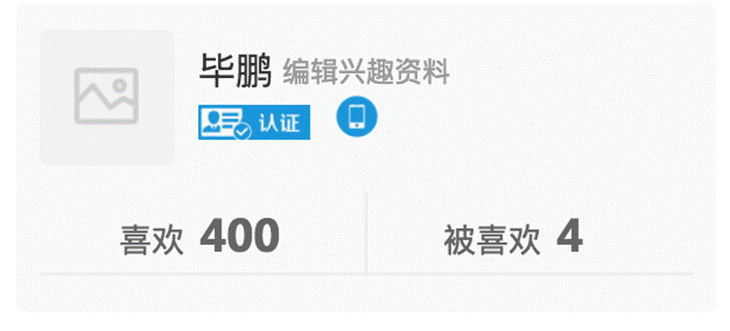

说明：

喜欢：用户每喜欢一个人则在次数显示一个喜欢数

被喜欢：改用户被其他用户喜欢数量。

 

9.2.5 消息中心


说明：

小红点：截止到用户点开未读信息数量

时间：显示最后一条信息接收（发送）时间

 

9.2.6 对话

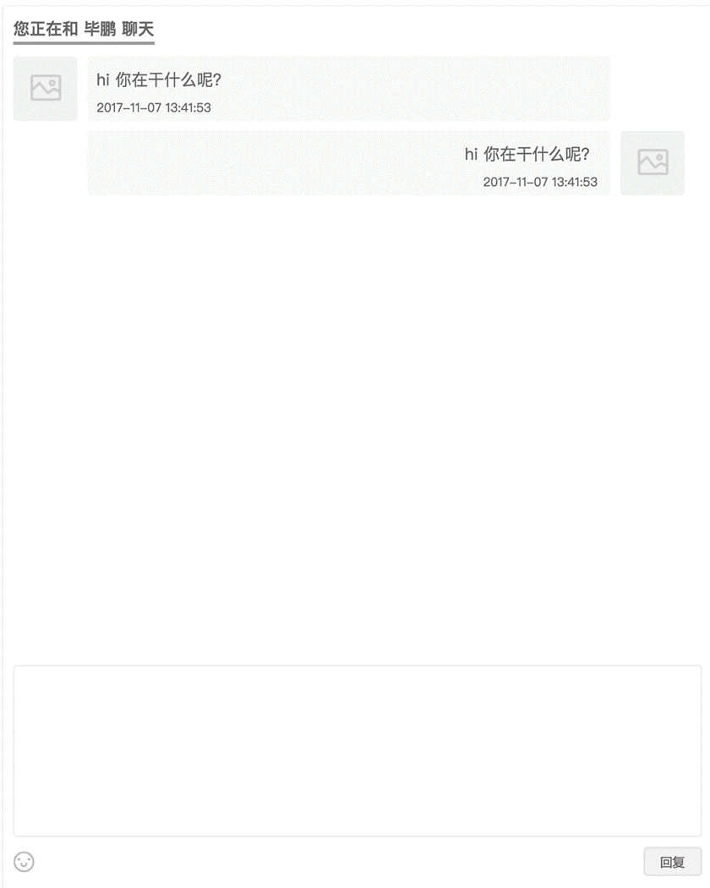

说明：

时间：显示消息发送成功的时间

表情：点击表情图标可在对话中添加表情，可选择开源表情列表

 

9.2.7 完善资料

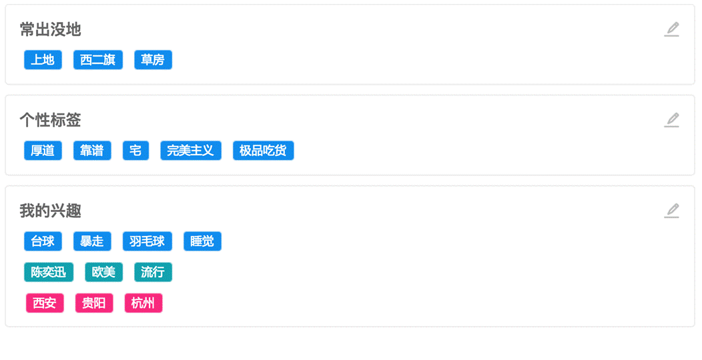

 

说明：

编辑：点击编辑图标可进入编辑模式

我的兴趣：第一行为喜欢的运动，第二行显示喜欢的明星，第三行显示去过的城市

 

9.2.8 资料编辑模式


 

说明：

输入标签后 点击添加可添加标签

直接点击常用标签可直接添加标签

 


# 2 系统设计

系统设计  


## 2.1 开发模式

十次方项目采用前后端分离的开发模式

开发模式   开发模型    ？？？


开发模型   健康

瀑布模型 

瀑布模型  需求分析 概要设计 简单的设计  初稿

什么情况

详细设计   各种各样  没有问题

设计问题 详细化


开发完了  交付

维护阶段   

传统类型   固定的套路  


运行了好几年  需求  小功能


敏捷开发  

沟通交流  及时  

以人为单位  马上解决    灵活  

一周发布一个版本  或者 修改完了代码 就可以发布版本   

改了就发布  开发人员   测试人员  


敏捷开发   


开发模式  

开发模型


瀑布模型  固定的

敏捷开发


技术  并发量  

## 2.2 技术选型

前后端分离

前端 

饿了么 ElementUI  NUXT 服务端渲染框架 NUXT 

Vue.js  NPM  Webpack  ESlint  Node.js  

后端  微服务

API文档规范　　


爬虫与智能分类


智能推荐

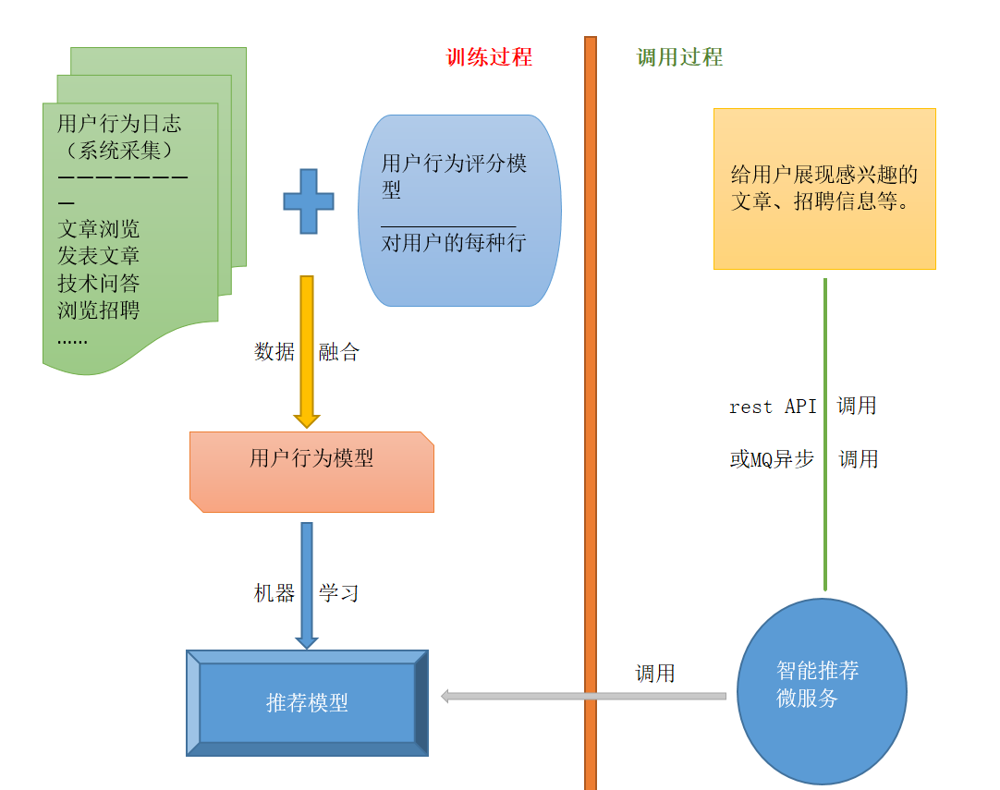

十次方功能架构图


十次方技术架构图


后端：springboot + springcloud + mybatis plus + mysql5.7

前端：nodejs + NUXT + elementUI + vue


持久化  

NUXT 前端渲染技术  

前端  后端  隔离开来  


MySQL5.7

基于Docker的  虚拟机 不会用本地的数据库  

没有必要的


一个系统管理员 能不能维护所有的 不能

超级的系统管理员  

Java  Python   前端 

频道  

也是管理员   


root  

软件工程


行业

OA ERP  传统的   局限的   针对系统  企业的  用户的并发量  

SSM     行业  

OA  办公自动化   企业的  人也不多  不是几千万  几个亿的

互联网的项目  

软件工程   

SpringCloud


软件工程 

china-pub.com


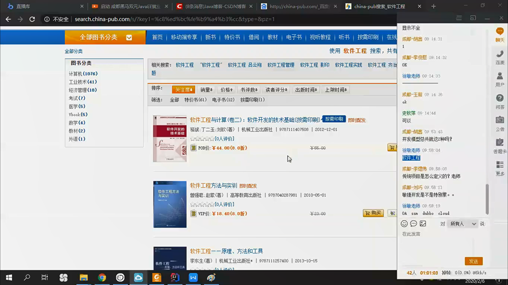


书  作者  博客   出版社


敏捷开发  是不是很累

功能要做的 


需求  一样的都有任务的   各种各样的事情

敏捷开发  需求经常变更     好处 快速迭代  响应开发 

双十一   Bug   用来多少秒  


开发就是感觉就是很累的


敏捷开发  需求经常变化 


修复Bug  一秒为单位的   变态


## 2.3 技术架构

采用前后端分离的系统架构

用户  管理员   

前端系统页面  前端页面接口路由微服务

后台管理系统页面  后台管理系统接口路由微服务


基础微服务

用户微服务

文章微服务

问答微服务

招聘微服务


接口  路由   好处多多  

路由 连接到对应的  

前端  找路由 


数据 存储  读取 

用户 管理员

前端  页面  后端 数据库 

## 2.4 微服务模块划分

| 模块名称            | 模块中文名称   |
| :------------------ | :------------- |
| tensquare_common    | 公共模块       |
| tensquare_base      | 基础微服务     |
| tensquare_article   | 文章微服务     |
| tensquare_friend    | 交友微服务     |
| tensquare_gathering | 活动微服务     |
| tensquare_qa        | 问答微服务     |
| tensquare_recruit   | 招聘微服务     |
| tensquare_user      | 用户微服务     |
| tensquare_spit      | 吐槽微服务     |
| tensquare_search    | 搜索微服务     |
| tensquare_web       | 前台微服务网关 |
| tensquare_manager   | 后台微服务网关 |
| tensquare_eureka    | 注册中心       |
| tensquare_config    | 配置中心       |
| tensquare_sms       | 短信微服务     |
| tensquare_notice    | 消息通知微服务 |

 gathering 聚集

技术  业务 划分

  我们这功能划分  

文章    

只有五天的时间   做项目  我要赶紧


服务划分    你是怎么划分呢


技术 方面  功能划分

还没那个企业功能划分  

MVC   功能划分    很多的项目

很多的项目    MVC + View  升级 项目   微服务   技术上面   换了SpringCloud

形容  人的神经元    拆分  很多很多的服务   调用   Http  交互 


数据库   

## 2.5 数据库表结构分析

分库 分表    互联网项目  数据量  如何保证数据问题 

每张表的数据变少了   速度快了  

操作数据库   服务器 

头条   问答  活动 交友 吐槽  招聘

持久化  存储     

功能模块  数据库  


用户模块  用户数据库  操作

基础  


数据库 有哪些表  哪个模块

API文档  

分库分表  

一般只有分库  没分表 

所有的在一个数据库   

数据量越来越大  都存储到一个系统中    总有满了的时候 

上限   分库   

用户数据库     文章数据库  文章数据库

以模块  数据库   功能  

多了几个数据库   一个服务器里面   多个数据库    存储一台服务器  MySQL

可以库   DBA      性能   

存储上限  数据库DBA   数据库数据量比较大 迁移到 其他服务器 

分库


分表    

文章  一个库的一个表 就存不下了  一张表   MySQL 一般支持百万级别

超了   急剧下降  索引     MySQL  索引   B+   树  深   三层   百万级

磁盘 磁道     数据库 不能让MySQL存储太多了


Oracle 支持千万级别   性能  比较高得  

分表了之后 查询问题   

Dubbo   哈希 

随机生成     分表解决性能问题   

数据库  拆分多个数据表  分库分表   

自己做的   有问题   

用其他的  


MyCat   


下一个 API介绍 


采用的分库分表设计，每个微服务模块为1个独立的数据库。

tensquare_article 文章

tensquare_base 基础

tensquare_friend 交友

tensquare_gathering 活动

tensquare_qa 问答

tensquare_recruit 招聘

tensquare_user 用户

tensquare_spit 吐槽

> 详见 资源\文档\十次方数据库文档.xlsx

 文章  

基本

交友

活动

问答

招聘

用户

吐槽

## 2.6 API文档

前后端分离开发   API文档 

怎么关联 

根据API文档开发  前端 去调  后端去开发 

Swagger   Nginx整合  

Nginx

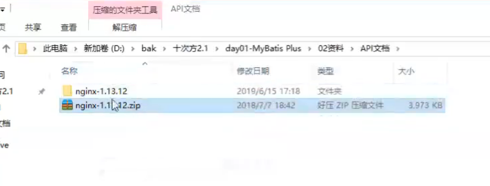


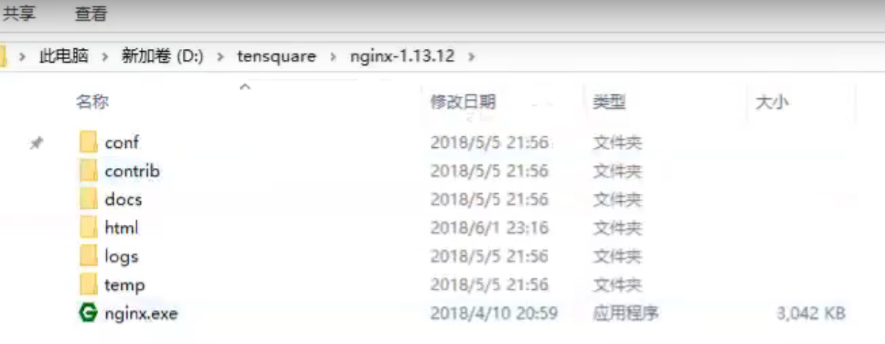


启动


如何访问呢  


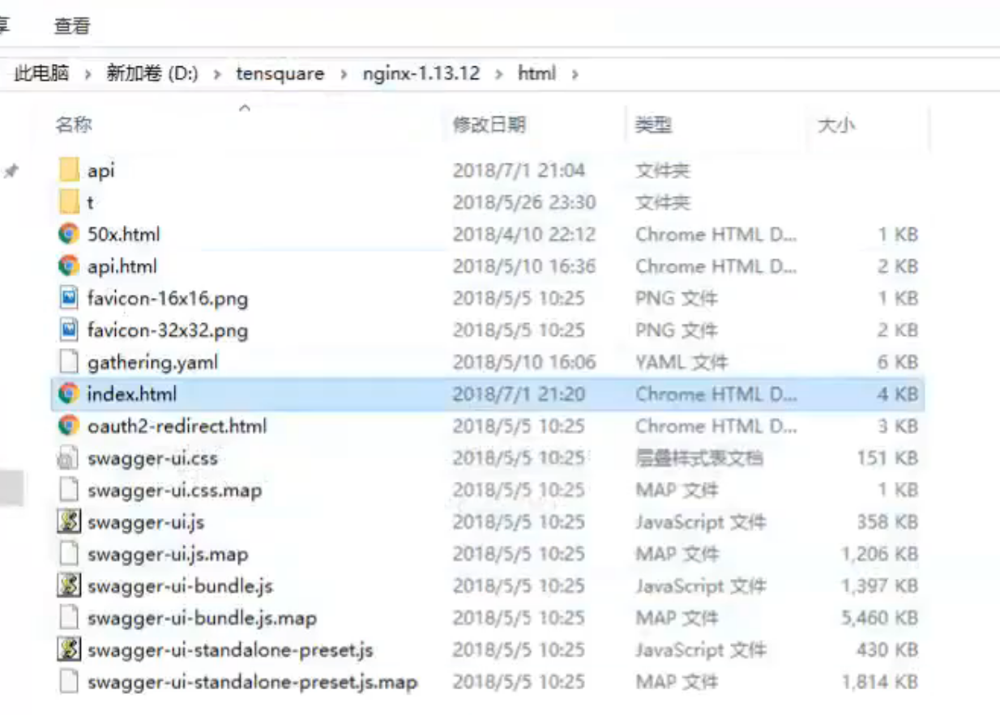


启动nginx


根据API文档   完成  接口的开发   

文档好了 


状态码   约定的  

和前端达成一致就行  


自己约定的  

前后端的   

接口开发


安装约定来  

使用起来  

API文档 搞定  

资料里面


2020-02-06

我应该在2020疫情搞的  

出现了问题  


使用Nginx  没有中文   不在C盘    

使用Nginx  目录没有中文   不在C盘      C盘权限    一些目录  

端口    index.html

访问API   Swagger 

商量以后的  状态码  到底是 什么代表成功  失败

休息十分钟  吧   Restful  API  


课程提供了前后端开发接口文档（采用Swagger语言进行编写），并与Nginx进行了整 合。双击Nginx执行文件启动后，在地址栏输入http://localhost:801 即可访问API文档

 

可能编码问题


C盘 权限  


简历的编写 

优势和劣势 


前后端约定的返回码列表：

| 状态描述         | 返回码 |
| :--------------- | :----- |
| 成功             | 20000  |
| 失败             | 20001  |
| 用户名或密码错误 | 20002  |
| 权限不足         | 20003  |
| 远程调用失败     | 20004  |
| 重复操作         | 20005  |


很多很多返回码吧

成功  

失败  


# 3 RESTful架构说明


线上上课   笔试  简历   来这里就是找工作的时候  

笔试 面试  几百页  就背了 

RESTful  架构  

**前后端分离开发模式说明**


前后端不分离时的开发流程
前后端分离时的开发流程 


产品经理提出需求  需求评审 

UI开发效果图  功能模块开发  页面  后端接口

各种菜是 发布上线 


产品经理提出需求

需求评审  UI开发效果图　　前端页面开发

编写接口文档　后端接口开发　

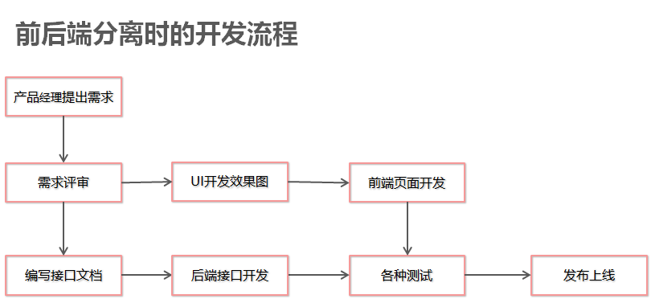


1.发现bug，可以快速定位，增加代码的可维护性

2.在大并发情况下，可以同时水平扩展前后端服务器

3.减少后端服务器的静态资源访问压力

4.后端服务超时或者宕机了，页面能正常访问，只不过数据刷不出来

5.支持页面热部署，不用重启服务器，前端可以无缝升级


## 3.1 何为RESTful

RESTful架构是目前最流行的一种互联网软件架构

是Roy Thomas Fielding在他2000年的博士论文中提出的

是Representational State Transfer的缩写，翻译过来是”表现层状态转化”

是所有Web应用都应该遵守的架构设计指导原则

7个HTTP方法：GET、POST、PUT、DELETE、PATCH、HEAD、OPTIONS

表现层状态转化 

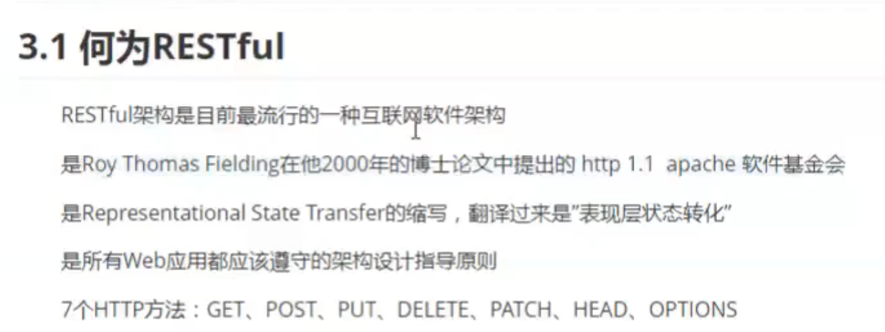


http协议 1.1

Web开发    基于http协议   

apache 软件基金会 

主要开发者  apache 服务器软件   搞协议的  写服务  

RESRful架构是目前最流行的一种互联网软件架构

互联网软件架构  

表现层 状态转化 

表现层状态转化

所有Web应用都应该遵守zun的架构设计指导原则


架构风格与基于网络的软件架构设计   博士论文  

理论  应用级开发 


Java  RESTful Web  Service实战  


Web  Service 


服务器之间的通信 


很长时间  发展   设置  接口   


7个HTTP方法：GET、POST、PUT、DELETE、PATCH、HEAD、OPTIONS

架构设计指导原则 

## 3.2 接口规范

十次方项目使用GET、POST、PUT、DELETE四种方法

幂等性：不论你请求多少次，资源的状态是一样的。

幂等的 

无论你请求一次  请求两次    请求资源不一致   不是幂等的


GET  请求  查询     id=1 

查询一次  查询一百次    资源一样的 没有变化的

资源状态  查询    安全 幂等的 


幂等性    无论你请求多少次  资源的状态是一样的

REST  把我们的请求规范起来 

Controller   指定  

Ajax     发起请求  


安全     接口幂等 


无论执行多少次


插入   insert   

执行十次   插入10个

执行十次  就一个  

幂等  不幂等 

MQ  消息的消费  重复操作  RabbitMQ

 出现了 重复操作   执行了多次   接口不幂等    出错的


GET   只是 查询    id  可能


POST 不安全   不幂等


POST  插入操作     不幂等  添加多个


PUT  天然幂等   项目的需求 可能不幂等的


DELETE   id  


安全  不安全  

对数据库  的数据  修改    

不安全的操作  


单看   PUT   幂等      实际呢 


更新


如何设计接口的幂等性  

insert   update 

select  不会对数据库修改 

delete     删了就删了 


雪花算法  

算一个  id  

不能重复  重复  插入 问题


插入 先查询   先决定是插入  还是更新   


id   插入  先查询有没有   有更新 没有 插入

token   随机字符串     放到Redis    你再操作  你已经执行了  更新  Redis没有 插入

验证   执行还是不执行  

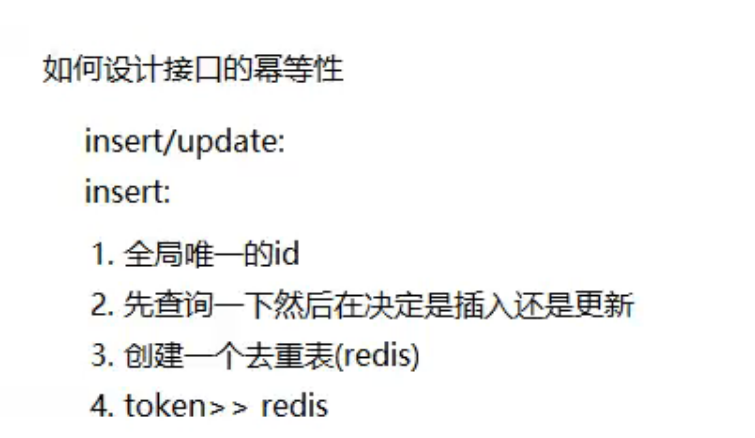


update 

多i版本控制    加一列    版本    version  看version    

1.0  2.0     同一个版本才会去更新   比如 1.0过来 更新了 2.0  已经  然后你又过来一个版本1.0的  我已经2.0了  重复操作   

 多版本控制   

类似

数据库    乐观锁      悲观锁   数据库实现了       

乐观锁底层实现  是多版本控制  


Version 


使用状态码  

status   更新     status=0  变了就不更新


场景   对应去选择   


500   idea  控制台 错误  去解决   看不明白 去翻译  

代码量    条件反射    异常自己去解决  

看懂一个大概 


马上看控制台   状态   


### 3.2.1 GET

- 安全且幂等
- 获取表示
- 变更时获取表示（缓存）

==适合查询类的接口使用==

 

### 3.2.2 POST

- 不安全且不幂等
- 使用服务端管理的（自动产生）的实例号创建资源
- 创建子资源
- 部分更新资源
- 如果没有被修改，则不过更新资源（乐观锁）

==适合数据提交类的接口使用x==

7个HTTP方法：GET、POST、PUT、DELETE、PATCH、HEAD、OPTIONS

请求一次  增加了一次  资源变化了  不幂等了

资源变化了      不安全   会改变资源   、

不幂等    请求一次  请求多次  资源的状态 是不一样的  

对资源来说是一样的 


### 3.2.3 PUT

- 不安全但幂等
- 用客户端管理的实例号创建一个资源
- 通过替换的方式更新资源
- 如果未被修改，则更新资源（乐观锁）

==适合更新数据的接口使用==


### 3.2.4 DELETE

- 不安全但幂等
- 删除资源

==适合删除数据的接口使用==

 第一次就删除   后面无论多少次删除   操作无用 


这个要记住    这个是HTTP协议定义的状态码  

 这个是通用的   

前面是我们自己定义的    


请求返回响应码：

| 代码    | 含义                                                         |
| :------ | :----------------------------------------------------------- |
| ==200== | （OK）- 如果现有资源已被更改                                 |
| 201     | （created）- 如果新资源被创建                                |
| 202     | （accepted）- 已接受处理请求但尚未完成（异步处理）           |
| 301     | （Moved Permanently）- 资源的URI被更新                       |
| 303     | （See Other）- 其他（如，负载均衡）                          |
| ==400== | （bad request）- 指代坏请求                                  |
| ==404== | （not found）- 资源不存在                                    |
| 406     | （not acceptable）- 服务端不支持所需表示                     |
| 409     | （conflict）- 通用冲突                                       |
| 412     | （Precondition Failed）- 前置条件失败（如执行条件更新时的冲突） |
| 415     | （unsupported media type）- 接受到的表示不受支持             |
| ==500== | （internal server error）- 通用错误响应                      |
| 503     | （Service Unavailable）- 服务当前无法处理请求                |


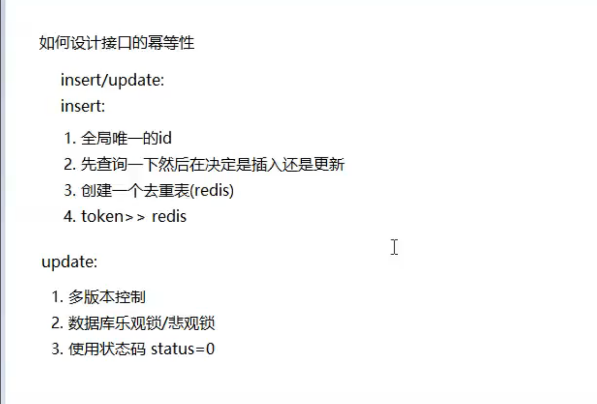


IDEA  控制台去看    错误  

条件反射  什么问题  

进入企业没人帮助你了  你也不会  不知道   人家都是自己摸索的


# 4 项目开发准备


虚拟机  

练习了  


专门的服务器   数据库 

服务的安装  部署  


虚拟环境


Docker   使用   


支持docker    CentOS7


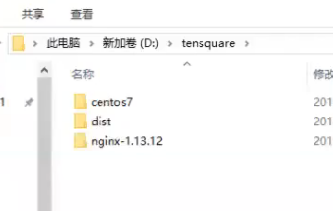


解压   打开   拖动一下 到对应的要解压的目录 就可以了的


## 4.1 开发环境

服务的安装与部署


- 虚拟系统环境 VMware Workstation
- 虚拟机系统 CentOS 7
- 容器 docker
- JDK1.8
- 数据库 mysql 5.7
- 开发工具 idea
- 项目构建工具 maven

所有的第三方工具如**mysql**等都是运行在docker容器中的


docker容器  我们使用的  


至少 1G    4G 


内存至少 


虚拟网络编辑器


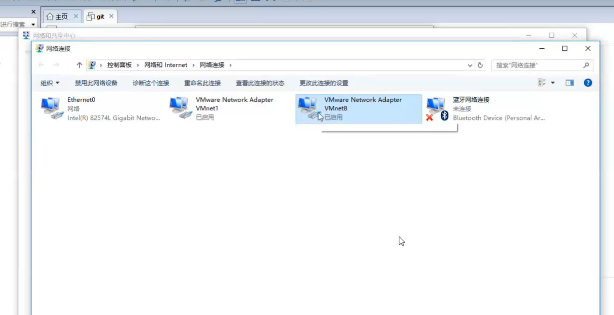


要改


一致  


跟着操作


DHCP 


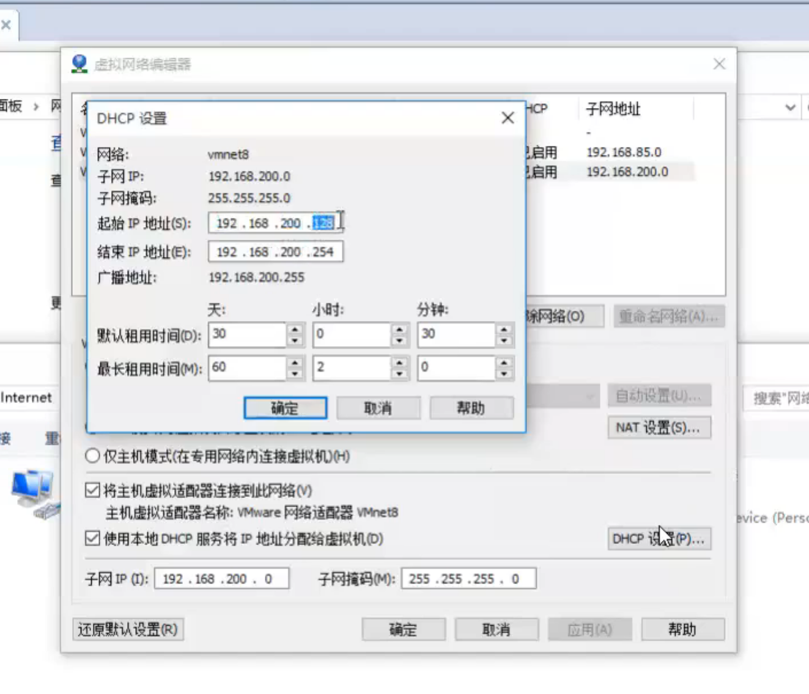


虚拟机  自动分配的

时间    到期 重新分配 


改久一点 


不一定  大概率  分配之前的 


最好一致的    


我已复制


一个工具  

熟练操作  

掌握 

连接一下 


ifconfig

192.168.200.128

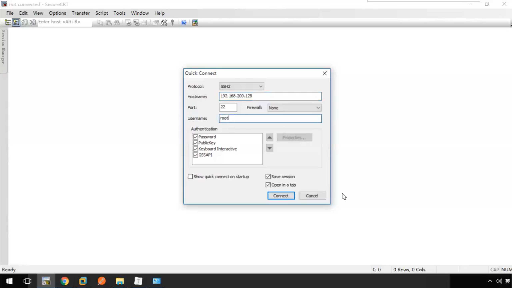


问题  


乱码的


Options


CentOS7 


没有Docker  自己装一个  

花钱就能解决的


下午2点   

上午直播没了 


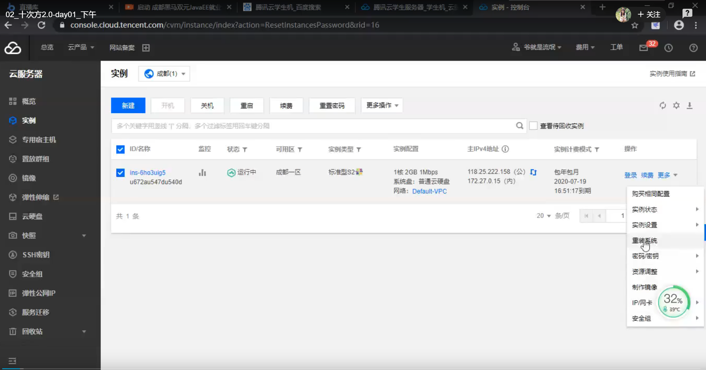


奉劝各位尽量不要看这种批量培训班的视频，对各位以后的发展没有一点好处。尽量看类似muke这样的独立开发者录制的视频，干货很多，也有很多有意义的建议，我个人就推荐这种或者能力更好的去看各高校的公开课。

门用他们的挺好的,何况人家也是紧跟着潮流,比起大多数培训机构,他算好的吧(ps:我不是托)

自我介绍

讲下快速排序，经典快排存在的问题

树的中序遍历实现

介绍下osi7层模型

是每个线程都会创建一个栈还是共用一个栈？

你有看过什么源码嘛？

【幼儿园扛把子】计算 积极向上 2020/7/25 23:43:31
1、自我介绍

2、讲下快速排序，经典快排存在的问题

3、1000万个取其中最大的100个数

3、1 MapReduce的设计思想，但是有内排序的问题

3、2堆排序，堆排序的过程

4、树的中序遍历实现

​	4.1递归

​	4.2借助栈

5、介绍下osi7层模型

6、arp协议缓存的过程

7、TCP的控制位

8、TCP的状态

9、TCP建连的状态

10、TCP的头部信息

11、jvm监控系统是通过jmx做的么？再改进中，用的jdk自带的工具

12、java内存结构

13、jvm的栈跟线程关系

14、是每个线程都会创建一个栈还是共用一个栈？

15、介绍volatile的功能

16、总线锁的副作用

17、内存屏障的汇编指令是啥？

18、你有看过什么源码嘛？AQS

19、介绍一下AQS

20、扯到了CAS的原理

21、AQS怎么阻塞当前线程

22、locksupport的park在jvm怎么实现的?

23、你了解垃圾回收吗？

24、垃圾回收器让工作线程停顿下来是怎么做的？

25、GC ROOts对象有几种？

26、gc roots怎么判断一个对象没有被引用？

二面

介绍项目

在java开发平时做了哪些项目

介绍下volatile

介绍下左连接、右连接、全连接查询

redis的应用场景

es的应用场景

mysql的索引和优化问题

【幼儿园扛把子】计算 积极向上 2020/7/25 23:43:42
\### 二面：

1、介绍项目

2、spark用的多吗？

3、在java开发平时做了哪些项目

4、看过源码吗？

5、介绍下ConcurrentHashMap

6、介绍下CAS

7、介绍下volatile

8、手写生产者和消费者

9、mysql的索引失效和优化问题

10、mysql的索引结构

11、回表操作分析

13、介绍下左连接、右连接、全连接查询

14、redis的应用场景

15、redis是单线程还是多线程

16、redis存在线程安全的问题吗？为什么

17、spring aop怎么使用及其原理

18、怎么实现远程rpc?

19、es的应用场景

20、服务被别人攻击，不断刷新页面，怎么解决这个问题


****

```
注：虚拟机的帐户名root 密码itcast
```

2020-08-26

liuawen

itcast


连接工具  Xshell


阿里云 腾讯云

阿里云防火墙 性能   安全  不允许


## 4.2 mysql建库建表

安装MySQL数据库 


```
docker -v 
systemctl status docker 
```


docker  images查看本地的镜像

docker pull 拉取一个 

docker  run 

docker ps 

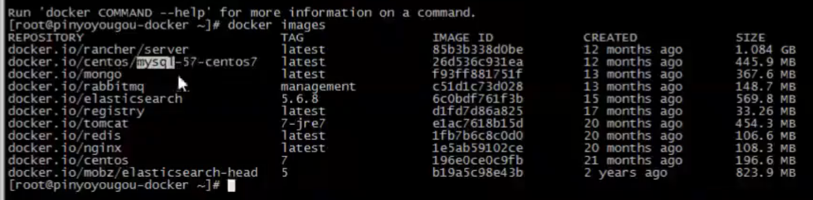


映射

宿主机  容器里面的

docker run -id --name=tensquare_mysql -p 3306:3306  -e  MYSQL_ROOT_PASSWORD=root  引用了那个镜像  

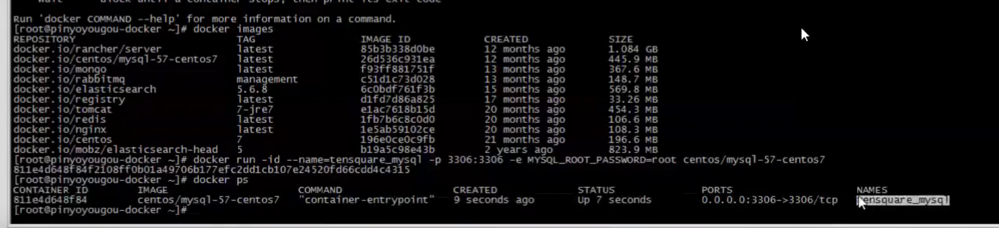


```
centos/mysql-57-centos7

docker run -id --name=tensquare_mysql -p 3306:3306  -e  MYSQL_ROOT_PASSWORD=root  centos/mysql-57-centos7
934545b082c68e355fa39fbe35094f684f268619641e4c57bf6de6af6d993b61

```


```
[root@liuawen ~]# docker images
REPOSITORY                          TAG                 IMAGE ID            CREATED             SIZE
docker.io/rancher/server            latest              85b3b338d0be        2 years ago         1.084 GB
docker.io/centos/mysql-57-centos7   latest              26d536c931ea        2 years ago         445.9 MB
docker.io/mongo                     latest              f93ff881751f        2 years ago         367.6 MB
docker.io/rabbitmq                  management          c51d1c73d028        2 years ago         148.7 MB
docker.io/elasticsearch             5.6.8               6c0bdf761f3b        2 years ago         569.8 MB
docker.io/registry                  latest              d1fd7d86a825        2 years ago         33.26 MB
docker.io/tomcat                    7-jre7              e1ac7618b15d        2 years ago         454.3 MB
docker.io/redis                     latest              1fb7b6c8c0d0        2 years ago         106.6 MB
docker.io/nginx                     latest              1e5ab59102ce        2 years ago         108.3 MB
docker.io/centos                    7                   196e0ce0c9fb        2 years ago         196.6 MB
docker.io/mobz/elasticsearch-head   5                   b19a5c98e43b        3 years ago         823.9 MB
[root@liuawen ~]#  docker run -id --name=tensquare_mysql -p 3306:3306  -e  MYSQL_ROOT_PASSWORD=root centos/mysql-57-centos7 
6c9d0f35389bd8412ed1e5be9bd05b2d93e1626eadfb296cb91912bb193c5e6f
[root@liuawen ~]#
```


错误了  


Unit is not loaded properly: Invalid argument.


```

8月 26 20:15:55 liuawen systemd[1]: [/usr/lib/systemd/system/docker.service:19] Unknown lvalue '--registry-mirror' in section 'Service'
8月 26 20:15:55 liuawen systemd[1]: [/usr/lib/systemd/system/docker.service:20] Unknown lvalue '--add-runtime docker-runc' in section 'Service'
8月 26 20:15:55 liuawen systemd[1]: docker.service lacks both ExecStart= and ExecStop= setting. Refusing.
8月 26 20:19:40 liuawen systemd[1]: [/usr/lib/systemd/system/docker.service:18] Trailing garbage, ignoring.
8月 26 20:19:40 liuawen systemd[1]: [/usr/lib/systemd/system/docker.service:19] Unknown lvalue '--registry-mirror' in section 'Service'
8月 26 20:19:40 liuawen systemd[1]: [/usr/lib/systemd/system/docker.service:20] Unknown lvalue '--add-runtime docker-runc' in section 'Service'
8月 26 20:19:40 liuawen systemd[1]: docker.service lacks both ExecStart= and ExecStop= setting. Refusing.
8月 26 20:23:03 liuawen systemd[1]: [/usr/lib/systemd/system/docker.service:18] Trailing garbage, ignoring.
8月 26 20:23:03 liuawen systemd[1]: [/usr/lib/systemd/system/docker.service:19] Unknown lvalue '--add-runtime docker-runc' in section 'Service'
8月 26 20:23:03 liuawen systemd[1]: docker.service lacks both ExecStart= and ExecStop= setting. Refusing.


```


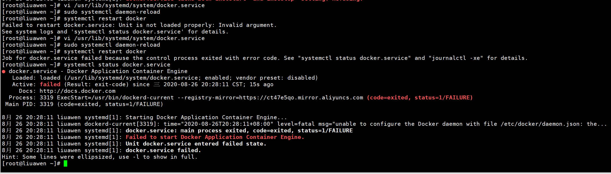


```
--registry-mirror=https://ct47e5qo.mirror.aliyuncs.com \

```


没配置好加速  

算了 

遛了

继续下一步


/usr/bin/docker-current: Error response from daemon: Conflict. The name "/tensquare_mysql" is already in use by container 6

**sudo docker container ls** 


全新的MySQL服务


今天搞文章  来来   敲代码  

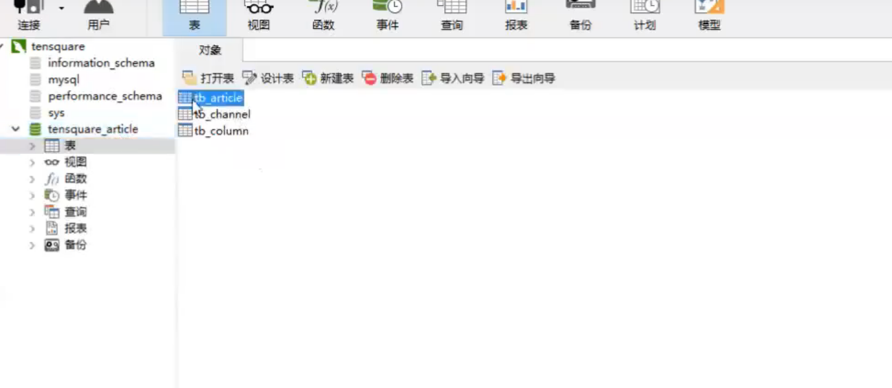

文章数据库 表  


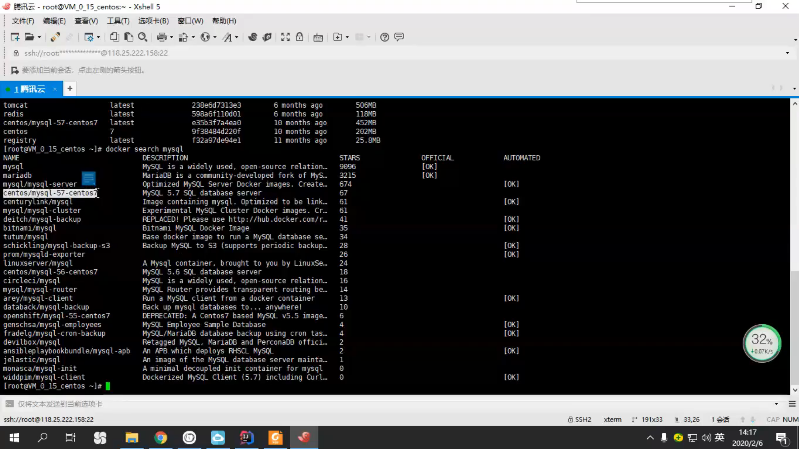


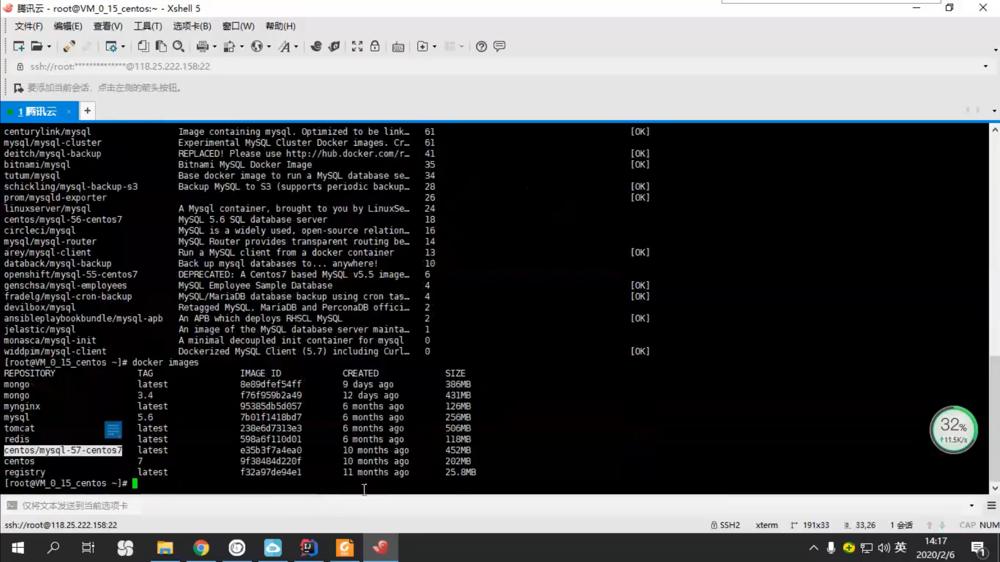


容器启动起来  


进入安装了docker的虚拟机中，按以下顺序执行命令

（1）下载镜像（此步可省略）

```
docker pull centos/mysql‐57‐centos7
```

注：docker默认从国外的镜像网站拉取镜像，速度很慢。可以使用国内的阿里云镜像加速站点提升镜像拉取速度。具体步骤可以参考文档

> docker配置国内镜像加速站点.pdf

（2）创建容器

```
docker run -di --name=tensquare_mysql -p 3306:3306 -e MYSQL_ROOT_PASSWORD=root centos/mysql-57-centos7
```

（3）连接MYSQL ，并执行资料中的建表脚本，创建article数据库

 

搞好了 不弄那么多操作 


分库分表的

tensquare article


docker  search  mysql

docker pull


问答


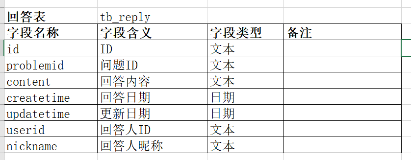


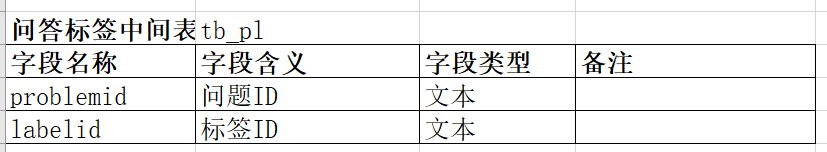


吐槽

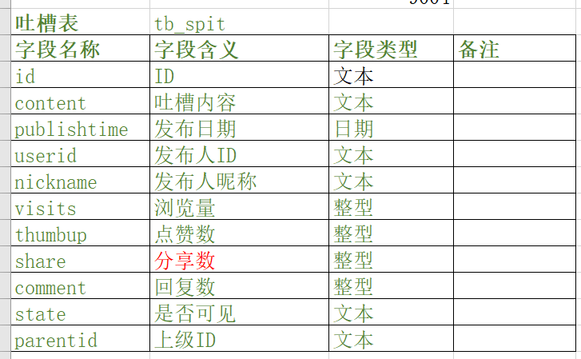


招聘

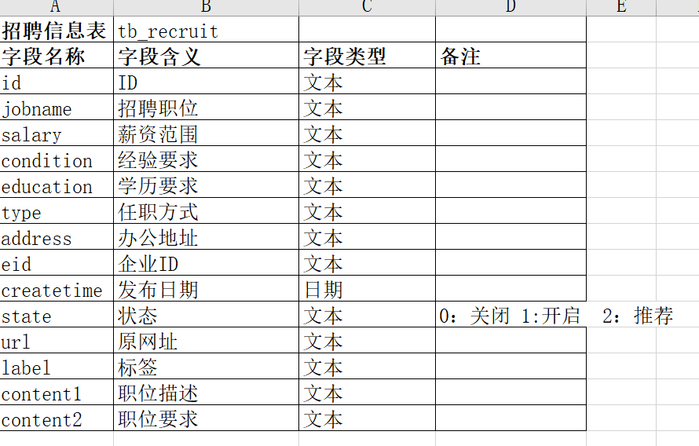

用户参加活动表

活动

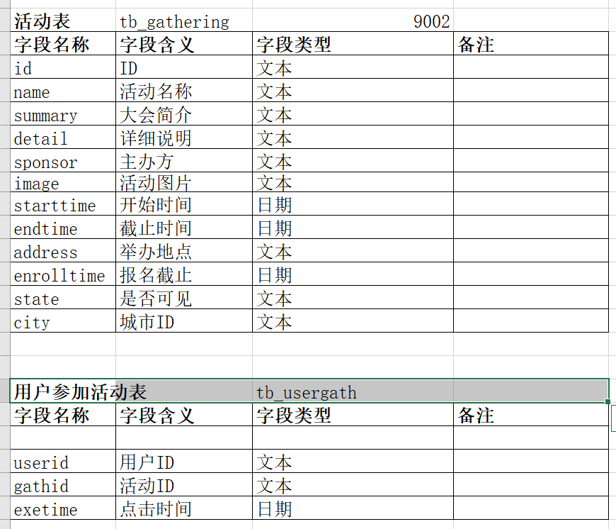

用户

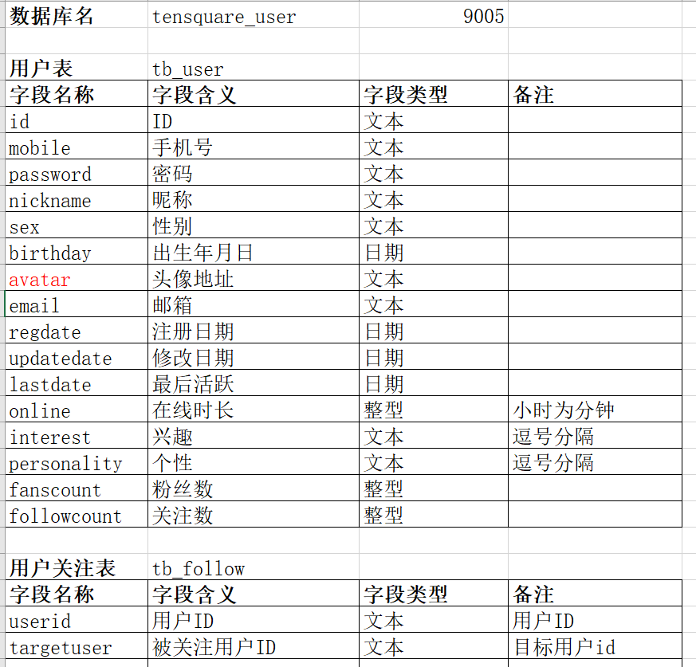


交友

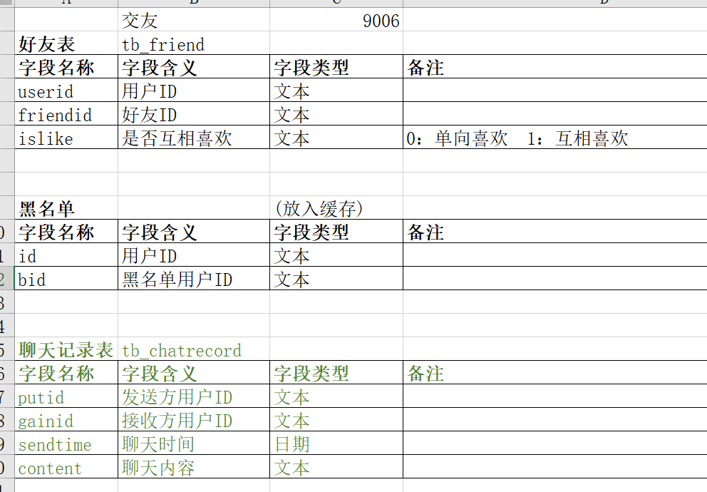


文章


基础


## 4.3 接口测试工具postman

postman是一款强大网页调试工具

- 能够发送任何类型的HTTP 请求 (GET，HEAD， POST，PUT。。。)
- 附带任意数量的参数


# 5 项目工程搭建


微服务  

一些列的


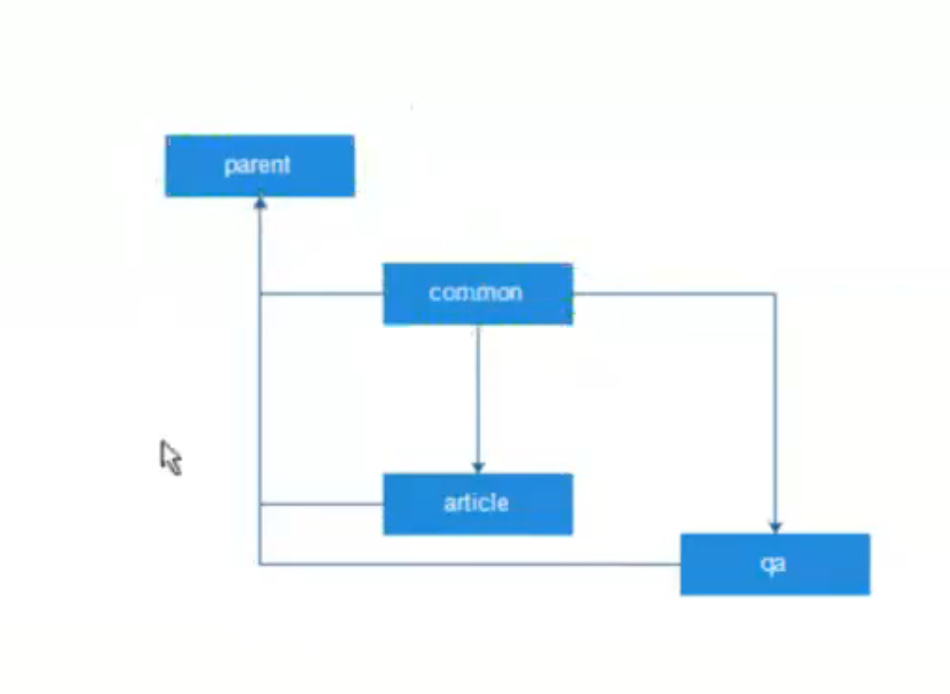


parent 

common

article 

qa


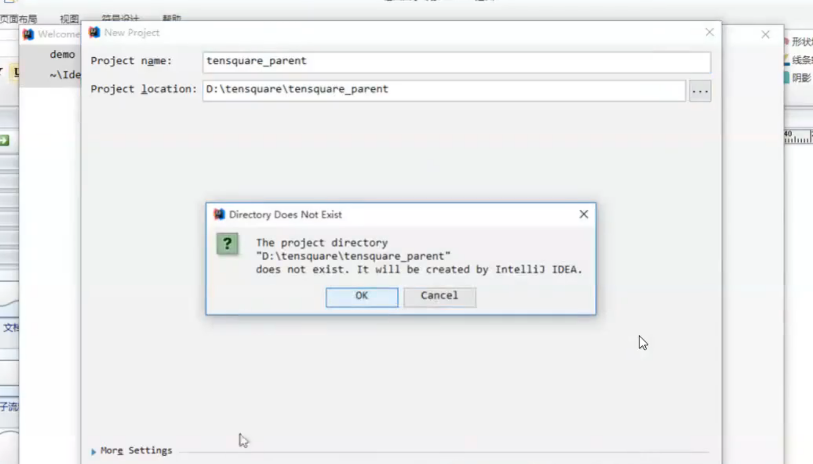


## 5.1 父工程搭建

创建项目类型为maven的父工程

1. 打开idea开发工具
2. 选择菜单file-new project ,弹出窗口中左侧菜单选择Maven ，点击next按钮


3.GroupId填写com.tensquare，ArtifacetId填写tensquare_parent，点击next按钮


点击Finish 完成

修改pom.xml文件，添加以下内容


```xml
    <parent>
        <groupId>org.springframework.boot</groupId>
        <artifactId>spring-boot-starter-parent</artifactId>
        <version>2.1.4.RELEASE</version>
        <relativePath/>
    </parent>

    <properties>
        <project.build.sourceEncoding>UTF-8</project.build.sourceEncoding>
        <project.reporting.outputEncoding>UTF-8</project.reporting.outputEncoding>
        <java.version>1.8</java.version>
        <maven.compiler.source>1.8</maven.compiler.source>
        <maven.compiler.target>1.8</maven.compiler.target>
        <mybatisplus-spring-boot-starter.version>1.0.5</mybatisplus-spring-boot-starter.version>
        <mybatisplus.version>2.2.0</mybatisplus.version>
        <fastjson.version>1.2.39</fastjson.version>
        <gson.version>2.8.0</gson.version>
    </properties>

    <dependencies>
        <dependency>
            <groupId>org.springframework.boot</groupId>
            <artifactId>spring-boot-starter-web</artifactId>
        </dependency>
        <dependency>
            <groupId>org.springframework.boot</groupId>
            <artifactId>spring-boot-starter-test</artifactId>
            <scope>test</scope>
        </dependency>
    </dependencies>
    
    <repositories>
        <repository>
            <id>spring-snapshots</id>
            <name>Spring Snapshots</name>
            <url>https://repo.spring.io/snapshot</url>
            <snapshots>
                <enabled>true</enabled>
            </snapshots>
        </repository>
        <repository>
            <id>spring-milestones</id>
            <name>Spring Milestones</name>
            <url>https://repo.spring.io/milestone</url>
            <snapshots>
                <enabled>false</enabled>
            </snapshots>
        </repository>
    </repositories>

    <pluginRepositories>
        <pluginRepository>
            <id>spring-snapshots</id>
            <name>Spring Snapshots</name>
            <url>https://repo.spring.io/snapshot</url>
            <snapshots>
                <enabled>true</enabled>
            </snapshots>
        </pluginRepository>
        <pluginRepository>
            <id>spring-milestones</id>
            <name>Spring Milestones</name>
            <url>https://repo.spring.io/milestone</url>
            <snapshots>
                <enabled>false</enabled>
            </snapshots>
        </pluginRepository>
    </pluginRepositories>
```

spring boot 


## 5.2 搭建公共子模

搭建公共子模


parent


一些仓库 


代码里面复制


仓库  下载  地址     不快  就阿里云镜像  


阿里云镜像


关调  重新打开下


Close  Project

注释掉  关调去 


搭建公共子模块 

### 5.2.1 搭建子模块步骤

1. 右键点击父工程tensquare_parent，选择 New -> Module 弹出窗口选择Maven ,点击next按钮
2. ArtifacetId填写tensquare_common，点击next按钮


1. 点击finish

 

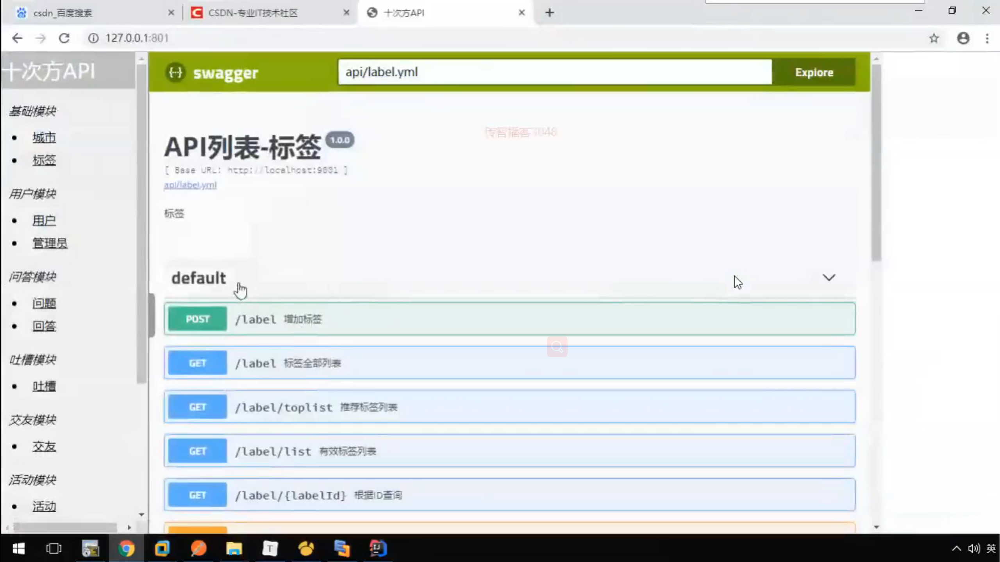


### 5.2.2 创建公共实体类和工具类

code 

flag 

message

data

返回的数据结构  

Boolean

Integer 

String

Object


Get  Set  toString

1. 新建com.tensquare.entity包，包下创建Result类，用于controller返回结果

```java
public class Result {
    private boolean flag;//是否成功
    private Integer code;// 返回码
    private String message;//返回信息
    private Object data;// 返回数据

    public Result(boolean flag, Integer code, String message, Object data) {

        super();        
        this.flag = flag;        
        this.code = code;        
        this.message = message;        
        this.data = data;        
    }    
    
    public Result() { }
 
    public Result(boolean flag, Integer code, String message) {    
        super();        
        this.flag = flag;        
        this.code = code;        
        this.message = message;        
    }    
   
    public boolean isFlag() {    
        return flag;        
    }    

    public void setFlag(boolean flag) {    
        this.flag = flag;        
    }

    public Integer getCode() {    
        return code;        
    }    

    public void setCode(Integer code) {    
        this.code = code;        
    }

    public String getMessage() {    
        return message;        
    }

    public void setMessage(String message) {    
        this.message = message;        
    }   

    public Object getData() {    
        return data;        
    }    

    public void setData(Object data) {    
        this.data = data;        
    }    
}
 

创建类PageResult ，用于返回分页结果

public class PageResult<T>  {
    private Long total;
    private List<T> rows;
    
    public PageResult(Long  total,  List<T>  rows)  {
        super();
        this.total  =  total;
        this.rows  =  rows;
    }
    
    //getter  and  setter  ....
}
```


```java
package entity;

public class Result {

    private Boolean flag;
    private Integer code;
    private String message;
    private Object data;

    public Result() {
    }

    public Result(Boolean flag, Integer code, String message) {
        this.flag = flag;
        this.code = code;
        this.message = message;
    }

    public Result(Boolean flag, Integer code, String message, Object data) {
        this.flag = flag;
        this.code = code;
        this.message = message;
        this.data = data;
    }

    public Boolean getFlag() {
        return flag;
    }

    public void setFlag(Boolean flag) {
        this.flag = flag;
    }

    public Integer getCode() {
        return code;
    }

    public void setCode(Integer code) {
        this.code = code;
    }

    public String getMessage() {
        return message;
    }

    public void setMessage(String message) {
        this.message = message;
    }

    public Object getData() {
        return data;
    }

    public void setData(Object data) {
        this.data = data;
    }

    @Override
    public String toString() {
        return "Result{" +
                "flag=" + flag +
                ", code=" + code +
                ", message='" + message + '\'' +
                ", data=" + data +
                '}';
    }
}
```


创建类PageResult ，用于返回分页结果

PageResult 用于返回分页结果   分页查询  

total  rows 

里面是啥呢 为什么都可以 


toString   get  set 

有参的   无参的 


分页查询

```java
public class PageResult<T>  {
    private Long total;
    private List<T> rows;
    
    public PageResult(Long  total,  List<T>  rows)  {
        super();
        this.total  =  total;
        this.rows  =  rows;
    }
    
    //getter  and  setter  ....
}
```

PageResult

```java
package entity;

import java.util.List;

public class PageResult<T> {

    private Long total;

    private List<T> rows;

    public PageResult() {
    }

    public PageResult(Long total, List<T> rows) {

        this.total = total;
        this.rows = rows;
    }

    public Long getTotal() {
        return total;
    }

    public void setTotal(Long total) {
        this.total = total;
    }

    public List<T> getRows() {
        return rows;
    }

    public void setRows(List<T> rows) {
        this.rows = rows;
    }

    @Override
    public String toString() {
        return "PageResult{" +
                "total=" + total +
                ", rows=" + rows +
                '}';
    }
}
```


维护状态类表    


3.返回码定义类


```java
package entity;

public class StatusCode {
    public static final int OK=20000;//成功
    public static final int ERROR =20001;//失败
    public static final int LOGINERROR =20002;//用户名或密码错误
    public static final int ACCESSERROR =20003;//权限不足
    public static final int REMOTEERROR =20004;//远程调用失败
    public static final int REPERROR =20005;//重复操作
}
```


```java
public class StatusCode {
    public static final int OK=20000;//成功
    public static final int ERROR =20001;//失败
    public static final int LOGINERROR =20002;//用户名或密码错误
    public static final int ACCESSERROR =20003;//权限不足
    public static final int REMOTEERROR =20004;//远程调用失败
    public static final int REPERROR =20005;//重复操作

    
```

1. 分布式ID生成器

   课程中已经提供了分布式ID生成器

   > 资源\微服务相关\工具类\IdWorker.java

   tensquare_common工程创建util包，将IdWorker.java直接拷贝到tensquare_common工程的util包中。

 

分布式的架构  

分库分表 数据量比较大


每台设备不一样  

工作机器  序列号 

一台服务器需要生成多个id   序列号 

雪花算法  

时间戳  工作机器 序列号

不能使用数据库本身的自增功能来产生主键值，原因是生产环境为分片部署的。

使用snowflake （雪花）算法（twitter出品）生成***唯一\***的主键值


- 41bit的时间戳可以支持该算法使用到2082年
- 10bit的工作机器id可以支持1024台机器
- 序列号支持1毫秒产生4096个自增序列id
- 整体上按照时间自增排序
- 整个分布式系统内不会产生ID碰撞
- 每秒能够产生26万ID左右

雪花算法  

时间戳  工作机器  序列号  


64位  一位不使用

41 时间戳 10工作机器  12序列号

原理搞明白 

理论上  可以使用 

不考虑什么什么的   理解算法原理   


腾讯云 单纯装了Linux


工具类 


工作机器id 

```java
package util;

import java.lang.management.ManagementFactory;
import java.net.InetAddress;
import java.net.NetworkInterface;

/**
 * <p>名称：IdWorker.java</p>
 * <p>描述：分布式自增长ID</p>
 * <pre>
 *     Twitter的 Snowflake　JAVA实现方案
 * </pre>
 * 核心代码为其IdWorker这个类实现，其原理结构如下，我分别用一个0表示一位，用—分割开部分的作用：
 * 1||0---0000000000 0000000000 0000000000 0000000000 0 --- 00000 ---00000 ---000000000000
 * 在上面的字符串中，第一位为未使用（实际上也可作为long的符号位），接下来的41位为毫秒级时间，
 * 然后5位datacenter标识位，5位机器ID（并不算标识符，实际是为线程标识），
 * 然后12位该毫秒内的当前毫秒内的计数，加起来刚好64位，为一个Long型。
 * 这样的好处是，整体上按照时间自增排序，并且整个分布式系统内不会产生ID碰撞（由datacenter和机器ID作区分），
 * 并且效率较高，经测试，snowflake每秒能够产生26万ID左右，完全满足需要。
 * <p>
 * 64位ID (42(毫秒)+5(机器ID)+5(业务编码)+12(重复累加))
 *
 * @author Polim
 */
public class IdWorker {
    // 时间起始标记点，作为基准，一般取系统的最近时间（一旦确定不能变动）
    private final static long twepoch = 1288834974657L;
    // 机器标识位数
    private final static long workerIdBits = 5L;
    // 数据中心标识位数
    private final static long datacenterIdBits = 5L;
    // 机器ID最大值
    private final static long maxWorkerId = -1L ^ (-1L << workerIdBits);
    // 数据中心ID最大值
    private final static long maxDatacenterId = -1L ^ (-1L << datacenterIdBits);
    // 毫秒内自增位
    private final static long sequenceBits = 12L;
    // 机器ID偏左移12位
    private final static long workerIdShift = sequenceBits;
    // 数据中心ID左移17位
    private final static long datacenterIdShift = sequenceBits + workerIdBits;
    // 时间毫秒左移22位
    private final static long timestampLeftShift = sequenceBits + workerIdBits + datacenterIdBits;

    private final static long sequenceMask = -1L ^ (-1L << sequenceBits);
    /* 上次生产id时间戳 */
    private static long lastTimestamp = -1L;
    // 0，并发控制
    private long sequence = 0L;

    private final long workerId;
    // 数据标识id部分
    private final long datacenterId;

    public IdWorker(){
        this.datacenterId = getDatacenterId(maxDatacenterId);
        this.workerId = getMaxWorkerId(datacenterId, maxWorkerId);
    }
    /**
     * @param workerId
     *            工作机器ID
     * @param datacenterId
     *            序列号
     */
    public IdWorker(long workerId, long datacenterId) {
        if (workerId > maxWorkerId || workerId < 0) {
            throw new IllegalArgumentException(String.format("worker Id can't be greater than %d or less than 0", maxWorkerId));
        }
        if (datacenterId > maxDatacenterId || datacenterId < 0) {
            throw new IllegalArgumentException(String.format("datacenter Id can't be greater than %d or less than 0", maxDatacenterId));
        }
        this.workerId = workerId;
        this.datacenterId = datacenterId;
    }
    /**
     * 获取下一个ID
     *
     * @return
     */
    public synchronized long nextId() {
        long timestamp = timeGen();
        if (timestamp < lastTimestamp) {
            throw new RuntimeException(String.format("Clock moved backwards.  Refusing to generate id for %d milliseconds", lastTimestamp - timestamp));
        }

        if (lastTimestamp == timestamp) {
            // 当前毫秒内，则+1
            sequence = (sequence + 1) & sequenceMask;
            if (sequence == 0) {
                // 当前毫秒内计数满了，则等待下一秒
                timestamp = tilNextMillis(lastTimestamp);
            }
        } else {
            sequence = 0L;
        }
        lastTimestamp = timestamp;
        // ID偏移组合生成最终的ID，并返回ID
        long nextId = ((timestamp - twepoch) << timestampLeftShift)
                | (datacenterId << datacenterIdShift)
                | (workerId << workerIdShift) | sequence;

        return nextId;
    }

    private long tilNextMillis(final long lastTimestamp) {
        long timestamp = this.timeGen();
        while (timestamp <= lastTimestamp) {
            timestamp = this.timeGen();
        }
        return timestamp;
    }

    private long timeGen() {
        return System.currentTimeMillis();
    }

    /**
     * <p>
     * 获取 maxWorkerId
     * </p>
     */
    protected static long getMaxWorkerId(long datacenterId, long maxWorkerId) {
        StringBuffer mpid = new StringBuffer();
        mpid.append(datacenterId);
        String name = ManagementFactory.getRuntimeMXBean().getName();
        if (!name.isEmpty()) {
         /*
          * GET jvmPid
          */
            mpid.append(name.split("@")[0]);
        }
      /*
       * MAC + PID 的 hashcode 获取16个低位
       */
        return (mpid.toString().hashCode() & 0xffff) % (maxWorkerId + 1);
    }

    /**
     * <p>
     * 数据标识id部分
     * </p>
     */
    protected static long getDatacenterId(long maxDatacenterId) {
        long id = 0L;
        try {
            InetAddress ip = InetAddress.getLocalHost();
            NetworkInterface network = NetworkInterface.getByInetAddress(ip);
            if (network == null) {
                id = 1L;
            } else {
                byte[] mac = network.getHardwareAddress();
                id = ((0x000000FF & (long) mac[mac.length - 1])
                        | (0x0000FF00 & (((long) mac[mac.length - 2]) << 8))) >> 6;
                id = id % (maxDatacenterId + 1);
            }
        } catch (Exception e) {
            System.out.println(" getDatacenterId: " + e.getMessage());
        }
        return id;
    }


}

```


# 6 文章微服务-文章管理

文章微服务   文章管理  


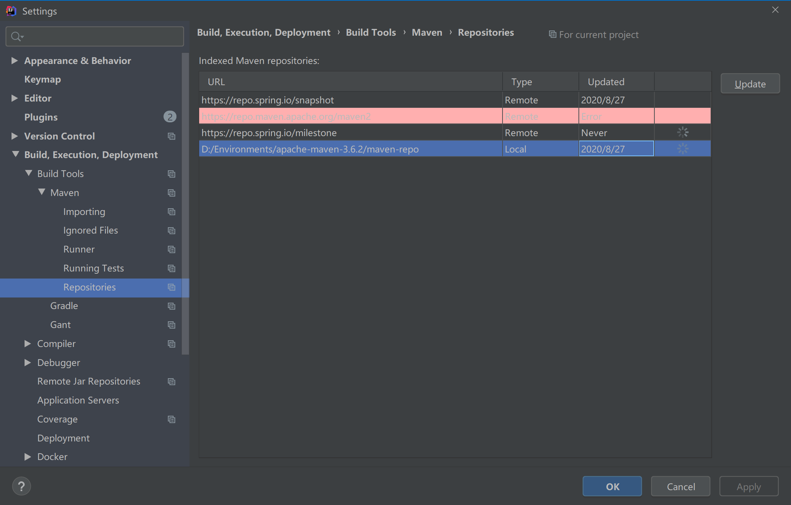


## 6.1 模块搭建

模块搭建 

1. 在tensquare_parent项目下创建tensquare_article模块，创建过程参考第4.2节公共子模块的创建过程
2. 修改tensquare_article模块的pom.xml文件，添加以下依赖

```xml
<dependencies>
    <dependency>
        <groupId>mysql</groupId>
        <artifactId>mysql-connector-java</artifactId>
    </dependency>
    <dependency>
        <groupId>com.tensquare</groupId>
        <artifactId>tensquare_common</artifactId>
        <version>1.0-SNAPSHOT</version>
    </dependency>
</dependencies>
```

创建com.tensquare.article包，并创建BaseApplication启动类

BaseApplication

```java
package com.tensquare.article;
import org.springframework.boot.SpringApplication;
import org.springframework.boot.autoconfigure.SpringBootApplication;
import org.springframework.context.annotation.Bean;
import util.IdWorker;
@SpringBootApplication
public class ArticleApplication {
    public static void main(String[] args) {
        SpringApplication.run(ArticleApplication.class, args);
    }
           
    @Bean
    public IdWorker idWorker(){
            return new IdWorker(1,1);
    }
}
```


```java
package com.tensquare.article;

import org.mybatis.spring.annotation.MapperScan;
import org.springframework.boot.SpringApplication;
import org.springframework.boot.autoconfigure.SpringBootApplication;
import org.springframework.context.annotation.Bean;
import util.IdWorker;

@SpringBootApplication
//配置Mapper包扫描
@MapperScan("com.tensquare.article.dao")
public class ArticleApplication {

    public static void main(String[] args) {
        SpringApplication.run(ArticleApplication.class, args);
    }

    @Bean
    public IdWorker createIdWorker() {
        return new IdWorker(1, 1);
    }

}

```


在resources文件夹下创建application.yml，并添加以下内容

```yaml
server:
  port: 9004
spring:
  application:
    name: tensquare-article #指定服务名
  datasource:
    driver-class-name: com.mysql.jdbc.Driver
    url: jdbc:mysql://192.168.200.129:3306/tensquare_article?characterEncoding=utf-8
    username: root
    password: root
```

数据库连接 

服务访问端口号

数据库连接四大属性


安全性   

效率 

数据源


```yml
server:
  port: 9004 # 服务访问端口号
spring:
  application:
    name: tensquare-article #服务名称
  datasource: # 数据库连接四大属性
    driver-class-name: com.mysql.jdbc.Driver
    url: jdbc:mysql://192.168.200.128:3306/tensquare_article?characterEncoding=utf-8
    username: root
    password: root
# Mybatis-Plus 配置
mybatis-plus:
#  mapper-locations: classpath:/mapper/*Mapper.xml
  #实体扫描，多个package用逗号或者分号分隔
  typeAliasesPackage: com.tensquare.article.pojo
  global-config:
    id-type: 1  #0:数据库ID自增   1:用户输入id
    db-column-underline: false
    refresh-mapper: true
    configuration:
      map-underscore-to-camel-case: true
      cache-enabled: true #配置的缓存的全局开关
      lazyLoadingEnabled: true #延时加载的开关
      multipleResultSetsEnabled: true #开启延时加载，否则按需加载属性
      log-impl: org.apache.ibatis.logging.stdout.StdOutImpl #打印sql语句,调试用

```


## 6.2 文章管理-CRUD

### 6.2.1 表结构分析

tensquare_article

tensquare_article数据库，tb_article表

id 

columnid

userid

title

content

image

createtime

updatetime 

伸出大拇指


| 文章表     | tb_article |          |                     |
| :--------- | :--------- | :------- | :------------------ |
| 字段名称   | 字段含义   | 字段类型 | 备注                |
| id         | ID         | 文本     |                     |
| columnid   | 专栏ID     | 文本     |                     |
| userid     | 用户ID     | 文本     |                     |
| title      | 文章标题   | 文本     |                     |
| content    | 文章内容   | 文本     |                     |
| image      | 文章封面   | 文本     |                     |
| createtime | 发表日期   | 日期     |                     |
| updatetime | 修改日期   | 日期     |                     |
| ispublic   | 是否公开   | 文本     | 0：不公开           |
| istop      | 是否置顶   | 文本     | 0：不置顶           |
| visits     | 浏览量     | 整型     |                     |
| thumbup    | 点赞数     | 整型     |                     |
| comment    | 评论数     | 整型     |                     |
| state      | 审核状态   | 文本     | 0：未审核 1：已审核 |
| channelid  | 所属频道   | 整型     | 关联频道表ID        |
| url        | URL地址    | 文本     |                     |
| type       | 文章类型   | 文本     | 0：分享             |

 thumbup  伸出大拇指

伸出大拇指

  


```sql
DROP TABLE IF EXISTS `tb_article`;

CREATE TABLE `tb_article` (
  `id` varchar(20) NOT NULL COMMENT 'ID',
  `columnid` varchar(20) DEFAULT NULL COMMENT '专栏ID',
  `userid` varchar(20) DEFAULT NULL COMMENT '用户ID',
  `title` varchar(100) DEFAULT NULL COMMENT '标题',
  `content` text COMMENT '文章正文',
  `image` varchar(100) DEFAULT NULL COMMENT '文章封面',
  `createtime` datetime DEFAULT NULL COMMENT '发表日期',
  `updatetime` datetime DEFAULT NULL COMMENT '修改日期',
  `ispublic` varchar(1) DEFAULT NULL COMMENT '是否公开',
  `istop` varchar(1) DEFAULT NULL COMMENT '是否置顶',
  `visits` int(20) DEFAULT NULL COMMENT '浏览量',
  `thumbup` int(20) DEFAULT NULL COMMENT '点赞数',
  `comment` int(20) DEFAULT NULL COMMENT '评论数',
  `state` varchar(1) DEFAULT NULL COMMENT '审核状态',
  `channelid` varchar(20) DEFAULT NULL COMMENT '所属频道',
  `url` varchar(100) DEFAULT NULL COMMENT 'URL',
  `type` varchar(1) DEFAULT NULL COMMENT '类型',
  PRIMARY KEY (`id`)
) ENGINE=InnoDB DEFAULT CHARSET=utf8 COMMENT='文章';
```


comment

state

channelid

```sql
CREATE DATABASE /*!32312 IF NOT EXISTS*/`tensquare_article` /*!40100 DEFAULT CHARACTER SET utf8 */;

USE `tensquare_article`;

/*Table structure for table `tb_article` */

DROP TABLE IF EXISTS `tb_article`;

CREATE TABLE `tb_article` (
  `id` varchar(20) NOT NULL COMMENT 'ID',
  `columnid` varchar(20) DEFAULT NULL COMMENT '专栏ID',
  `userid` varchar(20) DEFAULT NULL COMMENT '用户ID',
  `title` varchar(100) DEFAULT NULL COMMENT '标题',
  `content` text COMMENT '文章正文',
  `image` varchar(100) DEFAULT NULL COMMENT '文章封面',
  `createtime` datetime DEFAULT NULL COMMENT '发表日期',
  `updatetime` datetime DEFAULT NULL COMMENT '修改日期',
  `ispublic` varchar(1) DEFAULT NULL COMMENT '是否公开',
  `istop` varchar(1) DEFAULT NULL COMMENT '是否置顶',
  `visits` int(20) DEFAULT NULL COMMENT '浏览量',
  `thumbup` int(20) DEFAULT NULL COMMENT '点赞数',
  `comment` int(20) DEFAULT NULL COMMENT '评论数',
  `state` varchar(1) DEFAULT NULL COMMENT '审核状态',
  `channelid` varchar(20) DEFAULT NULL COMMENT '所属频道',
  `url` varchar(100) DEFAULT NULL COMMENT 'URL',
  `type` varchar(1) DEFAULT NULL COMMENT '类型',
  PRIMARY KEY (`id`)
) ENGINE=InnoDB DEFAULT CHARSET=utf8 COMMENT='文章';

/*Data for the table `tb_article` */


/*Table structure for table `tb_channel` */

DROP TABLE IF EXISTS `tb_channel`;

CREATE TABLE `tb_channel` (
  `id` varchar(20) NOT NULL COMMENT 'ID',
  `name` varchar(100) DEFAULT NULL COMMENT '频道名称',
  `state` varchar(1) DEFAULT NULL COMMENT '状态',
  PRIMARY KEY (`id`)
) ENGINE=InnoDB DEFAULT CHARSET=utf8 COMMENT='频道';

/*Data for the table `tb_channel` */

/*Table structure for table `tb_column` */

DROP TABLE IF EXISTS `tb_column`;

CREATE TABLE `tb_column` (
  `id` varchar(20) NOT NULL COMMENT 'ID',
  `name` varchar(100) DEFAULT NULL COMMENT '专栏名称',
  `summary` varchar(1000) DEFAULT NULL COMMENT '专栏简介',
  `userid` varchar(20) DEFAULT NULL COMMENT '用户ID',
  `createtime` datetime DEFAULT NULL COMMENT '申请日期',
  `checktime` datetime DEFAULT NULL COMMENT '审核日期',
  `state` varchar(1) DEFAULT NULL COMMENT '状态',
  PRIMARY KEY (`id`)
) ENGINE=InnoDB DEFAULT CHARSET=utf8 COMMENT='专栏';

/*Data for the table `tb_column` */


/*!40101 SET SQL_MODE=@OLD_SQL_MODE */;
/*!40014 SET FOREIGN_KEY_CHECKS=@OLD_FOREIGN_KEY_CHECKS */;
/*!40014 SET UNIQUE_CHECKS=@OLD_UNIQUE_CHECKS */;
/*!40111 SET SQL_NOTES=@OLD_SQL_NOTES */;

```


### 6.2.2 集成mybatis plus

1. mybatis plus概述
   - 是对Mybatis框架的二次封装和扩展
   - 纯正血统：完全继承原生 Mybatis 的所有特性
   - 最少依赖：仅仅依赖Mybatis以及Mybatis-Spring
   - 性能损耗小：启动即会自动注入基本CURD ，性能无损耗，直接面向对象操作
   - 自动热加载：Mapper对应的xml可以热加载，大大减少重启Web服务器时间，提升开发效率
   - 性能分析：自带Sql性能分析插件，开发测试时，能有效解决慢查询
   - 全局拦截：提供全表delete、update操作智能分析阻断
   - 避免Sql注入：内置Sql注入内容剥离器，预防Sql注入攻击
   - Mybatis框架的二次封装 和  扩展   完全继承原生Mybatis  最少依赖  性能分析 全局拦截  避免SQL注入  
   - 复杂  特殊  自己写    半吊子  mybatis 注入了
   
   
2. 在pom.xml文件中引入相关依赖

```xml
  <!-- mybatis-plus begin -->
        <dependency>
            <groupId>com.baomidou</groupId>
            <artifactId>mybatisplus-spring-boot-starter</artifactId>
            <version>${mybatisplus-spring-boot-starter.version}</version>
        </dependency>
        <dependency>
            <groupId>com.baomidou</groupId>
            <artifactId>mybatis-plus</artifactId>
            <version>${mybatisplus.version}</version>
        </dependency>
        <!-- mybatis-plus end -->
```

3.在配置文件application.yml中添加相关配置

mybatis-plus

mybatis

classpath  加上  

取别名的 

列 下划线 

懒加载 无效的查询   

```yaml
# Mybatis-Plus 配置
mybatis-plus:
#  mapper-locations: classpath:/mapper/*Mapper.xml
  #实体扫描，多个package用逗号或者分号分隔
  typeAliasesPackage: com.tensquare.article.pojo
  global-config:
    id-type: 1  #0:数据库ID自增   1:用户输入id
    db-column-underline: false
    refresh-mapper: true
    configuration:
      map-underscore-to-camel-case: true
      cache-enabled: true #配置的缓存的全局开关
      lazyLoadingEnabled: true #延时加载的开关
      multipleResultSetsEnabled: true #开启延时加载，否则按需加载属性
      log-impl: org.apache.ibatis.logging.stdout.StdOutImpl #打印sql语句,调试用
```


4.修改启动类，增加Mapper扫描注解

Mapper扫描注解

扫描注解  

```java
@SpringBootApplication
//Mapper扫描注解
@MapperScan("com.tensquare.article.dao")
public class ArticleApplication {
    public static void main(String[] args) {
        SpringApplication.run(ArticleApplication.class, args);
    }
    @Bean
    public IdWorker idWorker() {
        return new IdWorker(1, 1);
    }
}
```

### 6.2.3 实现查询所有文章和根据id号查询文章功能

在com.tensquare.article包下面创建pojo包，并创建Article实体类

查询文章功能 

```java
package com.tensquare.article.pojo;

import com.baomidou.mybatisplus.annotations.TableId;
import com.baomidou.mybatisplus.annotations.TableName;
import com.baomidou.mybatisplus.enums.IdType;

import java.io.Serializable;
import java.util.Date;

@TableName("tb_article")
public class Article implements Serializable {

    @TableId(type = IdType.INPUT)
    private String id;//ID

    private String columnid;    //专栏ID
    private String userid;      //用户ID
    private String title;       //标题
    private String content;     //文章正文
    private String image;       //文章封面
    private Date createtime;    //发表日期
    private Date updatetime;    //修改日期
    private String ispublic;    //是否公开
    private String istop;       //是否置顶
    private Integer visits;     //浏览量
    private Integer thumbup;    //点赞数
    private Integer comment;    //评论数
    private String state;       //审核状态
    private String channelid;   //所属频道
    private String url;         //URL
    private String type;        //类型

    //getters and setters
}
```

id

columnid

userid

pojo搞定 

get  set  toString

编写数据访问接口dao

import com.baomidou.mybatisplus.mapper.BaseMapper;


```java
public interface ArticleDao extends BaseMapper<Article> {
}
```


```java
package com.tensquare.article.dao;

import com.baomidou.mybatisplus.mapper.BaseMapper;
import com.tensquare.article.pojo.Article;

public interface ArticleDao extends BaseMapper<Article> {
}

```


编写service

```java
@Service
public class ArticleService {

    @Autowired
    private ArticleDao articleDao;

    public List<Article> findAll() {
        return articleDao.selectList(null);
    }

    public Article findById(String id) {
        return articleDao.selectById(id);
    }
}
```


```java

```


dao

service

controller

编写controller

@RequestMapping("/article")


```java
@RestController
@RequestMapping("/article")
public class ArticleController {

    @Autowired
    private ArticleService articleService;

    @RequestMapping(method = RequestMethod.GET)
    public Result findAll() {
        List list = articleService.findAll();
        return new Result(true, StatusCode.OK, "查询成功", list);
    }

    @RequestMapping(value = "/{id}", method = RequestMethod.GET)
    public Result findById(@PathVariable String id) {
        Article Article = articleService.findById(id);
        return new Result(true, StatusCode.OK, "查询成功", Article);
    }
}
```

@PathVariable String id 

对象 变  Json会吗  


select  List       

6.2.4 添加文章、修改文章和删除文章

添加文章  修改文章  删除文章   

ArticleController中添加代码

@RequestBody都要加 

初始  评论 点赞  都要设置 

```java
public void save(Article article) {
        //使用分布式id生成器
        String id = idWorker.nextId() + "";
        article.setId(id);

        //初始化数据
        article.setVisits(0);   //浏览量
        article.setThumbup(0);  //点赞数
        article.setComment(0);  //评论数

        //新增
        articleDao.insert(article);
    }
```

推荐到建表语句里面去设置   代码中写错了  遗忘  


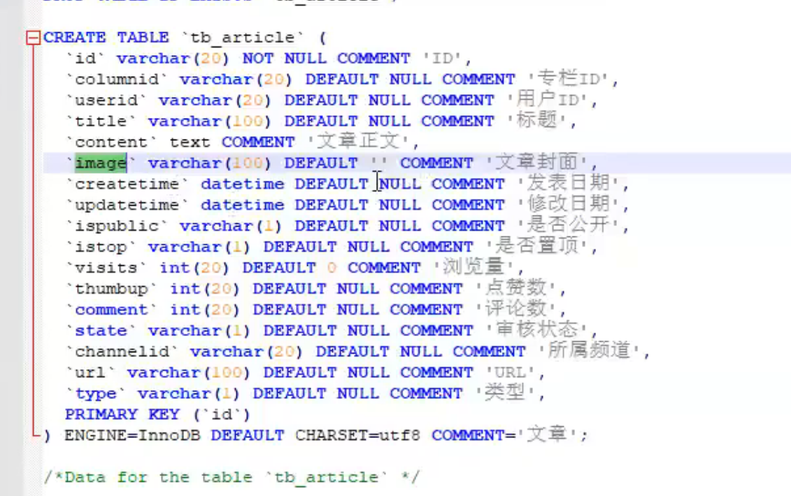


Null空指针异常    建议    不如设置  ' '    0 


```java
//新增标签数据接口
@RequestMapping(method = RequestMethod.POST)
public Result add(@RequestBody Article article) {
    articleService.add(article);

    return new Result(true, StatusCode.OK, "添加成功");
}
```

@RequestBody  Article   

articleService  

ArticleService中添加代码

```java
@Autowired
private IdWorker idWorker;

public void add(Article article) {
    article.setId(idWorker.nextId() + "");
    articleDao.insert(article);
}
```

添加文章  设置id   setId  


修改文章

ArticleController中添加代码

ArticleController   

```java
//修改标签数据接口
@RequestMapping(value = "{id}", method = RequestMethod.PUT)
public Result update(@PathVariable String id, @RequestBody Article article) {
    article.setId(id);
    articleService.update(article);
    return new Result(true, StatusCode.OK, "修改成功");
}
```

设置id  来修改 

article.setId  articleId

根据主键id修改

根据条件来修改

 

ArticleService中添加代码

```java
public void update(Article article) {
    //根据id号更新
    //方法1
    articleDao.updateById(article);

    //方法2
    EntityWrapper wrapper = new EntityWrapper<Article>();
    wrapper.eq("id", article.getId());
    articleDao.update(article, wrapper);
}
```

根据主键id  根据条件

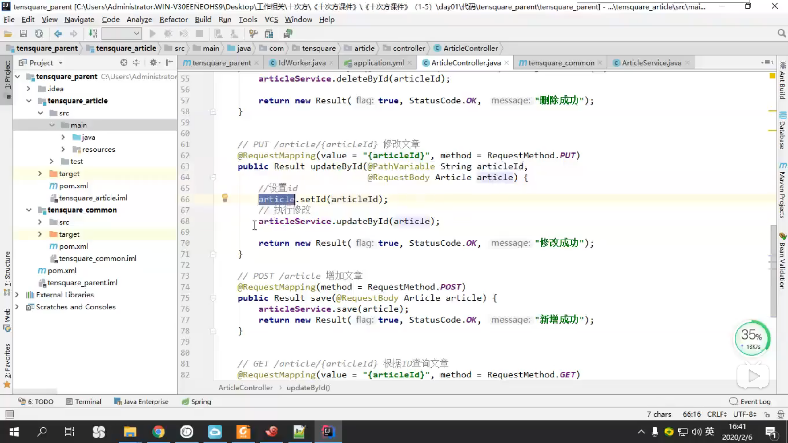


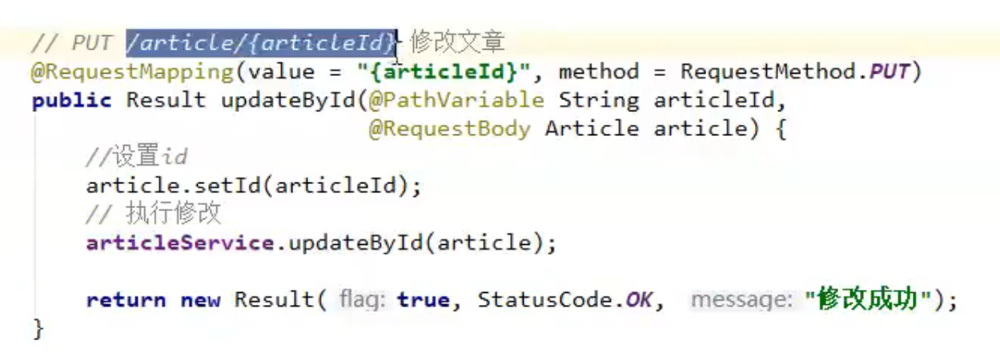

id    

设置条件  

new   Result()

```java
 public void updateById(Article article) {
        // 根据主键id修改
        articleDao.updateById(article);

        // 根据条件修改
        // 创建条件对象
        // EntityWrapper<Article> wrapper = new EntityWrapper<>();
        // 设置条件
        // wrapper.eq("id", article.getId());
        // articleDao.update(article, wrapper);
    }
```


```java
 Integer updateById(@Param("et") T var1);

    Integer updateAllColumnById(@Param("et") T var1);

    Integer update(@Param("et") T var1, @Param("ew") Wrapper<T> var2);


```


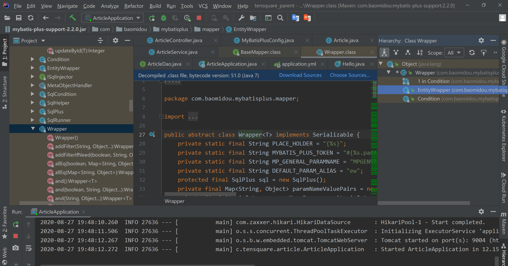


ctrl  +  h

```java
//
// Source code recreated from a .class file by IntelliJ IDEA
// (powered by Fernflower decompiler)
//

package com.baomidou.mybatisplus.mapper;

import com.baomidou.mybatisplus.toolkit.StringUtils;

public class EntityWrapper<T> extends Wrapper<T> {
    protected T entity = null;

    public EntityWrapper() {
    }

    public EntityWrapper(T entity) {
        this.entity = entity;
    }

    public EntityWrapper(T entity, String sqlSelect) {
        this.entity = entity;
        this.sqlSelect = sqlSelect;
    }

    public T getEntity() {
        return this.entity;
    }

    public void setEntity(T entity) {
        this.entity = entity;
    }

    public String getSqlSegment() {
        String sqlWhere = this.sql.toString();
        if (StringUtils.isEmpty(sqlWhere)) {
            return null;
        } else {
            return this.isWhere != null ? (this.isWhere ? sqlWhere : sqlWhere.replaceFirst("WHERE", this.AND_OR)) : sqlWhere.replaceFirst("WHERE", this.AND_OR);
        }
    }
}

```


更新 

void  update   Article  article

articleDao.updateById  

更加传递过来的id来查     直接对象  或者  id找对象  


删除文章

ArticleController中添加代码

```java
//删除文章数据接口
@RequestMapping(value = "{id}", method = RequestMethod.DELETE)
public Result delete(@PathVariable String id) {
    articleService.delete(id);

    return new Result(true, StatusCode.OK, "删除成功");
}
```

ArticleService中添加代码

```java
public void delete(String id) {
    articleDao.deleteById(id);
}
```

### 6.2.5 条件查询和分页

1. 条件查询

   使用Mybatis Plus 提供的EntityWrapper对象封装where查询条件，例如以下使用方式：

```java
EntityWrapper wrapper = new EntityWrapper<Article>();
wrapper.eq("id", article.getId());

//动态sql，例如<if test="null != field"> and field='xxx' </if>
wrapper.eq(null != map.get(field), field, map.get(field));

```

第一个条件为true  加入到查询过程中

第一个条件不为true  不加入到这里   true  false


分页

使用 Mybatis Plus 提供的Page对象
向Mybatis Plus中注入PaginationInterceptor插件
新建config包，创建MybatisPlusConfig对象，添加下面的代码

```java
@Configuration
public class MybatisPlusConfig {
   @Bean
    public PaginationInterceptor paginationInterceptor() {
        return new PaginationInterceptor();
    }
}
```


```java
package com.tensquare.article.config;

import com.baomidou.mybatisplus.plugins.PaginationInterceptor;
import org.springframework.context.annotation.Bean;
import org.springframework.context.annotation.Configuration;

@Configuration
public class MyBatisPlusConfig {

    @Bean
    public PaginationInterceptor createPaginationInterceptor() {
        return new PaginationInterceptor();
    }
}

```


完整代码

ArticleController中添加代码

```java
     @RequestMapping(value="/search/{page}/{size}", method = RequestMethod.POST)
    public Result search(@RequestBody Map map, @PathVariable int page, @PathVariable int size) {
        Page page1 = articleService.search(map, page, size);
        return new Result(true, StatusCode.OK, "查询成功", new PageResult((int) page1.getTotal(), page1.getRecords()));
    }
```

查询  动态查询   如果有就查询 没有就不查询  

集合的方式   不是POJO  用Map

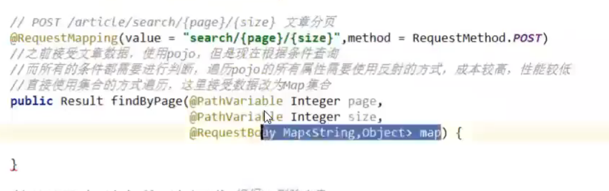


修改Map

为什么不用 article  number  

Artticle  article  为什么不使用呢     也就一两个属性的事情 

反射  

遍历  Map   key     拿到value   

```java
// POST /article/search/{page}/{size} 文章分页
    @RequestMapping(value = "search/{page}/{size}", method = RequestMethod.POST)
    //之前接受文章数据，使用pojo，但是现在根据条件查询
    //而所有的条件都需要进行判断，遍历pojo的所有属性需要使用反射的方式，成本较高，性能较低
    //直接使用集合的方式遍历，这里接受数据改为Map集合
    public Result findByPage(@PathVariable Integer page,
                             @PathVariable Integer size,
                             @RequestBody Map<String, Object> map) {
        //根据条件分页查询
        Page<Article> pageData = articleService.findByPage(map, page, size);

        //封装分页返回对象
        PageResult<Article> pageResult = new PageResult<>(
                pageData.getTotal(), pageData.getRecords()
        );

        //返回数据
        return new Result(true, StatusCode.OK, "查询成功", pageResult);

    }

```


封装分页返回对象     PageResult  返回的数   和 数据  


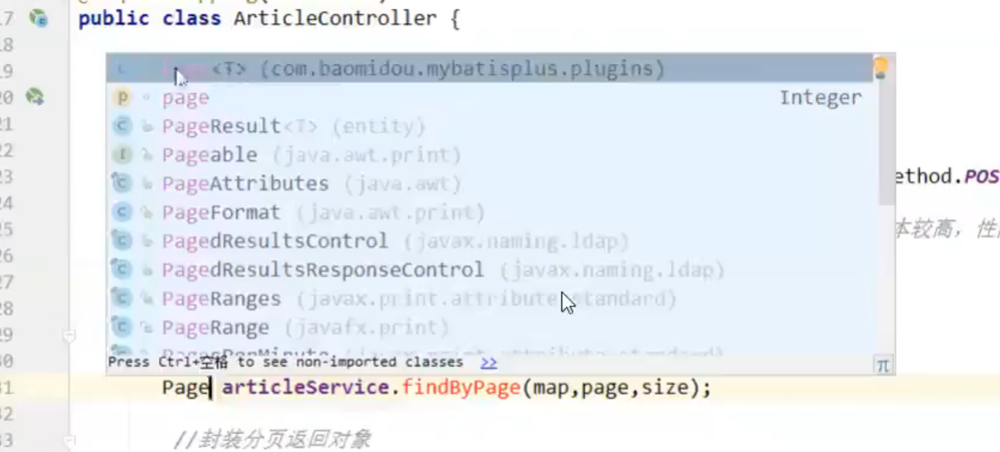


ArticleService中添加代码

```java
public Page search(Map map, int page, int size) {
    EntityWrapper wrapper = new EntityWrapper<Article>();
    Set<String> fieldSet = map.keySet();
    for(String field : fieldSet) {
        //wrapper.eq(field, map.get(field));
        wrapper.eq(null != map.get(field), field, map.get(field));
    }

    Page page1 = new Page(page, size);
    List list = articleDao.selectPage(page1, wrapper);
    page1.setRecords(list);
    return page1;
}
```

search  Map map    page   size

eq   等于   筛选出来  wrapper.eq


ArticleService中添加代码

Page  search  

```
Set<K> keySet();
```


```java
public Page<Article> findByPage(Map<String, Object> map, Integer page, Integer size) {
        //设置查询条件
        EntityWrapper<Article> wrapper = new EntityWrapper<>();
        Set<String> keySet = map.keySet();
        for (String key : keySet) {
            // if (map.get(key) != null) {
            //     wrapper.eq(key, map.get(key));
            // }

            //第一个参数是否把后面的条件加入到查询条件中
            //和上面的if判断的写法是一样的效果，实现动态sql
            wrapper.eq(map.get(key) != null, key, map.get(key));
        }

        //设置分页参数
        Page<Article> pageData = new Page<>(page, size);

        //执行查询
        //第一个是分页参数，第二个是查询条件
        List<Article> list = articleDao.selectPage(pageData, wrapper);

        pageData.setRecords(list);

        //返回
        return pageData;
    }
```


## 6.3 公共异常处理类

为了使代码容易维护，减少冗余，我们创建一个类集中处理异常

为了使代码容易维护 减少冗余  我们常见一个类集中处理异常

在com.tensquare.user.controller包下创建公共异常处理类BaseExceptionHandler，并添加代码

```java
@ControllerAdvice
public class BaseExceptionHandler {

    @ExceptionHandler(value = Exception.class)
    @ResponseBody
    public Result error(Exception e) {
        e.printStackTrace();
        return new Result(false, StatusCode.ERROR, e.getMessage());
    }
}
```


```java
package com.tensquare.article.controller;

import entity.Result;
import entity.StatusCode;
import org.springframework.web.bind.annotation.ControllerAdvice;
import org.springframework.web.bind.annotation.ExceptionHandler;
import org.springframework.web.bind.annotation.ResponseBody;

@ControllerAdvice
public class BaseExceptionHandler {

    @ExceptionHandler(Exception.class)
    @ResponseBody
    public Result handler(Exception e) {
        System.out.println("处理异常");

        return new Result(false, StatusCode.ERROR, e.getMessage());
    }

}

```


ArticleController中添加测试代码

```java
@RequestMapping(value="/exception", method = RequestMethod.GET)
public Result exception() throws Exception {
    throw new Exception("测试统一异常处理");
}
```

 


## 6.4 跨域处理

1. 何谓**跨域**

   浏览器从一个域名的网页去请求另一个域名的资源时，域名、端口、协议任一不同，都是跨域 。

   十次方项目是采用前后端分离开发的，也是前后端分离部署的，必然会存在跨域问题。

2. 如何解决跨域

   只需要在controller类上添加注解`@CrossOrigin`即可！