# 第2章 - MongoDB和评论管理

学习目标：

- 了解什么是MongoDB
- 掌握MongoDB的安装
- 掌握MongoDB的常用命令
- 掌握mongodb-driver的基本使用
- 掌握SpringDataMongoDB的使用
- 能够实现文章评论功能开发
- 

MongoDB和评论管理

## Day01


开发模式  开发模型  

前后端分离的架构 

开发模型   瀑布模型  敏捷开发

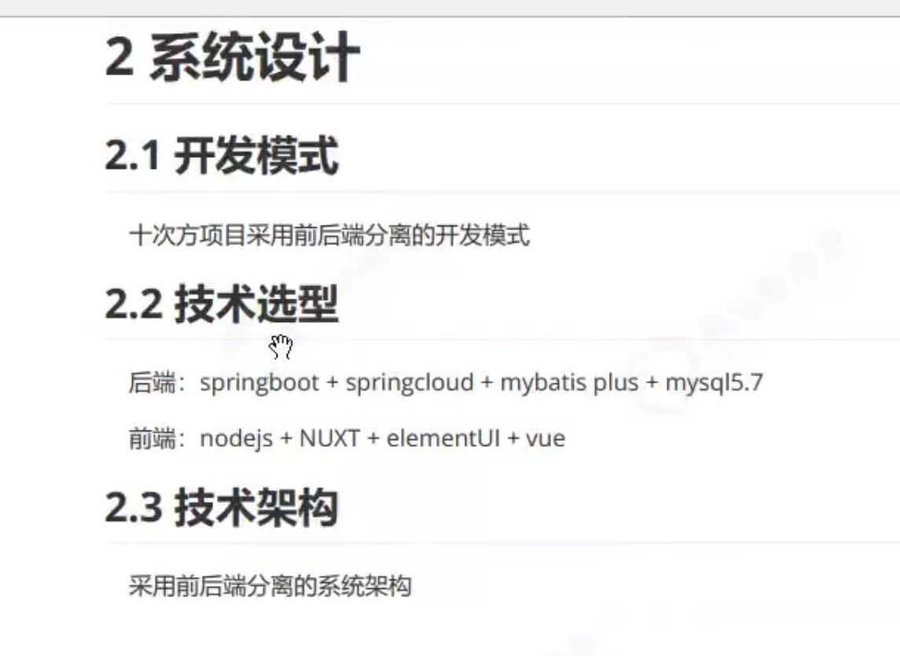


执行流程  


微服务模块划分的标准  


功能划分   微服务模块   文章  用户 


API文档的标准 来写的


谁来编写呢  

一个个  Swagger   


加上注解来书写

代码的熟悉程度 


加注解行的


REST  风格 


RESTFUL      restful架构是目前最流行的一种互联网软件架构

表现层状态转化

所有W1eb应用都应该遵守的架构设计指导原则

7个HTTP方法  GET POST  PUT  DELETE PATCH HEAD  OPTIONS

幂等性 无论你请求多少次  资源状态是一样的

目前最流行的一种互联网软件架构

表现层状态转化

Web应用都应该遵守的架构设计指导原则

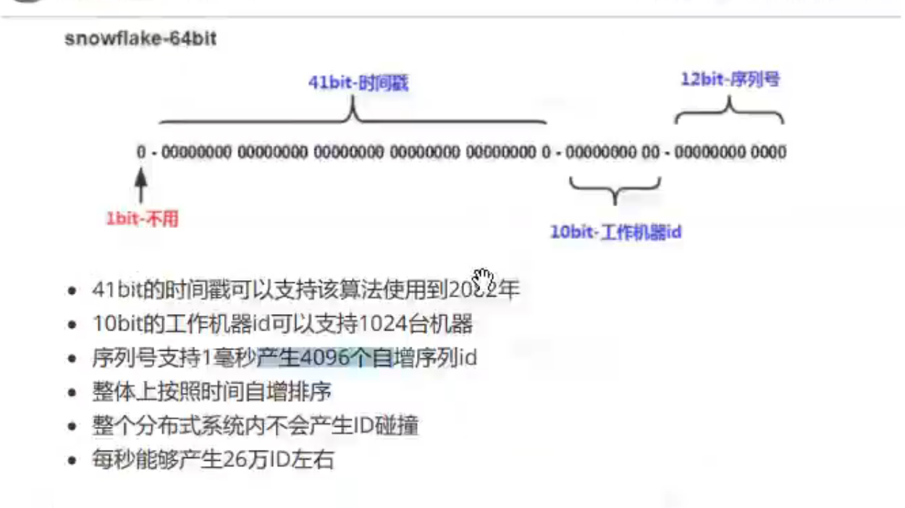


开始开始开始开始 

c3p0

德鲁伊  druid


二次封装 


整理出来  使用   记


BaseMapper


EntiyWrapper


分页 


跨域


项目描述一定要够使用自己的语言描述出来


测试  功能  实现 

实际  不是 其他的主机  


mybatis  plus  优点记录一下  


整理出来


## MongoDB和评论管理

MongoDB和评论管理

了解什么是MongoDB


学习目标：

- 了解什么是MongoDB
- 掌握MongoDB的安装
- 掌握MongoDB的常用命令
- 掌握mongodb-driver的基本使用
- 掌握SpringDataMongoDB的使用
- 能够实现文章评论功能开发

JDBC  第三方的   driver  

常见的框架   数据  SpringData  MongoDB

文章评论功能开发

特点  体系结构   数据类型

基本使用 Windows的安装   Docker环境下的安装  常用命令 

## 1 MongoDB简介

上新课了   

基于MongoDB完成评论功能  

### 1.1 文章评论数据分析

文章评论两项功能存在以下特点：

1. 数据量大
2. 写入操作频繁
3. 价值较低

对于这样的数据，我们更适合使用MongoDB来实现数据的存储

 

文章更重要点    最前面的评论  好点 


数据量大  写入操作频繁  价值较低

对于这样的数据 我们更适合使用MongoDB来实现数据的存储


评论功能  

每个人都可以去写的    一个文章 一个用户 可以多个评论 

每个人都可以进行评论   随时随地都可以写评论

价值较低  为什么呢？  

花钱买商品  订单数据      订单没有了  电商客服  我的订单没了

一定不能丢失  diushi


看了文章  这个文章不错  很好    发现自己的评论没了   顶多再发个  

评论过 审核    

订单 钱     关注   了不起再发个   

订单数据  评论数据  价值


文章评论 数据量大   Redis  MySQL  

Redis 快速读写   不适合保存这个    数据量大呢   

Mysql集群    


数据量大  写入操作频繁

不需要    大量的成本

价值较低  那么多钱 

即可以存储大数据的   使用成本较低 


Redis   MySQL

为什么使用MongoDB  工作场景   需求下

数据量大  集群  、 ES  分布式  存储超大规模数据的

写入操作数据 频繁   


评论的价值

差评  中评    好评 

评价作假  越来越搞 

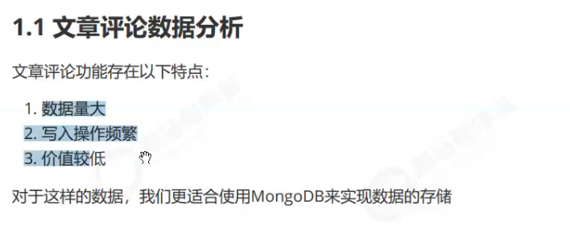

数据量大 

写入操作频繁

价值较低   考虑 

为什么你们再这里要使用MongoDB呢  

  特点  体系结构


### 1.2 什么是MongoDB

MongoDB是一个基于分布式文件存储的数据库。由C++语言编写。旨在为WEB应用提供可扩展的高性能数据存储解决方案。 MongoDB是一个介于关系数据库和非关系数据库之间的产品，是非关系数据库当中功能最丰富，最像关系数据库的。它支持的数据结构非常松散，是类似json的bson格式，因此可以存储比较复杂的数据类型。

 非关系型数据库    分布式文件存储的数据库 

分布式存储  大数据存储  C++    WEB应用提供可扩展的高性能数据存储解决方案

介于 关系 非关系   定义非关系型数据库  但是是最像关系型的非关系型数据库

数据结构非常松散   类似JSON的BSON格式

相对来说 比 Redis    读写速度是比不上的 


优点

大数据

读写速度频繁

低价值


### 1.3 MongoDB特点

Mongo最大的特点是它支持的查询语言非常强大，其语法有点类似于面向对象的查询语言，几乎可以实现类似关系数据库单表查询的绝大部分功能，而且还支持对数据建立索引。

支持的查询语言非常强大

读写速度非常厉害   好像只是get  set 等等  

支持的查询语言非常强大  语法有点类型于面向对象的查询语言  几乎可以实现类似关系数据库 单表查询的绝大部分功能   还支持对数据建立索引  

高性能  易部署  易使用   存储数据非常方便  

面向对象的查询语言  

很多非关系数据库  做不到的  几乎可以实现类似关系数据库单表查询的绝大部分功能

它的特点是高性能、易部署、易使用，存储数据非常方便。主要功能特性有：

1. 面向集合存储，易存储对象类型的数据。
2. 模式自由。
3. 支持动态查询。
4. 支持完全索引，包含内部对象。
5. 支持查询。
6. 支持复制和故障恢复。
7. 使用高效的二进制数据存储，包括大型对象（如视频等）。
8. 自动处理碎片，以支持云计算层次的扩展性。
9. 支持RUBY，PYTHON，JAVA，C++，PHP，C#等多种语言。
10. 文件存储格式为BSON（一种JSON的扩展）。

 

面向集合存储  易存储对象类型的数据

模式自由  支持动态查询   支持完全索引   包含内部对象

支持查询

支持复制和故障恢复

使用高效的二进制数据存储  包括大型对象  视频

自动处理碎片 以支持云计算层次的扩展性

支持

 

### 1.5 MongoDB体系结构

MongoDB 的逻辑结构是一种层次结构。主要由：文档(document)、集合(collection)、数据库(database)这三部分组成的。逻辑结构是面向用户的，用户使用 MongoDB 开发应用程序使用的就是逻辑结构。

1. MongoDB 的文档（document），相当于关系数据库中的一行记录。
2. 多个文档组成一个集合（collection），相当于关系数据库的表。
3. 多个集合（collection），逻辑上组织在一起，就是数据库（database）。
4. 一个 MongoDB 实例支持多个数据库（database）。

逻辑结构是一层结构

文档  document 集合 collection   database   三部分组成的  

文档  记录

集合  关系数据库的表

多个集合  逻辑上组织在一起  就是数据库 

一个MongoDB  实列支持多个数据库  

集合 关系数据库的表  

 文档 集合 数据库

MySQL数据库对比  

一个文档一个数据  


一个集合 一个存储


数据库表    集合

集合里面存放文档

数据库里面有很多的集合   

document  collection  database   

数据库  表  记录 

 一个访问很多数据库  一个数据库  很多集合   一个集合  很多文档


数据库

row table  database  

文档  集合  数据库  

文档(document)、集合(collection)、数据库(database)的层次结构如下图:


 

| MongoDb           | 关系型数据库Mysql |
| :---------------- | :---------------- |
| 数据库(databases) | 数据库(databases) |
| 集合(collections) | 表(table)         |
| 文档(document)    | 行(row)           |

 databases 数据库  表   table  row 行

collections  集合 文档  document   Code


查询的性能  比较高 

### 1.6 MongoDB数据类型

String  Integer   Boolean   Double   Array  Timestamp 

Object  Null  Date  Object ID 对象ID Binary Data 

一个个JSON的  

存就是一个  JSON   非常灵活  

双精度浮点值  用于存储浮点值

用于将数组或列表或多个值存储为一个键


Timestamp  时间戳  

浮点值

Array  数组或列表 或多个值存储为一个键


| 数据类型           | 描述                                                         |
| :----------------- | :----------------------------------------------------------- |
| String             | 字符串。存储数据常用的数据类型。在 MongoDB 中，UTF-8 编码的字符串才是合法的。 |
| Integer            | 整型数值。用于存储数值。根据你所采用的服务器，可分为 32 位或 64 位。 |
| Boolean            | 布尔值。用于存储布尔值（真/假）。                            |
| Double             | 双精度浮点值。用于存储浮点值。                               |
| Array              | 用于将数组或列表或多个值存储为一个键。                       |
| Timestamp          | 时间戳。记录文档修改或添加的具体时间。                       |
| Object             | 用于内嵌文档。                                               |
| Null               | 用于创建空值。                                               |
| Date               | 日期时间。用 UNIX 时间格式来存储当前日期或时间。你可以指定自己的日期时间：创建 Date 对象，传入年月日信息。 |
| Object ID          | 对象 ID。用于创建文档的 ID。                                 |
| Binary Data        | 二进制数据。用于存储二进制数据。                             |
| Code               | 代码类型。用于在文档中存储 JavaScript 代码。                 |
| Regular expression | 正则表达式类型。用于存储正则表达式。                         |

特殊说明：

1. ObjectId

   ObjectId 类似唯一主键，可以很快的去生成和排序，包含 12 bytes，含义是：

   - 前 4 个字节表示创建 unix 时间戳，格林尼治时间 UTC 时间，比北京时间晚了 8 个小时
   - 接下来的 3 个字节是机器标识码
   - 紧接的两个字节由进程 id 组成 PID
   - 最后三个字节是随机数

   

    

   MongoDB 中存储的文档必须有一个 _id 键。这个键的值可以是任何类型的，默认是个 ObjectId 对象

    内嵌文档  文档里面可以套文档  

2. 时间戳

   BSON 有一个特殊的时间戳类型，与普通的日期类型不相关。时间戳值是一个 64 位的值。其中：

   - 前32位是一个 time_t 值【与Unix新纪元（1970年1月1日）相差的秒数】
   - 后32位是在某秒中操作的一个递增的序数

   在单个 mongod 实例中，时间戳值通常是唯一的。

    4个字节   相差的miao'shu  秒数    秒数  

3. 日期

   表示当前距离 Unix新纪元（1970年1月1日）的毫秒数。日期类型是有符号的, 负数表示 1970 年之前的日期。
   
    毫秒数  日期    日期类型是符号的  负数表示1970 之前的日期  

编码格式 是  UTF-8的  

ObjectId  每一个都要的  


MongoDB  启动一个   进程号

在启动一个  不同的MongoDB  PID是不同的  

随机数  重复的

键  


可以使用自己的 也可以自己设置的


ObjectId  性能  影响的 


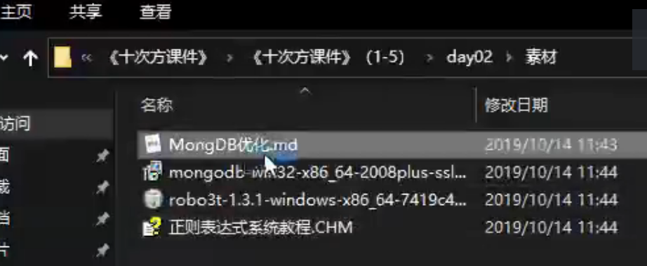


优化的方案


使用默认值的  比较好的 


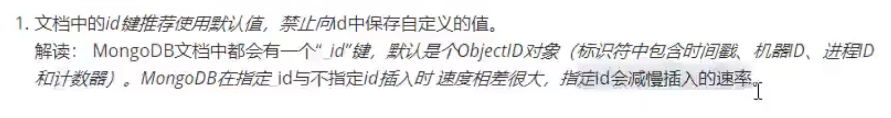


指定  

不建议  自动保存的 

 #MongDB优化

​	MongoDB 是高性能数据，但是在使用的过程中，大家偶尔还会碰到一些性能问题。MongoDB和其它关系型数据库相比，例如 SQL Server 、MySQL 、Oracle 相比来说，相对较新，很多人对其不是很熟悉，所以很多开发、DBA往往是注重功能的实现，而忽视了性能的要求。其实，MongoDB和 SQL Server 、MySQL 、Oracle 一样，一个 数据库对象的设计调整、索引的创建、语句的优化，都会对性能产生巨大的影响。

为充分挖掘MongoDB性能，简单列举以下Mongodb优化方式：

1. 文档中的_id键推荐使用默认值，禁止向_id中保存自定义的值。
   ​解读： MongoDB文档中都会有一个“_id”键，默认是个ObjectID对象（标识符中包含时间戳、机器ID、进程ID和计数器）。MongoDB在指定_id与不指定_id插入时 速度相差很大，指定_id会减慢插入的速率。
     ​

2. 推荐使用短字段名。
   解读：与关系型数据库不同，MongoDB集合中的每一个文档都需要存储字段名，长字段名会需要更多的存储空间。

  ​

3. MongoDB索引可以提高文档的查询、更新、删除、排序操作，所以结合业务需求，适当创建索引。

   

4. 每个索引都会占用一些空间，并且导致插入操作的资源消耗，因此，建议每个集合的索引数尽量控制在5个以内。

   

5. 对于包含多个键的查询，创建包含这些键的复合索引是个不错的解决方案。复合索引的键值顺序很重要，理解索引最左前缀原则。
   解读：例如在test集合上创建组合索引{a:1,b:1,c:1}。执行以下7个查询语句：
     db.test.find({a:”hello”}) // 1
     db.test.find({b:”sogo”, a:”hello”}) // 2
     db.test.find({a:”hello”,b:”sogo”, c:”666”}) // 3
     db.test.find({c:”666”, a:”hello”}) // 4
     db.test.find({b:”sogo”, c:”666”}) // 5
     db.test.find({b:”sogo” }) // 6
     db.test.find({c:”666”}) // 7
     以上查询语句可能走索引的是1、2、3、4
     查询应包含最左索引字段，以索引创建顺序为准，与查询字段顺序无关。
     最少索引覆盖最多查询。

  ​

6. TTL 索引（time-to-live index，具有生命周期的索引），使用TTL索引可以将超时时间的文档老化，一个文档到达老化的程度之后就会被删除。
   解读：创建TTL的索引必须是日期类型。TTL索引是一种单字段索引，不能是复合索引。TTL删除文档后台线程每60s移除失效文档。不支持定长集合。

  ​

7. 需要在集合中某字段创建索引，但集合中大量的文档不包含此键值时，建议创建稀疏索引。
   解读：索引默认是密集型的，这意味着，即使文档的索引字段缺失，在索引中也存在着一个对应关系。在稀疏索引中，只有包含了索引键值的文档才会出现。

  ​

8. 创建文本索引时字段指定text，而不是1或者-1。每个集合只有一个文本索引，但是它可以为任意多个字段建立索引。
   解读：文本搜索速度快很多，推荐使用文本索引替代对集合文档的多字段的低效查询。

  ​

9. 使用findOne在数据库中查询匹配多个项目，它就会在自然排序文件集合中返回第一个项目。如果需要返回多个文档，则使用find方法。

   

10. 如果查询无需返回整个文档或只是用来判断键值是否存在，可以通过投影（映射）来限制返回字段，减少网络流量和客户端的内存使用。
      解读：既可以通过设置{key:1}来显式指定返回的字段，也可以设置{key:0}指定需要排除的字段。

  ​

11. 除了前缀样式查询，正则表达式查询不能使用索引，执行的时间比大多数选择器更长，应节制性地使用它们。

    

12. 批量插入（batchInsert）可以减少数据向服务器的提交次数，提高性能。但是批量提交的BSON Size不超过48MB。

    

13. 禁止一次取出太多的数据进行排序，MongoDB目前支持对32M以内的结果集进行排序。如果需要排序，请尽量限制结果集中的数据量。


JSON  key  value

名字

Objectid

时间戳

1970 1 1


## 2 MongoDB基本使用

### 2.1 window系统MongoDB安装

- **安装**

  安装资料中的`mongodb-win32-x86_64-2008plus-ssl-3.2.10-signed.msi` 按照提示步骤安装即可。安装完成后，软件会安装在C:\Program Files\MongoDB 目录中

 

我们要启动的服务程序就是C:\Program Files\MongoDB\Server\3.2\bin目录下的mongod.exe，为了方便我们每次启动，我们可以像配置jdk一样，将C:\Program Files\MongoDB\Server\3.2\bin 设置到环境变量path中。

 一个mongo  一个mongod

一个客户端  启动服务的  

服务正常使用就可以的

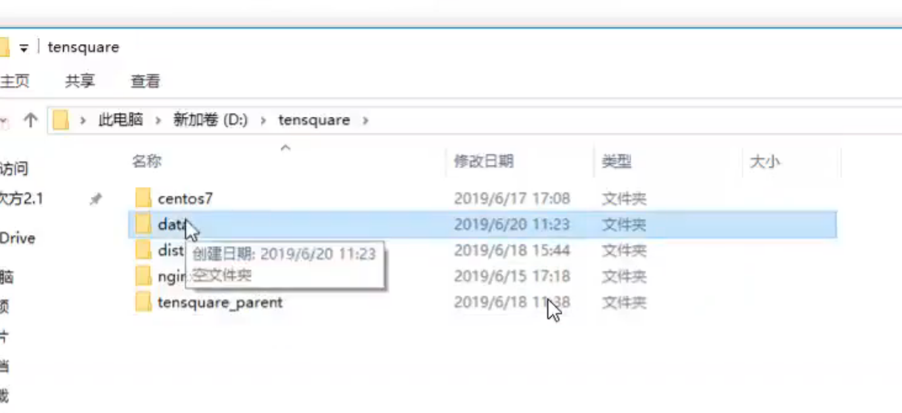


管理员注意      不要放到特殊的地方


我弄到这里的

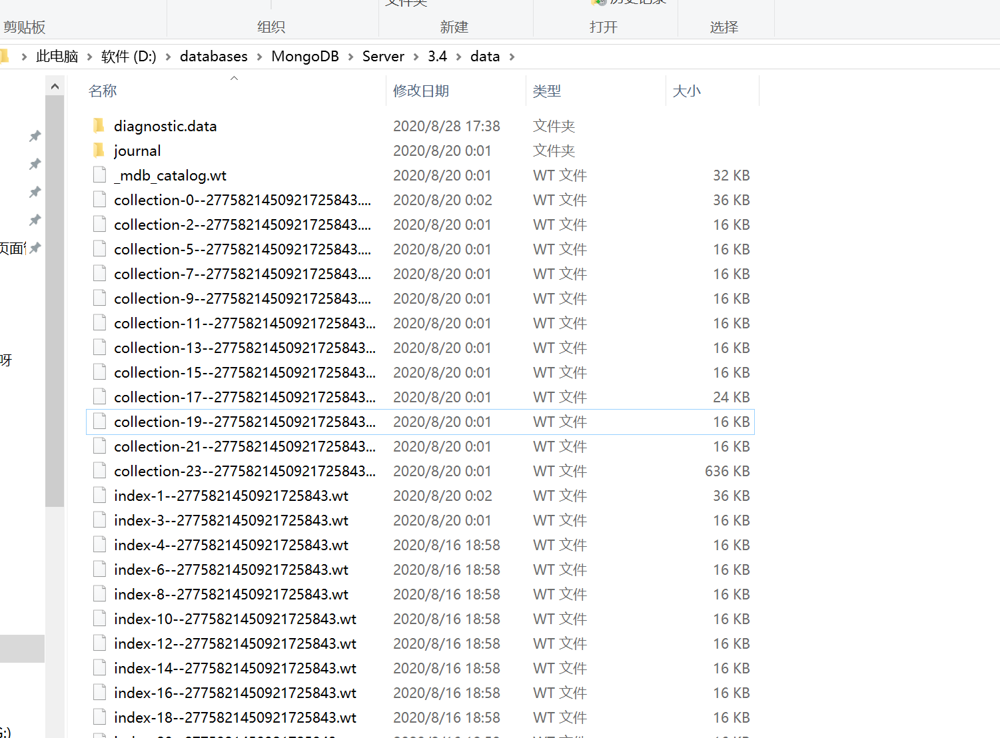


要不要改成我自己的呢  你说呢 


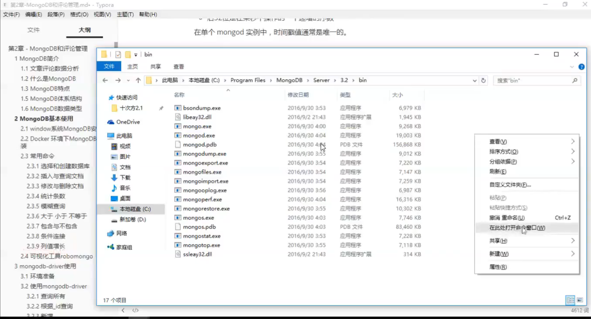


一个空的文件夹


mongod   --dbpath=D:\tensquare\data

 是在当前启动的吗？  路径 


27017

mongo


mongo


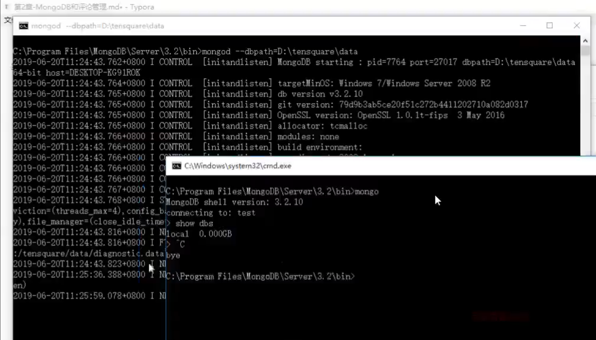


可以自己加上端口

mongod --depath=D:\tensquare\data -port 8989


指定8989


mongo 192.168.200.128:27017


mongo 127.0.0.1:8989

show  dbs

登录  退出  

在Windows上一般使用客户端 不使用服务端  

服务端在Linux上   使用的 

直接客户端连接就行了


- **启动**

1. 创建一个文件夹`d:\data`，用于存放数据的目录data
2. 打开命令行窗口，执行以下命令

```
mongod --dbpath=D:\data
```


我们在启动信息中可以看到，mongoDB的默认端口是27017，如果我们想改变默认的启动端口，可以通过--port来指定端口，例如

```
mongod --dbpath=D:\data -port 8989
```

 

- **登录**

再打开一个新的命令行窗口，执行以下命令：（）

```
mongo 127.0.0.1:27017
```

以上命令中，如果ip是本地服务，端口号是27017，则后面的`127.0.0.1:27017`可以省略

 

- **退出**

```
exit
```

 

### 2.2 Docker 环境下MongoDB安装

在Linux虚拟机中创建mongo容器，命令如下：

```
docker run -id --name mongo -p 27017:27017 mongo
```

 

```
docker run -id --name=tensquare_mongo -p 27017:27017 mongo
```

docker images 

docker ps 

```shell
[root@liuawen ~]# docker images
REPOSITORY                          TAG                 IMAGE ID            CREATED             SIZE
docker.io/rancher/server            latest              85b3b338d0be        2 years ago         1.084 GB
docker.io/centos/mysql-57-centos7   latest              26d536c931ea        2 years ago         445.9 MB
docker.io/mongo                     latest              f93ff881751f        2 years ago         367.6 MB
docker.io/rabbitmq                  management          c51d1c73d028        2 years ago         148.7 MB
docker.io/elasticsearch             5.6.8               6c0bdf761f3b        2 years ago         569.8 MB
docker.io/registry                  latest              d1fd7d86a825        2 years ago         33.26 MB
docker.io/tomcat                    7-jre7              e1ac7618b15d        2 years ago         454.3 MB
docker.io/redis                     latest              1fb7b6c8c0d0        2 years ago         106.6 MB
docker.io/nginx                     latest              1e5ab59102ce        2 years ago         108.3 MB
docker.io/centos                    7                   196e0ce0c9fb        2 years ago         196.6 MB
docker.io/mobz/elasticsearch-head   5                   b19a5c98e43b        3 years ago         823.9 MB
[root@liuawen ~]# docker ps
CONTAINER ID        IMAGE                     COMMAND                  CREATED             STATUS              PORTS                    NAMES
934545b082c6        centos/mysql-57-centos7   "container-entrypoint"   46 hours ago        Up 46 hours         0.0.0.0:3306->3306/tcp   tensquare_mysql
[root@liuawen ~]# docker run -id --name=tensquare_mongo -p 27017:27017 mongo
cd98c23ca61bac0b06014e781d15763a7a56cac210eeb56b30b0c25cd5bd9502
[root@liuawen ~]# docker ps
CONTAINER ID        IMAGE                     COMMAND                  CREATED             STATUS              PORTS                      NAMES
cd98c23ca61b        mongo                     "docker-entrypoint.sh"   5 seconds ago       Up 4 seconds        0.0.0.0:27017->27017/tcp   tensquare_mongo
934545b082c6        centos/mysql-57-centos7   "container-entrypoint"   46 hours ago        Up 46 hours         0.0.0.0:3306->3306/tcp     tensquare_mysql
[root@liuawen ~]# 

```


在Window命令行窗口出入登录命令：

```
mongo 192.168.200.128
```

 


mongo 

27017 

Linux 环境下Docker    的Mongo下


中文 C盘 


腾讯云

拉最新的Mongo  少了少了


Windows去连接服务器的 


版本对应的


先建议连接本地   再远程的

尝试尝试   测试测试  版本不一致的


### 2.3 常用命令

#### 2.3.1 选择和创建数据库


选择和创建数据库的语法格式：

```
use 数据库名称
```

如果数据库存在则选择该数据库，如果数据库不存在则自动创建。以下语句创建commentdb数据库：

```
use commentdb
```

 

查看数据库：

```
show dbs
```

 

查看集合,需要先选择数据库之后，才能查看该数据库的集合：

```
show collections
```

 

如果在  就存储  


use comment  db


json  bson 启


```shell
> use commentdb
switched to db commentdb
> show dbs
admin   0.000GB
config  0.000GB
local   0.000GB
> show collections
> use commentdb
switched to db commentdb
> show collections
> db.comment.insert({"name":"张三"})
WriteResult({ "nInserted" : 1 })
> db.comment.find()
{ "_id" : ObjectId("5f48f2c4482ec394fc213ba6"), "name" : "张三" }
> show collections
comment
>
```


自己指定  

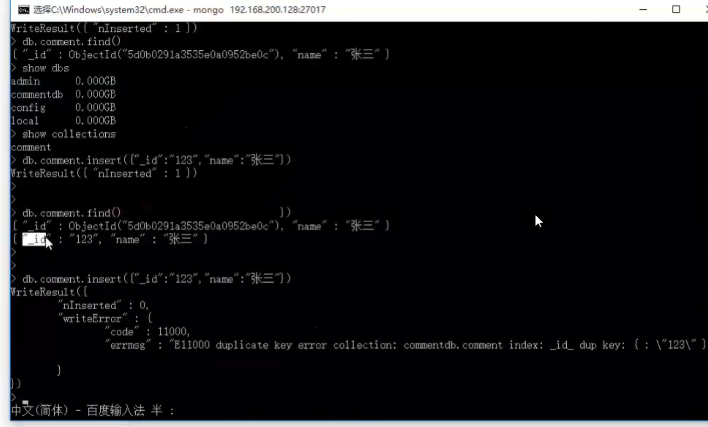


 

#### 2.3.2 插入与查询文档

选择数据库后，使用集合来对文档进行操作，插入文档语法格式：

```
db.集合名称.insert(数据);
```

插入以下测试数据：

```
db.comment.insert({content:"十次方课程",userid:"1011"})
```

 json

db.comment.find()

搞定

查询集合的语法格式：

```
db.集合名称.find()
```

查询集合的语法格式 

查询spit集合的所有文档，输入以下命令：

```
db.comment.find()
```

发现文档会有一个叫_id的字段，这个相当于我们原来关系数据库中表的主键，当你在插入文档记录时没有指定该字段，MongoDB会自动创建，其类型是ObjectID类型。如果我们在插入文档记录时指定该字段也可以，其类型可以是ObjectID类型，也可以是MongoDB支持的任意类型。

 

输入以下测试语句:

```
db.comment.insert({_id:"1",content:"到底为啥出错",userid:"1012",thumbup:2020});
db.comment.insert({_id:"2",content:"加班到半夜",userid:"1013",thumbup:1023});
db.comment.insert({_id:"3",content:"手机流量超了咋办",userid:"1013",thumbup:111});
db.comment.insert({_id:"4",content:"坚持就是胜利",userid:"1014",thumbup:1223});
```

 

按一定条件来查询，比如查询userid为1013的记录，只要在find()中添加参数即可，参数也是json格式，如下：

```
db.comment.find({userid:'1013'})
```

只需要返回符合条件的第一条数据，我们可以使用findOne命令来实现：

```
db.comment.findOne({userid:'1013'})
```

返回指定条数的记录，可以在find方法后调用limit来返回结果，例如：

```
db.comment.find().limit(2)
```

 

```
> use commentdb
switched to db commentdb
> show dbs
admin   0.000GB
config  0.000GB
local   0.000GB
> show collections
> use commentdb
switched to db commentdb
> show collections
> db.comment.insert({"name":"张三"})
WriteResult({ "nInserted" : 1 })
> db.comment.find()
{ "_id" : ObjectId("5f48f2c4482ec394fc213ba6"), "name" : "张三" }
> show collections
comment
> db.comment.insert({content:"十次方课程",userid:"1011"})
WriteResult({ "nInserted" : 1 })
> db.comment.insert({_id:"1",content:"到底为啥出错",userid:"1012",thumbup:2020});
WriteResult({ "nInserted" : 1 })
> db.comment.insert({_id:"2",content:"加班到半夜",userid:"1013",thumbup:1023});
WriteResult({ "nInserted" : 1 })
> db.comment.insert({_id:"3",content:"手机流量超了咋办",userid:"1013",thumbup:111});
WriteResult({ "nInserted" : 1 })
> db.comment.insert({_id:"4",content:"坚持就是胜利",userid:"1014",thumbup:1223});
WriteResult({ "nInserted" : 1 })
> db.comment.find({userid:'1013'})
{ "_id" : "2", "content" : "加班到半夜", "userid" : "1013", "thumbup" : 1023 }
{ "_id" : "3", "content" : "手机流量超了咋办", "userid" : "1013", "thumbup" : 111 }
> b.comment.findOne({userid:'1013'})
2020-08-28T20:06:42.135+0800 E QUERY    [thread1] ReferenceError: b is not defined :
@(shell):1:1
>
> db.comment.find().limit(2)
{ "_id" : ObjectId("5f48f2c4482ec394fc213ba6"), "name" : "张三" }
{ "_id" : ObjectId("5f48f33b482ec394fc213ba7"), "content" : "十次方课程", "userid" : "1011" }
>
```


#### 2.3.3 修改与删除文档

修改文档的语法结构：

```
db.集合名称.update(条件,修改后的数据)
```

修改_id为1的记录，点赞数为1000，输入以下语句：

```
db.comment.update({_id:"1"},{thumbup:1000})
```

执行后发现，这条文档除了thumbup字段其它字段都不见了。

为了解决这个问题，我们需要使用修改器$set来实现，命令如下：

```
db.comment.update({_id:"2"},{$set:{thumbup:2000}})
```

 

删除文档的语法结构：

```
db.集合名称.remove(条件)
```

以下语句可以将数据全部删除，慎用~

```
db.comment.remove({})
```

删除条件可以放到大括号中，例如删除thumbup为1000的数据，输入以下语句：

```
db.comment.remove({thumbup:1000})
```

 

#### 2.3.4 统计条数

统计记录条件使用count()方法。以下语句统计spit集合的记录数：

```
db.comment.count()
```

按条件统计 ，例如统计userid为1013的记录条数：

```
db.comment.count({userid:"1013"})
```

 

#### 2.3.5 模糊查询

MongoDB的模糊查询是通过正则表达式的方式实现的。格式为：

```
/模糊查询字符串/
```

查询评论内容包含“流量”的所有文档，代码如下：

```
db.comment.find({content:/流量/})
```

查询评论内容中以“加班”开头的，代码如下：

```
db.comment.find({content:/^加班/})
```

 

#### 2.3.6 大于 小于 不等于

<, <=, >, >= 这个操作符也是很常用的，格式如下:

```
db.集合名称.find({ "field" : { $gt: value }}) // 大于: field > value
db.集合名称.find({ "field" : { $lt: value }}) // 小于: field < value
db.集合名称.find({ "field" : { $gte: value }}) // 大于等于: field >= value
db.集合名称.find({ "field" : { $lte: value }}) // 小于等于: field <= value
db.集合名称.find({ "field" : { $ne: value }}) // 不等于: field != value
```

查询评论点赞数大于1000的记录：

```
db.comment.find({thumbup:{$gt:1000}})
```

 

#### 2.3.7 包含与不包含

包含使用$in操作符

查询评论集合中userid字段包含1013和1014的文档：

```
db.comment.find({userid:{$in:["1013","1014"]}})
```

 

不包含使用$nin操作符

查询评论集合中userid字段不包含1013和1014的文档：

```
db.comment.find({userid:{$nin:["1013","1014"]}})
```

 

#### 2.3.8 条件连接

我们如果需要查询同时满足两个以上条件，需要使用$and操作符将条件进行关联（相当于SQL的and）。格式为：

```
$and:[ {条件},{条件},{条件} ]
```

查询评论集合中thumbup大于等于1000 并且小于2000的文档：

```
db.comment.find({$and:[ {thumbup:{$gte:1000}} ,{thumbup:{$lt:2000} }]})
```

 

如果两个以上条件之间是或者的关系，我们使用操作符进行关联，与前面and的使用方式相同，格式为：

```
$or:[ {条件},{条件},{条件} ]
```

查询评论集合中userid为1013，或者点赞数小于2000的文档记录：

```
db.comment.find({$or:[ {userid:"1013"} ,{thumbup:{$lt:2000} }]})
```

 

#### 2.3.9 列值增长

对某列值在原有值的基础上进行增加或减少，可以使用$inc运算符：

```
db.comment.update({_id:"2"},{$inc:{thumbup:1}})
```

 

### 2.4 可视化工具robomongo

Mongodb有很多可视化工具，这里我们使用robomongo，可以访问官网：https://robomongo.org/


我们可以看到有两个版本Studio 3T和Robo 3T

Studio 3T是一个功能很强大的收费版。。。


Robo 3T前身就是Robomongo，是一个免费的可视化工具，我们使用他可以很轻松的进行Mongodb的管理。

 

在资料中找到robo3t-1.3.1-windows-x86_64-7419c406.exe并双击安装。打开后看到以下界面：


点击`Create`创建连接，进行如下配置即可：


可视化的  


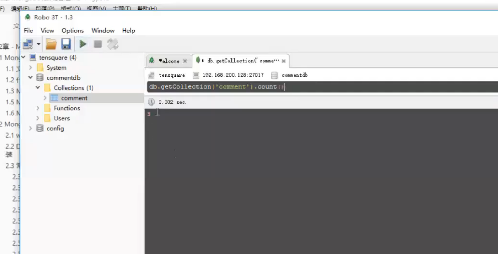


可以命令 也可以可视化的 

用它   简化对Mongo的操作  嘿嘿


Studio  强大很多的

查询    直接使用  数据的编辑  查询呢    使用一个月   熟悉起来 过期了  卸载去 

 

## 3 mongodb-driver使用

mongodb-driver是mongo官方推出的java连接mongoDB的驱动包，相当于JDBC驱动。我们现在来使用mongodb-driver完成对Mongodb的操作。

 

mongodb-driver   

最后的项目   重心  偏移  

去找工作了  简历  面试  去笔试

理解  敲代码    一到两个项目

跟着这个去走

招聘网站 同步上去  适当去投简历


网站投递了   电话面试  招聘

同事    开始了   开启了2021招聘

电话面试 已经启动了

笔试 面试   简历   发过来   模拟面试  统一的   

大规模  准备  时间     授课  问题的解决

家里的办公   工作重心   以及毕业  先把工作到前面去

时间去搞    一天 两天就可以找工作了

一个月的时间都不够的  时间去

笔试 面试 去联  去记忆


面试题拿给你  你也是自闭的

好几十个人  还在  写代码呢   课程结束      不再过年样的

放假   正常学习的  


刚开始  注意力    把握  重点 我们

试一试 水  不知道面试 面什么 怎么去工作的

去问一下    岗位   模块  负责人  找人去做什么  什么技术栈

做什么功能  不足 补一补  

认真起来了 课程  笔试 面试  


mongodb-driver是mongo官方推出的java连接mongoDB的驱动包，相当于JDBC驱动。我们现在来使用mongodb-driver完成对Mongodb的操作。

mongodb

ObjectId   用户指定  性能有影响

使用系统生成的


名字不要太长了

Docker连接、

命令敲一敲    总结起来  去敲     文档  整理一下


编程阶段

Java代码来操作 Mongo

Java连接的     Mongo官方出的   mongodb-driver

创建一个


### 3.1 环境准备

创建工程，并添加以下依赖：

```
<dependency>
    <groupId>org.mongodb</groupId>
    <artifactId>mongodb-driver</artifactId>
    <version>3.10.1</version>
</dependency>
```

 

### 3.2 使用mongodb-driver

#### 3.2.1 查询所有

```
@Test
public void test1() {
    //创建连接
    MongoClient client = new MongoClient("192.168.200.128");
    //打开数据库
    MongoDatabase commentdb = client.getDatabase("commentdb");
    //获取集合
    MongoCollection<Document> comment = commentdb.getCollection("comment");

    //查询
    FindIterable<Document> documents = comment.find();

    //查询记录获取文档集合
    for (Document document : documents) {
        System.out.println("_id：" + document.get("_id"));
        System.out.println("内容：" + document.get("content"));
        System.out.println("用户ID:" + document.get("userid"));
        System.out.println("点赞数：" + document.get("thumbup"));
    }
    //关闭连接
    client.close();
}
```

 

#### 3.2.2 根据_id查询

每次使用都要用到MongoCollection，进行抽取：

```
private MongoClient client;
private MongoCollection<Document> comment;

@Before
public void init() {
    //创建连接
    client = new MongoClient("192.168.200.128");
    //打开数据库
    MongoDatabase commentdb = client.getDatabase("commentdb");
    //获取集合
    comment = commentdb.getCollection("comment");
}

@After
public void after() {
    client.close();
}
```

 

测试根据_id查询：

```
@Test
public void test2() {
    //查询
    FindIterable<Document> documents = comment.find(new BasicDBObject("_id", "1"));

    //查询记录获取文档集合
    for (Document document : documents) {
        System.out.println("_id：" + document.get("_id"));
        System.out.println("内容：" + document.get("content"));
        System.out.println("用户ID:" + document.get("userid"));
        System.out.println("点赞数：" + document.get("thumbup"));
    }
}
```

 

#### 3.2.3 新增

```
@Test
public void test3() {
    Map<String, Object> map = new HashMap();
    map.put("_id", "6");
    map.put("content", "很棒！");
    map.put("userid", "9999");
    map.put("thumbup", 123);

    Document document = new Document(map);

    comment.insertOne(document);
}
```

 

#### 3.2.4 修改

```
@Test
public void test4() {
    //修改的条件
    Bson filter = new BasicDBObject("_id", "6");
    //修改的数据
    Bson update = new BasicDBObject("$set", new Document("userid", "8888"));

    comment.updateOne(filter, update);
}
```

 

#### 3.2.5 删除

```
@Test
public void test5() {
    //删除的条件
    Bson filter = new BasicDBObject("_id", "6");

    comment.deleteOne(filter);
}
```

 

## 4 文章评论实现

SpringDataMongoDB是SpringData家族成员之一，用于操作MongoDb的持久层框架，封装了底层的mongodb-driver。本功能使用SpringDataMongoDB进行开发

### 4.1 需求分析

评论集合结构：

| 专栏文章评论 | comment  |          |                           |
| :----------- | :------- | :------- | :------------------------ |
| 字段名称     | 字段含义 | 字段类型 | 备注                      |
| _id          | ID       | 文本     |                           |
| articleid    | 文章ID   | 文本     |                           |
| content      | 评论内容 | 文本     |                           |
| userid       | 评论人ID | 文本     |                           |
| parentid     | 评论ID   | 文本     | 如果为0表示文章的顶级评论 |
| publishdate  | 评论日期 | 日期     |                           |
| thumbup      | 点赞数   | 数字     |                           |

需要实现以下功能：

1. 基本增删改查API
2. 根据文章id查询评论
3. 评论点赞

 

 

### 4.2 开发准备

在文章微服务添加依赖：

```
<dependency>
    <groupId>org.springframework.boot</groupId>
    <artifactId>spring-boot-starter-data-mongodb</artifactId>
</dependency>
```

 

添加配置文件：

```
  data:
    mongodb:
      database: commentdb
      host: 192.168.200.128
```

 

### 4.3 功能实现

#### 4.3.1 基本增删改查API

创建实体类:

```
public class Comment implements Serializable {
    @Id
    private String _id;
    private String articleid;
    private String content;
    private String userid;
    private String parentid;
    private Date publishdate;
    private Integer thumbup;

    //getter  and  setter....
}
```

 

在com.tensquare.article.repository包中编写CommentRepository，注意不要和MyBatis的接口放在一个包：

```
public interface CommentRepository extends MongoRepository<Comment, String> {
}
```

 

编写Service：

```
@Service
public class CommentService {

    @Autowired
    private IdWorker idWorker;
    @Autowired
    private CommentRepository commentRepository;

    public Comment findById(String id) {
        return commentDao.findById(id).get();
    }

    public List<Comment> findAll() {
        return commentDao.findAll();
    }

    public void save(Comment comment) {
        String id = idWorker.nextId() + "";
        comment.set_id(id);
        
        //初始化数据
        comment.setPublishdate(new Date());
        comment.setThumbup(0);

        commentDao.save(comment);
    }

    public void update(Comment comment) {
        commentDao.save(comment);
    }

    public void deleteById(String id) {
        commentDao.deleteById(id);
    }
}
```

 

编写Controller：

```
@RestController
@RequestMapping("comment")
@CrossOrigin
public class CommentController {

    @Autowired
    private CommentService commentService;

    //根据id查询评论
    @RequestMapping(value = "{id}", method = RequestMethod.GET)
    public Result findById(@PathVariable String id) {
        Comment comment = commentService.findById(id);
        return new Result(true, StatusCode.OK, "查询成功", comment);
    }

    //查询所有
    @RequestMapping(method = RequestMethod.GET)
    public Result findAll() {
        List<Comment> list = commentService.findAll();
        return new Result(true, StatusCode.OK, "查询成功", list);
    }

    //新增
    @RequestMapping(method = RequestMethod.POST)
    public Result save(@RequestBody Comment comment) {
        commentService.save(comment);
        return new Result(true, StatusCode.OK, "新增成功");
    }

    //修改
    @RequestMapping(value = "{id}", method = RequestMethod.PUT)
    public Result update(@PathVariable String id,
                         @RequestBody Comment comment) {
        comment.set_id(id);
        commentService.update(comment);
        return new Result(true, StatusCode.OK, "修改成功");
    }

    //删除
    @RequestMapping(value = "{id}", method = RequestMethod.DELETE)
    public Result deleteById(@PathVariable String id) {
        commentService.deleteById(id);
        return new Result(true, StatusCode.OK, "删除成功");
    }
}
```

 

#### 4.3.2 根据文章id查询评论

编写Controller

```
//根据文章id查询评论列表
@RequestMapping(value = "{articleId}", method = RequestMethod.GET)
public Result findByarticleId(@PathVariable String articleId) {
    List<Comment> list = commentService.findByarticleId(articleId);
    return new Result(true, StatusCode.OK, "查询成功", list);
}
```

 

编写Service

```
public List<Comment> findByarticleId(String articleId) {
    return commentDao.findByArticleid(articleId);
}
```

 

编写dao

```
public interface CommentDao extends MongoRepository<Comment, String> {
    //根据文章id查询评论列表
    List<Comment> findByArticleid(String articleId);
}
```

 

#### 4.3.4 评论点赞

先根据评论的id查询，再对点赞数加一

编写service

```
public void thumbup(String id) {
    //查询评论
    Comment comment = commentDao.findById(id).get();
    //修改点赞数
    comment.setThumbup(comment.getThumbup() + 1);

    commentDao.save(comment);
}
```

编写Controller

```
//评论点赞
@RequestMapping(value = "thumbup/{id}", method = RequestMethod.PUT)
public Result thumbup(@PathVariable String id) {
    commentService.thumbup(id);
    return new Result(true, StatusCode.OK, "点赞成功");
}
```

 

以上操作需要操作两次数据库，性能较低，service方法优化如下：

```
    @Autowired
    private MongoTemplate mongoTemplate;

    public void thumbup(String id) {
        ////查询评论
        //Comment comment = commentDao.findById(id).get();
        ////修改点赞数
        //comment.setThumbup(comment.getThumbup() + 1);
        //commentDao.save(comment);

        //修改条件
        Query query = new Query();
        query.addCriteria(Criteria.where("_id").is(id));
        //修改的数据
        Update update = new Update();
        //在原来的基础上加一
        update.inc("thumbup", 1);
        mongoTemplate.updateFirst(query, update, "comment");
    }
```

 

#### 4.3.5 不能重复点赞

点赞功能完成后，发现可以重复点赞，我们应该改为一个人只能点赞一次。

可以使用评论id+用户id进行标记，一个用户只能点赞一次。可以使用redis保存点赞信息，速度较快

 

pom.xml添加依赖：

```
<dependency>
    <groupId>org.springframework.boot</groupId>
    <artifactId>spring-boot-starter-data-redis</artifactId>
</dependency>
```

 

在Linux虚拟机中创建redis容器：

```
docker run -id --name=tensquare_redis -p 6379:6379 redis
```

 

配置文件添加配置：

```
  redis:
    host: 192.168.200.128
```

 

修改Controller方法：

```
@Autowired
private RedisTemplate redisTemplate;

//评论点赞
@RequestMapping(value = "thumbup/{id}", method = RequestMethod.PUT)
public Result thumbup(@PathVariable String id) {
    //模拟获取到了用户id
    String userid = "123";

    //在redis中查询用户是否已经点赞
    Object result = redisTemplate.opsForValue().get("thumbup_" + userid + "_" + id);

    //如果点赞不能重复点赞
    if (result != null) {
        return new Result(false, StatusCode.REMOTEERROR, "不能重复点赞");
    }

    //如果没有点赞，可以进行点赞操作
    commentService.thumbup(id);

    //保存点赞记录
    redisTemplate.opsForValue().set("thumbup_" + userid + "_" + id, 1);

    return new Result(true, StatusCode.OK, "点赞成功");
}
```

 

 