# 第6章 - Redis分布式缓存

学习目标：

- 掌握Redis性能测试
- 掌握Redis读写分离搭建
- 掌握Redis高可用Sentinel搭建
- 掌握Sentinel整合SpringBoot
- 掌握Redis内置集群搭建和维护
- 掌握内置集群整合SpringBoot
- 掌握twemProxy搭建Redis分片式集群

 

 多线程   技术一个点

读写分离

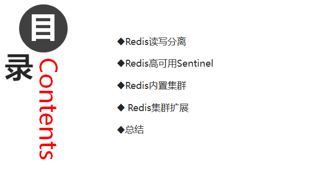


单个 性能不足 

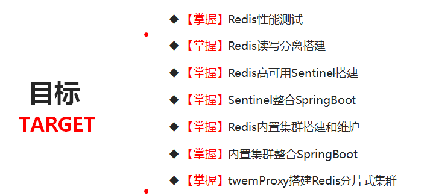

Redis读写分离-课程计划

Redis读写分离-性能测试
单机Redis的读写速度非常快，能够支持大量用户的访问。虽然Redis的性能很高，但是对于大型网站来说，每秒需要获取的数据远远超过单台redis服务所能承受的压力，所以我们迫切需要一种方案能够解决单台Redis服务性能不足的问题。


可用性  一个挂掉了 不行


测试  性能不足 

不同数据  数据一致 


主从 

从顶上


## 1. Redis读写分离

单机Redis的读写速度非常快，能够支持大量用户的访问。虽然Redis的性能很高，但是对于大型网站来说，每秒需要获取的数据远远超过单台redis服务所能承受的压力，所以我们迫切需要一种方案能够解决单台Redis服务性能不足的问题。

 还是不够的

  单机Redis的读写速度非常快

支持大量用户的访问

 获取的数据    超过单台Redis所能承受的压力单台的Rdis服务性能不足的问题

单机Redis的读写速度非常快的 

大型网站   每秒需要获取的数据远远超过单台Redis服务所能承受的压力 

一种方案能够解决单体Redis服务性能不足的问题


读写速度非常快

单机？？？

大型网站来说  超大型 每秒数据的要求 

单体Redis服务性能不足的原因  


Redis读写分离      方案之一  


单体不够用 满足不了网站的需求

 

### 1.1 Redis性能测试

单体Redis服务性能不足 性能

#### 1.1.1 redis-benchmark

redis-benchmark是官方自带的Redis性能测试工具，用来测试Redis在当前环境下的读写性能。我们在使用Redis的时候，服务器的硬件配置、网络状况、测试环境都会对Redis的性能有所影响，我们需要对Redis实时测试以确定Redis的实际性能。

 硬件配置  网络状况 测试环境

实时测试  Redis的实际性能  

使用语法：

```
redis-benchmark [参数] [参数值]
```

参数说明：

bench

n. 长凳；工作台；替补队员
vt. 给…以席位；为…设置条凳

benchmark

n. 基准；标准检查程序
vt. 用基准问题测试（计算机系统等）

-h -p 6379

-c 高并发  实际的业务场景

-k  

keep alive

不指定  -t 很多很多命令都执行 

| 选项  | 描述                                       | 默认值    |
| :---- | :----------------------------------------- | :-------- |
| -h    | 指定服务器主机名                           | 127.0.0.1 |
| -p    | 指定服务器端口                             | 6379      |
| -s    | 指定服务器 socket                          |           |
| -c    | 指定并发连接数                             | 50        |
| -n    | 指定请求数                                 | 10000     |
| -d    | 以字节的形式指定 SET/GET 值的数据大小      | 2         |
| -k    | 1=keep alive 0=reconnect                   | 1         |
| -r    | SET/GET/INCR 使用随机 key, SADD 使用随机值 |           |
| -P    | 通过管道传输 请求                          | 1         |
| -q    | 强制退出 redis。仅显示 query/sec 值        |           |
| --csv | 以 CSV 格式输出                            |           |
| -l    | 生成循环，永久执行测试                     |           |
| -t    | 仅运行以逗号分隔的测试命令列表。           |           |
| -I    | Idle 模式。仅打开 N 个 idle 连接并等待。   |           |

 高版本保护机制   关掉


**安装redis**

在虚拟机中安装c++环境：

```
yum install gcc-c++
```

 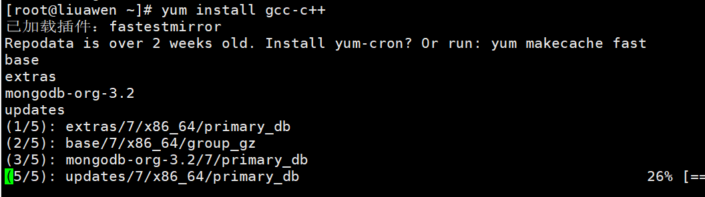

tar  -zxf  

安装Redis，依次执行以下命令：

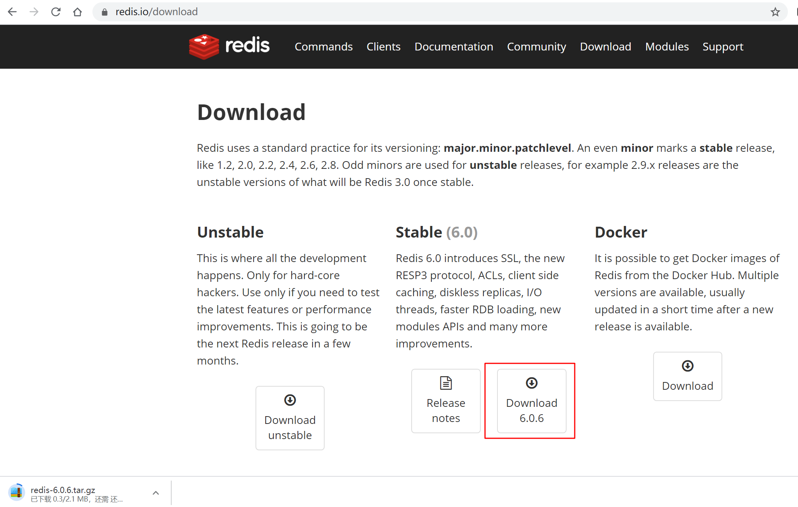


```
$ wget http://download.redis.io/releases/redis-6.0.6.tar.gz
$ tar xzf redis-6.0.6.tar.gz
$ cd redis-6.0.6
$ make
```


```shell
[root@liuawen ~]# tar -zxf redis-4.0.14.tar.gz 
[root@liuawen ~]# cd redis-4.0.14
[root@liuawen redis-4.0.14]# make
cd src && make all
make[1]: 进入目录“/root/redis-4.0.14/src”
    CC Makefile.dep
make[1]: 离开目录“/root/redis-4.0.14/src”
make[1]: 进入目录“/root/redis-4.0.14/src”

```

prefix  地址  

daemonize  守护线程一定要开  不然关窗口就是关了

Redis服务


默认本地访问   

Redis是没有密码   ip:端口  直接访问

部署Redis  攻击    挖坑  木马 

线下  

不用默认端口     6379

开启aof持久化

持久化 本地磁盘    缓冲区

写到磁盘上 先缓冲区 写满了 再本地磁盘 


notepad++  直接插件  

连接Linux连接服务器插件

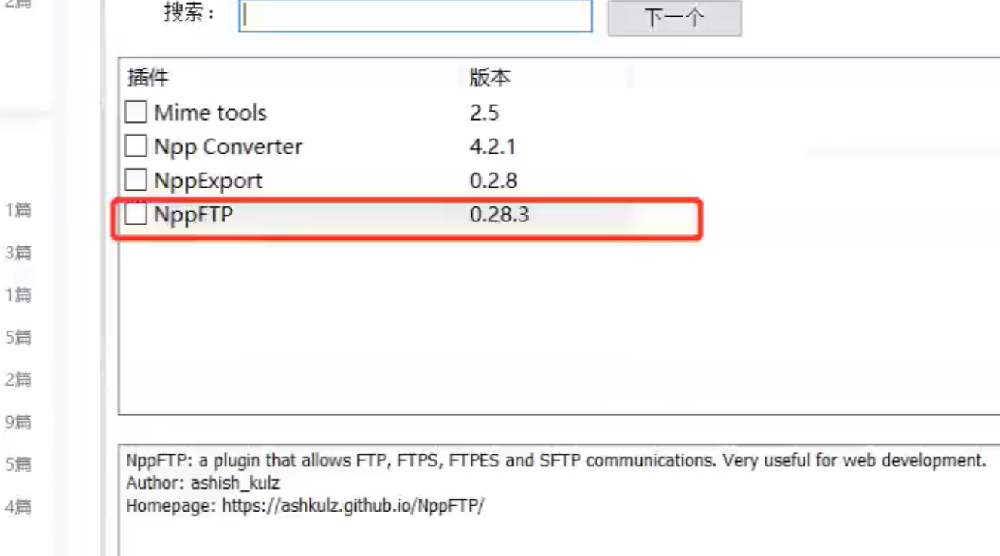

失败 

绿色版 

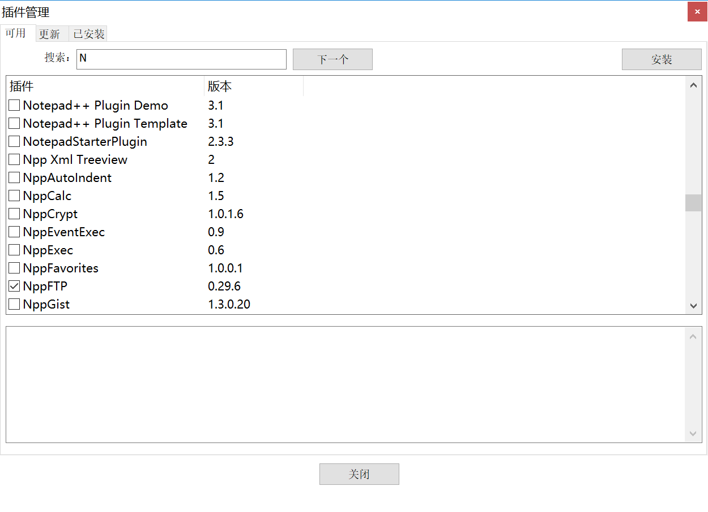

2、若无法直接更新插件，在NppFTP下载完成后，将nppFTP.dll文件放至Notepad++的安装路径下的plugins文件夹下。如下所示，我的Notepad++装在了C盘：

C:\Program Files (x86)\Notepad++\plugins


3、重启Notepad++就可以看到工具栏的图标，点击图标在界面的右侧有FTP连接窗口。

另外：此时再打开Plugin Manager，选择Installed标签，可以看到显示已经安装的NppFTP插件。

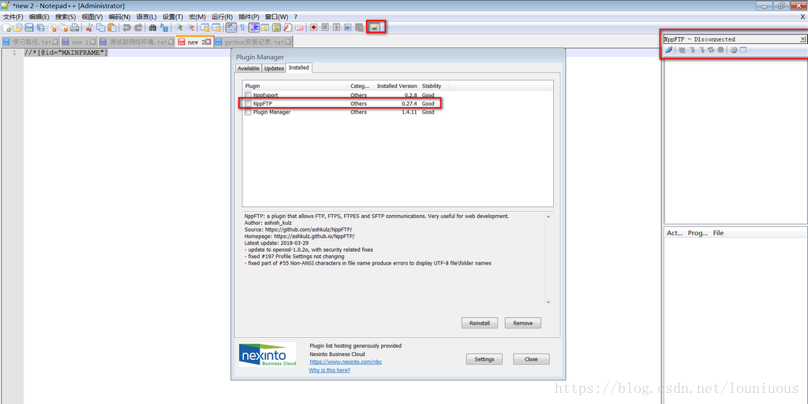

4、连接Linux操作系统，这里是我安装的虚拟机上的操作系统

设置连接参数：设置如下

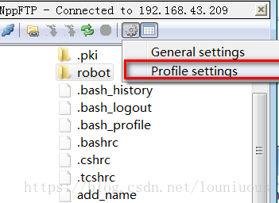

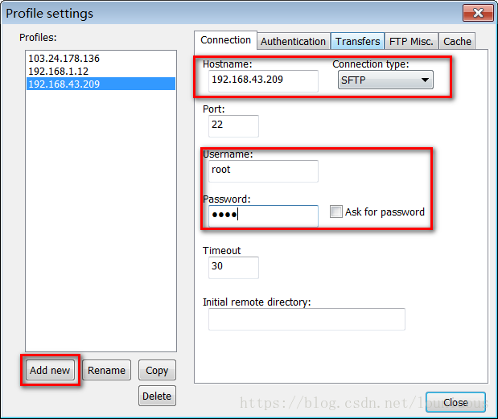

5、点击连接按钮，选择对应的Hostname，在弹出的“是否信任Key”的对话框中选择“Y”，选择“N”则会有红色错误提示。

连接成功后，点击Linux系统中的myfile unix文件。可以在notepad++中编辑该文件，并保存。

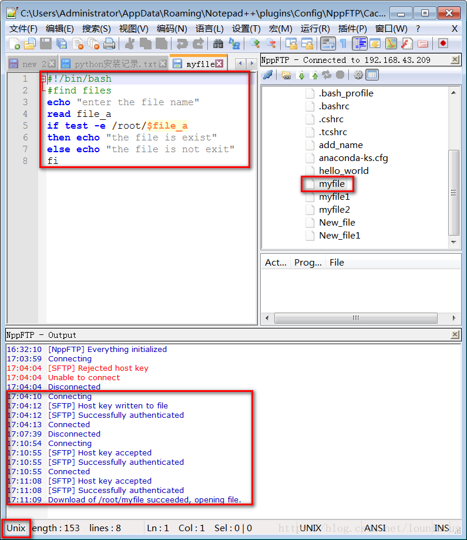

6、注意：在Notepad++中默认创建的文件时windows格式的，把在windows下编辑的文件直接拖入linux的界面下是不能运行的。需要修改为unix文件。

选择“编辑”-->“文档格式转换”-->“转换为windows格式/UNIX格式”

下面：对比下Linux下的文件和windows下的文件区别，这里只显示了回车符的差异，其他字符未显示

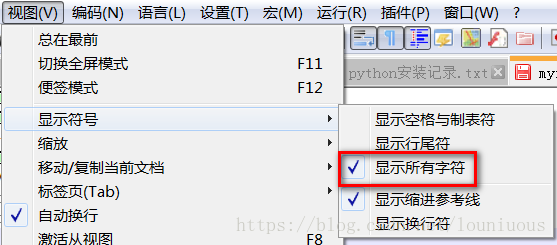

 

linux文件

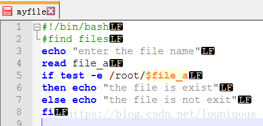

windows文件

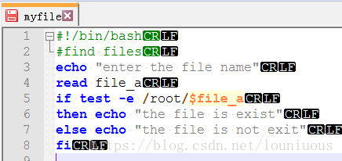

因此如果你想在windows环境下编辑Linux文件，需要提前转换好文件格式。如果不确定是那种格式，直接打开所有字符。

ctrl s    保存一下


```shell
[root@liuawen redis-4.0.14]# clear
[root@liuawen redis-4.0.14]# make install PREFIX=/usr/local/redis
cd src && make install
make[1]: 进入目录“/root/redis-4.0.14/src”
    CC Makefile.dep
make[1]: 离开目录“/root/redis-4.0.14/src”
make[1]: 进入目录“/root/redis-4.0.14/src”

Hint: It's a good idea to run 'make test' ;)

    INSTALL install
    INSTALL install
    INSTALL install
    INSTALL install
    INSTALL install
make[1]: 离开目录“/root/redis-4.0.14/src”
[root@liuawen redis-4.0.14]# cd /usr/local/redis/bin
[root@liuawen bin]# cp /root/redis-4.0.14/redis.conf ./
[root@liuawen bin]# ll
总用量 21960
-rwxr-xr-x. 1 root root 2452928 9月   1 10:00 redis-benchmark
-rwxr-xr-x. 1 root root 5779664 9月   1 10:00 redis-check-aof
-rwxr-xr-x. 1 root root 5779664 9月   1 10:00 redis-check-rdb
-rwxr-xr-x. 1 root root 2619008 9月   1 10:00 redis-cli
-rw-r--r--. 1 root root   58766 9月   1 10:00 redis.conf
lrwxrwxrwx. 1 root root      12 9月   1 10:00 redis-sentinel -> redis-server
-rwxr-xr-x. 1 root root 5779664 9月   1 10:00 redis-server
[root@liuawen bin]# 


```

cp /root/redis-4.0.14/redis.conf ./    ./当前路径

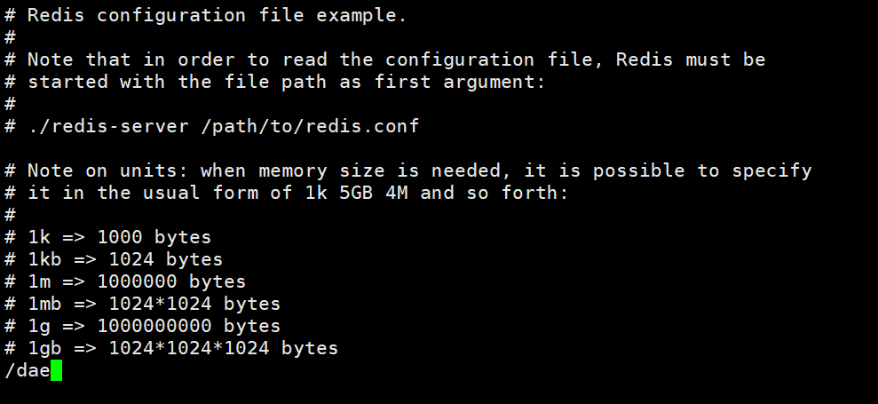

搜索  dae

不做限制 在那里都可以访问


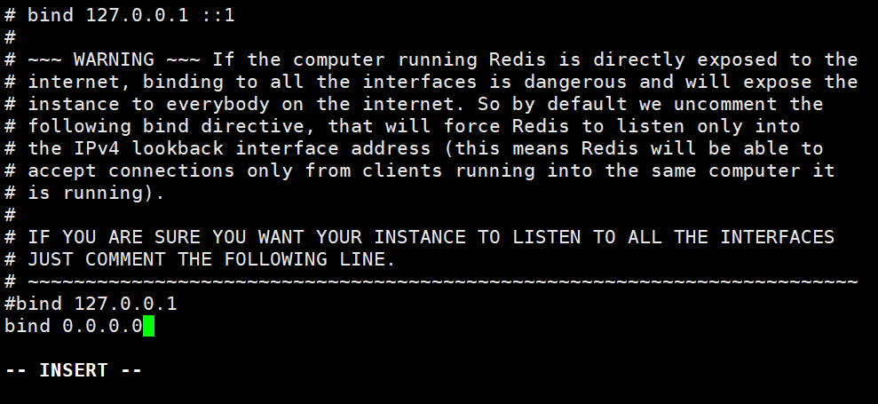


prefix  usr/local/redis

```
# 解压
tar -zxf redis-4.0.14.tar.gz
# 进入解压目录
cd redis-4.0.14
# 编译
make
# 安装
make install PREFIX=/usr/local/redis
# 进入安装好的redis目录
cd /usr/local/redis/bin
# 复制配置文件
cp /root/redis-4.0.14/redis.conf ./

# 修改配置文件
vi redis.conf
# Redis后台启动
修改 daemonize 为 yes
# Redis服务器可以跨网络访问
修改 bind 为 0.0.0.0
# 开启aof持久化
appendonly yes

# 启动redis
./redis-server redis.conf
```

 

```shell
[root@liuawen bin]# vi redis.conf
[root@liuawen bin]# ./redis-server redis.conf
13698:C 01 Sep 10:11:32.246 # oO0OoO0OoO0Oo Redis is starting oO0OoO0OoO0Oo
13698:C 01 Sep 10:11:32.246 # Redis version=4.0.14, bits=64, commit=00000000, modified=0, pid=13698, just started
13698:C 01 Sep 10:11:32.247 # Configuration loaded
[root@liuawen bin]# 
[root@liuawen bin]# ps -ef | grep redis
systemd+  7545  7528  0 8月30 ?       00:12:08 redis-server *:6379
root     13702 10269  0 10:12 pts/0    00:00:00 grep --color=auto redis

```


执行以下命令，测试性能：

```
# 执行测试性能命令
./redis-benchmark -t set,get -n 100000
```

 -p  没本地测试

执行结果如下：

```
====== SET ======
  100000 requests completed in 1.97 seconds
  50 parallel clients
  3 bytes payload
  keep alive: 1

95.32% <= 1 milliseconds
99.46% <= 2 milliseconds
99.67% <= 3 milliseconds
99.72% <= 4 milliseconds
99.84% <= 5 milliseconds
99.88% <= 6 milliseconds
99.90% <= 10 milliseconds
99.95% <= 18 milliseconds
99.97% <= 19 milliseconds
100.00% <= 19 milliseconds
50761.42 requests per second

====== GET ======
  100000 requests completed in 1.92 seconds
  50 parallel clients
  3 bytes payload
  keep alive: 1

97.49% <= 1 milliseconds
99.95% <= 16 milliseconds
100.00% <= 16 milliseconds
52110.47 requests per second
```

 

在上面的测试结果中，我们关注GET结果最后一行 `52110.47 requests per second` ，即每秒GET命令处理52110.47个请求，即QPS5.2万。但这里的数据都只是理想的测试数据，测出来的QPS不能代表实际生产的处理能力。

QPS  五万 十万  性能问题  

不能代表实际性能


 ```shell
[root@liuawen bin]# ./redis-benchmark -t set,get -n 100000
====== SET ======
  100000 requests completed in 4.22 seconds
  50 parallel clients
  3 bytes payload
  keep alive: 1

12.00% <= 1 milliseconds
74.71% <= 2 milliseconds
91.14% <= 3 milliseconds
96.09% <= 4 milliseconds
98.14% <= 5 milliseconds
99.03% <= 6 milliseconds
99.44% <= 7 milliseconds
99.63% <= 8 milliseconds
99.80% <= 9 milliseconds
99.86% <= 10 milliseconds
99.90% <= 11 milliseconds
99.90% <= 19 milliseconds
99.94% <= 20 milliseconds
99.95% <= 21 milliseconds
99.99% <= 22 milliseconds
100.00% <= 23 milliseconds
100.00% <= 23 milliseconds
23696.68 requests per second

====== GET ======
  100000 requests completed in 4.93 seconds
  50 parallel clients
  3 bytes payload
  keep alive: 1

10.99% <= 1 milliseconds
68.42% <= 2 milliseconds
86.74% <= 3 milliseconds
93.56% <= 4 milliseconds
96.16% <= 5 milliseconds
97.44% <= 6 milliseconds
98.46% <= 7 milliseconds
98.99% <= 8 milliseconds
99.30% <= 9 milliseconds
99.36% <= 10 milliseconds
99.44% <= 11 milliseconds
99.48% <= 12 milliseconds
99.51% <= 13 milliseconds
99.61% <= 14 milliseconds
99.69% <= 15 milliseconds
99.69% <= 16 milliseconds
99.73% <= 17 milliseconds
99.75% <= 18 milliseconds
99.75% <= 19 milliseconds
99.75% <= 20 milliseconds
99.76% <= 21 milliseconds
99.77% <= 22 milliseconds
99.78% <= 25 milliseconds
99.82% <= 26 milliseconds
99.82% <= 27 milliseconds
99.83% <= 28 milliseconds
99.86% <= 34 milliseconds
99.86% <= 35 milliseconds
99.86% <= 36 milliseconds
99.88% <= 37 milliseconds
99.90% <= 39 milliseconds
99.90% <= 45 milliseconds
99.91% <= 46 milliseconds
99.92% <= 49 milliseconds
99.95% <= 50 milliseconds
99.95% <= 101 milliseconds
99.96% <= 105 milliseconds
99.96% <= 106 milliseconds
100.00% <= 106 milliseconds
20296.33 requests per second


[root@liuawen bin]# 

 ```


物理磁盘  内存 资源

不是很理想


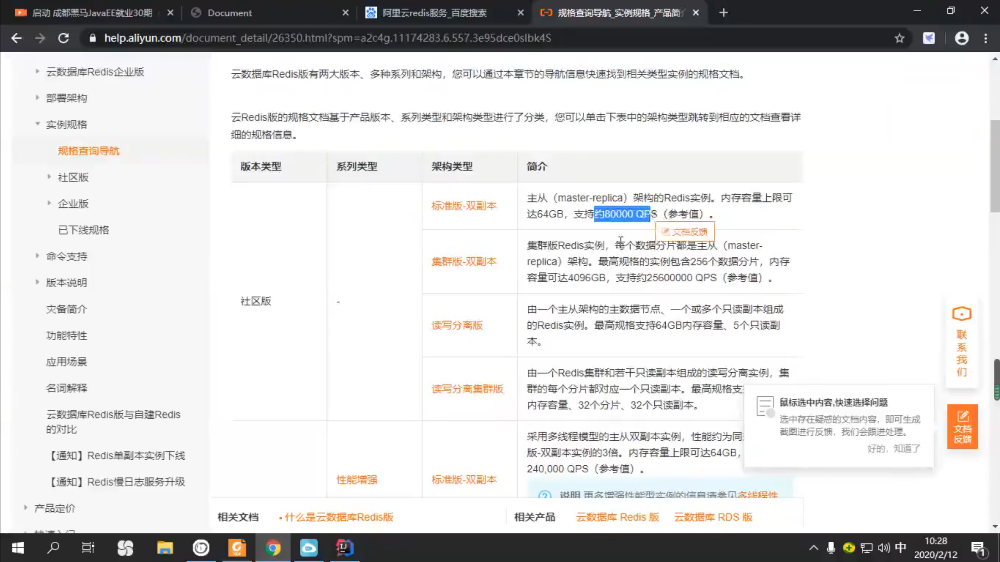

几千万 QPS  

十万级别  正常的  

最简单的测试 我们这里 

#### 1.1.2 TPS、QPS、RT

在描述系统的高并发能力时，吞吐量（TPS）、QPS、响应时间（RT）经常提到，我们先了解这些概念：

- 响应时间RT
- 吞吐量TPS
- 每秒查询率QPS

 描述系统的高并发能力

response time


**响应时间(RT)**

响应时间是指系统对请求作出响应的时间。

直观上看，这个指标与人对软件性能的主观感受是非常一致的，因为它完整地记录了整个计算机系统处理请求的时间。由于一个系统通常会提供许多功能，而不同功能的业务逻辑也千差万别，因而不同功能的响应时间也不尽相同。

在讨论一个系统的响应时间时，通常是指该系统所有功能的**平均时间**或者所有功能的**最大响应时间**。

 平均时间  最大响应时间 

响应时间 

系统所有功能的平均时间   

或者 所用功能的最大响应时间

系统中最大的  

**吞吐量TPS**

吞吐量是指系统在单位时间内处理请求的数量。

对于一个多用户的系统，如果只有一个用户使用时系统的平均响应时间是t，当有你n个用户使用时，每个用户看到的响应时间通常并不是n×t，而往往比n×t小很多。这是因为在处理单个请求时，在每个时间点都可能有许多资源被闲置，当处理多个请求时，如果资源配置合理，每个用户看到的平均响应时间并不随用户数的增加而线性增加。

实际上，不同系统的平均响应时间随用户数增加而增长的速度也不大相同，这也是采用吞吐量来度量并发系统的性能的主要原因。一般而言，吞吐量是一个比较通用的指标，两个具有不同用户数和用户使用模式的系统，如果其最大吞吐量基本一致，则可以判断两个系统的处理能力基本一致。

 吞吐量  tun

系统在单位时间内处理请求的数量


秒 单位  

1000/100  1000ms 100ms


每秒处理请求的数量

计算TPS 

1000/100 =10 

10个并发

1000/100*10 100

100内 线性增加    理论上

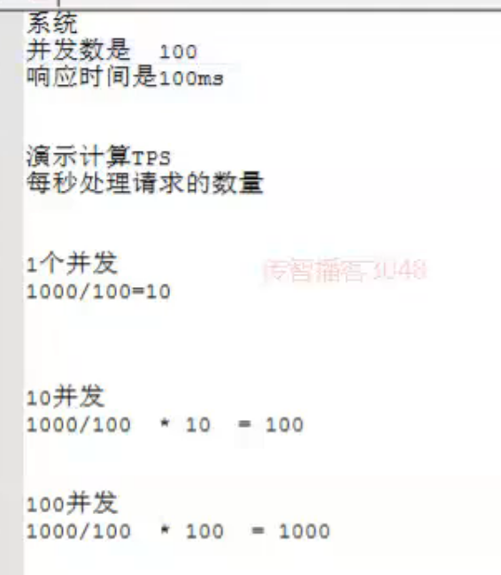

200并发


100并发处理

100并发等待    也是损耗资源

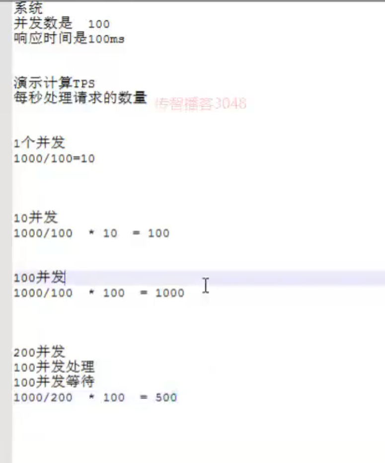

要200ms   

1000/200 * 100  资源不够用了

处理多个请求时 资源配置合理 


超过了  反而降低 

10-100  增加了 100-200减少了

吞吐量


并发系统的


处理能力     吞吐量一致


吞吐量是指系统在单位时间内处理请求的数量


**每秒查询率QPS**

每秒查询率QPS是对一个特定的查询服务器在规定时间内所处理流量多少的衡量标准，在互联网中，经常用每秒查询率来衡量服务器的性能。对应fetches/sec，即每秒的响应请求数，也即是最大吞吐能力。

 每秒查询率  QPS

每秒处理流量多少的衡量标准

衡量服务器的性能   

每秒的响应请求数 


QPS   

就是一个读写  一般Redis来 QPS


响应时间不会高于200毫秒 互联网


查询操作    

QPS  


自己的话说出来  

  描述RT  QPS 每秒查询率     TPS

#### 1.1.3 测算Redis性能

在实际生产中，我们需要关心在应用场景中，redis能够处理的QPS是多少。我们需要估计生产的报文大小，使用benchmark工具指定-d数据块大小来模拟：

```
./redis-benchmark -t get -n 100000 -c 100 -d 2048
```


JSON 转换为Byte 来处理  

小数据的东西  、


2k字节                      


-c  并发量  

​                                                                                                                                                 

测试结果：

```
====== GET ======
  100000 requests completed in 2.33 seconds
  100 parallel clients
  2048 bytes payload
  keep alive: 1

0.00% <= 1 milliseconds
51.74% <= 2 milliseconds
99.16% <= 3 milliseconds
99.57% <= 4 milliseconds
99.71% <= 5 milliseconds
99.83% <= 7 milliseconds
99.83% <= 8 milliseconds
99.86% <= 15 milliseconds
99.86% <= 16 milliseconds
99.90% <= 20 milliseconds
99.93% <= 21 milliseconds
99.94% <= 26 milliseconds
99.96% <= 29 milliseconds
99.97% <= 36 milliseconds
99.99% <= 37 milliseconds
100.00% <= 37 milliseconds
42955.32 requests per second
```

测得的QPS是4.2万

 

我们也可以使用redis客户端登陆到redis服务中，执行info命令查看redis的其他信息，执行命令：

```
# 使用Redis客户端
./redis-cli
# 在客户端中执行info命令
127.0.0.1:6379> info
```

查看结果（摘取部分结果）：

```
connected_clients:101 #redis连接数

used_memory:8367424 # Redis 分配的内存总量 
used_memory_human:7.98M
used_memory_rss:11595776 # Redis 分配的内存总量(包括内存碎片) 
used_memory_rss_human:11.06M
used_memory_peak:8367424
used_memory_peak_human:7.98M #Redis所用内存的高峰值
used_memory_peak_perc:100.48%
```

 关注内存总量   高峰值

、集群也可以使用这也查询

```shell
[root@liuawen bin]# pwd
/usr/local/redis/bin
[root@liuawen bin]# ls
redis-benchmark  redis-check-rdb  redis.conf      redis-server
redis-check-aof  redis-cli        redis-sentinel
[root@liuawen bin]# ./redis-cli
127.0.0.1:6379> info
# Server
redis_version:4.0.2
redis_git_sha1:00000000
redis_git_dirty:0
redis_build_id:59747e9d626d87bf
redis_mode:standalone
os:Linux 3.10.0-514.el7.x86_64 x86_64
arch_bits:64
multiplexing_api:epoll
atomicvar_api:atomic-builtin
gcc_version:4.9.2
process_id:1
run_id:be6a82720f38c69459e4cb54fe094aff55bdd6f5
tcp_port:6379
uptime_in_seconds:258348
uptime_in_days:2
hz:10
lru_clock:5099532
executable:/data/redis-server
config_file:

# Clients
connected_clients:1
client_longest_output_list:0
client_biggest_input_buf:0
blocked_clients:0

# Memory
used_memory:827416
used_memory_human:808.02K
used_memory_rss:12480512
used_memory_rss_human:11.90M
used_memory_peak:6949352
used_memory_peak_human:6.63M
used_memory_peak_perc:11.91%
used_memory_overhead:815174
used_memory_startup:765472
used_memory_dataset:12242
used_memory_dataset_perc:19.76%
total_system_memory:3967045632
total_system_memory_human:3.69G
used_memory_lua:37888
used_memory_lua_human:37.00K
maxmemory:0
maxmemory_human:0B
maxmemory_policy:noeviction
mem_fragmentation_ratio:15.08
mem_allocator:jemalloc-4.0.3
active_defrag_running:0
lazyfree_pending_objects:0

# Persistence
loading:0
rdb_changes_since_last_save:0
rdb_bgsave_in_progress:0
rdb_last_save_time:1598926464
rdb_last_bgsave_status:ok
rdb_last_bgsave_time_sec:0
rdb_current_bgsave_time_sec:-1
rdb_last_cow_size:4378624
aof_enabled:0
aof_rewrite_in_progress:0
aof_rewrite_scheduled:0
aof_last_rewrite_time_sec:-1
aof_current_rewrite_time_sec:-1
aof_last_bgrewrite_status:ok
aof_last_write_status:ok
aof_last_cow_size:0

# Stats
total_connections_received:201
total_commands_processed:300001
instantaneous_ops_per_sec:0
total_net_input_bytes:11700031
total_net_output_bytes:2310162
instantaneous_input_kbps:0.00
instantaneous_output_kbps:0.00
rejected_connections:0
sync_full:0
sync_partial_ok:0
sync_partial_err:0
expired_keys:0
evicted_keys:0
keyspace_hits:200000
keyspace_misses:0
pubsub_channels:0
pubsub_patterns:0
latest_fork_usec:700
migrate_cached_sockets:0
slave_expires_tracked_keys:0
active_defrag_hits:0
active_defrag_misses:0
active_defrag_key_hits:0
active_defrag_key_misses:0

# Replication
role:master
connected_slaves:0
master_replid:20d31fdd301faa1e33f9140891f3823642acc44b
master_replid2:0000000000000000000000000000000000000000
master_repl_offset:0
second_repl_offset:-1
repl_backlog_active:0
repl_backlog_size:1048576
repl_backlog_first_byte_offset:0
repl_backlog_histlen:0

# CPU
used_cpu_sys:554.57
used_cpu_user:195.58
used_cpu_sys_children:0.03
used_cpu_user_children:0.00

# Cluster
cluster_enabled:0

# Keyspace
db0:keys=1,expires=0,avg_ttl=0
127.0.0.1:6379> 

```


```
[root@liuawen bin]# ./redis-benchmark -t get -n 100000 -c 100 -d 2048
====== GET ======
  100000 requests completed in 5.53 seconds
  100 parallel clients
  2048 bytes payload
  keep alive: 1

0.27% <= 1 milliseconds
12.45% <= 2 milliseconds
39.54% <= 3 milliseconds
62.27% <= 4 milliseconds
75.46% <= 5 milliseconds
82.38% <= 6 milliseconds
86.80% <= 7 milliseconds
90.19% <= 8 milliseconds
92.67% <= 9 milliseconds
94.18% <= 10 milliseconds
95.10% <= 11 milliseconds
95.97% <= 12 milliseconds
96.53% <= 13 milliseconds
96.99% <= 14 milliseconds
97.37% <= 15 milliseconds
97.84% <= 16 milliseconds
98.04% <= 17 milliseconds
98.10% <= 18 milliseconds
98.21% <= 19 milliseconds
98.32% <= 20 milliseconds
98.38% <= 21 milliseconds
98.47% <= 22 milliseconds
98.55% <= 23 milliseconds
98.59% <= 24 milliseconds
98.64% <= 25 milliseconds
98.76% <= 26 milliseconds
98.90% <= 27 milliseconds
98.97% <= 28 milliseconds
99.10% <= 29 milliseconds
99.13% <= 30 milliseconds
99.15% <= 31 milliseconds
99.29% <= 32 milliseconds
99.33% <= 33 milliseconds
99.37% <= 34 milliseconds
99.43% <= 35 milliseconds
99.43% <= 36 milliseconds
99.44% <= 37 milliseconds
99.48% <= 38 milliseconds
99.52% <= 39 milliseconds
99.54% <= 41 milliseconds
99.58% <= 42 milliseconds
99.60% <= 43 milliseconds
99.60% <= 44 milliseconds
99.65% <= 45 milliseconds
99.68% <= 47 milliseconds
99.69% <= 49 milliseconds
99.71% <= 50 milliseconds
99.72% <= 53 milliseconds
99.72% <= 54 milliseconds
99.76% <= 65 milliseconds
99.79% <= 66 milliseconds
99.80% <= 67 milliseconds
99.82% <= 77 milliseconds
99.86% <= 84 milliseconds
99.88% <= 85 milliseconds
99.90% <= 88 milliseconds
99.90% <= 125 milliseconds
99.90% <= 126 milliseconds
99.94% <= 127 milliseconds
99.94% <= 202 milliseconds
99.95% <= 210 milliseconds
99.95% <= 211 milliseconds
99.96% <= 212 milliseconds
100.00% <= 213 milliseconds
100.00% <= 213 milliseconds
18076.64 requests per second

```

1=keep alive 0=reconnect


### 1.2 Redis读写分离

在前面我们已经测试过，如果只有一台服务器，QPS是4.2万，而在大型网站中，可能要求更高的QPS，很明显，一台服务器就不能满足需要了。

```
Redis在知乎的规模：
机器内存总量约 70TB，实际使用内存约 40TB。
平均每秒处理约 1500 万次请求，峰值每秒约 2000 万次请求。 #QPS 2000万
每天处理约 1 万亿余次请求。
单集群每秒处理最高每秒约 400 万次请求。
```

 成为一个人已经不够了

决定成为每一个人  

每秒查询率  QPS 

1TB   GB  

单台几万。。。

QPS好几千万  读写用多台  

读写分离了 

读多 写少了   

新的服务器  从库  读  

写数据     主服务器

主 从 网络 实时更新 数据一致  

读   写一台多台服务器


读写能力


Redis自带读写分离 

加个配置  

集群

主服务器  从服务器

写操作   读操作

一主多从  

读写分离 


集群增加就增加 

不是从服务器越多越好

一个程序  Redis

程序读  程序写  


QPS

Master只有一个  一个写入数据  

从太多了    master  数据同步了 大量处理  


我们可以对读写能力扩展，采用读写分离的方式解决性能瓶颈。运行新的服务器（称为从服务器），让从服务器与主服务器进行连接，然后主服务器发送数据副本，从服务器通过网络根据主服务器的数据副本进行准实时更新（具体的更新速度取决于网络带宽）。

这样我们就有额外的从服务器处理读请求，通过将读请求分散到不同的服务器上面进行处理， 用户可以从新添加的从服务器上获得额外的读查询处理能力。

 读写 分离   

前后端分离

主服务器发送数据副本

从服务器通过网络根据主服务器的数据副本进行准实时更新

slave

n. 奴隶；从动装置
vi. 苦干；拼命工作

redis已经发现了这个读写分离场景特别普遍，自身集成了读写分离供用户使用。我们只需在redis的配置文件里面加上一条，`slaveof host port`语句配置即可，我们现在开始配置主从环境。

 git config --global http.postBuffer 157286400

cp -R bin/ redis01

cd redis01/

ll

rm -rf appendonly.aof

vi redis.conf

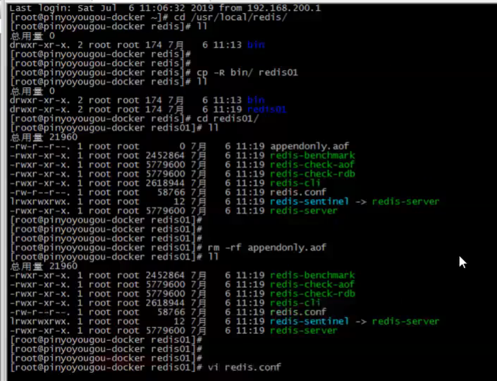


执行命令：

```shell
# 复制redis
cd /usr/local/redis/bin
cd /usr/local/redis
cp bin redis01 -R
# 修改配置
cd bin
vi redis.conf
修改 port 为 6380
添加 slaveof 192.168.200.129 6379
# 清空持久化文件
rm -rf dump.rdb
rm -rf appendonly.aof
# 启动
./redis-server redis.conf 
```

 

分别连接主库（6379）和从库（6380），测试发现主库的写操作，从库立刻就能看到相同的数据。但是在从库进行写操作，提示 `READONLY You can't write against a read only slave` 不能写数据到从库。

现在我们就可以通过这种方式配置多个从库读操作，主库进行写操作，实现读写分离，以提高redis的QPS。

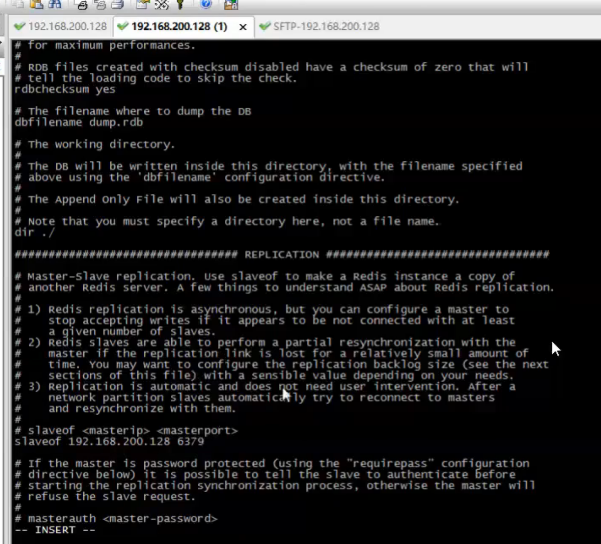

slaveof 192.168.200.128  6379

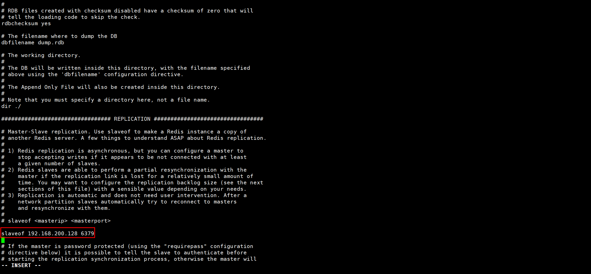

 

/port

改成 6380

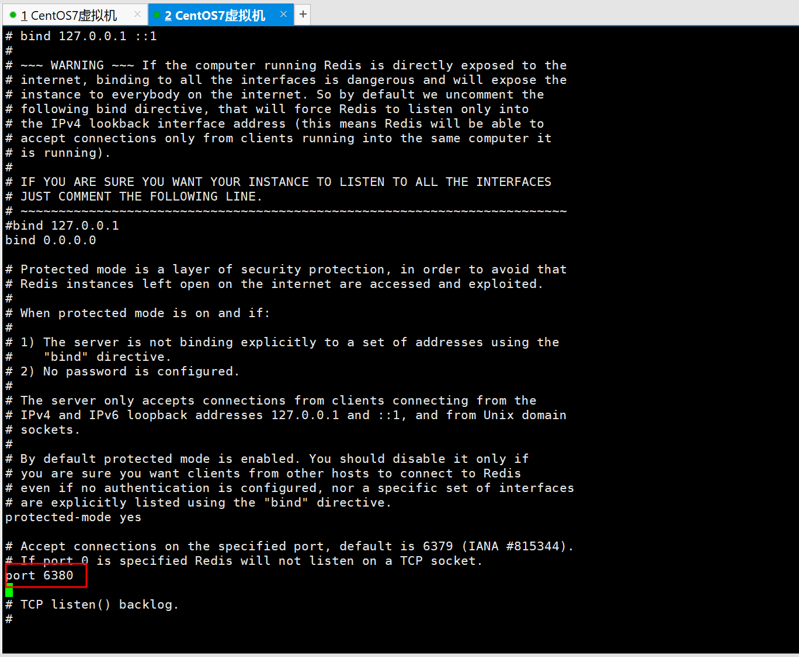

6380

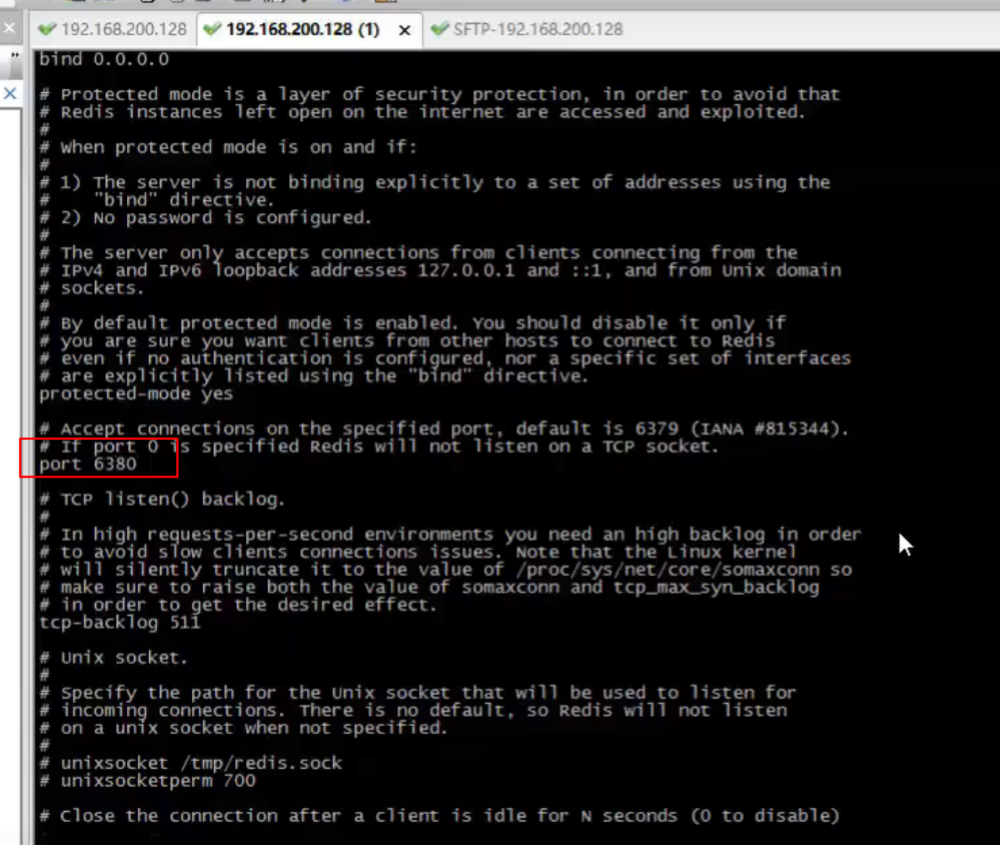


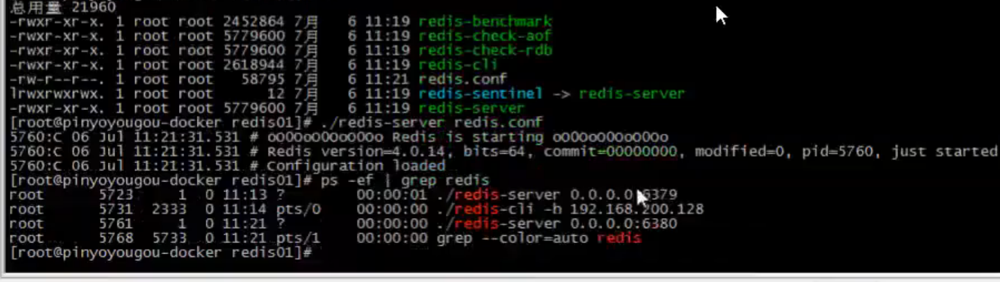


ps -ef | grep redis


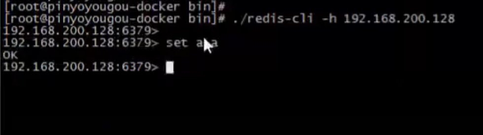


从库里面设置


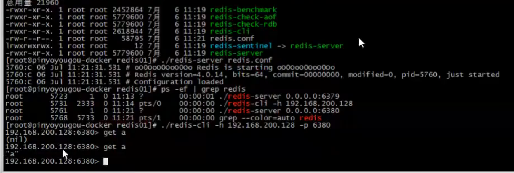


读写分离


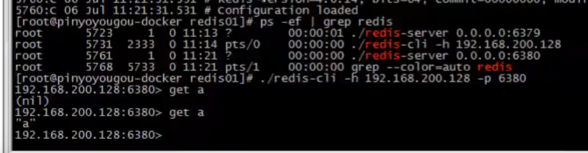


读库   

从库


避免了数据不一致问题


从库就读   主库写

一个读库不够用  多个读库  读库同步写库的

主从环境


一来要清空的  

redis集群的QPS  


 多个从库读操作


主库  从库  来操作   


### 1.3 Redis同步原理

通过上面的例子，我们知道redis的主从复制，主服务器执行写操作命令，从服务器会通过主服务器的数据的变化，同步数据到从服务器。但是如果主服务器下线，从服务器无法连接主服务器，那么数据同步该如何拿到不能连接主服务器这段时间的命令呢？

主从复制中的主从服务器双方的数据库将保存相同的数据，概念上将这种现象称作**数据库状态一致**。

主从复制  主服务器执行写操作命令 从服务器会通过主服务器的数据的变化

同步数据到从服务器 主服务器下线  从服务器无法连接主服务器 

Redis的主从复制   主服务器执行写操作命令

从服务器会通过主

全量持久化  增量持久化 

Redis数据库持久化有两种方式：RDB全量持久化和AOF增量持久化。

同步数据

数据同步步骤：

1. **redis2.8版本之前使用旧版复制功能SYNC，这是一个非常耗费资源的操作**

   - 主服务器需要执行BGSAVE命令来生成RDB文件，这个生成操作会耗费主服务器大量量的的CPU、内存和磁盘读写资源。
   - 主服务器将RDB文件发送给从服务器，这个发送操作会耗费主从服务器大量的网络带宽和流量，并对主服务器响应命令
   - 请求的时间产生影响：接收到RDB文件的从服务器在载入文件的过程是阻塞的，无法处理命令请求

    

 

1. **2.8之后使用PSYNC，具有完整重同步和部分重同步两种模式部分重同步两种模式。**

   第一种完整重同步：

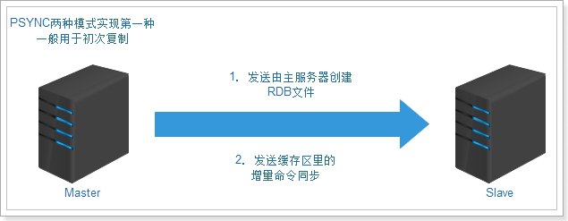

 

第二种部分重同步：


 

功能由以下三个部分构成：

1） 主服务的复制偏移量（replication offset）和从服务器的复制偏移量量。

2） 主服务器的复制积压缓冲区（replication backlog）,默认大小为1M。

3） 服务器的运行ID，用于存储服务器标识：

如果从服务器断线重新连接，获取主服务器的运行ID与重接后的主服务器运行ID进行对比，

判断是不是原来的主服务器，从而决定是执行部分重同步，还是执行完整重同步。

 

## 2. Redis高可用Sentinel

### 2.1 高可用介绍

高可用是分布式系统架构设计中必须考虑的因素之一，它是通过架构设计减少系统不能提供服务的时间。保证高可用通常遵循下面几点：

1. 单点是系统高可用的大敌，应该尽量在系统设计的过程中避免单点。
2. 通过架构设计而保证系统高可用的，其核心准则是：冗余。
3. 每次出现故障需要人工介入恢复，会增加系统不可用的时间，实现自动故障转移。

 

我们现在已经给Redis实现了主从复制，可将主节点数据同步给从节点，从节点此时有两个作用：

1. 从节点扩展主节点的读能力，分担主节点读压力。
2. 一旦主节点宕机，从节点作为主节点的备份可以随时顶上来。（高可用）

 

 

### 2.2 手动主从切换

#### 2.2.1 环境准备

一旦主节点宕机，就需要把从节点晋升成主节点，同时需要修改应用方的主节点地址，还需要命令所有从节点去复制新的主节点，整个过程需要人工操作。我们再准备一个从服务，依次执行以下命令：

```
cd /usr/local/redis/

cp redis01/ redis02 -R

vi redis.conf
修改 port 为 6381

./redis-server redis.conf 
```

 

分别进入一主两从服务，执行info命令，看到服务的状态：

主服务器：

```
# Replication
role:master
connected_slaves:2
slave0:ip=192.168.200.129,port=6380,state=online,offset=14414,lag=1
slave1:ip=192.168.200.129,port=6381,state=online,offset=14414,lag=1
```

 

从服务器：

```
# Replication
role:slave
master_host:192.168.200.129
master_port:6379
master_link_status:up
```

 

#### 2.2.2 主从切换

**主服务下线**

登录6379端口号的主服务，并执行shutdown命令，关闭这个主redis，进入6381从服务执行info命令，我们可以看到从服务的信息变为：

```
# Replication
role:slave
master_host:192.168.200.129
master_port:6379
master_link_status:down
```

可以看到主的状态由原来的up变为down，说明主服务下线了。

 

**主从切换**

现在可以把6380升级为主服务，执行命令：

```
slaveof no one
```

修改6381对应的主服务器，执行命令：

```
slaveof 192.168.200.129 6380
```

再次执行info命令，可以看到主从服务器都切换成功。现在变成了一主一从，对外是正常的。

 

### 2.3 Sentinel实现高可用

#### 2.3.1 Sentinel介绍

在前面的例子中，主节点宕机，需要把从节点晋升成主节点，同时需要修改应用方的主节点地址，还需要命令所有从节点去复制新的主节点。

这整个过程都是人工，费事费力，还会造成一段时间内服务不可用，而且需要人一直都在。这不是一种好的方式，更多时候，我们优先考虑Sentinel（哨兵）。

 

Sentinel工作模式：


 

#### 2.3.2 Sentinel使用

##### 2.3.2.1 安装

Sentinel在redis的安装包中有，我们直接使用就可以了，但是先需要修改配置文件，执行命令：

```
cd /usr/local/redis/

# 复制sentinel配置文件
cp /root/redis-4.0.14/sentinel.conf sentinel01.conf

# 修改配置文件：
vi sentinel01.conf
```

在sentinel01.conf配置文件中添加：

```
# 外部可以访问
bind 0.0.0.0
sentinel monitor mymaster 192.168.200.128 6379 1
sentinel down-after-milliseconds mymaster 10000
sentinel failover-timeout mymaster 60000
sentinel parallel-syncs mymaster 1

注意：如果有sentinel monitor mymaster 192.168.200.129 6379 2配置，则注释掉。
```

 

参数说明：

- sentinel monitor mymaster 192.168.200.129 6379 1

  `mymaster` 主节点名,可以任意起名，但必须和后面的配置保持一致。

  `192.168.200.129 6379` 主节点连接地址。

  `1` 将主服务器判断为失效需要投票，这里设置至少需要 1个 Sentinel 同意。

- sentinel down-after-milliseconds mymaster 10000

  设置Sentinel认为服务器已经断线所需的毫秒数。

- sentinel failover-timeout mymaster 60000

  设置failover（故障转移）的过期时间。当failover开始后，在此时间内仍然没有触发任何failoer操作，当前 sentinel 会认为此次failoer失败。

- sentinel parallel-syncs mymaster 1

  设置在执行故障转移时， 最多可以有多少个从服务器同时对新的主服务器进行同步， 这个数字越小，表示同时进行同步的从服务器越少，那么完成故障转移所需的时间就越长。

  如果从服务器允许使用过期数据集， 那么我们可能不希望所有从服务器都在同一时间向新的主服务器发送同步请求， 因为从服务器在载入主服务器发来的RDB文件时， 会造成从服务器在一段时间内不能处理命令请求。如果全部从服务器一起对新的主服务器进行同步， 那么就可能会造成所有从服务器在短时间内全部不可用的情况出现。

   

配置文件修改后，执行以下命令，启动sentinel：

```
/root/redis-4.0.14/src/redis-sentinel sentinel01.conf
```

效果如下：


可以看到，6379是主服务，6380和6381是从服务。

 

##### 2.3.2.2 测试

我们在6379执行shutdown，关闭主服务，Sentinel提示如下：

```
+sdown master mymaster 192.168.200.129 6379 #主节点宕机
+odown master mymaster 192.168.200.129 6379 #quorum 1/1 
+new-epoch 1
+try-failover master mymaster 192.168.200.129 6379 #尝试故障转移
+vote-for-leader 00a6933e0cfa2b1bf0c3aab0d6b7a1a6455832ec 1 #选举领导
+elected-leader master mymaster 192.168.200.129 6379
+failover-state-select-slave master mymaster 192.168.200.129 6379 #故障转移选择从服务
+selected-slave slave 192.168.200.129:6380 192.168.200.129 6380 @ mymaster 192.168.200.129 6379
#故障转移状态发送 发送到6380
+failover-state-send-slaveof-noone slave 192.168.200.129:6380 192.168.200.129 6380 @ mymaster 192.168.200.129 6379
+failover-state-wait-promotion slave 192.168.200.129:6380 192.168.200.129 6380 @ mymaster 192.168.200.129 6379
+promoted-slave slave 192.168.200.129:6380 192.168.200.129 6380 @ mymaster 192.168.200.129 6379
+failover-state-reconf-slaves master mymaster 192.168.200.129 6379
+slave-reconf-sent slave 192.168.200.129:6381 192.168.200.129 6381 @ mymaster 192.168.200.129 6379
+slave-reconf-inprog slave 192.168.200.129:6381 192.168.200.129 6381 @ mymaster 192.168.200.129 6379
+slave-reconf-done slave 192.168.200.129:6381 192.168.200.129 6381 @ mymaster 192.168.200.129 6379
+failover-end master mymaster 192.168.200.129 6379 #故障转移结束，原来的主服务是6379
+switch-master mymaster 192.168.200.129 6379 192.168.200.129 6380 #转换主服务，由原来的6379转为现在的6380
+slave slave 192.168.200.129:6381 192.168.200.129 6381 @ mymaster 192.168.200.129 6380
+slave slave 192.168.200.129:6379 192.168.200.129 6379 @ mymaster 192.168.200.129 6380
+sdown slave 192.168.200.129:6379 192.168.200.129 6379 @ mymaster 192.168.200.129 6380
```

根据提示信息，我们可以看到，6379故障转移到了6380，通过投票选择6380为新的主服务器。

 

在6380执行info

```
# Replication
role:master
connected_slaves:1
slave0:ip=127.0.0.1,port=6381,state=online,offset=80531,lag=1
```

 

在6381执行info

```
# Replication
role:slave
master_host:127.0.0.1
master_port:6380
master_link_status:up
```

 

故障转移如下图：


 

##### 2.3.3.3 原理

Sentinel主要是监控服务器的状态，并决定是否进行故障转移。如何进行故障转移在前面的部分已经给大家演示过人工的操作，那么Sentinel是如何判断服务是否下线呢，主要分为主观下线和客观下线：

- 主观下线：

  - 概念：

    主观下线（Subjectively Down， 简称 SDOWN）指的是单个 Sentinel 实例对服务器做出的下线判断

  - 特点：

    如果一个服务器没有在 master-down-after-milliseconds 选项所指定的时间内， 对向它发送 PING 命令的 Sentinel 返回一个有效回复， 那么 Sentinel 就会将这个服务器标记为主观下线

 

- 客观下线

  - 概念：

    多个 Sentinel 实例在对同一个服务器做出 SDOWN 判断， 并且通过 SENTINEL is-master-down-by-addr 命令互相交流之后， 得出的服务器下线判断ODOWN。 （一个Sentinel 可以通过向另一个 Sentinel 发送命令来询问对方是否认为给定的服务器已下线）

  - 特点：

    从主观下线状态切换到客观下线状态并没有使用严格的法定人数算法（strong quorum algorithm），而是使用了流言传播（Gossip）： 如果Sentinel在给定的时间范围内， 从其他Sentinel那里接收到了足够数量的主服务器下线报告， 那么 Sentinel 就会将主服务器的状态从主观下线改变为客观下线。

  - 注意点：

    客观下线条件只适用于主服务器，对于其他类型的 Redis 实例， Sentinel 在将它们判断为下线前不不需要进行协商， 所以从服务器或者其他 Sentinel 不会达到客观下线条件。 只要一个 Sentinel 发现某个主服务器进入了客观下线状态， 这个Sentinel就可能会被其他 Sentinel 推选出，并对失效的主服务器执行自动故障迁移操作。

     

 

##### 2.3.3.4 小结

**Sentinel三大工作任务**

- 监控（Monitoring）： Sentinel 会不断地检查你的主服务器和从服务器是否运作正常。

- 提醒（Notification）： 当被监控的某个 Redis 服务器出现问题时， Sentinel 可以通过API向管理员或者其他应用程序发送通知。

- 自动故障迁移（Automatic failover）： 当一个主服务器不能正常工作时，Sentinel会开始一次自动故障转移操作， 它会将失效主服务器的其中一个从服务器升级为新的主服务器， 并让失效主服务器的其他从服务器改为复制新的主服务器。

  当客户端试图连接失效的主服务器时， 集群也会向客户端返回新主服务器的地址，使得集群可以使用新主服务器代替失效服务器。

   

 

**互联网冷备和热备**

- 冷备

  - 概念：

    冷备发生在数据库已经正常关闭的情况下，当正常关闭时会提供给我们一个完整的数据库

  - 优点：

    - 非常快速的备份方法（只需拷文件）
    - 低度维护，高度安全

  - 缺点：

    - 单独使用时，只能提供“某一时间点上”的恢复
    - 在实施备份的全过程中，数据库必须要作备份而不能作其他工作。也就是说，在冷备份过程中，数据库必须是关闭状态

- 热备

  - 概念：

    热备份是在数据库运行的情况下，采用归档模式(archivelog mode)方式备份数据库的方法

  - 优点：

    - 备份的时间短
    - 备份时数据库仍可使用
    - 可达到秒级恢复

  - 缺点：

    - 若热备份不成功，所得结果不可用于时间点的恢复
    - 难于维护，要非常仔细小心

 

#### 2.3.3 Sentinel整合SpringBoot

**设置Redis密码**

Redis 4.0.14默认开启保护模式protected-mode yes，我们要正常访问需要先设置redis的访问密码，然后才可以进行测试，在所有的redis配置文件redis.conf中，添加如下配置：

```
# 设置密码
requirepass 123456

# 设置访问主服务器密码
masterauth 123456
```

 

在Sentinel哨兵的配置文件sentinel01.conf中添加以下设置：

```
sentinel auth-pass mymaster 123456
```

 

Redis命令行登录：

```
./redis-cli -h 192.168.200.129 -p 6381 -a 123456
```

其中-a 就是设置访问密码

 

**整合SpringBoot**

创建maven工程并在pom.xml添加以下依赖：

```
<parent>
    <groupId>org.springframework.boot</groupId>
    <artifactId>spring-boot-parent</artifactId>
    <version>2.0.1.RELEASE</version>
</parent>
<dependencies>
    <dependency>
        <groupId>org.springframework.boot</groupId>
        <artifactId>spring-boot-starter-test</artifactId>
    </dependency>
    <dependency>
        <groupId>org.springframework.boot</groupId>
        <artifactId>spring-boot-starter-data-redis</artifactId>
    </dependency>
</dependencies>
```

 

编写application.yml配置文件：

```
spring:
  redis:
    password: 123456
    sentinel:
      master: mymaster
      nodes: 192.168.200.129:26379
```

 

编写启动类：

```
@SpringBootApplication
public class RedisApplication {
    public static void main(String[] args) {
        SpringApplication.run(RedisApplication.class, args);
    }
}
```

 

编写测试类：

```
@RunWith(SpringRunner.class)
@SpringBootTest(classes = RedisApplication.class)
public class RedisTest {

    @Autowired
    private StringRedisTemplate redisTemplate;

    @Test
    public void test() {
        redisTemplate.opsForValue().set("test", "redis");
        redisTemplate.opsForValue().get("test");
    }
}
```

 

## 3. Redis内置集群

### 3.1 搭建集群

#### 3.1.1 准备redis节点

为了保证可以进行投票，需要至少3个主节点。

每个主节点都需要至少一个从节点,所以需要至少3个从节点。

一共需要6台redis服务器，我们这里使用6个redis实例，端口号为7001~7006

 

先准备一个干净的redis环境，复制原来的bin文件夹，清理后作为第一个redis节点，具体命令如下：

```
# 进入redis安装目录
cd /usr/local/redis
# 复制redis
mkdir cluster
cp -R bin/ cluster/node1
# 删除持久化文件
cd cluster/node1
rm -rf dump.rdb
rm -rf appendonly.aof
# 删除原来的配置文件
rm -rf redis.conf
# 复制新的配置文件
cp /root/redis-4.0.14/redis.conf ./
# 修改配置文件
vi redis.conf
```

集群环境redis节点的配置文件如下：

```
# 不能设置密码，否则集群启动时会连接不上
# Redis服务器可以跨网络访问
bind 0.0.0.0
# 修改端口号
port 7001
# Redis后台启动
daemonize yes
# 开启aof持久化
appendonly yes
# 开启集群
cluster-enabled yes
# 集群的配置 配置文件首次启动自动生成
cluster-config-file nodes.conf
# 请求超时
cluster-node-timeout 5000
```

 

第一个redis节点node1准备好之后，再复制5份，

```
cp -R node1/ node2
```

修改六个节点的端口号为7001~7006，修改redis.conf配置文件即可

 

编写启动节点的脚本：

```
vi start-all.sh
```

内容为：

```
cd node1
./redis-server redis.conf
cd ..
cd node2
./redis-server redis.conf
cd ..
cd node3
./redis-server redis.conf
cd ..
cd node4
./redis-server redis.conf
cd ..
cd node5
./redis-server redis.conf
cd ..
cd node6
./redis-server redis.conf
cd ..
```

设置脚本的权限，并启动：

```
chmod 744 start-all.sh
./start-all.sh
```

 

使用命令 ps -ef | grep redis 查看效果如下：


 

#### 3.1.2 启动redis集群

redis集群的管理工具使用的是ruby脚本语言，安装集群需要ruby环境，先安装ruby环境：

```
# 安装ruby
yum -y install ruby ruby-devel rubygems rpm-build

# 升级ruby版本，redis4.0.14集群环境需要2.2.2以上的ruby版本
yum install centos-release-scl-rh
yum install rh-ruby23  -y
scl enable rh-ruby23 bash

# 查看ruby版本
ruby -v
```

 

下载符合环境要求的gem，下载地址如下：

https://rubygems.org/gems/redis/versions/4.1.0

课程资料中已经提供了redis-4.1.0.gem，直接上传安装即可，安装命令：

```
gem install redis-4.1.0.gem
```

 

进入redis安装目录，使用redis自带的集群管理脚本，执行命令：

```
# 进入redis安装包
cd /root/redis-4.0.14/src/
# 查看集群管理脚本
ll *.rb
# 使用集群管理脚本启动集群
./redis-trib.rb create --replicas 1 192.168.200.129:7001 192.168.200.129:7002 \
192.168.200.129:7003 192.168.200.129:7004 192.168.200.129:7005 192.168.200.129:7006
```

效果如下：

```
>>> Creating cluster
>>> Performing hash slots allocation on 6 nodes...
Using 3 masters:
192.168.200.129:7001
192.168.200.129:7002
192.168.200.129:7003
Adding replica 192.168.200.129:7005 to 192.168.200.129:7001
Adding replica 192.168.200.129:7006 to 192.168.200.129:7002
Adding replica 192.168.200.129:7004 to 192.168.200.129:7003
>>> Trying to optimize slaves allocation for anti-affinity
[WARNING] Some slaves are in the same host as their master
M: f0094f14b59c023acd38098336e2adcd3d434497 192.168.200.129:7001
   slots:0-5460 (5461 slots) master
M: 0eba44418d7e88f4d819f89f90da2e6e0be9c680 192.168.200.129:7002
   slots:5461-10922 (5462 slots) master
M: ac16c5545d9b099348085ad8b3253145912ee985 192.168.200.129:7003
   slots:10923-16383 (5461 slots) master
S: edc7a799e1cfd75e4d80767958930d86516ffc9b 192.168.200.129:7004
   replicates ac16c5545d9b099348085ad8b3253145912ee985
S: cbd415973b3e85d6f3ad967441f6bcb5b7da506a 192.168.200.129:7005
   replicates f0094f14b59c023acd38098336e2adcd3d434497
S: 40fdde45b16e1ac85c8a4c84db75b43978d1e4d2 192.168.200.129:7006
   replicates 0eba44418d7e88f4d819f89f90da2e6e0be9c680
Can I set the above configuration? (type 'yes' to accept): yes #注意选择为yes
>>> Nodes configuration updated
>>> Assign a different config epoch to each node
>>> Sending CLUSTER MEET messages to join the cluster
Waiting for the cluster to join..
>>> Performing Cluster Check (using node 192.168.200.129:7001)
M: f0094f14b59c023acd38098336e2adcd3d434497 192.168.200.129:7001
   slots:0-5460 (5461 slots) master
   1 additional replica(s)
M: ac16c5545d9b099348085ad8b3253145912ee985 192.168.200.129:7003
   slots:10923-16383 (5461 slots) master
   1 additional replica(s)
S: cbd415973b3e85d6f3ad967441f6bcb5b7da506a 192.168.200.129:7005
   slots: (0 slots) slave
   replicates f0094f14b59c023acd38098336e2adcd3d434497
S: 40fdde45b16e1ac85c8a4c84db75b43978d1e4d2 192.168.200.129:7006
   slots: (0 slots) slave
   replicates 0eba44418d7e88f4d819f89f90da2e6e0be9c680
M: 0eba44418d7e88f4d819f89f90da2e6e0be9c680 192.168.200.129:7002
   slots:5461-10922 (5462 slots) master
   1 additional replica(s)
S: edc7a799e1cfd75e4d80767958930d86516ffc9b 192.168.200.129:7004
   slots: (0 slots) slave
   replicates ac16c5545d9b099348085ad8b3253145912ee985
[OK] All nodes agree about slots configuration.
>>> Check for open slots...
>>> Check slots coverage...
[OK] All 16384 slots covered.
```

 

#### 3.1.3 使用redis集群

**命令行使用**

使用redis的客户端连接redis集群，命令如下：

```
./redis-cli -h 192.168.200.129 -p 7001 -c
```

其中-c 一定要加，这个是redis集群连接时，进行节点跳转的参数

 

### 3.2 集群原理

#### 3.2.1 集群架构图


**架构特点:**

1. 所有的redis节点彼此互联(PING-PONG机制)，内部使用二进制协议优化传输速度和带宽。
2. 节点的fail是通过集群中超过半数的master节点检测失效时才生效。
3. 客户端与redis节点直连，不需要连接集群所有节点，只需要连接集群中任意可用节点即可。
4. 集群把所有的物理节点映射到[0-16383]slot上,cluster 负责维护node<>slot<>key关系

 

 

#### 3.2.2 集群的数据分配

在前面的特点中，最后一个node<>slot<>key关系是什么意思呢？这里是说数据是如何放到集群的节点中。

Redis 集群有16384个哈希槽,每个key通过CRC16校验后对16384取模来决定放置哪个槽.集群的每个节点负责一部分哈希槽。可以使用命令查看集群信息：

```
./redis-cli -p 7001 cluster nodes | grep master
```

结果：

```
192.168.200.129:7003@17003 master - 0 1560315648000 3 connected 10923-16383
192.168.200.129:7001@17001 myself,master - 0 1560315647000 1 connected 0-5460
192.168.200.129:7002@17002 master - 0 1560315648324 2 connected 5461-10922
```


**哈希槽的使用：**

1. 集群搭建的时候分配哈希槽到节点上
2. 使用集群的时候，先对数据key进行CRC16的计算
3. 对计算的结果求16384的余数，得到的数字范围是0~16383
4. 根据余数找到对应的节点（余数对应的哈希槽在哪个节点）
5. 跳转到对应的节点，执行命令

 

这种结构很容易添加或者删除节点。比如果我想新添加节点node4, 我需要从节点 node1, node2, node3中得部分槽到node4上. 如果我想移除节点node1,需要将node1中的槽移到node2和node3节点上,然后将没有任何槽的node1节点从集群中移除即可。

由于从一个节点将哈希槽移动到另一个节点并不会停止服务,所以无论添加删除或者改变某个节点的哈希槽的数量都不不会造成集群不可用的状态。

 

**Redis 集群的主从复制模型**

为了使部分节点失败或者大部分节点无法通信的情况下集群仍然可用，所以集群使用了主从复制模型,每个节点都会有一个或多个复制品。

在我们例子中具有 node1, node2, node3三个节点的集群，在没有复制模型的情况下，如果节点node2失败了，那么整个集群就会以为缺少5461-10922这个范围的槽而不可用。Redis集群做主从备份解决了了这个问题。

 

**Redis一致性保证**

主节点对命令的复制工作发生在返回命令回复之后， 因为如果主节点每次处理命令请求都需要等待复制操作完成的话， 那么主节点处理命令请求的速度将极大地降低 。

当然现在这种情况也是有问题的，当主节点执行完命令，返回命令回复之后宕机了，并没有完成复制操作，这个时候就有主从的数据不一致的问题。

redis这样设计，就是在性能和一致性之间做出的权衡。

 

### 3.3 集群维护

很多时候，我们需要对集群进行维护，调整数据的存储，其实就是对slot哈希槽和节点的调整。Redis内置的集群支持动态调整，可以在集群不停机的情况下，改变slot、添加或删除节点。

 

#### 3.3.1 分片重哈希

Redis集群节点分片重哈希，调整哈希槽和节点的关系，执行以下命令：

```
# 分片重哈希，可以连接任意节点
./redis-trib.rb reshard 192.168.200.129:7001

# 执行命令，提示需要移动多少个hash槽，直接输入要移动的hash槽数量即可，例如我们移动1000个
How many slots do you want to move (from 1 to 16384)?1000

# 提示接受的节点id是多少，我们使用7002接受1000个hash槽，填写对应节点的id
What is the receiving node ID? 0eba44418d7e88f4d819f89f90da2e6e0be9c680

# 提示移出hash槽的节点id，all表示所有节点都移出插槽，也可以填写单独节点id，最后键入done
# 我们测试填写all
Please enter all the source node IDs.
  Type 'all' to use all the nodes as source nodes for the hash slots.
  Type 'done' once you entered all the source nodes IDs.
Source node #1:all

# 最后，要我们确认是否确认这样进行重哈希，填写yes
Do you want to proceed with the proposed reshard plan (yes/no)? yes
```

 

查看结果：

```
# 执行命令，查看hash槽结果
./redis-cli -p 7001 cluster nodes
# 执行结果
ac16c5545d9b099348085ad8b3253145912ee985 192.168.200.129:7003@17003 slave edc7a799e1cfd75e4d80767958930d86516ffc9b 0 1560332491000 7 connected
f0094f14b59c023acd38098336e2adcd3d434497 192.168.200.129:7001@17001 myself,master - 0 1560332490000 1 connected 500-5460
cbd415973b3e85d6f3ad967441f6bcb5b7da506a 192.168.200.129:7005@17005 slave f0094f14b59c023acd38098336e2adcd3d434497 0 1560332491000 5 connected
40fdde45b16e1ac85c8a4c84db75b43978d1e4d2 192.168.200.129:7006@17006 slave 0eba44418d7e88f4d819f89f90da2e6e0be9c680 0 1560332491608 8 connected
0eba44418d7e88f4d819f89f90da2e6e0be9c680 192.168.200.129:7002@17002 master - 0 1560332491508 8 connected 0-499 5461-11422
edc7a799e1cfd75e4d80767958930d86516ffc9b 192.168.200.129:7004@17004 master - 0 1560332491000 7 connected 11423-16383
```

我们可以看到7001的哈希槽500-5460，而7004的哈希槽11423-16383，都少了500个哈希槽

而7002的哈希槽0-499 5461-11422，比原来增加了1000个哈希槽

 

#### 3.3.2 移除节点

移除节点命令的第一个参数是任意节点的地址，第二个节点是想要移除的节点id：

```
./redis-trib.rb del-node 192.168.200.129:7001 cbd415973b3e85d6f3ad967441f6bcb5b7da506a
>>> Removing node cbd415973b3e85d6f3ad967441f6bcb5b7da506a from cluster 192.168.200.129:7001
>>> Sending CLUSTER FORGET messages to the cluster...
>>> SHUTDOWN the node.
```

- 移除主节点：
  - 在移除主节点前，需要确保这个主节点是空的。如果不是空的,需要将这个节点的数据重新分片到其他主节点上
  - 替代移除主节点的方法是手动执行故障恢复，被移除的主节点会作为一个从节点存在，不过这种情况下不会减少集群节点的数量，也需要重新分片数据

- 移除从节点，直接移除成功

 

#### 3.3.3 添加节点

添加节点前需要保证新的节点是一个干净的，空的redis，主要就是要删除持久化文件和节点配置文件：

```
rm -rf appendonly.aof 
rm -rf dump.rdb 
rm -rf nodes.conf 
```

 

添加新的主节点

```
./redis-trib.rb add-node 192.168.200.129:7005 192.168.200.129:7001
```

添加的新节点默认是没有哈希槽的，需要手动分配哈希槽

 

添加新的从节点

```
./redis-trib.rb add-node --slave 192.168.200.129:7005 192.168.200.129:7001
```

添加的新的从节点，集群默认自动分配对应的主节点。

 

### 3.4 整合SpringBoot

使用之前哨兵整合SpringBoot的例子，把配置文件修改为如下内容：

```
spring:
  redis:
    cluster:
      nodes: 192.168.200.129:7001,192.168.200.129:7002,192.168.200.129:7003,192.168.200.129:7004,192.168.200.129:7005,192.168.200.129:7006
```

 

编写测试方法：

```
@Test
public void test() {
    redisTemplate.opsForValue().set("test", "redis");
    String test = redisTemplate.opsForValue().get("test");
    System.out.println(test);
}
```

 

## 4. Redis集群扩展

### 4.1 Redis集群现状

我们已经学完了Redis内置集群，是不是这一种方式就足够我们使用了呢？在这里，我们要对redis集群现在使用的情况进行分析。

1. 集群使用现状

   Redis Cluster内置集群，在Redis3.0才推出的实现方案。在3.0之前是没有这个内置集群的。

   但是在3.0之前，有很多公司都有自己的一套Redis高可用集群方案。虽然现在有内置集群，但是因为历史原因，很多公司都没有切换到内置集群方案，而其原理就是集群方案的核心，这也是很多大厂为什么要问原理的的原因。

2. 网络通信问题

   Redis Cluster是无中心节点的集群架构，依靠Gossip协议（谣言传播）协同自动化修复集群的状态。

   但Gossip有消息延时和消息冗余的问题，在集群节点数量过多的时候，节点之间需要不断进行PING/PANG通讯，不必须要的流量占用了大量的网络资源。虽然Redis4.0对此进行了优化，但这个问题仍然存在。

3. 数据迁移问题

   Redis Cluster可以进行节点的动态扩容缩容，在扩缩容的时候，就需要进行数据迁移。

   而Redis 为了保证迁移的一致性， 迁移所有操作都是同步操作，执行迁移时，两端的 Redis 均会进入时长不等的 阻塞状态。对于小 Key，该时间可以忽略不计，但如果一旦 Key 的内存使用过大，严重的时候会接触发集群内的故障转移，造成不必要的切换。

以上原因说明只是学习Redis Cluster并不够，我们还需要学习新的集群方案。

 

```
Gossip 的缺陷
- 消息的延迟
    由于 Gossip 协议中，节点只会随机向少数几个节点发送消息，消息最终是通过多个轮次的散播而到达全网的。
    因此使用 Gossip 协议会造成不可避免的消息延迟。不适合用在对实时性要求较高的场景下。
- 消息冗余
    Gossip 协议规定，节点会定期随机选择周围节点发送消息，而收到消息的节点也会重复该步骤。
    因此存在消息重复发送给同一节点的情况，造成了消息的冗余，同时也增加了收到消息的节点的处理压力。
    而且，由于是定期发送而且不反馈，因此即使节点收到了消息，还是会反复收到重复消息，加重了消息的冗余。
```

 

### 4.2 一致性哈希算法

#### 4.2.1 分片介绍

在前面我们讲了内置的集群因为一些原因，在节点数量过多的时候，并不能满足我们的要求，哪还有什么新的集群方案呢？我们在这里讲解使用twemproxy实现hash分片的Redis集群方案，这个方案也是知乎2000万QPS场景所使用的方案。


上图我们看到twemproxy主要的角色是代理服务器的作用，是对数据库进行分片操作。twemproxy的分片保证需要存储的数据散列存放在集群的节点上，尽量做到平均分布。如何实现呢，这里就涉及到一致性哈希算法，这个算法是分布式系统中常用的算法。

 

#### 4.2.2 传统哈希方案

传统方案是使用对象的哈希值，对节点个数取模，再映射到相应编号的节点，这种方案在节点个数变动时，绝大多数对象的映射关系会失效而需要迁移。

```
Hash，一般翻译做散列、杂凑，或音译为哈希，是把任意长度的输入,通过散列算法变换成固定长度的输出，该输出就是散列值。散列值的空间通常远小于输入的空间，不同的输入可能会散列成相同的输出，所以不可能从散列值来确定唯一的输入值。
简单的说就是一种将任意长度的消息压缩到某一固定长度的消息摘要的函数。
```

正常有3个节点，取3的模，分配数据，效果如下图：


 

如果节点挂了一个，那么久需要进行数据迁移，把数据分配到剩下的两个节点上，如下图：


 

可以看到原本存在Master1上的key3，需要迁移到Master3上，而Master1始终是正常的，这就造成了没有必要的数据迁移，浪费资源，所以我们需要采取另一种方式，一致性哈希算法。

 

#### 4.2.3 一致性哈希算法

一致性哈希算法(Consistent Hashing Algorithm)是一种分布式算法，常用于负载均衡。twemproxy也选择这种算法，解决将key-value均匀分配到众多 server上的问题。它可以取代传统的取模操作，解决了取模操作应对增删 Server的问题。

 

**步骤**

1. 先用hash算法将对应的节点ip哈希到一个具有2^32次方个桶的空间中，即0~（2^32）-1的数字空间。现在我们可以将这些数字头尾相连，连接成一个闭合的环形：

   

    

2. 当用户在客户端进行请求时候，首先根据key计算路由hash值，然后看hash值落到了hash环的哪个地方，根据hash值在hash环上的位置顺时针找距离最近的节点：

   

    

3. 当新增节点的时候，和之前的做法一样，只需要把受到影响的数据迁移到新节点即可

   新增Master4节点：

   

    

4. 当移除节点的时候，和之前的做法一样，把移除节点的数据，迁移到顺时针距离最近的节点

   移除Master2节点：

   

 

从上面的步骤可以看出，当节点个数变动时，使用哈希一致性映射关系失效的对象非常少，迁移成本也非常小。那么判断一个哈希算法好坏的指标有哪些呢？以下列出了4个指标：

- 平衡性（Balance）：

  平衡性是指哈希的结果能够尽可能分散到不同的缓存服务器上去，这样可以使得所有的服务器得到利用。一致性hash可以做到每个服务器都进行处理理请求，但是不能保证每个服务器处理的请求的数量大致相同

- 单调性（Monotonicity）：

  单调性是指如果已经有一些请求通过哈希分派到了相应的服务器进行处理，又有新的服务器加入到系统中时候，哈希的结果应保证原有的请求可以被映射到原有的或者新的服务器中去，而不会被映射到原来的其它服务器上去。

- 分散性（Spread）：

  分布式环境中，客户端请求时候可能不知道所有服务器的存在，可能只知道其中一部分服务器，在客户端看来他看到的部分服务器会形成一个完整的hash环。如果多个客户端都把部分服务器作为一个完整hash环，那么可能会导致，同一个用户的请求被路由到不同的服务器进行处理。这种情况显然是应该避免的，因为它不能保证同一个用户的请求落到同一个服务器。所谓分散性是指上述情况发生的严重程度。好的哈希算法应尽量量避免尽量降低分散性。 而一致性hash具有很低的分散性。

  

#### 4.2.4 虚拟节点

一部分节点下线之后，虽然剩余机器都在处理请求，但是明显每个机器的负载不不均衡，这样称 为一致性hash的倾斜，虚拟节点的出现就是为了了解决这个问题。

在刚才的例子当中，如果Master3节点也挂掉，那么一致性hash倾斜就很明显了：


可以看到，理论上Master1需要存储25%的数据，而Master4要存储75%的数据。

 

上面这个例子中，我们可以对已有的两个节点创建虚拟节点，每个节点创建两个虚拟节点。那么实际的Master1节点就变成了两个虚拟节点Master1-1和Master1-2，而另一个实际的Master4节点就变成了两个虚拟节点Master4-1和Master4-2，这个时候数据基本均衡了：


 

### 4.3 twemproxy实现hash分片

#### 4.3.1 twemproxy介绍

Twemproxy由Twitter开源，是一个redis和memcache快速/轻量级代理服务器，利用中间件做分片的技术。twemproxy处于客户端和服务器的中间，将客户端发来的请求，进行一定的处理后（sharding），再转发给后端真正的redis服务器。

官方网址：https://github.com/twitter/twemproxy

**作用：** Twemproxy通过引入一个代理层，可以将其后端的多台Redis或Memcached实例进行统一管理与分配，使应用程序只需要在Twemproxy上进行操作，而不用关心后面具体有多少个真实的Redis或Memcached存储 **特性：**

- 支持失败节点自动删除

  可以设置重新连接该节点的时间

  可以设置连接多少次之后删除该节点

- 减少客户端直接与服务器的连接数量

  自动分片到后端多个redis实例上

- 多种哈希算法

  md5，crc16，crc32，crc32a，fnv1_64，fnv1a_64，fnv1_32，fnv1a_32，hsieh，murmur，jenkins

- 多种分片算法

  ketama（一致性hash算法的一种实现），modula，random

 

#### 4.3.2 准备redis实例

执行以下命令

```
# 准备一个redis实例
cd /usr/local/redis/
mkdir twemproxy-redis
cp bin twemproxy-redis/redis01 -R

# 清理redis
cd twemproxy-redis/redis01/
rm -rf dump.rdb 
rm -rf redis.conf 

# 复制配置文件
cp /root/redis-4.0.14/redis.conf ./

# 修改配置文件
vi redis.conf
# Redis服务器可以跨网络访问
修改 bind 为 0.0.0.0
# 关闭保护模式
修改 protected-mode 为 no
# 设置端口号
修改 port 为 7601
# Redis后台启动
修改 daemonize 为 yes
# 开启aof持久化
修改 appendonly 为 yes
```

 

再复制两份，修改端口号为7602，7603，启动redis实例

这样我们就准备好了三个redis实例 7601 、 7602和7603

 

#### 4.3.2 twemproxy安装

环境准备：

```
yum  -y install install autoconf automake libtool
```

 

上传资料中的twemproxy.tar，并安装，执行以下命令：

```
# 安装包解包
cd root
tar -xf twemproxy.tar 

# 安装twemproxy
cd twemproxy
autoreconf -fvi
./configure --enable-debug=full --prefix=/usr/local/twemproxy
make
make install

# 编写配置文件
cd /usr/local/twemproxy/
mkdir conf run
vi conf/nutcracker.yml
# 配置文件内容如下
alpha:
  listen: 192.168.200.129:22121
  hash: fnv1a_64
  distribution: ketama
  auto_eject_hosts: true
  redis: true
  server_retry_timeout: 2000
  server_failure_limit: 1
  servers:
   - 192.168.200.129:7601:1
   - 192.168.200.129:7602:1
   - 192.168.200.129:7603:1
   
# 测试配置文件
./sbin/nutcracker -t
# 如下应该提示OK
nutcracker: configuration file 'conf/nutcracker.yml' syntax is ok

# 启动twemproxy（注意这是一行命令）
./sbin/nutcracker -d -c /usr/local/twemproxy/conf/nutcracker.yml -p /usr/local/twemproxy/run/redisproxy.pid -o /usr/local/twemproxy/run/redisproxy.log
```

 

安装完成后，可以执行以下命令查看安装状态

```
# 查看启动信息
ps -ef | grep nutcracker
# 查看端口使用情况
netstat -nltp | grep nutcrac
```

 

#### 4.3.3 twemproxy使用

**命令行使用**

使用twemproxy和单机版是一样，对外就像是用单机版redis一样。

但是有些命令不能用，例如info，因为这个毕竟twemproxy只是一个代理。

```
cd /usr/local/redis/bin/
./redis-cli -h 192.168.200.129 -p 22121
```

可以测试get、set方法

 

**SpringDataRedis**

使用Java代码操作twemproxy和操作redis也是一样的

配置文件修改为：

```
spring:
  redis:
    host: 192.168.200.129
    port: 22121
```

 

测试代码：

```
    @Test
    public void test() {
        redisTemplate.opsForValue().set("test", "redis");
        String test = redisTemplate.opsForValue().get("test");
        System.out.println(test);

        Random r = new Random();
        for (int i = 0; i < 100; i++) {
            redisTemplate.opsForValue().set(r.nextInt(100000)+"test", "redis");
        }
    }
```

我们可以单独连接redis实例，发现数据是分别进行存放的

 

## 5. 总结

在这个章节，我们学习使用了Redis的单机版，主从复制，Sentinel，内置集群，twemproxy集群，那么是不是掌握一种就足够了呢。并不是的，我们需要根据具体的使用场景分别使用。

 

- 单机版：数据量，QPS不大的情况使用
- 主从复制：需要读写分离，高可用的时候使用
- Sentinel哨兵：需要自动容错容灾的时候使用
- 内置集群：数据量比较大，QPS有一定要求的时候使用，但集群节点不能过多
- twemproxy集群：数据量，QPS要求非常高，可以使用

 

以上描述了这几种模式的使用场景，但是其使用成本是从上往下递增的，所以到底是用那种模式，还是要结合具体的使用场景，预算成本来进行选择。

另外，这些模式也不是完全独立的，一般我们在使用twemproxy集群的时候都是高并发，大数据，高可用的环境，可以结合主从复制+哨兵保证集群的高可用，keepliaved保证代理服务器的高可用。其使用方式在本章节中都已经给大家介绍了，有兴趣的学员可以尝试自己整合一下。