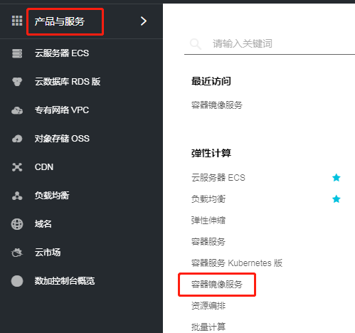
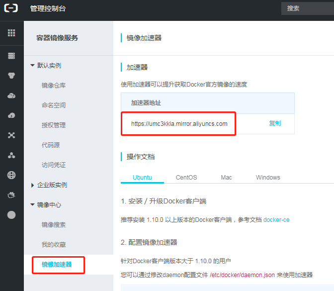
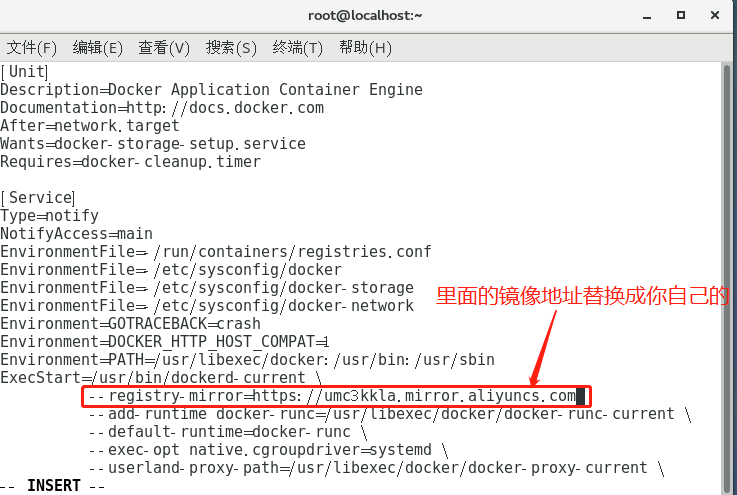

1. 获取阿里云镜像加速站点地址

   1.1 登录阿里云，进入控制台页面

   1.2 选择左侧”产品与服务“中的”容器镜像服务“

   

   1.3 选择”镜像加速器“，复制加速器地址

   

2. 配置镜像加速地址

   2.1 打开命令行窗口，输入以下命令编辑docker.service文件

   `vim /usr/lib/systemd/system/docker.service`

   

   ```
    --registry-mirror=https://ct47e5qo.mirror.aliyuncs.com
   ```

   

   2.2 按i键，进入编辑模式，按下图指示的位置，将镜像地址替换为上面获取到的镜像加速地址

   

   

   ​	2.3 按esc键推出编辑模式，然后按:键，输入wq后回车，保存文件后推出vi编辑器

3. 刷新docker配置，重启docker服务

   3.1 命令行窗口执行sudo systemctl daemon-reload命令刷新配置

   3.2 命令行窗口执行:命令重启docker

