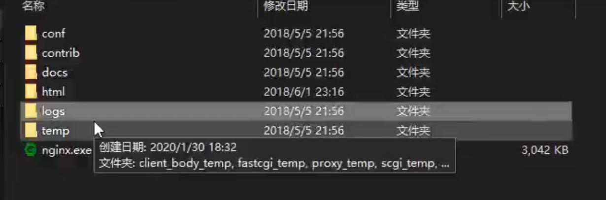
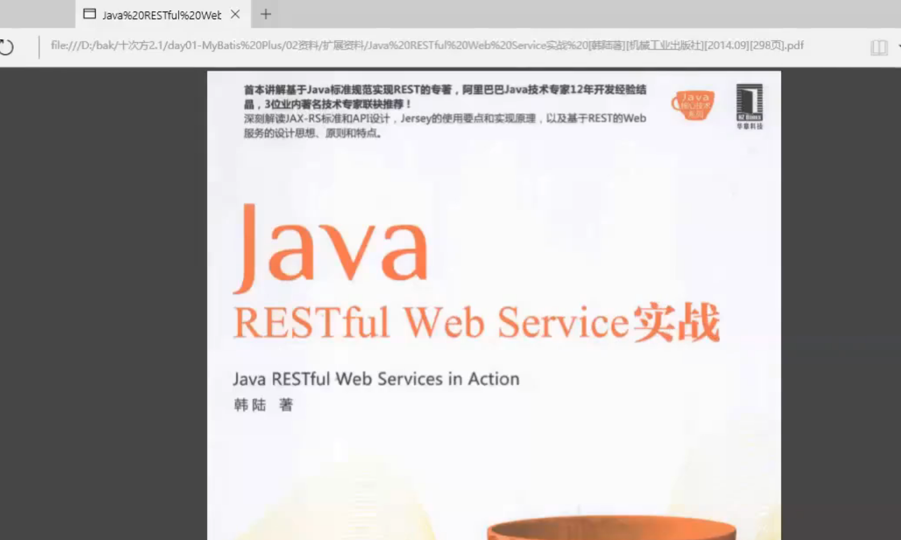
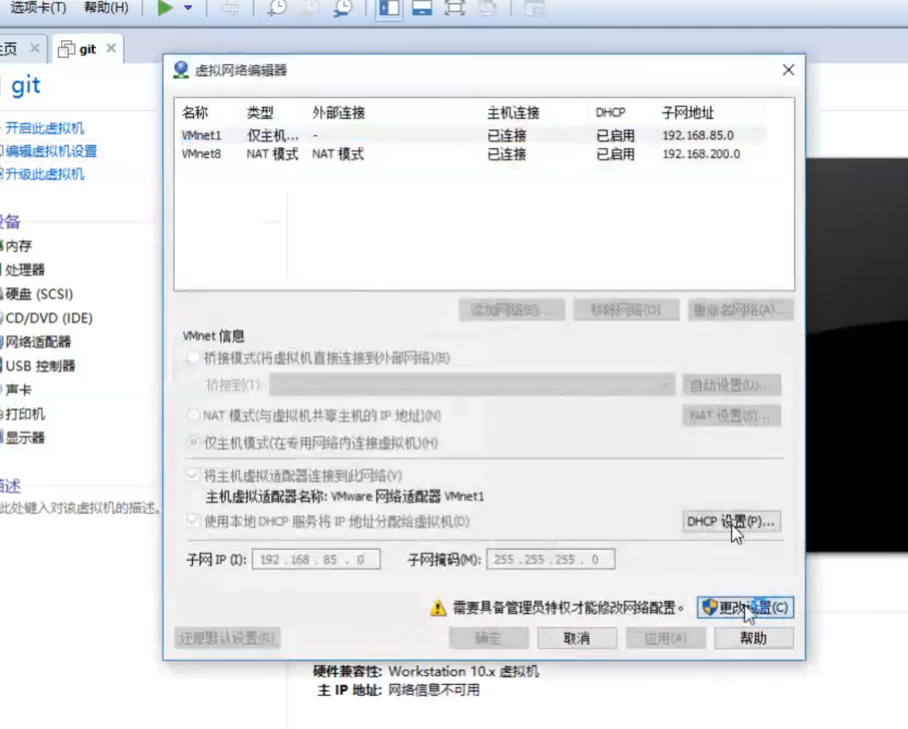
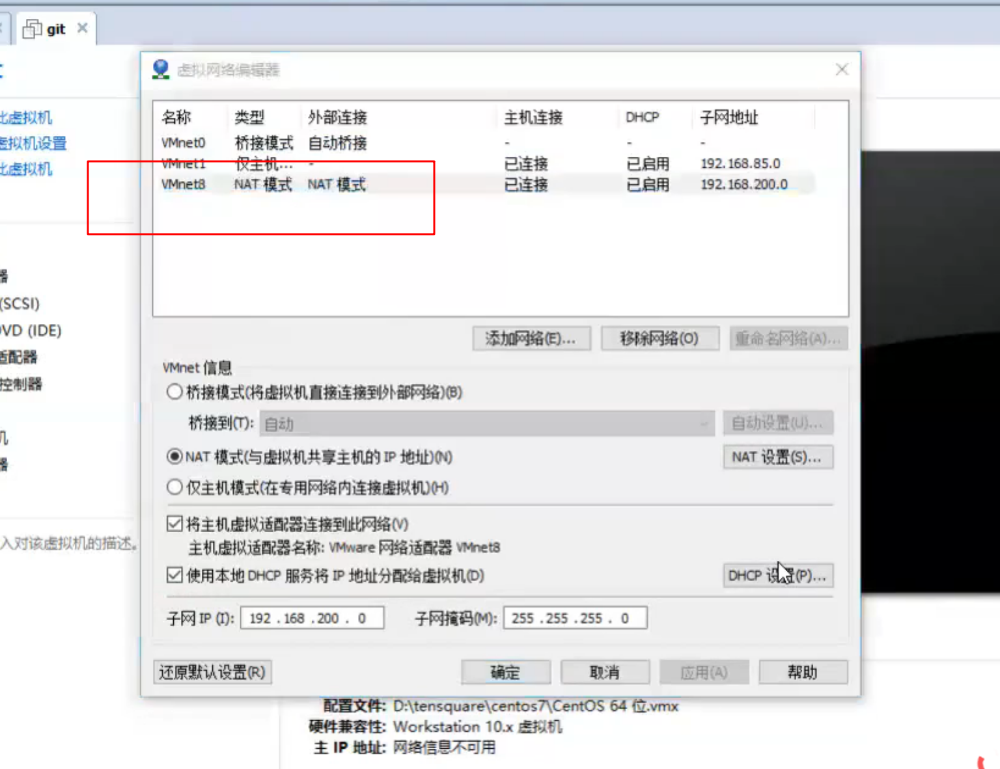
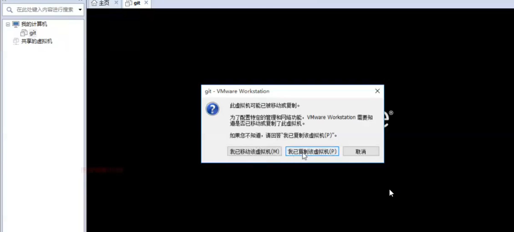
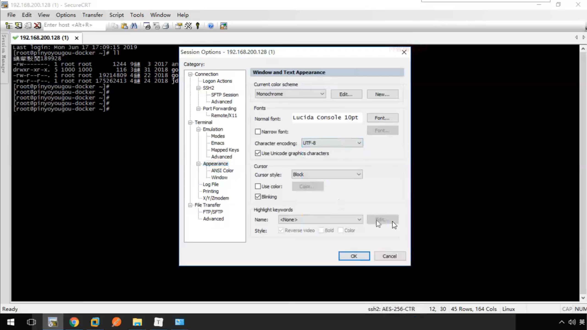
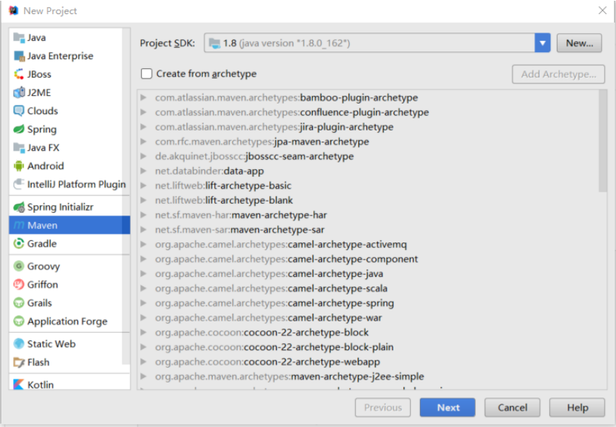

# 第1章 - 项目介绍和工程搭建

学习目标：

- 了解十次方项目需求；
- 了解前后端分离开发模式
- 理解RESTful
- 完成项目开发环境搭建
- 完成父工程、公共模块和文章微服务的搭建
- 掌握mybatis plus的使用，并开发完成文章微服务中文章的增删改查功能
- 掌握公共异常处理类的使用


爱的十次方

1024

第一天 上午 

MySQL优化  深入学习


跑起来 

前后端分离 

了解需求的  整明白    面试的时候   问题  

理解RESTful   

严格  遵循   风格 


项目介绍   工程搭建


# 1 十次方项目需求分析

## 1.1 项目介绍

十次方是程序员的专属社交平台，包括头条、问答、活动、交友、吐槽、招聘六大频道。

头条  抖音  

看新闻  问答  活动 交友  学习  吐槽  招聘 

1024是程序员的专属社交平台 


十次方名称的由来：2的10次方为1024，程序员都懂的。

如果你是一位技术大咖，那么赶快发布文章，增加知名度吧。

如果你是一名技术小白，那么赶快到问答频道寻求帮助的，这里高手如云哦！

如果你不想错过各种技术交流会，那么请经常关注活动频道吧。

如果你还是单身，那么赶快到交友频道找到你心仪的另一半。

如果你有太多的苦恼，那么赶快吐个槽吧。

如果你正在找工作或是想跳槽拿高薪，那么来招聘频道淘金吧。

ten  square  十次方

## 1.2 项目需求

> 详见： 资源\文档\十次方需求规格说明书.docx

# 2 系统设计

## 2.1 开发模式

十次方项目采用前后端分离的开发模式

开发模式   开发模型    ？？？


开发模型   健康

瀑布模型 

瀑布模型  需求分析 概要设计 简单的设计  初稿

什么情况

详细设计   各种各样  没有问题

设计问题 详细化


开发完了  交付

维护阶段   

传统类型   固定的套路  


运行了好几年  需求  小功能


敏捷开发  

沟通交流  及时  

以人为单位  马上解决    灵活  

一周发布一个版本  或者 修改完了代码 就可以发布版本   

改了就发布  开发人员   测试人员  


敏捷开发   


开发模式  

开发模型


瀑布模型  固定的

敏捷开发


技术  并发量  

## 2.2 技术选型

后端：springboot + springcloud + mybatis plus + mysql5.7

前端：nodejs + NUXT + elementUI + vue


持久化  

NUXT 前端渲染技术  

前端  后端  隔离开来  


MySQL5.7

基于Docker的  虚拟机 不会用本地的数据库  

没有必要的


一个系统管理员 能不能维护所有的 不能

超级的系统管理员  

Java  Python   前端 

频道  

也是管理员   


root  

软件工程


行业

OA ERP  传统的   局限的   针对系统  企业的  用户的并发量  

SSM     行业  

OA  办公自动化   企业的  人也不多  不是几千万  几个亿的

互联网的项目  

软件工程   

SpringCloud


软件工程 

china-pub.com


书  作者  博客   出版社


敏捷开发  是不是很累

功能要做的 


需求  一样的都有任务的   各种各样的事情

敏捷开发  需求经常变更     好处 快速迭代  响应开发 

双十一   Bug   用来多少秒  


开发就是感觉就是很累的


敏捷开发  需求经常变化 


修复Bug  一秒为单位的   变态


## 2.3 技术架构

采用前后端分离的系统架构

用户  管理员   

前端系统页面  前端页面接口路由微服务

后台管理系统页面  后台管理系统接口路由微服务


基础微服务

用户微服务

文章微服务

问答微服务

招聘微服务


接口  路由   好处多多  

路由 连接到对应的  

前端  找路由 


数据 存储  读取 

用户 管理员

前端  页面  后端 数据库 

## 2.4 微服务模块划分

| 模块名称            | 模块中文名称   |
| :------------------ | :------------- |
| tensquare_common    | 公共模块       |
| tensquare_base      | 基础微服务     |
| tensquare_article   | 文章微服务     |
| tensquare_friend    | 交友微服务     |
| tensquare_gathering | 活动微服务     |
| tensquare_qa        | 问答微服务     |
| tensquare_recruit   | 招聘微服务     |
| tensquare_user      | 用户微服务     |
| tensquare_spit      | 吐槽微服务     |
| tensquare_search    | 搜索微服务     |
| tensquare_web       | 前台微服务网关 |
| tensquare_manager   | 后台微服务网关 |
| tensquare_eureka    | 注册中心       |
| tensquare_config    | 配置中心       |
| tensquare_sms       | 短信微服务     |
| tensquare_notice    | 消息通知微服务 |

 gathering 聚集

技术  业务 划分

  我们这功能划分  

文章    

只有五天的时间   做项目  我要赶紧


服务划分    你是怎么划分呢


技术 方面  功能划分

还没那个企业功能划分  

MVC   功能划分    很多的项目

很多的项目    MVC + View  升级 项目   微服务   技术上面   换了SpringCloud

形容  人的神经元    拆分  很多很多的服务   调用   Http  交互 


数据库   

## 2.5 数据库表结构分析

分库 分表    互联网项目  数据量  如何保证数据问题 

每张表的数据变少了   速度快了  

操作数据库   服务器 

头条   问答  活动 交友 吐槽  招聘

持久化  存储     

功能模块  数据库  


用户模块  用户数据库  操作

基础  


数据库 有哪些表  哪个模块

API文档  

分库分表  

一般只有分库  没分表 

所有的在一个数据库   

数据量越来越大  都存储到一个系统中    总有满了的时候 

上限   分库   

用户数据库     文章数据库  文章数据库

以模块  数据库   功能  

多了几个数据库   一个服务器里面   多个数据库    存储一台服务器  MySQL

可以库   DBA      性能   

存储上限  数据库DBA   数据库数据量比较大 迁移到 其他服务器 

分库


分表    

文章  一个库的一个表 就存不下了  一张表   MySQL 一般支持百万级别

超了   急剧下降  索引     MySQL  索引   B+   树  深   三层   百万级

磁盘 磁道     数据库 不能让MySQL存储太多了


Oracle 支持千万级别   性能  比较高得  

分表了之后 查询问题   

Dubbo   哈希 

随机生成     分表解决性能问题   

数据库  拆分多个数据表  分库分表   

自己做的   有问题   

用其他的  


MyCat   


下一个 API介绍 


采用的分库分表设计，每个微服务模块为1个独立的数据库。

tensquare_article 文章

tensquare_base 基础

tensquare_friend 交友

tensquare_gathering 活动

tensquare_qa 问答

tensquare_recruit 招聘

tensquare_user 用户

tensquare_spit 吐槽

> 详见 资源\文档\十次方数据库文档.xlsx

 文章  

基本

交友

活动

问答

招聘

用户

吐槽

## 2.6 API文档

前后端分离开发   API文档 

怎么关联 

根据API文档开发  前端 去调  后端去开发 

Swagger   Nginx整合  

Nginx


启动


如何访问呢  


启动nginx


根据API文档   完成  接口的开发   

文档好了 


状态码   约定的  

和前端达成一致就行  


自己约定的  

前后端的   

接口开发


安装约定来  

使用起来  

API文档 搞定  

资料里面




2020-02-06

我应该在2020疫情搞的  

出现了问题  


使用Nginx  没有中文   不在C盘    

使用Nginx  目录没有中文   不在C盘      C盘权限    一些目录  

端口    index.html

访问API   Swagger 

商量以后的  状态码  到底是 什么代表成功  失败

休息十分钟  吧   Restful  API  


课程提供了前后端开发接口文档（采用Swagger语言进行编写），并与Nginx进行了整 合。双击Nginx执行文件启动后，在地址栏输入http://localhost:801 即可访问API文档

 

前后端约定的返回码列表：

| 状态描述         | 返回码 |
| :--------------- | :----- |
| 成功             | 20000  |
| 失败             | 20001  |
| 用户名或密码错误 | 20002  |
| 权限不足         | 20003  |
| 远程调用失败     | 20004  |
| 重复操作         | 20005  |


很多很多返回码吧

# 3 RESTful架构说明


线上上课   笔试  简历   来这里就是找工作的时候  

笔试 面试  几百页  就背了 

RESTful  架构  


## 3.1 何为RESTful

RESTful架构是目前最流行的一种互联网软件架构

是Roy Thomas Fielding在他2000年的博士论文中提出的

是Representational State Transfer的缩写，翻译过来是”表现层状态转化”

是所有Web应用都应该遵守的架构设计指导原则

7个HTTP方法：GET、POST、PUT、DELETE、PATCH、HEAD、OPTIONS


http协议 1.1

Web开发    基于http协议   

apache 软件基金会 

主要开发者  apache 服务器软件   搞协议的  写服务  

RESRful架构是目前最流行的一种互联网软件架构

互联网软件架构  

表现层 状态转化 

表现层状态转化

所有Web应用都应该遵守zun的架构设计指导原则


架构风格与基于网络的软件架构设计   博士论文  

理论  应用级开发 


Java  RESTful Web  Service实战  





Web  Service 


服务器之间的通信 


很长时间  发展   设置  接口   


7个HTTP方法：GET、POST、PUT、DELETE、PATCH、HEAD、OPTIONS

架构设计指导原则 

## 3.2 接口规范

十次方项目使用GET、POST、PUT、DELETE四种方法

幂等性：不论你请求多少次，资源的状态是一样的。

幂等的 

无论你请求一次  请求两次    请求资源不一致   不是幂等的


GET  请求  查询     id=1 

查询一次  查询一百次    资源一样的 没有变化的

资源状态  查询    安全 幂等的 


幂等性    无论你请求多少次  资源的状态是一样的

REST  把我们的请求规范起来 

Controller   指定  

Ajax     发起请求  


安全     接口幂等 


无论执行多少次


插入   insert   

执行十次   插入10个

执行十次  就一个  

幂等  不幂等 

MQ  消息的消费  重复操作  RabbitMQ

 出现了 重复操作   执行了多次   接口不幂等    出错的


GET   只是 查询    id  可能


POST 不安全   不幂等


POST  插入操作     不幂等  添加多个


PUT  天然幂等   项目的需求 可能不幂等的


DELETE   id  


安全  不安全  

对数据库  的数据  修改    

不安全的操作  


单看   PUT   幂等      实际呢 


更新


如何设计接口的幂等性  

insert   update 

select  不会对数据库修改 

delete     删了就删了 


雪花算法  

算一个  id  

不能重复  重复  插入 问题


插入 先查询   先决定是插入  还是更新   


id   插入  先查询有没有   有更新 没有 插入

token   随机字符串     放到Redis    你再操作  你已经执行了  更新  Redis没有 插入

验证   执行还是不执行  


update 

多i版本控制    加一列    版本    version  看version    

1.0  2.0     同一个版本才会去更新   比如 1.0过来 更新了 2.0  已经  然后你又过来一个版本1.0的  我已经2.0了  重复操作   

 多版本控制   

类似

数据库    乐观锁      悲观锁   数据库实现了       

乐观锁底层实现  是多版本控制  


Version 


使用状态码  

status   更新     status=0  变了就不更新


场景   对应去选择   


500   idea  控制台 错误  去解决   看不明白 去翻译  

代码量    条件反射    异常自己去解决  

看懂一个大概 


马上看控制台   状态   


### 3.2.1 GET

- 安全且幂等
- 获取表示
- 变更时获取表示（缓存）

==适合查询类的接口使用==

 

### 3.2.2 POST

- 不安全且不幂等
- 使用服务端管理的（自动产生）的实例号创建资源
- 创建子资源
- 部分更新资源
- 如果没有被修改，则不过更新资源（乐观锁）

==适合数据提交类的接口使用x==

7个HTTP方法：GET、POST、PUT、DELETE、PATCH、HEAD、OPTIONS

请求一次  增加了一次  资源变化了  不幂等了

资源变化了      不安全   会改变资源   、

不幂等    请求一次  请求多次  资源的状态 是不一样的  

对资源来说是一样的 


### 3.2.3 PUT

- 不安全但幂等
- 用客户端管理的实例号创建一个资源
- 通过替换的方式更新资源
- 如果未被修改，则更新资源（乐观锁）

==适合更新数据的接口使用==


### 3.2.4 DELETE

- 不安全但幂等
- 删除资源

==适合删除数据的接口使用==

 第一次就删除   后面无论多少次删除   操作无用 


这个要记住    这个是HTTP协议定义的状态码  

 这个是通用的   

前面是我们自己定义的    


请求返回响应码：

| 代码    | 含义                                                         |
| :------ | :----------------------------------------------------------- |
| ==200== | （OK）- 如果现有资源已被更改                                 |
| 201     | （created）- 如果新资源被创建                                |
| 202     | （accepted）- 已接受处理请求但尚未完成（异步处理）           |
| 301     | （Moved Permanently）- 资源的URI被更新                       |
| 303     | （See Other）- 其他（如，负载均衡）                          |
| ==400== | （bad request）- 指代坏请求                                  |
| ==404== | （not found）- 资源不存在                                    |
| 406     | （not acceptable）- 服务端不支持所需表示                     |
| 409     | （conflict）- 通用冲突                                       |
| 412     | （Precondition Failed）- 前置条件失败（如执行条件更新时的冲突） |
| 415     | （unsupported media type）- 接受到的表示不受支持             |
| ==500== | （internal server error）- 通用错误响应                      |
| 503     | （Service Unavailable）- 服务当前无法处理请求                |


# 4 项目开发准备

虚拟机  

练习了  


专门的服务器   数据库 

服务的安装  部署  


虚拟环境


Docker   使用   


支持docker    CentOS7


解压   打开   拖动一下 到对应的要解压的目录 就可以了的


## 4.1 开发环境

- 虚拟系统环境 VMware Workstation
- 虚拟机系统 CentOS 7
- 容器 docker
- JDK1.8
- 数据库 mysql 5.7
- 开发工具 idea
- 项目构建工具 maven

所有的第三方工具如**mysql**等都是运行在docker容器中的


docker容器  我们使用的  


至少 1G    4G 


内存至少 


虚拟网络编辑器








要改


一致  


跟着操作


DHCP 


虚拟机  自动分配的

时间    到期 重新分配 


改久一点 


不一定  大概率  分配之前的 


最好一致的    





我已复制


一个工具  

熟练操作  

掌握 

连接一下 


ifconfig

192.168.200.128


问题  


乱码的




Options


CentOS7 


没有Docker  自己装一个  

花钱就能解决的


下午2点   

上午直播没了 


奉劝各位尽量不要看这种批量培训班的视频，对各位以后的发展没有一点好处。尽量看类似muke这样的独立开发者录制的视频，干货很多，也有很多有意义的建议，我个人就推荐这种或者能力更好的去看各高校的公开课。

门用他们的挺好的,何况人家也是紧跟着潮流,比起大多数培训机构,他算好的吧(ps:我不是托)

自我介绍

讲下快速排序，经典快排存在的问题

树的中序遍历实现

介绍下osi7层模型

是每个线程都会创建一个栈还是共用一个栈？

你有看过什么源码嘛？

【幼儿园扛把子】计算 积极向上 2020/7/25 23:43:31
1、自我介绍

2、讲下快速排序，经典快排存在的问题

3、1000万个取其中最大的100个数

3、1 MapReduce的设计思想，但是有内排序的问题

3、2堆排序，堆排序的过程

4、树的中序遍历实现

​	4.1递归

​	4.2借助栈

5、介绍下osi7层模型

6、arp协议缓存的过程

7、TCP的控制位

8、TCP的状态

9、TCP建连的状态

10、TCP的头部信息

11、jvm监控系统是通过jmx做的么？再改进中，用的jdk自带的工具

12、java内存结构

13、jvm的栈跟线程关系

14、是每个线程都会创建一个栈还是共用一个栈？

15、介绍volatile的功能

16、总线锁的副作用

17、内存屏障的汇编指令是啥？

18、你有看过什么源码嘛？AQS

19、介绍一下AQS

20、扯到了CAS的原理

21、AQS怎么阻塞当前线程

22、locksupport的park在jvm怎么实现的?

23、你了解垃圾回收吗？

24、垃圾回收器让工作线程停顿下来是怎么做的？

25、GC ROOts对象有几种？

26、gc roots怎么判断一个对象没有被引用？

二面

介绍项目

在java开发平时做了哪些项目

介绍下volatile

介绍下左连接、右连接、全连接查询

redis的应用场景

es的应用场景

mysql的索引和优化问题

【幼儿园扛把子】计算 积极向上 2020/7/25 23:43:42
\### 二面：

1、介绍项目

2、spark用的多吗？

3、在java开发平时做了哪些项目

4、看过源码吗？

5、介绍下ConcurrentHashMap

6、介绍下CAS

7、介绍下volatile

8、手写生产者和消费者

9、mysql的索引失效和优化问题

10、mysql的索引结构

11、回表操作分析

13、介绍下左连接、右连接、全连接查询

14、redis的应用场景

15、redis是单线程还是多线程

16、redis存在线程安全的问题吗？为什么

17、spring aop怎么使用及其原理

18、怎么实现远程rpc?

19、es的应用场景

20、服务被别人攻击，不断刷新页面，怎么解决这个问题


****

```
注：虚拟机的帐户名root 密码itcast
```

## 4.2 mysql建库建表

进入安装了docker的虚拟机中，按以下顺序执行命令

（1）下载镜像（此步可省略）

```
docker pull centos/mysql‐57‐centos7
```

注：docker默认从国外的镜像网站拉取镜像，速度很慢。可以使用国内的阿里云镜像加速站点提升镜像拉取速度。具体步骤可以参考文档

> docker配置国内镜像加速站点.pdf

（2）创建容器

```
docker run -di --name=tensquare_mysql -p 3306:3306 -e MYSQL_ROOT_PASSWORD=root centos/mysql-57-centos7
```

（3）连接MYSQL ，并执行资料中的建表脚本，创建article数据库

 

## 4.3 接口测试工具postman

postman是一款强大网页调试工具

- 能够发送任何类型的HTTP 请求 (GET，HEAD， POST，PUT。。。)
- 附带任意数量的参数


# 5 项目工程搭建

## 5.1 父工程搭建

创建项目类型为maven的父工程

1. 打开idea开发工具
2. 选择菜单file-new project ,弹出窗口中左侧菜单选择Maven ，点击next按钮



3.GroupId填写com.tensquare，ArtifacetId填写tensquare_parent，点击next按钮


点击Finish 完成

修改pom.xml文件，添加以下内容

```xml
    <parent>
        <groupId>org.springframework.boot</groupId>
        <artifactId>spring-boot-starter-parent</artifactId>
        <version>2.1.4.RELEASE</version>
        <relativePath/>
    </parent>
​
    <properties>
        <project.build.sourceEncoding>UTF-8</project.build.sourceEncoding>
        <project.reporting.outputEncoding>UTF-8</project.reporting.outputEncoding>
        <java.version>1.8</java.version>
        <maven.compiler.source>1.8</maven.compiler.source>
        <maven.compiler.target>1.8</maven.compiler.target>
        <mybatisplus-spring-boot-starter.version>1.0.5</mybatisplus-spring-boot-starter.version>
        <mybatisplus.version>2.2.0</mybatisplus.version>
        <fastjson.version>1.2.39</fastjson.version>
        <gson.version>2.8.0</gson.version>
    </properties>
​
    <dependencies>
        <dependency>
            <groupId>org.springframework.boot</groupId>
            <artifactId>spring-boot-starter-web</artifactId>
        </dependency>
        <dependency>
            <groupId>org.springframework.boot</groupId>
            <artifactId>spring-boot-starter-test</artifactId>
            <scope>test</scope>
        </dependency>
    </dependencies>
    
    <repositories>
        <repository>
            <id>spring-snapshots</id>
            <name>Spring Snapshots</name>
            <url>https://repo.spring.io/snapshot</url>
            <snapshots>
                <enabled>true</enabled>
            </snapshots>
        </repository>
        <repository>
            <id>spring-milestones</id>
            <name>Spring Milestones</name>
            <url>https://repo.spring.io/milestone</url>
            <snapshots>
                <enabled>false</enabled>
            </snapshots>
        </repository>
    </repositories>
​
    <pluginRepositories>
        <pluginRepository>
            <id>spring-snapshots</id>
            <name>Spring Snapshots</name>
            <url>https://repo.spring.io/snapshot</url>
            <snapshots>
                <enabled>true</enabled>
            </snapshots>
        </pluginRepository>
        <pluginRepository>
            <id>spring-milestones</id>
            <name>Spring Milestones</name>
            <url>https://repo.spring.io/milestone</url>
            <snapshots>
                <enabled>false</enabled>
            </snapshots>
        </pluginRepository>
    </pluginRepositories>
```

## 5.2 搭建公共子模块

### 5.2.1 搭建子模块步骤

1. 右键点击父工程tensquare_parent，选择 New -> Module 弹出窗口选择Maven ,点击next按钮
2. ArtifacetId填写tensquare_common，点击next按钮


1. 点击finish

 

### 5.2.2 创建公共实体类和工具类

1. 新建com.tensquare.entity包，包下创建Result类，用于controller返回结果

```java
public class Result {
    private boolean flag;//是否成功
    private Integer code;// 返回码
    private String message;//返回信息
    private Object data;// 返回数据
​
    public Result(boolean flag, Integer code, String message, Object data) {
​
        super();        
        this.flag = flag;        
        this.code = code;        
        this.message = message;        
        this.data = data;        
    }    
    
    public Result() { }
 
    public Result(boolean flag, Integer code, String message) {    
        super();        
        this.flag = flag;        
        this.code = code;        
        this.message = message;        
    }    
   
    public boolean isFlag() {    
        return flag;        
    }    
​
    public void setFlag(boolean flag) {    
        this.flag = flag;        
    }
​
    public Integer getCode() {    
        return code;        
    }    
​
    public void setCode(Integer code) {    
        this.code = code;        
    }
​
    public String getMessage() {    
        return message;        
    }
​
    public void setMessage(String message) {    
        this.message = message;        
    }   
​
    public Object getData() {    
        return data;        
    }    
​
    public void setData(Object data) {    
        this.data = data;        
    }    
}
 

创建类PageResult ，用于返回分页结果

public class PageResult<T>  {
    private Long total;
    private List<T> rows;
    
    public PageResult(Long  total,  List<T>  rows)  {
        super();
        this.total  =  total;
        this.rows  =  rows;
    }
    
    //getter  and  setter  ....
}
```


3.返回码定义类

```java
public class StatusCode {
    public static final int OK=20000;//成功
    public static final int ERROR =20001;//失败
    public static final int LOGINERROR =20002;//用户名或密码错误
    public static final int ACCESSERROR =20003;//权限不足
    public static final int REMOTEERROR =20004;//远程调用失败
    public static final int REPERROR =20005;//重复操作

```

1. 分布式ID生成器

   课程中已经提供了分布式ID生成器

   > 资源\微服务相关\工具类\IdWorker.java

   tensquare_common工程创建util包，将IdWorker.java直接拷贝到tensquare_common工程的util包中。

 

不能使用数据库本身的自增功能来产生主键值，原因是生产环境为分片部署的。

使用snowflake （雪花）算法（twitter出品）生成***唯一\***的主键值


- 41bit的时间戳可以支持该算法使用到2082年
- 10bit的工作机器id可以支持1024台机器
- 序列号支持1毫秒产生4096个自增序列id
- 整体上按照时间自增排序
- 整个分布式系统内不会产生ID碰撞
- 每秒能够产生26万ID左右


# 6 文章微服务-文章管理

## 6.1 模块搭建

1. 在tensquare_parent项目下创建tensquare_article模块，创建过程参考第4.2节公共子模块的创建过程
2. 修改tensquare_article模块的pom.xml文件，添加以下依赖

```xml
<dependencies>
    <dependency>
        <groupId>mysql</groupId>
        <artifactId>mysql-connector-java</artifactId>
    </dependency>
    <dependency>
        <groupId>com.tensquare</groupId>
        <artifactId>tensquare_common</artifactId>
        <version>1.0-SNAPSHOT</version>
    </dependency>
</dependencies>
```

创建com.tensquare.article包，并创建BaseApplication启动类

```java
package com.tensquare.article;
import org.springframework.boot.SpringApplication;
import org.springframework.boot.autoconfigure.SpringBootApplication;
import org.springframework.context.annotation.Bean;
import util.IdWorker;
​
@SpringBootApplication
public class ArticleApplication {
    public static void main(String[] args) {
        SpringApplication.run(ArticleApplication.class, args);
    }
           
    @Bean
    public IdWorker idWorker(){
            return new IdWorker(1,1);
    }
}
```

在resources文件夹下创建application.yml，并添加以下内容

```yaml
server:
  port: 9004
spring:
  application:
    name: tensquare-article #指定服务名
  datasource:
    driver-class-name: com.mysql.jdbc.Driver
    url: jdbc:mysql://192.168.200.129:3306/tensquare_article?characterEncoding=utf-8
    username: root
    password: root
```

## 6.2 文章管理-CRUD

### 6.2.1 表结构分析

tensquare_article数据库，tb_article表

| 文章表     | tb_article |          |                     |
| :--------- | :--------- | :------- | :------------------ |
| 字段名称   | 字段含义   | 字段类型 | 备注                |
| id         | ID         | 文本     |                     |
| columnid   | 专栏ID     | 文本     |                     |
| userid     | 用户ID     | 文本     |                     |
| title      | 文章标题   | 文本     |                     |
| content    | 文章内容   | 文本     |                     |
| image      | 文章封面   | 文本     |                     |
| createtime | 发表日期   | 日期     |                     |
| updatetime | 修改日期   | 日期     |                     |
| ispublic   | 是否公开   | 文本     | 0：不公开           |
| istop      | 是否置顶   | 文本     | 0：不置顶           |
| visits     | 浏览量     | 整型     |                     |
| thumbup    | 点赞数     | 整型     |                     |
| comment    | 评论数     | 整型     |                     |
| state      | 审核状态   | 文本     | 0：未审核 1：已审核 |
| channelid  | 所属频道   | 整型     | 关联频道表ID        |
| url        | URL地址    | 文本     |                     |
| type       | 文章类型   | 文本     | 0：分享             |

 

### 6.2.2 集成mybatis plus

1. mybatis plus概述
   - 是对Mybatis框架的二次封装和扩展
   - 纯正血统：完全继承原生 Mybatis 的所有特性
   - 最少依赖：仅仅依赖Mybatis以及Mybatis-Spring
   - 性能损耗小：启动即会自动注入基本CURD ，性能无损耗，直接面向对象操作
   - 自动热加载：Mapper对应的xml可以热加载，大大减少重启Web服务器时间，提升开发效率
   - 性能分析：自带Sql性能分析插件，开发测试时，能有效解决慢查询
   - 全局拦截：提供全表delete、update操作智能分析阻断
   - 避免Sql注入：内置Sql注入内容剥离器，预防Sql注入攻击
2. 在pom.xml文件中引入相关依赖

```xml
  <!-- mybatis-plus begin -->
        <dependency>
            <groupId>com.baomidou</groupId>
            <artifactId>mybatisplus-spring-boot-starter</artifactId>
            <version>${mybatisplus-spring-boot-starter.version}</version>
        </dependency>
        <dependency>
            <groupId>com.baomidou</groupId>
            <artifactId>mybatis-plus</artifactId>
            <version>${mybatisplus.version}</version>
        </dependency>
        <!-- mybatis-plus end -->
```

3.在配置文件application.yml中添加相关配置

```yaml
# Mybatis-Plus 配置
mybatis-plus:
#  mapper-locations: classpath:/mapper/*Mapper.xml
  #实体扫描，多个package用逗号或者分号分隔
  typeAliasesPackage: com.tensquare.article.pojo
  global-config:
    id-type: 1  #0:数据库ID自增   1:用户输入id
    db-column-underline: false
    refresh-mapper: true
    configuration:
      map-underscore-to-camel-case: true
      cache-enabled: true #配置的缓存的全局开关
      lazyLoadingEnabled: true #延时加载的开关
      multipleResultSetsEnabled: true #开启延时加载，否则按需加载属性
      log-impl: org.apache.ibatis.logging.stdout.StdOutImpl #打印sql语句,调试用
```


4.修改启动类，增加Mapper扫描注解

```java
@SpringBootApplication
//Mapper扫描注解
@MapperScan("com.tensquare.article.dao")
public class ArticleApplication {
    public static void main(String[] args) {
        SpringApplication.run(ArticleApplication.class, args);
    }
​
    @Bean
    public IdWorker idWorker() {
        return new IdWorker(1, 1);
    }
}
```

### 6.2.3 实现查询所有文章和根据id号查询文章功能

在com.tensquare.article包下面创建pojo包，并创建Article实体类


```java
package com.tensquare.article.pojo;

import com.baomidou.mybatisplus.annotations.TableId;
import com.baomidou.mybatisplus.annotations.TableName;
import com.baomidou.mybatisplus.enums.IdType;

import java.io.Serializable;
import java.util.Date;

@TableName("tb_article")
public class Article implements Serializable {

    @TableId(type = IdType.INPUT)
    private String id;//ID

    private String columnid;    //专栏ID
    private String userid;      //用户ID
    private String title;       //标题
    private String content;     //文章正文
    private String image;       //文章封面
    private Date createtime;    //发表日期
    private Date updatetime;    //修改日期
    private String ispublic;    //是否公开
    private String istop;       //是否置顶
    private Integer visits;     //浏览量
    private Integer thumbup;    //点赞数
    private Integer comment;    //评论数
    private String state;       //审核状态
    private String channelid;   //所属频道
    private String url;         //URL
    private String type;        //类型

    //getters and setters
}
```

编写数据访问接口dao

```java
public interface ArticleDao extends BaseMapper<Article> {
}
```

编写service

```java
@Service
public class ArticleService {

    @Autowired
    private ArticleDao articleDao;

    public List<Article> findAll() {
        return articleDao.selectList(null);
    }

    public Article findById(String id) {
        return articleDao.selectById(id);
    }
}
```

编写controller

```java
@RestController
@RequestMapping("/article")
public class ArticleController {

    @Autowired
    private ArticleService articleService;

    @RequestMapping(method = RequestMethod.GET)
    public Result findAll() {
        List list = articleService.findAll();
        return new Result(true, StatusCode.OK, "查询成功", list);
    }

    @RequestMapping(value = "/{id}", method = RequestMethod.GET)
    public Result findById(@PathVariable String id) {
        Article Article = articleService.findById(id);
        return new Result(true, StatusCode.OK, "查询成功", Article);
    }
}
```

6.2.4 添加文章、修改文章和删除文章

添加文章 ArticleController中添加代码

```java
//新增标签数据接口
@RequestMapping(method = RequestMethod.POST)
public Result add(@RequestBody Article article) {
    articleService.add(article);

    return new Result(true, StatusCode.OK, "添加成功");
}
```


ArticleService中添加代码

```java
@Autowired
private IdWorker idWorker;

public void add(Article article) {
    article.setId(idWorker.nextId() + "");
    articleDao.insert(article);
}
```

修改文章

ArticleController中添加代码

```java
//修改标签数据接口
@RequestMapping(value = "{id}", method = RequestMethod.PUT)
public Result update(@PathVariable String id, @RequestBody Article article) {
    article.setId(id);
    articleService.update(article);
    return new Result(true, StatusCode.OK, "修改成功");
}
```

ArticleService中添加代码

```java
public void update(Article article) {
    //根据id号更新
    //方法1
    articleDao.updateById(article);

    //方法2
    EntityWrapper wrapper = new EntityWrapper<Article>();
    wrapper.eq("id", article.getId());
    articleDao.update(article, wrapper);
}
```

删除文章

ArticleController中添加代码

```java
//删除文章数据接口
@RequestMapping(value = "{id}", method = RequestMethod.DELETE)
public Result delete(@PathVariable String id) {
    articleService.delete(id);

    return new Result(true, StatusCode.OK, "删除成功");
}
```

ArticleService中添加代码

```java
public void delete(String id) {
    articleDao.deleteById(id);
}
```

### 6.2.5 条件查询和分页

1. 条件查询

   使用Mybatis Plus 提供的EntityWrapper对象封装where查询条件，例如以下使用方式：

```java
EntityWrapper wrapper = new EntityWrapper<Article>();
wrapper.eq("id", article.getId());

//动态sql，例如<if test="null != field"> and field='xxx' </if>
wrapper.eq(null != map.get(field), field, map.get(field));

```

分页

使用 Mybatis Plus 提供的Page对象
向Mybatis Plus中注入PaginationInterceptor插件
新建config包，创建MybatisPlusConfig对象，添加下面的代码

```java
@Configuration
public class MybatisPlusConfig {
   @Bean
    public PaginationInterceptor paginationInterceptor() {
        return new PaginationInterceptor();
    }
}
```

完整代码

ArticleController中添加代码

```java
     @RequestMapping(value="/search/{page}/{size}", method = RequestMethod.POST)
    public Result search(@RequestBody Map map, @PathVariable int page, @PathVariable int size) {
        Page page1 = articleService.search(map, page, size);
        return new Result(true, StatusCode.OK, "查询成功", new PageResult((int) page1.getTotal(), page1.getRecords()));
    }
```

ArticleService中添加代码

```java
public Page search(Map map, int page, int size) {
    EntityWrapper wrapper = new EntityWrapper<Article>();
    Set<String> fieldSet = map.keySet();
    for(String field : fieldSet) {
        //wrapper.eq(field, map.get(field));
        wrapper.eq(null != map.get(field), field, map.get(field));
    }

    Page page1 = new Page(page, size);
    List list = articleDao.selectPage(page1, wrapper);
    page1.setRecords(list);
    return page1;
}
```


## 6.3 公共异常处理类

为了使代码容易维护，减少冗余，我们创建一个类集中处理异常

在com.tensquare.user.controller包下创建公共异常处理类BaseExceptionHandler，并添加代码

```
@ControllerAdvice
public class BaseExceptionHandler {

    @ExceptionHandler(value = Exception.class)
    @ResponseBody
    public Result error(Exception e) {
        e.printStackTrace();
        return new Result(false, StatusCode.ERROR, e.getMessage());
    }
}
```

ArticleController中添加测试代码

```
@RequestMapping(value="/exception", method = RequestMethod.GET)
public Result exception() throws Exception {
    throw new Exception("测试统一异常处理");
}
```

 


## 6.4 跨域处理

1. 何谓**跨域**

   浏览器从一个域名的网页去请求另一个域名的资源时，域名、端口、协议任一不同，都是跨域 。

   十次方项目是采用前后端分离开发的，也是前后端分离部署的，必然会存在跨域问题。

2. 如何解决跨域

   只需要在controller类上添加注解`@CrossOrigin`即可！