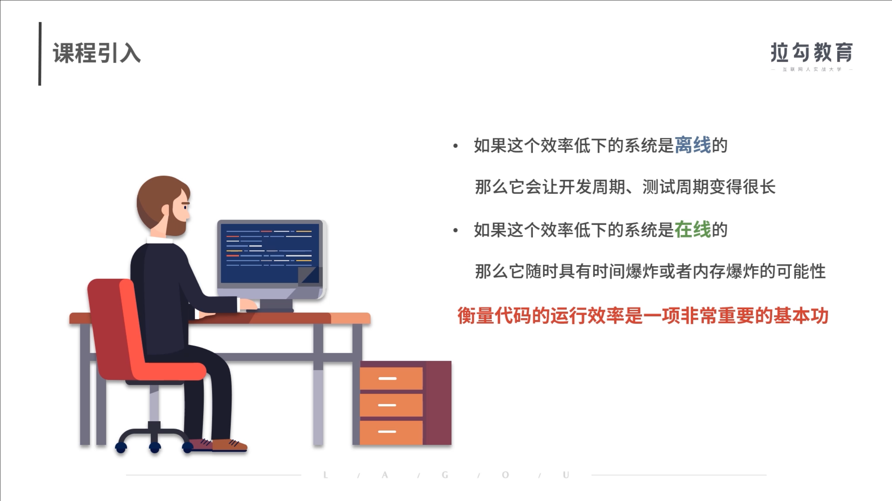
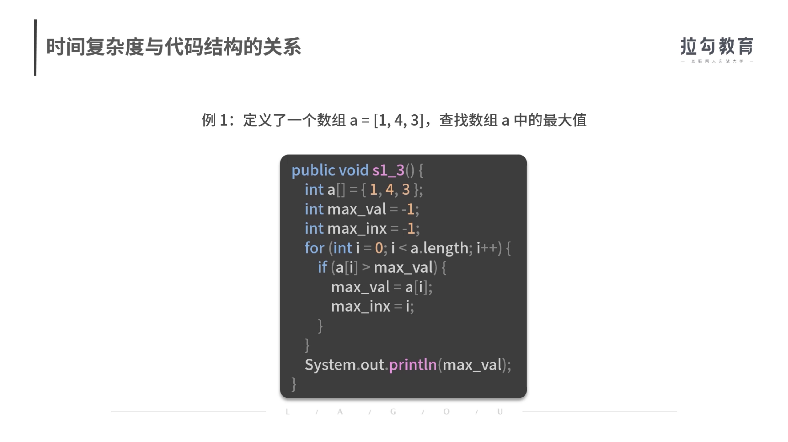
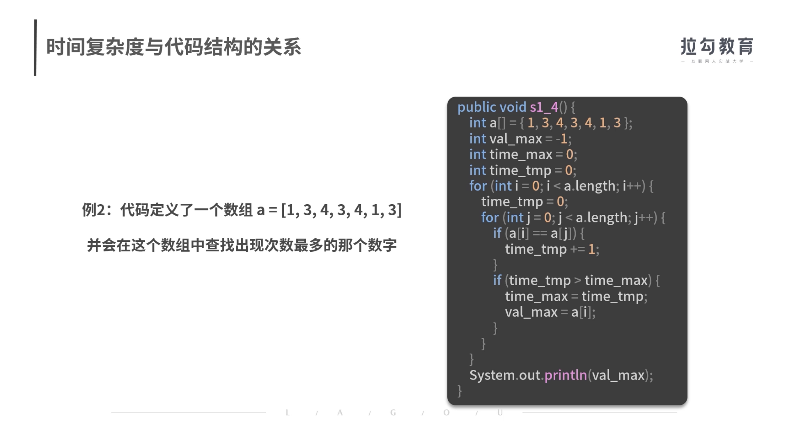
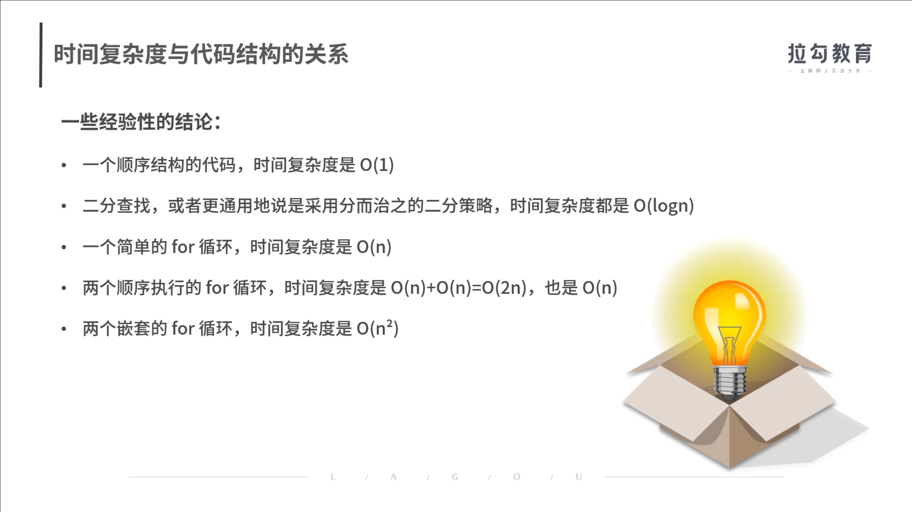
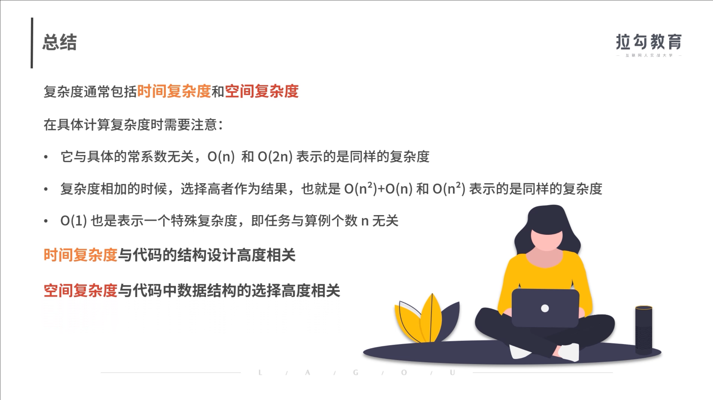

**01 | 复杂度：如何衡量程序运行的效率？**

# 01 | 复杂度：如何衡量程序运行的效率？

2020/05/18 公瑾

复杂度

如何衡量程序运行的效率？

算法思维

数据结构的原理

掌握程序开发  代码优化 





前面我说到了，咱们这个专栏的目标是想教会你利用数据结构的知识，建立算法思维，并完成代码效率的优化。为了达到这个目标，在第一节课，我们先来讲一讲**如何衡量程序运行的效率**。

当你在大数据环境中开发代码时，你一定遇到过程序执行好几个小时、甚至好几天的情况，或者是执行过程中电脑几乎死机的情况：

- 如果这个效率低下的系统是**离线**的，那么它会让我们的开发周期、测试周期变得很长。
- 如果这个效率低下的系统是**在线**的，那么它随时具有时间爆炸或者内存爆炸的可能性。

因此，衡量代码的运行效率对于一个工程师而言，是一项非常重要的基本功。本课时我们就来学习程序运行效率相关的度量方法。

#### 复杂度是什么

**复杂度是衡量代码运行效率的重要的度量因素**。在介绍复杂度之前，有必要先看一下复杂度和计算机实际任务处理效率的关系，从而了解降低复杂度的必要性。

复杂度是衡量代码运行效率的重要的度量因素

复杂度的必要性


计算机通过一个个程序去执行计算任务，也就是对输入数据进行加工处理，并最终得到结果的过程。每个程序都是由代码构成的。可见，编写代码的核心就是要完成计算。但对于同一个计算任务，不同计算方法得到结果的过程复杂程度是不一样的，这对你实际的任务处理效率就有了非常大的影响。

计算机通过一个个程序去执行计算任务


举个例子，你要在一个在线系统中实时处理数据。假设这个系统平均每分钟会新增 300M 的数据量。如果你的代码不能在 1 分钟内完成对这 300M 数据的处理，那么这个系统就会发生时间爆炸和空间爆炸。表现就是，电脑执行越来越慢，直到死机。因此，我们需要讲究合理的计算方法，去通过尽可能低复杂程度的代码完成计算任务。


那提到降低复杂度，我们首先需要知道怎么衡量复杂度。而在实际衡量时，我们通常会围绕以下2 个维度进行。**首先，这段代码消耗的资源是什么**。一般而言，代码执行过程中会消耗计算时间和计算空间，那需要衡量的就是时间复杂度和空间复杂度。

时空


我举一个实际生活中的例子。某个十字路口没有建立立交桥时，所有车辆通过红绿灯分批次行驶通过。当大量汽车同时过路口的时候，就会分别消耗大家的时间。但建了立交桥之后，所有车辆都可以同时通过了，因为立交桥的存在，等于是消耗了空间资源，来换取了时间资源。


**其次，这段代码对于资源的消耗是多少**。我们不会关注这段代码对于资源消耗的绝对量，因为不管是时间还是空间，它们的消耗程度都与输入的数据量高度相关，输入数据少时消耗自然就少。为了更客观地衡量消耗程度，我们通常会关注时间或者空间消耗量与输入数据量之间的关系。

好，现在我们已经了解了衡量复杂度的两个纬度，那应该如何去计算复杂度呢？

**复杂度是一个关于输入数据量 n 的函数**。假设你的代码复杂度是 f(n)，那么就用个大写字母 O 和括号，把 f(n) 括起来就可以了，即 O(f(n))。例如，O(n) 表示的是，复杂度与计算实例的个数 n 线性相关；O(logn) 表示的是，复杂度与计算实例的个数 n 对数相关。

通常，复杂度的计算方法遵循以下几个原则：

- 首先，**复杂度与具体的常系数无关**，例如 O(n) 和 O(2n) 表示的是同样的复杂度。我们详细分析下，O(2n) 等于 O(n+n)，也等于 O(n) + O(n)。也就是说，一段 O(n) 复杂度的代码只是先后执行两遍 O(n)，其复杂度是一致的。
- 其次，**多项式级的复杂度相加的时候，选择高者作为结果**，例如 O(n²)+O(n) 和 O(n²) 表示的是同样的复杂度。具体分析一下就是，O(n²)+O(n) = O(n²+n)。随着 n 越来越大，二阶多项式的变化率是要比一阶多项式更大的。因此，只需要通过更大变化率的二阶多项式来表征复杂度就可以了。

值得一提的是，**O(1) 也是表示一个特殊复杂度**，含义为某个任务通过有限可数的资源即可完成。此处有限可数的具体意义是，**与输入数据量 n 无关**。

例如，你的代码处理 10 条数据需要消耗 5 个单位的时间资源，3 个单位的空间资源。处理 1000 条数据，还是只需要消耗 5 个单位的时间资源，3 个单位的空间资源。那么就能发现资源消耗与输入数据量无关，就是 O(1) 的复杂度。

O(1)  与输入数据量n无关

为了方便你理解不同计算方法对复杂度的影响，我们来看一个代码任务：对于输入的数组，输出与之逆序的数组。例如，输入 a=[1,2,3,4,5]，输出 [5,4,3,2,1]。

先看**方法一**，建立并初始化数组 b，得到一个与输入数组等长的全零数组。通过一个 for 循环，从左到右将 a 数组的元素，从右到左地赋值到 b 数组中，最后输出数组 b 得到结果。


代码如下：

```java
复制public void s1_1() {
    int a[] = { 1, 2, 3, 4, 5 };
    int b[] = new int[5];
    for (int i = 0; i < a.length; i++) {
        b[i] = a[i];
    }
    for (int i = 0; i < a.length; i++) {
        b[a.length - i - 1] = a[i];
    }
    System.out.println(Arrays.toString(b));
}
```

这段代码的输入数据是 a，数据量就等于数组 a 的长度。代码中有两个 for 循环，作用分别是给b 数组初始化和赋值，其执行次数都与输入数据量相等。因此，代码的**时间复杂度**就是 O(n)+O(n)，也就是 O(n)。

空间方面主要体现在计算过程中，对于存储资源的消耗情况。上面这段代码中，我们定义了一个新的数组 b，它与输入数组 a 的长度相等。因此，空间复杂度就是 O(n)。

**接着我们看一下第二种编码方法**，它定义了缓存变量 tmp，接着通过一个 for 循环，从 0 遍历到a 数组长度的一半（即 len(a)/2）。每次遍历执行的是什么内容？就是交换首尾对应的元素。最后打印数组 a，得到结果。


代码如下：

```java
复制public void s1_2() {
    int a[] = { 1, 2, 3, 4, 5 };
    int tmp = 0;
    for (int i = 0; i < (a.length / 2); i++) {
        tmp = a[i];
        a[i] = a[a.length - i - 1];
        a[a.length - i - 1] = tmp;
	}
        System.out.println(Arrays.toString(a));
}
```

这段代码包含了一个 for 循环，执行的次数是数组长度的一半，时间复杂度变成了 O(n/2)。根据复杂度与具体的常系数无关的性质，这段代码的时间复杂度也就是 O(n)。

空间方面，我们定义了一个 tmp 变量，它与数组长度无关。也就是说，输入是 5 个元素的数组，需要一个 tmp 变量；输入是 50 个元素的数组，依然只需要一个 tmp 变量。因此，空间复杂度与输入数组长度无关，即 O(1)。

复杂度 

可见，**对于同一个问题，采用不同的编码方法，对时间和空间的消耗是有可能不一样的**。因此，工程师在写代码的时候，一方面要完成任务目标；另一方面，也需要考虑时间复杂度和空间复杂度，以求用尽可能少的时间损耗和尽可能少的空间损耗去完成任务。


任务目标 


#### 时间复杂度与代码结构的关系

好了，通过前面的内容，相信你已经对时间复杂度和空间复杂度有了很好的理解。从本质来看，时间复杂度与代码的结构有着非常紧密的关系；而空间复杂度与数据结构的设计有关，关于这一点我们会在下一讲进行详细阐述。接下来我先来系统地讲一下时间复杂度和代码结构的关系。

代码的**时间复杂度，与代码的结构有非常强的关系**，我们一起来看一些具体的例子。




例 1，定义了一个数组 a = [1, 4, 3]，查找数组 a 中的最大值，代码如下：

```java
复制public void s1_3() {
    int a[] = { 1, 4, 3 };
    int max_val = -1;
    for (int i = 0; i < a.length; i++) {
        if (a[i] > max_val) {
            max_val = a[i];
        }
    }
    System.out.println(max_val);
}
```

这个例子比较简单，实现方法就是，暂存当前最大值并把所有元素遍历一遍即可。因为代码的结构上需要使用一个 for 循环，对数组所有元素处理一遍，所以时间复杂度为 O(n)。




例2，下面的代码定义了一个数组 a = [1, 3, 4, 3, 4, 1, 3]，并会在这个数组中查找出现次数最多的那个数字：

```java
复制public void s1_4() {
    int a[] = { 1, 3, 4, 3, 4, 1, 3 };
    int val_max = -1;
    int time_max = 0;
    int time_tmp = 0;
    for (int i = 0; i < a.length; i++) {
        time_tmp = 0;
        for (int j = 0; j < a.length; j++) {
            if (a[i] == a[j]) {
            time_tmp += 1;
        }
        if (time_tmp > time_max) {
            time_max = time_tmp;
            val_max = a[i];
        }
        }
    }
    System.out.println(val_max);
}
```

理解了 

第一层循环

数组中的每个元素进行遍历


这段代码中，我们采用了双层循环的方式计算：第一层循环，我们对数组中的每个元素进行遍历；第二层循环，对于每个元素计算出现的次数，并且通过当前元素次数 time_tmp 和全局最大次数变量 time_max 的大小关系，持续保存出现次数最多的那个元素及其出现次数。由于是双层循环，这段代码在时间方面的消耗就是 n*n 的复杂度，也就是 O(n²)。

在这里，我们给出一些经验性的结论：

- 一个顺序结构的代码，时间复杂度是 O(1)。
- 二分查找，或者更通用地说是采用分而治之的二分策略，时间复杂度都是 O(logn)。这个我们会在后续课程讲到。
- 一个简单的 for 循环，时间复杂度是 O(n)。
- 两个顺序执行的 for 循环，时间复杂度是 O(n)+O(n)=O(2n)，其实也是 O(n)。
- 两个嵌套的 for 循环，时间复杂度是 O(n²)。

两个顺序执行

两个嵌套执行

有了这些基本的结论，再去分析代码的时间复杂度将会轻而易举。




#### 降低时间复杂度的必要性

很多新手的工程师，对降低时间复杂度并没有那么强的意识。这主要是在学校或者实验室中，参加的课程作业或者科研项目，普遍都不是实时的、在线的工程环境。

实时的  在线的


实际的在线环境中，用户的访问请求可以看作一个流式数据。假设这个数据流中，每个访问的平均时间间隔是 t。如果你的代码无法在 t 时间内处理完单次的访问请求，那么这个系统就会一波未平一波又起，最终被大量积压的任务给压垮。这就要求工程师必须通过优化代码、优化数据结构，来降低时间复杂度。

为了更好理解，我们来看一些数据。假设某个计算任务需要处理 10万 条数据。你编写的代码：

- 如果是 O(n²) 的时间复杂度，那么计算的次数就大概是 100 亿次左右。
- 如果是 O(n)，那么计算的次数就是 10万 次左右。
- 如果这个工程师再厉害一些，能在 O(log n) 的复杂度下完成任务，那么计算的次数就是 17 次左右（log 100000 = 16.61，计算机通常是二分法，这里的对数可以以 2 为底去估计）。

数字是不是一下子变得很悬殊？通常在小数据集上，时间复杂度的降低在绝对处理时间上没有太多体现。但在当今的大数据环境下，时间复杂度的优化将会带来巨大的系统收益。而这是优秀工程师必须具备的工程开发基本意识。

工程开发

#### 总结

OK，今天的内容到这儿就结束了。相信你对复杂度的概念有了进一步的认识。

复杂度通常包括时间复杂度和空间复杂度。在具体计算复杂度时需要注意以下几点。

1. **它与具体的常系数无关**，O(n) 和 O(2n) 表示的是同样的复杂度。
2. **复杂度相加的时候，选择高者作为结果**，也就是说 O(n²)+O(n) 和 O(n²) 表示的是同样的复杂度。
3. **O(1) 也是表示一个特殊复杂度**，即任务与算例个数 n 无关。


复杂度细分为时间复杂度和空间复杂度，其中时间复杂度与**代码的结构设计**高度相关；空间复杂度与代码中**数据结构的选择**高度相关。会计算一段代码的时间复杂度和空间复杂度，是工程师的基本功。这项技能你在实际工作中一定会用到，甚至在参加互联网公司面试的时候，也是面试中的必考内容。



关于复杂度的评估，需要你深入理解本节课的知识点。最后，你工作中有遇到过关于计算复杂度的哪些实际问题吗？你又是如何解决的？欢迎你在留言区和我分享。

# 精选留言


116

一个顺序结构的代码，时间复杂度是 O(1)。二分查找，或者更通用地说是采用分而治之的二分策略，时间复杂度都是 O(logn)。这个我们会在后续课程讲到。一个简单的 for 循环，时间复杂度是 O(n)。两个顺序执行的 for 循环，时间复杂度是 O(n)+O(n)=O(2n)，其实也是 O(n)。两个嵌套的 for 循环，时间复杂度是 O(n²)。这个👆🏻总结很重要

cobra

置顶


65

😂那些年挂的科，总是要还的

**编辑回复：** 我还是曾经那个少年


写的很好，很容易理解，希望加快更新速度


逻辑清晰，举例恰当，感觉课程下来，可以重构我对数据结构和算法的理解，老师语速适中，普通话标准，爱了爱了😍😍😍


感觉思路很清晰


老师的例子1，数组翻转里，有个地方不明白：int a[] = { 1, 2, 3, 4, 5 }; i++) { }不就默认赋值为b数组里每个元素为0吗，为什么又初始化一次呢，还是把a数组里的元素都赋值给b。我理解的是，直接O（n）就可以了，不明白为什么要O(n)+O(n).有哪位同学可以帮忙解答一下的吗，谢谢！


arraylist按下标取值，时间复杂度O(1)；linkedlistO(n)😂


\1. 看了下开篇，还不错讲的算细的，总结的也比较合理。2. 关于时间空间复杂度的常数级，只要记住当与输入的数据量无关时，就是O(1)，无论改代码片段执行了几亿次。3. 时间复杂度虽然有优劣，但在不是说平方级的算法就一定比线性级的算法要慢，这里主要是体现在超大数据量的时候，小数据量的时候不但差距很小，还有可能结果是相反的。


有例子理解起来更容易，赞！


老师讲的太棒了，每节课都总结下：1：复杂度分为：时间复杂度、空间复杂度。2：时间复杂度的计算和代码的结构，代码的执行次数有关系。3：空间复杂度的计算和数据结构，存储资源有关系。4：复杂度和常系数无关如：O(n)、O(2n)、O(n/2)都表示O(n)复杂度5：多个复杂度相加，取高次项复杂度为最终结果，如：O(n^3+n^2+n)那么这个复杂度就是O(n^3)6：常见的一些时间复杂度有：（1）对一个数组遍历循环，若数组长度为n，那么时间复杂度为O(n)。（2）嵌套遍历，若外层遍历n次，内层遍历m次，则时间复杂度为O(m*n)。（3）若两个遍历不是嵌套的，还是顺序的，那么时间复杂度依然是O(n)+O(n) = O(2n) = O(n)，最终依然为O(n)。（4）若n和程序执行的次数无关，那么时间复杂度始终为O(1)；比如针对一个长度为n的字符串直接进行输出操作，不管长度为多长，始终只需输出一次。7：优化时间复杂度很重要，处理10万的数据，程序结构定下的不同的时间复杂度，让计算机计算的次数是有天壤之别的。


不得不说，实操性很强，学习效果立竿见影，😀

*俊


1

写的很好，通俗易懂，适合算法初学者，感觉比极客时间小争哥写的更加易懂，很适合我😂


这一次对空间复杂度有了一个初步的认识😀

**来


答案是O(n3)?

*红


留的题答案是：O（n3）n立方吗？

Archer


没有人说练习题的答案吗？是不是O(n3) n的3次方

**婕


豁然开朗

**5467


还是javascript比较厉害调用一个方法即可实现😂

**秀


第一课总结：复杂度是衡量代码运行效率重要的度量因素复杂度包括时间复杂度和空间复杂度时间复杂度与代码的结构设计高度相关空间复杂度与代码中数据结构的选择高度相关关于复杂度的一些经验性结论：1.一个顺序结构的代码，时间复杂度是O(1)2.二分查找，或者通用地说是采用分而治之地二分策略，时间复杂度是O(logn)3.一个简单的for循环，时间复杂度是 O(n)4.两个顺序执行的 for 循环，时间复杂度是 O(n)+O(n)=O(2n)，其实也是 O(n)5.两个嵌套的 for 循环，时间复杂度是 O(n²)另外，老师的例子1中这里为什么一定要再初始化一次不大明白，希望有人帮忙解答下，谢谢 i++) { }


public void s1_1() { i++) { } i++) { }}这段代码的输入数据是 a，数据量就等于数组 a 的长度。代码中有两个 for 循环，作用分别是给b 数组初始化和赋值，其执行次数都与输入数据量相等。因此，代码的时间复杂度就是 O(n)+O(n)，也就是 O(n)。这里不要给b数组赋值吧。一个for循环就可以解决吧。

**讲师回复：** 一个for循环可以解决，时间复杂度相等。

*伟


按老师说的o(2n)和o(n)的复杂度都是o(n)，那平时在代码开发过程中还需要优化代码吗？毕竟o(2n)的速度比o(n)的速度提升了一倍

**讲师回复：** 如果有优化方案的话，当然是要优化的。同时，这样的优化可以看作是锦上添花。性能提高一倍和性能提高一个数量级，这是完全不同的概念。把复杂度从O(n方)降低到O(n)这才是雪中送炭的飞跃。

**福


复杂度细分为时间复杂度和空间复杂度，其中时间复杂度与代码的结构设计高度相关；空间复杂度与代码中数据结构的选择高度相关。

**3799


老师，请问下时间复杂度衡量的代码边界是怎样的，是一个方法还是一个for，例如某个方法里面有两个for，按照老师给的思路那这个方法时间复杂度就是On+On等于O2n等于On对么

**讲师回复：** 是的

**4689


上面*方的同学老师的例子是用JAVA写的b数组的初始化 语法里就是这么用两个O(n)相加是因为 两个for循环是顺序执行 其时间量是两个n数量级 但是时间复杂度T(n)＝O(n)

**山


涨知识了

*琴


4年前端Copy攻城狮，工作中好像没有遇到什么算法问题，自从用了框架，for循环都没怎么弄了😂。总结今天学到的知识点:1.复杂度是衡量代码质量和数据结构优劣的一个标准，分为时间复杂度和空间复杂度。这里我对时间复杂度的浅显认知是代码运行时间，对空间的浅显认知是消耗的资源(如内存)。时间复杂度取决于代码结构，空间复杂度取决于数据结构。2.O(1)是个特殊的复杂度，浅显的理解变量赋值是O(1)复杂度，二分法的复杂度是O(log n)，对于牛逼的攻城狮来说海量数据请求可以做到很低的复杂度。一个顺序的循环是O(n)的复杂度，两个嵌套循环是O(n²)的复杂度。3.有些情况下我们可以牺牲空间复杂度进而降低时间复杂度。

**尔


讲的好

Yancy


爱了爱了

**不想做小白


“假设你的代码复杂度是 f(n)，那么就用个大写字母 O 和括号，把 f(n) 括起来就可以了，即 O(f(n))。例如，O(n) 表示的是，复杂度与计算实例的个数 n 线性相关；O(logn) 表示的是，复杂度与计算实例的个数 n 对数相关。”请问一下，n对应的是计算实例个数，上面这段话中的f和O分别表示什么呢？复杂度是f(n),那O表达的是什么意义呢？

**讲师回复：** 如果复杂度是O(logn)，此时f(n)=logn。O代表复杂度。

**冬


之前看好多资料讲时间复杂度和空间复杂度就给一张表，根本记不住，这里通过分析进而总结出规则，以后在怎么变也不怕了，，，课程不错

**8836


我对空间复杂度有点不太理解。比如下面int a[]不算在空间复杂度内吗？不也是在堆内存里开辟了空间吗？public void s1_2() { int a[] = { 1, 2, 3, 4, 5 }; int tmp = 0; for (int i = 0; i i++) { tmp = a[i]; a[i] = a[a.length - i - 1]; a[a.length - i - 1] = tmp; } System.out.println(Arrays.toString(a));}

**讲师回复：** 这是输入的待处理数据，可以不计算在内。可以理解为，为了处理这些数据，额外还需要多少空间

**富


只想说两个字：牛逼

**星


老师还是有点不明白为啥O(n)和O(2n)的时间复杂度是一样的，如果执行一个for循环是O(n)，连续执行100个for循环是O(100n)，那执行100个for循环花费的时间不是一个for循环的100倍吗？

**讲师回复：** 执行时间是100倍，但他们的复杂度是一样的，复杂度不等于执行时间。复杂度指的是，处理时间与输入数据量的关系。O(n)表示是线性关系，不管是2n还是100n都是线性的。

### 复杂度指的是，处理时间与输入数据量的关系


一段O(n)复杂度的代码只是先后执行两遍O(n)，其复杂度是一致的是不是写错了？ 一段O(2n)复杂度的代码只是先后执行两遍O(n)，其复杂度是一致的

**讲师回复：** 复杂度的视角来看，O(2n)和O(n)是一样的。复杂度指的是，处理时间与输入数据量的关系。O(n)表示是线性关系，不管是2n还是100n都是线性的。

Univ


前面的例子赞，举例对比总是使人更容易理解，关键是例子质量要高

**gg


为什么复杂度一般忽略它的系数？比如n/2和n的理论上速度相差可是一倍。

**讲师回复：** 是的n/2比n快一倍没毛病。不过复杂度衡量的并不完全是程序执行的绝对时间，它衡量的是程序执行时间的损耗与输入数据量的关系。因此，不管是n/2还是n，他们都与输入数据量线性相关。这就是O(n)的含义。

**桂


public void s1_1() { int a[] = { 1, 2, 3, 4, 5 }; int b[] = new int[5]; for (int i = 0; i i++) { b[i] = a[i]; } for (int i = 0; i i++) { b[a.length - i - 1] = a[i]; } System.out.println(Arrays.toString(b));}这里第一个循环有什么作用？

**讲师回复：** 初始化一个数组

**慧


这里的空间复杂度,是跟输入的数据量有关,还是输出的数据量有关,还是这个过程中使用的变量的数量有关,或者空间复杂度的资源消耗是怎样的,没看懂啊,求解释

**讲师回复：** 时间/空间复杂度，都是待处理的输入数据量的函数。

**-小周


代码结构设计和数据结构选择怎么理解那

**讲师回复：** 这两个是互为因果的。因为选了XX数据结构，就决定结构为N层的循环。

**志


不搞那些严格数学极限定义时间复杂度吗？

**清


比较直观的对复杂度有了更好的理解，希望快点更新更多的课程

**4923


不错

**峰


解决了多年的疑惑，感谢😀

**鹤


复杂度通常包括时间复杂度和空间复杂度。在具体计算复杂度时需要注意以下几点。它与具体的常系数无关，O(n) 和 O(2n) 表示的是同样的复杂度。复杂度相加的时候，选择高者作为结果，也就是说 O(n²)+O(n) 和 O(n²) 表示的是同样的复杂度。O(1) 也是表示一个特殊复杂度，即任务与算例个数 n 无关。一个顺序结构的代码，时间复杂度是 O(1)。二分查找，或者更通用地说是采用分而治之的二分策略，时间复杂度都是 O(logn)。一个简单的 for 循环，时间复杂度是 O(n)。两个顺序执行的 for 循环，时间复杂度是 O(n)+O(n)=O(2n)，因与具体的常系数无关,所以其实也是 O(n)。两个嵌套的 for 循环，时间复杂度是 O(n²)。GET

**讲师回复：** OK

*杰


我还得再看看

**3212


讲得不错

**6471


打卡，老师讲得很详细，讲课过程也有互相呼应。

**舟


内容还是以基础为准，很明了。期待后面的内容。

**程


老师讲解的很到位😁

**辉


讲的挺好。

**明


很nice

**1839


例2中，a = [1, 3, 4, 3, 4, 1, 3]这个数组，如果同时输出【出现次数最多的那个数字】和【次数】，【次数】是不是多加了一次啊，因为第二层循环也是从0开始，就会多计算一次

**讲师回复：** 次数没有多加一次，但是会对重复的数字多统计一遍它出现的次数

**华


大O表示法来分析时间复杂度和空间复杂度