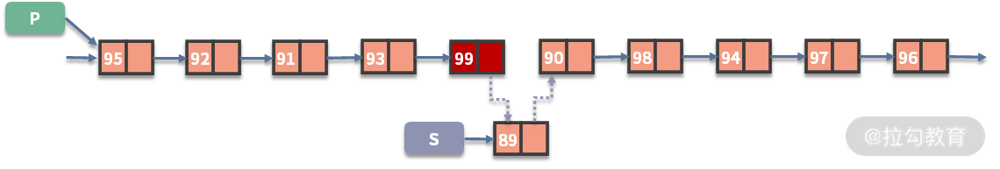
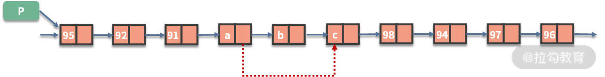
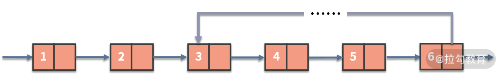
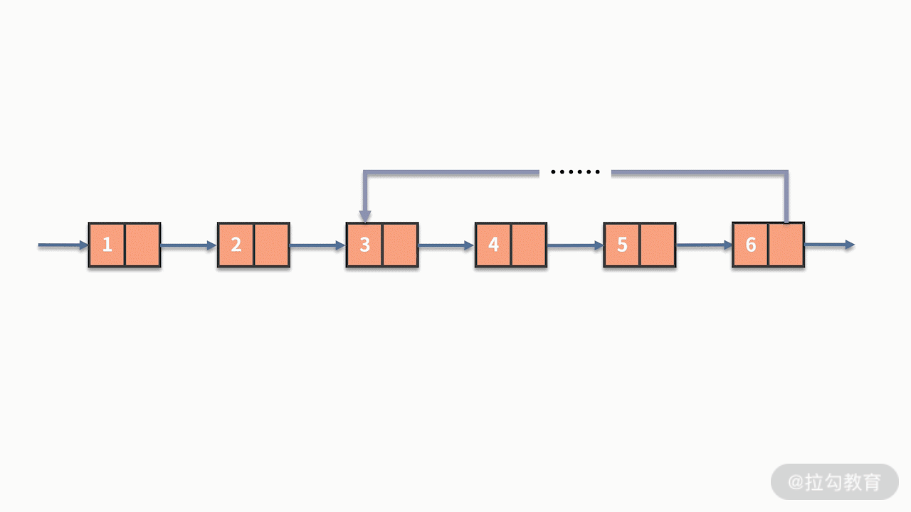

**04 | 如何完成线性表结构下的增删查？**

# 04 | 如何完成线性表结构下的增删查？

2020/05/27 公瑾

> **主要内容**：1、线性表是什么；2、线性表对于数据的增删查处理；3、线性表的一些案例

通过前面课时的学习，我们了解到数据在代码中被处理和加工的最小单位动作是增、删、查。它们是深入学习数据结构的根基，通过“增删查”的操作，我们可以选择更合适的数据结构来解决实际工作中遇到的问题。例如，几个客户端分别向服务端发送请求，服务端要采用先到先得的处理方式，应该如何设计数据结构呢？接下来，从本课时开始，我们将正式开始系统性的学习数据结构的内容。

数据在代码中被处理和加工的最小单位动作是 增删改查  

深入学习数据结构的根基 

线性表结构下的增删改查 

先到先得  队列


### 什么是数据结构？

首先，我们简单探讨一下什么是数据结构。数据结构，从名字上来看是数据的结构，也就是数据的组织方式。在数据结构适用的场合中，需要有一定量的数据。如果数据都没有，也就不用讨论数据如何组织了。当我们有了一定数量的数据时，就需要考虑以什么样的方式去对这些数据进行组织了。

数据的结构 

数据的组织方式

一定量的数据

数据如何组织

以什么的方式 去对这些数据进行组织了


接下来，我将通过一个实际案例来帮助你更好地理解数据结构。假设你是一所幼儿园的园长，现在你们正在组织一场运动会，所有的小朋友需要在操场上接受检阅。那么，如何组织小朋友有序站队并完成检阅呢？

几个可能的方式是，让所有的小朋友站成一横排，或者让小朋友站成方阵，又或者让所有的小朋友手拉手，围成一个大圆圈等等。很显然，这里有无数种可行的组织方式。具体选择哪个组织方式，取决于哪一种能更好地展示出小朋友们的风采。

试想一下，当计算机要处理大量数据时，同样需要考虑如何去组织这些数据，这就是数据结构。类似于小朋友的站队方式有无数种情况，数据组织的方式也是有无数种可能性。


然而，在实际开发中，经过工程师验证并且能有效解决问题的高效率数据结构就比较有限了。事实上，只要我们把这些能真正解决问题的数据结构学会，就足以成为一名合格的软件工程师了。

### 什么是线性表

好了，铺垫完数据结构的基本概念后，我们就正式进入到这个课程中的第一个数据结构的学习，线性表。

线性表 

线性表是 n 个数据元素的有限序列，最常用的是链式表达，通常也叫作线性链表或者链表。在链表中存储的数据元素也叫作结点，一个结点存储的就是一条数据记录。每个结点的结构包括两个部分：

- 第一是具体的数据值；
- 第二是指向下一个结点的指针。

线性表 是  n个数据元素的有限序列   链式表达 

线性链表  

结点 


头指针用来指向第一个结点  


在链表的最前面，通常会有个头指针用来指向第一个结点。对于链表的最后一个结点，由于在它之后没有下一个结点，因此它的指针是个空指针。链表结构，和小朋友手拉手站成一排的场景是非常相似的。

例如，你需要处理的数据集是 10 个同学考试的得分。如果用链表进行存储，就会得到如下的数据：


仔细观察上图，你会发现这个链表只能通过上一个结点的指针找到下一个结点，反过来则是行不通的。因此，这样的链表也被称作单向链表。

有时候为了弥补单向链表的不足，我们可以对结点的结构进行改造：

- 对于一个单向链表，让最后一个元素的指针指向第一个元素，就得到了循环链表；
- 或者把结点的结构进行改造，除了有指向下一个结点的指针以外，再增加一个指向上一个结点的指针。这样就得到了双向链表。


同样的，还可以对双向链表和循环链表进行融合，就得到了双向循环链表，如下图所示：


这些种类的链表，都是以单向链表为基础进行的变种。在某些场景下能提高线性表的效率。

### 线性表对于数据的增删查处理

学会了线性表原理之后，我们就来围绕数据的增删查操作，来看看线性表的表现。在这里我们主要介绍单向链表的增删查操作，其他类型的链表与此雷同，我们就不再重复介绍了。

首先看一下增加操作。如下有一个链表，它存储了 10 个同学的考试成绩。现在发现这样的问题，在这个链表中，有一个同学的成绩忘了被存储进去。假设我们要把这个成绩在红色的结点之后插入，那么该如何进行呢？

其实，链表在执行数据新增的时候非常容易，只需要把待插入结点的指针指向原指针的目标，把原来的指针指向待插入的结点，就可以了。如下图所示：



代码如下：

```js
s.next = p.next;
p.next = s;
```

接下来我们看一下删除操作。还是这个存储了同学们考试成绩的链表，假设里面有一个成绩的样本是被误操作放进来的，我们需要把这个样本删除。链表的删除操作跟新增操作一样，都是非常简单的。如果待删除的结点为 b，那么只需要把指向 b 的指针 （p.next），指向 b 的指针指向的结点（p.next.next）。如下图所示：



代码如下：

```java
复制p.next = p.next.next;
```

最后，我们再来看看查找操作。我们在前面的课时中提到过，查找操作有两种情况：

- 第一种情况是按照位置序号来查找。

它和数组中的 index 是非常类似的。假设一个链表中，按照学号存储了 10 个同学的考试成绩。现在要查找出学号等于 5 的同学，他的考试成绩是多少，该怎么办呢？

其实，链表的查找功能是比较弱的，对于这个查找问题，唯一的办法就是一个一个地遍历去查找。也就是，从头开始，先找到学号为 1 的同学，再经过他跳转到学号为 2 的同学。直到经过多次跳转，找到了学号为 5 的同学，才能取出这个同学的成绩。如下图所示：


- 第二种情况是按照具体的成绩来查找。

同样，假设在一个链表中，存储了 10 个同学的考试成绩。现在要查找出是否有人得分为 95 分。链表的价值在于用指针按照顺序连接了数据结点，但对于每个结点的数值则没有任何整合。当需要按照数值的条件进行查找时，除了按照先后顺序进行遍历，别无他法。

因此，解决方案是，判断第一个结点的值是否等于 95：

- 如果是，则返回有人得分为 95 分；
- 如果不是，则需要通过指针去判断下一个结点的值是否等于 95。以此类推，直到把所有结点都访问完。


根据这里的分析不难发现，链表在新增、删除数据都比较容易，可以在 O(1) 的时间复杂度内完成。但对于查找，不管是按照位置的查找还是按照数值条件的查找，都需要对全部数据进行遍历。这显然就是 O(n) 的时间复杂度。

虽然链表在新增和删除数据上有优势，但仔细思考就会发现，这个优势并不实用。这主要是因为，在新增数据时，通常会伴随一个查找的动作。例如，在第五个结点后，新增一个新的数据结点，那么执行的操作就包含两个步骤：

- 第一步，查找第五个结点；
- 第二步，再新增一个数据结点。整体的复杂度就是 O(n) + O(1)。


根据我们前面所学的复杂度计算方法，这也等同于 O(n) 的时间复杂度。线性表真正的价值在于，它对数据的存储方式是按照顺序的存储。如果数据的元素个数不确定，且需要经常进行数据的新增和删除时，那么链表会比较合适。如果数据元素大小确定，删除插入的操作并不多，那么数组可能更适合些。

关于数组的知识，我们在后续的课程中会详细展开。

### 线性表案例

关于线性表，最高频的问题都会围绕数据顺序的处理。我们在这里给出一些例子来帮助你更好地理解。

例 1，链表的翻转。给定一个链表，输出翻转后的链表。例如，输入1 ->2 -> 3 -> 4 ->5，输出 5 -> 4 -> 3 -> 2 -> 1。

我们来仔细看一下这个问题的难点在哪里，这里有两种情况：

- 如果是数组的翻转，这会非常容易。原因在于，数组在连续的空间进行存储，可以直接求解出数组的长度。而且，数组可以通过索引值去查找元素，然后对相应的数据进行交换操作而完成翻转。
- 但对于某个单向链表，它的指针结构造成了它的数据通路有去无回，一旦修改了某个指针，后面的数据就会造成失联的状态。为了解决这个问题，我们需要构造三个指针 prev、curr 和 next，对当前结点、以及它之前和之后的结点进行缓存，再完成翻转动作。具体如下图所示：

```java
复制while(curr){
    next = curr.next;
    curr.next = prev；
    prev = curr;
    curr = next;
}
```


例 2，给定一个奇数个元素的链表，查找出这个链表中间位置的结点的数值。

这个问题也是利用了链表的长度无法直接获取的不足做文章，解决办法如下：

- 一个暴力的办法是，先通过一次遍历去计算链表的长度，这样我们就知道了链表中间位置是第几个。接着再通过一次遍历去查找这个位置的数值。
- 除此之外，还有一个巧妙的办法，就是利用快慢指针进行处理。其中快指针每次循环向后跳转两次，而慢指针每次向后跳转一次。如下图所示。


```java
复制while(fast && fast.next && fast.next.next){
    fast = fast.next.next;
    slow = slow.next;
}
```

例 3，判断链表是否有环。如下图所示，这就是一个有环的链表。



链表的快慢指针方法，在很多链表操作的场景下都非常适用，对于这个问题也是一样。

假设链表有环，这个环里面就像是一个跑步赛道的操场一样。经过多次循环之后，快指针和慢指针都会进入到这个赛道中，就好像两个跑步选手在比赛。#加动图#快指针每次走两格，而慢指针每次走一格，相对而言，快指针每次循环会多走一步。这就意味着：

- 如果链表存在环，快指针和慢指针一定会在环内相遇，即 fast == slow 的情况一定会发生。
- 反之，则最终会完成循环，二者从未相遇。

根据这个性质我们就能对链表是否有环进行准确地判断了。如下图所示：



### 总结

好的，这节课的内容就到这里了。这一节的内容主要围绕线性表的原理、线性表对于数据的增删查操作展开。线性链表结构的每个结点，由数据的数值和指向下一个元素的指针构成。根据结构组合方式的不同，除了单向链表以外，还有双向链表、循环链表以及双向循环链表等变形。

经过我们的分析，链表在增、删方面比较容易实现，可以在 O(1) 的时间复杂度内完成。但对于查找，不管是按照位置的查找还是按照数值条件的查找，都需要对全部数据进行遍历。

线性表的价值在于，它对数据的存储方式是按照顺序的存储。当数据的元素个数不确定，且需要经常进行数据的新增和删除时，那么链表会比较合适。链表的翻转、快慢指针的方法，是你必须掌握的内容。如果你在链表的使用方面遇到困难，欢迎在留言区和我交流。

精选留言
写留言
*军
right-icon
19
看到链表的快慢指针查找方式,突然就高潮了,😀
**波
right-icon
2
确实讲的好，是我想要的，99元的和一元的课都买了，总的来说一元的课最棒！😀
*琴
right-icon
2
今天学到了:①概念:线性表是 n 个数据元素的有限序列，最常用的有单向链表、双向链表、循环链表，双向循环链表。②线性在增删方面的复杂度是O(1),但由于没有索引，在查方面的复杂度是O(n)③线性表常用的案例有链表翻转、查找元素、判断链表是否有环。链表翻转案例中需要构造三个指针 prev、curr 和 next，对当前结点、以及它之前和之后的结点进行缓存，再完成翻转动作。第二个案例给定一个奇数个元素的链表，查找出这个链表中间位置的结点的数值可用暴力破解，也可用快慢指针。第三个案例判断链表是否有环也用到了快慢指针。其中第三个案例是前端面试中深拷贝的知识点。这里遇到的困惑是对概念还不太熟悉，比如快慢指针、环等，还停留在抽像的理解。督促自己课后去通过案例理解。欢迎大佬指导！
*鑫
right-icon
2
且  建议用户可以互相回复  懂的人可以回复别人的问题
编辑回复： 可以关注 拉勾教育公众号，加入学习群和大家一起讨论学习
**蕊
right-icon
1
终于弄明白为什么用快慢指针的方法了
*伟
right-icon
1
判断链表有环，那个太巧妙了，有环快的会超过慢的一圈，绝妙
**婷
right-icon
1
每天都等着老师更新课程，太赞了😁
编辑回复： 感谢反馈，留言收到，我们后续会继续优化专栏更新节奏。
**用户6542
right-icon
1
挺好的，生动形象，老师加油啊
*海
right-icon
1
如果去掉奇数条件,用这个循环条件： while(fast&&fast->next)
**生
right-icon
快慢指针能够解决链表是否有环和查找链表的第n分之一个元素所在的值
**童
right-icon
一直不敢学链表，觉得很抽象，平常又很少用，这次终于认真学习到了。可以去刷题了😁
*峰
right-icon
快指针会进入死循环，慢指针迟早追上，各位算算慢指针一次移动二，快的移动三，会什么时候遇到呢😈
**龙
right-icon
第三题，快慢指针相遇的时候一定会指向统一节点吗？
**鑫
right-icon
眼睛：我会了。
手：不，你没有！！！
编辑回复： 平时可以多利用琐碎的时间来学习，如果感觉吃力的话也可以辅助一些基础的书籍，相信自己不要轻言放弃~加油~
**清
right-icon
快慢指针到位😁
*鸟
right-icon
生动形象，讲的很好
**宽
right-icon
很详细，易懂
**明
right-icon
总算是get到了快慢指针的真谛
*文
right-icon
线性表就是我们常说的 链表。
链表中存储数据的元素叫做节点。每一个节点都包含两个信息：
1、存储的数据
2、指向下一个节点的指针
链表最后没有元素的指针指向null

由单链表演变而来的有 双向链表、循环列表和双向循环列表。

链表在增 和 删方面具有优势，时间复杂度为O(1)但，也是相对的优势。可以直接通过修改某节点指针指向来完成增和删的操作。但是某节点也是需要遍历查找的，时间复杂度O(n)。所以是相对来说的优势。

链表经常使用的是快慢指针来判断是否有环等。

链表不同于数组，数组在内存中还是连续的而链表则是不连续的。


**波
right-icon
膝盖了
**煌
right-icon
这快慢指针用得真的好妙
**强
right-icon
快慢指针这个思路真是好
**强
right-icon
快慢指针这个思路真是好
啊
right-icon
找出两个链表的相同值的部分，并返回他们的上下坐标求最优解
*哥
right-icon
快慢指针可真巧妙啊 逆序不能借助栈吗
**诺
right-icon
例一是怎么想出来的？可以说一下吗？
**始不甜
right-icon
我也来了
charm.
right-icon
留言的人好少诶 打卡
编辑回复： 你这小可爱不是来了，哈哈