# 开篇词 | 数据结构与算法，应该这样学！

2020/05/18 公瑾

你好，我是公瑾，很高兴我们来一起重学数据结构与算法。

一起吧 

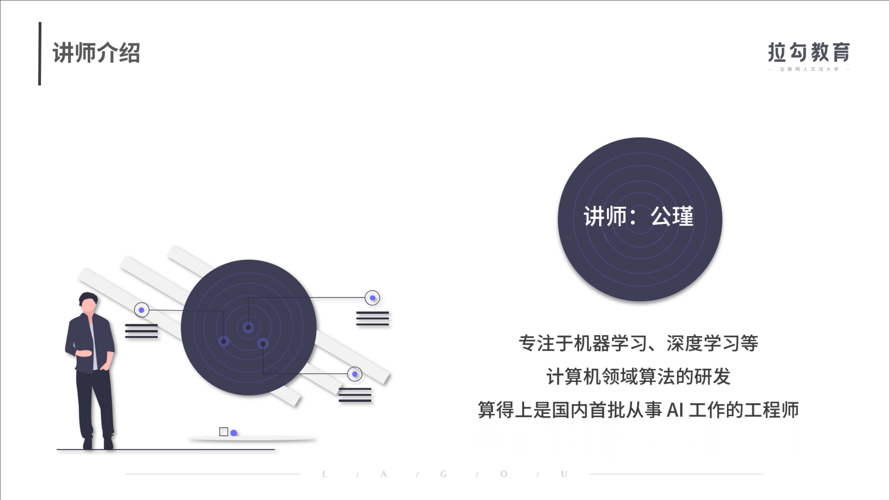

工作以来，我一直专注于机器学习、深度学习等计算机领域算法的研发，算得上是国内首批从事 AI 工作的工程师，代码开发和优化过程让我不断加强了对数据结构、算法思想的理解。

我代码开发 和 优化过程 

我不断加强对数据结构、算法思想的理解

理解成什么样子呢 

机器学习 深度学习   计算机领域  算法的研究

想象一下，你在开发一个网站的用户系统。这个用户系统的功能之一是，对某个尝试登录用户的ID去核实是否合法，这就需要去存储着海量数据的数据库中查找这个ID。

去存储海量数据的数据库中查找这个ID

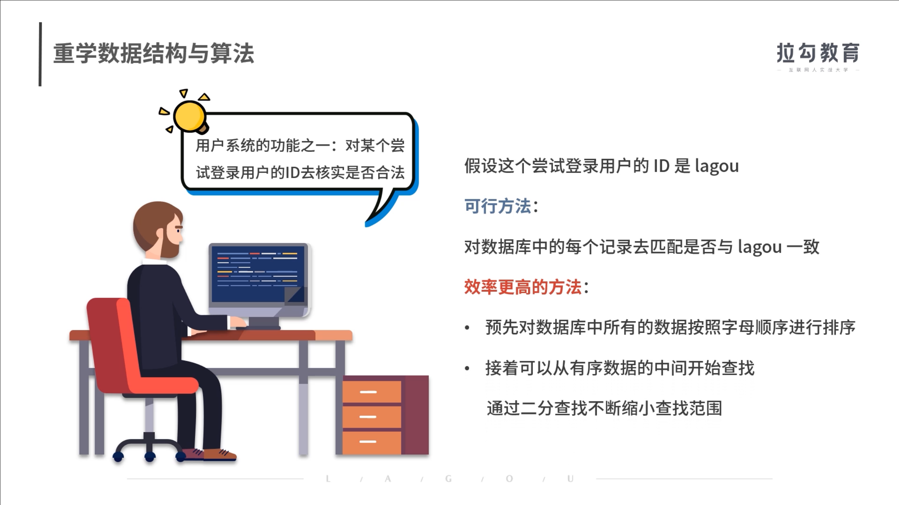

对数据库中的每一个记录去匹配是否与lagou一致

如果有顺序的话 

按照字母顺序进行排序 

接着就可以从有序数据的中间开始查找

假设这个尝试登录用户的ID是lagou，一个可行的办法是，对数据库中的每个记录去匹配是否与lagou一致。然而，效率更高的方法是，预先对数据库中所有的数据按照字母顺序进行排序，接着就可以从有序数据的中间开始查找，去通过二分查找不断缩小查找范围。如果这个系统的注册用户只有不足16个，两种查找方式所花费时间的差异也许并不明显，无非就是16次匹配与log₂16 = 4次匹配的区别。但如果注册用户的数量达到了1000万，两种查找算法的效率可能就是1000万次和24次的区别了（log₂10000000 = 23.25）。

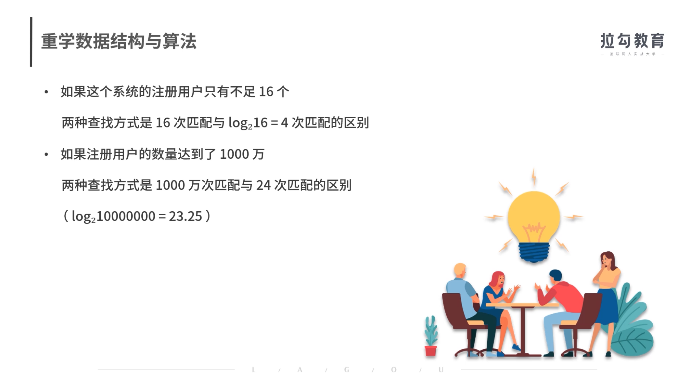

1000万  24次 

非常重要

我认为，数据结构与算法至关重要，不仅是优秀工程师思考如何解决业务问题、高效稳定地支撑公司业务、体现自身核心价值的关键，而且是入职**大厂的必考内容**。快手、今日头条、阿里等大厂面试，一定会考查你的数据结构与算法掌握情况，因为对于大流量应用来说，高效的算法直接影响用户体验。

思考如何解决业务问题 高效稳定地支撑公司业务

体现自身核心价值的关键

而且是入职大厂的必考内容

快手 今日头条 头条 字节跳动 阿里 腾讯 拼多多  京东

一定会考查你的数据结构与算法掌握情况

大流量应用 高效的算法直接影响用户体验

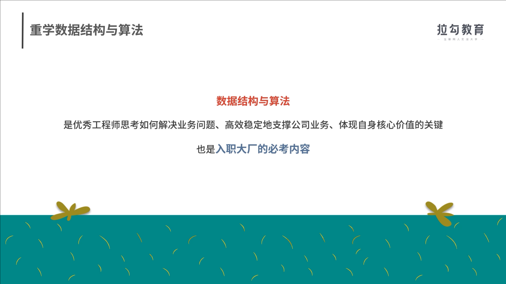

但是数据结构和算法的学习并不轻松，你往往会经历以下痛苦：

- 从原理到应用，所**涵盖的知识非常多**，大而全的通盘学习往往不现实，即使付出大量时间和精力坚持下来，但学得快，忘得也快；
- 为了应试或求职，**大量刷题，却刷不会，即使看着答案也不理解，而且刷题效率低下**，耐着性子学一天，也不过刷完了两道题，同类型问题稍加变动就又束手无策；
- 看了大量图书和学习资料，掌握了理论知识，但一**遇到实际问题仍然无从下手**。

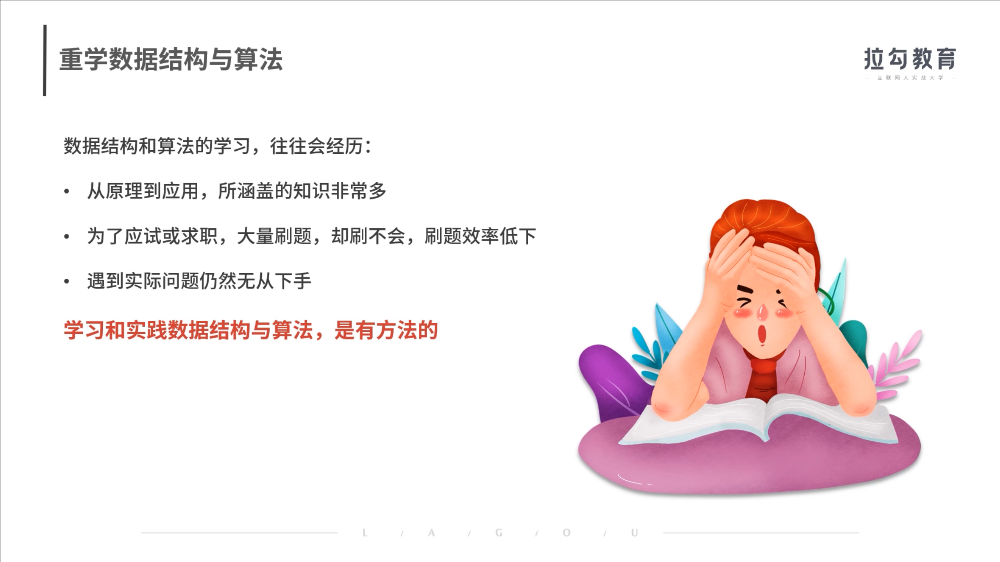

什么方法呢？

原理到应用

我花了大量的时间  没有有效的学习 效果？？？

学得慢 忘得快

为了应试 求职 大量刷题 刷不会

看着答案也不理解 

理论知识 实际问题无从下手

**其实学习和实践数据结构与算法，是有方法的。** 这正是我和拉勾教育合作设计这个课程的初衷。我希望帮助你摆脱盲目刷题与漫无目的地学习方式，更加高效地掌握数据结构与算法知识，真正掌握程序开发、代码优化的方法论，完成从掌握理论知识到解决实际问题的转变。

程序开发 代码优化 理论 实际 

### 你为什么需要重学数据结构与算法？

很多软件工程师都有进大厂的诉求，获得高薪 Offer，或者体验大厂的优质文化。但互联网的红利期早已过去，竞争也越来越激烈，“僧多粥少”的情况直接提高了面试“门槛”，诞生了“优秀工程师”的概念。

**优秀的软件工程师必须具备过硬的代码开发能力，而这就体现在你对数据结构、算法思维、代码效率优化等知识的储备上，并直接反应在你工作中解决实际问题的好坏上。**

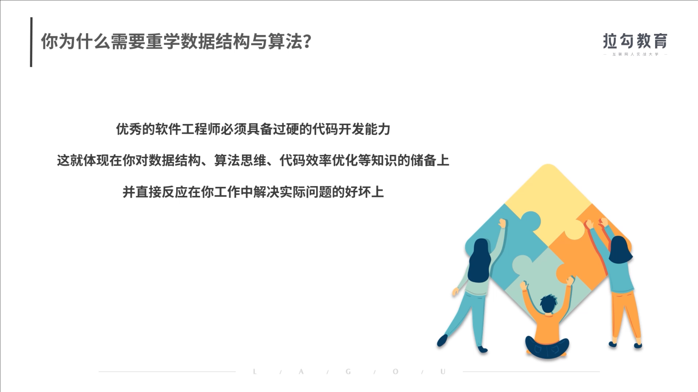

过硬的代码开发能力

体验你对数据结构 算法思维 代码效率优化

反应在你工作中解决实际问题的好坏中

比如，你要去开发某个复杂系统，如何才能围绕系统的复杂性去选择最合适的解决方案呢？一方面是对所用算法的选型，另一方面是对所用数据结构的选型，这都要求你对数据结构与算法有充分的理解和掌握。

开发某个复杂系统

围绕系统的复杂性去选择最合适的解决方案呢

但是 996、007 的互联网快节奏下，开发者普遍专注当下工作本身，并不追求极致的性能，一直在追语言，学框架，而忽视了数据结构与算法的学习和落地训练，基础知识储备不足，很难顺利做出最优的技术选择，从而导致开发的系统性能、稳定性都存在很多缺陷。

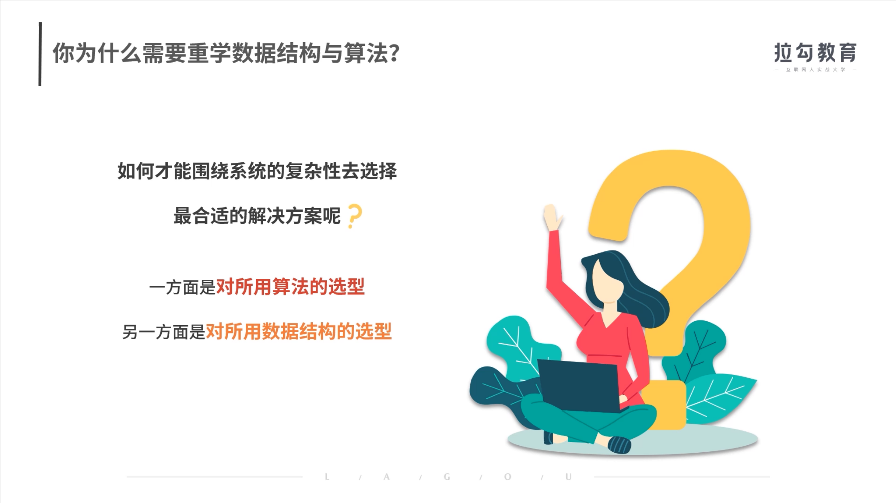

**此外，面试中都要重点考察数据结构与算法知识，这是不争的事实。** 一是因为代码能力不容易评估，而数据结构和算法的掌握情况相对可衡量；二是可以衡量工程师的基本功，以及逻辑思考能力。

我曾经有个海外名校毕业的应届生同事，他的计算机领域基础知识，尤其是数据结构和算法、机器学习、深度学习等基本功特别扎实，在面对陌生问题时往往能更快速地锁定问题，并根据已有知识去寻找解决方法。短短几个月后，他就从刚入职的小白转变为某些项目的负责人。所以说，基本功扎实的人潜力会非常大，取得业绩结果只不过是时间问题。

而据我所知，为了快速掌握数据结构与算法知识，或者提高代码能力，绝大多数的学生或候选人一定会通过公开的题库去刷题，却常常被那些千变万化的代码题搞得晕头转向、不明所以，浪费了大量时间和精力，得不偿失。

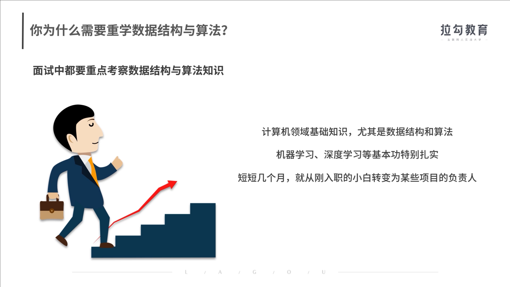

**这并不是说刷题本身有错，而是应该掌握正确的方式方法。而且刷题只是形式，更重要的是掌握算法思维和原理，并用以解决实际的编码问题。**

我经常说，真题实际上是刨除了特定场景和业务问题后，对于我们实际解决问题的方法的提炼。考核真题和刷题不是目标，还是要最终回归到能力培养上来。这也是这门课中，我要核心传达给你的内容。

刷题

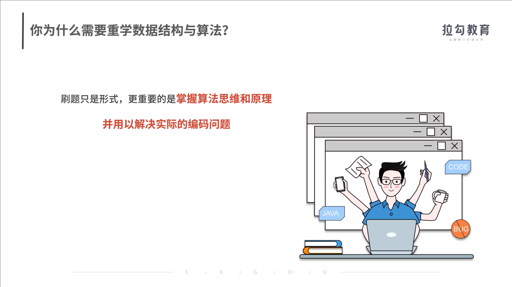

形式

掌握算法思维和原理

解决实际的编码问题

能力培养

对能力的提升

### 如何学习数据结构与算法？

我想，这可以从课程的特色与设计思路中很好地体现出来。

#### 课程特色

- **重视方法论**。我没有单纯去讲数据结构与算法，而是从程序优化的通用方法论讲起，以此为引子，让你更深刻地理解数据结构和算法思维在程序优化中的作用。
- **内容精简、重点突出**。市面上的课程，都会主打“大而全”，唯恐某些知识点没有讲到。殊不知，**高频使用的数据结构就那么几个，其他往往是这些基础知识点的不同组合与变形**，把这些牢牢掌握后，就已经足够解决你绝大多数的实际问题了。
- **学习收获快**。内容精简，且重视方法论的建设，可以快速建立程序优化的思想，并牢牢掌握知识体系中最核心、最根本的内容。我希望你快速抓住重点，迅速“所学即所得”地将知识运用到工作中去。

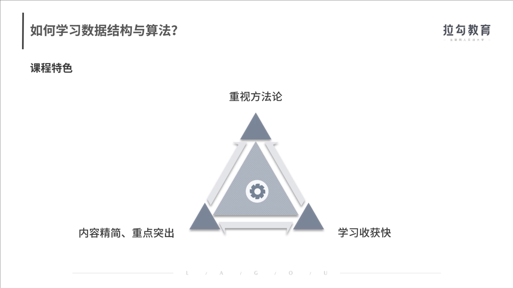

#### 课程设置

总结来说，这门课会从**方法论、基础知识、真题演练、面试技巧**这四个方面，为你提供成为优秀工程师的完整路径，具体包括以下五部分内容。

- **第一部分：方法论，也就是把“烂”代码优化为高效率代码的方法和路径，是这门课关于代码开发与优化方法框架的总纲**。代码的目标，除了完成任务，还要求把某项任务高效率地完成。
- **第二部分，在方法论的指引下，带你补充必备的数据结构基础知识**。复杂度的降低，要求对数据有更好的组织方式，这正是数据结构需要解决的问题。为了合理选择数据结构，我们需要全面分析任务对数据处理和计算的基本操作，再根据不同数据结构在这些基本操作中的优劣特点去灵活选用合适的数据结构。
- **第三部分，在方法论的指引下，带你掌握必备的算法思维，也就是用算法思考问题的逻辑和程序设计的重要思想**。在一些实际问题的解决中，需要运用一些巧妙的方法，它们不会改变数据的组织方式，但可以通过巧妙的计算方式降低代码复杂度。常见的方法，如递归、二分法、排序算法、动态规划等，会在这一部分介绍。
- **第四部分，面试真题详解，带你用前面的知识体系，去真正地解决问题**。前三部分的知识合在一起，就是解决实际问题的工具包。**面试题并非单纯考核人才的工具，更是实际业务问题高度提炼后的缩影，它能反映一个开发者的知识储备和问题解决能力**。这一部分将深入剖析高频真题的解题方法和思路。
- **第五部分，面试现场，给你一些求职时的切实建议**。很多工程师有个共性问题，那就是明明有能力，却说不出来，表现得就像是个初学者一样。这部分，我通过补充面试经验，包括现场手写代码、问题分析、面试官注重的软素质等内容，来帮你解决这个问题。

手写代码 问题分析 面试官 注重的软素质 

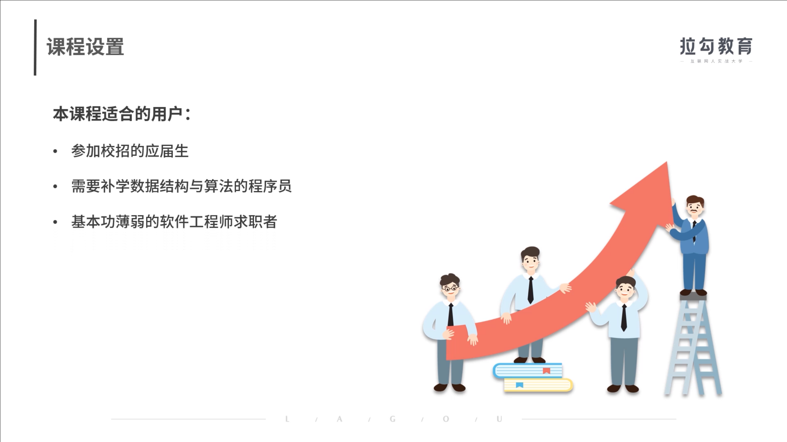

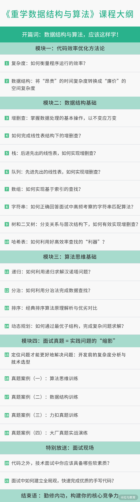

如果你是以下用户，那么本课程一定适合你：

- **参加校招的应届生**，应届生需要具备充足的知识储备，这也是面试官核心考察的内容之一。
- **需要补学数据结构与算法的程序员**，以便在工作中更好地支撑和优化业务逻辑（比如搭建在线系统的 Java 后端同学，需要不断提高和优化系统性能），以及有意转行 Python 算法或人工智能等方向的程序员。
- **基本功薄弱的软件工程师求职者**，尤其是常年挂在面试手写代码的求职者。

### 讲师寄语

数据结构与算法知识虽然庞杂、难懂，但却是编码能力的核心体现，不仅是技术面试的高频考点，更是高级 IT 工程师的必备技能，适用面非常广泛。在竞争越来越激烈的今天，我们经常说一个人的底层能力，决定了他能走多远，希望这个课程能够帮你打好基础。

最后，我想再说一句，即使你身处中小型企业，如今的精细化管理也在更多地讲究效率和质量。成为核心骨干的一个先决条件，就是准确的技术选型和扎实的代码基础，而这最基本的条件是要掌握算法思维和数据结构原理，这是代码开发和优化的方法论，是用以解决实际编码问题的精髓所在，也是这门课核心要传达的内容。

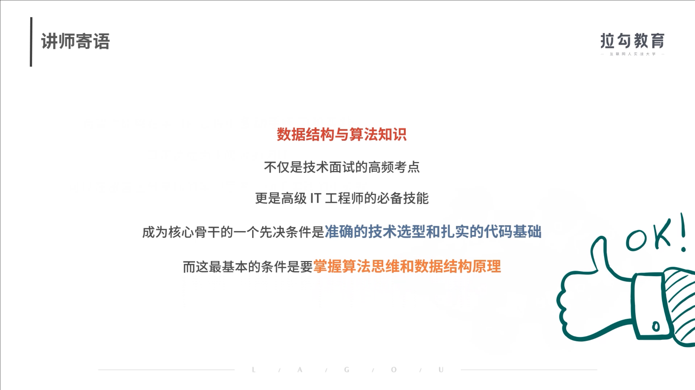

另外，被动阅读只能掌握 50%，我希望你能够在学习的过程中多动手练习和实践，真正达成内化吸收的闭环。你也可以寻找一起学习的伙伴，在留言区分享你的学习思考、动手实践的小成就，通过不同的动作来坚持学习的过程。OK，课程开始了，你准备好了吗？

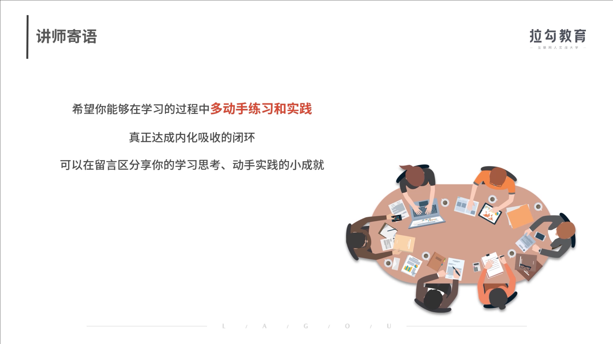

内化

 

# 精选留言

打卡 2020.05.20 我要进大厂，未来两三年的目标是快速提升自己。1年内熟悉公司项目架构，能精准定位bug存在的位置。针对框架源码进行学习，必要时运用到系统中进行优化，多实践，向高级工程师迈进。 3年内能带领新人解决问题，攻克困难，对应用的架构和底层有个人的理解。

打卡！重学一遍数据结构与算法，离大厂又进一步~

写留言

**客服

置顶

69

5月20日前，订阅用户加入社群领取独家学习资料（包括：课程PPT、辅助学习资料、源码），并额外获得：加入讲师交流群、参与社群直播【5月26日直播：90 分钟带你玩转 BAT 算法面试】。 微信识别购买成功后弹出的二维码，或者点击课程详情页的进群链接，即可获得社群福利。

**客服

置顶

16

因为课程太火爆啦，大家如果扫码有问题，添加不了小助手，请保存小助手的二维码，稍等之后再添加，耐心等待～

Zlaojie

12

打卡第一天，我要进大厂！

*旭

6

嗯，讲的很不错，这是我看过最详细易懂的数据结构与算法内容讲解，希望我能坚持下去

*浩

5

二维码扫描一直进不去，在微信里试了好多遍

**编辑回复：** 因为课程太火爆啦，大家如果扫码有问题，添加不了小助手，请保存小助手的二维码，稍等之后再添加，耐心等待～

**刚

3

打卡！重学一遍数据结构与算法，离大厂又进一步~

**先

2

**编辑回复：** 加油~

Zoctopus

2

打卡。

*旧

2

开始重学算法吧

**文

1

重学数据结构与算法+1😀

删除

**0227

1

购买了课程但是没有保存二维码怎么进群呢

**编辑回复：** 添加微信号 lagou789

hu

1

定个目标，把计算机领域基础知识学得非常扎实，从学好数据结构与算法开始，千里之行始于足下，大家一起加油

**杰

1

太棒了😀😀😀

**青

我来啦

**永

打卡

*彭

有学习时间限制吗？

**编辑回复：** 没有哦，购买后即可永久观看~

*米

打卡第一天，重学数据结构与算法

**龙坤

2020/06/04 - 打卡

**和

今年目标25k!在此明志！

**编辑回复：** 加油，会实现哒 奥利给～

**强

刚买，错过了所有😂

**编辑回复：** 现在也不晚喔 缺课件？关注拉勾教育公众号 咨询小助手获取课件 想讨论？关注 拉勾教育公众号，加入学习群和大家一起讨论学习，讲师也会在群里解答问题

**维

这部分确实比较薄弱，要赶紧补一下

*涛

打卡01天

**鹏

开始打卡，激励自己

**合段

加油，奥利给！

**星

打卡第一天，重视数据结构与算法的基础。谢谢拉钩老师宣传引导和公瑾老师细致耐心的传教！

*谦

来充电了，谢谢老师分享

**旺

前端可以学吗

**编辑回复：** 可以啊

**用户1442

不错

**奇

这个分前端个后端吗？

**编辑回复：** 不管是前端还是后端，数据结构和算法都是一名开发工程师必备的基础技能呀

**慧

希望课程真的能解决我们的数据结构与算法问题

**6478

打卡打卡

**9542

第一次学习打卡

*敏

课程更新有推送提醒吗？😇

**编辑回复：** 有的有的

hboot

留个记号

*露

介绍篇开局思路可以

**富

打卡

**辉

打卡。

*李

重新学习算法

**7798

还没毕业，过来增长一波见识😊

**润

微信群二维码扫描不成功。😕

**编辑回复：** 因为课程太火爆啦，大家如果扫码有问题，添加不了小助手，请保存小助手的二维码，稍等之后再添加，耐心等待～