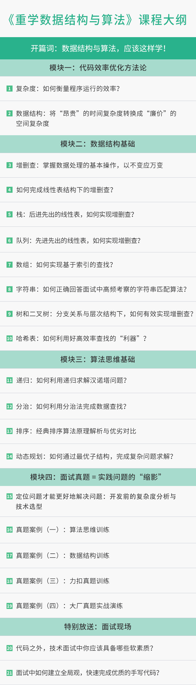

# 重学数据结构与算法

从容应对实战场景，轻松掌握刷题技巧
讲师：公瑾  中科院博士，资深算法专家

课程目录

模块三：算法思维基础

开篇词

开篇词 | 数据结构与算法，应该这样学！

模块一：代码效率优化方法论

01 | 复杂度：如何衡量程序运行的效率？

上次学习

02 | 数据结构：将“昂贵”的时间复杂度转换成“廉价”的空间复杂度

模块二：数据结构基础

03 | 增删查：掌握数据处理的基本操作,以不变应万变

04 | 如何完成线性表结构下的增删查？

05 | 栈：后进先出的线性表，如何实现增删查？

06 | 队列：先进先出的线性表，如何实现增删查？

07 | 数组：如何实现基于索引的查找？

08 | 字符串：如何正确回答面试中高频考察的字符串匹配算法？

09 | 树和二叉树：分支关系与层次结构下，如何有效实现增删查？

10 | 哈希表：如何利用好高效率查找的“利器”？

模块三：算法思维基础

11 | 递归：如何利用递归求解汉诺塔问题？

12 | 分治：如何利用分治法完成数据查找？

13 | 排序：经典排序算法原理解析与优劣对比

待更新

14 | 动态规划：如何通过最优子结构，完成复杂问题求解？

待更新

模块四：面试真题 = 实践问题的“缩影”

15 | 定位问题才能更好地解决问题：开发前的复杂度分析与技术选型

待更新

16 | 真题案例（一）：算法思维训练

待更新

17 | 真题案例（二）：数据结构训练

待更新

18 | 真题案例（三）：力扣真题训练

待更新

19 | 真题案例（四）：大厂真题实战演练

待更新

特别放送：面试现场

20 | 代码之外，技术面试中你应该具备哪些软素质？

待更新

21 | 面试中如何建立全局观，快速完成优质的手写代码？

 

课程背景

优秀的软件工程师，必须具备过硬的代码开发能力。而代码开发的能力，则体现在对数据结构、算法思维、代码效率优化等知识的储备上。

目前，数据结构与算法是国内一线互联网公司面试的必考的环节。很多程序员为了快速提升代码能力，会选择通过公开的题库刷题，但初学者在没有掌握套路时，常常会被那些千变万化的代码题搞得晕头转向、不明所以。

专栏解读

这门课会从方法论、基础知识、真题演练、面试技巧这四个方面，为你提供成为刷题技巧，掌握优秀工程师学习的完整路径。具体包括以下五部分内容：

**第一部分：把“烂”代码优化为高效率代码的方法和路径。** 代码的目标，除了完成任务，还要求把某项任务高效率地完成。

**第二部分，带你补充必备的数据结构基础知识。** 时间/空间复杂度的降低，要求对数据有超强的组织方式，这些能力需要你对数据结构的基础知识有极为深刻的理解，只有理解他们的优劣才能灵活选用合适的数据结构。

**第三部分，这部分是你学习的重点，也就是用算法思考问题的逻辑和程序设计方法。** 通过对递归、二分法、排序算法等介绍，教你一些不会改变数据的组织方式，就可以用巧妙的方法计算代码复杂度。

**第四部分，侧重在 BAT 高频面试真题详解。**这一部分，带你运用前面所学来深入剖析高频真题的解题方法和思路，为你的大厂面试助力。 

**第五部分，面试现场，** 给你求职时的切实建议。很多工程师有个共性问题，那就是明明有能力，却说不出来，表现得就像是个初学者一样。这部分，我通过补充面试经验，包括现场手写代码、问题分析、面试官注重的软素质等内容，来帮你解决这个问题。

课程讲师

公瑾

中科院博士，资深算法专家

国内首批从事机器学习和数据挖掘的工程师，拥有深厚的一线代码开发经验，对数据结构、算法思想有多年研究和深入理解，热衷于知识分享和技能输出。

课程大纲

00:00 重学数据结构与算法

精选留言
*豪
置顶
right-icon
82
一个顺序结构的代码，时间复杂度是 O(1)。
二分查找，或者更通用地说是采用分而治之的二分策略，时间复杂度都是 O(logn)。这个我们会在后续课程讲到。
一个简单的 for 循环，时间复杂度是 O(n)。
两个顺序执行的 for 循环，时间复杂度是 O(n)+O(n)=O(2n)，其实也是 O(n)。
两个嵌套的 for 循环，时间复杂度是 O(n²)。
这个👆🏻总结很重要
**客服
置顶
right-icon
52
5月20日前，订阅用户加入社群领取独家学习资料（包括：课程PPT、辅助学习资料、源码），并额外获得：加入讲师交流群、参与社群直播【5月26日直播：90 分钟带你玩转 BAT 算法面试】。 微信识别购买成功后弹出的二维码，或者点击课程详情页的进群链接，即可获得社群福利。
cobra
置顶
right-icon
47
😂那些年挂的科，总是要还的
编辑回复： 我还是曾经那个少年
**5026
置顶
right-icon
21
写的很好，很容易理解，希望加快更新速度
**客服
置顶
right-icon
14
因为课程太火爆啦，大家如果扫码有问题，添加不了小助手，请保存小助手的二维码，稍等之后再添加，耐心等待～
*迪
置顶
right-icon
9
逻辑清晰，举例恰当，感觉课程下来，可以重构我对数据结构和算法的理解，老师语速适中，普通话标准，爱了爱了😍😍😍
*军
right-icon
19
看到链表的快慢指针查找方式,突然就高潮了,😀
*东
right-icon
17
讲的很好，思路清晰
**6510
right-icon
13
看到练习题，我满脑子想的都是用空格split，然后倒序输出，哈哈😄
**6061
right-icon
12
老师讲的结合实际情况，没有堆概念干讲理论。动画做的很生动，能结合生活中的场景与理论印证。有些总结让我之前模糊的思路一下子清晰了，给老师点赞（｡ò ∀ ó｡）
*鑫
right-icon
11
第一
老师总结的很到位，站在巨人的肩膀上看世界  果然很清晰  很多东西其实自己知道 但是老师梳理一遍之后 更清晰了
**生
right-icon
10
工作时写了两层for循环被老员工嘲笑了，还是要引入map
**磊
right-icon
9
感觉思路很清晰
Zlaojie
right-icon
8
打卡第一天，我要进大厂！
*飞
right-icon
7
请问老师 例子2中第一个循环从字典获取当前子母已出现的次数算不算一种隐式循环
讲师回复： 不算，这是利用了哈希表的优势，时间复杂度是O1
*旭
right-icon
6
嗯，讲的很不错，这是我看过最详细易懂的数据结构与算法内容讲解，希望我能坚持下去
**初
right-icon
5
1. 看了下开篇，还不错讲的算细的，总结的也比较合理。
2. 关于时间空间复杂度的常数级，只要记住当与输入的数据量无关时，就是O(1)，无论改代码片段执行了几亿次。
3. 时间复杂度虽然有优劣，但在不是说平方级的算法就一定比线性级的算法要慢，这里主要是体现在超大数据量的时候，小数据量的时候不但差距很小，还有可能结果是相反的。

*浩
right-icon
5
二维码扫描一直进不去，在微信里试了好多遍
编辑回复： 因为课程太火爆啦，大家如果扫码有问题，添加不了小助手，请保存小助手的二维码，稍等之后再添加，耐心等待～
**用户
right-icon
4
翻转字符串中的每个单词，实现如下：
ans = input()
s = ans.split(" ")
for i in range(len(s)-1,-1,-1):
	print(s[i],end=" ")
这个题我在面试做过
**军
right-icon
4
上面有位朋友反馈说：例1里的说法“ 当出现右括号时，出栈。并且判断当前右括号，和被出栈的左括号是否是互相匹配的一对。”好像有笔误。被出栈的是右括号不是做括号😂
其实这不是作者笔误，因为入栈的只有左括号，当一次遇到右括号时，就执行出栈操作了，这时出栈的元素就是最后一个压栈的左括号。
编辑回复： 小编给你点赞～