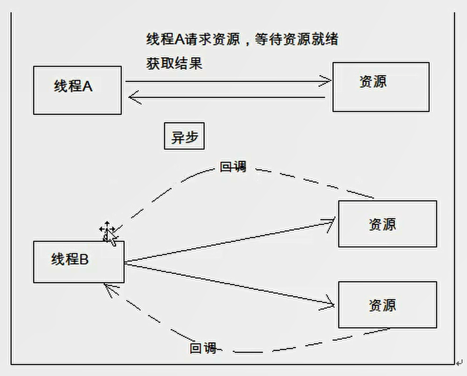
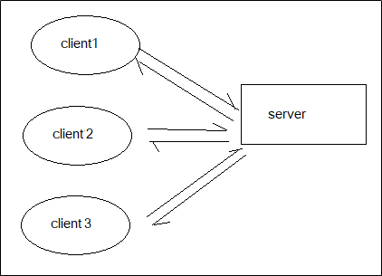
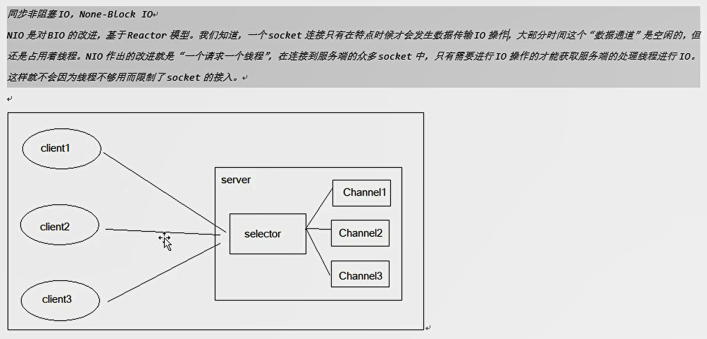
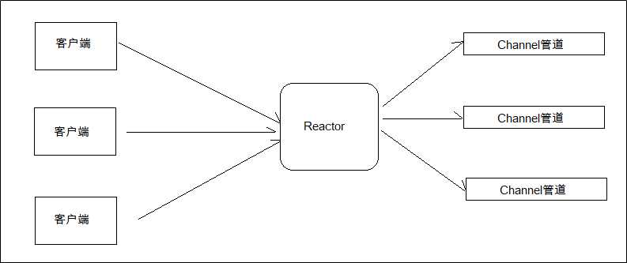
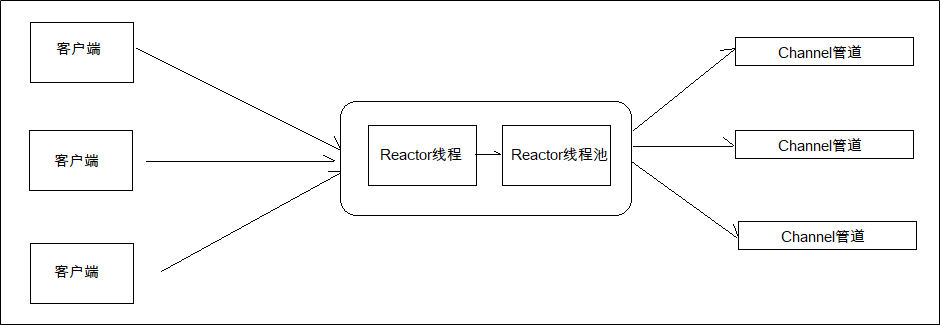
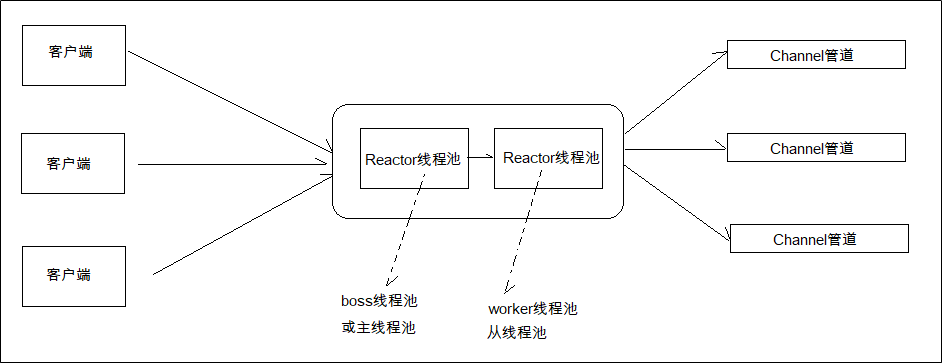

# 基于Netty网络编程的项目实战课程


# 项目介绍

好友

聊天 


Netty消息服务  


Netty


App

登录  注册  

聊天的快照


通讯录

添加好友

发起一个好友的请求

基本消息


有一个

HiChat


建立了一个好友列表

一个消息


UI   App前端

后端 SpringBoot    + Netty  + Mybatis


# Netty介绍与相关基础知识

阻塞

非阻塞

NIO  BIO AIO？？？

构建项目

## Netty介绍

Java原生编写  非常困难


*Netty**是由JBOSS**提供的一个java**开源框架。Netty**提供异步的、事件驱动的网络应用程序框架和工具，用以快速开发高性能、高可靠性的网络服务器和客户端程序。*

JBOSS  Java开源框架  异步的 事件驱动 

网络应用程序框架和工具  快速开发高性能 高可靠性 网络服务器和客户端程序


*也就是说，Netty* *是一个基于NIO**的客户、服务器端编程框架，使用Netty* *可以确保你快速和简单的开发出一个网络应用，例如实现了某种协议的客户、服务端应用。Netty**相当于简化和流线化了网络应用的编程开发过程，例如：基于TCP**和UDP**的socket**服务开发。*

基于NIO 客户 服务器端编程框架 

快速和简单的开发一个网络应用

简化和流程化了网络应用的编程开发过程

基于TCP和UDP的Socket服务开发

*“快速”和“简单”并不用产生维护性或性能上的问题。Netty* *是一个吸收了多种协议（包括FTP**、SMTP**、HTTP**等各种二进制文本协议）的实现经验，并经过相当精心设计的项目。最终，Netty* *成功的找到了一种方式，在保证易于开发的同时还保证了其应用的性能，稳定性和伸缩性。*


快速和简单  不用产生维护性或性能上的问题


事件驱动   


同步  异步  

（1）  Netty提供了简单易用的API

（2）  基于事件驱动的编程方式来编写网络通信程序

（3）  更高的吞吐量

（4）  学习难度低


应用场景

JavaEE Dubbo

Apache Storm  

## BIO、NIO、AIO介绍与区别

阻塞与非阻塞

主要指的是访问IO的线程是否会阻塞  或者 说是等待

线程访问资源 该资源是否准备就绪 xu就绪的一种处理方法


访问IO的线程是否会阻塞 或者 说是等待

线程访问资源  该资源是否准备就绪的一种处理方法


阻塞 zu se


线程A  线程A会等待资源就绪 再去执行其他操作  资源

线程B  线程B不再等待资源是否就绪  资源


没有就绪  线程A就会一直等待  知道就绪以后   效率低点

 

线程B    隔一段时间  线程就去  再来 

线程B不再等待资源是否相等  资源 资源 资源 

其他的操作 


同步和异步

处理完  才结果  同步

不会一直等待 处理完再去处理 异步

你处理完了 发起一个回调  我再去处理 




回调 


同步  和  异步  

处理完了发布一个结果

线程   可以先干其他事情   资源搞定 发一个回调就可以了


BIO

**BIO**

同步阻塞IO，Block IO，IO操作时会阻塞线程，并发处理能力低。
我们熟知的Socket编程就是BIO，一个socket连接一个处理线程（这个线程负责这个Socket连接的一系列数据传输操作）。阻塞的原因在于：操作系统允许的线程数量是有限的，多个socket申请与服务端建立连接时，服务端不能提供相应数量的处理线程，没有分配到处理线程的连接就会阻塞等待或被拒绝。



一个socket连接一个处理线程  

线程数量有限的

同步阻塞IO  Block  IO

IO操作时会阻塞线程 并发处理能力低


我们熟悉Socket编程就是BIO 


特别多的请求

**NIO**

同步非阻塞IO，None-Block IO
NIO是对BIO的改进，基于Reactor模型。我们知道，一个socket连接只有在特点时候才会发生数据传输IO操作，大部分时间这个“数据通道”是空闲的，但还是占用着线程。NIO作出的改进就是“一个请求一个线程”，在连接到服务端的众多socket中，只有需要进行IO操作的才能获取服务端的处理线程进行IO。这样就不会因为线程不够用而限制了socket的接入。


NIO

同步非阻塞  None-Block IO 




 

**AIO****（NIO 2.0****）**

异步非阻塞IO
这种IO模型是由操作系统先完成了客户端请求处理再通知服务器去启动线程进行处理。AIO也称NIO2.0，在JDK7开始支持。

1.4 NIO  AIO 1.7


BIO 上厕所  一直等待  时不时看下

NIO 上厕所   看下 等待玩玩手机  打打游戏

AIO 上厕所  厕所一定功能 这个厕所 通知 过来上厕所吧


## Netty Reactor模型


2.3	Netty Reactor模型 - 单线程模型、多线程模型、主从多线程模型介绍

2.3.1	单线程模型

用户发起IO请求到Reactor线程
Ractor线程将用户的IO请求放入到通道，然后再进行后续处理
处理完成后，Reactor线程重新获得控制权，继续其他客户端的处理

这种模型一个时间点只有一个任务在执行，这个任务执行完了，再去执行下一个任务。
1.	但单线程的Reactor模型每一个用户事件都在一个线程中执行：
2.	性能有极限，不能处理成百上千的事件
3.	当负荷达到一定程度时，性能将会下降
4.	某一个事件处理器发生故障，不能继续处理其他事件

用户发起IO请求到Reactor线程　




2.3.2	Reactor多线程模型

Reactor多线程模型是由一组NIO线程来处理IO操作（之前是单个线程），所以在请求处理上会比上一中模型效率更高，可以处理更多的客户端请求。

这种模式使用多个线程执行多个任务，任务可以同时执行



但是如果并发仍然很大，Reactor仍然无法处理大量的客户端请求

2.3.3	Reactor主从多线程模型

这种线程模型是Netty推荐使用的线程模型
这种模型适用于高并发场景，一组线程池接收请求，一组线程池处理IO。



两组线程池

主  从 线程池


接待  洗脚  服务


大量用户  

来了  接待  找一个人继续


一组批量接待  一组批量服务 

主从多线程模型


2.4	Netty - 基于web socket简单聊天DEMO实现


后端编写

导入依赖

```xml
    <build>
        <plugins>
            <plugin>
                <groupId>org.apache.maven.plugins</groupId>
                <artifactId>maven-compiler-plugin</artifactId>
                <version>3.1</version>
                <configuration>
                    <target>1.8</target>
                    <source>1.8</source>
                </configuration>
            </plugin>
        </plugins>
    </build>
 <dependencies>
        <dependency>
            <groupId>io.netty</groupId>
            <artifactId>netty-all</artifactId>
            <version>4.1.15.Final</version>
        </dependency>
    </dependencies>


```

编写Netty Server

```java
public class WebsocketServer {
    public static void main(String[] args) throws InterruptedException {
        // 初始化主线程池（boss线程池）
        NioEventLoopGroup mainGroup = new NioEventLoopGroup();
        // 初始化从线程池(worker线程池)
        NioEventLoopGroup subGroup = new NioEventLoopGroup();

        try {
            // 创建服务器启动器
            ServerBootstrap b = new ServerBootstrap();

            // 指定使用主线程池和从线程池
            b.group(mainGroup, subGroup)
                    // 指定使用Nio通道类型
                    .channel(NioServerSocketChannel.class)
                    // 指定通道初始化器加载通道处理器
                    .childHandler(new WsServerInitializer());

            // 绑定端口号启动服务器，并等待服务器启动
            // ChannelFuture是Netty的回调消息
            ChannelFuture future = b.bind(9090).sync();
            // 等待服务器socket关闭
            future.channel().closeFuture().sync();
        } finally {
            // 优雅关闭boos线程池和worker线程池
            mainGroup.shutdownGracefully();
            subGroup.shutdownGracefully();
        }
    }
}

```

编写通道初始化器

```java
public class WsServerInitializer extends ChannelInitializer<SocketChannel> {
    @Override
    protected void initChannel(SocketChannel ch) throws Exception {
        ChannelPipeline pipeline = ch.pipeline();

        // ------------------
        // 用于支持Http协议

        // websocket基于http协议，需要有http的编解码器
        pipeline.addLast(new HttpServerCodec());
        // 对写大数据流的支持
        pipeline.addLast(new ChunkedWriteHandler());
        // 添加对HTTP请求和响应的聚合器:只要使用Netty进行Http编程都需要使用
        // 对HttpMessage进行聚合，聚合成FullHttpRequest或者FullHttpResponse
        // 在netty编程中都会使用到Handler
        pipeline.addLast(new HttpObjectAggregator(1024 * 64));


        // ---------支持Web Socket -----------------

        // websocket服务器处理的协议，用于指定给客户端连接访问的路由: /ws
        // 本handler会帮你处理一些握手动作: handshaking(close, ping, pong) ping + pong = 心跳
        // 对于websocket来讲，都是以frames进行传输的，不同的数据类型对应的frames也不同
        pipeline.addLast(new WebSocketServerProtocolHandler("/ws"));

        // 添加自定义的handler
        pipeline.addLast(new ChatHandler());
    }
}

```

编写处理消息的ChannelHandler

```java
/**
 * 处理消息的handler
 * TextWebSocketFrame: 在netty中，是用于为websocket专门处理文本的对象，frame是消息的载体
 */
public class ChatHandler extends SimpleChannelInboundHandler<TextWebSocketFrame> {

    // 用于记录和管理所有客户端的Channel
    private static ChannelGroup clients = new DefaultChannelGroup(GlobalEventExecutor.INSTANCE);

    @Override
    protected void channelRead0(ChannelHandlerContext ctx, TextWebSocketFrame msg) throws Exception {
        // 获取从客户端传输过来的消息
        String text = msg.text();
        System.out.println("接收到的数据:" + text);

        // 将接收到消息发送到所有客户端
        for(Channel channel : clients) {
            // 注意所有的websocket数据都应该以TextWebSocketFrame进行封装
            channel.writeAndFlush(new TextWebSocketFrame("[服务器接收到消息:]"
                    + LocalDateTime.now() + ",消息为:" + text));
        }
    }

    /**
     * 当客户端连接服务端之后（打开连接）
     * 获取客户端的channel，并且放入到ChannelGroup中去进行管理
     * @param ctx
     * @throws Exception
     */
    @Override
    public void handlerAdded(ChannelHandlerContext ctx) throws Exception {
        // 将channel添加到客户端
        clients.add(ctx.channel());
    }

    @Override
    public void handlerRemoved(ChannelHandlerContext ctx) throws Exception {
        // 当触发handlerRemoved，ChannelGroup会自动移除对应客户端的channel
        //clients.remove(ctx.channel());

        // asLongText()——唯一的ID
        // asShortText()——短ID（有可能会重复)
        System.out.println("客户端断开, channel对应的长id为:" + ctx.channel().id().asLongText());
        System.out.println("客户端断开, channel对应的短id为:" + ctx.channel().id().asShortText());
    }
}

```

2.5	websocket以及前端代码编写

WebSocket protocol 是HTML5一种新的协议。它实现了浏览器与服务器全双工通信(full-duplex)。一开始的握手需要借助HTTP请求完成。Websocket是应用层第七层上的一个应用层协议，它必须依赖 HTTP 协议进行一次握手，握手成功后，数据就直接从 TCP 通道传输，与 HTTP 无关了。

**前端编写**


```html
<!DOCTYPE html>
<html>
   <head>
      <meta charset="UTF-8">
      <title></title>
   </head>
   <body>
      <div>发送消息</div>
      <input type="text" id="msgContent" />
      <input type="button" value="点击发送" onclick="CHAT.chat()"/>
      
      <div>接收消息:</div>
      <div id="recMsg" style="background-color: gainsboro;"></div>
      
      <script type="application/javascript">
         window.CHAT = {
            socket: null,
            init: function() {
               // 判断浏览器是否支持websocket
               if(window.WebSocket) {
                  // 支持WebScoekt
                  // 连接创建socket，注意要添加ws后缀
                  CHAT.socket = new WebSocket("ws://127.0.0.1:9001/ws");
                  CHAT.socket.onopen = function() {
                     console.log("连接建立成功");
                  };
                  
                  CHAT.socket.onclose = function() {
                     console.log("连接关闭")
                  };
                  
                  CHAT.socket.onerror = function() {
                     console.log("发生错误");
                  };
                  
                  CHAT.socket.onmessage = function(e) {
                     console.log("接收到消息:" + e.data);
                     var recMsg = document.getElementById("recMsg");
                     var html = recMsg.innerHTML;
                     recMsg.innerHTML = html + "<br/>" + e.data;
                  };
                  
               }
               else {
                  alert("浏览器不支持websocket协议");
               }
            },
            chat: function() {
               var msg = document.getElementById("msgContent");
               CHAT.socket.send(msg.value);
            }
         }
         
         CHAT.init();
      </script>
   </body>
</html>

```

2.6	MUI、HTML5+、HBuilder介绍

MUI介绍

http://dev.dcloud.net.cn/mui/
MUI是一个轻量级的前端框架。MUI以iOS平台UI为基础，补充部分Android平台特有的UI控件。MUI不依赖任何第三方JS库，压缩后的JS和CSS文件仅有100+K和60+K，可以根据自己的需要，自定义去下载对应的模块。并且MUI编写的前端，可以打包成APK和IPA安装文件，在手机端运行。也就是，编写一套代码，就可以在Android、IOS下运行。

API地址：http://dev.dcloud.net.cn/mui/ui/


H5+

H5+提供了对HTML5的增强，提供了40WAPI给程序员使用。使用H5+ API可以轻松开发二维码扫描、摄像头、地图位置、消息推送等功能


API地址：http://www.html5plus.org/doc/zh_cn/accelerometer.html#

HBuilder

Webstorm

notepad

Hbuilder实在是有点太垃圾了，建议使用微软出品的VSCODE。

前端开发工具。本次项目所有的前端使用HBuilder开发。在项目开发完后，也会使用HBuilder来进行打包Android/IOS的安装包。
http://www.dcloud.io/


创建MUI移动App项目


页面创建，添加组件

```
<header class="mui-bar mui-bar-nav">
			<h1 class="mui-title">登录页面</h1>
		</header>
		<div class="mui-content">
			<form class="mui-input-group">
				<div class="mui-input-row">
					<label>用户名</label>
					<input type="text" class="mui-input-clear" placeholder="请输入用户名">
				</div>
				<div class="mui-input-row">
					<label>密码</label>
					<input type="password" class="mui-input-password" placeholder="请输入密码">
				</div>
				<div class="mui-button-row">
					<button type="button" class="mui-btn mui-btn-primary">确认</button>
					<button type="button" class="mui-btn mui-btn-danger">取消</button>
				</div>
			</form>
		</div>

```

http://dev.dcloud.net.cn/mui/ui/#accordion

2.7.2	获取页面元素/添加点击事件

获取页面元素

```
	mui.plusReady(function() {
				// 使用document.getElementById来获取Input组件数据
				var username = document.getElementById("username");
				var password = document.getElementById("password");
				var confirm = document.getElementById("confirm");
				
				// 绑定事件
				confirm.addEventListener("tap", function() {
					alert("按下按钮");
				});
			});

```

批量绑定页面元素的点击事件

```
mui(".mui-table-view").on('tap','.mui-table-view-cell',function(){

});

```


# 构建项目

# 业务开发 用户注册 登录 个人信息

# 业务开发 发现页面与通讯录

# 业务开发 聊天业务

# 业务开发 心跳机制