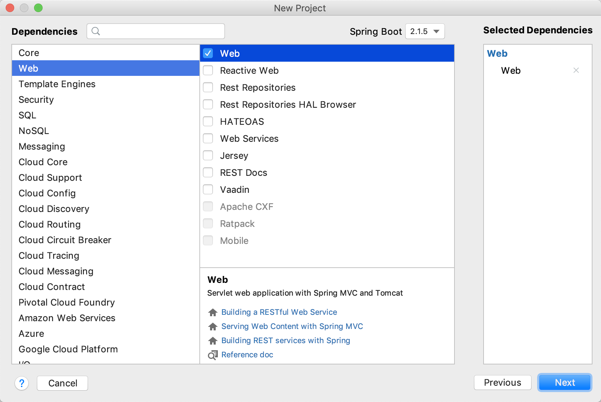

**06 就想买个电脑追剧，别扯什么四核独显-Starters**


# 06 就想买个电脑追剧，别扯什么四核独显-Starters

更新时间：2020-05-26 11:41:58

鹅1


合理安排时间，就等于节约时间。

——培根


# 1. 讲个故事

long long ago，有多 long 呢？long 到那个时候买电脑都是去中关村。那个时候非常流行 DIY ，电脑爱好者们整天研究怎么攒（cuán）机器。通过自己选 CPU 、主板、显卡、硬盘、电源等硬件，搭配出一个自己中意的配置。这种高度定制化让电脑发烧友们玩得不亦乐乎。但是对于小白用户来说，这种方式无疑技术门槛太高了。什么多少核的 CPU ，显卡的位宽是多少，内存是 DDR 多少代，硬盘接口是 PCIE 还是 SATA 完全搞不懂。所以后来那些电脑整机厂商慢慢占据了主流市场，而攒机只活跃在小众的发烧友当中。

攒机 

电脑整机厂商   来了  

# 2. 主角登场

可能你要问了，攒电脑跟我们今天要学习的内容有什么关系呢？不光有关系，可以说这完全就是同一件事。Java 因为有强大的第三方库能帮助我们完成一切我们想要做的事情，但这些库实在是太多了，完成同一个功能会有好多种方案可选，而同一个方案又会有 N 多个版本。经常会碰到 jar 不兼容的情况。就好像买了一个自己心仪已久的显卡，却发现跟自己主板的接口不兼容，体会一下这种感觉。Maven 在一定程度上缓解了这个问题，Spring Boot 在 Maven 的基础上进行了更进一步的改进，那就是我们今天的主角—— Starters。

Maven  

库太多  方案可选   同一个方案 又会有N 多个版本 

jar不兼容的情况  

Starters 是何方神圣呢？下面我们一起看一下 Spring 的官方介绍：

> Starters are a set of convenient dependency descriptors that you can include in your application. You get a one-stop shop for all the Spring and related technologies that you need without having to hunt through sample code and copy-paste loads of dependency descriptors.

啥？看不懂？简单翻译一下：

Starters 是一组方便的依赖描述，你可以将其添加到你的应用中。你将会得到 Spring 以及相关技术的一站式服务，使你不必再将那些样板代码复制来粘贴去。

这次中文是看懂了，但好像还是不够形象和具体。能不能再具体的说明一下呢？我们接着往下看。


# 3. 我就想创建个Web工程

现在电脑产业已经相当成熟了，就算是完全小白的用户也可以很轻松的在某宝、某东上挑选到自己想要的设备。普通用户根本不需要关心电脑用的什么处理器、几代的内存，有哪些黑科技。只需要知道自己想买了干什么就够了，有图有真相：


在没有 Starters 之前，假如我们想要使用 Spring 创建一个 Web 应用，那我们可能需要做以下操作：

1. 收集 Web 应用所需的 Jar 包
2. 将这些 Jar 包的坐标添加到 Maven 依赖里
3. 可能有些 Jar 包的版本需要更换
4. 可能某个 Jar 包的某个版本跟另外一个 Jar 包的这个版本不兼容
5. 反复的调试直到可以正常运行

我们就想创建一个最简单的 Web 应用，就需要这么琐碎的步骤，而且过程中还会遇到各种意想不到的坑。这对一个新手（我们叫他小白吧）来说，这好比一堵无形的墙，将其拒之门外。假如这个小白非常坚强（不单单是一个小白，还是一个小强），熬过了这一关。并且他是一个非常善于总结的人，将这些繁杂的步骤整理记录到自己的知识库中，以后每次使用直接 Ctrl + C & Ctrl + V。

这样看来能够借助自己的经验和积累已经很好了，效率很高了。但是小白每创建一个 Web 应用，都要在复制粘贴上花费时间。小白的一生可能会创建几百几千个 Web 应用，重复劳动的时间加起来可能会有几个小时或者几天。孤立起来看，貌似也不是什么大不了的事情。但是我们想一下，全世界有多少个小白（程序员）呢？几百万？几千万？差不多，那么这些人加起来就是几千万天，换算成年的话，也会有几万、几十万年了。

还好，Pivotal（Spring）是一家有追求有使命的公司，他们一直在优化，一直在致力于提升效率。于是我们有了 Starters，那么有了 Starters 以后的 Spring Boot 可以让我们有多轻松呢？还记得《万事开头难？Spring Boot 表示不服！》中添加依赖那一步吗？不记得了？就知道你不记得，给你搬过来了，看下图：




哇！被震惊到了有没有！这不就跟在某宝买电脑一样吗！我只需要告诉 Spring Boot 我想要一个 Web 工程，其他的就不用管了！我们勾选了 `Web` 对应 pom 文件就生成了如下配置：

```xml
<dependency>
  <groupId>org.springframework.boot</groupId>
  <artifactId>spring-boot-starter-web</artifactId>
</dependency>
```

仅仅这一个配置项，我们要创建一个 Web 应用需要的准备工作，Spring Boot 就全部帮我们完成了。我们可以找到 IDEA 的 `Project` 窗口，展开 `External Libraries` 就可以看到我们所有的依赖：


我滴妈鸭！一个 Web 工程就需要这么多（去掉 Tomcat 和 Spring Boot 之后依然还有几十个），这还没加上数据库、缓存、消息队列… 不敢想了，这要是自己一个个去添加还不疯掉吗？我就是想创建一个 Web 应用而已，就给我设置这么大的障碍，真是过分。还好万能的 Spring 帮我们把体力活都干完了，于是我们可以非常轻松的去专注我们要实现的功能，而不是把大部分精力花在这些事情上面。这里我们只简单介绍了众多 Starters 中的一个，你可以去官网查看 Spring Boot 都为我们提供了哪些 [Starters](https://docs.spring.io/spring-boot/docs/2.1.5.RELEASE/reference/htmlsingle/#using-boot-starter)。


体力活都干完了   非常轻松的去专注我们要实现的功能 

# 4. Starters 的设计理念

版本兼容 

Starters 会按照功能（如：JPA、Redis、mail、test 等）把所有相关的依赖都给包含进来，不需要开发者自己去手动添加，大大提升了开发效率。不仅如此，这些 Starters 都是经过官方测试过的，所以也不会出现版本不兼容等令人抓狂的问题。

Spring 这种将依赖按照不同的功能进行组合打包的设计思路，其实跟咱们上面那个买电脑的例子是异曲同工。都是根据消费者（开发者）的不同需求，搭配出不同的套餐。电脑有上网本、游戏本、影音娱乐本等等，Starters 有 Redis、JPA、JDBC 等等。思想都是一样的。

消费者 开发者 的不同需求  搭配出不同的套餐 

使用 Starters 和自己手动添加 Jar 包依赖从程序运行机制上来说，并没有任何不同。Spring 是将这些基础设施整合好，我们可以直接拿过来用。把脏活累活都自己干，而让用户去专注于自己的需求，这样才是好的产品。其实这种设计思想在软件设计中非常普遍，最简单的，我们经常用到的 Apache 的 common 工具包，里面封装了很多对于字符串、集合的常用操作。还有我们开发必不可少的插件——Lombok，无一不是这种设计思想的践行者。

了解了这些思想以后，对于我们在工作、学习中的帮助也是非常大的。我们知道了什么样的软件才称得上是好软件，什么样的设计才能配得上是优秀的设计。希望大家在学习一门技术的时候，多多留心在技术之上的设计思想，并多多尝试将这些优秀的思想应用于自己的软件之中。

你觉得麻烦的事情  我来完成

环境配置   

Docker  

# 5. 总结

OK，今天我们学习了 Spring Boot 的 Starters ，由买电脑攒机器引出创建工程添加依赖。一方面想跟你介绍一下 Spring Boot 的起步依赖；另一方面是想告诉你将学习与日常生活打通，学起来你会更加的轻松愉快。希望在以后的学习中你也可以将自己学的东西跟日常生活结合起来，去发现其中的乐趣无穷，也希望你能回来跟我分享一下，下次见！

日常生活结合起来 

创建工程添加依赖  起步依赖  想告诉你将学习与日常生活打通  学起来你会更加的轻松愉快 


[05 YAML与Spring Boot更配哦~](http://www.imooc.com/read/75/article/1801)[07 懒惰使人进步-Spring Boot集成Swagger2](http://www.imooc.com/read/75/article/1803)

精选留言 5

欢迎在这里发表留言，作者筛选后可公开显示

- [花草木香丶忆花间相见](http://www.imooc.com/u/2594360/articles)

  好家伙，看标题，差点要跳过这个章节了，幸亏多看了一眼，不然亏死了。

   0

  回复

  2020-07-04

  - [刘水镜](http://www.imooc.com/u/8840839/articles)

    回复[花草木香丶忆花间相见](http://www.imooc.com/u/2594360/articles)

    嗯，以后标题要更稳重一些了。

    回复

    7天前

- [东明先森](http://www.imooc.com/u/4852618/articles)

  刚看还比较迷糊，怎么扯到电脑上了，看到后面才发现要讲解的内容，但是因为有前面例子后面看起来也很容易理解

   2

  回复

  2020-05-23

  - [刘水镜](http://www.imooc.com/u/8840839/articles)

    回复[东明先森](http://www.imooc.com/u/4852618/articles)

    技术来源于生活，也要融入生活。

    回复

    2020-05-25 20:41:20

- [慕神4103587](http://www.imooc.com/u/8954818/articles)

  以前只是代码搬运工，对于各种配置文件只会CV大法，却不知其意，希望从这个课程开始不仅要知其然，还要做到知其所以然，再次给刘老师一个好评

   1

  回复

  2020-05-18

  - [刘水镜](http://www.imooc.com/u/8840839/articles)

    回复[慕神4103587](http://www.imooc.com/u/8954818/articles)

    加油加油！

    回复

    2020-05-19 21:31:11

- [慕田峪5261915](http://www.imooc.com/u/7544895/articles)

  深入浅出，解答了很多初学者的疑惑！

   0

  回复

  2020-05-01

  - [刘水镜](http://www.imooc.com/u/8840839/articles)

    回复[慕田峪5261915](http://www.imooc.com/u/7544895/articles)

    感谢支持

    回复

    2020-05-12 14:00:17

- [慕粉18210162816](http://www.imooc.com/u/3617905/articles)

  没想到冷冰冰的知识融入生活竟变得这么有温度，?

   3

  回复

  2020-04-26

  - [刘水镜](http://www.imooc.com/u/8840839/articles)

    回复[慕粉18210162816](http://www.imooc.com/u/3617905/articles)

    知识来源于生活，也要归于生活。

    回复

    2020-04-26 20:41:13

  - [amilu](http://www.imooc.com/u/192706/articles)

    回复

    [刘水镜](http://www.imooc.com/u/8840839/articles)

    说得好！

    回复

    2020-04-28 11:50:13

 

千学不如一看，千看不如一练

 