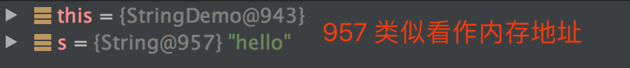

**02 String、Long 源码解析和面试题**

[TOC]


# 02 String、Long 源码解析和面试题

更新时间：2019-11-26 09:44:44


劳动是一切知识的源泉。

——陶铸


## 引导语

String 和 Long 大家都很熟悉，本小节主要结合实际的工作场景，来一起看下 String 和 Long 的底层源码实现，看看平时我们使用时，有无需要注意的点，总结一下这些 API 都适用于哪些场景。

String Long底层源码实现

## 1 String

需要注意的点  这些API都适用于哪些场景 

String  不变性  

### 1.1 不变性

类值一旦被初始化就不能被改变了 如果被修改，将会是新的类

repositoty

我们常常听人说，HashMap 的 key 建议使用不可变类，比如说 String 这种不可变类。这里说的不可变指的是类值一旦被初始化，就不能再被改变了，如果被修改，将会是新的类，我们写个 demo 来演示一下。

HashMap的key建议使用不可变类 比如说Spring这种不可变类

这里说的不可变指的是类值一旦被初始化

就不能再被改变了  如果被修改  将会是新的类  


引用指向了新的String 内存地址已经被修改 

```java
String s ="hello";
s ="world";
```

从代码上来看，s 的值好像被修改了，但从 debug 的日志来看，其实是 s 的内存地址已经被修改了，也就说 s =“world” 这个看似简单的赋值，其实已经把 s 的引用指向了新的 String，debug 的截图显示内存地址已经被修改，两张截图如下：

我们从源码上查看一下原因：

```java
public final class String
    implements java.io.Serializable, Comparable<String>, CharSequence {
    /** The value is used for character storage. */
    private final char value[];
}    
```

我们可以看出来两点：

1. String 被 final 修饰，说明 String 类绝不可能被继承了，也就是说任何对 String 的操作方法，都不会被继承覆写；

   String被final修饰 说明String类绝不可能被继承了 

   final对类来说 不会被继承覆写  

2. String 中保存数据的是一个 char 的数组 value。我们发现 value 也是被 final 修饰的，也就是说 value 一旦被赋值，内存地址是绝对无法修改的，而且 value 的权限是 private 的，外部绝对访问不到，String 也没有开放出可以对 value 进行赋值的方法，所以说 value 一旦产生，内存地址就根本无法被修改。

   ```java
   /** The value is used for character storage. */
       private final char value[];
   ```

   priave  final  修饰 value 类的字段  权限是private的  

   其他的也访问不了呀  而且String也没有开发出可以对value进行赋值 修改的方法 就是不可更改的  内存地址无法被修改    

   

以上两点就是 String 不变性的原因，充分利用了 final 关键字的特性，如果你自定义类时，希望也是不可变的，也可以模仿 String 的这两点操作。

final关键字的特性   final + private + 不提供赋值的方法

我来设置 一个 不变性的类 对其他的某个字段就是这样的 

因为 String 具有不变性，所以 String 的大多数操作方法，都会返回新的 String，如下面这种写法是不对的：

```java
String str ="hello world !!";
// 这种写法是替换不掉的，必须接受 replace 方法返回的参数才行，这样才行：str = str.replace("l","dd");
str.replace("l","dd");
```

String具有不变性    都会返回新的String 


### 1.2 字符串乱码

乱码问题  

加密 解密  

二进制转换操作时 字符串乱码

没有强制规定文件编码 不同的环境默认的文件编码不一致导致的


在生活中，我们经常碰到这样的场景，进行二进制转化操作时，本地测试的都没有问题，到其它环境机器上时，有时会出现字符串乱码的情况，这个主要是因为在二进制转化操作时，并没有强制规定文件编码，而不同的环境默认的文件编码不一致导致的。

我们也写了一个 demo 来模仿一下字符串乱码：

```java
String str  ="nihao 你好 喬亂";
// 字符串转化成 byte 数组
byte[] bytes = str.getBytes("ISO-8859-1");
// byte 数组转化成字符串
String s2 = new String(bytes);
log.info(s2);
// 结果打印为：
nihao ?? ??
```

打印的结果为？？，这就是常见的乱码表现形式。这时候有同学说，是不是我把代码修改成 `String s2 = new String(bytes,"ISO-8859-1");` 就可以了？这是不行的。主要是因为 ISO-8859-1 这种编码对中文的支持有限，导致中文会显示乱码。唯一的解决办法，就是在所有需要用到编码的地方，都统一使用 UTF-8，对于 String 来说，getBytes 和 new String 两个方法都会使用到编码，我们把这两处的编码替换成 UTF-8 后，打印出的结果就正常了。

乱码 问题

```java
 @Test
  public void testGibberish() throws UnsupportedEncodingException {
    String str  ="nihao 你好 喬亂";
    byte[] bytes = str.getBytes("ISO-8859-1");
    String s2 = new String(bytes,"ISO-8859-1");
    log.info(s2);//nihao ?? ??

    //utf-8好呀   
    String str2  ="nihao 你好 喬亂";
    byte[] bytes2 = str2.getBytes("utf-8");
    String s3 = new String(bytes2,"utf-8");
    log.info(s3);// nihao 你好 喬亂
  }
```


### 1.3 首字母大小写

如果我们的项目被 Spring 托管的话，有时候我们会通过 `applicationContext.getBean(className);` 这种方式得到 SpringBean，这时 className 必须是要满足首字母小写的，除了该场景，在反射场景下面，我们也经常要使类属性的首字母小写，这时候我们一般都会这么做：

首字母小写 截取 

name.substring(0,1)

`name.substring(0, 1).toLowerCase() + name.substring(1);`，使用 substring 方法，该方法主要是为了截取字符串连续的一部分，substring 有两个方法：

1. `public String substring(int beginIndex, int endIndex)` beginIndex：开始位置，endIndex：结束位置；
2. `public String substring(int beginIndex)`beginIndex：开始位置，结束位置为文本末尾。

substring 方法的底层使用的是字符数组范围截取的方法 ：`Arrays.copyOfRange(字符数组, 开始位置, 结束位置);` 从字符数组中进行一段范围的拷贝。

相反的，如果要修改成首字母大写，只需要修改成 `name.substring(0, 1).toUpperCase() + name.substring(1)` 即可。


```java
 @Test
  public void test2(){
    String name = "LiuAwen";
    name = name.substring(0,1).toLowerCase() + name.substring(1);
    System.out.println(name);//liuAwen
  }
```


### 1.4 相等判断

我们判断相等有两种办法，equals 和 equalsIgnoreCase。

我们判断相等 equals 

后者判断相等时，会忽略大小写，近期看见一些面试题在问：如果让你写判断两个 String 相等的逻辑，应该如何写，我们来一起看下 equals 的源码，整理一下思路：

```java
public boolean equals(Object anObject) {
    // 判断内存地址是否相同
    if (this == anObject) {
        return true;
    }
    // 待比较的对象是否是 String，如果不是 String，直接返回不相等
    if (anObject instanceof String) {
        String anotherString = (String)anObject;
        int n = value.length;
        // 两个字符串的长度是否相等，不等则直接返回不相等
        if (n == anotherString.value.length) {
            char v1[] = value;
            char v2[] = anotherString.value;
            int i = 0;
            // 依次比较每个字符是否相等，若有一个不等，直接返回不相等
            while (n-- != 0) {
                if (v1[i] != v2[i])
                    return false;
                i++;
            }
            return true;
        }
    }
    return false;
}
```

从 equals 的源码可以看出，逻辑非常清晰，完全是根据 String 底层的结构来编写出相等的代码。这也提供了一种思路给我们：如果有人问如何判断两者是否相等时，我们可以从两者的底层结构出发，这样可以迅速想到一种贴合实际的思路和方法，就像 String 底层的数据结构是 char 的数组一样，判断相等时，就挨个比较 char 数组中的字符是否相等即可。


### 1.5 替换、删除

替换在工作中也经常使用，有 replace 替换所有字符、replaceAll 批量替换字符串、replaceFirst 替换遇到的第一个字符串三种场景。

其中在使用 replace 时需要注意，replace 有两个方法，一个入参是 char，一个入参是 String，前者表示替换所有字符，如：`name.replace('a','b')`，后者表示替换所有字符串，如：`name.replace("a","b")`，两者就是单引号和多引号的区别。

需要注意的是， replace 并不只是替换一个，是替换所有匹配到的字符或字符串哦。

写了一个 demo 演示一下三种场景：

```java
public void testReplace(){
  String str ="hello word !!";
  log.info("替换之前 :{}",str);
  str = str.replace('l','d');
  log.info("替换所有字符 :{}",str);
  str = str.replaceAll("d","l");
  log.info("替换全部 :{}",str);
  str = str.replaceFirst("l","");
  log.info("替换第一个 l :{}",str);
}
//输出的结果是：
替换之前 :hello word !!
替换所有字符 :heddo word !!
替换全部 :hello worl !!
替换第一个 :helo worl !!
```

当然我们想要删除某些字符，也可以使用 replace 方法，把想删除的字符替换成 “” 即可。


### 1.6 拆分和合并

拆分我们使用 split 方法，该方法有两个入参数。第一个参数是我们拆分的标准字符，第二个参数是一个 int 值，叫 limit，来限制我们需要拆分成几个元素。如果 limit 比实际能拆分的个数小，按照 limit 的个数进行拆分，我们演示一个 demo：

```java
String s ="boo:and:foo";
// 我们对 s 进行了各种拆分，演示的代码和结果是：
s.split(":") 结果:["boo","and","foo"]
s.split(":",2) 结果:["boo","and:foo"]
s.split(":",5) 结果:["boo","and","foo"]
s.split(":",-2) 结果:["boo","and","foo"]
s.split("o") 结果:["b","",":and:f"]
s.split("o",2) 结果:["b","o:and:foo"]
```

从演示的结果来看，limit 对拆分的结果，是具有限制作用的，还有就是拆分结果里面不会出现被拆分的字段。

那如果字符串里面有一些空值呢，拆分的结果如下：

```java
String a =",a,,b,";
a.split(",") 结果:["","a","","b"]
```

从拆分结果中，我们可以看到，空值是拆分不掉的，仍然成为结果数组的一员，如果我们想删除空值，只能自己拿到结果后再做操作，但 Guava（Google 开源的技术工具） 提供了一些可靠的工具类，可以帮助我们快速去掉空值，如下：

```java
String a =",a, ,  b  c ,";
// Splitter 是 Guava 提供的 API 
List<String> list = Splitter.on(',')
    .trimResults()// 去掉空格
    .omitEmptyStrings()// 去掉空值
    .splitToList(a);
log.info("Guava 去掉空格的分割方法：{}",JSON.toJSONString(list));
// 打印出的结果为：
["a","b  c"]
```

从打印的结果中，可以看到去掉了空格和空值，这正是我们工作中常常期望的结果，所以推荐使用 Guava 的 API 对字符串进行分割。

合并我们使用 join 方法，此方法是静态的，我们可以直接使用。方法有两个入参，参数一是合并的分隔符，参数二是合并的数据源，数据源支持数组和 List，在使用的时候，我们发现有两个不太方便的地方：

1. 不支持依次 join 多个字符串，比如我们想依次 join 字符串 s 和 s1，如果你这么写的话 `String.join(",",s).join(",",s1)` 最后得到的是 s1 的值，第一次 join 的值被第二次 join 覆盖了；
2. 如果 join 的是一个 List，无法自动过滤掉 null 值。

而 Guava 正好提供了 API，解决上述问题，我们来演示一下：

```java
// 依次 join 多个字符串，Joiner 是 Guava 提供的 API
Joiner joiner = Joiner.on(",").skipNulls();
String result = joiner.join("hello",null,"china");
log.info("依次 join 多个字符串:{}",result);

List<String> list = Lists.newArrayList(new String[]{"hello","china",null});
log.info("自动删除 list 中空值:{}",joiner.join(list));
// 输出的结果为；
依次 join 多个字符串:hello,china
自动删除 list 中空值:hello,china
```

从结果中，我们可以看到 Guava 不仅仅支持多个字符串的合并，还帮助我们去掉了 List 中的空值，这就是我们在工作中常常需要得到的结果。


## 2 Long


### 2.1 缓存

Long 最被我们关注的就是 Long 的缓存问题，Long 自己实现了一种缓存机制，缓存了从 -128 到 127 内的所有 Long 值，如果是这个范围内的 Long 值，就不会初始化，而是从缓存中拿，缓存初始化源码如下：

```java
private static class LongCache {
    private LongCache(){}
    // 缓存，范围从 -128 到 127，+1 是因为有个 0
    static final Long cache[] = new Long[-(-128) + 127 + 1];

    // 容器初始化时，进行加载
    static {
        // 缓存 Long 值，注意这里是 i - 128 ，所以再拿的时候就需要 + 128
        for(int i = 0; i < cache.length; i++)
            cache[i] = new Long(i - 128);
    }
}
```


## 3 面试题


### 3.1 为什么使用 Long 时，大家推荐多使用 valueOf 方法，少使用 parseLong 方法

答：因为 Long 本身有缓存机制，缓存了 -128 到 127 范围内的 Long，valueOf 方法会从缓存中去拿值，如果命中缓存，会减少资源的开销，parseLong 方法就没有这个机制。


### 3.2 如何解决 String 乱码的问题

答：乱码的问题的根源主要是两个：字符集不支持复杂汉字、二进制进行转化时字符集不匹配，所以在 String 乱码时我们可以这么做：

1. 所有可以指定字符集的地方强制指定字符集，比如 new String 和 getBytes 这两个地方；
2. 我们应该使用 UTF-8 这种能完整支持复杂汉字的字符集。


### 3.3 为什么大家都说 String 是不可变的

答：主要是因为 String 和保存数据的 char 数组，都被 final 关键字所修饰，所以是不可变的，具体细节描述可以参考上文。


### 3.4 String 一些常用操作问题，如问如何分割、合并、替换、删除、截取等等问题

答：这些都属于问 String 的基本操作题目，考察我们平时对 String 的使用熟练程度，可以参考上文。


## 总结

String 和 Long 在我们工作中使用频率很高，在面试的过程中，考官也喜欢问一些关于实际操作的问题，来考察我们的使用熟练度，所以本文中列举的一些 demo，大家可以试试手，完整的代码可以去 GitHub 上面去拉取。

[01 开篇词：为什么学习本专栏](https://www.imooc.com/read/47/article/843)[03 Java 常用关键字理解](https://www.imooc.com/read/47/article/845)

精选留言 61

欢迎在这里发表留言，作者筛选后可公开显示

- [慕设计8381056](https://www.imooc.com/u/6899954/articles)

  我看了好多遍Long.valueOf(String)和Long.parseLong(String）这两个方法，valueOf底层还是调用了parseLong，先将String转换成了long，然后再去判断是否命中缓存，然后返回的是封装类型Long。parseLong是直接返回基本类型long。 我不明白你那个面试题多用valueOf的意义，我做过大数据，基本上数据处理都是用的基本类型在处理，你用封装类型处理还要经过拆箱和装箱，这在数据量大的情况下，是非常不推荐的一种做法(我还因此被前辈怼过)。

   0

  回复

  4天前

- [慕村6418685](https://www.imooc.com/u/8135530/articles)

  老师，不可变带来的好处是线程安全吗？

   0

  回复

  4天前

- [慕仙9492324](https://www.imooc.com/u/6462788/articles)

  final修饰的char数组元素是可变的，主要还是private吧

   0

  回复

  2020-02-16

  - [qq_一剑西来_0](https://www.imooc.com/u/6588569/articles)

    回复[慕仙9492324](https://www.imooc.com/u/6462788/articles)

    final修饰的数组本质上是一个引用，引用不可变，但引用指向的数组可变

    回复

    5天前

- [yan羽](https://www.imooc.com/u/6765180/articles)

  replace替换所有字符和替换字符串有什么区别

   2

  回复

  2020-02-04

- [Vince_Lin](https://www.imooc.com/u/7200978/articles)

  replace和replaceAll的区别好像有点模凌两可，区别是什么

   1

  回复

  2020-02-02

  - [火星活那么](https://www.imooc.com/u/2064493/articles)

    回复[Vince_Lin](https://www.imooc.com/u/7200978/articles)

    replaceAll支持正则吧<br />

    回复

    2020-02-03 12:20:48

- [calvinsheng](https://www.imooc.com/u/4470896/articles)

  源码地址是？

   0

  回复

  2020-01-31

  - [初一](https://www.imooc.com/u/7789740/articles)

    回复[calvinsheng](https://www.imooc.com/u/4470896/articles)

    同学你好，源码地址在第四节。

    回复

    2020-02-01 13:26:47

- [慕仔7214391](https://www.imooc.com/u/7485583/articles)

  int n = value.length;老师，这个equald源码 的这个value哪里来的

   1

  回复

  2019-12-14

  - [文贺](https://www.imooc.com/u/8062574/articles)

    回复[慕仔7214391](https://www.imooc.com/u/7485583/articles)

    value 是 String 的 char 的数组哈。

    回复

    2019-12-16 17:33:38

- [走出深坑_爬出井底](https://www.imooc.com/u/8009711/articles)

  1.6拆分与合并： String的join方法无法连续使用，是因为join方法处理的是参数elements中的元素吧，是将elements中的元素合并，他与调用join方法的字符串对象本身是没有任何关系的。

   1

  回复

  2019-12-04

- [甜树果子二号](https://www.imooc.com/u/6374311/articles)

  面试题3.1有疑惑 public static long parseLong(String s);// 返回值是基本数据类型 public static Long valueOf(String s);// 返回的是包装类型 一个方法返回的是基本数据类型，一个方法返回的是包装类型，只基于缓存命中这方面，这两者应该没有可比性吧，真的需要包装类型，也会自动装箱，一样的会命中缓存

   0

  回复

  2019-11-27

  - [qq_阿福_7](https://www.imooc.com/u/5868692/articles)

    回复[甜树果子二号](https://www.imooc.com/u/6374311/articles)

    同意你的说法。 字数你妹。

    回复

    2019-12-04 11:21:01

  - [慕神9346227](https://www.imooc.com/u/7808597/articles)

    回复[甜树果子二号](https://www.imooc.com/u/6374311/articles)

    大概是如果要String-&gt;Long的转换用valueOf会多一个取缓存的优化，这是对装箱的优化

    回复

    2019-12-06 15:56:31

- [Lxiaoyueyue](https://www.imooc.com/u/2850611/articles)

  感觉讲重写equals方法，就只讲了String对象的实现，写的很针对。没有拓展重写equals方法应该遵循的规律，更期待的解答的是，在什么情况用getclass，在什么情况下用instanceof 检测两个对象是否属于同一个类

   0

  回复

  2019-11-25

  - [文贺](https://www.imooc.com/u/8062574/articles)

    回复[Lxiaoyueyue](https://www.imooc.com/u/2850611/articles)

    equals 覆写的规律和文中 String 中的 equals 方法一样，我是希望通过 String 的 equals 方法给大家提供一种覆写的思路。比如说给你一个对象 DTO，如何覆写 equals 呢？我们可以使用 idea 自带生成 equals 的方法，也可以把依次判断 DTO 的各个属性。至于你说的 getClass，instanceof 属于另外的内容哈，可能不能符合每个读者的口味了。

    回复

    2019-11-30 13:40:59

  - [朱瘦肉](https://www.imooc.com/u/6115724/articles)

    回复[Lxiaoyueyue](https://www.imooc.com/u/2850611/articles)

    instanceof 要求操作对象与类有继承关系

    回复

    2020-02-05 22:26:03

- [窗下有梧桐](https://www.imooc.com/u/5101563/articles)

  我觉得String的不变性不在于final修饰，因为char[]不属于基本类型，即引用不能改变，但是引用地址的值可以改变。String的不变性应该是由于它底层的源码导致的，每次给String的引用赋值其实是创建了一个新的对象。不知道我这么理解有没有问题

   1

  回复

  2019-11-21

  - [文贺](https://www.imooc.com/u/8062574/articles)

    回复[窗下有梧桐](https://www.imooc.com/u/5101563/articles)

    你可以用反证法想一下，如果 String 没有 final 修饰会怎么样？

    回复

    2019-11-23 16:37:07

- [qq_慕哥2339582](https://www.imooc.com/u/8238904/articles)

  老师，我想问一下，Integer a = new Integer（12）创建了几个对象，它在内存中的存储过程是怎样的

   0

  回复

  2019-11-02

  - [古卷](https://www.imooc.com/u/6402661/articles)

    回复[qq_慕哥2339582](https://www.imooc.com/u/8238904/articles)

    目测是创建一个对象。

    回复

    2019-11-04 11:56:39

  - [xiaobaicaisss](https://www.imooc.com/u/6700857/articles)

    回复[qq_慕哥2339582](https://www.imooc.com/u/8238904/articles)

    目测是2个，一个在堆，一个在栈

    回复

    2019-11-20 19:45:15

- [qq_慕哥2339582](https://www.imooc.com/u/8238904/articles)

  老师你好，string的常量池和long的缓冲池作用是一样的吗？也能起到一个存储的作用

   0

  回复

  2019-11-01

  - [文贺](https://www.imooc.com/u/8062574/articles)

    回复[qq_慕哥2339582](https://www.imooc.com/u/8238904/articles)

    同学你好，是的，原理是一样的，但是底层实现机制不同，都是起一个缓存的作用。

    回复

    2019-11-04 10:12:58

- [ChangleAmazing](https://www.imooc.com/u/5585445/articles)

  老师，还是想问下 Long.valueOf(String) 和 Long.parseLong(String) 的问题。 源码中 valueOf 实际上也是调用了 parseLong 之后才走缓存的吧。即使是有缓存，应该会比 parseLong 更慢啊。

   3

  回复

  2019-10-30

  - [漫步轻飘](https://www.imooc.com/u/5257587/articles)

    回复[ChangleAmazing](https://www.imooc.com/u/5585445/articles)

    他说的Long valueO(long)

    回复

    6天前

- [凉话](https://www.imooc.com/u/1243425/articles)

  static final Long cache[] = new Long[-(-128) + 127 + 1]; 老师这一句话怎么就直接缓存了256个数字

   0

  回复

  2019-10-30

  - [文贺](https://www.imooc.com/u/8062574/articles)

    回复[凉话](https://www.imooc.com/u/1243425/articles)

    同学你好，cache.length 是 256 哈，其实下面还有代码的： static { for(int i = 0; i &lt; cache.length; i++) cache[i] = new Long(i - 128); }

    回复

    2019-10-31 10:50:59

  - [xiaobaicaisss](https://www.imooc.com/u/6700857/articles)

    回复[凉话](https://www.imooc.com/u/1243425/articles)

    下面那个静态代码块才是真正的缓存数据，类加载的时候静态代码块也运行，相当于把一个游泳池蓄上水，这里就相当于把那个数组里-128到127装满

    回复

    2019-11-20 19:52:09

- [studyHardHard](https://www.imooc.com/u/8081759/articles)

  如果有StringBuffet和StringBuilder，立马下单

   0

  回复

  2019-10-18

  - [文贺](https://www.imooc.com/u/8062574/articles)

    回复[studyHardHard](https://www.imooc.com/u/8081759/articles)

    同学你好，没有的哈，StringBuffer 和 StringBuilder 比较简单，一个面试题就能说完，难以写成一篇文档，所以我们没有放进课程内容里面，不过有问题可以留言互相交流哈。

    回复

    2019-10-19 10:49:53

  - [studyHardHard](https://www.imooc.com/u/8081759/articles)

    回复

    [文贺](https://www.imooc.com/u/8062574/articles)

    不简单吧，比如3者底层数组的扩容机制有什么不同，线程是否安全，各自的使用场景。还有就是关于String常量池， + 在进行String操作时底层调用的是StringBuilder。还有就是经典的求一段字符串操作创建了几个对象的问题，这些有的写的

    回复

    2019-10-20 09:21:21

  - [慕仙6328494](https://www.imooc.com/u/7573629/articles)

    回复[studyHardHard](https://www.imooc.com/u/8081759/articles)

    ……你这个也太基础了吧 如果真写这些，这个专栏感觉档次下降一般

    回复

    2019-11-20 18:55:24

- [Blue_Fish0323](https://www.imooc.com/u/1110029/articles)

  intern 这个方法的分析没有嘛？还是在后面有？

   0

  回复

  2019-10-17

  - [文贺](https://www.imooc.com/u/8062574/articles)

    回复[Blue_Fish0323](https://www.imooc.com/u/1110029/articles)

    同学你好，没有的哈，intern 方法几乎没有看见有同学实际用过，但有问题可以交流。

    回复

    2019-10-19 10:47:51

- [yaDONGgua](https://www.imooc.com/u/6769190/articles)

  String s ="boo:and:foo"; s.split("o")； 运行结果是["b","",":and:f"] 为什么不是["b","",":and:f",""] ??

   0

  回复

  2019-10-16

  - [文贺](https://www.imooc.com/u/8062574/articles)

    回复[yaDONGgua](https://www.imooc.com/u/6769190/articles)

    同学你好，在源码的 2361 while 代码处删除了“”。

    回复

    2019-10-17 19:13:26

- [喵喵喵111](https://www.imooc.com/u/7563198/articles)

  老师，parseint缓存中有没有127啊

   0

  回复

  2019-10-10

  - [文贺](https://www.imooc.com/u/8062574/articles)

    回复[喵喵喵111](https://www.imooc.com/u/7563198/articles)

    同学你好，parseInt不走缓存哈，你应该想问Integer 缓存的范围是吧，从 -128到127，-128 和 127都包含，源码为：if (i &gt;= IntegerCache.low &amp;&amp; i &lt;= IntegerCache.high) return IntegerCache.cache[i + (-IntegerCache.low)]; IntegerCache.low 为 -128，IntegerCache.high 为 127

    回复

    2019-10-10 23:09:48

- [大胖晴](https://www.imooc.com/u/5171712/articles)

  使用split函数，去分割字符串oob:ooa:coo,以字符o分割，为啥，显示的是 "","","b:","","a:c" 老师，这里分割后，为啥前面2个连在一起的o可以展示出2个空字符串， 而中间的ooa这一块，只有一个空字符串"",而末尾coo,一个都没有呢，麻烦老师给解答下,谢谢！

   0

  回复

  2019-10-09

  - [文贺](https://www.imooc.com/u/8062574/articles)

    回复[大胖晴](https://www.imooc.com/u/5171712/articles)

    中间的“”在源码 2339 行被干掉了，最后两个“”在源码 2361 while 循环被干掉了，同学可以自己debug下哈，谢谢。

    回复

    2019-10-11 19:27:35

- [西贝小仙人](https://www.imooc.com/u/6988426/articles)

  idea怎么导入jdk源码，进行debug。然后在源码地方记录笔记

   0

  回复

  2019-10-03

  - [文贺](https://www.imooc.com/u/8062574/articles)

    回复[西贝小仙人](https://www.imooc.com/u/6988426/articles)

    同学你好，我们在 git上有 jdk源码的项目，可以直接导入到 idea 中，里面都是debug过的注释，第三节评论区应该有地址。debug 的时候，跳转的还是 jdk 的只可读源码。

    回复

    2019-10-04 11:20:29

- [Eric_余浩](https://www.imooc.com/u/3002030/articles)

  请问作者 idea 使用的是那个版本，我使用的是 2018.2.8 版本，在debug 是无法看到String 变量的哈希值。 以至于我只好使用 System.identityHashCode(Object) 来打印出 对象的内存地址。

   0

  回复

  2019-09-29

  - [文贺](https://www.imooc.com/u/8062574/articles)

    回复[Eric_余浩](https://www.imooc.com/u/3002030/articles)

    你好同学，版本号：2019.02

    回复

    2019-09-29 19:21:45

- [慕婉清3506321](https://www.imooc.com/u/7009480/articles)

  没有微信群哈老师，只有QQ呀

   0

  回复

  2019-09-29

  - [初一](https://www.imooc.com/u/7789740/articles)

    回复[慕婉清3506321](https://www.imooc.com/u/7009480/articles)

    你的微信号多少呀，我来拉你进群^-^

    回复

    2019-09-29 09:44:36

  - [孙DONG](https://www.imooc.com/u/2370644/articles)

    回复[初一](https://www.imooc.com/u/7789740/articles)

    拉我，微信号：SKD1206

    回复

    2019-11-26 23:02:09

  - [阿阿阿阿阿秀](https://www.imooc.com/u/1872429/articles)

    回复[初一](https://www.imooc.com/u/7789740/articles)

    拉我进群，谢谢。。紫薯布丁

    回复

    2020-02-06 13:10:40

- [拾灬荒灬者](https://www.imooc.com/u/5658415/articles)

  对比另外一个资料，我有一个小疑惑，string一旦被初始化，其内存地址是无法被修改的，也就是说，初始化时的内存地址指向的那个值，是确定的。即使给对象重新赋值，也是返回一个新的内存地址。问题是，那我在做两个string对象的比较时，假如内存地址不一样，就可以直接返回false,内存地址一样的时候，下面几步的判断验证是为了防止什么情况？因为string对象的底层是char[]也是用final修饰，且其权限是private没有可能被外部访问重新赋值。后面关于是否是同一类型，char[]中的值比较的目的是为了排除什么情况呢？这个地方我知道这么写更严谨，但是这个问题一直没思考清楚。

   0

  回复

  2019-09-24

  - [文贺](https://www.imooc.com/u/8062574/articles)

    回复[拾灬荒灬者](https://www.imooc.com/u/5658415/articles)

    这个不好意思哈，这个问题到底是啥，没有看懂，你可以贴出你比较纠结的代码哈。

    回复

    2019-09-25 14:10:34

  - [拾灬荒灬者](https://www.imooc.com/u/5658415/articles)

    回复

    [文贺](https://www.imooc.com/u/8062574/articles)

    equals方法判断两个string字符串是否相等。初始化之后，因为其value值是private权限，所以，无法被改变。如果两个string是一样的话，为什么要比完内存地址是否一样还继续后面的。 产生疑问的原因是：string地址是不可被修改的，虽然其value值理论上可以改变，但是string类内部没有提供修改value值的方法，内部也没有对value值进行操作。那equals方法里面比较后面对象是否一致，比较char数组中的每一个值是否相同不就没有必要了吗？所以想问问，后面的是比较是否有必要，其作对比，是为了排除哪种情况？

    回复

    2019-09-25 20:46:26

  - [文贺](https://www.imooc.com/u/8062574/articles)

    回复[拾灬荒灬者](https://www.imooc.com/u/5658415/articles)

    理解了，我最近理解问题的能力越来越差了，总结一下，你的问题是：为什么 String equals 方法里面用 == 来判断内存地址？ 猜测两个原因：1：这个是 equals 的实现规范(大概5条约定)，判断的时候先用 == 判断，再使用 instanceof 进行具体的判断，IDEA 自动帮我们生成 equals 方法就是这种规范，你可以自己自定义类，然后使用 IDEA 自动帮我们生成 equals 方法的功能，你会发现生成的equals实现就是这种思路。 2："nihao".equals("nihao") 这种写法中，两个字符串的内存地址是一样的，使用 == 即可判断。 总结：equals 实现规范 + "nihao".equals("nihao") ，你在 equals 里面去掉 == 也是木有问题的，ps：这种问题无需纠结哈。

    回复

    2019-09-26 09:31:34

  点击展开后面 3 条

- [qq_电耗子_0](https://www.imooc.com/u/2177358/articles)

  String s ="boo:and:foo"; s.split("o") 结果:["b","",":and:f"] 不明白为何boo会有""，而后面的foo没有""

   2

  回复

  2019-09-24

  - [文贺](https://www.imooc.com/u/8062574/articles)

    回复[qq_电耗子_0](https://www.imooc.com/u/2177358/articles)

    jDK 8 String 源码 2361~2362 行，有个 while 循环去掉的，同学可以自己 debug 下印象更加深刻。

    回复

    2019-09-25 14:08:00

- [和尚码代码](https://www.imooc.com/u/7388288/articles)

  这几天面试，被问到了，为什么要设计String为不可变对象

   0

  回复

  2019-09-22

  - [文贺](https://www.imooc.com/u/8062574/articles)

    回复[和尚码代码](https://www.imooc.com/u/7388288/articles)

    这个问题是没有标准答案的，只要你能说出来几点来，基本都可以过，可以从两个方面来回答以下，一个是不可变有哪些好处，第二个源码是如何实现不可变(加分)，不可变的好处：1：方便使用字符串常量池，节省开销。2：不可变避免了引用传值，是线程安全的，如何实现不可变的就是源码中提到的两点。

    回复

    2019-09-23 11:00:43

- [youngDonkey](https://www.imooc.com/u/7312824/articles)

  老师如何理解instanceof 这个关键词？

   0

  回复

  2019-09-19

  - [文贺](https://www.imooc.com/u/8062574/articles)

    回复[youngDonkey](https://www.imooc.com/u/7312824/articles)

    主要用来判断变量的类型，通常变量都是 Object，然后通过 instanceof 来判断变量的类型是否和我们想要的一致，比如判断变量o 的类型是不是 String：o instanceof String，返回的结果是布尔值，true 表示类型相同，flase 不同

    回复

    2019-09-19 19:41:59

  - [youngDonkey](https://www.imooc.com/u/7312824/articles)

    回复

    [文贺](https://www.imooc.com/u/8062574/articles)

    《JAVA核心技术一卷》中，作者认为当otherObject为检测类子类的时候，使用instanceof不但解决不了问题还有可能会招致一些麻烦，什么情况下会有这种麻烦，而您又怎么看待这个问题？

    回复

    2019-09-20 14:30:25

  - [华珠王健杰](https://www.imooc.com/u/4163033/articles)

    回复[youngDonkey](https://www.imooc.com/u/7312824/articles)

    这里这个instanceof存在的目的是为下面多态的向下转型做准备。如果不使用instanceof判断的话。可能会抛出类转换异常

    回复

    2019-09-24 17:03:57

  点击展开后面 6 条

- [weixin_南宋朝北_0](https://www.imooc.com/u/5187527/articles)

  Long.StringOf(String)再走缓存之前会先去执行parseLong方法，不应该比parseLong（String）更慢吗？ return Long.valueOf(parseLong(s, 10));

   0

  回复

  2019-09-18

  - [文贺](https://www.imooc.com/u/8062574/articles)

    回复[weixin_南宋朝北_0](https://www.imooc.com/u/5187527/articles)

    见下面运行 demo 哈，有运行示例。

    回复

    2019-09-18 20:43:50

  - [qq_知我者谓我心忧_4](https://www.imooc.com/u/5865002/articles)

    回复[weixin_南宋朝北_0](https://www.imooc.com/u/5187527/articles)

    同问，jdk10版本源码是这样写的

    回复

    2019-09-18 21:05:51

  - [qq_知我者谓我心忧_4](https://www.imooc.com/u/5865002/articles)

    回复[weixin_南宋朝北_0](https://www.imooc.com/u/5187527/articles)

    valueOf(Long l) 的源码用的是缓存，-128 - 127，但是valueOF（String s）是你说的先调用parseLong(s, 10).所以你是不是看错了

    回复

    2019-09-18 21:10:22

  点击展开后面 4 条

- [莨菽菽](https://www.imooc.com/u/4586503/articles)

  equals的源码分析那里是不是有点问题，anotherString.value是点不出来的把，因为是private修饰的，我去试着验证的时候都是报variable has private access

   0

  回复

  2019-09-17

  - [文贺](https://www.imooc.com/u/8062574/articles)

    回复[莨菽菽](https://www.imooc.com/u/4586503/articles)

    可以的哈，可以看回复中：小明同学爱思考同学的提问哈，已经回答了这个问题。

    回复

    2019-09-17 18:31:53

  - [巧合注定](https://www.imooc.com/u/7596159/articles)

    回复[莨菽菽](https://www.imooc.com/u/4586503/articles)

    这是类内部实现，可以的

    回复

    8天前

- [慕九州4198528](https://www.imooc.com/u/6543770/articles)

  问一下这个课程什么时候更新完额

   1

  回复

  2019-09-14

  - [慕九州22958251](https://www.imooc.com/u/6600521/articles)

    回复[慕九州4198528](https://www.imooc.com/u/6543770/articles)

    我也想知道什么时间能更新完成呢？

    回复

    2019-10-08 12:02:44

- [慕仰8481155](https://www.imooc.com/u/8132973/articles)

  关于parseLong与valueOf我的实验结果与老师的结论是相反的，当循环次数足够大时显示，前者总是比后者耗时短，我的循环次数是Integer最大值，并且结论与前后两者的代码位置位置无关。希望老师指正，我是不是有什么误解。

   0

  回复

  2019-09-12

  - [文贺](https://www.imooc.com/u/8062574/articles)

    回复[慕仰8481155](https://www.imooc.com/u/8132973/articles)

    一般面试官出题，都是根据源码找到一个可以问的点，然后包装一下。此处可以面试的点就是 Long 对 -128 到 127 之间的数字进行了缓存，此处缓存的区间是我们工作中经常用到的区间，所以此处优化是有范围的，验证的时候，最好也在这个区间内验证，具体的验证代码和效果可以见下面的回复。这个面试题也是经常问到的题目哦，能 get 到面试官的点就好了。

    回复

    2019-09-15 09:34:58

  - [文贺](https://www.imooc.com/u/8062574/articles)

    回复

    [文贺](https://www.imooc.com/u/8062574/articles)

    如果你的确比较纠结的话，可以 show your code，我们一起来看看。

    回复

    2019-09-15 09:56:55

- [心跳7](https://www.imooc.com/u/3417828/articles)

  写的不错

   0

  回复

  2019-09-11

  - [文贺](https://www.imooc.com/u/8062574/articles)

    回复[心跳7](https://www.imooc.com/u/3417828/articles)

    感谢支持肯定，持续努力加油中。

    回复

    2019-09-11 17:42:50

- [qq_慕设计3195642](https://www.imooc.com/u/7743713/articles)

  面试题3.1，您想说明的是一个用缓存，一个不用缓存，但是valueOf返回的Long,parseLong返回的long这两个根本就没有可比较性吧。看了您下面写的那个demo,parseLong运行的比较慢是因为它需要将string计算得到一个long类型的值，所以比较耗时，和走不走缓存没有多大关系吧。如果说是走不走缓存的应该拿 valueOf与 new Long()来比较才是合适的。

   1

  回复

  2019-09-09

  - [文贺](https://www.imooc.com/u/8062574/articles)

    回复[qq_慕设计3195642](https://www.imooc.com/u/7743713/articles)

    可以仔细看下底层实现哈，valueOf(String s) 和 parseLong(String s) 底层实现就是前者走了缓存，后者没有，两者都有字符串转化成 Long 的逻辑哈。你说的这个比较也是一个例子，但在实际工作中不常用的哈。

    回复

    2019-09-10 14:18:38

  - [hetianxing668](https://www.imooc.com/u/234785/articles)

    回复[qq_慕设计3195642](https://www.imooc.com/u/7743713/articles)

    受教了，以后多多分享类似文章。

    回复

    2019-09-11 09:20:35

  - [power_cheng4342740](https://www.imooc.com/u/4342740/articles)

    回复

    [文贺](https://www.imooc.com/u/8062574/articles)

    源码中valueOf(String)和parseLong(String)都是调用parseLong(String, int). parseLong(String)是直接将调用的结果返回, 也就是说这个地方应用了自动装箱,即调用了valueOf(long)方法, 这样看来其实parseLong(String)方法也用到了缓存. Long a = Long.parseLong("100"); Long b = Long.parseLong("100"); System.out.println(a == b); // true

    回复

    2019-09-11 10:04:30

  点击展开后面 1 条

- [呢喃北上](https://www.imooc.com/u/1880706/articles)

  老师怎么进微信群 好像只看到qq

   0

  回复

  2019-09-09

  - [初一](https://www.imooc.com/u/7789740/articles)

    回复[呢喃北上](https://www.imooc.com/u/1880706/articles)

    手机端可以进微信群的

    回复

    2019-09-09 18:35:51

  - [qq_电耗子_0](https://www.imooc.com/u/2177358/articles)

    回复[呢喃北上](https://www.imooc.com/u/1880706/articles)

    哪里有微信的扫码

    回复

    2019-09-24 17:52:29

  - [洗衣粉1](https://www.imooc.com/u/2930191/articles)

    回复[初一](https://www.imooc.com/u/7789740/articles)

    你好，手机端怎么进微信群，没找到

    回复

    2019-09-26 15:17:56

- [慕容课网](https://www.imooc.com/u/3963123/articles)

  老师可以解释下，String s = "hello" 这种字符常量直接赋值，此时的String 是怎么构造出来的吗

   0

  回复

  2019-09-08

  - [文贺](https://www.imooc.com/u/8062574/articles)

    回复[慕容课网](https://www.imooc.com/u/3963123/articles)

    在编译的时候，就已经确认了如何构造 String，理解这个可能需要一点 JVM 知识，你按照下面的步骤自己运行一下哈。 demo 代码：public final class StringDemo { private String s ="hello";@Test public void say() { System.out.println(s); }}。

    回复

    2019-09-09 14:24:11

  - [文贺](https://www.imooc.com/u/8062574/articles)

    回复

    [文贺](https://www.imooc.com/u/8062574/articles)

    然后把这个代码编译一下，找到 StringDemo.class，接着执行 ：javap -verbose StringDemo.class，然后就会出现一长串的信息，你可以找到以下几个东西： 1：Constant pool(常量池) 里面找到 hello。 2：StringDemo() 的 code 里面找到 ldc 和 putfield 两个 jvm 指令，ldc 表示从常量池拿出 hello，做入栈的操作，putfield 表示给 s 赋值。 1 和 2 完成了初始化 StringDemo 类时，对变量 s 赋值 123。 3：接着看 say() 方法里面有个 getfield 指令，表示从拿出变量 s 的值，意思是执行 say() 方法时，通过这个 jvm 指令拿到 hello 值。

    回复

    2019-09-09 14:24:20

  - [文贺](https://www.imooc.com/u/8062574/articles)

    回复

    [文贺](https://www.imooc.com/u/8062574/articles)

    总结一下： 1：hello 在编译的时候，就已经确定是放在常量池里面的。 2：String s ="hello" 赋值操作，是在类初始化的时候，通过 ldc 和 putfield 两个 jvm 指令配置完成。 3：如果想要 s 的值，通过 getfield jvm 指令完成。

    回复

    2019-09-09 14:24:27

- [慕码人1304121](https://www.imooc.com/u/8120822/articles)

  String 被 final 修饰，说明 String 类绝不可能被继承了，也就是说任何对 String 的操作方法，都不会被继承覆写；这里的覆写有没有问题，重写吧

   1

  回复

  2019-09-08

  - [文贺](https://www.imooc.com/u/8062574/articles)

    回复[慕码人1304121](https://www.imooc.com/u/8120822/articles)

    没有问题哦，重写和覆写是同一个意思哦，都是 override 的意思哈，只是叫法不同。

    回复

    2019-09-08 10:02:42

  - [丶zhanwei](https://www.imooc.com/u/6088796/articles)

    回复

    [文贺](https://www.imooc.com/u/8062574/articles)

    0我0额07我哦0是0叵测XP0好

    回复

    2019-09-09 08:33:21

  - [慕勒9548534](https://www.imooc.com/u/7592385/articles)

    回复[丶zhanwei](https://www.imooc.com/u/6088796/articles)

    这是没用utf-8么

    回复

    2019-09-09 18:54:13

- [慕瓜306993](https://www.imooc.com/u/6835837/articles)

  关于面试第一题的 使用包装类Long 更多的使用valueOf而不是使用parseLong 的应用场景 是什么？ valueOf是为了得到基本数据类型，parseLong是为了得到包装类 不应该按具体需求来选择吗？

   1

  回复

  2019-09-06

  - [文贺](https://www.imooc.com/u/8062574/articles)

    回复[慕瓜306993](https://www.imooc.com/u/6835837/articles)

    文中说的很清楚了哈，主要是根据性能优先哈。

    回复

    2019-09-06 12:47:58

- [最怕认真](https://www.imooc.com/u/1899708/articles)

  不可变，还是理解不够透彻，希望再多说明一下，多画图，值改变和引用地址改变，傻傻分不清啊

   0

  回复

  2019-09-06

  - [文贺](https://www.imooc.com/u/8062574/articles)

    回复[最怕认真](https://www.imooc.com/u/1899708/articles)

    好的哈，可以进微信群，今天上午群里面还讨论这个问题。

    回复

    2019-09-06 12:48:48

  - [音殿](https://www.imooc.com/u/4730658/articles)

    回复

    [文贺](https://www.imooc.com/u/8062574/articles)

    老师 微信群在哪呀?我怎么找不到

    回复

    2019-10-09 11:42:32

  - [文贺](https://www.imooc.com/u/8062574/articles)

    回复[音殿](https://www.imooc.com/u/4730658/articles)

    可以加慕课网小姐姐微信：Mukewang666 回复进群口令（四位“字母+数字”组合），即可进群，具体进群口令在那里，你可以问这个微信的小姐姐，谢谢。

    回复

    2019-10-09 13:10:43

- [剑轩](https://www.imooc.com/u/1268748/articles)

  嗯？String为参数时还是使用valueOf，long为参数又没有意义（自动拆装箱）。 public static Long valueOf(String s) throws NumberFormatException { return Long.valueOf(parseLong(s, 10)); }

   0

  回复

  2019-09-05

  - [文贺](https://www.imooc.com/u/8062574/articles)

    回复[剑轩](https://www.imooc.com/u/1268748/articles)

    没说入参是long哦，是使用 Long 类时，我们尽量多用 valueOf 方法哦。

    回复

    2019-09-05 16:56:18

- [又帅又潇洒](https://www.imooc.com/u/6393421/articles)

  String和其value[]为什么要用final修饰？ String可以说是Java项目中使用频率最高的类不为过，综合考虑到资源性能方面和安全角度等，使用final修饰。比如，在创建String时Jvm会先去常量池寻找已有的缓冲常量，如果String没有被final修饰，这个时候被修改了其值，则可能会导致不可预料的问题。

   1

  回复

  2019-09-04

  - [文贺](https://www.imooc.com/u/8062574/articles)

    回复[又帅又潇洒](https://www.imooc.com/u/6393421/articles)

    是的，你说的很棒，给你点赞。

    回复

    2019-09-05 16:52:35

- [慕盖茨3494964](https://www.imooc.com/u/6964549/articles)

  方法 Long.valueOf（long类型入参）会从cache中拿。 而Long.valueOf（string类型入参）不会。

   0

  回复

  2019-09-04

  - [文贺](https://www.imooc.com/u/8062574/articles)

    回复[慕盖茨3494964](https://www.imooc.com/u/6964549/articles)

    两者都会走，入参String 的底层实现：Long.valueOf(parseLong(s, 10));最终还是会走缓存。

    回复

    2019-09-04 14:10:00

- [慕盖茨3494964](https://www.imooc.com/u/6964549/articles)

  s.split("o") 结果:["b","",":and:f"] 这结果。。。确定正确吗？

   0

  回复

  2019-09-04

  - [文贺](https://www.imooc.com/u/8062574/articles)

    回复[慕盖茨3494964](https://www.imooc.com/u/6964549/articles)

    正确的，你本地跑一边就知道了哈。

    回复

    2019-09-04 14:09:06

- [旧念何挽](https://www.imooc.com/u/274480/articles)

  源码的Github地址可以发送一下吗？

   0

  回复

  2019-09-03

  - [初一](https://www.imooc.com/u/7789740/articles)

    回复[旧念何挽](https://www.imooc.com/u/274480/articles)

    我在第三节文章里有发过链接，你可以去看下

    回复

    2019-09-03 14:26:51

  - [初一](https://www.imooc.com/u/7789740/articles)

    回复[旧念何挽](https://www.imooc.com/u/274480/articles)

    第三节的评论里哟~~

    回复

    2019-09-03 14:28:01

  - [ComputerMan](https://www.imooc.com/u/6578339/articles)

    回复[初一](https://www.imooc.com/u/7789740/articles)

    你好，请问源码的地址是多少呀？

    回复

    2019-12-19 17:10:39

- [鹏飞天下](https://www.imooc.com/u/1010756/articles)

  老师在String里面的equals方法中，有这样 一个判断 n == anotherString.value.length ，我想问antherString他是一个字符串，他的value是私有的，为什么在这里可以直接引用，原理是啥原因呢？

   0

  回复

  2019-09-03

  - [慕粉TYJ](https://www.imooc.com/u/3172107/articles)

    回复[鹏飞天下](https://www.imooc.com/u/1010756/articles)

    java的private修饰符只是类级别的，并不是对象级别的。换句话说。同一个类的不同对象，在类的作用域里是可以互相访问彼此的私有属性的

    回复

    2019-09-03 12:59:40

  - [莨菽菽](https://www.imooc.com/u/4586503/articles)

    回复[慕粉TYJ](https://www.imooc.com/u/3172107/articles)

    你自己写了就知道了，value也是private修饰的，你点value出来报variable has private access

    回复

    2019-09-17 15:10:19

  - [慕粉TYJ](https://www.imooc.com/u/3172107/articles)

    回复[莨菽菽](https://www.imooc.com/u/4586503/articles)

    啥？回复错人了吧同学

    回复

    2019-09-17 15:48:27

- [慕设计6098684](https://www.imooc.com/u/6524787/articles)

  感觉深度不够啊，说实话有点失望，希望后面写的能更深入点吧！

   0

  回复

  2019-09-02

  - [文贺](https://www.imooc.com/u/8062574/articles)

    回复[慕设计6098684](https://www.imooc.com/u/6524787/articles)

    第一章主要说基础，String、Long 属于 Java 基础部分，也是常问的面试题之一。后面队列、线程池、锁都很复杂。

    回复

    2019-09-02 12:21:21

  - [文贺](https://www.imooc.com/u/8062574/articles)

    回复[慕设计6098684](https://www.imooc.com/u/6524787/articles)

    String、Long 本身就很简单，第一章就是基础，都不难，主要是因为这些内容在初级面试时有时候会被问道，再就是为整篇课打下基础，越往后，难度会越来越大，特别是到了队列、线程池、锁的章节。咱们整个课程一共48小节，涵盖了整个 Java 核心的源码解析和心得，如果对这小节很熟悉，建议直接跳过，谢谢。

    回复

    2019-09-02 13:20:40

- [迹游](https://www.imooc.com/u/6089857/articles)

  老师那里能下载Guava的jar包，我在网上没找到

   0

  回复

  2019-09-01

  - [有没有没被占用的昵称](https://www.imooc.com/u/4911996/articles)

    回复[迹游](https://www.imooc.com/u/6089857/articles)

    https://mvnrepository.com搜一下就行

    回复

    2019-09-02 10:42:39

- [慕神9346227](https://www.imooc.com/u/7808597/articles)

  老师，阿里巴巴规约要求使用String[] args;写法定义数组，但我看jdk源码还是很多String args[]的写法，到底哪种写法好呢

   0

  回复

  2019-09-01

  - [文贺](https://www.imooc.com/u/8062574/articles)

    回复[慕神9346227](https://www.imooc.com/u/7808597/articles)

    现在大厂都流行前者，String[] arg0 这样

    回复

    2019-09-02 12:52:57

- [慕神9346227](https://www.imooc.com/u/7808597/articles)

  老师split的结果是前面的空串保留，后面的空串舍弃吗

   3

  回复

  2019-09-01

  - [文贺](https://www.imooc.com/u/8062574/articles)

    回复[慕神9346227](https://www.imooc.com/u/7808597/articles)

    split 不会舍弃的哈。

    回复

    2019-09-02 13:00:26

  - [慕神9346227](https://www.imooc.com/u/7808597/articles)

    回复

    [文贺](https://www.imooc.com/u/8062574/articles)

    String s ="boo:and:foo"; s.split("o") 如果保留空串结果不应该是:["b","",":and:f",""]吗

    回复

    2019-09-02 19:30:12

  - [文贺](https://www.imooc.com/u/8062574/articles)

    回复[慕神9346227](https://www.imooc.com/u/7808597/articles)

    哈哈，懂你意思了，是的。

    回复

    2019-09-02 21:59:12

- [慕神9346227](https://www.imooc.com/u/7808597/articles)

  老师replace替换字符串和replaceAll有什么区别？仅仅是replace不支持正则吗？

   0

  回复

  2019-08-31

  - [文贺](https://www.imooc.com/u/8062574/articles)

    回复[慕神9346227](https://www.imooc.com/u/7808597/articles)

    入参数不同，前者是字符串，后者是字符，只能替换单个字符。 性能也不同，当替换量大时，replace 的性能更优。

    回复

    2019-09-02 13:03:04

  - [慕神9346227](https://www.imooc.com/u/7808597/articles)

    回复

    [文贺](https://www.imooc.com/u/8062574/articles)

    public String replace(CharSequence target, CharSequence replacement) 这个方法不是也能接收字符串吗

    回复

    2019-09-02 19:27:22

  - [慕盖茨3494964](https://www.imooc.com/u/6964549/articles)

    回复[慕神9346227](https://www.imooc.com/u/7808597/articles)

    我靠，我有点儿不敢继续往下看了，很多错的地方，“后者只支持替换字符”？是真的吗？

    回复

    2019-09-04 10:25:45

  点击展开后面 3 条

- [weixin_慕用6148056](https://www.imooc.com/u/7687071/articles)

  git在哪

   0

  回复

  2019-08-31

  - [初一](https://www.imooc.com/u/7789740/articles)

    回复[weixin_慕用6148056](https://www.imooc.com/u/7687071/articles)

    在第三小节的评论里有发，同学可以看下

    回复

    2019-09-02 15:46:34

- [weixin_Fortune_0](https://www.imooc.com/u/5146405/articles)

  不错哈老师，希望老多介绍一些工具类的使用哈，比如commons里面的文件类，字类，io流的操作使用哈，真的很实用，也不用重复造轮子哈，像guava这样子，因为项目中也用很多工具类，真的很好?

   4

  回复

  2019-08-29

  - [文贺](https://www.imooc.com/u/8062574/articles)

    回复[weixin_Fortune_0](https://www.imooc.com/u/5146405/articles)

    哈哈，Guava 已经成为大厂开发必选的框架之一了哈，基本都在用

    回复

    2019-08-30 20:55:33

  - [邹攀](https://www.imooc.com/u/7931752/articles)

    回复[weixin_Fortune_0](https://www.imooc.com/u/5146405/articles)

    guava确实很好用,谁用谁知道

    回复

    2019-08-31 08:06:44

  - [邹攀](https://www.imooc.com/u/7931752/articles)

    回复

    [文贺](https://www.imooc.com/u/8062574/articles)

    一直想找guava的系统学习资料,老师有推荐的吗

    回复

    2019-08-31 08:07:41

  点击展开后面 2 条

- [小明同学爱思考](https://www.imooc.com/u/1864581/articles)

  3.1 那个问题问的有些奇怪 long parseLong(String s) 将一个string类型的对象转为基本数据类型long，如果转为包裹类型Long，还隐含着自动装箱调用valueOf的操作 Long valueOf(String s) 将一个string对象转为包裹类型Long，源码实现为 Long.valueOf(parseLong(s, 10)) 所以这样看，如果都是将string类型的对象转为包裹类型Long，二者是没有区别的。

   1

  回复

  2019-08-29

  - [文贺](https://www.imooc.com/u/8062574/articles)

    回复[小明同学爱思考](https://www.imooc.com/u/1864581/articles)

    写了一个测试 demo，parseLong 耗时 17 毫秒，valueOf 耗时 4 毫秒，主要就是因为 Long 的缓存机制，字数限制，demo 见下一个回复：

    回复

    2019-08-30 20:42:36

  - [文贺](https://www.imooc.com/u/8062574/articles)

    回复

    [文贺](https://www.imooc.com/u/8062574/articles)

    String s ="100"; long beginTime = System.currentTimeMillis(); for (int i = 0; i &lt; 10000; i++) { Long.parseLong(s); } log.info("parseLong 耗时 {}",System.currentTimeMillis() - beginTime); long beginTime1 = System.currentTimeMillis(); for (int i = 0; i &lt; 10000; i++) { Long.valueOf(s); } log.info("valueOf 耗时 {}",System.currentTimeMillis() - beginTime1);

    回复

    2019-08-30 20:42:40

- [小明同学爱思考](https://www.imooc.com/u/1864581/articles)

  equals方法中有如下实现: char v2[] = anotherString.value; 但value是private的，为什么能直接访问呢？

   6

  回复

  2019-08-29

  - [文贺](https://www.imooc.com/u/8062574/articles)

    回复[小明同学爱思考](https://www.imooc.com/u/1864581/articles)

    对于 private 修饰符的理解有误哈，被 private 修改的变量是可以在本类中被访问的，即使我访问的并不是当前 String 的 value 值，都是可以的，但一旦你在其他类中，再访问 String 的 value 属性，就不行了。

    回复

    2019-08-30 20:54:17

- [小森森的森](https://www.imooc.com/u/6267911/articles)

  String.replace(char, char) 是不是要比String.replaceAll(String,String)性能要好

   3

  回复

  2019-08-28

  - [文贺](https://www.imooc.com/u/8062574/articles)

    回复[小森森的森](https://www.imooc.com/u/6267911/articles)

    棒，是的，我写了一个 demo，大约在大于 200 的时候，就可以看出来了，当然你测试可能不是 200(和机器很多因素有关)，主要是因为 replaceAll 底层使用的是 java.util.regex.Matcher 的 replaceAll 方法，数据量大时，比较耗性能。 回复字数限制，测试代码见下一个回复：

    回复

    2019-08-28 22:45:23

  - [文贺](https://www.imooc.com/u/8062574/articles)

    回复

    [文贺](https://www.imooc.com/u/8062574/articles)

    StringBuffer strb = new StringBuffer(); int size =1000; for (int i = 0; i &lt; size; i++) strb.append("o"); String s = strb.toString(); String s1 = strb.toString(); long begin = System.currentTimeMillis(); s.replace('o','l'); log.info("循环{}次， replace 耗时{}",size, (System.currentTimeMillis() - begin)); begin = System.currentTimeMillis(); s1.replaceAll("o","l");

    回复

    2019-08-28 22:45:31

  - [小森森的森](https://www.imooc.com/u/6267911/articles)

    回复[小森森的森](https://www.imooc.com/u/6267911/articles)

    谢谢老师

    回复

    2019-08-29 09:12:36

- [慕标1291074](https://www.imooc.com/u/7936288/articles)

  这个课，多久能更完呢，，？ 我都已经追上了

   0

  回复

  2019-08-28

  - [文贺](https://www.imooc.com/u/8062574/articles)

    回复[慕标1291074](https://www.imooc.com/u/7936288/articles)

    理解能力很强呀，我们每周二，四更新哈。

    回复

    2019-08-28 21:30:04

- [sd1700092](https://www.imooc.com/u/2021504/articles)

  Github链接在哪儿呢？

   0

  回复

  2019-08-28

  - [初一](https://www.imooc.com/u/7789740/articles)

    回复[sd1700092](https://www.imooc.com/u/2021504/articles)

    同学你好 在第三节评论里有Github的链接地址

    回复

    2019-08-28 13:35:33

- [qq_现实点_03300102](https://www.imooc.com/u/3300102/articles)

  大大，我想问个问题，就是String不可变这个明白了，但是是否可以通过反射获取到String的value数组来改变它的值呢？

   3

  回复

  2019-08-28

  - [qq_怼心不悔_0](https://www.imooc.com/u/2062155/articles)

    回复[qq_现实点_03300102](https://www.imooc.com/u/3300102/articles)

    完全可以，我已经尝试过

    回复

    2019-08-28 11:14:28

  - [文贺](https://www.imooc.com/u/8062574/articles)

    回复[qq_现实点_03300102](https://www.imooc.com/u/3300102/articles)

    可以的哈，但很少有人这么干，demo 如下，你可以运行一下： String str = "hello world"; Class clazz = Class.forName("java.lang.String"); Field field = clazz.getDeclaredField("value"); field.setAccessible(true); // 拿到 string 里面的数组 char[] value = (char[]) field.get(str); log.info("修改之前{}",str); field.set(str,"hello java".toCharArray()); log.info("修改之后{}",str);

    回复

    2019-08-28 13:08:38

  - [文贺](https://www.imooc.com/u/8062574/articles)

    回复[qq_怼心不悔_0](https://www.imooc.com/u/2062155/articles)

    666，学以致用，给你点赞。

    回复

    2019-08-28 13:09:26

  点击展开后面 3 条

- [weixin_慕九州2021120](https://www.imooc.com/u/3886430/articles)

  是文档的形式展示吗？

   0

  回复

  2019-08-28

  - [初一](https://www.imooc.com/u/7789740/articles)

    回复[weixin_慕九州2021120](https://www.imooc.com/u/3886430/articles)

    是的 专栏是图文形式来展示的

    回复

    2019-08-28 12:32:01

- [慕莱坞8203733](https://www.imooc.com/u/7322103/articles)

  被小公司骗了，这次争取进大厂

   2

  回复

  2019-08-27

  - [文贺](https://www.imooc.com/u/8062574/articles)

    回复[慕莱坞8203733](https://www.imooc.com/u/7322103/articles)

    肯定可以的哈，相信你！

    回复

    2019-08-28 12:18:15

- [慕神4112825](https://www.imooc.com/u/7092371/articles)

  不错，快点更新哦

   2

  回复

  2019-08-27

  - [文贺](https://www.imooc.com/u/8062574/articles)

    回复[慕神4112825](https://www.imooc.com/u/7092371/articles)

    感谢支持，正快马加鞭赶稿 ing。

    回复

    2019-08-27 19:15:19

- [三国纷争](https://www.imooc.com/u/6798224/articles)

  非科班出身，做IT两年多了，对于源码也看过一点都没有太系统的阅读过几遍，理解的一直也不深入，希望这次能够理解的更加明白和深刻。

   0

  回复

  2019-08-27

  - [文贺](https://www.imooc.com/u/8062574/articles)

    回复[三国纷争](https://www.imooc.com/u/6798224/articles)

    非科班同学你好，我身边也有不少转行的同学哈，比如土木的，摄影的，我只能说厉害。 2 年的时间，是时候深刻的学习源码了，一起加油。

    回复

    2019-08-27 19:17:08

 

千学不如一看，千看不如一练

 