年薪30万  到底需要哪些技术   

每周都去招聘网站  看一看的   

拉勾  给给钱比较多的公司的要求  

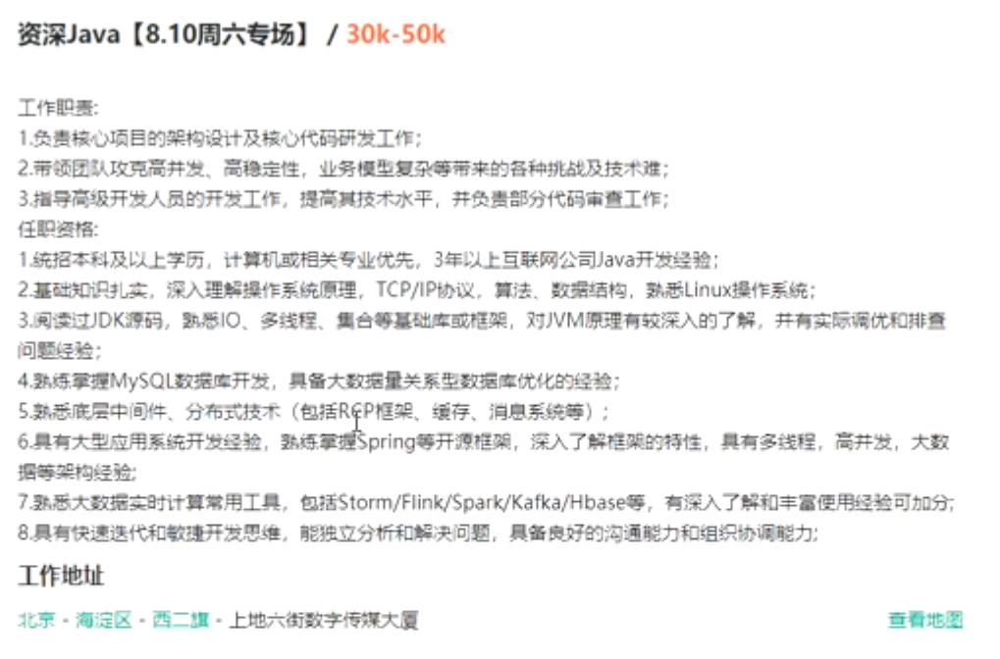

RPC 

技术栈  

数据量的这些技术  

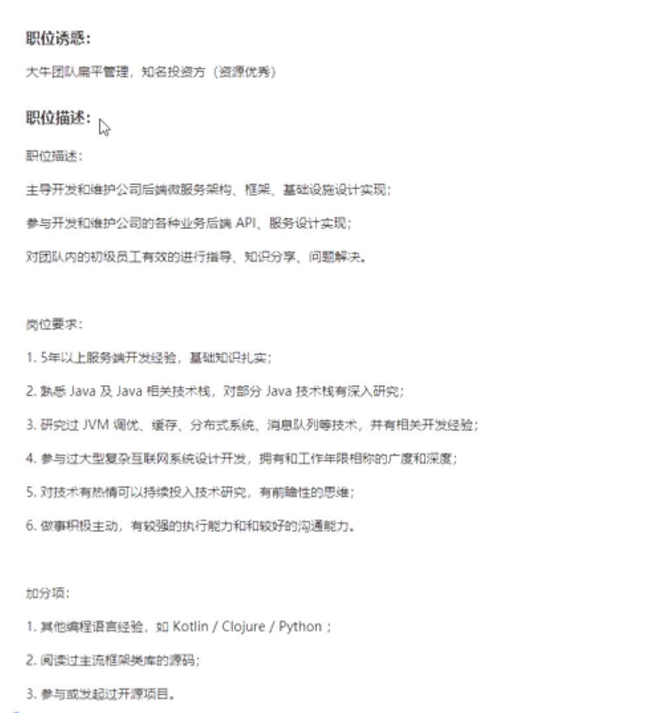

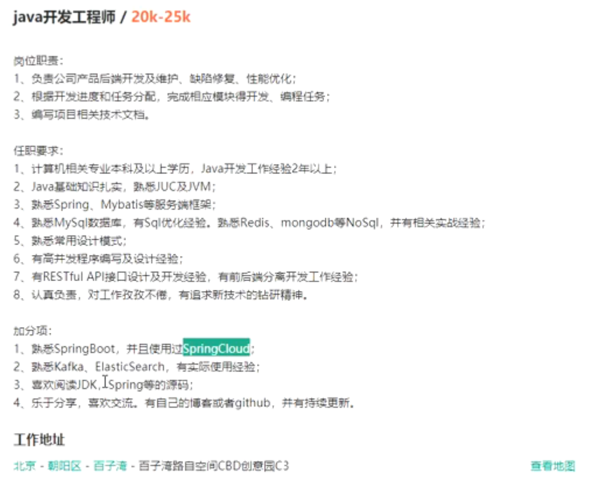

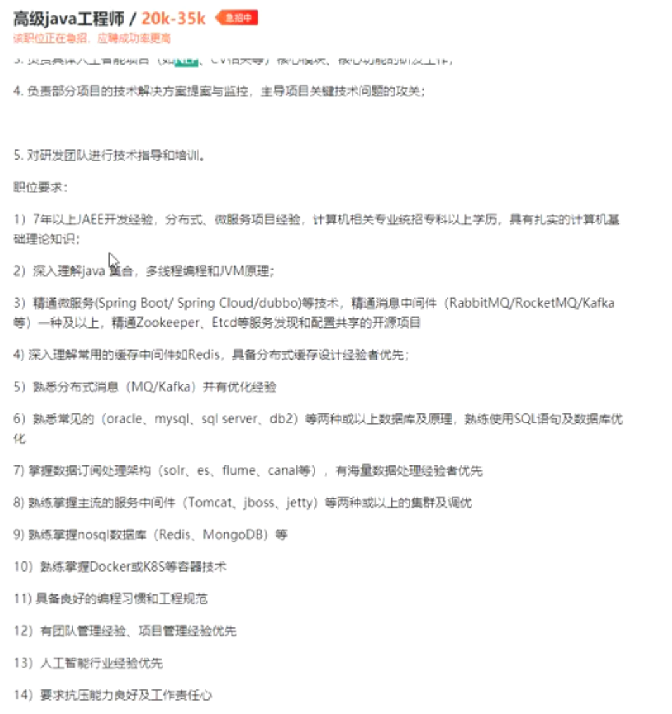

要求  

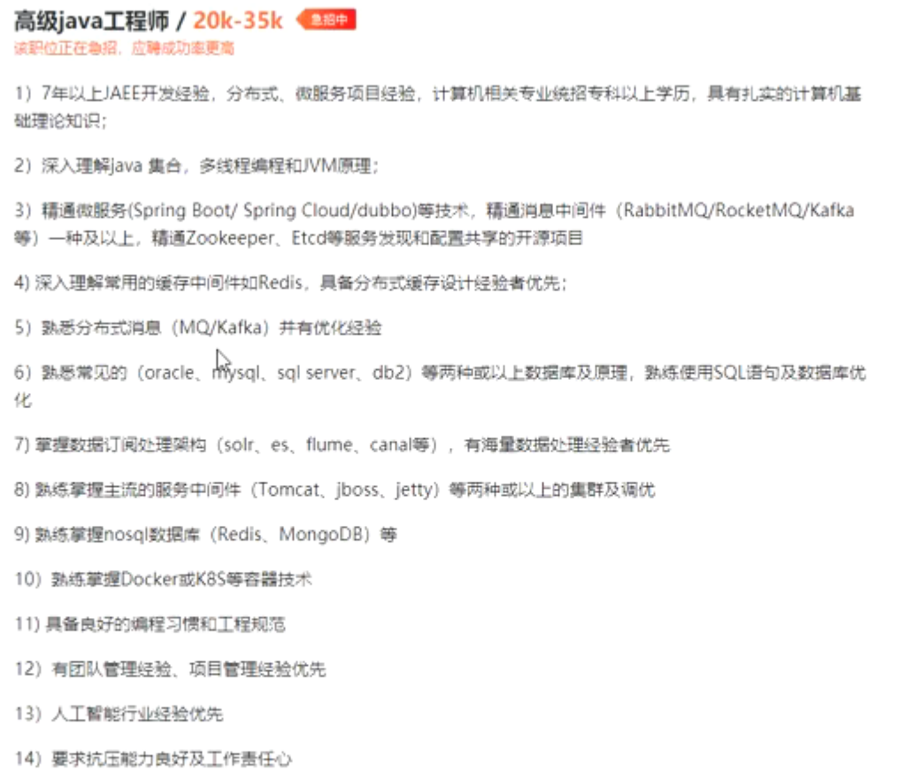

高薪 

分布式 微服务 

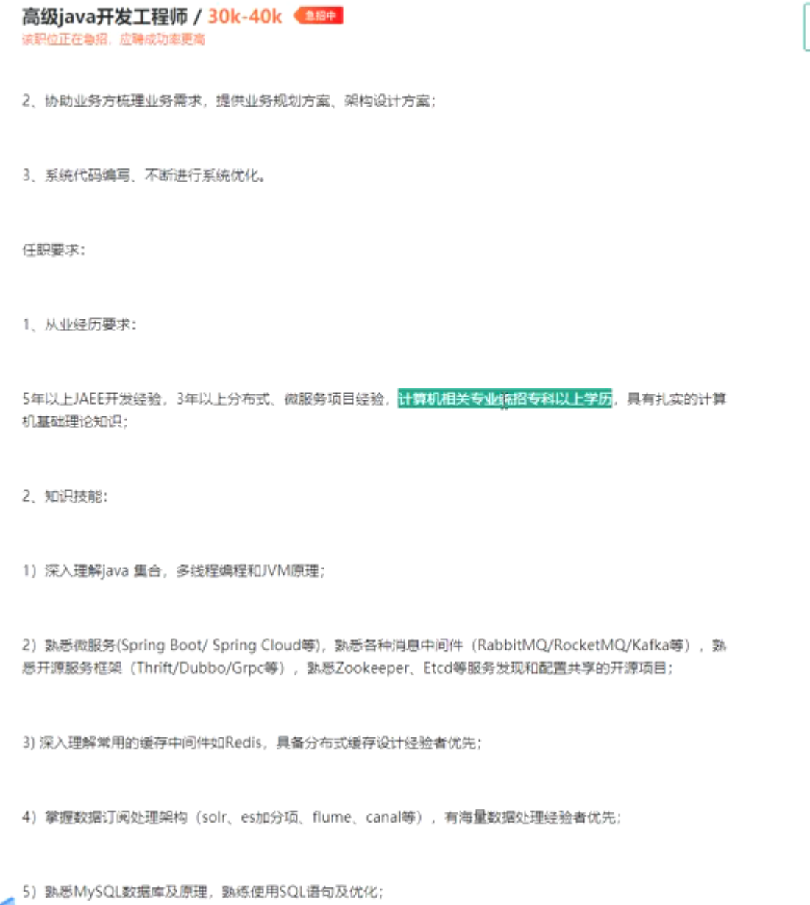

平庸有罪的

Spring Mybatis都是基础的 没有人提的

哭呀   

能力到了   直接投简历就行  

一年  两年   这些东西都会的

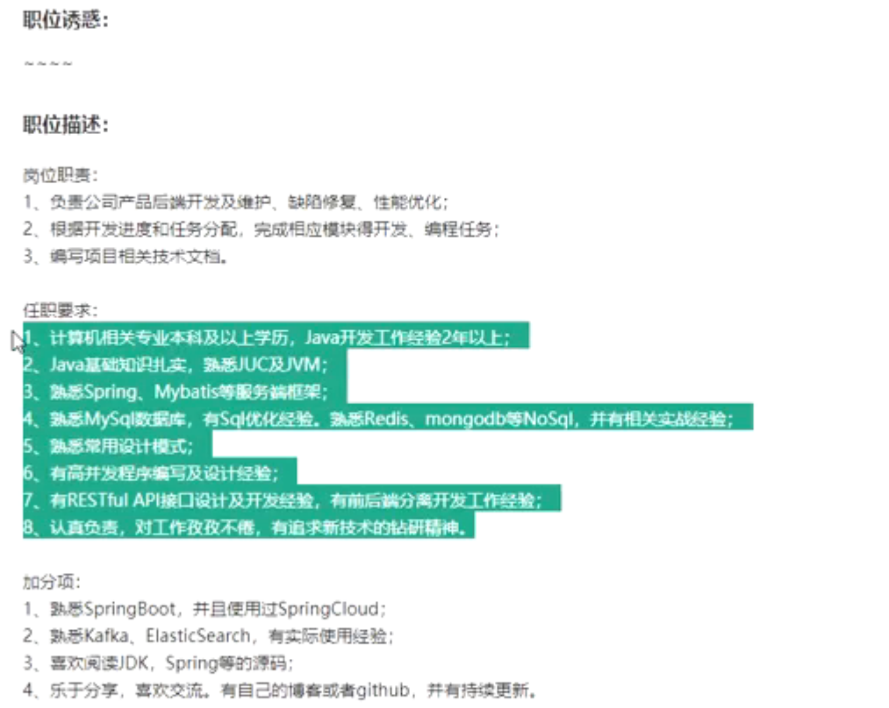

架构    基础 

一年    掌握住

JUC  并发

多背 多记

Github  有事没事就更新代码  

踏踏实实 学 个  

掌握深 就掌握源码 

反射 和 代理

好好 扣   

开班典礼 

大数据开发   

Java后端  

招人量不大 

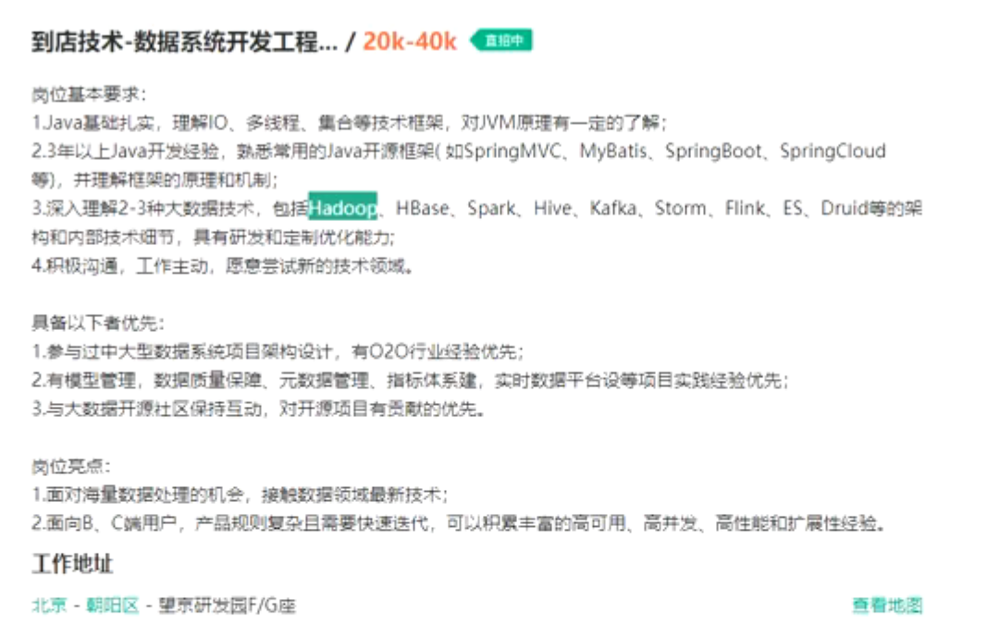

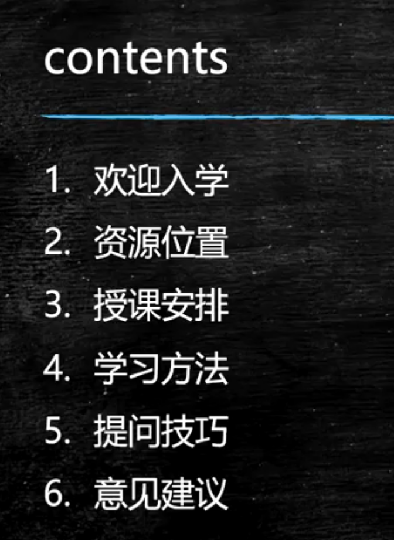

学习方法 

提问技巧 

意见建议  

这些基础的东西

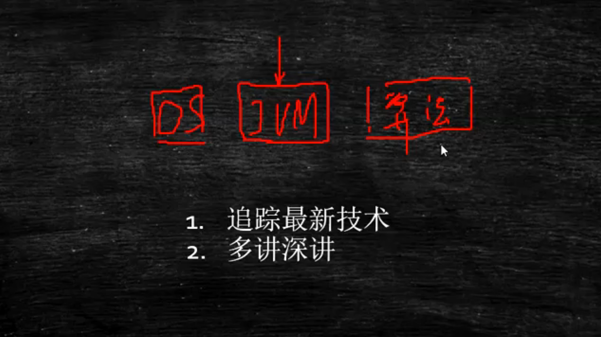

为什么  

招聘

问的东西 越技术 越深度

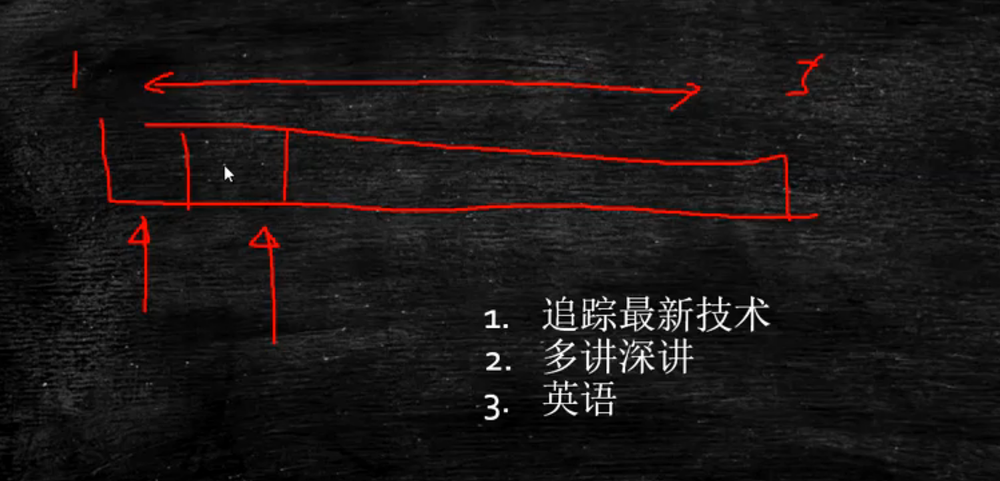

线下就一点时间   线上可以录播  ？？？优势

听好几遍  依赖   

反正我可以录播

一遍解决  为什么要多花时间呢 

大三 大四的 

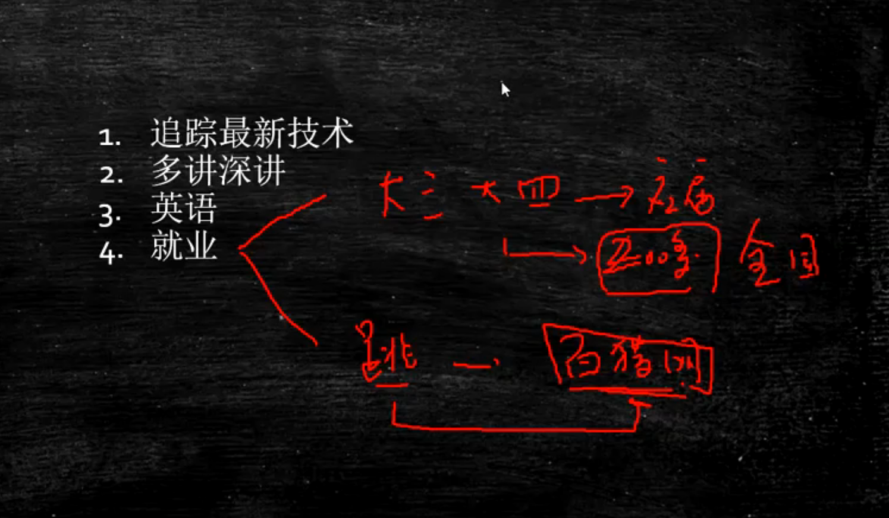

就业  

Linux  

运维   

开发用到的东西

Github账号

加分的  项目 

平常工作   总结    

什么都往上翻  

# 资源位置

Github链接  

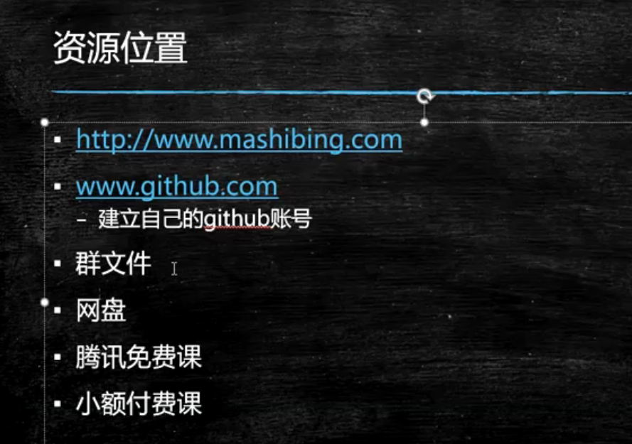

# 学习方法

