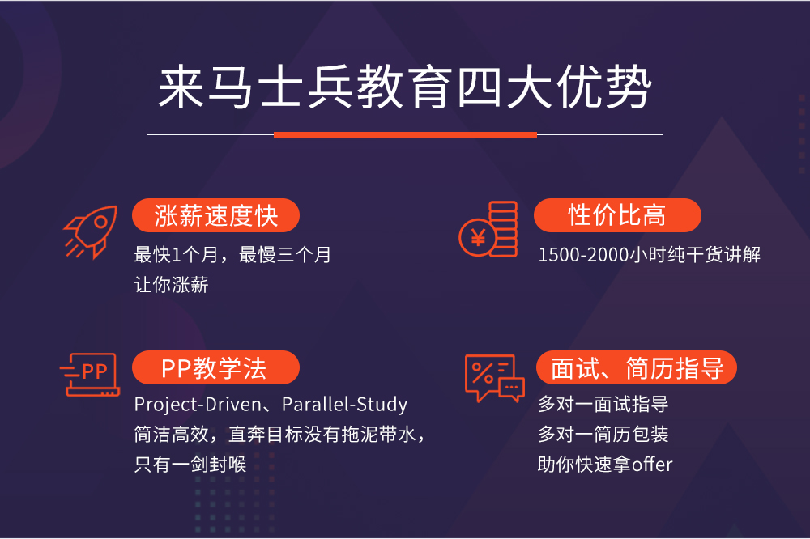
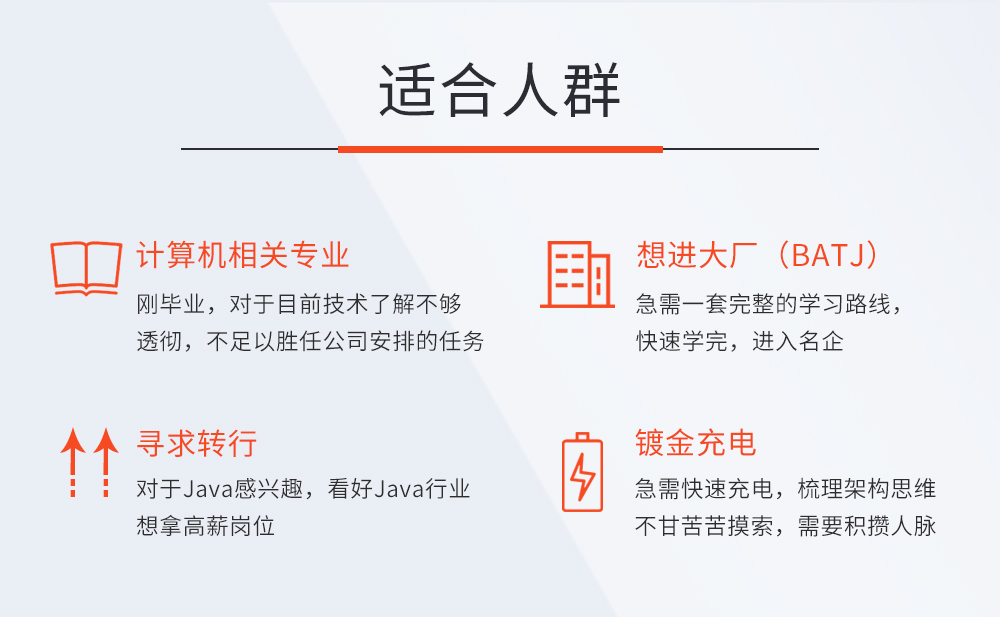
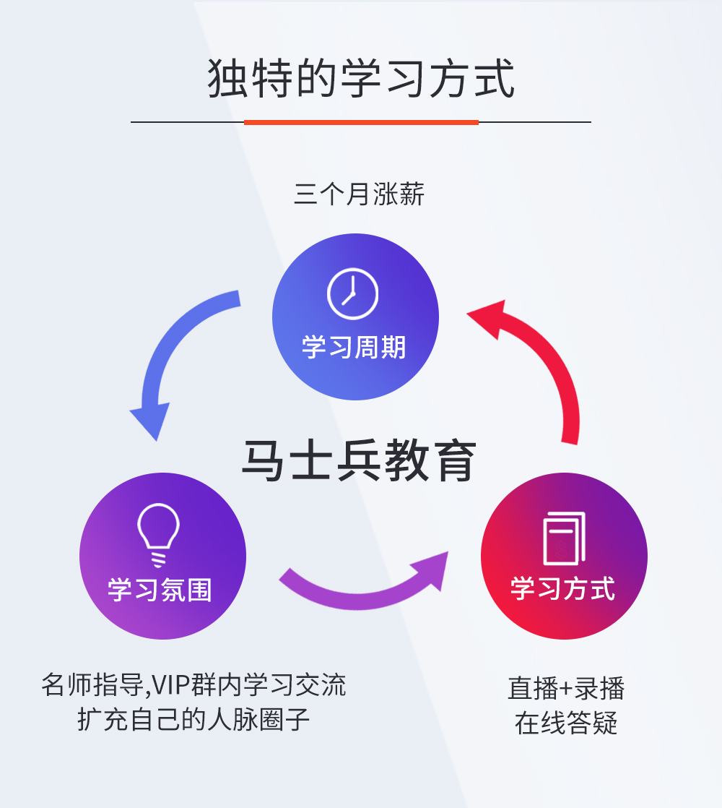
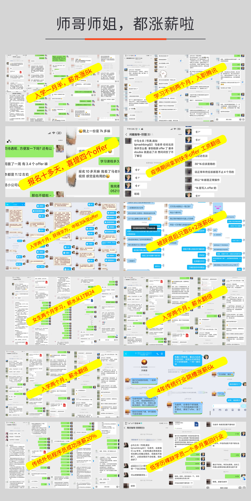

# Java零基础后端工程师【马士兵教育】

## 评论(116)

老师的讲课方式我非常的喜欢，从老师讲的基础课程中我又学习到了底层原理，特被是容器这一张边边角角的都讲到的，每次总结也写的很到位。认真看视频可以过滤掉很多的基础盲点，第二遍看直接可以当成复习，非常的谢谢老师们。
已上课48小时35分钟时评价 2020-05-20举报
哄****
哄****

目前只学完了Javase部分内容，连老师讲的知识点特别细，而且讲课超级耐心 ，会把每一个知识点掰开了，揉碎了讲，听完一遍再自己动手敲一遍感觉收获颇丰。另外，在javase部分就讲到HashMap源码以及线程池的原理，而且这还是小白基础课，不仅知识宽度足够，深度也是有的。课程很棒，自己也得加油学，对得起这么棒的课程。
已上课47小时57分钟时评价 2020-03-28举报
少****
少****

很棒 ，内容很深，就是有些地方对小白不是很友好，需要多听几遍才能听懂，但总体来讲非常棒，比那些只讲怎么用框架的录像强太多了
已上课95小时14分钟时评价 2020-04-09举报
执****
执****

连老师，永远滴神。小连连的课对小白真的是很负责了，很通俗易懂。深度和广度都很够，对于编程的思想也很高屋建瓴。刷就完事了。
已上课154小时21分钟时评价 2020-04-26举报
无****
无****

老师讲的很好，内容有深度，这么多套课程中含了工作中所需的绝大多数知识。能到什么水平真的就得看自己了。
已上课142小时17分钟时评价 2020-05-12举报
最****
最****

今天开始听项目啦，感谢连老师的辛辛教导，从浅入深，讲的很到位，点赞！守护全世界最好的小连连
已上课127小时16分钟时评价 2020-04-11举报
ℓ****
ℓ****

不光光是教知识，更重要是还会教我们学习方法，比如如何看源码，很耐心的了。非常感谢！！！
已上课58小时26分钟时评价 2020-07-04举报
空****
空****

连老师讲的真好，语速比较快，不容易走神，已靠这套视频找到工作。真的很棒。
已上课101小时48分钟时评价 2020-04-09举报
s****
s****

我已经学不过来了，加油，就是干，课程质量没的说。哪里不会看哪里！
已上课150小时43分钟时评价 2020-07-01举报
夏****
夏****

老师讲的很细致，有困难手把手教，很耐心，谢谢老师
已上课159小时40分钟时评价 2020-03-28

嚼****

动态代理源码看了跟没看一个效果，实在没看懂
已上课61小时47分钟时评价 2020-07-09举报
没****
没****

连老师真的讲的太棒了！！！感觉自己可以了
已上课113小时22分钟时评价 2020-07-17举报
安****
安****

连老师讲课激情澎湃，侧重有度，讲的很好，听其课就知道是个好小伙
已上课48小时9分钟时评价 2020-06-20举报
艾****
艾****

蛮好的，条理清晰，浅显易懂，连老师棒棒哒
已上课53小时35分钟时评价 2020-03-22举报
璨****
璨****

连老师很厉害，讲的也很细致，收获很大~
已上课122小时6分钟时评价 2020-07-10举报
F****
F****

连老师讲得有激情，重点突出，思路清晰
已上课66小时54分钟时评价 2020-05-13举报
追加评论：连老师讲得有激情，重点突出，思路清晰
已上课66小时54分钟时评价 2020-05-13
吕****
吕****

也没什么好说的，那就连老师牛逼吧
已上课74小时44分钟时评价 2020-05-22举报
?****
?****

刚刚追完SSM，终于最这个框架有了一个比较全面的认知，老师讲得很全面，从最基本的使用到是原理源码都有讲解，很奈斯
已上课39小时33分钟时评价 2020-06-14举报
＊****
＊****

老师讲的很详细，非常适合小白入门，为以后的架构课程打好基础
已上课42小时48分钟时评价 2020-03-27举报
计****
计****

连老师讲课非常细致，内容丰富 ，非常好。
已上课43小时19分钟时评价 2020-05-21

讲的很好 很容易懂 基本上不需要数学知识
已上课41小时11分钟时评价 2020-07-04举报
宾****
宾****

连老师很细心，用心把去把所有知识点都讲解 并容入面试知识点
已上课39小时10分钟时评价 2020-03-27举报
W****
W****

授课老师很有激情，讲课的语速偏快，除了固定的间歇，其他时间内容很满，没有垃圾时间，学员必须全程高度集中才能跟上老师的节奏。。。给老师提个小建议：对于常见的关键字、接口名或类名，最好还是纠正一下英文发音，不然课程听久了，会被洗脑，遇到读或讲代码的场景，会犹豫是老师读的对还是我原来掌握的发音对~~~
已上课24小时34分钟时评价 2020-02-19举报
深****
深****

连老师牛逼，知识点讲的很到位。
已上课37小时41分钟时评价 2020-04-12举报
明****
明****

内容，非常棒，老师讲的非常详细
已上课37小时15分钟时评价 2020-03-29举报
张****
张****

听过很多零基础的课，这个是讲的最好的！
已上课35小时36分钟时评价 2020-06-12举报
胖****
胖****

连老师的课讲的特别棒,特别喜欢语速快逻辑缜密的老师讲课,感觉脑子一直停不下来的感觉(ps: oh my love 咱们结婚吧~~~~哈哈哈 老师这个歌唱的还是嗯.......没想到没想到)
已上课22小时22分钟时评价 2020-06-06举报
数****
数****

我只是过来 看看 我学了多久的....
已上课34小时57分钟时评价 2020-04-30举报
追加评论：我只是过来 看看 我学了多久的....
已上课58小时46分钟时评价 2020-05-30
小****
小****

非常棒！连老师知识点讲的都很细致，考虑非常全面，并且从学生的角度考虑问题，还会给出一些技术方向的建议。非常棒
已上课28小时39分钟时评价 2020-02-12举报
佩****
佩****

老师思路清晰，讲解深入，非常棒正是我需要的
已上课33小时24分钟时评价 2020-05-22

ServerSocketChannel能说说吗
已上课31小时5分钟时评价 2020-07-15举报
毛****
毛****

好好学习 天天向上 加油 冲向牛逼
已上课31小时30分钟时评价 2020-07-14举报
去****
去****

老师讲课思路清晰，内容全面又有一定深度，有助理顺各个知识点
已上课28小时49分钟时评价 2020-02-07举报
振****
振****

冠状病毒预防，过年在家做贡献，出不去一天反复看，只看2个视频，老师讲的原理很清楚
已上课26小时17分钟时评价 2020-02-10举报
潇****
潇****

很全面 很完整 的一门课,缺啥补啥.
已上课28小时56分钟时评价 2020-04-11举报
S****
S****

知识脉络清晰，覆盖全面，语言表达清楚，互动安排合理。工作很多年了，查缺补漏，补了很多细节内容。赞
已上课22小时37分钟时评价 2020-07-04举报
追加评论：很清晰，很全面，很易懂，印象深刻。
已上课34小时48分钟时评价 2020-07-10
O****
O****

……………………………………..
已上课27小时47分钟时评价 2020-05-20举报
青****
青****

讲的由浅入深，也讲底层原理。非常喜欢，如果你想更上一层楼，这套课程还是very奈斯的。
已上课22小时50分钟时评价 2020-05-05举报
追加评论：客观评价一下，我也看了好几个机构的课，马士兵教育还是挺棒的，我买这个课之前，对比了好几家机构的课，这个课性价比是真的高，花同样的钱，能学到更多的东西（你可以自己去查对比看）。线下培训我也问过我同学，一般都要两三万，我有个同学(我同学高三没上完就去培训班了)在郑州某机构培训，我也问了他，两年花了5w多。我自己是学的校企合作(大专)，一年6000多费用，说的是包分配，你没有能力谁能给你保证(自己可以用脑子思考一下)？所以，如果你选择了这个专业，就靠自己，提高自己的能力。代码唯一的捷径就是敲！敲！敲！ 我自己想的是比较长远的，虽然我现在大一(再开学就大二了，大三就该去实习了)，我自己报的是基础+架构+大数据。架构师+大数据 学校里应该不会教(我们是没有教)，当你离开校园之后，你自己仍然是需要不断学习的。这些课我可能还需要学几年。 这个课的内容确实略深，如果你是相关专业听，也会有大大的收获。如果是非相关专业，B站好对免费资源，看一下。B站虽然有好多资源，那些我自己也看了，都是某机构几年前的课。
已上课46小时14分钟时评价 2020-07-11
伱****
伱****

连老师 很负责的老师，很有耐心，声音大。本人工作几年了，来提升提升。 之前听着马老师课成长起来的，希望大家未来越来越好。
已上课19小时41分钟时评价 2020-03-01举报
K****
K****

感谢连老师的讲解，非常的细致。

连老师耐心细致，讲解全面，善于用形象直观的例子和代码演示把知识串联起来。不论有java基础，还是完全从零开始的小白，通过这门课都能快速上手，进阶！太棒了，感谢连老师
已上课13小时50分钟时评价 2020-05-22举报
一****
一****

由浅到深,深入浅出,很容易理解.课后做点练习题,就可以学会.
已上课21小时23分钟时评价 2020-04-14举报
我****
我****

知识点讲解与代码齐飞，“非（飞）”一般的感受！！
已上课20小时42分钟时评价 2020-05-11举报
追加评论：入门级精品视频！！还不快拿走！！
已上课22小时31分钟时评价 2020-05-29
于****
于****

小连连讲课很细致，而且容易把自己讲嗨，讲到的知识点永远是要超过你的预期，面面俱到~喜欢他的上课风格和方式~ “非常简单”已经成了连老师的口头禅，哈哈
已上课12小时19分钟时评价 2020-05-23举报
如****
如****

连老师讲课声音洪亮，对知识点的讲解由浅入深，并且范围很广，尤其是在数据库部分讲解得透彻到位，期待后面的课程
已上课13小时29分钟时评价 2020-03-27举报
K****
K****

牛逼的老师。声音大，激情四射，通俗易懂。
已上课17小时11分钟时评价 2020-05-17举报
马****
马****

讲的很详细，项目听了前面好后面都是看笔记，看看都写了什么代码，如果能看懂就快进或者看下一个，主要就听一下springboot开发的流程，熟悉一下很好
已上课7小时9分钟时评价 2020-07-02举报
发****
发****

连老师讲课很认真，很仔细，可以帮我快速掌握知识点，学习一段时间后，感觉有很大提升
已上课11小时56分钟时评价 2020-03-27举报
H****
H****

讲的挺好的。hashmap终于知道底层结结构了。数组链表，红黑树。花了半天看懂了数组和链表，
已上课9小时15分钟时评价 2020-07-02举报
M****
M****

听了几节课，老师说的非常不错，知识点说的非常到位，浅显易懂。但也存在问题，就是老师对课件和代码的备课不够充分，会让学生感觉老师不够权威。希望老师可以在以后的教学过程中改进。
已上课2小时20分钟时评价 2020-05-30

NullPointer

这个课程，学完可以拿到8-12k的月薪，性价比非常高。
已上课60分钟时评价 2019-08-07举报
宗****
宗****

复习JAVA基础，查漏补缺很重要。
已上课1小时54分钟时评价 2019-12-27举报
追加评论：从这里可以学到JAVASE、数据库、前端基础、项目实战的内容。每个点精准清晰易懂，手写编码，有完整的源码课件习题配合学习，甚至结合面试点，关键点讲解，一到三年的新手小白快速成长，老手可以查漏补缺，奠基扎实的基础技术，完备自己的JAVA知识体系。比如集合，横向纵向对比区别，讲解原理，点出hashmap在jdk7/8中的数据结构、初始化、哈希函数、扩容、put流程图。比如数据库，学习oracle，讲解mysql事务，剖析mysql存储和索引原理，更易于掌握。当然其中多线程，NIO，JVM等高阶内容在本零基础课程中没有深入展开。
已上课23小时43分钟时评价 2020-01-02
高****
高****

非常好，老师讲课幽默风趣，深入浅出。
已上课1小时12分钟时评价 2019-11-30举报
海****
海****

非常棒，值得推荐，特别适合成就大神之路
已上课58分钟时评价 2019-11-30举报
J****
J****

好评！ 课程颇有深度、内容充实。
已上课1小时6分钟时评价 2019-12-02举报
b****
b****

通俗易懂，深入浅出。非常推荐这个课程
已上课51分钟时评价 2019-12-13

## 课程概述

### 老师介绍

- 

  #### [马士兵老师](https://ke.qq.com/teacher/2404826094)

  马士兵老师，1994-1999 年就读于清华大学，历任程序员、Team Leader、Proje...

-  

- 

  #### [连老师](https://ke.qq.com/teacher/1989941519)

  5年大数据工作经验，曾任中国电信大数据主管，玖富集团技术架构师等职位，参与...

| 简　　介 | 本课程是一门适合纯小白入门的课程，带你从无到有走进java的世界，通过和家物业服务云平台为项目驱动，让你精通java的各种基础知识以及web开发框架，手把手带你敲出企业级实战项目，有问必答，理论与实践相结合教学，带你掌握真正的java核心技术。 详细课程咨询加微信：bjmashibing2 |
| :------- | ------------------------------------------------------------ |
|          |                                                              |

**扫描微信二维码领取资料**
        

\* 课程提供者：马士兵老师

### 开班典礼

[【回放】开班典礼(8月6日 20:00-21:00) 免费试学](https://ke.qq.com/webcourse/index.html#course_id=423902&term_id=100505967&taid=3459372819052510&type=1024&vid=j1433ieoc08)

**02**

### JAVASE基础语法

[【回放】java基本介绍、环境搭建、HelloWorld程序(8月10日 15:00-17:00) 免费试学](https://ke.qq.com/webcourse/index.html#course_id=423902&term_id=100505967&taid=3459377114019806&type=1024&vid=z1433sgi4sa)[【回放】java基础语法：标识符保留字数据类型运算符(8月10日 20:00-22:00) 免费试学](https://ke.qq.com/webcourse/index.html#course_id=423902&term_id=100505967&taid=3459381408987102&type=1024&vid=k1433hdodo1)

**03**

### JAVASE基础语法+面向对象

[【回放】java二进制运算、数据类型的转换、分支结构(8月11日 15:00-17:00)](javascript:void(0);)[【回放】java循环结构、Scanner类(8月17日 15:00-17:00)](javascript:void(0);)[【回放】java递归算法、数组讲解、排序算法(8月17日 20:00-22:00)](javascript:void(0);)[【回放】局部变量成员变量、引用类型、this、static(8月24日 15:00-17:00)](javascript:void(0);)[【回放】代码块、Package、Import、封装(8月24日 20:00-22:00)](javascript:void(0);)[【回放】继承、Super、重写、抽象类、抽象方法(8月25日 15:00-17:00)](javascript:void(0);)[【回放】Object、多态(8月31日 15:00-17:00)](javascript:void(0);)

**04**

### JAVASE--异常+常用类

[【回放】接口(8月31日 20:00-22:00)](javascript:void(0);)[【回放】内部类、异常简单介绍(9月1日 15:00-17:00)](javascript:void(0);)[【回放】java异常及常用类（包装类、String）(9月7日 15:00-17:00)](javascript:void(0);)

**05**

### JAVASE 集合框架

[【回放】java常用类、java集合框架(9月7日 20:00-22:00)](javascript:void(0);)[【回放】Java集合框架（ArrayList、LinkedList等）(9月8日 15:00-17:00)](javascript:void(0);)[【回放】Java集合框架（HashSet、TreeSet）以及泛型(9月21日 15:00-17:00)](javascript:void(0);)

**06**

### java集合框架

[【回放】Java集合框架（HashMap、TreeMap）源码分析(9月21日 20:00-22:00)](javascript:void(0);)[【回放】Java集合框架（Collections）及File类讲解(9月22日 15:00-17:00)](javascript:void(0);)[【回放】IO流（字节流、字符流、输入流、输出流）(9月22日 20:00-22:00)](javascript:void(0);)

**07**

### IO流、多线程

[【回放】IO流（标准输入、标准输出、打印流等）(9月28日 15:00-17:00)](javascript:void(0);)[【回放】多线程-线程与进程、线程的实现方式(9月28日 20:00-22:00)](javascript:void(0);)[【回放】多线程-线程的生命周期、线程同步与死锁(9月29日 15:00-17:00)](javascript:void(0);)[【回放】多线程-生产者消费者问题、线程池(10月12日 15:00-17:00)](javascript:void(0);)[【回放】网络编程-IP、TCP、UDP1(10月12日 20:00-22:00)](javascript:void(0);)

**08**

### 网络编程与JDK新特性

[【回放】网络编程-IP、TCP、UDP和lambda表达式(10月13日 15:00-17:00)](javascript:void(0);)[【回放】jdk新特性-lambda表达式(10月19日 15:00-17:00)](javascript:void(0);)[【回放】jdk新特性-stream api及自定义注解(10月19日 20:00-22:00)](javascript:void(0);)

**09**

### java基础与数据库

[【回放】javase复习(10月20日 15:00-17:00)](javascript:void(0);)[【回放】oracle安装介绍(10月26日 15:30-17:30)](javascript:void(0);)[【回放】oracle SQL(10月26日 20:00-22:00)](javascript:void(0);)

**10**

### 数据库

[【回放】oracle函数和多表连接(10月27日 15:30-17:30)](javascript:void(0);)[【回放】oracle的join语法及行专列(11月2日 15:00-17:00)](javascript:void(0);)[【回放】oracle视图、用户管理、序列、DML(11月2日 20:00-22:00)](javascript:void(0);)[【回放】数据库的事务(11月3日 15:00-17:00)](javascript:void(0);)

**11**

### 前后端交互技术Servlet与JSP

[【回放】数据库表的创建、表的约束、索引、数据库(11月9日 16:00-18:00)](javascript:void(0);)[【回放】JDBC及代码分层(11月9日 20:00-22:00)](javascript:void(0);)[【回放】反射技术实现及封装(11月10日 15:00-17:00)](javascript:void(0);)[【回放】DBUtil及数据库连接池（dbcp、c3p0）(11月16日 15:00-17:00)](javascript:void(0);)[【回放】数据库连接池（druid、hikariCP）及索引(11月16日 20:00-22:00)](javascript:void(0);)[【回放】索引原理2、mysql基本架构及日志实现(11月17日 15:00-17:00)](javascript:void(0);)

**12**

### 异步交互技术Ajax

[【回放】mysql的执行计划(11月23日 15:00-17:00)](javascript:void(0);)[【回放】mysql的锁机制(11月23日 20:00-22:00)](javascript:void(0);)

**13**

### 流行的JavaScript库-JQuery

[【回放】mysql的主从复制和读写分离(11月24日 15:00-17:00)](javascript:void(0);)[【回放】html的介绍及标签的使用(11月30日 15:00-17:00)](javascript:void(0);)

**14**

### spring

[【回放】CSS样式及选择器(11月30日 20:00-22:00)](javascript:void(0);)[【回放】CSS盒子模型及定位(12月1日 15:00-17:00)](javascript:void(0);)[【回放】CSS浮动及轮播图演示(12月1日 20:00-22:00)](javascript:void(0);)[【回放】js介绍及内置功能函数、数据类型、变量(12月7日 15:00-17:00)](javascript:void(0);)[【回放】js的变量及运算符(12月7日 20:00-22:00)](javascript:void(0);)

**15**

### SpringMVC

[【回放】js的流程控制语句(12月8日 15:00-17:00)](javascript:void(0);)[【回放】js的函数基本使用(12月14日 15:00-17:00)](javascript:void(0);)[【回放】js的数组和字符串的基本使用(12月14日 20:00-22:00)](javascript:void(0);)[【回放】dom操作、常用方法、事件绑定(12月15日 15:00-17:00)](javascript:void(0);)[【回放】echarts和js对象、函数上下文(12月28日 15:00-17:00)](javascript:void(0);)

**16**

### Mybatis

[【回放】js构造函数、js原型链、继承及实战案例(12月28日 20:00-22:00)](javascript:void(0);)[【回放】jquery简介、选择器、常用方法(12月29日 15:00-17:00)](javascript:void(0);)[【回放】jquery的节点关系及函数操作(1月4日 15:00-17:00)](javascript:void(0);)[【回放】jquery轮播图及函数库介绍(1月4日 20:00-22:00)](javascript:void(0);)[【回放】Http协议、php的基本介绍(1月5日 15:00-17:00)](javascript:void(0);)[【回放】ajax基本原理及使用(1月11日 15:00-17:00)](javascript:void(0);)

**17**

### ajax的接受数据的方式及三级联通案例

[【回放】ajax的接受数据的方式及三级联通案例(1月11日 20:00-22:00)](javascript:void(0);)

**18**

### vue框架的介绍及使用

[【回放】vue框架的介绍及使用(1月12日 15:00-17:00)](javascript:void(0);)[【回放】vue框架的调色板、属性值监听、函数(1月18日 15:00-17:00)](javascript:void(0);)[【回放】vue框架的生命周期、组件使用(1月18日 20:00-22:00)](javascript:void(0);)

**19**

### vue框架的高阶使用

[【回放】vue框架的高阶使用(1月19日 15:00-17:00)](javascript:void(0);)

**20**

### Spring框架的介绍及使用

[【回放】Spring框架的介绍及使用(2月8日 15:00-17:00)](javascript:void(0);)

**21**

### SpringIOC容器的配置使用1

[【回放】SpringIOC容器的配置使用1(2月8日 20:00-22:00)](javascript:void(0);)

**22**

### SpringIOC容器的配置使用2

[【回放】SpringIOC容器的配置使用2(2月9日 15:00-17:00)](javascript:void(0);)

**23**

### SpringIOC容器的注解使用

[【回放】SpringIOC容器的注解使用(2月15日 15:00-17:00)](javascript:void(0);)

**24**

### SpringAOP的引入及配置使用

[【回放】SpringAOP的引入及配置使用(2月15日 20:00-22:00)](javascript:void(0);)

**25**

### SpringAOP的详细讲解

[【回放】SpringAOP的详细讲解(2月16日 15:00-17:00)](javascript:void(0);)

**26**

### SpringAOP的详细讲解

[【回放】SpringAOP的详细讲解(2月22日 15:00-17:00)](javascript:void(0);)

**27**

### SpringAOP声明式事务及源码讲解

[【回放】SpringAOP声明式事务及源码讲解(3月7日 15:00-17:00)](javascript:void(0);)

**28**

### Spring源码讲解

[【回放】Spring源码讲解(3月7日 20:00-22:00)](javascript:void(0);)

**29**

### Spring源码讲解

[【回放】Spring源码讲解(3月8日 15:00-17:00)](javascript:void(0);)

**30**

### 动态代理

[【回放】动态代理(3月8日 20:00-22:00)](javascript:void(0);)

**31**

### springmvc简单介绍及使用

[【回放】springmvc简单介绍及使用(3月14日 15:00-17:00)](javascript:void(0);)

**32**

### Springmvc的使用1

[【回放】Springmvc的使用1(3月14日 20:00-22:00)](javascript:void(0);)

**33**

### Springmvc的使用2

[【回放】Springmvc的使用2(3月15日 15:00-17:00)](javascript:void(0);)

**34**

### Springmvc的使用3

[【回放】Springmvc的使用3(3月15日 20:00-22:00)](javascript:void(0);)

**35**

### Springmvc的使用4

[【回放】Springmvc的使用4(3月21日 15:00-17:00)](javascript:void(0);)

**36**

### Springmvc的使用5

[【回放】Springmvc的使用5(3月21日 20:00-22:00)](javascript:void(0);)

**37**

### Springmvc的源码讲解1

[【回放】Springmvc的源码讲解1(3月22日 15:00-17:00)](javascript:void(0);)

**38**

### Springmvc的源码讲解2

[【回放】Springmvc的源码讲解2(3月22日 20:00-22:00)](javascript:void(0);)

**39**

### mybatis的介绍和基本使用1

[【回放】mybatis的介绍和基本使用1(3月28日 15:00-17:00)](javascript:void(0);)

**40**

### mybatis基本使用2

[【回放】mybatis基本使用2(3月28日 20:00-22:00)](javascript:void(0);)

**41**

### mybatis基本使用3

[【回放】mybatis基本使用3(3月29日 15:00-17:00)](javascript:void(0);)

**42**

### mybatis基本使用4

[【回放】mybatis基本使用4(3月29日 20:00-22:00)](javascript:void(0);)

**43**

### mybatis基本使用5

[【回放】mybatis基本使用5(4月4日 15:00-17:00)](javascript:void(0);)

**44**

### mybatis基本使用6

[【回放】mybatis基本使用6(4月4日 20:00-22:00)](javascript:void(0);)

**45**

### Mybatis源码讲解1

[【回放】Mybatis源码讲解1(4月5日 15:00-17:00)](javascript:void(0);)

**46**

### Mybatis源码讲解2

[【回放】Mybatis源码讲解2(4月11日 15:00-17:00)](javascript:void(0);)

**47**

### 何家云项目实战1

[【回放】何家云项目实战1(4月18日 15:00-17:00)](javascript:void(0);)

**48**

### 何家云项目实战2

[【回放】何家云项目实战2(4月18日 20:00-22:00)](javascript:void(0);)

**49**

### 何家云项目实战3

[【回放】何家云项目实战3(4月19日 15:00-17:00)](javascript:void(0);)

**50**

### 何家云项目实战4

[【回放】何家云项目实战4(4月25日 15:00-17:00)](javascript:void(0);)

**51**

### 何家云项目实战5

[【回放】何家云项目实战5(4月25日 20:00-22:00)](javascript:void(0);)

**52**

### 何家云项目实战6

[【回放】何家云项目实战6(5月10日 15:00-16:00)](javascript:void(0);)

**53**

### 何家云项目实战7

[【回放】何家云项目实战7(5月10日 20:00-20:30)](javascript:void(0);)

**54**

### 何家云项目实战8

[【回放】何家云项目实战8(5月10日 20:30-21:00)](javascript:void(0);)