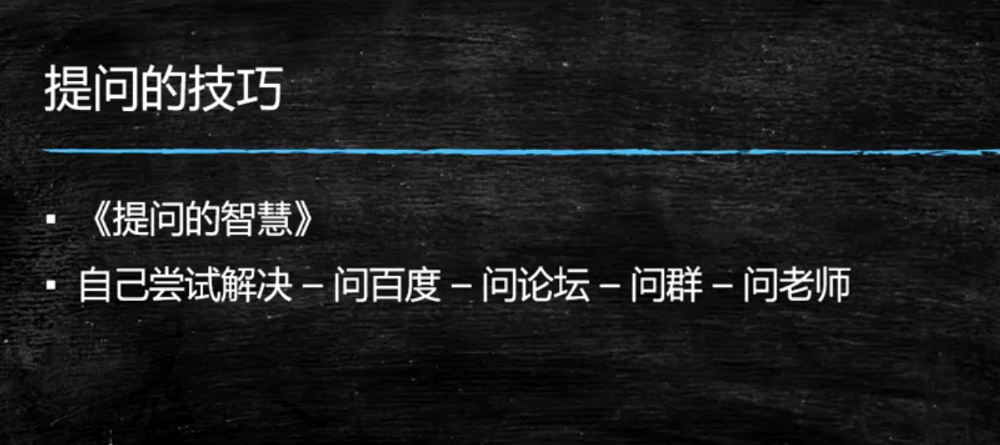
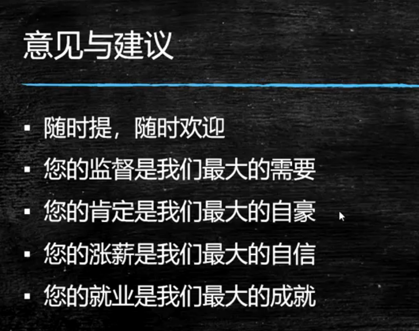
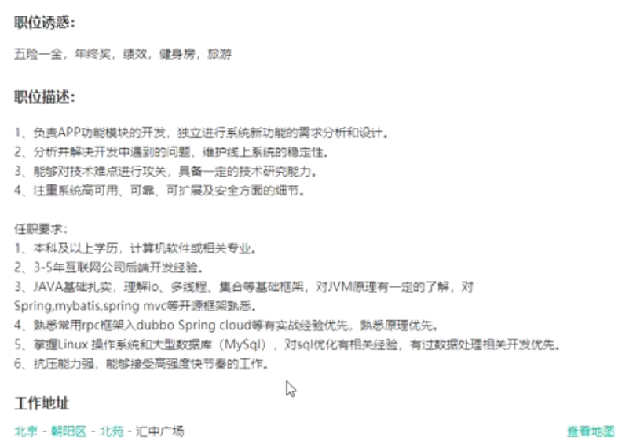
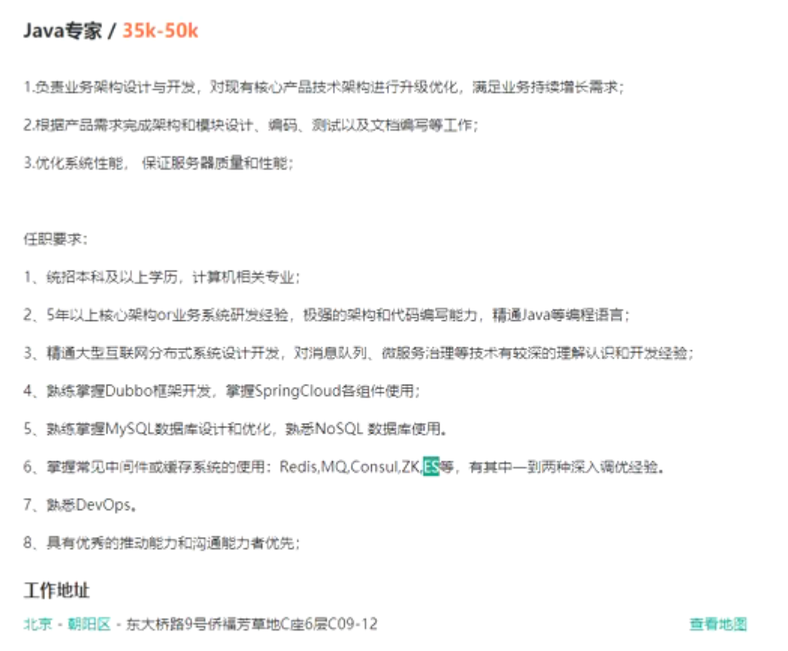
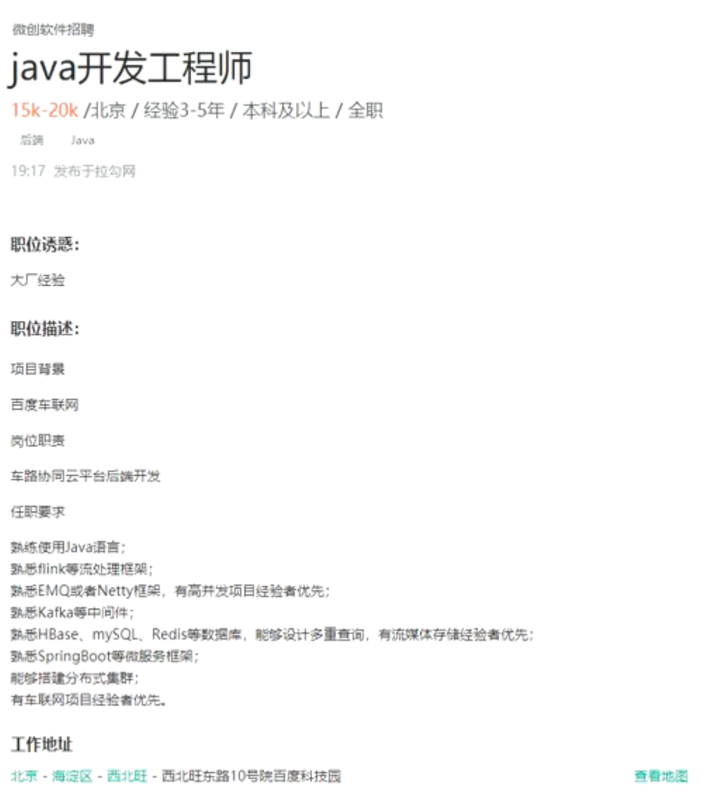
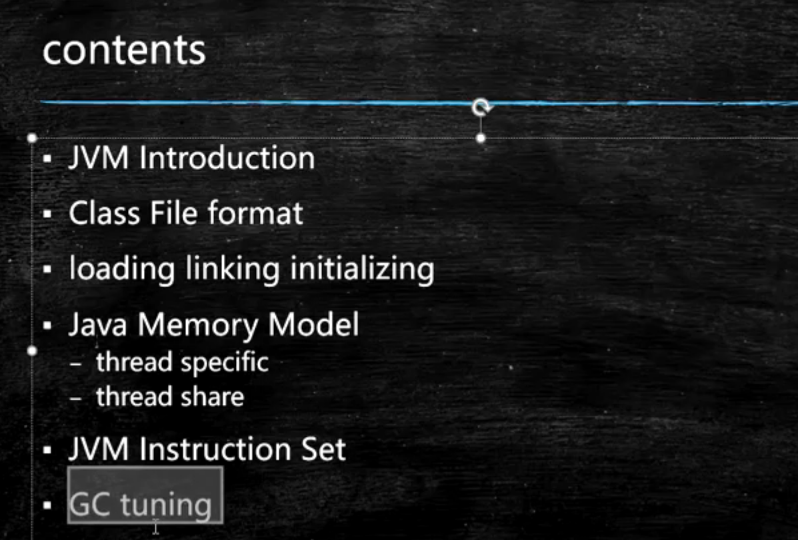

年薪30万  到底需要哪些技术   

每周都去招聘网站  看一看的   

拉勾  给给钱比较多的公司的要求  

RPC 

技术栈  

数据量的这些技术  

要求  

高薪 

分布式 微服务 

平庸有罪的

Spring Mybatis都是基础的 没有人提的

哭呀   

能力到了   直接投简历就行  

一年  两年   这些东西都会的

架构    基础 

一年    掌握住

JUC  并发

多背 多记

Github  有事没事就更新代码  

踏踏实实 学 个  

掌握深 就掌握源码 

反射 和 代理

好好 扣   

开班典礼 

大数据开发   

Java后端  

招人量不大 

学习方法 

提问技巧 

意见建议  

这些基础的东西

为什么  

招聘

问的东西 越技术 越深度

线下就一点时间   线上可以录播  ？？？优势

听好几遍  依赖   

反正我可以录播

一遍解决  为什么要多花时间呢 

大三 大四的 

就业  

Linux  

运维   

开发用到的东西

Github账号

加分的  项目 

平常工作   总结    

什么都往上翻  

# 资源位置

Github链接  

# 学习方法

# 提问的技巧

行业需要什么人

提问的时候  技巧  

简历   猎头  水平

Stackoverflow

# 意见与建议

****

周六 周日 

视频 笔记  都有了   

每天     跟着学就是   

面试  笔试

录音   录视频 

差异

三年到五年  

基础差？  

那里不会呢  项目经验

招聘网站  

继续交流 

天天都讲课的 

不停录课 直播   

Java 一些列   很多

JVM调优    你的项目来讲的

一个项目  视频网站  学习网站  好多人学习

用什么机器  服务器 多少  虚拟机配置  怎么去考虑  

分析  大概出现什么   

心虚   润色一下  

OS课程  来了   面试的时候问到问题    深到没底

面试经常问   

考研 工作  研究生含金量高不高

同学们再见