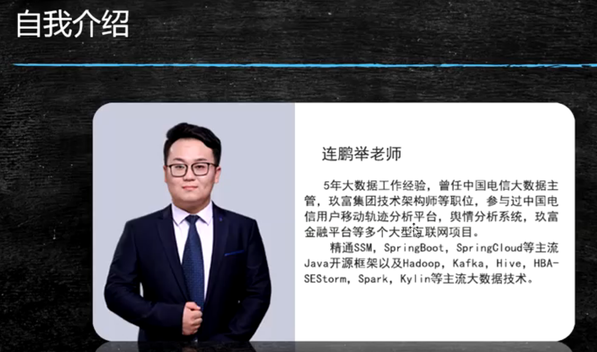
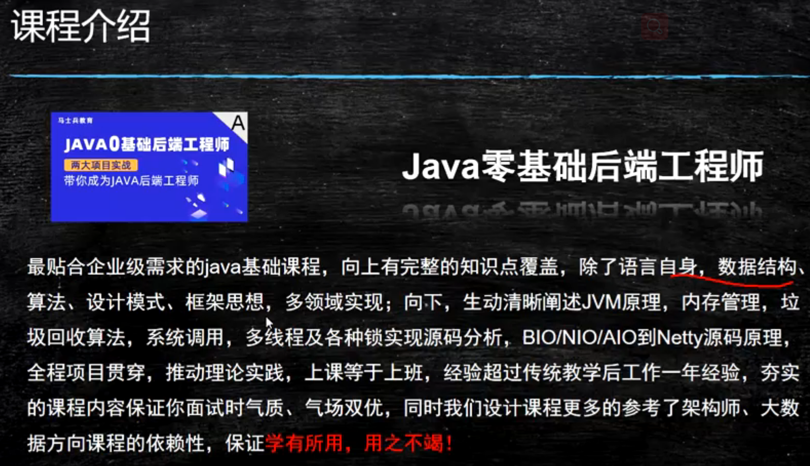
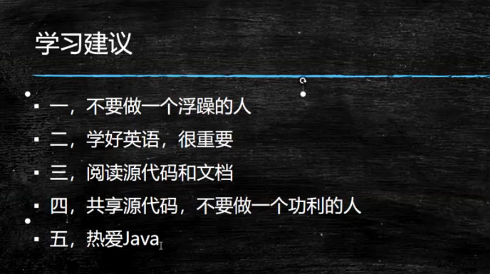
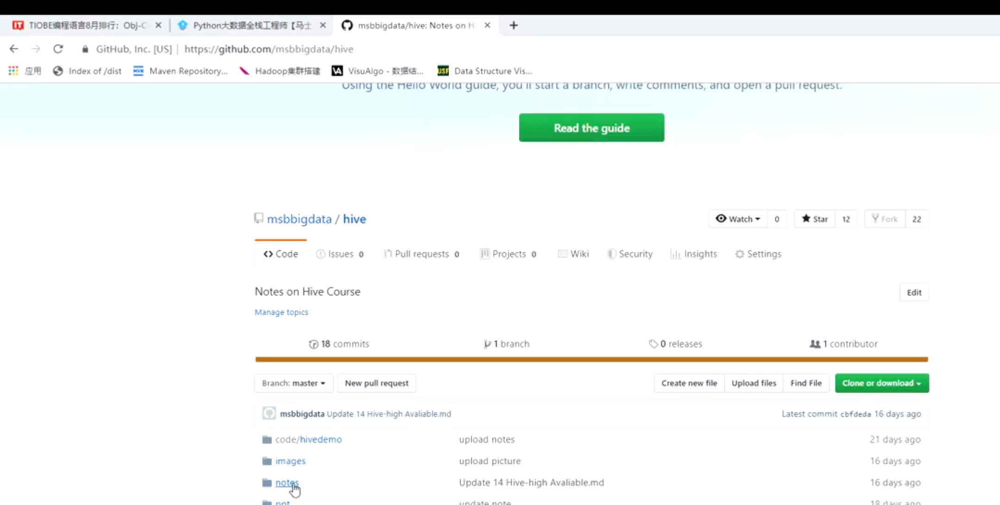
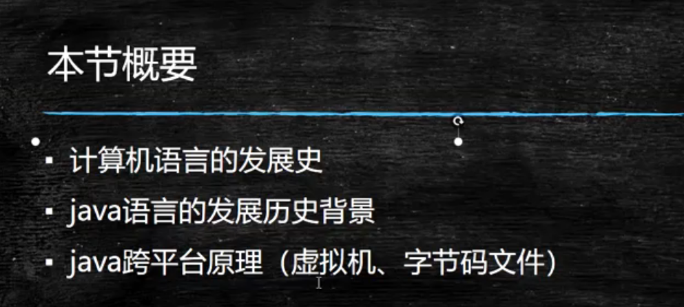
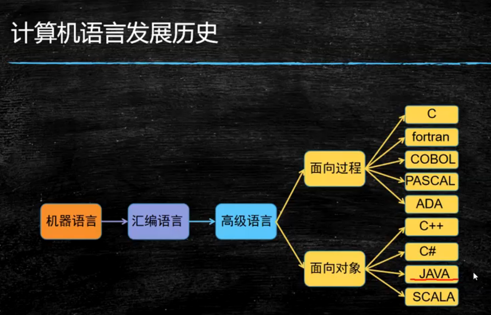

# 第2节 JAVASE基础语法

java基础介绍 环境搭建  HelloWorld程序

精通

面试飞机 大炮   正式工作 螺丝钉

但都有的 

学习建议 

不要做一个浮躁的人

很多新技术   

我只要某个点    精

一步步走

每天进步一点点  贪多嚼不烂

文档  资源  官网  不悦越来越远 

源码   为什么设计这么优秀   面试   

不要做一个工具人

热爱Java

共享源代码 不要做一个功利的人

喜欢开源分享  热爱Java  

文档

一门精 多门通

Go Python  JS 

一言不合撸代码 

眼高手低 

这么简单  根本敲不出代码 