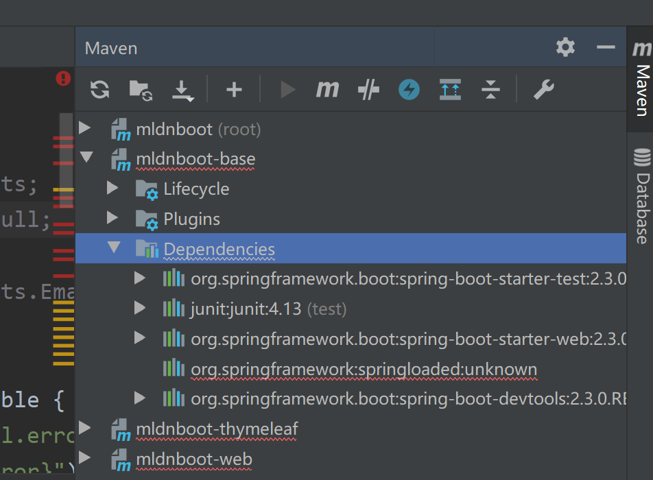
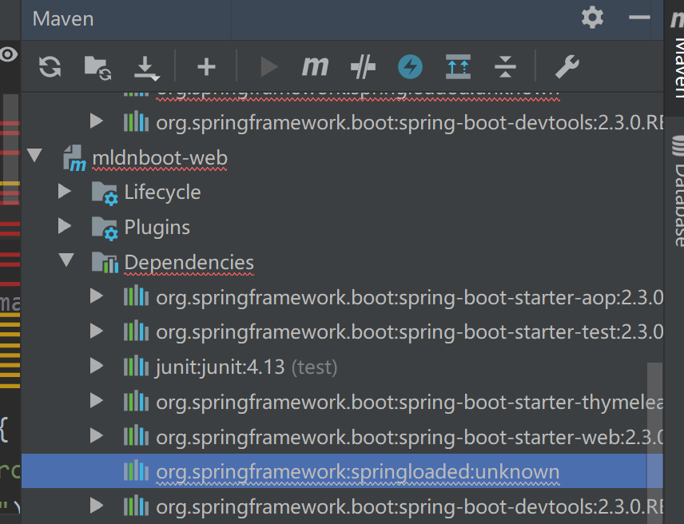
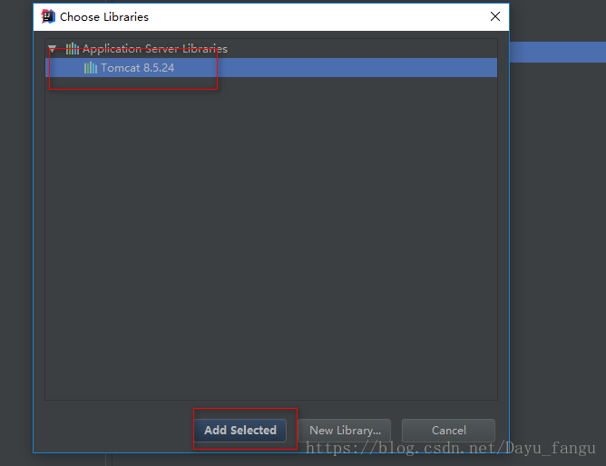
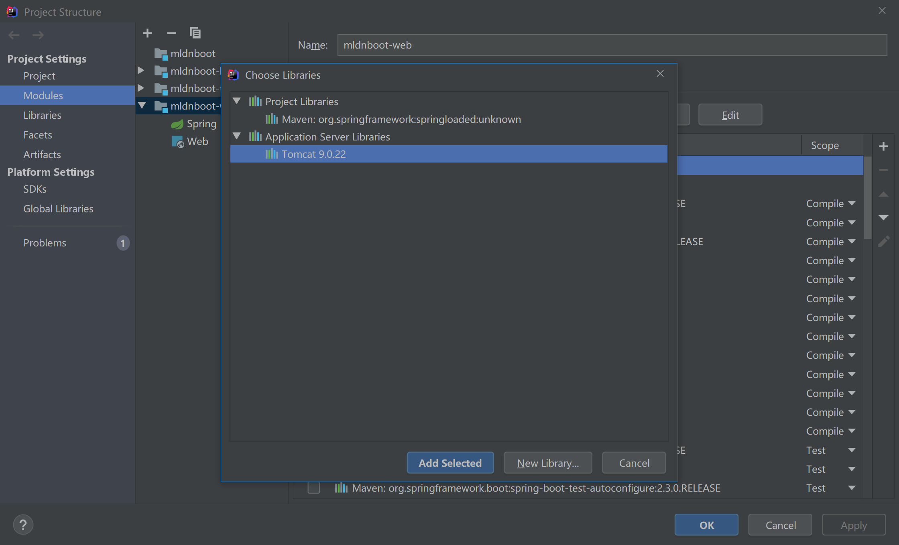

Exception in thread "main" java.lang.ClassCastException: class jdk.internal.loader.ClassLoaders$AppClassLoader cannot be cast to class java.net.URLClassLoader (jdk.internal.loader.ClassLoaders$AppClassLoader and java.net.URLClassLoader are in module java.base of loader 'bootstrap')
	at org.springframework

老版本的 spring-boot-devtools 与最新版的 JDK之间不兼容。

### 解决：

要么注释掉spring-boot-devtools，要么把JDK改为8。


我的JDK是11  那我改8吧


版本提高


注销这个  

```
<encode>${project.build.sourceEncoding}</encode>
```


管理员命令行：win徽标键+x

第一种方法：卸载iis

我的电脑-添加或删除组件-添加或删除Windows组件-IIS信息服务
去掉 IIS前面的勾然后“下一步”就可以了。

第二种方法：改iis的端口

我的电脑-右击-管理-iis管理-Default Web Site右击-编辑绑定

第三种方法：停止iis服务
第一种：在管理员命令行运行iisreset/stop
第二种：服务里关闭World Wide Web Publishing Service
第四种方法：

修改使用的软件的端口

第五种方法：

在管理员命令行运行netstat -aon|findstr 80，然后tskill 占用的端口

因为服务器上卸载时出问题，回滚！我就直接使用iisreset/stop这种了，反正不要关。
————————————————


Error:(6, 36) java: 程序包javax.validation.constraints不存在








异常


```
import javax.validation.constraints.Digits;
import javax.validation.constraints.NotNull;

import org.hibernate.validator.constraints.Email;
```


hibernate-validation.jar没下载下来，重新拉取下jar包

 重新 加载 pom 后一样

报错信息，是提示找不到，解决这个错误就可以了

应该是没网，jar没下载下来


项目中没有引用到javax的jar包


点击File选择Project Structure


在包引用里加上tomcat的运行库。


点击添加，最后勾选上点击apply完成。







spring loader unknow


```
javax.validation.constraints.Digits;
```

javax.validation.constraints.Digits;


Error:(6, 36) java: 程序包javax.validation.constraints不存在


删了


```
<!--		<dependency>-->
<!--			<groupId>org.springframework</groupId>-->
<!--			<artifactId>springloaded</artifactId>-->
<!--		</dependency>-->
```


Exception in thread "main" java.lang.ClassCastException: class jdk.internal.loader.ClassLoaders$AppClassLoader cannot be cast to class java.net.URLClassLoader (jdk.internal.loader.ClassLoaders$AppClassLoader and java.net.URLClassLoader are in module java.base of loader 'bootstrap')
	at org.springframework.boot.devtools.restart.DefaultRestartInitializer.getUrls(DefaultRestartInitializer.java:93)
	at org.springframework.boot.devtools.restart.DefaultRestartInitializer.getInitialUrls(DefaultRestartInitializer.java:56)
	at org.springframework.boot.devtools.restart.Restarter.<init>(Restarter.java:140)
	at org.springframework.boot.devtools.restart.Restarter.initialize(Restarter.java:546)
	at org.springframework.boot.devtools.restart.RestartApplicationListener.onApplicationStartingEvent(RestartApplicationListener.java:67)
	at org.springframework.boot.devtools.restart.RestartApplicationListener.onApplicationEvent(RestartApplicationListener.java:45)
	at org.springframework.context.event.SimpleApplicationEventMulticaster.doInvokeListener(SimpleApplicationEventMulticaster.java:172)
	at org.springframework.context.event.SimpleApplicationEventMulticaster.invokeListener(SimpleApplicationEventMulticaster.java:165)
	at org.springframework.context.event.SimpleApplicationEventMulticaster.multicastEvent(SimpleApplicationEventMulticaster.java:139)
	at org.springframework.context.event.SimpleApplicationEventMulticaster.multicastEvent(SimpleApplicationEventMulticaster.java:122)
	at org.springframework.boot.context.event.EventPublishingRunListener.starting(EventPublishingRunListener.java:69)
	at org.springframework.boot.SpringApplicationRunListeners.starting(SpringApplicationRunListeners.java:48)
	at org.springframework.boot.SpringApplication.run(SpringApplication.java:292)
	at org.springframework.boot.SpringApplication.run(SpringApplication.java:1118)
	at org.springframework.boot.SpringApplication.run(SpringApplication.java:1107)
	at cn.mldn.mldnboot.SpringBootStartApplication.main(SpringBootStartApplication.java:7)

Process finished with exit code 1


可以了 重新打开一下


