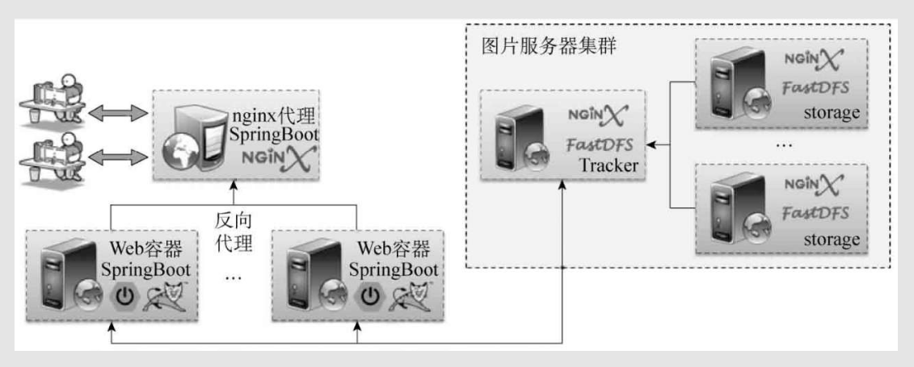

# 文件上传

[TOC]


文件上传是Web开发非常重要的操作

结合SpringBoot实现文件上传操作

## 1、基础上传

SpringBoot采用FileUpload组件实现上传处理，在控制器中可以使用MultipartFile类进行接收。

FileUpload上传  MultipartFile接收

1、建立上传控制器UploadController，利用MultipartFile将上传文件保存在本地磁盘。

一个上传文件的接口，访问接口选择把要上传的文件利用MultipartFile上传保存在本地磁盘中。

```java
@Controller
public class UploadController {
	//访问http://localhost//upload_pre 显示upload.html页面
    @GetMapping("/upload_pre")
    public String uploadPre() { // 通过model可以实现内容的传递
        return "upload";
    }

    //upload
    @PostMapping("/upload")
    @ResponseBody
    public Object upload(String name, MultipartFile photo) throws Exception {
        Map<String, Object> map = new HashMap<String, Object>();
        if (photo != null) {    // 现在有文件上传
        	//姓名
            map.put("name-param", name);
            //文件名
            map.put("photo-name", photo.getName());
            //文件类型 content-type: "image/png",
            map.put("content-type", photo.getContentType());
            //文件大小
            map.put("photo-size", photo.getSize());
            //eg: UUID + . + png
            String fileName = UUID.randomUUID() + "."
                    + photo.getContentType().substring(
                    photo.getContentType().lastIndexOf("/") + 1);    // 创建文件名称
			//文件路径  位置 + 文件名
			String filePath = ((ServletRequestAttributes) RequestContextHolder.getRequestAttributes())
                    .getRequest().getServletContext().getRealPath("/") + fileName;
            //文件路径
			map.put("photo-path", filePath);
            File saveFile = new File(filePath);
            photo.transferTo(saveFile);        // 文件保存
            return map;
        } else {
            return "nothing";
        }
    }
}


```

2、建立src/main/view/templates/upload.html页面

```html
<!DOCTYPE HTML>
<html xmlns:th="http://www.thymeleaf.org">
<head>
	<title>文件上传</title>
	<script type="text/javascript" th:src="@{/js/main.js}"></script> 
	<meta http-equiv="Content-Type" content="text/html;charset=UTF-8"/>
</head>
<body>
	<form th:action="@{/upload}" method="post" enctype="multipart/form-data">
		姓名：<input type="text" name="name"/><br/>
		照片：<input type="file" name="photo"/><br/>
		<input type="submit" value="上传"/>
	</form>
</body>
</html>
```

执行

upload.html页面表单填入姓名和选择图片点击上传向upload接口传递了姓名（文本）和图片（二进制数据）两个数据信息。控制器接收到此请求信息后，返回JSON格式信息

```json
{
photo-size: 23902,
content-type: "image/png",
photo-path: "C:\Windows\Temp\tomcat-docbase.6786357466203986968.80\2a220798-ecbe-4fae-a1c9-485d75d7dfe1.png",
photo-name: "photo",
name-param: "liuawen"
}
```

## 2、上传文件限制

在实际项目开发中，需要对用户上传文件的大小进行限制，这样才可以保证服务器的资源不被浪费。 配置yml实现上传限制

1、修改application.yml配置文件，增加上传限制。

application.yml

```
spring:
  http:
    multipart:
      enabled: true           # 启用http上传
      max-file-size: 10MB     # 设置支持的单个上传文件的大小限制
      max-request-size: 20MB  # 设置最大的请求的文件大小，设置总体大小请求
      file-size-threshold: 512KB   # 当上传文件达到指定配置量的时候会将文件内容写入磁盘
      location: /             # 设置上传的临时目录
```

2、对于上传限制，也可以利用Bean实现同样的效果。·

cn.liuawen.config  UploadConfig.java

```java
@Configuration
public class UploadConfig {
	@Bean
	public MultipartConfigElement getMultipartConfig() {
		MultipartConfigFactory config = new MultipartConfigFactory() ;
		config.setMaxFileSize("100KB"); 			// 设置上传文件的单个大小限制
		config.setMaxRequestSize("20MB"); 		// 设置总的上传的大小限制
		config.setLocation("/"); 				// 设置临时保存目录
		return config.createMultipartConfig() ;	// 创建一个上传配置
	}
}

```

设置上传文件的单个大小限制 

为了测试我把上传文件的单个大小限制设置小了点  看测试是否有异常

上传了个195KB的

http://localhost/upload

上传出错后页面执行的效果

```
错误路径：http://localhost/upload

错误信息：Could not parse multipart servlet request; nested exception is java.lang.IllegalStateException: org.apache.tomcat.util.http.fileupload.FileUploadBase$FileSizeLimitExceededException: The field photo exceeds its maximum permitted size of 102400 bytes.
```

错误 图片太大了，用户上传的内容超过了配置的限制，全局异常处理 。

## 3、上传多个文件

如果要进行多个文件的上传，需要通过MultipartHttpServletRequest进行文件接收。

1、修改upload.html页面，定义多个文件上传控件。

upload.html

```html
<!DOCTYPE HTML>
<html xmlns:th="http://www.thymeleaf.org">
<head>
	<title>SpringBoot多文件上传</title>
	<script type="text/javascript" th:src="@{/js/main.js}"></script> 
	<meta http-equiv="Content-Type" content="text/html;charset=UTF-8"/>
</head>
<body>

	<form th:action="@{/upload}" method="post" enctype="multipart/form-data">
		姓名：<input type="text" name="name"/><br/>
<!--		选择多个文件上传  这里是一个个的呀-->
		照片1：<input type="file" name="photo"/><br/>
		照片2：<input type="file" name="photo"/><br/>
		照片3：<input type="file" name="photo"/><br/>
		<input type="submit" value="上传"/>
	</form>
</body>
</html>
```


2、修改UploadController控制器，实现多个文件上传。

```java
@Controller
public class UploadController {
	@GetMapping("/upload_pre")
	public String uploadPre() { // 通过model可以实现内容的传递
		return "upload";
	}
	@PostMapping("/upload")
	@ResponseBody
	public Object upload(String name, HttpServletRequest request) {  
		List<String> result = new ArrayList<String>() ;
		//多个文件上传  就只是简单的多文件上传保存在本地的磁盘
		if (request instanceof MultipartHttpServletRequest) {
			MultipartHttpServletRequest mrequest = (MultipartHttpServletRequest) request;
			//<input type="file" name="photo"/>
			List<MultipartFile> files = mrequest.getFiles("photo");
			Iterator<MultipartFile> iter = files.iterator();
			while (iter.hasNext()) {
				MultipartFile photo = iter.next() ;		// 取出每一个上传文件
				try {
					result.add(this.saveFile(photo)) ;		// 保存上传信息
				} catch (Exception e) {
					e.printStackTrace();
				}
			}
		}
		return result ; 
	}
	/**
	 * 文件保存处理
	 * @param file 上传文件
	 * @return 文件保存路径 
	 * @throws Exception 上传异常
	 */
	public String saveFile(MultipartFile file) throws Exception {
		String path = "nothing" ;
		if (file != null) {					// 有文件上传
			if (file.getSize() > 0) {
				String fileName = UUID.randomUUID() + "."
						+ file.getContentType().substring(
								file.getContentType().lastIndexOf("/") + 1);	// 创建文件名称
				path = ((ServletRequestAttributes) RequestContextHolder.getRequestAttributes())
						.getRequest().getServletContext().getRealPath("/") + fileName;
				File saveFile = new File(path) ;
				file.transferTo(saveFile);		// 文件保存
			}
		} 
		return path ;
	}
}


```

3、测试

http://localhost/upload_pre


http://localhost/upload

```json
[
"C:\Windows\Temp\tomcat-docbase.1489099008397591870.80\c97e9432-4716-4ef8-93d0-d18f3b4ab74d.png",
"C:\Windows\Temp\tomcat-docbase.1489099008397591870.80\09bab86d-44bd-426e-8d5c-9d7c17929ae7.png",
"C:\Windows\Temp\tomcat-docbase.1489099008397591870.80\5d30e2de-f83a-4113-8c96-69b3e92de086.png"
]
```


为了方便文件上传，就简单在控制器类中定义了一个saveFile()方法，以进行文件的保存，同时利用此方法返回了上传文件的保存路径。

这里的保存上传图片都是保存到本地磁盘的，实际开发不是这样的，在当今的项目开发中，最流行的设计理念是高可用、高并发、分布式设计，所以在实际项目中需要搭建专门的图片服务器进行上传资源的保存。

图片服务器集群

如图4-10所示给读者简单地描述了一个Web集群与图片服务器集群的搭建关系。


简化的Web与图片服务器集群设计





在本书中，由于只涉及SpringBoot开发框架的使用，所以不会对此部分的内容进行讲解，有兴趣的读者可以登录www.mldn.cn自行学习。


