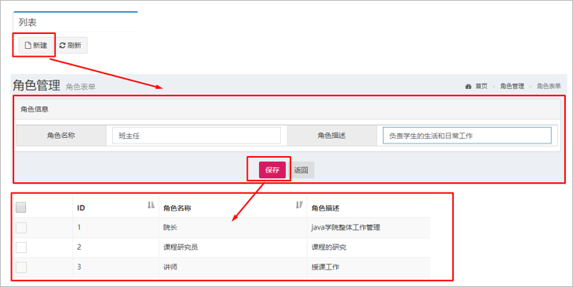
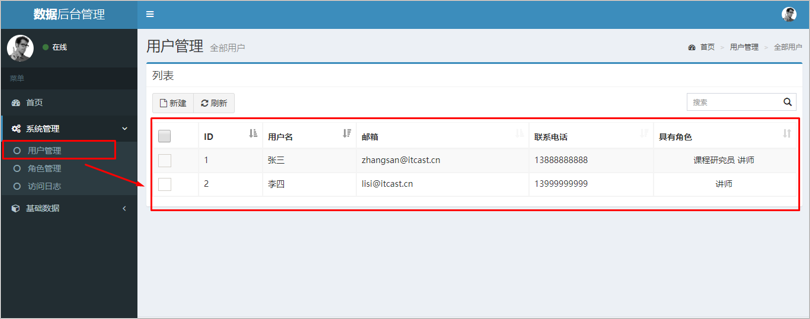

# Spring练习

## 01-Spring练习-环境搭建步骤分析(理解)

案例环境搭建步骤：

①创建工程（Project&Module）

②导入静态页面（见资料jsp页面）

③导入需要坐标（见资料中的pom.xml）

④创建包结构（controller、service、dao、domain、utils）

⑤导入数据库脚本（见资料test.sql）

⑥创建POJO类（见资料User.java和Role.java）

创建配置文件（applicationContext.xml,spring-mvc.xml,jdbc.properties,log4j.properties）

## 02-Spring练习-环境搭建实现1(应用)

创建工程,导入jsp，添加项目依赖

创建包结构，导入数据库脚本，导入POJO

## 03-Spring练习-环境搭建实现2(应用)

创建Spring的核心配置文件applicationContext.xml

创建SpringMVC核心配置文件spring-mvc.xml

创建数据库配置文件jdbc.properties

拷贝日志配置文件log4j.properties

配置web.xml如下：

```xml
<!--全局的初始化参数-->
    <context-param>
        <param-name>contextConfigLocation</param-name>
        <param-value>classpath:applicationContext.xml</param-value>
    </context-param>
    <!--Spring的监听器-->
    <listener>
        <listener-class>org.springframework.web.context.ContextLoaderListener</listener-class>
    </listener>
    <!--SpringMVC的前端控制器-->
    <servlet>
        <servlet-name>DispatcherServlet</servlet-name>
        <servlet-class>org.springframework.web.servlet.DispatcherServlet</servlet-class>
        <init-param>
            <param-name>contextConfigLocation</param-name>
            <param-value>classpath:spring-mvc.xml</param-value>
        </init-param>
        <load-on-startup>2</load-on-startup>
    </servlet>
    <servlet-mapping>
        <servlet-name>DispatcherServlet</servlet-name>
        <url-pattern>/</url-pattern>
    </servlet-mapping>

```


## 04-Spring练习-环境搭建实现3(应用)

配置springm-mvc.xml：注解驱动，视图解析器，静态资源的开放

配置如下：

```xml
<!--1、mvc注解驱动-->
    <mvc:annotation-driven/>

    <!--2、配置视图解析器-->
    <bean class="org.springframework.web.servlet.view.InternalResourceViewResolver">
        <property name="prefix" value="/pages/"/>
        <property name="suffix" value=".jsp"/>
    </bean>

    <!--3、静态资源权限开放-->
    <mvc:default-servlet-handler/>

```

## 05-Spring练习-环境搭建实现4(应用)

配置applicationContext.xml：加载propertiest,配置数据源对象，配置JdbcTemplate对象

配置如下：

```xml
<?xml version="1.0" encoding="UTF-8"?>
<beans xmlns="http://www.springframework.org/schema/beans"
       xmlns:xsi="http://www.w3.org/2001/XMLSchema-instance"
       xmlns:context="http://www.springframework.org/schema/context"
       xsi:schemaLocation="
       http://www.springframework.org/schema/beans http://www.springframework.org/schema/beans/spring-beans.xsd
       http://www.springframework.org/schema/context http://www.springframework.org/schema/context/spring-context.xsd
">
<!--1、加载jdbc.properties-->
    <context:property-placeholder location="classpath:jdbc.properties"/>

    <!--2、配置数据源对象-->
    <bean id="dataSource" class="com.mchange.v2.c3p0.ComboPooledDataSource">
        <property name="driverClass" value="${jdbc.driver}"/>
        <property name="jdbcUrl" value="${jdbc.url}"/>
        <property name="user" value="${jdbc.username}"/>
        <property name="password" value="${jdbc.password}"/>
    </bean>

    <!--3、配置JdbcTemplate对象-->
    <bean id="jdbcTemplate" class="org.springframework.jdbc.core.JdbcTemplate">
        <property name="dataSource" ref="dataSource"></property>
    </bean>
</beans>
```

## 06-Spring练习-用户表和角色表的分析(理解)

分析用户和角色在数据库设计中的表关系：多对多关系，关系如图所示：


一对多    多对一

多对多     中间表

用户角色中间表  中间表  


用户  角色  多对多关系

role  user 

角色  角色名   

用户  用户名  邮箱  密码  手机号

```mysql
/*
SQLyog Ultimate v12.09 (64 bit)
MySQL - 5.7.24-log : Database - test
*********************************************************************
*/


/*!40101 SET NAMES utf8 */;

/*!40101 SET SQL_MODE=''*/;

/*!40014 SET @OLD_UNIQUE_CHECKS=@@UNIQUE_CHECKS, UNIQUE_CHECKS=0 */;
/*!40014 SET @OLD_FOREIGN_KEY_CHECKS=@@FOREIGN_KEY_CHECKS, FOREIGN_KEY_CHECKS=0 */;
/*!40101 SET @OLD_SQL_MODE=@@SQL_MODE, SQL_MODE='NO_AUTO_VALUE_ON_ZERO' */;
/*!40111 SET @OLD_SQL_NOTES=@@SQL_NOTES, SQL_NOTES=0 */;
CREATE DATABASE /*!32312 IF NOT EXISTS*/`test` /*!40100 DEFAULT CHARACTER SET utf8 */;

USE `test`;

/*Table structure for table `sys_role` */

DROP TABLE IF EXISTS `sys_role`;

CREATE TABLE `sys_role` (
  `id` bigint(20) NOT NULL AUTO_INCREMENT,
  `roleName` varchar(50) DEFAULT NULL,
  `roleDesc` varchar(50) DEFAULT NULL,
  PRIMARY KEY (`id`)
) ENGINE=InnoDB AUTO_INCREMENT=5 DEFAULT CHARSET=utf8;

/*Data for the table `sys_role` */

insert  into `sys_role`(`id`,`roleName`,`roleDesc`) values (1,'院长','负责全面工作'),(2,'研究员','课程研发工作'),(3,'讲师','授课工作'),(4,'助教','协助解决学生的问题');

/*Table structure for table `sys_user` */

DROP TABLE IF EXISTS `sys_user`;

CREATE TABLE `sys_user` (
  `id` bigint(20) NOT NULL AUTO_INCREMENT,
  `username` varchar(50) DEFAULT NULL,
  `email` varchar(50) DEFAULT NULL,
  `password` varchar(80) DEFAULT NULL,
  `phoneNum` varchar(20) DEFAULT NULL,
  PRIMARY KEY (`id`)
) ENGINE=InnoDB AUTO_INCREMENT=4 DEFAULT CHARSET=utf8;

/*Data for the table `sys_user` */

insert  into `sys_user`(`id`,`username`,`email`,`password`,`phoneNum`) values (1,'zhangsan','zhangsan@itcast.cn','123','13888888888'),(2,'lisi','lisi@itcast.cn','123','13999999999'),(3,'wangwu','wangwu@itcast.cn','123','18599999999');

/*Table structure for table `sys_user_role` */

DROP TABLE IF EXISTS `sys_user_role`;

CREATE TABLE `sys_user_role` (
  `userId` bigint(20) NOT NULL,
  `roleId` bigint(20) NOT NULL,
  PRIMARY KEY (`userId`,`roleId`),
  KEY `roleId` (`roleId`),
  CONSTRAINT `sys_user_role_ibfk_1` FOREIGN KEY (`userId`) REFERENCES `sys_user` (`id`),
  CONSTRAINT `sys_user_role_ibfk_2` FOREIGN KEY (`roleId`) REFERENCES `sys_role` (`id`)
) ENGINE=InnoDB DEFAULT CHARSET=utf8;

/*Data for the table `sys_user_role` */

insert  into `sys_user_role`(`userId`,`roleId`) values (1,1),(1,2),(2,2),(2,3);

/*!40101 SET SQL_MODE=@OLD_SQL_MODE */;
/*!40014 SET FOREIGN_KEY_CHECKS=@OLD_FOREIGN_KEY_CHECKS */;
/*!40014 SET UNIQUE_CHECKS=@OLD_UNIQUE_CHECKS */;
/*!40111 SET SQL_NOTES=@OLD_SQL_NOTES */;

```


## 07-Spring练习-角色列表展示分析(理解)

需求：角色列表展示，需求如图所示：


找入口呀 

点击看到这个东西   发请求 找controller 

service  dao 数据库   Model 转发页面


完成该功能的思路和步骤为：

①点击角色管理菜单发送请求到服务器端（修改角色管理菜单的url地址）

②创建RoleController和list()方法

③创建RoleService和list()方法

④创建RoleDao和findAll()方法

⑤使用JdbcTemplate完成查询操作

⑥将查询数据存储到modelAndView中

⑦转发到role-list.jsp页面进行展示

## 08-Spring练习-角色列表展示-controller层实现(应用)

1：修改左侧菜单链接地址

```jsp
<ul class="treeview-menu">

					<li><a
						href="${pageContext.request.contextPath}/user/list"> <i
							class="fa fa-circle-o"></i> 用户管理
					</a></li>
					<li><a
						href="${pageContext.request.contextPath}/role/list"> <i
							class="fa fa-circle-o"></i> 角色管理
					</a></li>
					<li><a
						href="${pageContext.request.contextPath}/pages/syslog-list.jsp"> <i
							class="fa fa-circle-o"></i> 访问日志
					</a></li>
				</ul>
```

Controller层代码：

```java
@RequestMapping("/role")
@Controller
public class RoleController {

    @Autowired
    private RoleService roleService;
    
    @RequestMapping("/list")
    public ModelAndView list(){
        ModelAndView modelAndView = new ModelAndView();
        List<Role> roleList = roleService.list();
        //设置模型
        modelAndView.addObject("roleList",roleList);
        //设置视图
        modelAndView.setViewName("role-list");
        System.out.println(roleList);
        return modelAndView;
    }

}
```


## 09-Spring练习-角色列表展示-service和dao层实现(应用)

service层代码：

```java
public class RoleServiceImpl implements RoleService {

    private RoleDao roleDao;
    public void setRoleDao(RoleDao roleDao) {
        this.roleDao = roleDao;
    }

    public List<Role> list() {
        List<Role> roleList = roleDao.findAll();
        return roleList;
    }
}
```

dao层代码：

```java
public class RoleDaoImpl implements RoleDao {

    private JdbcTemplate jdbcTemplate;
    public void setJdbcTemplate(JdbcTemplate jdbcTemplate) {
        this.jdbcTemplate = jdbcTemplate;
    }

    public List<Role> findAll() {
        List<Role> roleList = jdbcTemplate.query("select * from sys_role", new BeanPropertyRowMapper<Role>(Role.class));
        return roleList;
    }
}

```

## 10-Spring练习-角色列表展示-配置实现(应用)

配置spring-mvc.xml

```xml
<!--4、组件扫描  扫描Controller-->
    <context:component-scan base-package="com.itheima.controller"/>

```

配置applicationContext.xml

```xml
<!--配置RoleService-->
    <bean id="roleService" class="com.itheima.service.impl.RoleServiceImpl">
        <property name="roleDao" ref="roleDao"/>
    </bean>
    <!--配置RoleDao-->
    <bean id="roleDao" class="com.itheima.dao.impl.RoleDaoImpl">
        <property name="jdbcTemplate" ref="jdbcTemplate"/>
    </bean>

```


## 11-Spring练习-角色列表展示-页面展示(应用)

在role-list.jsp中将数据取出来并展示,核心代码如下：

```jsp
<c:forEach items="${roleList}" var="role">
<tr>
	<td><input name="ids" type="checkbox"></td>
	<td>${role.id}</td>
	<td>${role.roleName}</td>
	<td>${role.roleDesc}</td>
	<td class="text-center">
	<a href="javascript:void(0);" class="btn bg-olive btn-xs">删除</a>
	</td>
</tr>
</c:forEach>

```

## 12-Spring练习-角色的添加操作(应用)

需求：添加角色，需求图如下：



操作步骤如下：

①点击列表页面新建按钮跳转到角色添加页面

②输入角色信息，点击保存按钮，表单数据提交服务器

③编写RoleController的save()方法

④编写RoleService的save()方法

⑤编写RoleDao的save()方法

⑥使用JdbcTemplate保存Role数据到sys_role

⑦跳转回角色列表页面

controller代码如下：

```java
@RequestMapping("/save")
    public String save(Role role){
        roleService.save(role);
        return "redirect:/role/list";
    }

```

service代码如下：

```java
public void save(Role role) {
        roleDao.save(role);
    }

```

dao代码如下：

```java
public void save(Role role) {
        jdbcTemplate.update("insert into sys_role values(?,?,?)",null,role.getRoleName(),role.getRoleDesc());
    }

```

为了解决post提交中文乱码问题，需要在web.xml中配置全局乱码过滤器

```xml
<!--解决乱码的过滤器-->    
<filter>
        <filter-name>CharacterEncodingFilter</filter-name>
        <filter-class>org.springframework.web.filter.CharacterEncodingFilter</filter-class>
        <init-param>
            <param-name>encoding</param-name>
            <param-value>UTF-8</param-value>
        </init-param>
    </filter>
    <filter-mapping>
        <filter-name>CharacterEncodingFilter</filter-name>
        <url-pattern>/*</url-pattern>
    </filter-mapping>

```

测试，完成该功能。

## 13-Spring练习-用户列表展示1(应用)

需求：查询用户列表，需求图如下：



完成该功能的操作步骤：

①点击用户管理菜单发送请求到服务器端（修改用户管理菜单的url地址）

②创建UserController和list()方法

③创建UserService和list()方法

④创建UserDao和findAll()方法

⑤使用JdbcTemplate完成查询操作

⑥将查询数据存储到modelAndView中

⑦转发到user-list.jsp页面进行展示


跟查询角色列表一样，查询用户列表，创建UserController,UserService,UserDao,User实体等结构，编写各层代码并配置

用户列表Controller,service,dao层代码如下：

controller

```java
@RequestMapping("/list")
    public ModelAndView list(){
        List<User> userList = userService.list();
        ModelAndView modelAndView = new ModelAndView();
        modelAndView.addObject("userList",userList);
        modelAndView.setViewName("user-list");
        return modelAndView;
    }

```

service:

```java
public List<User> list() {
        List<User> userList = userDao.findAll();
        //封装userList中的每一个User的roles数据
        return userList;
    }

```

dao:

```java
public List<User> findAll() {
        List<User> userList = jdbcTemplate.query("select * from sys_user", new BeanPropertyRowMapper<User>(User.class));
        return userList;
    }

```

## 14-Spring练习-用户列表展示2(应用)

查询用户的时候关联查询出该用户所具有的所有角色信息,需要完善查询用户的service层代码

1，在角色的dao中添加方法，根据用户id查询角色列表

```java
//在角色dao中根据用户id查询用户具有的角色信息
 
public List<Role> findRoleByUserId(Long id) {
        List<Role> roles = jdbcTemplate.query("select * from sys_user_role ur,sys_role r where ur.roleId=r.id and ur.userId=?", new BeanPropertyRowMapper<Role>(Role.class), id);
        return roles;
    }

```

完善userservcie层代码如下：

```java
//在查询用户的service中关联查询用户具有的角色
public List<User> list() {
        List<User> userList = userDao.findAll();
        //封装userList中的每一个User的roles数据
        for (User user : userList) {
            //获得user的id
            Long id = user.getId();
            //将id作为参数 查询当前userId对应的Role集合数据
            List<Role> roles = roleDao.findRoleByUserId(id);
            user.setRoles(roles);
        }
        return userList;
    }

```

查询用户的时候关联查询出该用户所具有的所有角色信息，前端jsp页面核心代码

```jsp
<c:forEach items="${userList}" var="user">
<tr>
	<td><input name="ids" type="checkbox"></td>
	<td>${user.id}</td>
	<td>${user.username}</td>
	<td>${user.email}</td>
	<td>${user.phoneNum}</td>
	<td class="text-center">
		<c:forEach items="${user.roles}" var="role">
		&nbsp;&nbsp;${role.roleName}
		</c:forEach>
	</td>
	<td class="text-center">
		<a href="javascript:void(0);" onclick="delUser('${user.id}')" class="btn bg-olive btn-xs">删除</a>
	</td>
</tr>
</c:forEach>

```


## 15-Spring练习-用户添加操作-添加页面展示(应用)

需求：添加用户，需求图如下：


新建用户时，点击新建按钮先去到添加用户的页面user-add.jsp,在添加用户页面需要展示可供选择的角色信息，因此来到添加页面时需要查询所有的角色信息并展示

去到user-add.jsp页面时先查询所有角色信息的controller代码

```java
@RequestMapping("/saveUI")
    public ModelAndView saveUI(){
        ModelAndView modelAndView = new ModelAndView();
        List<Role> roleList = roleService.list();
        modelAndView.addObject("roleList",roleList);
        modelAndView.setViewName("user-add");
        return modelAndView;
    }
```

因为查询所有角色信息的service层和dao层代码在之前角色列表展示功能的时候已经写了，因此只需调用即可，

在user-add.jsp页面展示所有角色信息的核心代码

```jsp
<div class="col-md-10 data">
	<c:forEach items="${roleList}" var="role">
	<input class="" type="checkbox" name="roleIds" value="${role.id}">${role.roleName}
</c:forEach>
</div>

```


## 16-Spring练习-用户添加操作-添加数据到数据库(应用)

添加用户页面有两部分数据，一部分属于用户基础数据需要插入到用户表user中，另一部分是用户的角色数据，需要插入到中间表sys_user_role中

user-add.jsp页面提交数据到controller完成数据添加操作的controller层和service层代码分别如下：

```java
//controller层代码
@RequestMapping("/save")
    public String save(User user,Long[] roleIds){
        userService.save(user,roleIds);
        return "redirect:/user/list";
    }

```

```java
//service层代码
public void save(User user, Long[] roleIds) {
        //第一步 向sys_user表中存储数据
        Long userId = userDao.save(user);
        //第二步 向sys_user_role 关系表中存储多条数据
        userDao.saveUserRoleRel(userId,roleIds);
    }

```

dao层代码因为还需要重新构建，因此学完下一个章节后重新编写，因为这里留下了一个问题，在dao层操作后如何获得自增的主键id值呢?

## 17-Spring练习-用户添加操作-添加数据到数据库2(应用)

添加用户时用户分配的角色信息应存储到中间表sys_user_role表中，需要用户的id，角色的id，而角色的id由前台页面点选的，用户的id应该是在保存操作由mysql主键自动生成的，那如何获取mysql自增的主键值呢？

使用JdbcTemplate执行插入操作时获取mysql自增的主键值：

添加操作的dao层代码如下：

```java

```

```java
public void saveUserRoleRel(Long userId, Long[] roleIds) {
        for (Long roleId : roleIds) {
            jdbcTemplate.update("insert into sys_user_role values(?,?)",userId,roleId);
        }
    }

```


## 18-Spring练习-删除用户操作(应用)

删除用户功能的需求如图所示:


操作步骤如下：

①点击用户列表的删除按钮，发送请求到服务器端

②编写UserController的del()方法

③编写UserService的del()方法

⑤编写UserDao的delUserRoleRel()方法

⑥跳回当前用户列表页面

完成用户的删除操作，不仅要删除用户表数据，同时需要将用户和角色的关联表数据进行删除：

controller代码

```java
@RequestMapping("/del/{userId}")
    public String del(@PathVariable("userId") Long userId){
        userService.del(userId);
        return "redirect:/user/list";
    }

```

service代码

```java
public void del(Long userId) {
        //1、删除sys_user_role关系表
        userDao.delUserRoleRel(userId);
        //2、删除sys_user表
        userDao.del(userId);
    }

```

dao代码:不仅要删除用户表数据，同时需要将用户和角色的关联表数据进行删除

```java
public void delUserRoleRel(Long userId) {
        jdbcTemplate.update("delete from sys_user_role where userId=?",userId);
    }

    public void del(Long userId) {
        jdbcTemplate.update("delete from sys_user where id=?",userId);
    }

```

