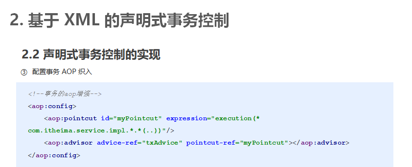
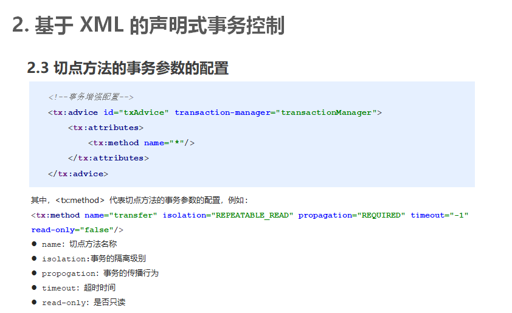
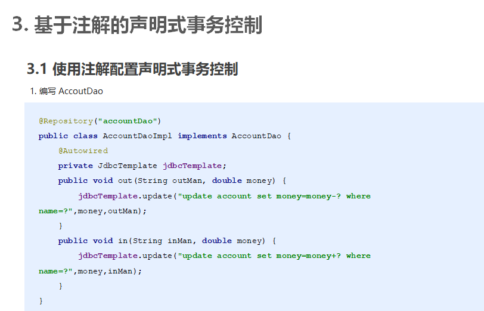
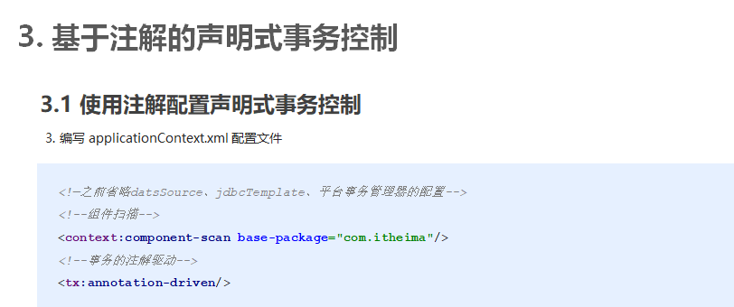

看PPT

**JdbcTemplate**


## 1.Spring JdbcTemplate基本使用

## 1.1 JdbcTemplate概述

它是spring框架中提供的一个对象，是对原始繁琐的Jdbc API对象的简单封装。spring框架为我们提供了很多的操作模板类。例如：操作关系型数据的JdbcTemplate和HibernateTemplate，操作nosql数据库的RedisTemplate，操作消息队列的JmsTemplate等等。

JdbcTemaplte是Spring框架中提供的一个对象 

是对原始繁琐的Jdbc API对象的简单封装

Spring框架为我们提供了很多的操作模板类  

操作关系型数据的JdbcTemplate和HibernateTempalte

操作NoSQL数据库的RedisTemplate

操作消息队列的JmsTemplate等 

## 1.2 JdbcTemplate开发步骤

导入spring-jdbc和spring-tx坐标   依赖
创建数据库表和实体
创建JdbcTemplate对象
执行数据库操作

## 1.3 JdbcTemplate快速入门

①导入坐标

```xml
 <!--导入spring的jdbc坐标-->
        <dependency>
            <groupId>org.springframework</groupId>
            <artifactId>spring-jdbc</artifactId>
            <version>5.2.6.RELEASE</version>
        </dependency>
        <!--导入spring的tx坐标-->
        <dependency>
            <groupId>org.springframework</groupId>
            <artifactId>spring-tx</artifactId>
            <version>5.2.6.RELEASE</version>
        </dependency>
```

②创建accout表和Accout实体

name varchar(50)

money double 

```java
public class Accout{
    private String name;
    private double moneey;
    //set get ...
}
```

domain  

```java
public class Account {

    private String name;
    private double money;

    public String getName() {
        return name;
    }

    public void setName(String name) {
        this.name = name;
    }

    public double getMoney() {
        return money;
    }

    public void setMoney(double money) {
        this.money = money;
    }

    @Override
    public String toString() {
        return "Account{" +
                "name='" + name + '\'' +
                ", money=" + money +
                '}';
    }
}

```


③创建JdbcTemplate对象

④执行数据库操作

```java
 @Test
    //测试JdbcTemplate开发步骤
    public void test1() throws PropertyVetoException {
        //创建数据源对象
        ComboPooledDataSource dataSource = new ComboPooledDataSource();
        dataSource.setDriverClass("com.mysql.jdbc.Driver");
        dataSource.setJdbcUrl("jdbc:mysql://localhost:3306/test");
        dataSource.setUser("root");
        dataSource.setPassword("root");
		//创建JdbcTemplate对象
        JdbcTemplate jdbcTemplate = new JdbcTemplate();
        //设置数据源给JdbcTemplate
        //设置数据源对象  知道数据库在哪
        jdbcTemplate.setDataSource(dataSource);
        //执行操作
        int row = jdbcTemplate.update("insert into account values(?,?)", "liuawen", 1234567);
        System.out.println(row);

    }
```

## 1.4 Spring产生JdbcTemplate对象

我们可以将JdbcTemplate的创建权交给Spring，将数据源DataSource的创建权也交给Spring，在Spring容器内部将数据源DataSource注入到JdbcTemplate模版对象中，配置如下：

jdbc.properties

```properties
jdbc.driver=com.mysql.jdbc.Driver
jdbc.url=jdbc:mysql://localhost:3306/test
jdbc.username=root
jdbc.password=root
```

applicationContext.xml

```xml
<?xml version="1.0" encoding="UTF-8"?>
<beans xmlns="http://www.springframework.org/schema/beans"
       xmlns:xsi="http://www.w3.org/2001/XMLSchema-instance"
       xmlns:context="http://www.springframework.org/schema/context"
       xsi:schemaLocation="
       http://www.springframework.org/schema/beans http://www.springframework.org/schema/beans/spring-beans.xsd
       http://www.springframework.org/schema/context http://www.springframework.org/schema/context/spring-context.xsd
">

    <!--加载jdbc.properties-->
    <context:property-placeholder location="classpath:jdbc.properties"/>

    <!--数据源对象-->
    <bean id="dataSource" class="com.mchange.v2.c3p0.ComboPooledDataSource">
        <property name="driverClass" value="${jdbc.driver}"/>
        <property name="jdbcUrl" value="${jdbc.url}"/>
        <property name="user" value="${jdbc.username}"/>
        <property name="password" value="${jdbc.password}"/>
    </bean>

    <!--jdbc模板对象-->
    <bean id="jdbcTemplate" class="org.springframework.jdbc.core.JdbcTemplate">
        <property name="dataSource" ref="dataSource"/>
    </bean>

</beans>
```

从容器中获得JdbcTemplate进行添加操作

```java
  @Test
    //测试Spring产生jdbcTemplate对象
    public void test2() throws PropertyVetoException {
        ApplicationContext app = new ClassPathXmlApplicationContext("applicationContext.xml");
        JdbcTemplate jdbcTemplate = app.getBean(JdbcTemplate.class);
        int row = jdbcTemplate.update("insert into account values(?,?)", "awen", 7654321);
        System.out.println(row);
    }
```

## 1.5 JdbcTemplate的常用操作

修改操作

```java
    //测试修改操作
    @Test
    public void testUpdate() {
        jdbcTemplate.update("update account set money=? where name=?", 10000, "liuawen");
    }
```

删除和查询全部操作

```java
 @Test
    public void testDelete() {
        jdbcTemplate.update("delete from account where name=?", "liuawen");
    }
```

```java
  //测试查询所有对象操作
    @Test
    public void testQueryAll() {
        List<Account> accountList = jdbcTemplate.query("select * from account", new BeanPropertyRowMapper<Account>(Account.class));
        System.out.println(accountList);
    }
```


查询单个数据操作操作

```java
  //测试查询单个对象操作
    @Test
    public void testQueryOne() {
        Account account = jdbcTemplate.queryForObject("select * from account where name=?", new BeanPropertyRowMapper<Account>(Account.class), "tom");
        System.out.println(account);
    }
```

```java
//测试查询单个简单数据操作(聚合查询)
    @Test
    public void testQueryCount() {
        Long count = jdbcTemplate.queryForObject("select count(*) from account", Long.class);
        System.out.println(count);
    }
```

JdbcTemplateCRUDTest

```java
@RunWith(SpringJUnit4ClassRunner.class)
@ContextConfiguration("classpath:applicationContext.xml")
public class JdbcTemplateCRUDTest {

    @Autowired
    private JdbcTemplate jdbcTemplate;

    //测试查询单个简单数据操作(聚合查询)
    @Test
    public void testQueryCount() {
        Long count = jdbcTemplate.queryForObject("select count(*) from account", Long.class);
        System.out.println(count);
    }

    //测试查询单个对象操作
    @Test
    public void testQueryOne() {
        Account account = jdbcTemplate.queryForObject("select * from account where name=?", new BeanPropertyRowMapper<Account>(Account.class), "tom");
        System.out.println(account);
    }
    //测试查询所有对象操作
    @Test
    public void testQueryAll() {
        List<Account> accountList = jdbcTemplate.query("select * from account", new BeanPropertyRowMapper<Account>(Account.class));
        System.out.println(accountList);
    }

    //测试修改操作
    @Test
    public void testUpdate() {
        jdbcTemplate.update("update account set money=? where name=?", 10000, "liuawen");
    }

    @Test
    public void testDelete() {
        jdbcTemplate.update("delete from account where name=?", "liuawen");
    }

}

```


## 1.6 知识要点

导入spring-jdbc和spring-tx坐标
创建数据库表和实体
创建JdbcTemplate对象
    JdbcTemplate jdbcTemplate = new JdbcTemplate();    jdbcTemplate.setDataSource(dataSource);
执行数据库操作
    更新操作：
        jdbcTemplate.update (sql,params)
    查询操作：
        jdbcTemplate.query (sql,Mapper,params)
    jdbcTemplate.queryForObject(sql,Mapper,params)


**声明式事务控制**

编程式事务控制相关对象

基于 XML 的声明式事务控制

基于注解的声明式事务控制

# 1. 编程式事务控制相关对象

## 1.1 PlatformTransactionManager

PlatformTransactionManager 接口是 spring 的事务管理器，它里面提供了我们常用的操作事务的方法。

| **方法**                                                     | **说明**           |
| ------------------------------------------------------------ | ------------------ |
| TransactionStatus  getTransaction(TransactionDefination  defination) | 获取事务的状态信息 |
| void  commit(TransactionStatus  status)                      | 提交事务           |
| void  rollback(TransactionStatus  status)                    | 回滚事务           |


**注意：**

PlatformTransactionManager 是接口类型，不同的 Dao 层技术则有不同的实现类，例如：Dao 层技术是jdbc 或 mybatis 时：org.springframework.jdbc.datasource.DataSourceTransactionManager

Dao 层技术是hibernate时：org.springframework.orm.hibernate5.HibernateTransactionManager


操作事务的方法 

## 1.2 TransactionDefinition

TransactionDefinition 是事务的定义信息对象，里面有如下方法：


| **方法**                      | **说明**           |
| ----------------------------- | ------------------ |
| int  getIsolationLevel()      | 获得事务的隔离级别 |
| int  getPropogationBehavior() | 获得事务的传播行为 |
| int  getTimeout()             | 获得超时时间       |
| boolean  isReadOnly()         | 是否只读           |

1. 事务隔离级别

设置隔离级别，可以解决事务并发产生的问题，如脏读、不可重复读和虚读。

 ISOLATION_DEFAULT
 ISOLATION_READ_UNCOMMITTED
 ISOLATION_READ_COMMITTED
 ISOLATION_REPEATABLE_READ
 ISOLATION_SERIALIZABLE

2. 事务传播行为

 REQUIRED：如果当前没有事务，就新建一个事务，如果已经存在一个事务中，加入到这个事务中。一般的选择（默认值）
 SUPPORTS：支持当前事务，如果当前没有事务，就以非事务方式执行（没有事务）
 MANDATORY：使用当前的事务，如果当前没有事务，就抛出异常
 REQUERS_NEW：新建事务，如果当前在事务中，把当前事务挂起。
 NOT_SUPPORTED：以非事务方式执行操作，如果当前存在事务，就把当前事务挂起
 NEVER：以非事务方式运行，如果当前存在事务，抛出异常
 NESTED：如果当前存在事务，则在嵌套事务内执行。如果当前没有事务，则执行 REQUIRED 类似的操作
 超时时间：默认值是-1，没有超时限制。如果有，以秒为单位进行设置
 是否只读：建议查询时设置为只读

## 1.3 TransactionStatus

TransactionStatus 接口提供的是事务具体的运行状态，方法介绍如下。

| **方法**                    | **说明**       |
| --------------------------- | -------------- |
| boolean  hasSavepoint()     | 是否存储回滚点 |
| boolean  isCompleted()      | 事务是否完成   |
| boolean  isNewTransaction() | 是否是新事务   |
| boolean  isRollbackOnly()   | 事务是否回滚   |


## 1.4 知识要点

编程式事务控制三大对象
PlatformTransactionManager
TransactionDefinition
TransactionStatus

# 2.基于 XML 的声明式事务控制

## 2.1 什么是声明式事务控制

Spring 的声明式事务顾名思义就是采用声明的方式来处理事务。这里所说的声明，就是指在配置文件中声明，用在 Spring 配置文件中声明式的处理事务来代替代码式的处理事务。

声明式事务控制 在配置文件中声明 

声明式事务处理的作用

 事务管理不侵入开发的组件。具体来说，业务逻辑对象就不会意识到正在事务管理之中，事实上也应该如此，因为事务管理是属于系统层面的服务，而不是业务逻辑的一部分，如果想要改变事务管理策划的话，也只需要在定义文件中重新配置即可
 在不需要事务管理的时候，只要在设定文件上修改一下，即可移去事务管理服务，无需改变代码重新编译，这样维护起来极其方便

注意：Spring 声明式事务控制底层就是AOP。

## 2.2 声明式事务控制的实现

声明式事务控制明确事项：
谁是切点？
谁是通知？
配置切面？

①引入tx命名空间

```xml
<beans xmlns="http://www.springframework.org/schema/beans"
       xmlns:xsi="http://www.w3.org/2001/XMLSchema-instance"
       xmlns:aop="http://www.springframework.org/schema/aop"
       xmlns:tx="http://www.springframework.org/schema/tx"
       xsi:schemaLocation="
       http://www.springframework.org/schema/beans http://www.springframework.org/schema/beans/spring-beans.xsd
       http://www.springframework.org/schema/aop http://www.springframework.org/schema/aop/spring-aop.xsd
       http://www.springframework.org/schema/tx http://www.springframework.org/schema/tx/spring-tx.xsd
">

```


②配置事务增强

```xml
 <!--配置平台事务管理器-->
    <bean id="transactionManager" class="org.springframework.jdbc.datasource.DataSourceTransactionManager">
        <property name="dataSource" ref="dataSource"/>
    </bean>

    <!--通知  事务的增强-->
    <tx:advice id="txAdvice" transaction-manager="transactionManager">
        <!--设置事务的属性信息的-->
        <tx:attributes>
            <tx:method name="transfer" isolation="REPEATABLE_READ" propagation="REQUIRED" read-only="false"/>
            <tx:method name="save" isolation="REPEATABLE_READ" propagation="REQUIRED" read-only="false"/>
            <tx:method name="findAll" isolation="REPEATABLE_READ" propagation="REQUIRED" read-only="true"/>
            <tx:method name="update*" isolation="REPEATABLE_READ" propagation="REQUIRED" read-only="true"/>
            <tx:method name="*"/>
        </tx:attributes>
    </tx:advice>

```


③配置事务 AOP 织入

```xml


```



④测试事务控制转账业务代码

```java
<!--配置事务的aop织入-->
    <aop:config>
        <aop:pointcut id="txPointcut" expression="execution(* com.itheima.service.impl.*.*(..))"/>
        <aop:advisor advice-ref="txAdvice" pointcut-ref="txPointcut"/>
    </aop:config>
```


2.3 切点方法的事务参数的配置




```xml
<!--通知  事务的增强-->
    <tx:advice id="txAdvice" transaction-manager="transactionManager">
        <!--设置事务的属性信息的-->
        <tx:attributes>
            <tx:method name="transfer" isolation="REPEATABLE_READ" propagation="REQUIRED" read-only="false"/>
            <tx:method name="save" isolation="REPEATABLE_READ" propagation="REQUIRED" read-only="false"/>
            <tx:method name="findAll" isolation="REPEATABLE_READ" propagation="REQUIRED" read-only="true"/>
            <tx:method name="update*" isolation="REPEATABLE_READ" propagation="REQUIRED" read-only="true"/>
            <tx:method name="*"/>
        </tx:attributes>
    </tx:advice>
```


其中，<tx:method> 代表切点方法的事务参数的配置，例如：
<tx:method name="transfer" isolation="REPEATABLE_READ" propagation="REQUIRED" timeout="-1" read-only="false"/>
name：切点方法名称
isolation:事务的隔离级别
propogation：事务的传播行为
timeout：超时时间
read-only：是否只读

## 2.4 知识要点

声明式事务控制的配置要点
平台事务管理器配置
事务通知的配置
事务aop织入的配置

# 3. 基于注解的声明式事务控制

## 3.1 使用注解配置声明式事务控制

1. 编写 AccoutDao



2. 编写 AccoutService


3. 编写 applicationContext.xml 配置文件



## 3.2 注解配置声明式事务控制解析

使用 @Transactional 在需要进行事务控制的类或是方法上修饰，注解可用的属性同 xml 配置方式，例如隔离级别、传播行为等。
注解使用在类上，那么该类下的所有方法都使用同一套注解参数配置。
使用在方法上，不同的方法可以采用不同的事务参数配置。
Xml配置文件中要开启事务的注解驱动<tx:annotation-driven />

## 3.3 知识要点

注解声明式事务控制的配置要点
平台事务管理器配置（xml方式）
事务通知的配置（@Transactional注解配置）
事务注解驱动的配置 <tx:annotation-driven/>