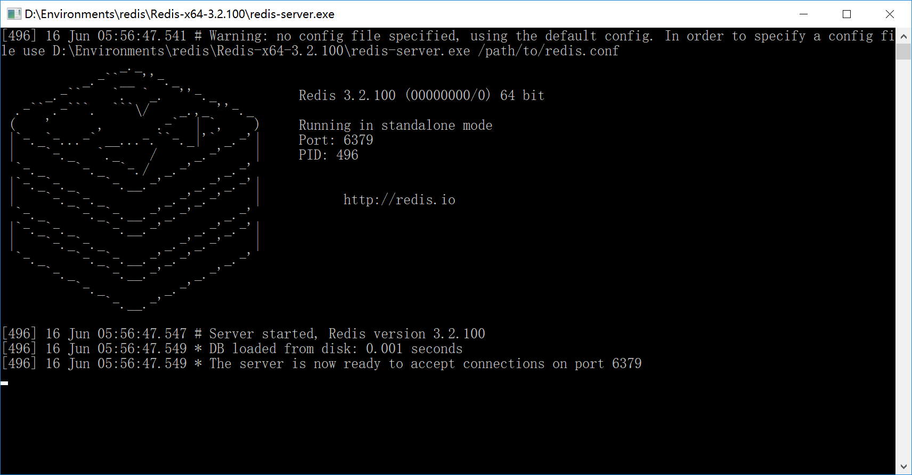
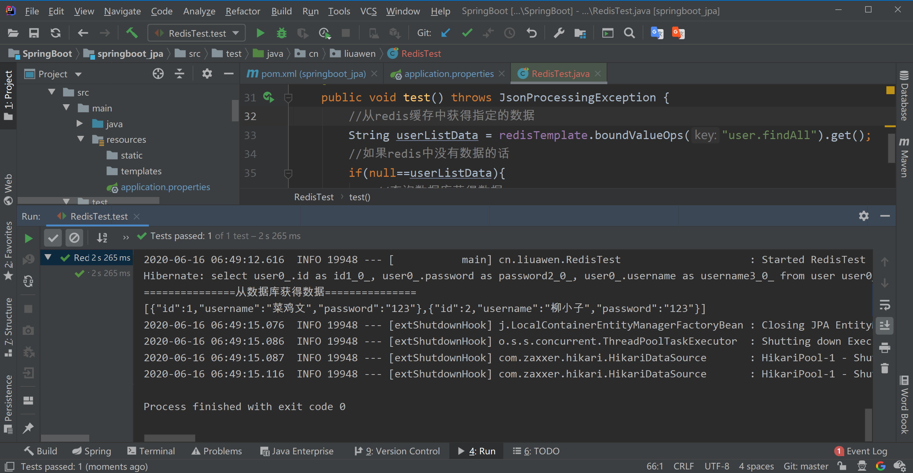
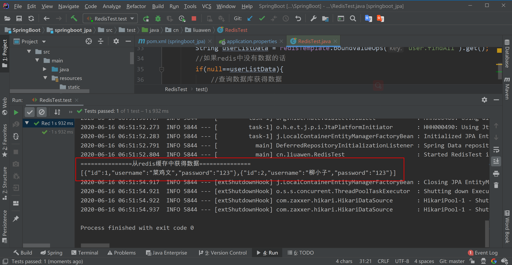

# SpringBoot整合Redis

[TOC]


使用Redis数据库

Redis简介


Redis（官网地址：https://redis.io/）是一个非关系型的高性能缓存数据库，使用ANSI C语言开发，是一种Key-Value模式的数据库，以Key-Value的形式存储数据，支持多种value类型，如string（字符串）、list（链表）、set（集合）、zset（sorted set，有序集合）和hash（哈希类型）。

Redis支持多种开发语言，如Java、C/C++、C#、PHP、JavaScript、Perl、Objective-C、Python、Ruby、Erlang等。同时，Redis还支持数据的持久化，不只可以将数据存储在内存中，还可以将数据存储到硬盘内，不需要担心数据的丢失。在性能方面，Redis官方（官网地址：https://redis.io/）提供了这样的数据：读的速度是110 000次／s，写的速度是81 000次／s，是一个真正的高性能数据库。

对于Redis来说，我们可能对它使用的更多的是缓存，毕竟它可以高效地对数据进行操作。其实它还具备很多功能，比如消息队列、发布、订阅消息等。另外，它提供了持久化的方式。Spring Boot使用Redis数据库分为两步：

（1）在pom文件中加入依赖

（2）在配置文件中加入配置

# 添加redis的起步依赖

在创建项目之前，需要启动Redis。启动Redis后，新建项目，在pom文件中加入Redis依赖

```xml
<!-- 配置使用redis启动器 -->
<dependency>
    <groupId>org.springframework.boot</groupId>
    <artifactId>spring-boot-starter-data-redis</artifactId>
</dependency>
```


# 配置redis的连接信息



application.properties


在配置文件中配置Redis信息，这里只配置Redis服务地址和端口，嗯。

```properties
#Redis

#Redis服务器地址
spring.redis.host=127.0.0.1
spring.redis.port=6379
```


# 注入RedisTemplate测试redis操作

从redis中获得数据 数据的形式 json字符串

判断redis中是否存在数据

不存在数据，从数据库拿再放到Redis数据库

将数据在控制台打印 

存在，直接缓存拿数据 ，没有在其他的地方拿 。


注入RedisTemplate，用于对Redis缓存进行操作。创建两个方法：Set方法和Get方法，分别用于使用RedisTemplate进行存放数据和取出数据

```java
package cn.liuawen;

import cn.liuawen.domain.User;
import cn.liuawen.repository.UserRepository;
import com.fasterxml.jackson.core.JsonProcessingException;
import com.fasterxml.jackson.databind.ObjectMapper;
import org.junit.Test;
import org.junit.runner.RunWith;
import org.springframework.beans.factory.annotation.Autowired;
import org.springframework.boot.test.context.SpringBootTest;
import org.springframework.data.redis.core.RedisTemplate;
import org.springframework.test.context.junit4.SpringRunner;

import java.util.List;


@RunWith(SpringRunner.class)
@SpringBootTest(classes = SpringbootJpaApplication.class)
public class RedisTest {

    @Autowired
    private UserRepository userRepository;

    @Autowired
    private RedisTemplate<String, String> redisTemplate;

    @Test
    public void test() throws JsonProcessingException {
        //从redis缓存中获得指定的数据
        String userListData = redisTemplate.boundValueOps("user.findAll").get();
        //如果redis中没有数据的话
        if(null==userListData){
            //查询数据库获得数据
            List<User> all = userRepository.findAll();
            //转换成json格式字符串
            ObjectMapper om = new ObjectMapper();
            userListData = om.writeValueAsString(all);
            //将数据存储到redis中，下次在查询直接从redis中获得数据，不用在查询数据库
            redisTemplate.boundValueOps("user.findAll").set(userListData);
            System.out.println("===============从数据库获得数据===============");
        }else{
            System.out.println("===============从redis缓存中获得数据===============");
        }

        System.out.println(userListData);

    }

}
```

开始redis没有数据

```
127.0.0.1:6379> keys *
(empty list or set)
127.0.0.1:6379>
```

执行一次

```
===============从数据库获得数据===============
[{"id":1,"username":"菜鸡文","password":"123"},{"id":2,"username":"柳小子","password":"123"}]
```



```
127.0.0.1:6379> keys *
(empty list or set)
127.0.0.1:6379> keys *
1) "user.findAll"
127.0.0.1:6379> get user.findAll
"[{\"id\":1,\"username\":\"\xe8\x8f\x9c\xe9\xb8\xa1\xe6\x96\x87\",\"password\":\"123\"},{\"id\":2,\"username\":\"\xe6\x9f\xb3\xe5\xb0\x8f\xe5\xad\x90\",\"password\":\"123\"}]"
127.0.0.1:6379>

```

redis有数据了

再执行一次test(),  从redis缓存中拿到数据了




```
===============从redis缓存中获得数据===============
[{"id":1,"username":"菜鸡文","password":"123"},{"id":2,"username":"柳小子","password":"123"}]
```

