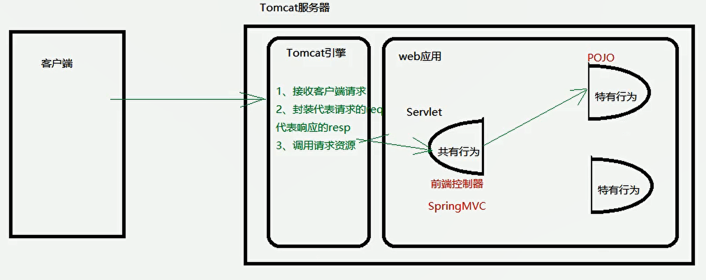
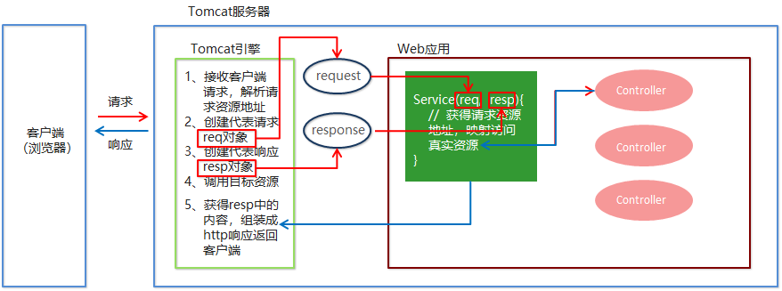
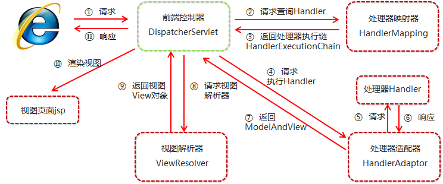

## 1. Spring与Web环境集成

### 1.1 ApplicationContext应用上下文获取方式

应用上下文对象是通过new ClassPathXmlApplicationContext(spring配置文件) 方式获取的，但是每次从容器中获得Bean时都要编写new ClassPathXmlApplicationContext(spring配置文件) ，这样的弊端是配置文件加载多次，应用上下文对象创建多次。

在Web项目中，可以使用ServletContextListener监听Web应用的启动，我们可以在Web应用启动时，就加载Spring的配置文件，创建应用上下文对象ApplicationContext，在将其存储到最大的域servletContext域中，这样就可以在任意位置从域中获得应用上下文ApplicationContext对象了。


应用上下文对象是通过new ClassPathXmlApplicationContext(spring配置文件)方式获取的 但是每次从容器中获得Bean时都要编写

new Classpath

web层很多业务    每个方法都要   每次都是加载 获取配置文件  加了一次  创建一个

配置文件加载一次  创建完毕 拿就是了   怎么办呢？  

使用ServletContextListener监听Web应用的启动 

我现在就是赶紧理解  找个实习   不管什么博客  笔记   刷题去  LeetCode


### 1.2 Spring提供获取应用上下文的工具

上面的分析不用手动实现，Spring提供了一个监听器ContextLoaderListener就是对上述功能的封装，该监听器内部加载Spring配置文件，创建应用上下文对象，并存储到ServletContext域中，提供了一个客户端工具WebApplicationContextUtils供使用者获得应用上下文对象。


所以我们需要做的只有两件事：

①在web.xml中配置ContextLoaderListener监听器（导入spring-web坐标）

②使用WebApplicationContextUtils获得应用上下文对象ApplicationContext

### 1.3 导入Spring集成web的坐标

```xml
<dependency>
    <groupId>org.springframework</groupId>
    <artifactId>spring-web</artifactId>
    <version>5.0.5.RELEASE</version>
</dependency>
```

### 1.4 配置ContextLoaderListener监听器

```xml
<!--全局参数-->
<context-param>
    <param-name>contextConfigLocation</param-name>
    <param-value>classpath:applicationContext.xml</param-value>
</context-param>
<!--Spring的监听器-->
<listener>
	<listener-class>
       org.springframework.web.context.ContextLoaderListener
   </listener-class>
 </listener>
```

### 1.5 通过工具获得应用上下文对象

```java
ApplicationContext applicationContext =    
    WebApplicationContextUtils.getWebApplicationContext(servletContext);
    Object obj = applicationContext.getBean("id");
```

**知识要点**

Spring集成web环境步骤

​      ①配置ContextLoaderListener监听器

​      ②使用WebApplicationContextUtils获得应用上下文

## 2. SpringMVC的简介

### 2.1 SpringMVC概述

SpringMVC 是一种基于 Java 的实现 MVC 设计模型的请求驱动类型的轻量级 Web 框架，属于SpringFrameWork 的后续产品，已经融合在 Spring Web Flow 中。

SpringMVC 已经成为目前最主流的MVC框架之一，并且随着Spring3.0 的发布，全面超越 Struts2，成为最优秀的 MVC 框架。它通过一套注解，让一个简单的 Java 类成为处理请求的控制器，而无须实现任何接口。同时它还支持 RESTful 编程风格的请求。

### 2.3 SpringMVC快速入门

需求：客户端发起请求，服务器端接收请求，执行逻辑并进行视图跳转。

**开发步骤**

①导入SpringMVC相关坐标

②配置SpringMVC核心控制器DispathcerServlet

③创建Controller类和视图页面

④使用注解配置Controller类中业务方法的映射地址

⑤配置SpringMVC核心文件 spring-mvc.xml

⑥客户端发起请求测试

**代码实现**

①导入Spring和SpringMVC的坐标、导入Servlet和Jsp的坐标

```xml
 <!--Spring坐标-->
 <dependency>
     <groupId>org.springframework</groupId>
     <artifactId>spring-context</artifactId>
     <version>5.0.5.RELEASE</version>
 </dependency>
 <!--SpringMVC坐标-->
 <dependency>
     <groupId>org.springframework</groupId>
     <artifactId>spring-webmvc</artifactId>
     <version>5.0.5.RELEASE</version>
 </dependency>
<!--Servlet坐标-->
<dependency>
    <groupId>javax.servlet</groupId>
    <artifactId>servlet-api</artifactId>
    <version>2.5</version>
</dependency>
<!--Jsp坐标-->
<dependency>
    <groupId>javax.servlet.jsp</groupId>
    <artifactId>jsp-api</artifactId>
    <version>2.0</version>
</dependency>
```

②在web.xml配置SpringMVC的核心控制器

```xml
<servlet>
    <servlet-name>DispatcherServlet</servlet-name>
    <servlet-class>org.springframework.web.servlet.DispatcherServlet</servlet-class>  
    <init-param>
        <param-name>contextConfigLocation</param-name>
        <param-value>classpath:spring-mvc.xml</param-value>
    </init-param>
	<load-on-startup>1</load-on-startup>
</servlet>
<servlet-mapping>   
    <servlet-name>DispatcherServlet</servlet-name>
    <url-pattern>/</url-pattern>
</servlet-mapping>

```

③创建Controller和业务方法

```java
public class QuickController {
	public String quickMethod(){
		System.out.println("quickMethod running.....");
		return "index";
	}
}
```

③创建视图页面index.jsp

```jsp
<html>
<body>
    <h2>Hello SpringMVC!</h2>
</body>
</html>
```

④配置注解

```java
@Controller
public class QuickController {
	@RequestMapping("/quick")
	public String quickMethod(){
		System.out.println("quickMethod running.....");
			return "index";
	}
}
```

⑤创建spring-mvc.xml

```xml
<beans xmlns="http://www.springframework.org/schema/beans"  
    xmlns:mvc="http://www.springframework.org/schema/mvc"
    xmlns:context="http://www.springframework.org/schema/context" 
    xmlns:xsi="http://www.w3.org/2001/XMLSchema-instance"
    xsi:schemaLocation="http://www.springframework.org/schema/beans 
    http://www.springframework.org/schema/beans/spring-beans.xsd 
    http://www.springframework.org/schema/mvc   
    http://www.springframework.org/schema/mvc/spring-mvc.xsd  
    http://www.springframework.org/schema/context   
    http://www.springframework.org/schema/context/spring-context.xsd">
    <!--配置注解扫描-->
    <context:component-scan base-package="com.itheima"/>
</beans>
```

web.xml 配置  <init-param>


⑥访问测试地址

```xml
http://localhost:8080/itheima_springmvc1/quick 
```

控制台打印


页面显示


### 2.3 SpringMVC流程图示






### 2.4 知识要点


SpringMVC的开发步骤 

   ①导入SpringMVC相关坐标

   ②配置SpringMVC核心控制器DispathcerServlet DispathcerServlet

   ③创建Controller类和视图页面

   ④使用注解配置Controller类中业务方法的映射地址

   ⑤配置SpringMVC核心文件 spring-mvc.xml

   ⑥客户端发起请求测试

## 3. SpringMVC的组件解析

### 3.1 SpringMVC的执行流程



底层 组件  


①用户发送请求至前端控制器DispatcherServlet。

②DispatcherServlet收到请求调用HandlerMapping处理器映射器。

③处理器映射器找到具体的处理器(可以根据xml配置、注解进行查找)，生成处理器对象及处理器拦截器(如果有则生成)一并返回给DispatcherServlet。

④DispatcherServlet调用HandlerAdapter处理器适配器。

⑤HandlerAdapter经过适配调用具体的处理器(Controller，也叫后端控制器)。

⑥Controller执行完成返回ModelAndView。

⑦HandlerAdapter将controller执行结果ModelAndView返回给DispatcherServlet。

⑧DispatcherServlet将ModelAndView传给ViewReslover视图解析器。

⑨ViewReslover解析后返回具体View。

⑩DispatcherServlet根据View进行渲染视图（即将模型数据填充至视图中）。DispatcherServlet响应用户。

### 3.2 SpringMVC组件解析

1. **前端控制器：DispatcherServlet**

​    用户请求到达前端控制器，它就相当于 MVC 模式中的 C，DispatcherServlet 是整个流程控制的中心，由

它调用其它组件处理用户的请求，DispatcherServlet 的存在降低了组件之间的耦合性。

2. **处理器映射器：HandlerMapping**

​    HandlerMapping 负责根据用户请求找到 Handler 即处理器，SpringMVC 提供了不同的映射器实现不同的

映射方式，例如：配置文件方式，实现接口方式，注解方式等。

3. **处理器适配器：HandlerAdapter**

​    通过 HandlerAdapter 对处理器进行执行，这是适配器模式的应用，通过扩展适配器可以对更多类型的处理

器进行执行。

4. **处理器：Handler**

​    它就是我们开发中要编写的具体业务控制器。由 DispatcherServlet 把用户请求转发到 Handler。由

Handler 对具体的用户请求进行处理。

5. **视图解析器：View Resolver**

​    View Resolver 负责将处理结果生成 View 视图，View Resolver 首先根据逻辑视图名解析成物理视图名，即具体的页面地址，再生成 View 视图对象，最后对 View 进行渲染将处理结果通过页面展示给用户。

6. **视图：View**

​    SpringMVC 框架提供了很多的 View 视图类型的支持，包括：jstlView、freemarkerView、pdfView等。最常用的视图就是 jsp。一般情况下需要通过页面标签或页面模版技术将模型数据通过页面展示给用户，需要由程序员根据业务需求开发具体的页面

### 3.3 SpringMVC注解解析

 http://localhost:8080/xxx/quick 


@RequestMapping

作用：用于建立请求 URL 和处理请求方法之间的对应关系

位置：

​      类上，请求URL 的第一级访问目录。此处不写的话，就相当于应用的根目录

  那个模块的   eg   类上  @RequestMapping  

​      方法上，请求 URL 的第二级访问目录，与类上的使用@RequestMapping标注的一级目录一起组成访问虚拟路径

属性：

​      value：用于指定请求的URL。它和path属性的作用是一样的

​      method：用于指定请求的方式

​      params：用于指定限制请求参数的条件。它支持简单的表达式。要求请求参数的key和value必须和配置的一模一样

例如：

​      params = {"accountName"}，表示请求参数必须有accountName

​      params = {"moeny!100"}，表示请求参数中money不能是100

1.mvc命名空间引入

```xml
命名空间：xmlns:context="http://www.springframework.org/schema/context"
        xmlns:mvc="http://www.springframework.org/schema/mvc"
约束地址：http://www.springframework.org/schema/context
        http://www.springframework.org/schema/context/spring-context.xsd
        http://www.springframework.org/schema/mvc 
        http://www.springframework.org/schema/mvc/spring-mvc.xsd
```

2.
组件扫描

SpringMVC基于Spring容器，所以在进行SpringMVC操作时，需要将Controller存储到Spring容器中，如果使用@Controller注解标注的话，就需要使用<context:component-scan base-package=“com.itheima.controller"/>进行组件扫描。

### 3.4 SpringMVC的XML配置解析

SpringMVC有默认组件配置，默认组件都是DispatcherServlet.properties配置文件中配置的，该配置文件地址org/springframework/web/servlet/DispatcherServlet.properties，该文件中配置了默认的视图解析器，如下：

```properties
org.springframework.web.servlet.ViewResolver=org.springframework.web.servlet.view.InternalResourceViewResolver
```

翻看该解析器源码，可以看到该解析器的默认设置，如下：

```properties
REDIRECT_URL_PREFIX = "redirect:"  --重定向前缀
FORWARD_URL_PREFIX = "forward:"    --转发前缀（默认值）
prefix = "";     --视图名称前缀
suffix = "";     --视图名称后缀
```

1. 视图解析器

我们可以通过属性注入的方式修改视图的的前后缀

```xml
<!--配置内部资源视图解析器-->
<bean class="org.springframework.web.servlet.view.InternalResourceViewResolver">
  <property name="prefix" value="/WEB-INF/views/"></property>
  <property name="suffix" value=".jsp"></property>
</bean>
```

### 3.5 知识要点

**SpringMVC的相关组件** 

前端控制器：DispatcherServlet

处理器映射器：HandlerMapping

处理器适配器：HandlerAdapter

处理器：Handler

视图解析器：View Resolver

视图：View

**SpringMVC的注解和配置** 

请求映射注解：@RequestMapping

视图解析器配置：

REDIRECT_URL_PREFIX = "redirect:"  

FORWARD_URL_PREFIX = "forward:"    

prefix = "";     

suffix = "";     

