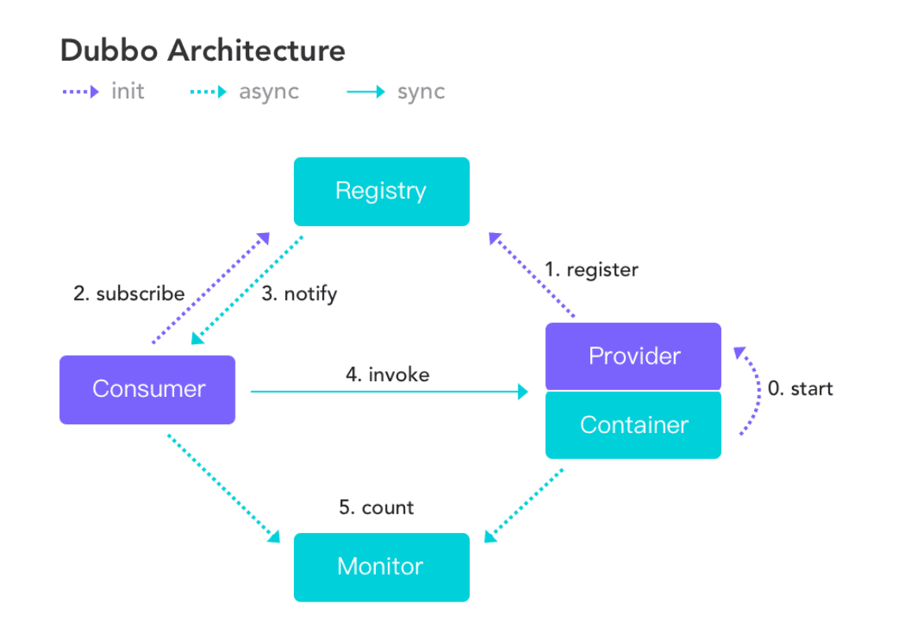
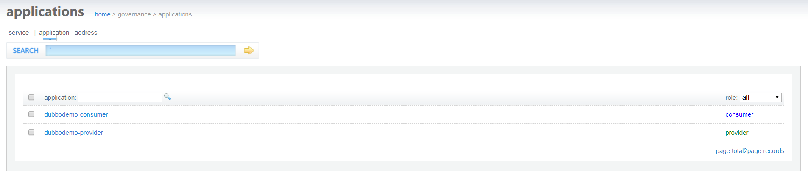
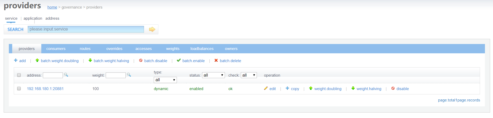
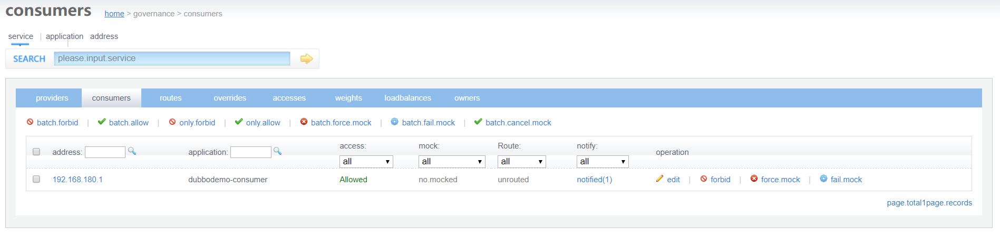
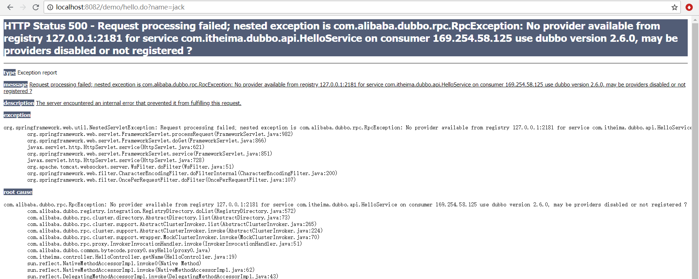
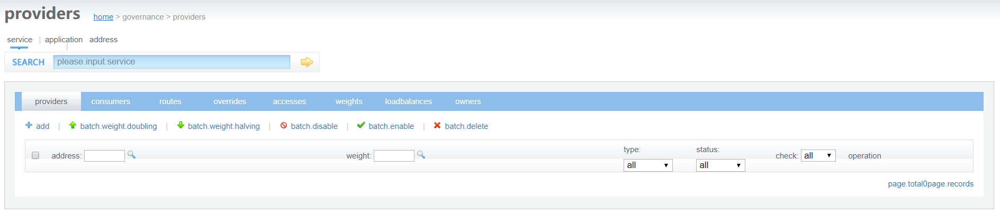

# 分布式RPC框架Apache Dubbo 

## 1. 软件架构的演进过程

软件架构的发展经历了由单体架构、垂直架构、SOA架构到微服务架构的演进过程，下面我们分别了解一下这几个架构。

分布式RPC框架

Apache Dubbo

软件架构的演进过程

单体架构 垂直架构 SOA架构  微服务架构

### 1.1 单体架构


用户 订单 物流 

架构说明：

​      全部功能集中在一个项目内（All in one）。

架构优点：

​      架构简单，前期开发成本低、开发周期短，适合小型项目。

架构缺点：

​       全部功能集成在一个工程中，对于大型项目不易开发、扩展和维护。

​       技术栈受限，只能使用一种语言开发。

​       系统性能扩展只能通过扩展集群节点，成本高。

### 1.2 垂直架构


架构说明：       

​      按照业务进行切割，形成小的单体项目。

架构优点：

​      技术栈可扩展（不同的系统可以用不同的编程语言编写）。

架构缺点：

​       功能集中在一个项目中，不利于开发、扩展、维护。

​       系统扩张只能通过集群的方式。

​       项目之间功能冗余、数据冗余、耦合性强。

### 1.3 SOA架构

SOA全称为Service-Oriented Architecture，即面向服务的架构。它可以根据需求通过网络对松散耦合的粗粒度应用组件(服务)进行分布式部署、组合和使用。一个服务通常以独立的形式存在于操作系统进程中。

站在功能的角度，把业务逻辑抽象成可复用的服务，通过服务的编排实现业务的快速再生，目的：把原先固有的业务功能转变为通用的业务服务，实现业务逻辑的快速复用。


架构说明：

​      将重复功能或模块抽取成组件的形式，对外提供服务，在项目与服务之间使用ESB（企业服务总线）的形式作为通信的桥梁。

架构优点：

​       重复功能或模块抽取为服务，提高开发效率。

​       可重用性高。

​       可维护性高。

架构缺点：

​       各系统之间业务不同，很难确认功能或模块是重复的。

​       抽取服务的粒度大。

​       系统和服务之间耦合度高。

### 1.4 微服务架构


架构说明：

​       将系统服务层完全独立出来，抽取为一个一个的微服务。

​       抽取的粒度更细，遵循单一原则。

​       采用轻量级框架协议传输。

架构优点：

​       服务拆分粒度更细，有利于提高开发效率。 

​       可以针对不同服务制定对应的优化方案。

​       适用于互联网时代，产品迭代周期更短。

架构缺点：

​      粒度太细导致服务太多，维护成本高。

​      分布式系统开发的技术成本高，对团队的挑战大。

## 2. Apache Dubbo概述

### 2.1 Dubbo简介

Apache Dubbo是一款高性能的Java RPC框架。其前身是阿里巴巴公司开源的一个高性能、轻量级的开源Java RPC框架，可以和Spring框架无缝集成。

高性能的Java RPC框架  前身是 开源的一个高性能 轻量级的开源Java RPC框架 

和Spring框架无缝集成 

**什么是RPC？**

RPC全称为remote procedure call，即**远程过程调用**。比如两台服务器A和B，A服务器上部署一个应用，B服务器上部署一个应用，A服务器上的应用想调用B服务器上的应用提供的方法，由于两个应用不在一个内存空间，不能直接调用，所以需要通过网络来表达调用的语义和传达调用的数据。

RPC 远程过程调用 两台服务器  A和B　　　部署一个应用 

不在一个内存空间  不能直接调用 

网络  表达调用的语义  调用的数据 

需要注意的是RPC并不是一个具体的技术，而是指整个网络远程调用过程。

RPC是一个泛化的概念，严格来说一切远程过程调用手段都属于RPC范畴。各种开发语言都有自己的RPC框架。Java中的RPC框架比较多，广泛使用的有RMI、Hessian、Dubbo等。

Dubbo官网地址：http://dubbo.apache.org

Dubbo提供了三大核心能力：面向接口的远程方法调用，智能容错和负载均衡，以及服务自动注册和发现。

面向接口的远程方法调用 

智能容错 负载均衡 

服务自动注册和发现 


### 2.2 Dubbo架构

Dubbo架构图（Dubbo官方提供）如下：





节点角色说明：

| 节点        | 角色名称                |
| --------- | ------------------- |
| Provider  | 暴露服务的服务提供方          |
| Consumer  | 调用远程服务的服务消费方        |
| Registry  | 服务注册与发现的注册中心        |
| Monitor   | 统计服务的调用次数和调用时间的监控中心 |
| Container | 服务运行容器              |

虚线都是异步访问，实线都是同步访问
蓝色虚线:在启动时完成的功能
红色虚线(实线)都是程序运行过程中执行的功能

调用关系说明:

0. 服务容器负责启动，加载，运行服务提供者。
1. 服务提供者在启动时，向注册中心注册自己提供的服务。
2. 服务消费者在启动时，向注册中心订阅自己所需的服务。
3. 注册中心返回服务提供者地址列表给消费者，如果有变更，注册中心将基于长连接推送变更数据给消费者。
4. 服务消费者，从提供者地址列表中，基于软负载均衡算法，选一台提供者进行调用，如果调用失败，再选另一台调用。
5. 服务消费者和提供者，在内存中累计调用次数和调用时间，定时每分钟发送一次统计数据到监控中心。

调用关系 

服务容器负责启动  加载  运行服务提供者


## 3. 服务注册中心Zookeeper

通过前面的Dubbo架构图可以看到，Registry（服务注册中心）在其中起着至关重要的作用。Dubbo官方推荐使用Zookeeper作为服务注册中心。

Registry


Dubbo架构图，可以看到 Provider 的地址以及配置信息是通过注册中心传递给 Consumer 的,Registry（服务注册中心）在其中起着至关重要的作用。生产环境中， **基本都是用 ZooKeeper 作为注册中心** 。

使用Dubbo需要启动Zookeeper


### 3.1 Zookeeper介绍

Zookeeper 是 Apache Hadoop 的子项目，是一个树型的目录服务，支持变更推送，适合作为 Dubbo 服务的注册中心，工业强度较高，可用于生产环境，并推荐使用 。

为了便于理解Zookeeper的树型目录服务，我们先来看一下我们电脑的文件系统(也是一个树型目录结构)：


我的电脑可以分为多个盘符（例如C、D、E等），每个盘符下可以创建多个目录，每个目录下面可以创建文件，也可以创建子目录，最终构成了一个树型结构。通过这种树型结构的目录，我们可以将文件分门别类的进行存放，方便我们后期查找。而且磁盘上的每个文件都有一个唯一的访问路径，例如：C:\Windows\itcast\hello.txt。

Zookeeper树型目录服务：


流程说明：

- 服务提供者(Provider)启动时: 向 `/dubbo/com.foo.BarService/providers` 目录下写入自己的 URL 地址
- 服务消费者(Consumer)启动时: 订阅 `/dubbo/com.foo.BarService/providers` 目录下的提供者 URL 地址。并向 `/dubbo/com.foo.BarService/consumers` 目录下写入自己的 URL 地址
- 监控中心(Monitor)启动时: 订阅 `/dubbo/com.foo.BarService` 目录下的所有提供者和消费者 URL 地址

### 3.2 安装Zookeeper

下载地址：http://archive.apache.org/dist/zookeeper/

本课程使用的Zookeeper版本为3.4.6，下载完成后可以获得名称为zookeeper-3.4.6.tar.gz的压缩文件。

安装步骤：

第一步：安装 jdk（略）
第二步：把 zookeeper 的压缩包（zookeeper-3.4.6.tar.gz）上传到 linux 系统
第三步：解压缩压缩包
​	tar -zxvf zookeeper-3.4.6.tar.gz
第四步：进入zookeeper-3.4.6目录，创建data目录
​	mkdir data
第五步：进入conf目录 ，把zoo_sample.cfg 改名为zoo.cfg
​	cd conf
​	mv zoo_sample.cfg zoo.cfg
第六步：打开zoo.cfg文件,  修改data属性：dataDir=/root/zookeeper-3.4.6/data

### 3.3 启动、停止Zookeeper

进入Zookeeper的bin目录，启动服务命令
 ./zkServer.sh start

停止服务命令
./zkServer.sh stop

查看服务状态：
./zkServer.sh status

## 4. Dubbo快速入门

Dubbo作为一个RPC框架，其最核心的功能就是要实现跨网络的远程调用。本小节就是要创建两个应用，一个作为服务的提供方，一个作为服务的消费方。通过Dubbo来实现服务消费方远程调用服务提供方的方法。

### 4.1 服务提供方开发

开发步骤：

（1）创建maven工程（打包方式为war）dubbodemo_provider，在pom.xml文件中导入如下坐标

~~~xml
<properties>
  <project.build.sourceEncoding>UTF-8</project.build.sourceEncoding>
  <maven.compiler.source>1.8</maven.compiler.source>
  <maven.compiler.target>1.8</maven.compiler.target>
  <spring.version>5.0.5.RELEASE</spring.version>
</properties>
<dependencies>
  <dependency>
    <groupId>org.springframework</groupId>
    <artifactId>spring-context</artifactId>
    <version>${spring.version}</version>
  </dependency>
  <dependency>
    <groupId>org.springframework</groupId>
    <artifactId>spring-beans</artifactId>
    <version>${spring.version}</version>
  </dependency>
  <dependency>
    <groupId>org.springframework</groupId>
    <artifactId>spring-webmvc</artifactId>
    <version>${spring.version}</version>
  </dependency>
  <dependency>
    <groupId>org.springframework</groupId>
    <artifactId>spring-jdbc</artifactId>
    <version>${spring.version}</version>
  </dependency>
  <dependency>
    <groupId>org.springframework</groupId>
    <artifactId>spring-aspects</artifactId>
    <version>${spring.version}</version>
  </dependency>
  <dependency>
    <groupId>org.springframework</groupId>
    <artifactId>spring-jms</artifactId>
    <version>${spring.version}</version>
  </dependency>
  <dependency>
    <groupId>org.springframework</groupId>
    <artifactId>spring-context-support</artifactId>
    <version>${spring.version}</version>
  </dependency>
  <!-- dubbo相关 -->
  <dependency>
    <groupId>com.alibaba</groupId>
    <artifactId>dubbo</artifactId>
    <version>2.6.0</version>
  </dependency>
  <dependency>
    <groupId>org.apache.zookeeper</groupId>
    <artifactId>zookeeper</artifactId>
    <version>3.4.7</version>
  </dependency>
  <dependency>
    <groupId>com.github.sgroschupf</groupId>
    <artifactId>zkclient</artifactId>
    <version>0.1</version>
  </dependency>
  <dependency>
    <groupId>javassist</groupId>
    <artifactId>javassist</artifactId>
    <version>3.12.1.GA</version>
  </dependency>
  <dependency>
    <groupId>com.alibaba</groupId>
    <artifactId>fastjson</artifactId>
    <version>1.2.47</version>
  </dependency>
</dependencies>
<build>
  <plugins>
    <plugin>
      <groupId>org.apache.maven.plugins</groupId>
      <artifactId>maven-compiler-plugin</artifactId>
      <version>2.3.2</version>
      <configuration>
        <source>1.8</source>
        <target>1.8</target>
      </configuration>
    </plugin>
    <plugin>
      <groupId>org.apache.tomcat.maven</groupId>
      <artifactId>tomcat7-maven-plugin</artifactId>
      <configuration>
        <!-- 指定端口 -->
        <port>8081</port>
        <!-- 请求路径 -->
        <path>/</path>
      </configuration>
    </plugin>
  </plugins>
</build>
~~~

（2）配置web.xml文件

~~~xml
<!DOCTYPE web-app PUBLIC
 "-//Sun Microsystems, Inc.//DTD Web Application 2.3//EN"
 "http://java.sun.com/dtd/web-app_2_3.dtd" >
<web-app>
  <display-name>Archetype Created Web Application</display-name>
  <context-param>
    <param-name>contextConfigLocation</param-name>
    <param-value>classpath:applicationContext*.xml</param-value>
  </context-param>
  <listener>
    <listener-class>org.springframework.web.context.ContextLoaderListener</listener-class>
  </listener>
</web-app>

~~~

（3）创建服务接口

~~~java
package com.itheima.service;
public interface HelloService {
    public String sayHello(String name);
}
~~~

（4）创建服务实现类

~~~java
package com.itheima.service.impl;
import com.alibaba.dubbo.config.annotation.Service;
import com.itheima.service.HelloService;

@Service
public class HelloServiceImpl implements HelloService {
    public String sayHello(String name) {
        return "hello " + name;
    }
}
~~~

注意：服务实现类上使用的Service注解是Dubbo提供的，用于对外发布服务

（5）在src/main/resources下创建applicationContext-service.xml 

~~~xml
<?xml version="1.0" encoding="UTF-8"?>
<beans xmlns="http://www.springframework.org/schema/beans"
		xmlns:xsi="http://www.w3.org/2001/XMLSchema-instance"
	    xmlns:p="http://www.springframework.org/schema/p"
		xmlns:context="http://www.springframework.org/schema/context"
		xmlns:dubbo="http://code.alibabatech.com/schema/dubbo"
	    xmlns:mvc="http://www.springframework.org/schema/mvc"
		xsi:schemaLocation="http://www.springframework.org/schema/beans
		http://www.springframework.org/schema/beans/spring-beans.xsd
         http://www.springframework.org/schema/mvc
         http://www.springframework.org/schema/mvc/spring-mvc.xsd
         http://code.alibabatech.com/schema/dubbo
         http://code.alibabatech.com/schema/dubbo/dubbo.xsd
         http://www.springframework.org/schema/context
         http://www.springframework.org/schema/context/spring-context.xsd">
	<!-- 当前应用名称，用于注册中心计算应用间依赖关系，注意：消费者和提供者应用名不要一样 -->
	<dubbo:application name="dubbodemo_provider" />
	<!-- 连接服务注册中心zookeeper ip为zookeeper所在服务器的ip地址-->
	<dubbo:registry address="zookeeper://192.168.134.129:2181"/>
	<!-- 注册  协议和port   端口默认是20880 -->
	<dubbo:protocol name="dubbo" port="20881"></dubbo:protocol>
	<!-- 扫描指定包，加入@Service注解的类会被发布为服务  -->
	<dubbo:annotation package="com.itheima.service.impl" />
</beans>
~~~

（6）启动服务

tomcat7:run

### 4.2 服务消费方开发

开发步骤：

（1）创建maven工程（打包方式为war）dubbodemo_consumer，pom.xml配置和上面服务提供者相同，只需要将Tomcat插件的端口号改为8082即可

（2）配置web.xml文件

~~~xml
<!DOCTYPE web-app PUBLIC
 "-//Sun Microsystems, Inc.//DTD Web Application 2.3//EN"
 "http://java.sun.com/dtd/web-app_2_3.dtd" >
<web-app>
  <display-name>Archetype Created Web Application</display-name>
  <servlet>
    <servlet-name>springmvc</servlet-name>
    <servlet-class>org.springframework.web.servlet.DispatcherServlet</servlet-class>
    <!-- 指定加载的配置文件 ，通过参数contextConfigLocation加载 -->
    <init-param>
      <param-name>contextConfigLocation</param-name>
      <param-value>classpath:applicationContext-web.xml</param-value>
    </init-param>
    <load-on-startup>1</load-on-startup>
  </servlet>
  <servlet-mapping>
    <servlet-name>springmvc</servlet-name>
    <url-pattern>*.do</url-pattern>
  </servlet-mapping>
</web-app>
~~~

（3）将服务提供者工程中的HelloService接口复制到当前工程

（4）编写Controller

~~~java
package com.itheima.controller;
import com.alibaba.dubbo.config.annotation.Reference;
import com.itheima.service.HelloService;
import org.springframework.stereotype.Controller;
import org.springframework.web.bind.annotation.RequestMapping;
import org.springframework.web.bind.annotation.ResponseBody;

@Controller
@RequestMapping("/demo")
public class HelloController {
    @Reference
    private HelloService helloService;

    @RequestMapping("/hello")
    @ResponseBody
    public String getName(String name){
        //远程调用
        String result = helloService.sayHello(name);
        System.out.println(result);
        return result;
    }
}
~~~

注意：Controller中注入HelloService使用的是Dubbo提供的@Reference注解

（5）在src/main/resources下创建applicationContext-web.xml

~~~xml
<?xml version="1.0" encoding="UTF-8"?>
<beans xmlns="http://www.springframework.org/schema/beans"
	xmlns:xsi="http://www.w3.org/2001/XMLSchema-instance"
	xmlns:p="http://www.springframework.org/schema/p"
	xmlns:context="http://www.springframework.org/schema/context"
	xmlns:dubbo="http://code.alibabatech.com/schema/dubbo"
	xmlns:mvc="http://www.springframework.org/schema/mvc"
	xsi:schemaLocation="http://www.springframework.org/schema/beans
			http://www.springframework.org/schema/beans/spring-beans.xsd
			http://www.springframework.org/schema/mvc
			http://www.springframework.org/schema/mvc/spring-mvc.xsd
			http://code.alibabatech.com/schema/dubbo
			http://code.alibabatech.com/schema/dubbo/dubbo.xsd
			http://www.springframework.org/schema/context
			http://www.springframework.org/schema/context/spring-context.xsd">

	<!-- 当前应用名称，用于注册中心计算应用间依赖关系，注意：消费者和提供者应用名不要一样 -->
	<dubbo:application name="dubbodemo-consumer" />
	<!-- 连接服务注册中心zookeeper ip为zookeeper所在服务器的ip地址-->
	<dubbo:registry address="zookeeper://192.168.134.129:2181"/>
	<!-- 扫描的方式暴露接口  -->
	<dubbo:annotation package="com.itheima.controller" />
</beans>
~~~

（6）运行测试

tomcat7:run启动

在浏览器输入http://localhost:8082/demo/hello.do?name=Jack，查看浏览器输出结果


**思考一：**上面的Dubbo入门案例中我们是将HelloService接口从服务提供者工程(dubbodemo_provider)复制到服务消费者工程(dubbodemo_consumer)中，这种做法是否合适？还有没有更好的方式？

**答：**这种做法显然是不好的，同一个接口被复制了两份，不利于后期维护。更好的方式是单独创建一个maven工程，将此接口创建在这个maven工程中。需要依赖此接口的工程只需要在自己工程的pom.xml文件中引入maven坐标即可。

**思考二：**在服务消费者工程(dubbodemo_consumer)中只是引用了HelloService接口，并没有提供实现类，Dubbo是如何做到远程调用的？

**答：**Dubbo底层是基于代理技术为HelloService接口创建代理对象，远程调用是通过此代理对象完成的。可以通过开发工具的debug功能查看此代理对象的内部结构。另外，Dubbo实现网络传输底层是基于Netty框架完成的。

**思考三：**上面的Dubbo入门案例中我们使用Zookeeper作为服务注册中心，服务提供者需要将自己的服务信息注册到Zookeeper，服务消费者需要从Zookeeper订阅自己所需要的服务，此时Zookeeper服务就变得非常重要了，那如何防止Zookeeper单点故障呢？

**答：**Zookeeper其实是支持集群模式的，可以配置Zookeeper集群来达到Zookeeper服务的高可用，防止出现单点故障。


## 5. Dubbo管理控制台

我们在开发时，需要知道Zookeeper注册中心都注册了哪些服务，有哪些消费者来消费这些服务。我们可以通过部署一个管理中心来实现。其实管理中心就是一个web应用，部署到tomcat即可。

### 5.1 安装

安装步骤：

（1）将资料中的dubbo-admin-2.6.0.war文件复制到tomcat的webapps目录下

（2）启动tomcat，此war文件会自动解压

（3）修改WEB-INF下的dubbo.properties文件，注意dubbo.registry.address对应的值需要对应当前使用的Zookeeper的ip地址和端口号

​	dubbo.registry.address=zookeeper://192.168.134.129:2181
​	dubbo.admin.root.password=root
​	dubbo.admin.guest.password=guest

（4）重启tomcat

### 5.2 使用

操作步骤：

（1）访问http://localhost:8080/dubbo-admin-2.6.0/，输入用户名(root)和密码(root)


（2）启动服务提供者工程和服务消费者工程，可以在查看到对应的信息









## 6. Dubbo相关配置说明

### 6.1 包扫描

```xml
<dubbo:annotation package="com.itheima.service" />
```

服务提供者和服务消费者都需要配置，表示包扫描，作用是扫描指定包(包括子包)下的类。

如果不使用包扫描，也可以通过如下配置的方式来发布服务：

```xml
<bean id="helloService" class="com.itheima.service.impl.HelloServiceImpl" />
<dubbo:service interface="com.itheima.api.HelloService" ref="helloService" />
```

作为服务消费者，可以通过如下配置来引用服务：

```xml
<!-- 生成远程服务代理，可以和本地bean一样使用helloService -->
<dubbo:reference id="helloService" interface="com.itheima.api.HelloService" />
```

上面这种方式发布和引用服务，一个配置项(<dubbo:service>、<dubbo:reference>)只能发布或者引用一个服务，如果有多个服务，这种方式就比较繁琐了。推荐使用包扫描方式。

### 6.2 协议

```xml
<dubbo:protocol name="dubbo" port="20880"/>
```

一般在服务提供者一方配置，可以指定使用的协议名称和端口号。

其中Dubbo支持的协议有：dubbo、rmi、hessian、http、webservice、rest、redis等。

推荐使用的是dubbo协议。

dubbo 协议采用单一长连接和 NIO 异步通讯，适合于小数据量大并发的服务调用，以及服务消费者机器数远大于服务提供者机器数的情况。不适合传送大数据量的服务，比如传文件，传视频等，除非请求量很低。

也可以在同一个工程中配置多个协议，不同服务可以使用不同的协议，例如：

```xml
<!-- 多协议配置 -->
<dubbo:protocol name="dubbo" port="20880" />
<dubbo:protocol name="rmi" port="1099" />
<!-- 使用dubbo协议暴露服务 -->
<dubbo:service interface="com.itheima.api.HelloService" ref="helloService" protocol="dubbo" />
<!-- 使用rmi协议暴露服务 -->
<dubbo:service interface="com.itheima.api.DemoService" ref="demoService" protocol="rmi" /> 
```

### 6.3 启动时检查

```xml
<dubbo:consumer check="false"/>
```

上面这个配置需要配置在服务消费者一方，如果不配置默认check值为true。Dubbo 缺省会在启动时检查依赖的服务是否可用，不可用时会抛出异常，阻止 Spring 初始化完成，以便上线时，能及早发现问题。可以通过将check值改为false来关闭检查。

建议在开发阶段将check值设置为false，在生产环境下改为true。

### 6.4 负载均衡

负载均衡（Load Balance）：其实就是将请求分摊到多个操作单元上进行执行，从而共同完成工作任务。

在集群负载均衡时，Dubbo 提供了多种均衡策略（包括随机、轮询、最少活跃调用数、一致性Hash），缺省为random随机调用。

配置负载均衡策略，既可以在服务提供者一方配置，也可以在服务消费者一方配置，如下：

```java
    @Controller
    @RequestMapping("/demo")
    public class HelloController {
        //在服务消费者一方配置负载均衡策略
        @Reference(check = false,loadbalance = "random")
        private HelloService helloService;

        @RequestMapping("/hello")
        @ResponseBody
        public String getName(String name){
            //远程调用
            String result = helloService.sayHello(name);
            System.out.println(result);
            return result;
        }
    }
```

```java
//在服务提供者一方配置负载均衡
@Service(loadbalance = "random")
public class HelloServiceImpl implements HelloService {
    public String sayHello(String name) {
        return "hello " + name;
    }
}
```

可以通过启动多个服务提供者来观察Dubbo负载均衡效果。

注意：因为我们是在一台机器上启动多个服务提供者，所以需要修改tomcat的端口号和Dubbo服务的端口号来防止端口冲突。

在实际生产环境中，多个服务提供者是分别部署在不同的机器上，所以不存在端口冲突问题。

## 7. 解决Dubbo无法发布被事务代理的Service问题

前面我们已经完成了Dubbo的入门案例，通过入门案例我们可以看到通过Dubbo提供的标签配置就可以进行包扫描，扫描到@Service注解的类就可以被发布为服务。

但是我们如果在服务提供者类上加入@Transactional事务控制注解后，服务就发布不成功了。原因是事务控制的底层原理是为服务提供者类创建代理对象，而默认情况下Spring是基于JDK动态代理方式创建代理对象，而此代理对象的完整类名为com.sun.proxy.$Proxy42（最后两位数字不是固定的），导致Dubbo在发布服务前进行包匹配时无法完成匹配，进而没有进行服务的发布。

### 7.1 问题展示

在入门案例的服务提供者dubbodemo_provider工程基础上进行展示

操作步骤：

（1）在pom.xml文件中增加maven坐标

~~~xml
<dependency>
  <groupId>mysql</groupId>
  <artifactId>mysql-connector-java</artifactId>
  <version>5.1.47</version>
</dependency>
<dependency>
  <groupId>com.alibaba</groupId>
  <artifactId>druid</artifactId>
  <version>1.1.6</version>
</dependency>
<dependency>
  <groupId>org.mybatis</groupId>
  <artifactId>mybatis-spring</artifactId>
  <version>1.3.2</version>
</dependency>
~~~

（2）在applicationContext-service.xml配置文件中加入数据源、事务管理器、开启事务注解的相关配置

~~~xml
<!--数据源-->
<bean id="dataSource" class="com.alibaba.druid.pool.DruidDataSource" destroy-method="close">
  <property name="username" value="root" />
  <property name="password" value="root" />
  <property name="driverClassName" value="com.mysql.jdbc.Driver" />
  <property name="url" value="jdbc:mysql://localhost:3306/test" />
</bean>
<!-- 事务管理器  -->
<bean id="transactionManager" 
      class="org.springframework.jdbc.datasource.DataSourceTransactionManager">
  <property name="dataSource" ref="dataSource"/>
</bean>
<!--开启事务控制的注解支持-->
<tx:annotation-driven transaction-manager="transactionManager"/>
~~~

上面连接的数据库可以自行创建

（3）在HelloServiceImpl类上加入@Transactional注解

（4）启动服务提供者和服务消费者，并访问



上面的错误为没有可用的服务提供者

查看dubbo管理控制台发现服务并没有发布，如下：




可以通过断点调试的方式查看Dubbo执行过程，Dubbo通过AnnotationBean的postProcessAfterInitialization方法进行处理


### 7.2 解决方案

通过上面的断点调试可以看到，在HelloServiceImpl类上加入事务注解后，Spring会为此类基于JDK动态代理技术创建代理对象，创建的代理对象完整类名为com.sun.proxy.$Proxy35，导致Dubbo在进行包匹配时没有成功（因为我们在发布服务时扫描的包为com.itheima.service），所以后面真正发布服务的代码没有执行。

解决方式操作步骤：

（1）修改applicationContext-service.xml配置文件，开启事务控制注解支持时指定proxy-target-class属性，值为true。其作用是使用cglib代理方式为Service类创建代理对象

~~~xml
<!--开启事务控制的注解支持-->
<tx:annotation-driven transaction-manager="transactionManager" proxy-target-class="true"/>
~~~


（2）修改HelloServiceImpl类，在Service注解中加入interfaceClass属性，值为HelloService.class，作用是指定服务的接口类型

~~~java
@Service(interfaceClass = HelloService.class)
@Transactional
public class HelloServiceImpl implements HelloService {
    public String sayHello(String name) {
        return "hello " + name;
    }
}
~~~

此处也是必须要修改的，否则会导致发布的服务接口为SpringProxy，而不是HelloService接口，如下：

