Linux指令入门-文件与权限

## 创建资源

\1. 请点击页面左侧的 **云产品资源**，在下拉栏中，查看本次实验资源信息；

\2. 在资源下拉栏点击 **免费开通** 按钮，开始创建实验资源。


说明：资源创建过程需要1-3分钟。完成实验资源的创建后，用户可以通过 **云产品资源** 查看实验中所需的资源信息，例如：IP地址、用户名、密码等。

## 连接ECS服务器

ECS服务器

已创建|已运行

ECS公网地址：

106.14.13.30

ECS登录名：

root

登录密码：

Pc7Kb5Ar4Y

ECS实例ID：

i-uf6heduaqlfx3iep2q0o

IP白名单：

183.217.83.134


\1.  打开系统自带的终端工具。

- Windows：CMD或Powershell。
- MAC：Terminal。

Windows用户请检查系统中是否安装有ssh工具。检查方法：

1）在终端中输入命令ssh -V。

```
ssh -V
```

2）出现如下结果说明已安装。


3）否则请下载安装[OpenSSH](https://www.mls-software.com/files/setupssh-8.2p1-1.exe)。

\2.  在终端中输入连接命令ssh [username]@[ipaddress]。您需要将其中的username和ipaddress替换为第1小节中创建的ECS服务器的登录名和公网地址。例如：

```
ssh root@123.123.123.123
```


命令显示结果如下：


\3.  输入yes。

\4.  同意继续后将会提示输入登录密码。 密码为已创建的云服务的ECS的登录密码。


登录成功后会显示如下信息。


## 文件目录管理命令

## tree

命令描述：tree命令用于以树状图列出目录的内容。

tree命令没有内置在系统中，使用tree命令需要执行以下命令来安装：

```
yum install -y tree
```

命令使用示例：

```
tree /usr/share/wallpapers/
```

命令输出结果：

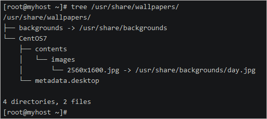


## ls

命令描述： ls命令用于显示指定工作目录下的内容。

命令格式：`ls [参数] [目录名]`。

参数说明：

| 参数 | 说明                                                         |
| :--- | :----------------------------------------------------------- |
| -a   | 显示所有文件及目录（包括隐藏文件）                           |
| -l   | 将文件的权限、拥有者、文件大小等详细信息列出（`ll`等同于`ls -l`） |
| -r   | 将文件反序列出（默认按英文字母正序）                         |
| -t   | 将文件按创建时间正序列出                                     |
| -R   | 递归遍历目录下文件                                           |

命令使用示例：

查看当前目录下的所有文件（包括隐藏文件）。

```
ll -a
```

命令输出结果：


## pwd

命令描述：获取当前工作目录的绝对路径。

命令使用示例：

 

## 

## cd 

命令描述：cd命令用于切换工作目录。

命令使用示例：


在路径表示中：

- 一个半角句号（`.`）表示当前目录，例如路径./app/log等同于app/log。
- 两个半角句号（`..`）表示上级目录，例如路径/usr/local/../src等同于/usr/src，其中local和src目录同级。

`cd`命令的默认参数为`~`，符号`~`表示当前用户的家目录，即在root用户登录时，命令`cd`、`cd ~`和`cd /root`执行效果相同。

## touch

命令描述：touch命令用于修改文件或者目录的时间属性，包括存取时间和更改时间。若文件不存在，系统会建立一个新的文件。

命令格式：`touch [参数] [文件]`。

参数说明：

| 参数 | 说明                               |
| :--- | :--------------------------------- |
| -c   | 如果指定文件不存在，不会建立新文件 |
| -r   | 使用参考文件的时间记录             |
| -t   | 设置文件的时间记录                 |


命令使用示例：

- 创建两个空文件。


- 修改demo1.txt的时间记录为当前系统时间。


- 更新demo2.txt的时间记录，使其和demo1.txt的时间记录相同。

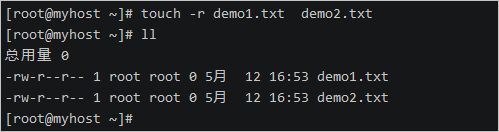

## mkdir

命令描述：mkdir命令用于新建子目录。`-p`参数确保目录名称存在，不存在的就新建一个。

命令使用示例：

新建目录a/b/c/d，并使用tree命令查看创建后的目录结构。

## 

## rm

命令描述：rm命令用于删除一个文件或者目录。

命令格式：`rm [参数] [文件]`。

参数说明：

| 参数 | 说明               |
| :--- | :----------------- |
| -i   | 删除前逐一询问确认 |
| -f   | 无需确认，直接删除 |
| -r   | 删除目录下所有文件 |

命令使用示例：

无需确认直接删除文件。


无需确认直接删除目录a及其目录下所有子目录和文件。

## 

## cp

命令描述： cp命令主要用于复制文件或目录。

命令格式：`cp [参数] [源文件] [目标文件]`。

参数说明：

| 参数 | 说明                                                       |
| :--- | :--------------------------------------------------------- |
| -d   | 复制时保留链接                                             |
| -f   | 覆盖已经存在的目标文件而不给出提示                         |
| -i   | 覆盖前询问                                                 |
| -p   | 除复制文件的内容外，还把修改时间和访问权限也复制到新文件中 |
| -r   | 复制目录及目录内的所有项目                                 |

命令使用示例：

将目录c/d中的所有内容复制到目录a/b下。

## 

## mv 

命令描述： mv命令用来为文件或目录改名、或将文件或目录移入其它位置。

命令格式：`mv [参数] [源文件] [目标文件]`

参数说明：

| 参数 | 说明                                           |
| :--- | :--------------------------------------------- |
| -i   | 若指定目录已有同名文件，则先询问是否覆盖旧文件 |
| -f   | 如果目标文件已经存在，不会询问而直接覆盖       |

命令使用示例：

- 将文件名a.txt改为b.txt。
  

- 将c目录移动到a/b/c/d/下。
  

- 将当前目录内容全部移动到/tmp目录中。

```
mv ./* /tmp
```

## rename

命令描述：rename命令用字符串替换的方式批量改变文件名。rename命令有C语言和Perl语言两个版本，这里介绍C语言版本的rename命令，不支持正则表达式。

命令使用示例：

- 将当前目录下所有文件名中的字符串demo改为大写的字符串DEMO。
  

- 将当前目录下所有`.txt`文件后缀都改为`text`。
  

## 文件权限管理

ls命令可以查看Linux系统上的文件、目录和设备的权限。

```
ls -l /boot/
```


上述`ls -l`命令中显示的第一列就是文件权限信息，共11位字符，分5部分。

- 第1位表示存档类型，`d`表示目录，`-`表示一般文件。
- 第2~4位表示当前用户的权限（属主权限）。
- 第5~7位表示同用户组的用户权限（属组权限）。
- 第8~10位表示不同用户组的用户权限（其他用户权限）。
- 第11位是一个半角句号`.`，表示SELinux安全标签。

用户权限每组三位，rwx分别表示读、写、执行权限，对应八进制表示为4、2、1。

例如efi目录的root用户权限为`drwxr-xr-x.`。

- 该目录对root用户具有读写和执行所有权限。
- 该目录对root组其他用户有读和执行权限。
- 该目录对其他用户只有执行权限。

所以该权限表示对应八进制权限表示为：

- 属主权限：`4+2+1=7`。
- 属组权限：`4+1=5`。
- 其他用户权限：1。

即751。

## chmod

chmod命令用于修改文件权限mode，`-R`参数以递归方式对子目录和文件进行修改。

命令使用示例：

\1. 新建名为hello.sh的Shell脚本，该脚本将会输出`Hello World`。用`ll`命令可以看到新建的脚本没有执行权限，其权限用八进制表示为644。

```
echo "echo 'Hello World'" > hello.sh
ll
```


\2. 将hello.sh文件增加属主的执行权限。

```
chmod u+x hello.sh
ll
```


\3. 将hello.sh文件撤销属主的执行权限。

```
chmod u-x hello.sh
ll
```


\4. 将hello.sh文件权限修改为八进制表示的744权限。

```
chmod 744 hello.sh
ll
```


\5. 使用bash命令解释器执行hello.sh脚本文件。

```
/bin/bash hello.sh
```


其中，`u+x`表示增加属主的执行权限，u表示属主，g表示属组，o表示其他，a表示所有用户。

## chown

chown命令修改文件的属主和属组；`-R`参数以递归方式对子目录和文件进行修改；`ls -l`命令显示的第三列和第四列就是文件的属主和属组信息。

命令使用示例：

\1. 新建一个文本文件test.txt，用`ll`命令可以看到该文件的属主和属组是root。`whoami`命令可以查看当前Shell环境登录的用户名。

```
whoami
touch test.txt
ll
```


\2. 创建两个用户。

```
useradd test
useradd admin
```

\3. 修改test.txt文件的属主用户为test。

```
chown test test.txt
ll
```

### 

\4. 修改test.txt文件的属主和属组为admin。

```
chown admin:admin test.txt
ll
```


## chgrp

chgrp命令用于修改文件的属组。

命令使用示例：

将test.txt文件的属组改为root。

```
chgrp root test.txt
ll
```

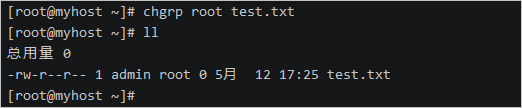


# Linux指令入门-文本处理

## 场景体验目标

本场景将提供一台配置了CentOS 7.7的ECS实例（云服务器）。您可以参考本教程学习Linux系统中的文本编辑工具Vim以及文本处理命令。

## 背景知识

本场景主要涉及以下云产品和服务：

##### [云服务器ECS](https://help.aliyun.com/product/25365.html?)

云服务器（Elastic Compute Service，简称ECS）是阿里云提供的性能卓越、稳定可靠、弹性扩展的IaaS（Infrastructure as a Service）级别云计算服务。云服务器ECS免去了您采购IT硬件的前期准备，让您像使用水、电、天然气等公共资源一样便捷、高效地使用服务器，实现计算资源的即开即用和弹性伸缩。阿里云ECS持续提供创新型服务器，解决多种业务需求，助力您的业务发展。

##### [CentOS](https://www.centos.org/)CentOS（Community Enterprise Operating System，中文意思是社区企业操作系统）是Linux发行版之一，它是来自于Red Hat Enterprise Linux依照开放源代码规定释出的源代码所编译而成。由于出自同样的源代码，因此有些要求高度稳定性的服务器以CentOS替代商业版的Red Hat Enterprise Linux使用。两者的不同，在于CentOS完全开源。

##### [Vim](https://www.vim.org/)

Vim是从vi发展出来的一个文本编辑器。代码补全、编译及错误跳转等方便编程的功能特别丰富，在程序员中被广泛使用，和Emacs并列成为类Unix系统用户最喜欢的文本编辑器。Vim的设计理念是命令的组合。用户学习了各种各样的文本间移动、跳转的命令和其他的普通模式的编辑命令，并且能够灵活组合使用的话，能够比那些没有模式的编辑器更加高效的进行文本编辑。同时Vim与很多快捷键设置和正则表达式类似,可以辅助记忆。并且Vim针对程序员做了优化。


## 创建资源

\1. 请点击页面左侧的 **云产品资源**，在下拉栏中，查看本次实验资源信息；

\2. 在资源下拉栏点击 **免费开通** 按钮，开始创建实验资源。


说明：资源创建过程需要1-3分钟。完成实验资源的创建后，用户可以通过 **云产品资源** 查看实验中所需的资源信息，例如：IP地址、用户名、密码等。


## 连接ECS服务器

\1.  打开系统自带的终端工具。

- Windows：CMD或Powershell。
- MAC：Terminal。

Windows用户请检查系统中是否安装有ssh工具。检查方法：

1）在终端中输入命令ssh -V。

```
ssh -V
```

2）出现如下结果说明已安装。


3）否则请下载安装 [OpenSSH。](https://www.mls-software.com/files/setupssh-8.2p1-1.exe)

\2.  在终端中输入连接命令ssh [username]@[ipaddress]。您需要将其中的username和ipaddress替换为第1小节中创建的ECS服务器的登录名和公网地址。例如：

```
ssh root@123.123.123.123
```


命令显示结果如下：


\3.  输入yes。

\4.  同意继续后将会提示输入登录密码。 密码为已创建的云服务的ECS的登录密码。


登录成功后会显示如下信息。


## 文本编辑工具Vim

### vim的三种操作模式

vim有三种操作模式，分别是命令模式（Command mode）、输入模式（Insert mode）和底线命令模式（Last line mode）。

三种模式切换快捷键：

| 模式         | 快捷键 |
| :----------- | :----- |
| 命令模式     | ESC    |
| 输入模式     | i或a   |
| 底线命令模式 | :      |

- 命令模式

  在命令模式中控制光标移动和输入命令，可对文本进行复制、粘贴、删除和查找等工作。

  使用命令vim filename后进入编辑器视图后，默认模式就是命令模式，此时敲击键盘字母会被识别为一个命令，例如在键盘上连续敲击两次d，就会删除光标所在行。

  以下是在命令模式中常用的快捷操作：

| 操作                                                         | 快捷键               |
| :----------------------------------------------------------- | :------------------- |
| 光标左移                                                     | h                    |
| 光标右移                                                     | l（小写L）           |
| 光标上移                                                     | k                    |
| 光标下移                                                     | j                    |
| 光标移动到下一个单词                                         | w                    |
| 光标移动到上一个单词                                         | b                    |
| 移动游标到第n行                                              | nG                   |
| 移动游标到第一行                                             | gg                   |
| 移动游标到最后一行                                           | G                    |
| 快速回到上一次光标所在位置                                   | Ctrl+o               |
| 删除当前字符                                                 | x                    |
| 删除前一个字符                                               | X                    |
| 删除整行                                                     | dd                   |
| 删除一个单词                                                 | dw或daw              |
| 删除至行尾                                                   | d$或D                |
| 删除至行首                                                   | d^                   |
| 删除到文档末尾                                               | dG                   |
| 删除至文档首部                                               | d1G                  |
| 删除n行                                                      | ndd                  |
| 删除n个连续字符                                              | nx                   |
| 将光标所在位置字母变成大写或小写                             | ~                    |
| 复制游标所在的整行                                           | yy（3yy表示复制3行） |
| 粘贴至光标后（下）                                           | p                    |
| 粘贴至光标前（上）                                           | P                    |
| 剪切                                                         | dd                   |
| 交换上下行                                                   | ddp                  |
| 替换整行，即删除游标所在行并进入插入模式                     | cc                   |
| 撤销一次或n次操作                                            | u{n}                 |
| 撤销当前行的所有修改                                         | U                    |
| 恢复撤销操作                                                 | Ctrl+r               |
| 整行将向右缩进                                               | >>                   |
| 整行将向左退回                                               | <<                   |
| 若档案没有更动，则不储存离开，若档案已经被更动过，则储存后离开 | ZZ                   |

- 输入模式

  在命令模式下按i或a键就进入了输入模式，在输入模式下，您可以正常的使用键盘按键对文本进行插入和删除等操作。

- 底线命令模式

  在命令模式下按`:`键就进入了底线命令模式，在底线命令模式中可以输入单个或多个字符的命令。

  以下是底线命令模式中常用的快捷操作：


| 操作                                                       | 命令                                        |
| :--------------------------------------------------------- | :------------------------------------------ |
| 保存                                                       | :w                                          |
| 退出                                                       | :q                                          |
| 保存并退出                                                 | :wq（`:wq!`表示强制保存退出）               |
| 将文件另存为其他文件名                                     | :w new_filename                             |
| 显示行号                                                   | :set nu                                     |
| 取消行号                                                   | :set nonu                                   |
| 使本行内容居中                                             | :ce                                         |
| 使本行文本靠右                                             | :ri                                         |
| 使本行内容靠左                                             | :le                                         |
| 向光标之下寻找一个名称为word的字符串                       | :/word                                      |
| 向光标之上寻找一个字符串名称为word的字符串                 | :?word                                      |
| 重复前一个搜寻的动作                                       | :n                                          |
| 从第一行到最后一行寻找word1字符串，并将该字符串取代为word2 | `:1,$s/word1/word2/g`或` :%s/word1/word2/g` |

### 使用示例

在本示例将使用vim在文本文件中写入一首唐诗。

\1.  新建一个文件并进入vim命令模式。

```
vim 静夜思.txt
```


\2.  按下`i`进入输入模式，输入《静夜思》的诗名。


\3.   按下ECS键回到命令模式，并输入底线命令`:ce`，使诗名居中。


\4.  按下`o`键换行并进入输入模式，输入第一行诗。


\5.  按下ECS键回到命令模式，并输入底线命令`:ce`，使第一行诗居中。

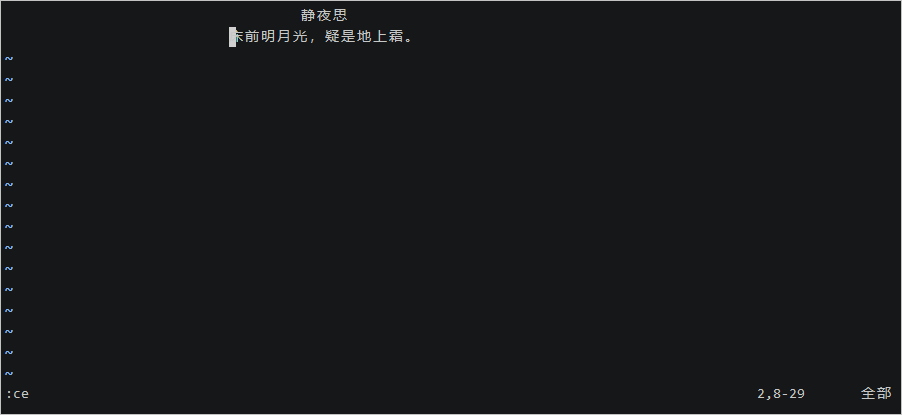

\6.  按下`o`键换行并进入输入模式，输入第二行诗。


\7.  按下ECS键回到命令模式，并输入底线命令`:ce`，使第二行诗居中。


\8.  在命令模式中执行底线命令`:wq`离开vim。


## 文本文件查看命令

## cat

命令描述：cat命令用于查看内容较少的纯文本文件。

命令格式：`cat [选项] [文件]`。

命令参数说明：

| 参数                  | 说明                                             |
| :-------------------- | :----------------------------------------------- |
| -n或--number          | 显示行号                                         |
| -b或--number-nonblank | 显示行号，但是不对空白行进行编号                 |
| -s或--squeeze-blank   | 当遇到有连续两行以上的空白行，只显示一行的空白行 |

命令使用示例：

\1.  将一个自增序列写入test.txt文件中。

```
for i in $(seq 1 10); do echo $i >> test.txt ; done
```

\2. 查看文件内容。

```
 cat test.txt
```

命令输出结果：


\3. 将文件内容清空。

```
cat /dev/null > test.txt
```

\4. 再次检查文件内容。

```
cat test.txt
```

命令输出结果：


## more

命令描述：more命令从前向后分页显示文件内容。

常用操作命令：

| 操作                    | 作用                          |
| :---------------------- | :---------------------------- |
| Enter                   | 向下n行，n需要定义，默认为1行 |
| Ctrl+F或空格键（Space） | 向下滚动一页                  |
| Ctrl+B                  | 向上滚动一页                  |
| =                       | 输出当前行的行号              |
| !命令                   | 调用Shell执行命令             |
| q                       | 退出more                      |

命令使用示例：

从第20行开始分页查看系统日志文件/var/log/messages。

```
more +20 /var/log/messages
```

命令输出结果：


## less

命令描述：less命令可以对文件或其它输出进行分页显示，与moe命令相似，但使用 less 可以随意浏览文件，而 more 仅能向前移动，却不能向后移动。

命令格式：`less [参数] 文件 `。

命令参数说明：

| 参数 | 说明                       |
| :--- | :------------------------- |
| -e   | 当文件显示结束后，自动离开 |
| -m   | 显示类似more命令的百分比   |
| -N   | 显示每行的行号             |
| -s   | 显示连续空行为一行         |

命令常用操作：

| 快捷键               | 说明               |
| :------------------- | :----------------- |
| /字符串              | 向下搜索字符串     |
| ?字符串              | 向上搜索字符串     |
| n                    | 重复前一个搜索     |
| N                    | 反向重复前一个搜索 |
| b或`pageup`键        | 向上翻一页         |
| 空格键或`pagedown`键 | 向下翻一页         |
| u                    | 向前翻半页         |
| d                    | 向后翻半页         |
| y                    | 向前滚动一行       |
| 回车键               | 向后滚动一行       |
| q                    | 退出less命令       |

命令使用示例：

查看命令历史使用记录并通过less分页显示。

```
history | less
```

## head

命令描述：head命令用于查看文件开头指定行数的内容。

命令格式：`head [参数] [文件]`。

命令参数说明：

| 参数        | 说明                                                         |
| :---------- | :----------------------------------------------------------- |
| -n [行数]   | 显示开头指定行的文件内容，默认为10                           |
| -c [字符数] | 显示开头指定个数的字符数                                     |
| -q          | 不显示文件名字信息，适用于多个文件，多文件时默认会显示文件名 |

命令使用示例：

查看/etc/passwd文件的前5行内容。

```
head -5 /etc/passwd
```

命令输出结果：

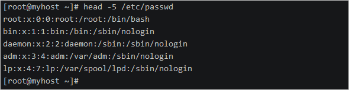

## tail

命令描述：tail命令用于查看文档的后N行或持续刷新内容。

命令格式：`tail [参数] [文件]`。

命令参数说明：

| 参数        | 说明                                   |
| :---------- | :------------------------------------- |
| -f          | 显示文件最新追加的内容                 |
| -q          | 当有多个文件参数时，不输出各个文件名   |
| -v          | 当有多个文件参数时，总是输出各个文件名 |
| -c [字节数] | 显示文件的尾部n个字节内容              |
| -n [行数]   | 显示文件的尾部n行内容                  |

命令使用示例：

查看/var/log/messages系统日志文件的最新10行，并保持实时刷新。

```
tail -f -n 10 /var/log/messages
```


按`ctrl+c`键退出文本实时查看界面。

## stat

命令描述：用来显示文件的详细信息，包括inode、atime、mtime、ctime等。

命令使用示例：

查看/etc/passwd文件的详细信息。

```
stat /etc/passwd
```

命令输出结果：


## wc

命令描述：wc命令用于统计指定文本的行数、字数、字节数。

命令格式：`wc [参数] [文件]`。

命令参数说明：

| 参数 | 说明         |
| :--- | :----------- |
| -l   | 只显示行数   |
| -w   | 只显示单词数 |
| -c   | 只显示字节数 |

命令使用示例：

统计/etc/passwd文件的行数。

```
wc -l /etc/passwd
```

命令输出结果：


## file

命令描述： file命令用于辨识文件类型。

命令格式：`file [参数] [文件]`。

命令参数说明：

| 参数      | 说明                                                         |
| :-------- | :----------------------------------------------------------- |
| -b        | 列出辨识结果时，不显示文件名称                               |
| -c        | 详细显示指令执行过程，便于排错或分析程序执行的情形           |
| -f [文件] | 指定名称文件，其内容有一个或多个文件名称时，让file依序辨识这些文件，格式为每列一个文件名称 |
| -L        | 直接显示符号连接所指向的文件类别                             |

命令使用示例：

查看/var/log/messages文件的文件类型。

```
file /var/log/messages
```

命令输出结果：


## diff

命令描述：diff命令用于比较文件的差异。

命令使用示例：

\1. 构造两个相似的文件

```
echo -e '第一行\n第二行\n我是log1第3行\n第四行\n第五行\n第六行' > 1.log
echo -e '第一行\n第二行\n我是log2第3行\n第四行' > 2.log
```

\2. 分别查看两个文件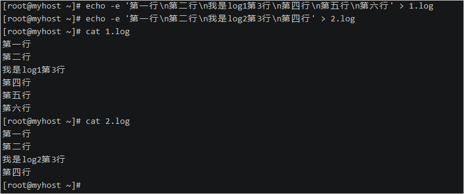

\3. 使用diff查看两个文件的差异


对比结果中的3c3表示两个文件在第3行有不同，5,6d4表示2.log文件相比1.log文件在第4行处开始少了1.log文件的第5和第6行。

 

## 文本文件处理命令

## grep

命令描述：grep命令用于查找文件里符合条件的字符串。

grep全称是Global Regular Expression Print，表示全局正则表达式版本，它能使用正则表达式搜索文本，并把匹配的行打印出来。

在Shell脚本中，grep通过返回一个状态值来表示搜索的状态：

- 0：匹配成功。
- 1：匹配失败。
- 2：搜索的文件不存在。

命令格式：`grep [参数] [正则表达式] [文件]`。

命令常用参数说明：

| 参数                    | 说明                                             |
| :---------------------- | :----------------------------------------------- |
| -c或--count             | 计算符合样式的列数                               |
| -d recurse或-r          | 指定要查找的是目录而非文件                       |
| -e [范本样式]           | 指定字符串做为查找文件内容的样式                 |
| -E 或 --extended-regexp | 将样式为延伸的正则表达式来使用                   |
| -F 或 --fixed-regexp    | 将样式视为固定字符串的列表                       |
| -G 或 --basic-regexp    | 将样式视为普通的表示法来使用                     |
| -i 或 --ignore-case     | 忽略字符大小写的差别                             |
| -n 或 --line-number     | 在显示符合样式的那一行之前，标示出该行的列数编号 |
| -v 或 --revert-match    | 显示不包含匹配文本的所有行                       |

命令使用示例：

- 查看sshd服务配置文件中监听端口配置所在行编号。

  ```
  grep -n Port /etc/ssh/ssh_config
  ```

  命令输出结果：

  

- 查询字符串在文本中出现的行数。

  ```
  grep -c localhost /etc/hosts
  ```

  命令输出结果：

  

- 反向查找，不显示符合条件的行。

  ```
  ps -ef | grep sshd
  ```

  ```
  ps -ef | grep -v grep | grep sshd
  ```

   命令输出结果：

  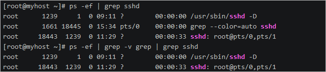

- 以递归的方式查找目录下含有关键字的文件。

  ```
  grep -r *.sh /etc
  ```

  命令输出结果：

  

- 使用正则表达式匹配httpd配置文件中异常状态码响应的相关配置。

  ```
  grep 'ntp[0-9].aliyun.com' /etc/ntp.conf
  ```

  命令输出结果：

  

## sed

命令描述：sed是一种流编辑器，它是文本处理中非常中的工具，能够完美的配合正则表达式使用。

\1. 处理时，把当前处理的行存储在临时缓冲区中，称为模式空间（pattern space）。
\2. 接着用sed命令处理缓冲区中的内容，处理完成后，把缓冲区的内容送往屏幕。
\3. 接着处理下一行，这样不断重复，直到文件末尾。

注意：

- sed命令不会修改原文件，例如删除命令只表示某些行不打印输出，而不是从原文件中删去。
- 如果要改变源文件，需要使用-i选项。

命令格式：`sed [参数] [动作] [文件]`。 

参数说明：

| 参数            | 说明                                 |
| :-------------- | :----------------------------------- |
| -e [script]     | 执行多个script                       |
| -f [script文件] | 执行指定script文件                   |
| -n              | 仅显示script处理后的结果             |
| -i              | 输出到原文件，静默执行（修改原文件） |

动作说明：

| 动作 | 说明             |
| :--- | :--------------- |
| a    | 在行后面增加内容 |
| c    | 替换行           |
| d    | 删除行           |
| i    | 在行前面插入     |
| p    | 打印相关的行     |
| s    | 替换内容         |

命令使用示例：

- 删除第3行到最后一行内容。

  ```
  sed '3,$d' /etc/passwd
  ```

  命令输出结果：

  

- 在最后一行新增行。

  ```
  sed '$a admin:x:1000:1000:admin:/home/admin:/bin/bash' /etc/passwd
  ```

  命令输出结果：

  

- 替换内容。

  ```
  sed 's/SELINUX=disabled/SELINUX=enforcing/' /etc/selinux/config
  ```

  命令输出结果：

  

- 替换行。

  ```
  sed '1c abcdefg' /etc/passwd
  ```

  命令输出结果：

  

## awk

命令描述：和 sed 命令类似，awk 命令也是逐行扫描文件（从第 1 行到最后一行），寻找含有目标文本的行，如果匹配成功，则会在该行上执行用户想要的操作；反之，则不对行做任何处理。

命令格式：`awk [参数] [脚本] [文件]`。

参数说明：

| 参数       | 说明                                                         |
| :--------- | :----------------------------------------------------------- |
| -F fs      | 指定以fs作为输入行的分隔符，awk 命令默认分隔符为空格或制表符 |
| -f file    | 读取awk脚本                                                  |
| -v val=val | 在执行处理过程之前，设置一个变量var，并给其设置初始值为val   |

内置变量：

| 变量 | 用途                                             |
| :--- | :----------------------------------------------- |
| FS   | 字段分隔符                                       |
| $n   | 指定分隔的第n个字段，如$1、$3分别表示第1、第三列 |
| $0   | 当前读入的整行文本内容                           |
| NF   | 记录当前处理行的字段个数（列数）                 |
| NR   | 记录当前已读入的行数                             |
| FNR  | 当前行在源文件中的行号                           |

awk中还可以指定脚本命令的运行时机。默认情况下，awk会从输入中读取一行文本，然后针对该行的数据执行程序脚本，但有时可能需要在处理数据前运行一些脚本命令，这就需要使用BEGIN关键字，BEGIN会在awsk读取数据前强制执行该关键字后指定的脚本命令。

和BEGIN关键字相对应，END关键字允许我们指定一些脚本命令，awk会在读完数据后执行它们。

命令使用示例：

- 查看本机IP地址。

  ```
  ifconfig eth0 |awk '/inet/{print $2}'
  ```

  命令输出结果：

  

- 查看本机剩余磁盘容量。

  ```
  df -h |awk '/\/$/{print $4}'
  ```

  命令输出结果：

  

- 统计系统用户个数。

  ```
  awk -F: '$3<1000{x++} END{print x}' /etc/passwd
  ```

  命令输出结果：

  

- 输出其中登录Shell不以nologin结尾（对第7个字段做!~反向匹配）的用户名、登录Shell信息。

  ```
  awk -F: '$7!~/nologin$/{print $1,$7}' /etc/passwd
  ```

  命令输出结果：

  

- 输出/etc/passwd文件中前三行记录的用户名和用户uid。

  ```
  head -3 /etc/passwd | awk  'BEGIN{FS=":";print "name\tuid"}{print $1,"\t"$3}END{print "sum lines "NR}'
  ```

  命令输出结果：

  

- 查看tcp连接数。

  ```
  netstat -na | awk '/^tcp/ {++S[$NF]} END {for(a in S) print a, S[a]}'
  ```

  命令输出结果：

  

- 关闭指定服务的所有的进程。

  ```
  ps -ef | grep httpd | awk {'print $2'} | xargs kill -9
  ```

## cut

命令描述：cut命令主要用来切割字符串，可以对输入的数据进行切割然后输出。

命令格式：`cut [参数] [文件]`。

参数说明：

| 参数 | 说明                       |
| :--- | :------------------------- |
| -b   | 以字节为单位进行分割       |
| -c   | 以字符为单位进行分割       |
| -d   | 自定义分隔符，默认为制表符 |

命令使用示例：

- 按字节进行切割。


-  按字符进行切割。


- 按指定字符进行切割。


## tr

命令描述：tr命令用于对来自标准输入的字符进行替换、压缩和删除。

命令格式：`tr [参数] [文本]`。

参数说明：

| 参数                         | 说明                                                       |
| :--------------------------- | :--------------------------------------------------------- |
| -c                           | 反选指定字符                                               |
| -d                           | 删除指定字符                                               |
| -s                           | 将重复的字符缩减成一个字符                                 |
| -t [第一字符集] [第二字符集] | 删除第一字符集较第二字符集多出的字符，使两个字符集长度相等 |

命令使用示例：

- 将输入字符由大写转换为小写。

  ```
  echo "HELLO WORLD" | tr 'A-Z' 'a-z'
  ```

  命令输出结果：

  

- 删除字符。

  ```
  echo "hello 123 world 456" | tr -d '0-9'
  ```

  命令输出结果：

  

- 压缩字符。

  ```
  echo "thissss is      a text linnnnnnne." | tr -s ' sn'
  ```

  命令输出结果：

  

- 产生随机密码。

  ```
  cat /dev/urandom | tr -dc a-zA-Z0-9 | head -c 13
  ```

  命令输出结果：

  

# Linux指令入门-系统管理

本场景将介绍Linux中常用的系统工作命令以及系统状态检测命令

### 场景体验目标

本场景将提供一台配置了CentOS 7.7的ECS实例（云服务器）。您可以参考本教程学习Linux系统中常用的系统工作命令以及查看系统状态的命令。

### 背景知识

本场景主要涉及以下云产品和服务：


##### [云服务器ECS](https://help.aliyun.com/product/25365.html?)

云服务器（Elastic Compute Service，简称ECS）是阿里云提供的性能卓越、稳定可靠、弹性扩展的IaaS（Infrastructure as a Service）级别云计算服务。云服务器ECS免去了您采购IT硬件的前期准备，让您像使用水、电、天然气等公共资源一样便捷、高效地使用服务器，实现计算资源的即开即用和弹性伸缩。阿里云ECS持续提供创新型服务器，解决多种业务需求，助力您的业务发展。

##### [CentOS](https://www.centos.org/)

CentOS（Community Enterprise Operating System，中文意思是社区企业操作系统）是Linux发行版之一，它是来自于Red Hat Enterprise Linux依照开放源代码规定释出的源代码所编译而成。由于出自同样的源代码，因此有些要求高度稳定性的服务器以CentOS替代商业版的Red Hat Enterprise Linux使用。两者的不同，在于CentOS完全开源。

## 常用系统工作命令

## echo

命令描述：echo命令用于在终端输出字符串或变量提取后的值。

命令格式：`echo [字符串 | $变量]`。

命令用法示例：

- 显示普通字符串

  ```
  echo "Hello World"
  ```

- 显示变量

  首先在shell环境中定义一个临时变量name。

  ```
  export name="Tom"
  ```

  使用echo命令将变量name的值显示到终端。

  ```
  echo $name
  ```

  输出结果：


- 显示结果定向至文件

  以下命令会将文本`This is a test text.`输出重定向到文件test.txt中，如果文件已存在，将会覆盖文件内容，如果不存在则创建。其中`>`符号表示输出重定向。

  ```
  echo "This is a test text." > test.txt
  ```

  如果您希望将文本追加到文件内容最后，而不是覆盖它，请使用`>>`输出追加重定向符号。

- 显示命令执行结果

  以下命令将会在终端显示当前的工作路径。

  ```
  echo `pwd`
  ```

  注意：pwd命令是用一对反引号（``）包裹，而不是一对单引号（''）。

  使用`$(command)`形式可以达到相同效果。

  ```
  echo $(pwd)
  ```

  输出结果：


## date

命令描述：date命令用于显示和设置系统的时间和日期。

命令格式：`date [选项] [+格式]`。

其中，时间格式的部分控制字符解释如下：

| 字符 | 说明                                                        |
| :--- | :---------------------------------------------------------- |
| %a   | 当地时间的星期名缩写（例如： 日，代表星期日）               |
| %A   | 当地时间的星期名全称 （例如：星期日）                       |
| %b   | 当地时间的月名缩写 （例如：一，代表一月）                   |
| %B   | 当地时间的月名全称 （例如：一月）                           |
| %c   | 当地时间的日期和时间 （例如：2005年3月3日 星期四 23:05:25） |
| %C   | 世纪；比如 %Y，通常为省略当前年份的后两位数字（例如：20）   |
| %d   | 按月计的日期（例如：01）                                    |
| %D   | 按月计的日期；等于%m/%d/%y                                  |
| %F   | 完整日期格式，等价于 %Y-%m-%d                               |
| %j   | 按年计的日期（001-366）                                     |
| %p   | 按年计的日期（001-366）                                     |
| %r   | 当地时间下的 12 小时时钟时间 （例如：11:11:04 下午）        |
| %R   | 24 小时时间的时和分，等价于 %H:%M                           |
| %s   | 自UTC 时间 1970-01-01 00:00:00 以来所经过的秒数             |
| %T   | 时间，等于%H:%M:%S                                          |
| %U   | 一年中的第几周，以周日为每星期第一天（00-53）               |
| %x   | 当地时间下的日期描述 （例如：12/31/99）                     |
| %X   | 当地时间下的时间描述 （例如：23:13:48）                     |
| %w   | 一星期中的第几日（0-6），0 代表周一                         |
| %W   | 一星期中的第几日（0-6），0 代表周一                         |

命令用法示例：

- 按照默认格式查看当前系统时间

  ```
  date
  ```

  输出结果：


- 按照指定格式查看当前系统时间

  ```
  date "+%Y-%m-%d %H:%M:%S"
  ```

  输出结果：


- 查看今天是当年中的第几天

  ```
  date "+%j"
  ```

  输出结果：


- 将系统的当前时间设置为2020年02月20日20点20分20秒

  ```
  date -s "20200220 20:20:20"
  ```

  输出结果：


- 校正系统时间，与网络时间同步

  a. 安装ntp校时工具

```
yum -y install ntp
```

  b. 用ntpdate从时间服务器更新时间

```
ntpdate time.nist.gov
```

  输出结果：

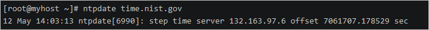

## wget

命令描述：在终端中下载文件。

命令格式：`wget [参数] 下载地址`。

参数说明：

| 参数 | 作用                                 |
| :--- | :----------------------------------- |
| -b   | 后台下载                             |
| -P   | 下载到指定目录                       |
| -t   | 最大重试次数                         |
| -c   | 断点续传                             |
| -p   | 下载页面内所有资源，包括图片、视频等 |
| -r   | 递归下载                             |

命令使用示例：

下载一张图片到路径/root/static/img/中，`-p`参数默认值为当前路径，如果指定路径不存在会自动创建。

```
wget -P /root/static/img/ http://img.alicdn.com/tfs/TB1.R._t7L0gK0jSZFxXXXWHVXa-2666-1500.png
```

输出结果：


## ps

命令描述：ps命令用于查看系统中的进程状态。

命令格式：`ps [参数]`。

命令参数说明：

| 参数 | 作用                                               |
| :--- | :------------------------------------------------- |
| -a   | 显示现行终端机下的所有程序，包括其他用户的程序     |
| -u   | 以用户为主的格式来显示程序状况                     |
| -x   | 显示没有控制终端的进程，同时显示各个命令的具体路径 |
| -e   | 列出程序时，显示每个程序所使用的环境变量           |
| -f   | 显示当前所有的进程                                 |
| -t   | 指定终端机编号，并列出属于该终端机的程序的状况     |

命令使用示例：

```
ps -ef | grep sshd
```

输出结果：


## top

命令描述：top命令动态地监视进程活动与系统负载等信息。

命令使用示例：

```
top
```

输出结果：


命令输出参数解释：

以上命令输出视图中分为两个区域，一个统计信息区，一个进程信息区。

- 统计信息区

  - 第一行信息依次为：系统时间、运行时间、登录终端数、系统负载（三个数值分别为1分钟、5分钟、15分钟内的平均值，数值越小意味着负载越低）。
  - 第二行信息依次为：进程总数、运行中的进程数、睡眠中的进程数、停止的进程数、僵死的进程数。
  - 第三行信息依次为：用户占用资源百分比、系统内核占用资源百分比、改变过优先级的进程资源百分比、空闲的资源百分比等。
  - 第四行信息依次为：物理内存总量、内存使用量、内存空闲量、作为内核缓存的内存量。
  - 第五行信息依次为：虚拟内存总量、虚拟内存使用量、虚拟内存空闲量、预加载内存量。

- 进程信息区

  | 列名    | 含义                                                         |
  | :------ | :----------------------------------------------------------- |
  | PID     | 进程ID                                                       |
  | USER    | 进程所有者的用户名                                           |
  | PR      | 进程优先级                                                   |
  | NI      | nice值。负值表示高优先级，正值表示低优先级                   |
  | VIRT    | 进程使用的虚拟内存总量，单位kb                               |
  | RES     | 进程使用的、未被换出的物理内存大小，单位kb                   |
  | SHR     | 共享内存大小，单位kb                                         |
  | S       | 进程状态D：不可中断的睡眠状态R：正在运行S：睡眠T：停止Z：僵尸进程 |
  | %CPU    | 上次更新到现在的CPU时间占用百分比                            |
  | %MEM    | 进程使用的物理内存百分比                                     |
  | TIME+   | 进程使用的CPU时间总计，单位1/100秒                           |
  | COMMAND | 命令名                                                       |

按 q 键退出监控页面。

## pidof 

命令描述：pidof命令用于查询指定服务进程的PID值。

命令格式：`pidof [服务名称]`。

命令参数说明：

| 参数 | 说明                                                   |
| :--- | :----------------------------------------------------- |
| -s   | 仅返回一个进程号                                       |
| -c   | 只显示运行在root目录下的进程，这个选项只对root用户有效 |
| -o   | 忽略指定进程号的进程                                   |
| -x   | 显示由脚本开启的进程                                   |

命令使用示例：

查询出crond服务下的所有进程ID。

```
pidof crond
```

输出结果：


## kill

命令描述：kill命令用于终止指定PID的服务进程。

kill可将指定的信息送至程序。预设的信息为`SIGTERM(15)`，可将指定程序终止。若仍无法终止该程序，可使用`SIGKILL(9)`信息尝试强制删除程序。

命令格式：`kill [参数] [进程PID]`。

命令使用示例：

删除pid为1247的进程。

```
kill -9 1247
```

## killall

命令描述：killall命令用于终止指定名称的服务对应的全部进程。

命令格式：`killall [进程名称]`。

命令使用示例：

删除crond服务下的所有进程。

```
killall crond
```

## reboot

命令描述：reboot命令用来重启系统。

命令格式：`reboot [-n] [-w] [-d] [-f] [-i]`。

命令参数说明：

- -n：保存数据后再重新启动系统。
- -w：仅做测试，并不是真的将系统重新开机，只会把重新开机的数据写入记录文件/var/log/wtmp。
- -d：重新启动时不把数据写入记录文件/var/tmp/wtmp。
- -f：强制重新开机，不调用shutdown指令的功能。
- -i：关闭网络设置之后再重新启动系统。

命令使用示例：

```
reboot
```

## poweroff

命令描述：poweroff命令用来关闭系统。

命令使用示例：

```
poweroff
```

## 系统状态检测命令

## ifconfig

命令描述：ifconfig命令用于获取网卡配置与网络状态等信息。

命令示例：


命令输出说明：

- 第一部分的第一行显示网卡状态信息。
  - eth0表示第一块网卡。
  - UP代表网卡开启状态。
  - RUNNING代表网卡的网线被接上。
  - MULTICAST表示支持组播。
- 第二行显示网卡的网络信息。
  - inet（IP地址）：172.16.132.195。
  - broadcast（广播地址）：172.16.143.255。
  - netmask（掩码地址）：255.255.240.0。
- RX表示接收数据包的情况，TX表示发送数据包的情况。
- lo表示主机的回环网卡，是一种特殊的网络接口，不与任何实际设备连接，而是完全由软件实现。与回环地址（127.0.0.0/8 或 ::1/128）不同，回环网卡对系统显示为一块硬件。任何发送到该网卡上的数据都将立刻被同一网卡接收到。

## uname

命令描述：uname命令用于查看系统内核与系统版本等信息。

命令语法：`uname [-amnrsv][--help][--version]`

命令使用示例：

- 显示系统信息。

  ```
  uname -a
  ```

  命令输出结果：

  

- 显示当前系统的硬件架构。

  ```
  uname -i
  ```

  命令输出结果：

  

- 显示操作系统发行编号。

  ```
  uname -r
  ```

  命令输出结果：

  

- 显示操作系统名称。

  ```
  uname -s
  ```

  命令输出结果：

  

- 显示主机名称。

  ```
  uname -n
  ```

  命令输出结果：

  

## uptime

命令描述：uptime 用于查看系统的负载信息。

命令使用示例：


命令输出说明：

| 负载信息           | 命令输出值                                                   |
| :----------------- | :----------------------------------------------------------- |
| 当前服务器时间     | 14:20:27                                                     |
| 当前服务器运行时长 | 2 min                                                        |
| 当前用户数         | 2 users                                                      |
| 当前负载情况       | `load average: 0.03, 0.04, 0.02`（分别取1min，5min，15min的均值） |

## free

命令描述：free用于显示当前系统中内存的使用量信息。

命令语法：`free [-bkmotV][-s <间隔秒数>]`。

命令参数说明：

| 参数 | 说明                                                         |
| :--- | :----------------------------------------------------------- |
| -b   | 以Byte为单位显示内存使用情况                                 |
| -k   | 以KB为单位显示内存使用情况                                   |
| -m   | 以MB为单位显示内存使用情况                                   |
| -h   | 以合适的单位显示内存使用情况，最大为三位数，自动计算对应的单位值。 |

命令使用示例：


命令输出说明：

| 参数       | 说明                                          |
| :--------- | :-------------------------------------------- |
| total      | 物理内存总数                                  |
| used       | 已经使用的内存数                              |
| free       | 空间的内存数                                  |
| share      | 多个进程共享的内存总额                        |
| buff/cache | 应用使用内存数                                |
| available  | 可用的内存数                                  |
| Swap       | 虚拟内存（阿里云ECS服务器默认不开启虚拟内存） |

## who

命令描述：who 命令显示关于当前在本地系统上的所有用户的信息。

命令使用示例：

- 显示当前登录系统的用户


- 显示用户登录来源

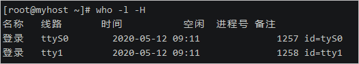

- 只显示当前用户


- 精简模式显示

##  

## last

命令描述： last 命令用于显示用户最近登录信息。

命令使用示例：


由于这些信息都是以日志文件的形式保存在系统中，黑客可以很容易地对内容进行篡改，所以该命令输出的信息并不能作为服务器是否被入侵的依据。

## history

命令描述：history命令用于显示历史执行过的命令。

bash默认记录1000条执行过的历史命令，被记录在~/.bash_history文件中。

命令使用示例：

- 显示最新10条执行过的命令。


- 清除历史记录。

  ```
  history -c
  ```


# 基于ECS搭建云上博客

本场景基于 ECS（云服务器）+ CentOS（操作系统）环境，通过部署 LAMP环境并安装 WordPress 快速搭建个人博客。


## 场景体验目标

本场景将提供一台基础环境的 CentOS 6.4 64 位的 ECS（云服务器）实例。我们将会在这台服务器上安装和部署LAMP 环境，然后安装 WordPress，帮助开发者快速搭建自己的博客。

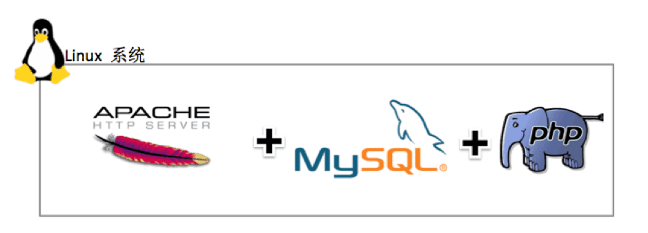


体验此场景后，可以掌握的知识有：

1．弹性计算 ECS 基本概念；

2．Apache + MySQL + PHP语言环境的安装和部署；

3．WordPress 的安装和基础配置；

4．Linux 系统的基础命令

## 背景知识

#### [ECS 产品介绍](https://help.aliyun.com/document_detail/25367.html)：

云服务器（Elastic Compute Service，简称ECS）是阿里云提供的性能卓越、稳定可靠、弹性扩展的IaaS（Infrastructure as a Service）级别云计算服务。云服务器ECS免去了您采购IT硬件的前期准备，让您像使用水、电、天然气等公共资源一样便捷、高效地使用服务器，实现计算资源的即开即用和弹性伸缩。

#### 关于 LAMP：

LAMP 是指Linux（操作系统）+ Apache （HTTP 服务器）+ MySQL（数据库）和 PHP（网络编程语言），一般用来建立 web 应用平台。和 Java/J2EE 架构相比， LAMP 具有 Web 资源丰富、轻量、快速开发等特点；与微软的 .NET 架构相比，LAMP具有通用、跨平台、高性能、低价格的优势。因此 LAMP 无论是性能、质量还是价格都是企业搭建网站的首选平台。

Linux 是一种自由和开发源代码的类 UNIX 操作系统，目前运用最广泛使用人数最多的操作系统。本实验为大家提供的就是Linux 操作系统。

Apache 是LAMP架构最核心的 Web Server，开源、稳定、模块丰富是 Apache 的优势。但 Apache 的缺点是有些臃肿，内存和 CPU 开销大，性能上有损耗，不如一些轻量级的 Web 服务（例如 nginx）高效，轻量级的 Web 服务器对于静态文件的响应能力来说远高于 Apache 服务器。Apache 做为 Web Server 是负载 PHP 的最佳选择，如果流量很大的话，可以采用 nginx 来负载非 PHP的Web 请求。

PHP 是一种通用开源脚本语言。语法吸收了 C 语言、Java 和 Per1 的特点，利于学习，使用广泛，主要适用于 Web 开发领域。PHP 独特的语法混合了 C、Java、Perl以及 PHP 自创的语法。它可以比 CGI 或者 Perl 更快速地执行动态网页。用 PHP 做出的动态页面与其他的编程语言相比，PHP 是将程序嵌入到 HTML（标准通用标记语言下的一个应用）文档中去执行，执行效率比完全生成 HTML 标记的 CGI 要高许多；PHP还可以执行编译后代码，编译可以达到加密和优化代码运行，使代码运行更快。

MySQL 在开源数据库中，性能、稳定性和功能上是首选，可以达到百万级别的数据存储，网站初期可以将 MySQL 和 Web 服务器放在一起，但是当访问量达到一定规模后，应该将 MySQL 数据库从 Web Server 上独立出来，在单独的服务器上运行，同时保持 Web Server 和 MySQL 服务器的稳定连接。

#### 关于 WordPress：

**WordPress** 是一种使用 PHP 语言开发的博客平台，用户可以在支持 PHP 和 MySQ 数据库的服务器上架设 WordPress。你可以使用 WordPress 搭建一个简单的独立博客，也可以把 WordPress 当作一个内容管理系统（CMS），用来搭建一个小门户网站，总之，现在的 WordPress 已经强大到几乎可以搭建目前所有常见类型的网站，比如门户、下载站、淘宝客、论坛、多博客等等。


- 


## 安装 Apache HTTP 服务

Apache是世界使用排名第一的Web服务器软件。它可以运行在几乎所有广泛使用的计算机平台上，由于其跨平台和安全性被广泛使用，是最流行的Web服务器端软件之一。

\1.  执行如下命令，安装Apache服务及其扩展包。

```
yum -y install httpd httpd-manual mod_ssl mod_perl mod_auth_mysql
```

返回类似如下图结果则表示安装成功。

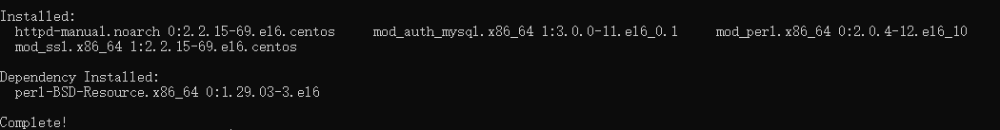


\2.  执行如下命令，启动Apache服务。

```
systemctl start httpd.service
```

\3.  测试Apache服务是否安装并启动成功。

Apache默认监听80端口，所以只需在浏览器访问ECS分配的IP地址http://<ECS公网地址>，如下图：


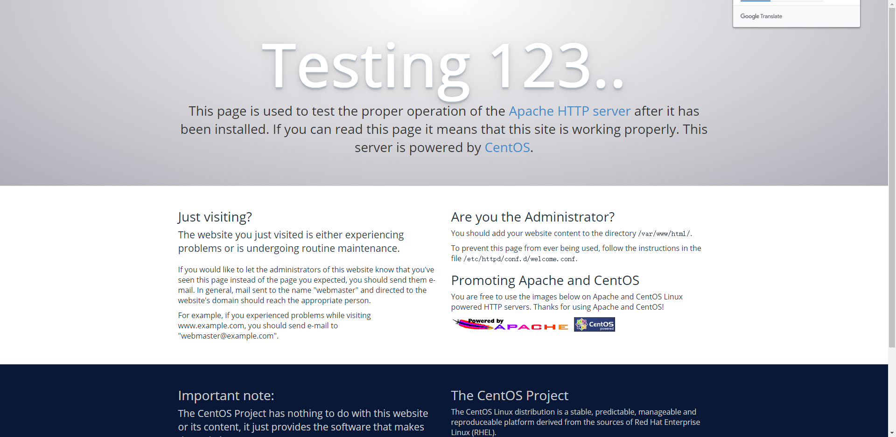


## 安装 MySQL 数据库

由于使用wordpress搭建云上博客，需要使用MySQL数据库存储数据，所以这一步我们安装一下MySQL。

\1.  执行如下命令，下载并安装MySQL官方的`Yum Repository`。

```
wget http://dev.mysql.com/get/mysql57-community-release-el7-10.noarch.rpm
yum -y install mysql57-community-release-el7-10.noarch.rpm
yum -y install mysql-community-server
```


\2.  执行如下命令，启动 MySQL 数据库。

```
systemctl start mysqld.service
```

\3.  执行如下命令，查看MySQL运行状态。

```
systemctl status mysqld.service
```


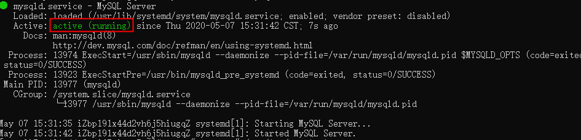

\4.  执行如下命令，查看MySQL初始密码。

```
grep "password" /var/log/mysqld.log
```


\5.  执行如下命令，登录数据库。

```
mysql -uroot -p
```


\6.  执行如下命令，修改MySQL默认密码。

> **说明** 新密码设置的时候如果设置的过于简单会报错，必须同时包含大小写英文字母、数字和特殊符号中的三类字符。

```
ALTER USER 'root'@'localhost' IDENTIFIED BY 'NewPassWord1.';
```

\7.  执行如下命令，创建wordpress库。

```
create database wordpress; 
```

\8.  执行如下命令，创建wordpress库。 执行如下命令，查看是否创建成功。

```
show databases;
```

\9.  输入`exit`退出数据库。


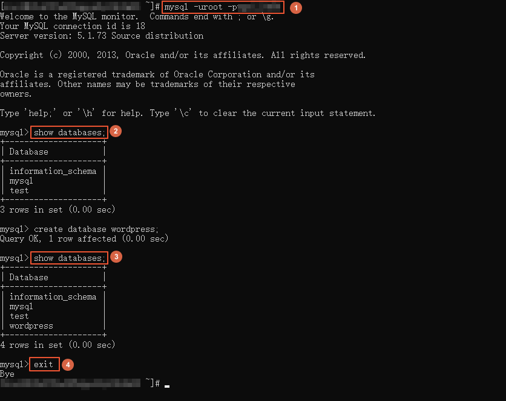


## 安装 PHP 语言环境

WordPress是使用PHP语言开发的博客平台，用户可以在支持PHP和MySQL数据库的服务器上架设属于自己的网站。也可以把WordPress当作一个内容管理系统（CMS）来使用。

\1.  执行如下命令，安装PHP环境。

```
yum -y install php php-mysql gd php-gd gd-devel php-xml php-common php-mbstring php-ldap php-pear php-xmlrpc php-imap
```

\2.  执行如下命令创建PHP测试页面。

```
echo "<?php phpinfo(); ?>" > /var/www/html/phpinfo.php
```

\3.  执行如下命令，重启Apache服务。

```
systemctl restart httpd
```

\4.  打开浏览器，访问`http:///phpinfo.php`，显示如下页面表示PHP语言环境安装成功。


## Wordpress安装和配置

本小节将在已搭建好的LAMP 环境中，安装部署 WordPress

\1.  执行如下命令，安装wordpress。

```
yum -y install wordpress
```

显示如下信息表示安装成功。


\2.  修改WordPress配置文件。

1）执行如下命令，修改wp-config.php指向路径为绝对路径。

```
# 进入/usr/share/wordpress目录。
cd /usr/share/wordpress
# 修改路径。
ln -snf /etc/wordpress/wp-config.php wp-config.php
# 查看修改后的目录结构。
ll
```

2）执行如下命令，移动wordpress到Apache根目录。

```
# 在Apache的根目录/var/www/html下，创建一个wp-blog文件夹。
mkdir /var/www/html/wp-blog
mv * /var/www/html/wp-blog/
```

3）执行以下命令修改wp-config.php配置文件。

在执行命令前，请先替换以下三个参数值。

- database_name_here为之前步骤中创建的数据库名称，本示例为wordpress。
- username_here为数据库的用户名，本示例为root。
- password_here为数据库的登录密码，本示例为NewPassWord1.。

```
sed -i 's/database_name_here/wordpress/' /var/www/html/wp-blog/wp-config.php
sed -i 's/username_here/root/' /var/www/html/wp-blog/wp-config.php
sed -i 's/password_here/NewPassWord1./' /var/www/html/wp-blog/wp-config.php
```

4）执行以下命令，查看配置文件信息是否修改成功。

```
cat -n /var/www/html/wp-blog/wp-config.php
```


\3.  执行如下命令，重启Apache服务。

```
systemctl restart httpd
```

 


## 测试Wordpress

完成以上所有步骤后，就可以测试我们基于ECS所搭建的云上博客了。

\1.  打开浏览器并访问http://<ECS公网IP>/wp-blog/wp-admin/install.php。

\2.  根据以下信息完成wordpress初始化配置。

- Site Title：站点名称，例如：Hello ADC。
- Username：管理员用户名，例如：admin。
- Password：访问密码，例如：cIxWg9t@a8MJBAnf%j。
- Your Email：email地址，建议为真实有效的地址。若没有，可以填写虚拟email地址，但将无法接收信息，例如：admin@admin.com。


\3.  单击Install WordPress完成Wordpress初始化。

\4.  单击Log In进行登录。


\5.  输入设置的用户名和密码。


\6.  登录后，您就可以添加博客进行发布了。

 


