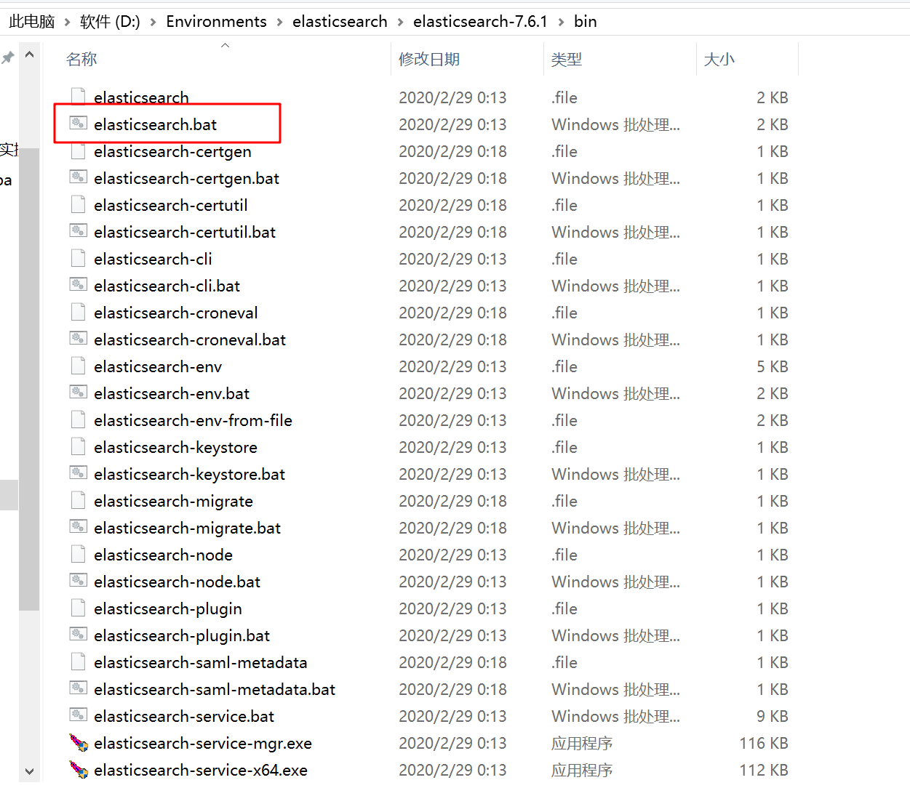

ElasticSearch基本介绍

# 1、ElasticSearch简介

## 什么是ElasticSearch

Elaticsearch，简称为es，

 es是一个开源的高扩展的分布式全文检索引擎，目前是全文搜索引擎的首选。

它可以近乎实时的存储、检索数据；可以快速地储存、搜索和分析海量数据。维基百科、Stack Overflow、Github 都采用它。

本身扩展性很好，可以扩展到上百台服务器，处理PB级别的数据。

es也使用Java开发并使用Lucene作为其核心来实现所有索引和搜索的功能，

但是它的目的是通过简单的RESTful API来隐藏Lucene的复杂性，开箱即用，

从而让全文搜索变得简单。


## ElasticSearch的使用案例

2013年初，GitHub抛弃了Solr，采取ElasticSearch 来做PB级的搜索。 “GitHub使用ElasticSearch搜索20TB的数据，包括13亿文件和1300亿行代码”
维基百科：启动以elasticsearch为基础的核心搜索架构
SoundCloud：“SoundCloud使用ElasticSearch为1.8亿用户提供即时而精准的音乐搜索服务”
百度：百度目前广泛使用ElasticSearch作为文本数据分析，采集百度所有服务器上的各类指标数据及用户自定义数据，通过对各种数据进行多维分析展示，辅助定位分析实例异常或业务层面异常。目前覆盖百度内部
20多个业务线（包括casio、云分析、网盟、预测、文库、直达号、钱包、风控等），单集群最大100台机器，200个ES节点，每天导入30TB+数据
新浪使用ES 分析处理32亿条实时日志
阿里使用ES 构建挖财自己的日志采集和分析体系

## ElasticSearch对比Solr

Solr 利用 Zookeeper 进行分布式管理，而 Elasticsearch 自身带有分布式协调管理功能;
Solr 支持更多格式的数据，而 Elasticsearch 仅支持json文件格式；
Solr 官方提供的功能更多，而 Elasticsearch 本身更注重于核心功能，高级功能多有第三方插件提供；
Solr 在传统的搜索应用中表现好于 Elasticsearch，但在处理实时搜索应用时效率明显低于 Elasticsearch

处理实时搜索应用时效率

# 2、ElasticSearch安装与启动

## 下载ES压缩包

ElasticSearch分为Linux和Window版本，我是简单的使用下ElasticSearch的Java客户端的学习，我使用的是安装较为简便的Window版本，项目上线后，可以由公司的运维人员会安装Linux版的ES供我们连接使用。

ElasticSearch的官方地址： https://www.elastic.co/products/elasticsearch

https://www.elastic.co/downloads/elasticsearch


## 安装ES服务

Window版的ElasticSearch的安装很简单，类似Window版的Tomcat，解压开即安装完毕，解压后的ElasticSearch
的目录结构如下：


7.6.1  我是20-04-11月下载安装的


修改elasticsearch配置文件：config/elasticsearch.yml，增加以下两句命令：

```yml
http.cors.enabled: true
http.cors.allow‐origin: "*"
```

此步为允许elasticsearch跨越访问，如果不安装后面的elasticsearch-head是可以不修改，直接启动。

config/elasticsearch.yml 加上 


## 启动ES服务

点击ElasticSearch下的bin目录下的elasticsearch.bat启动，控制台显示的日志信息如下：




注意：9300是tcp通讯端口，集群间和TCPClient都执行该端口，9200是http协议的RESTful接口 。
通过浏览器访问ElasticSearch服务器，看到如下返回的json信息，代表服务启动成功：

http://localhost:9200/


注意：ElasticSearch是使用java开发的，且本版本的es需要的jdk版本要是1.8以上，所以安装ElasticSearch之前保证JDK1.8+安装完毕，并正确的配置好JDK环境变量，否则启动ElasticSearch失败。

我的JDK是

```bash
C:\Users\x1c>java -version
openjdk version "11.0.2" 2019-01-15
OpenJDK Runtime Environment 18.9 (build 11.0.2+9)
OpenJDK 64-Bit Server VM 18.9 (build 11.0.2+9, mixed mode)

C:\Users\x1c>
```


## 安装ES的图形化界面插件


ElasticSearch不同于Solr自带图形化界面，但我们可以通过安装ElasticSearch的head插件，完成图形化界面的效果，完成索引数据的查看。安装插件的方式有两种，在线安装和本地安装。我们这采用本地安装方式进行head插件的安装。

elasticsearch-5-*以上版本安装head需要安装node和grunt

1）下载head插件：https://github.com/mobz/elasticsearch-head

2）将elasticsearch-head-master压缩包解压到任意目录，但是要和elasticsearch的安装目录区别开


3）下载nodejs：https://nodejs.org/en/download/
可以下载Windows版本的 点下一步下一步 

安装完毕，可以通过cmd控制台输入：node -v 查看版本号

```bash
C:\Users\x1c>node -v
v11.9.0

C:\Users\x1c>

```


5）将grunt安装为全局命令 ，Grunt是基于Node.js的项目构建工具
在cmd控制台中输入如下执行命令：

```
npm install -g grunt -cli
```

执行结果如下图：


6）进入elasticsearch-head-master目录启动head，在命令提示符下输入命令：

```
npm install
grunt server
```


7）打开浏览器，输入 http://localhost:9100，看到如下页面：


如果不能成功连接到es服务，可能是elasticsearch跨越访问。

需要修改ElasticSearch的config目录下的配置文件：config/elasticsearch.yml，增加以下两句命令：

```yml
http.cors.enabled: true
http.cors.allow‐origin: "*"
```

然后重新启动ElasticSearch服务。


搞完收工

## 资料

记录

1、[全文搜索引擎 Elasticsearch 入门教程](http://www.ruanyifeng.com/blog/2017/08/elasticsearch.html)   - 阮一峰

2、[黑马-JavaEE在线就业班2.0](https://www.boxuegu.com/class/outline-1112.html)

# 3、ElasticSearch相关概念(术语)

## 概述

Elasticsearch是面向文档(document oriented)的，

这意味着它可以存储整个对象或文档(document)。

然而它不仅仅是存储，还会索引(index)每个文档的内容使之可以被搜索。

不仅仅是存储 还会索引 

在Elasticsearch中，你可以对文档（而非成行成列的数据）进行索引、搜索、排序、过滤。Elasticsearch比传统关系型数据库如下：

```
Relational DB ‐> Databases ‐> Tables ‐> Rows ‐> Columns
Elasticsearch ‐> Indices ‐> Types ‐> Documents ‐> Fields
```

关系型数据库  数据库 表  记录  列

ES   				索引库  类型  文档 字段 


## Elasticsearch核心概念

### 索引 index

一个索引就是一个拥有几分相似特征的文档的集合。

比如说，你可以有一个客户数据的索引，另一个产品目录的索引，还有一个订单数据的索引。

一个索引由一个名字来标识（必须全部是小写字母的），并且当我们要对对应于这个索引中的文档进行索引、搜索、更新和删除的时候，都要使用到这个名字。在一个集群中，可以定义任意多的索引。


### 类型 type

在一个索引中，你可以定义一种或多种类型。一个类型是你的索引的一个逻辑上的分类/分区，其语义完全由你来
定。通常，会为具有一组共同字段的文档定义一个类型。比如说，我们假设你运营一个博客平台并且将你所有的数
据存储到一个索引中。在这个索引中，你可以为用户数据定义一个类型，为博客数据定义另一个类型，当然，也可
以为评论数据定义另一个类型。

### 文档 document

一个文档是一个可被索引的基础信息单元。比如，你可以拥有某一个客户的文档，某一个产品的一个文档，当然，
也可以拥有某个订单的一个文档。文档以JSON（Javascript Object Notation）格式来表示，而JSON是一个到处存
在的互联网数据交互格式。
在一个index/type里面，你可以存储任意多的文档。注意，尽管一个文档，物理上存在于一个索引之中，文档必须
被索引/赋予一个索引的type。

### 字段Field

相当于是数据表的字段，对文档数据根据不同属性进行的分类标识

### 映射 mapping

mapping是处理数据的方式和规则方面做一些限制，如某个字段的数据类型、默认值、分析器、是否被索引等等，
这些都是映射里面可以设置的，其它就是处理es里面数据的一些使用规则设置也叫做映射，按着最优规则处理数据
对性能提高很大，因此才需要建立映射，并且需要思考如何建立映射才能对性能更好。

### 接近实时 NRT

Elasticsearch是一个接近实时的搜索平台。这意味着，从索引一个文档直到这个文档能够被搜索到有一个轻微的延
迟（通常是1秒以内）

### 集群 cluster

一个集群就是由一个或多个节点组织在一起，它们共同持有整个的数据，并一起提供索引和搜索功能。一个集群由
一个唯一的名字标识，这个名字默认就是“elasticsearch”。这个名字是重要的，因为一个节点只能通过指定某个集
群的名字，来加入这个集群

### 节点 node

一个节点是集群中的一个服务器，作为集群的一部分，它存储数据，参与集群的索引和搜索功能。和集群类似，一
个节点也是由一个名字来标识的，默认情况下，这个名字是一个随机的漫威漫画角色的名字，这个名字会在启动的
时候赋予节点。这个名字对于管理工作来说挺重要的，因为在这个管理过程中，你会去确定网络中的哪些服务器对
应于Elasticsearch集群中的哪些节点。
一个节点可以通过配置集群名称的方式来加入一个指定的集群。默认情况下，每个节点都会被安排加入到一个叫
做“elasticsearch”的集群中，这意味着，如果你在你的网络中启动了若干个节点，并假定它们能够相互发现彼此，
它们将会自动地形成并加入到一个叫做“elasticsearch”的集群中。
在一个集群里，只要你想，可以拥有任意多个节点。而且，如果当前你的网络中没有运行任何Elasticsearch节点，
这时启动一个节点，会默认创建并加入一个叫做“elasticsearch”的集群。

### 分片和复制 shards&replicas

一个索引可以存储超出单个结点硬件限制的大量数据。比如，一个具有10亿文档的索引占据1TB的磁盘空间，而任
一节点都没有这样大的磁盘空间；或者单个节点处理搜索请求，响应太慢。为了解决这个问题，Elasticsearch提供
了将索引划分成多份的能力，这些份就叫做分片。当你创建一个索引的时候，你可以指定你想要的分片的数量。每
个分片本身也是一个功能完善并且独立的“索引”，这个“索引”可以被放置到集群中的任何节点上。分片很重要，主
要有两方面的原因： 1）允许你水平分割/扩展你的内容容量。 2）允许你在分片（潜在地，位于多个节点上）之上
进行分布式的、并行的操作，进而提高性能/吞吐量。
至于一个分片怎样分布，它的文档怎样聚合回搜索请求，是完全由Elasticsearch管理的，对于作为用户的你来说，
这些都是透明的。
在一个网络/云的环境里，失败随时都可能发生，在某个分片/节点不知怎么的就处于离线状态，或者由于任何原因
消失了，这种情况下，有一个故障转移机制是非常有用并且是强烈推荐的。为此目的，Elasticsearch允许你创建分
片的一份或多份拷贝，这些拷贝叫做复制分片，或者直接叫复制。
复制之所以重要，有两个主要原因： 在分片/节点失败的情况下，提供了高可用性。因为这个原因，注意到复制分
片从不与原/主要（original/primary）分片置于同一节点上是非常重要的。扩展你的搜索量/吞吐量，因为搜索可以
在所有的复制上并行运行。总之，每个索引可以被分成多个分片。一个索引也可以被复制0次（意思是没有复制）
或多次。一旦复制了，每个索引就有了主分片（作为复制源的原来的分片）和复制分片（主分片的拷贝）之别。分
片和复制的数量可以在索引创建的时候指定。在索引创建之后，你可以在任何时候动态地改变复制的数量，但是你
事后不能改变分片的数量。
默认情况下，Elasticsearch中的每个索引被分片5个主分片和1个复制，这意味着，如果你的集群中至少有两个节
点，你的索引将会有5个主分片和另外5个复制分片（1个完全拷贝），这样的话每个索引总共就有10个分片。