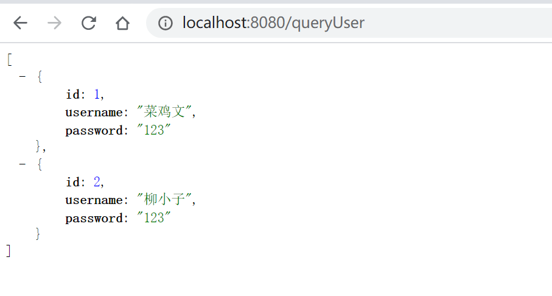

#  SpringBoot整合Mybatis

[TOC]


SpringBoot整合MyBatis开发框架

Mybatis简介

在[MyBatis官网](https://mybatis.org/mybatis-3/index.html)（官网地址：http://www.mybatis.org/mybatis-3/index.html）上是这样介绍MyBatis的：MyBatis是一款优秀的持久层框架，它支持定制化自定义SQL、存储过程以及高级映射。MyBatis避免了几乎所有的JDBC代码和手动设置参数以及获取结果集。MyBatis可以使用简单的XML或注解来配置和映射原生信息，将接口和Java的POJOs（Plain Old Java Objects，普通的Java对象）映射成数据库中的记录。

MyBatis的优点是：

* 可以手写SQL，比较灵活，对于很多互联网公司、业务迭代速度快的公司或者业务复杂的项目，MyBatis修改、维护等方面更加灵活。
* 从学习成本上来说，MyBatis上手更加容易，基本上没有更多学习成本，这是很多公司选用MyBatis的理由。
* 从SQL优化方面来说，手写的SQL优化起来更加方便。

Mybatis与SpringBoot： 

MyBatis是一款常用并且配置极为简单的ORM（关系对象映射）开发框架。在SpringBoot中，对MyBatis框架的整合进行了进一步简化。想实现这种配置，需要在项目中引入mybatis-spring-boot- starter依赖支持库。

# 1、添加Mybatis的起步依赖

修改pom文件，添加以下依赖。

```xml
 <!--mybatis起步依赖-->
        <dependency>
            <groupId>org.mybatis.spring.boot</groupId>
            <artifactId>mybatis-spring-boot-starter</artifactId>
            <version>2.1.3</version>
        </dependency>
```

# 2、添加数据库驱动坐标

MySQL

```xml
 <!-- MySQL连接驱动 -->
        <dependency>
            <groupId>mysql</groupId>
            <artifactId>mysql-connector-java</artifactId>
            <scope>runtime</scope>
        </dependency>
```


# 3、添加数据库连接信息

在application.properties中添加数据量的连接信息

```properties
#DB Configuration:
spring.datasource.driverClassName=com.mysql.cj.jdbc.Driver
spring.datasource.url=jdbc:mysql://127.0.0.1:3306/test?useUnicode=true&characterEncoding=utf8&serverTimezone=UTC
spring.datasource.username=root
spring.datasource.password=123456
```


# 4、创建user表

在test数据库中创建user表

```sql
-- ----------------------------
-- Table structure for `user`
-- ----------------------------
DROP TABLE IF EXISTS `user`;
CREATE TABLE `user` (
  `id` int(11) NOT NULL AUTO_INCREMENT,
  `username` varchar(50) DEFAULT NULL,
  `password` varchar(50) DEFAULT NULL,
  PRIMARY KEY (`id`)
) ENGINE=InnoDB AUTO_INCREMENT=10 DEFAULT CHARSET=utf8;

-- ----------------------------
-- Records of user
-- ----------------------------
INSERT INTO `user` VALUES ('1', '菜鸡文', '123');
INSERT INTO `user` VALUES ('2', '柳小子', '123');
```


# 5、创建实体Bean

domain包下

```java
package cn.liuawen.domain;

import lombok.Data;

@Data
public class User {
    //主键
    private Long id;
    //姓名
    private String username;
    //密码
    private String password;
}

```


# 6、编写Mapper

mapper包下

```java
package cn.liuawen.mapper;

import cn.liuawen.domain.User;
import org.apache.ibatis.annotations.Mapper;

import java.util.List;

@Mapper
public interface UserMapper {
    public List<User> queryUserList();
}

```


# 7、配置Mapper映射文件

在src\main\resources\mapper路径下加入UserMapper.xml配置文件"

```xml
<?xml version="1.0" encoding="utf-8" ?>
<!DOCTYPE mapper PUBLIC "-//mybatis.org//DTD Mapper 3.0//EN" "http://mybatis.org/dtd/mybatis-3-mapper.dtd" >
<mapper namespace="cn.liuawen.mapper.UserMapper">
<!--    select * from user-->
    <select id="queryUserList" resultType="user">
        select id, username, password from user
    </select>
</mapper>
```


# 8、在application.properties中添加mybatis的信息

```properties
#spring集成Mybatis环境
#pojo别名扫描包
mybatis.type-aliases-package=cn.liuawen.domain
#加载Mybatis映射文件
mybatis.mapper-locations=classpath:mapper/*Mapper.xml
```


# 9、编写测试Controller

```java
package cn.liuawen.controller;

import cn.liuawen.domain.User;
import cn.liuawen.mapper.UserMapper;
import org.springframework.beans.factory.annotation.Autowired;
import org.springframework.stereotype.Controller;
import org.springframework.web.bind.annotation.RequestMapping;
import org.springframework.web.bind.annotation.ResponseBody;

import java.util.List;

/**
 * @author : Liu Awen Email:willowawen@gmail.com
 * @create : 2020-06-15
 */
@Controller
public class MapperController {
    @Autowired
    private UserMapper userMapper;

    @RequestMapping("queryUser")
    @ResponseBody
    public List<User> queryUser(){
        List<User> userList = userMapper.queryUserList();
        return userList;
    }
}

```


# 10、测试

运行出现这个问题

 ERROR 18784 --- [nio-8080-exec-4] com.zaxxer.hikari.pool.HikariPool        : HikariPool-1 - Exception during pool initialization.

java.sql.SQLException: The server time zone value '�й���׼ʱ��' is unrecognized or represents more than one time zone. You must configure either the server or JDBC driver (via the 'serverTimezone' configuration property) to use a more specifc time zone value if you want to utilize time zone support.
	at com.mysql.cj.jdbc.exceptions.SQLEr


url改后加上 &serverTimezone=UTC

```properties
#DB Configuration:
spring.datasource.driverClassName=com.mysql.cj.jdbc.Driver
spring.datasource.url=jdbc:mysql://127.0.0.1:3306/test?useUnicode=true&characterEncoding=utf88&serverTimezone=UTC
spring.datasource.username=root
spring.datasource.password=123456

#spring集成Mybatis环境
#pojo别名扫描包
mybatis.type-aliases-package=cn.liuawen.domain
#加载Mybatis映射文件
mybatis.mapper-locations=classpath:mapper/*Mapper.xml
```

浏览器访问 http://localhost:8080/queryUser

显示结果

```
[
{
id: 1,
username: "菜鸡文",
password: "123"
},
{
id: 2,
username: "柳小子",
password: "123"
}
]
```

