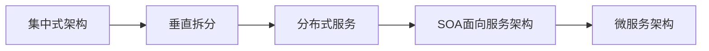

## 1. 系统架构演变概述

**目标**：了解项目架构的演变历程

**小结**：




## 2. 微服务架构说明

**目标**：了解SOA与微服务架构的区别以及说出微服务架构的特点

**分析**：

SOA使用了ESB组件的面向服务架构：ESB自身实现复杂；应用服务粒度较大，所有服务之间的通信都经过ESB会降低通信速度；部署、测试ESB比较麻烦。

**小结**：

**微服务架构**：是一套使用小服务或者单一业务来开发单个应用的方式或途径。

微服务架构特点：

- 单一职责
- 服务粒度小
- 面向服务（对外暴露REST api）
- 服务之间相互独立

与使用ESB的SOA架构的区别：微服务架构没有使用ESB，有服务治理注册中心；业务粒度小。


## 3. 服务调用方式说明

**目标**：能够说出服务调用方式种类

**小结**：

- RPC：基于socket，速度快，效率高；webservice、dubbo
- HTTP：基于TCP，封装比较臃肿；对服务和调用方没有任何技术、语言的限定，自由灵活；RESTful，Spring Cloud

## 4. Spring RestTemplate示例工程导入

**目标**：了解Spring RestTemplate的应用

**分析**：

一般情况下有如下三种http客户端工具类包都可以方便的进行http服务调用：

- httpClient
- okHttp
- JDK原生URLConnection

spring 提供了RestTemplate的工具类对上述的3种http客户端工具类进行了封装，可在spring项目中使用RestTemplate进行服务调用。

**小结**：

```java
@RunWith(SpringRunner.class)
@SpringBootTest
public class RestTemplateTest {

    @Autowired
    private RestTemplate restTemplate;

    @Test
    public void test(){
        String url = "http://localhost/user/8";
        //restTemplate可以对json格式字符串进行反序列化
        User user = restTemplate.getForObject(url, User.class);
        System.out.println(user);
    }
}

```


## 5. Spring Cloud概述

**目标**：Spring Cloud整合的组件和版本特征

**小结**：

- 整合的组件可以有很多组件；常见的组件有：eureka注册中心，Gateway网关，Ribbon负载均衡，Feign服务调用，Hystrix熔断器。在有需要的时候项目添加对于的启动器依赖即可。
- 版本特征：以英文单词命名（伦敦地铁站名）

## 6. 创建微服务工程

**目标**：创建微服务父工程heima-springcloud、用户服务工程user-service、服务消费工程consumer-demo

**分析**：

需求：查询数据库中的用户数据并输出到浏览器

- 父工程heima-springcloud：添加spring boot父坐标和管理其它组件的依赖
- 用户服务工程user-service：整合mybatis查询数据库中用户数据；提供查询用户服务
- 服务消费工程consumer-demo：利用查询用户服务获取用户数据并输出到浏览器

**小结**：

```xml
            <!-- springCloud -->
            <dependency>
                <groupId>org.springframework.cloud</groupId>
                <artifactId>spring-cloud-dependencies</artifactId>
                <version>${spring-cloud.version}</version>
                <type>pom</type>
                <scope>import</scope>
            </dependency>

```

通过 `scope` 的import可以继承 `spring-cloud-dependencies` 工程中的依赖

## 7. 搭建配置user-service工程

**目标**：配置user-service工程并能够根据用户id查询数据库中用户

**分析**：

需求：可以访问http://localhost:9091/user/8输出用户数据

实现步骤：

1. 添加启动器依赖（web、通用Mapper）；
2. 创建启动引导类和配置文件；
3. 修改配置文件中的参数；
4. 编写测试代码（UserMapper，UserService，UserController）；
5. 测试

**小结**：

- 添加启动器依赖

```xml
    <dependencies>
        <dependency>
            <groupId>org.springframework.boot</groupId>
            <artifactId>spring-boot-starter-web</artifactId>
        </dependency>
        <!-- 通用Mapper启动器 -->
        <dependency>
            <groupId>tk.mybatis</groupId>
            <artifactId>mapper-spring-boot-starter</artifactId>
        </dependency>
        <!-- mysql驱动 -->
        <dependency>
            <groupId>mysql</groupId>
            <artifactId>mysql-connector-java</artifactId>
        </dependency>

    </dependencies>

```


- 编写配置文件

```yml
server:
  port: 9091
spring:
  datasource:
    driver-class-name: com.mysql.jdbc.Driver
    url: jdbc:mysql://localhost:3306/springcloud
    username: root
    password: root

mybatis:
  type-aliases-package: com.itheima.user.pojo

```


## 8. 搭建配置consumer-demo工程

**目标**：编写测试类使用restTemplate访问user-service的路径根据id查询用户

**分析**：

需求：访问http://localhost:8080/consumer/8 使用RestTemplate获取http://localhost:9091/user/8的数据

实现步骤：

1. 添加启动器依赖；
2. 创建启动引导类（注册RestTemplate）和配置文件；
3. 编写测试代码（ConsumerController中使用restTemplate访问服务获取数据）
4. 测试

**小结**：

- 服务管理
  如何自动注册和发现
  如何实现状态监管
  如何实现动态路由
- 服务如何实现负载均衡
- 服务如何解决容灾问题
- 服务如何实现统一配置

上述的问题都可以通过Spring Cloud的各种组件解决。

## 9. Eureka注册中心说明

**目标**：说出Eureka的主要功能

**小结**：

Eureka的主要功能是进行服务管理，定期检查服务状态，返回服务地址列表。


## 10. 搭建eureka-server工程

**目标**：添加eureka对应依赖和编写引导类搭建eureka服务并可访问eureka服务界面

**分析**：

Eureka是服务注册中心，只做服务注册；自身并不提供服务也不消费服务。可以搭建web工程使用Eureka，可以使用Spring Boot方式搭建。

搭建步骤：

1. 创建工程；
2. 添加启动器依赖；
3. 编写启动引导类（添加Eureka的服务注解）和配置文件；
4. 修改配置文件（端口，应用名称...）；
5. 启动测试

**小结**：

- 启动器依赖

```xml
        <dependency>
            <groupId>org.springframework.cloud</groupId>
            <artifactId>spring-cloud-starter-netflix-eureka-server</artifactId>
        </dependency>
```


- 配置文件

```yml
server:
  port: 10086
spring:
  application:
    name: eureka-server
eureka:
  client:
    service-url:
      # eureka 服务地址，如果是集群的话；需要指定其它集群eureka地址
      defaultZone: http://127.0.0.1:10086/eureka
    # 不注册自己
    register-with-eureka: false
    # 不拉取服务
    fetch-registry: false
```


## 11. 服务注册与发现

**目标**：将user-service的服务注册到eureka并在consumer-demo中可以根据服务名称调用

**分析**：

- 服务注册：在服务提供工程user-service上添加Eureka客户端依赖；自动将服务注册到EurekaServer服务地址列表。
  - 添加依赖；
  - 改造启动引导类；添加开启Eureka客户端发现的注解；
  - 修改配置文件；设置Eureka 服务地址
- 服务发现：在服务消费工程consumer-demo上添加Eureka客户端依赖；可以使用工具类根据服务名称获取对应的服务地址列表。
  - 添加依赖；
  - 改造启动引导类；添加开启Eureka客户端发现的注解；
  - 修改配置文件；设置Eureka 服务地址；
  - 改造处理器类ConsumerController，可以使用工具类DiscoveryClient根据服务名称获取对应服务地址列表。

**小结**：

- 添加Eureka客户端依赖；

```xml
        <dependency>
            <groupId>org.springframework.cloud</groupId>
            <artifactId>spring-cloud-starter-netflix-eureka-client</artifactId>
        </dependency>

```

- 添加启动引导类注解；

  

- 修改配置

```yml
spring:
  application:
    name: consumer-demo
eureka:
  client:
    service-url:
      defaultZone: http://127.0.0.1:10086/eureka
```


## 12. Eureka Server高可用配置

**目标**：可以启动两台eureka-server实例；在eureka管理界面看到两个实例

**分析**：

Eureka Server是一个web应用，可以启动多个实例（配置不同端口）保证Eureka Server的高可用。

**小结**：

**高可用配置**：将Eureka Server作为一个服务注册到其它Eureka Server，这样多个Eureka Server之间就能够互相发现对方，同步服务，实现Eureka Server集群。

## 13. Eureka客户端与服务端配置

**目标**：配置eureka客户端user-service的注册、续约等配置项，配置eureka客户端consumer-demo的获取服务间隔时间；了解失效剔除和自我保护

**分析**：

- Eureka客户端工程
  - user-service 服务提供
    - 服务地址使用ip方式
    - 续约
  - consumer-demo 服务消费
    - 获取服务地址的频率
- Eureka服务端工程 eureka-server
  - 失效剔除
  - 自我保护

**小结**：

- user-service 

```yml
eureka:
  client:
    service-url:
      defaultZone: http://127.0.0.1:10086/eureka
  instance:
    # 更倾向使用ip地址，而不是host名
    prefer-ip-address: true
    # ip地址
    ip-address: 127.0.0.1
    # 续约间隔，默认30秒
    lease-renewal-interval-in-seconds: 5
    # 服务失效时间，默认90秒
    lease-expiration-duration-in-seconds: 5
```


- consumer-demo 

```yml
eureka:
  client:
    service-url:
      defaultZone: http://127.0.0.1:10086/eureka
    # 获取服务地址列表间隔时间，默认30秒
    registry-fetch-interval-seconds: 10
```


- eureka-server

```yml
eureka:
  server:
    # 服务失效剔除时间间隔，默认60秒
    eviction-interval-timer-in-ms: 60000
    # 关闭自我保护模式（默认是打开的）
    enable-self-preservation: false
```


## 14. 负载均衡Ribbon简介

**目标**：描述负载均衡和ribbon的作用

**分析**：

负载均衡是一个算法，可以通过该算法实现从地址列表中获取一个地址进行服务调用。

在Spring Cloud中提供了负载均衡器：Ribbon


**小结**：

Ribbon提供了轮询、随机两种负载均衡算法（默认是轮询）可以实现从地址列表中使用负载均衡算法获取地址进行服务调用。

## 15. Ribbon负载均衡应用

**目标**：配置启动两个用户服务，在consumer-demo中使用服务名实现根据用户id获取用户

**分析**：

需求：可以使用RestTemplate访问http://user-service/user/8获取服务数据。

可以使用Ribbon负载均衡：在执行RestTemplate发送服务地址请求的时候，使用负载均衡拦截器拦截，根据服务名获取服务地址列表，使用Ribbon负载均衡算法从服务地址列表中选择一个服务地址，访问该地址获取服务数据。

实现步骤：

1. 启动多个user-service实例（9091,9092）；
2. 修改RestTemplate实例化方法，添加负载均衡注解；
3. 修改ConsumerController；
4. 测试

**小结**：

在实例化RestTemplate的时候使用@LoadBalanced，服务地址直接可以使用服务名。

## 16. 熔断器Hystrix简介

**目标**：了解熔断器Hystrix的作用

**小结**：

Hystrix是一个延迟和容错库，用于隔离访问远程服务，防止出现级联失败。

## 17. 线程隔离&服务降级

**目标**：了解什么是线程隔离和服务降级

**分析**：

Hystrix解决雪崩效应：

- 线程隔离：用户请求不直接访问服务，而是使用线程池中空闲的线程访问服务，加速失败判断时间。
- 服务降级：及时返回服务调用失败的结果，让线程不因为等待服务而阻塞。

**小结**：

- 添加依赖

```xml
        <dependency>
            <groupId>org.springframework.cloud</groupId>
            <artifactId>spring-cloud-starter-netflix-hystrix</artifactId>
        </dependency>
```

- 开启熔断

   

- 降级逻辑

```java
@RestController
@RequestMapping("/consumer")
@Slf4j
@DefaultProperties(defaultFallback = "defaultFallback")
public class ConsumerController {

    @Autowired
    private RestTemplate restTemplate;

    @Autowired
    private DiscoveryClient discoveryClient;

    @GetMapping("/{id}")
    //@HystrixCommand(fallbackMethod = "queryByIdFallback")
    @HystrixCommand
    public String queryById(@PathVariable Long id){
        /*String url = "http://localhost:9091/user/"+id;
        
        //获取eureka中注册的user-service的实例
        List<ServiceInstance> serviceInstances = discoveryClient.getInstances("user-service");
        ServiceInstance serviceInstance = serviceInstances.get(0);

        url = "http://" + serviceInstance.getHost() + ":" + serviceInstance.getPort() + "/user/" + id;*/
        String url = "http://user-service/user/" + id;
        return restTemplate.getForObject(url, String.class);
    }

    public String queryByIdFallback(Long id){
        log.error("查询用户信息失败。id：{}", id);
        return "对不起，网络太拥挤了！";
    }

    public String defaultFallback(){
        return "默认提示：对不起，网络太拥挤了！";
    }
}

```


- 修改超时配置

```yml
hystrix:
  command:
    default:
      execution:
        isolation:
          thread:
            timeoutInMilliseconds: 2000
```


## 18. 服务熔断演示

**目标**：了解熔断器工作原理

**小结**：


可以通过配置服务熔断参数修改默认：

```yml
hystrix:
  command:
    default:
      execution:
        isolation:
          thread:
            timeoutInMilliseconds: 2000
      circuitBreaker:
        errorThresholdPercentage: 50 # 触发熔断错误比例阈值，默认值50%
        sleepWindowInMilliseconds: 10000 # 熔断后休眠时长，默认值5秒
        requestVolumeThreshold: 10 # 熔断触发最小请求次数，默认值是20
```

