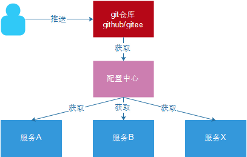

## 1. Feign应用

**目标**：Feign的作用；使用Feign实现consumer-demo代码中调用服务

**分析**：

1. 导入启动器依赖；
2. 开启Feign功能；
3. 编写Feign客户端；
4. 编写一个处理器ConsumerFeignController，注入Feign客户端并使用；
5. 测试

**小结**：

Feign主要作用：自动根据参数拼接http请求地址。

- 启动器依赖；

```xml
        <dependency>
            <groupId>org.springframework.cloud</groupId>
            <artifactId>spring-cloud-starter-openfeign</artifactId>
        </dependency>

```


- Feign客户端：

```java
//声明当前类是一个Feign客户端，指定服务名为user-service
@FeignClient("user-service")
public interface UserClient {

    //http://user-service/user/123
    @GetMapping("/user/{id}")
    User queryById(@PathVariable Long id);
}

```


## 2. Feign负载均衡及熔断

**目标**：可以配置Feign内置ribbon配置项和Hystrix熔断的Fallback配置

**分析**：

- 负载均衡
- 服务熔断
- 请求压缩
- 日志级别

都可以通过配置项在Feign中开启使用。

**小结**：

在服务消费工程consumer-demo中的配置文件：

```yml
ribbon:
  ConnectTimeout: 1000 # 连接超时时长
  ReadTimeout: 2000 # 数据通信超时时长
  MaxAutoRetries: 0 # 当前服务器的重试次数
  MaxAutoRetriesNextServer: 0 # 重试多少次服务
  OkToRetryOnAllOperations: false # 是否对所有的请求方式都重试
feign:
  hystrix:
    enabled: true # 开启Feign的熔断功能
  compression:
    request:
      enabled: true # 开启请求压缩
      mime-types: text/html,application/xml,application/json # 设置压缩的数据类型
      min-request-size: 2048 # 设置触发压缩的大小下限
    response:
      enabled: true
logging:
  level:
    com.itheima: debug
```


## 3. Spring Cloud Gateway网关简介

**目标**：Spring Cloud Gateway网关的作用

**小结**：

Spring Cloud Gateway的核心就是一系列的过滤器，可以将客户端的请求转发到不同的微服务。主要作用：过滤和路由。

## 4. Spring Cloud Gateway入门

**目标**：搭建网关服务工程测试网关服务作用

**分析**：

需求：通过网关系统heima-gateway将包含有 /user 的请求 路由到 http://127.0.0.1:9091/user/用户id 

实现步骤：

1. 创建工程；
2. 添加启动器依赖；
3. 编写启动引导类和配置文件；
4. 修改配置文件，设置路由信息；
5. 启动测试

http://127.0.0.1:10010/user/8 --> http://127.0.0.1:9091/user/8


**小结**：

- 启动器依赖

```xml
    <dependencies>
        <dependency>
            <groupId>org.springframework.cloud</groupId>
            <artifactId>spring-cloud-starter-gateway</artifactId>
        </dependency>
        <dependency>
            <groupId>org.springframework.cloud</groupId>
            <artifactId>spring-cloud-starter-netflix-eureka-client</artifactId>
        </dependency>
    </dependencies>

```


- 配置文件

```yml
server:
  port: 10010
spring:
  application:
    name: api-gateway
  cloud:
    gateway:
      routes:
        # 路由id，可以任意
        - id: user-service-route
          # 代理的服务地址
          uri: http://127.0.0.1:9091
          # 路由断言： 可以匹配映射路径
          predicates:
            - Path=/user/**

eureka:
  client:
    service-url:
      defaultZone: http://127.0.0.1:10086/eureka
  instance:
    prefer-ip-address: true
```


## 5. 面向服务的路由

**目标**：使用在eureka注册的服务作为路由地址

**分析**：

如果将路由服务地址写死明显是不合理的；在Spring Cloud Gateway中可以通过配置动态路由解决。

**小结**：

面向服务的路由；只需要在配置文件中指定路由路径类似： `lb://user-service`

> lb 之后编写的服务名必须要在eureka中注册才能使用

## 6. 路由前缀处理

**目标**：可以对请求到网关服务的地址添加或去除前缀

**分析**：

提供服务的地址：http://127.0.0.1:9091/user/8

- 添加前缀：对请求地址添加前缀路径之后再作为代理的服务地址；

http://127.0.0.1:10010/8 --> http://127.0.0.1:9091/user/8 添加前缀路径/user

- 去除前缀：将请求地址中路径去除一些前缀路径之后再作为代理的服务地址；

http://127.0.0.1:10010/api/user/8 --> http://127.0.0.1:9091/user/8 去除前缀路径/api

**小结**：

客户端的请求地址与微服务的服务地址如果不一致的时候，可以通过配置路径过滤器实现路径前缀的添加和去除。

## 7. 过滤器简介

**目标**：Gateway默认过滤器的用法和过滤器类型

**小结**：

- 用法：在配置文件中指定要使用的过滤器名称；
- 类型：局部、全局；
- 使用场景：请求鉴权、异常处理、记录调用时长等。

## 8. 自定义局部过滤器

**目标**：按照默认过滤器编写并配置一个自定义局部过滤器，该过滤器可以通过配置文件中的参数名称获取请求的参数值

**分析**：

需求：在过滤器（MyParamGatewayFilterFactory）中将http://localhost:10010/api/user/8?name=itcast中的参数name的值获取到并输出到控制台；并且参数名是可变的，也就是不一定每次都是name；需要可以通过配置过滤器的时候做到配置参数名。

实现步骤：

1. 配置过滤器；
2. 编写过滤器；
3. 测试

**小结**：

- 配置；与其他过滤器的配置一致。

- 实现过滤器

```java
package com.itheima.gateway.filter;

import org.springframework.cloud.gateway.filter.GatewayFilter;
import org.springframework.cloud.gateway.filter.factory.AbstractGatewayFilterFactory;
import org.springframework.http.server.reactive.ServerHttpRequest;
import org.springframework.stereotype.Component;

import java.util.Arrays;
import java.util.List;

@Component
public class MyParamGatewayFilterFactory extends AbstractGatewayFilterFactory<MyParamGatewayFilterFactory.Config> {

    static final String PARAM_NAME = "param";

    public MyParamGatewayFilterFactory() {
        super(Config.class);
    }

    public List<String> shortcutFieldOrder() {
        return Arrays.asList(PARAM_NAME);
    }

    @Override
    public GatewayFilter apply(Config config) {
        return (exchange, chain) -> {
            // http://localhost:10010/api/user/8?name=itcast   config.param ==> name
            //获取请求参数中param对应的参数名 的参数值
            ServerHttpRequest request = exchange.getRequest();
            if(request.getQueryParams().containsKey(config.param)){
                request.getQueryParams().get(config.param).
                        forEach(value -> System.out.printf("------------局部过滤器--------%s = %s------", config.param, value));
            }
            return chain.filter(exchange);
        };
    }


    public static class Config{
        //对应在配置过滤器的时候指定的参数名
        private String param;

        public String getParam() {
            return param;
        }

        public void setParam(String param) {
            this.param = param;
        }
    }
}

```


## 9. 自定义全局过滤器

**目标**：定义一个全局过滤器检查请求中是否携带有token参数

**分析**：

需求：编写全局过滤器，在过滤器中检查请求地址是否携带token参数。如果token参数的值存在则放行；如果token的参数值为空或者不存在则设置返回的状态码为：未授权也不再执行下去。

实现步骤：

1. 编写全局过滤器；
2. 测试

**小结**：

```java
@Component
public class MyGlobalFilter implements GlobalFilter, Ordered {
    @Override
    public Mono<Void> filter(ServerWebExchange exchange, GatewayFilterChain chain) {
        System.out.println("--------------全局过滤器MyGlobalFilter------------------");
        String token = exchange.getRequest().getQueryParams().getFirst("token");
        if(StringUtils.isBlank(token)){
            //设置响应状态码为未授权
            exchange.getResponse().setStatusCode(HttpStatus.UNAUTHORIZED);
            return exchange.getResponse().setComplete();
        }
        return chain.filter(exchange);
    }

    @Override
    public int getOrder() {
        //值越小越先执行
        return 1;
    }
}

```


## 10. Gateway其它配置说明

**目标**：Gateway网关的负载均衡和熔断参数配置

**小结**：

网关服务配置文件：

```yml
server:
  port: 10010
spring:
  application:
    name: api-gateway
  cloud:
    gateway:
      routes:
        # 路由id，可以任意
        - id: user-service-route
          # 代理的服务地址
          #uri: http://127.0.0.1:9091
          # lb表示从eureka中获取具体服务
          uri: lb://user-service
          # 路由断言： 可以匹配映射路径
          predicates:
            #- Path=/user/**
            #- Path=/**
            - Path=/api/user/**
          filters:
            # 添加请求路径的前缀
            #- PrefixPath=/user
            #1表示过滤1个路径，2表示两个路径，以此类推
            - StripPrefix=1
            - MyParam=name
      # 默认过滤器，对所有路由都生效
      default-filters:
        - AddResponseHeader=X-Response-Foo, Bar
        - AddResponseHeader=abc-myname,heima
      globalcors:
        corsConfigurations:
          '[/**]':
            #allowedOrigins: * # 这种写法或者下面的都可以，*表示全部
            allowedOrigins:
              - "http://docs.spring.io"
            allowedMethods:
              - GET
eureka:
  client:
    service-url:
      defaultZone: http://127.0.0.1:10086/eureka
  instance:
    prefer-ip-address: true
hystrix:
  command:
    default:
      execution:
        isolation:
          thread:
            timeoutInMilliseconds: 6000
ribbon:
  ConnectTimeout: 1000
  ReadTimeout: 2000
  MaxAutoRetries: 0
  MaxAutoRetriesNextServer: 0
```

> Gateway网关一般直接给终端请求使用；Feign一般用在微服务之间调用。

## 11. Spring Cloud Config分布式配置中心简介

**目标**：分布式配置中心的作用

**小结**：



spring cloud config作用：可以通过修改在git仓库中的配置文件实现其它所有微服务的配置文件的修改。

## 12. 搭建配置中心微服务

**目标**：创建码云的远程公开git仓库，搭建配置中心微服务config-server

**分析**：

- 创建git仓库：在码云上创建仓库
- 搭建配置中心config-server：使用spring boot方式搭建和配置

**小结**：

- 配置中心依赖

```xml
    <dependencies>
        <dependency>
            <groupId>org.springframework.cloud</groupId>
            <artifactId>spring-cloud-starter-netflix-eureka-client</artifactId>
        </dependency>
        <dependency>
            <groupId>org.springframework.cloud</groupId>
            <artifactId>spring-cloud-config-server</artifactId>
        </dependency>
    </dependencies>

```


- 配置中心的配置文件

```yml
server:
  port: 12000
spring:
  application:
    name: config-server
  cloud:
    config:
      server:
        git:
          uri: https://gitee.com/goheima/heima-config.git
eureka:
  client:
    service-url:
      defaultZone: http://127.0.0.1:10086/eureka
```

> 在gitee中修改了配置文件会在配置中心服务及时更新。

## 13. 获取配置中心配置

**目标**：改造用户微服务user-service，配置文件信息不再由微服务项目提供，而是从配置中心获取

**分析**：

需求：将服务提供工程user-service的application.yml配置文件删除，修改为从配置中心config-server中获取。

实现步骤：

1. 添加启动器依赖；
2. 修改配置文件；
3. 启动测试

**小结**：

将原来的application.yml删除；然后添加bootstrap.yml配置文件，该文件也是spring boot的默认配置文件，其内容经常配置一些项目中固定的配置项。如果是项目经常变动的应该配置到application.yml中，现在使用了配置中心则应该配置到git仓库中对于的配置文件。

- 依赖

```xml
        <dependency>
            <groupId>org.springframework.cloud</groupId>
            <artifactId>spring-cloud-starter-config</artifactId>
            <version>2.1.1.RELEASE</version>
        </dependency>
```


- 配置文件bootstrap.yml

```yml
spring:
  cloud:
    config:
      # 要与仓库中的配置文件的application保持一致
      name: user
      # 要与仓库中的配置文件的profile保持一致
      profile: dev
      # 要与仓库中的配置文件所属的版本（分支）一样
      label: master
      discovery:
        # 使用配置中心
        enabled: true
        # 配置中心服务名
        service-id: config-server

eureka:
  client:
    service-url:
      defaultZone: http://127.0.0.1:10086/eureka
```


## 14. Spring Cloud Bus简介

**目标**：了解Spring Cloud Bus作用

**小结**：

Spring Cloud Bus作用：将git仓库的配置文件更新，在不重启系统的情况下实现及时同步到各个微服务。

## 15. Spring Cloud Bus应用

**目标**：启动RabbitMQ通过修改码云中的配置文件后发送Post请求实现及时更新用户微服务中的配置项

**分析**：

需求：在码云的git仓库中修改user-dev.yml配置文件，实现不重启user-service的情况下可以及时更新配置文件。

实现步骤：

1. 启动RabbitMQ；
2. 修改配置中心config-server；
3. 修改服务提供工程user-service；
4. 测试

**小结**：

- config-server的依赖添加内容

```xml
        <dependency>
            <groupId>org.springframework.cloud</groupId>
            <artifactId>spring-cloud-bus</artifactId>
        </dependency>
        <dependency>
            <groupId>org.springframework.cloud</groupId>
            <artifactId>spring-cloud-stream-binder-rabbit</artifactId>
        </dependency>

```


- config-server的配置文件添加内容

```yml
server:
  port: 12000
spring:
  application:
    name: config-server
  cloud:
    config:
      server:
        git:
          uri: https://gitee.com/goheima/heima-config.git
  # 配置rabbitmq信息；如果是都与默认值一致则不需要配置
  rabbitmq:
    host: localhost
    port: 5672
    username: guest
    password: guest
eureka:
  client:
    service-url:
      defaultZone: http://127.0.0.1:10086/eureka
management:
  endpoints:
    web:
      exposure:
        # 暴露触发消息总线的地址
        include: bus-refresh
```


- user-service的依赖添加内容

```xml
        <dependency>
            <groupId>org.springframework.cloud</groupId>
            <artifactId>spring-cloud-bus</artifactId>
        </dependency>
        <dependency>
            <groupId>org.springframework.cloud</groupId>
            <artifactId>spring-cloud-stream-binder-rabbit</artifactId>
        </dependency>
        <dependency>
            <groupId>org.springframework.boot</groupId>
            <artifactId>spring-boot-starter-actuator</artifactId>
        </dependency>

```


- user-service的配置文件添加内容

```yml
  # 配置rabbitmq信息；如果是都与默认值一致则不需要配置
  rabbitmq:
    host: localhost
    port: 5672
    username: guest
    password: guest

```


- UserController的修改

 

## 16. Spring Cloud 体系技术综合应用说明

**目标**：了解Spring Cloud中的Eureka、GateWay、Config、Bus、Feign等技术的综合应用

**小结**：


