# 开始

项目概述和环境搭建  

做项目  

Xmind

第一步 

思路  

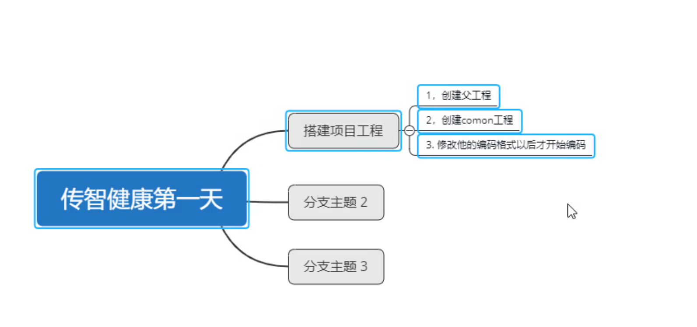


第一步干什么  第二步干什么 

自己的东西  

做项目的时候

从今天开始大家一定要有自己的笔记


别人问到的问题   一定要解决    做笔记

记录  总结  所有的  

锻炼自己解决问题 和 查找问题 的能力

已经成熟的项目

接受别人的工程  去阅读

阅读别人的代码

线上出现Bug   离职了  线上出了问题

线上出现Bug     很难留下

我们做项目的时候    15天到20天

大家都可以把问题共享出来   CSDN　BBS　发一个帖子出来

怎么去解决的    一个犯错  大家都知道 都了解

具体的解决方案是什么    留下  留不下 


自己解决 发出来    动手去解决   解决不了去搜索

希望大家把小组利用起来 课程最后有4天的实战   小组的形式

开发小组  老师不再提供任何服务  

你遇到的问题 自己去解决   问百度 问Google 问  小组 


前面的东西你还是要知道的  

 

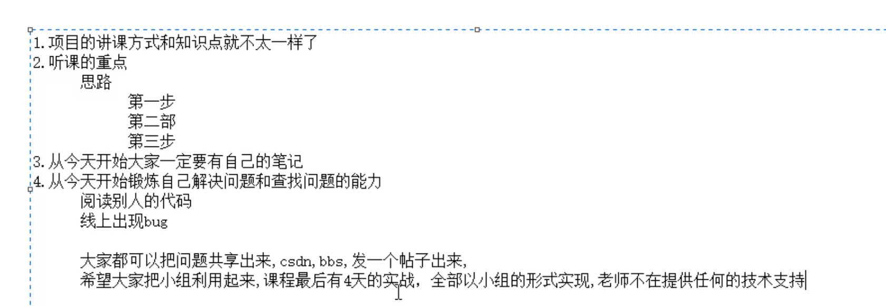

当前的功能继续开发  

实战  


总结清楚   找到笔记阅读一下    直接开干  

做笔记 直接的知识库  笔记   功能总结出来  


第一天  


笔记我就知道 Copy了 都帮我做好了  嘿嘿  非常不错的

但我要练习的  

# 第1章 项目概述和环境搭建

第一天的主要内容 

项目概述

环境搭建

Power Designer

ElementUI


项目概述 项目介绍

要求提示

了解项目的主要内容学会介绍项目


## 1. 项目概述

### 1.1 项目介绍

传智健康管理系统是一款应用于健康管理机构的业务系统，实现健康管理机构工作内容可视化、会员管理专业化、健康评估数字化、健康干预流程化、知识库集成化，从而提高健康管理师的工作效率，加强与会员间的互动，增强管理者对健康管理机构运营情况的了解。

详见：资料中的传智健康PRD文档.docx


健康管理机构的业务系统

实现健康管理机构工作内容可视化 会员管理专业化 

健康评估数字化 健康干预流程化 知识库集成化 

效率  互动  运营情况的了解 


体检结构    健康管理机构   

给这些架构使用的软件

加强  效率  


PRD 文档 

功能摘要  阅读  了解这个项目 

项目用于   健康管理

   

入职体检

网站比较类型  

100多一点  

微信   嵌入    公众号  小程序 

网站上  预约 


入职体检  200块    不高  

成本  医疗  医疗垃圾 房子  人

人 体检 不正常呢   随便看一下  

健康干预   某个有问题  做一个方案 

20000块


检查组  检查项  套餐 


复合  

写简历  项目经验   项目经历   

投简历  又投了过去  你们的项目怎么都一样  什么都一样

不同的时间  不同的节点     又又投了几份简历   一模一样的


项目的原型  

我做过这样的项目  有资源的 


静态页面   设计   

原型  设计   展示的      

### 1.2 原型展示

参见资料中的静态原型。


展示功能  后台系统  

移动端  客户使用  

为手机设置    模拟器  

微信展示  

静态页面   

### 1.3 技术架构

技术架构  

写到简历上  

项目所使用到的技术 


前端技术栈

HTML5 Bootstrap ElementUI Vue.js  Ajax 

分布式架构及权限技术栈  

Zookeeper dubbo Spring MVC  Spring security

分布式版本控制及报表技术栈 

Git Apache POI  Echarts  n. 图表；排行榜 Charts

持久化技术栈

Mybatis MySQL

第三方服务

阿里云通信 短信服务  七牛云 存储服务 微信开发平台 公众号 


HTML5  页面   

POI  

分布式架构及权限技术栈

权限控制  Security 


Apache POI 报表    Echarts  图形的报表 


第三方服务  

阿里云通信 

图片的存储  线上的云存储   微信开发平台   公众号


排斥做前端   ？？？ 

做   去做 

不然连一个项目都完成不了 


登录  都帮我们做好了

Spring Security 最Spring家族 难得


Git    Git  用熟悉    一天来练习 

强调Git   URL  一个Git账号  跑起来

重要性    超过了你的任何一个 知识点  


练习   Git  实战  企业   一部分  

分支  合并分支    冲突怎么去解决  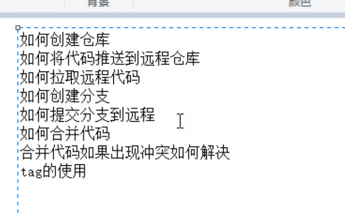


命令 工具 

推荐使用 命令   

出现了问题  不能去解决  工具  

使用得时候去 使用命令 

命令  本质   

命令的形式去操作  

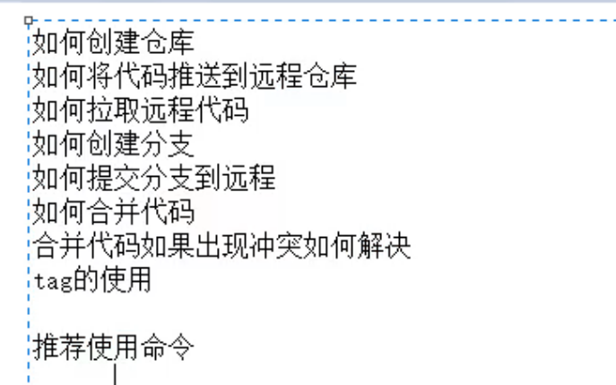

截个屏幕   


云存储 图片

手机号 验证码   短信攻击

爱情  买卖    骚扰短信

公众号   微信  


   

### 1.4 功能架构

SOA 架构   

功能架构

数据  、 里面 这个是什么    一个个去实现  原型去看一下  

健康管理后台

会员管理   预约管理  健康评估 健康干预

健康管理前端  移动端

会员管理 在线预约  体验报告 

Dubbo 

服务层

会员服务  预约服务  体验报告服务  健康评估服务  健康干预服务 

数据访问层

MySQL


### 1.5 软件开发流程

技术架构

开发模型 

瀑布模型

可行性研究与计划

需求分析 设计 编码 测试 运行维护 

定义阶段  开发阶段 维护阶段 

软件开发 阶段    

定义阶段 开发阶段 维护阶段  


软件开发一般会经历如下几个阶段，整个过程是顺序展开，所以通常称为瀑布模型。

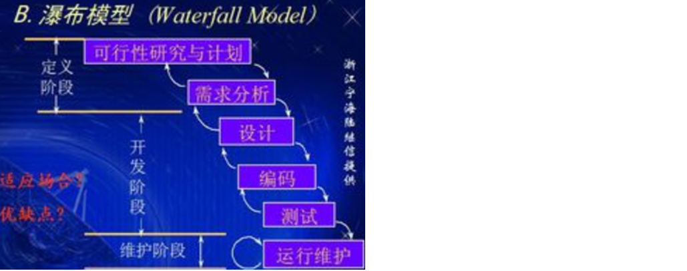


敏捷开发  


不赚钱  拿就不做了 


详细设计    

原型设计     数据库设计   这个数据库  哪些表  哪些字段 怎么设计  

编码设计  设计文档  我们来实现  代码的实现

开发人员   +  运维


培训太多 随便一个人  两到三年 开发经验  问你在企业的流程

软件工程 软件开发  规范起来  

做成什么样子   分析  产品   软件无所不能  你有需求  我就要实现

需求文档 没有问题  就开发   你要改需求  

## 2. 环境搭建

### 2.1 项目结构

maven分模块开发方式    项目拆分  为几个Maven工程  每个Maven 工程存发特定的一类代码  

父工程  统一管理依赖  聚合其他子模块

拆分 

本项目采用maven分模块开发方式，即对整个项目拆分为几个maven工程，每个maven工程存放特定的一类代码，具体如下：


各模块职责定位：

health_parent：父工程，打包方式为pom，统一锁定依赖的版本，同时聚合其他子模块便于统一执行maven命令

parent 父工程 打包方式  pom  统一锁定依赖的版本

聚合其他的  子模块便于统一执行maven命令 

maven package  

java -jar  xxx.jar

health_common：通用模块，打包方式为jar，存放项目中使用到的一些工具类、实体类、返回结果和常量类

common 通用模块 打包方式 jar  存放项目中使用的一些工具类

实体类 返回结果 和 常量类 

health_interface：打包方式为jar，存放服务接口

health interface 打包方式为jar 存放服务接口 


health_service_provider：Dubbo服务模块，打包方式为war，存放服务实现类、Dao接口、Mapper映射文件等，作为服务提供方，需要部署到tomcat运行

服务模块 Dubbo服务模块 打包方式为war

存放服务实现类  Dao接口 Mapper映射文件

服务提供方  需要部署到tomcat运行 


health_backend：传智健康管理后台，打包方式为war，作为Dubbo服务消费方，存放Controller、HTML页面、js、css、spring配置文件等，需要部署到tomcat运行

health backend 管理后台 

打包方式为war包  Dubbo服务消费方  存发Controller HTML页面

js  css spring配置文件 

需要部署到tomcat 运行

health_backend 

health_mobile：移动端前台，打包方式为war，作为Dubbo服务消费方，存放Controller、HTML页面、js、css、spring配置文件等，需要部署到tomcat运行

mobile 服务消费方 存发 前端项目  

health parent  父工程 

health common 通用模块 

interface 打包方式为jar   存发服务接口

health service   provider

health backend

mobile  移动端前台 


mobile   

### 2.2 maven项目搭建

管理后台  健康前台  （微信端） 

通过前面的项目功能架构图可以知道本项目分为传智健康管理后台和传智健康前台（微信端）

health parent  

#### 2.2.1 health_parent

创建health_parent，父工程，打包方式为pom，用于统一管理依赖版本

health_parent  父工程  pom  同于统一管理依赖版本  

pom.xml

Spring 

dubbo

Mybatis

MySQL

连接池

文件上传组件

POI报表

安全框架

java编译插件


```
<?xml version="1.0" encoding="UTF-8"?>
<project xmlns="http://maven.apache.org/POM/4.0.0"
         xmlns:xsi="http://www.w3.org/2001/XMLSchema-instance"
         xsi:schemaLocation="http://maven.apache.org/POM/4.0.0 
         http://maven.apache.org/xsd/maven-4.0.0.xsd">
    <modelVersion>4.0.0</modelVersion>
    <groupId>com.itheima</groupId>
    <artifactId>health_parent</artifactId>
    <version>1.0-SNAPSHOT</version>
    <packaging>pom</packaging>
    <!-- 集中定义依赖版本号 -->
    <properties>
        <junit.version>4.12</junit.version>
        <spring.version>5.0.5.RELEASE</spring.version>
        <pagehelper.version>4.1.4</pagehelper.version>
        <servlet-api.version>2.5</servlet-api.version>
        <dubbo.version>2.6.0</dubbo.version>
        <zookeeper.version>3.4.7</zookeeper.version>
        <zkclient.version>0.1</zkclient.version>
        <mybatis.version>3.4.5</mybatis.version>
        <mybatis.spring.version>1.3.1</mybatis.spring.version>
        <mybatis.paginator.version>1.2.15</mybatis.paginator.version>
        <mysql.version>5.1.32</mysql.version>
        <druid.version>1.0.9</druid.version>
        <commons-fileupload.version>1.3.1</commons-fileupload.version>
        <spring.security.version>5.0.5.RELEASE</spring.security.version>
        <poi.version>3.14</poi.version>
        <jedis.version>2.9.0</jedis.version>
        <quartz.version>2.2.1</quartz.version>
    </properties>
    <!-- 依赖管理标签  必须加 -->
    <dependencyManagement>
        <dependencies>
            <!-- Spring -->
            <dependency>
                <groupId>org.springframework</groupId>
                <artifactId>spring-context</artifactId>
                <version>${spring.version}</version>
            </dependency>
            <dependency>
                <groupId>org.springframework</groupId>
                <artifactId>spring-beans</artifactId>
                <version>${spring.version}</version>
            </dependency>
            <dependency>
                <groupId>org.springframework</groupId>
                <artifactId>spring-web</artifactId>
                <version>${spring.version}</version>
            </dependency>
            <dependency>
                <groupId>org.springframework</groupId>
                <artifactId>spring-webmvc</artifactId>
                <version>${spring.version}</version>
            </dependency>
            <dependency>
                <groupId>org.springframework</groupId>
                <artifactId>spring-jdbc</artifactId>
                <version>${spring.version}</version>
            </dependency>
            <dependency>
                <groupId>org.springframework</groupId>
                <artifactId>spring-aspects</artifactId>
                <version>${spring.version}</version>
            </dependency>
            <dependency>
                <groupId>org.springframework</groupId>
                <artifactId>spring-jms</artifactId>
                <version>${spring.version}</version>
            </dependency>
            <dependency>
                <groupId>org.springframework</groupId>
                <artifactId>spring-context-support</artifactId>
                <version>${spring.version}</version>
            </dependency>
            <dependency>
                <groupId>org.springframework</groupId>
                <artifactId>spring-test</artifactId>
                <version>${spring.version}</version>
            </dependency>
            <!-- dubbo相关 -->
            <dependency>
                <groupId>com.alibaba</groupId>
                <artifactId>dubbo</artifactId>
                <version>${dubbo.version}</version>
            </dependency>
            <dependency>
                <groupId>org.apache.zookeeper</groupId>
                <artifactId>zookeeper</artifactId>
                <version>${zookeeper.version}</version>
            </dependency>
            <dependency>
                <groupId>com.github.sgroschupf</groupId>
                <artifactId>zkclient</artifactId>
                <version>${zkclient.version}</version>
            </dependency>
            <dependency>
                <groupId>junit</groupId>
                <artifactId>junit</artifactId>
                <version>4.12</version>
            </dependency>
            <dependency>
                <groupId>com.alibaba</groupId>
                <artifactId>fastjson</artifactId>
                <version>1.2.47</version>
            </dependency>
            <dependency>
                <groupId>javassist</groupId>
                <artifactId>javassist</artifactId>
                <version>3.12.1.GA</version>
            </dependency>
            <dependency>
                <groupId>commons-codec</groupId>
                <artifactId>commons-codec</artifactId>
                <version>1.10</version>
            </dependency>
            <dependency>
                <groupId>com.github.pagehelper</groupId>
                <artifactId>pagehelper</artifactId>
                <version>${pagehelper.version}</version>
            </dependency>
            <!-- Mybatis -->
            <dependency>
                <groupId>org.mybatis</groupId>
                <artifactId>mybatis</artifactId>
                <version>${mybatis.version}</version>
            </dependency>
            <dependency>
                <groupId>org.mybatis</groupId>
                <artifactId>mybatis-spring</artifactId>
                <version>${mybatis.spring.version}</version>
            </dependency>
            <dependency>
                <groupId>com.github.miemiedev</groupId>
                <artifactId>mybatis-paginator</artifactId>
                <version>${mybatis.paginator.version}</version>
            </dependency>
            <!-- MySql -->
            <dependency>
                <groupId>mysql</groupId>
                <artifactId>mysql-connector-java</artifactId>
                <version>${mysql.version}</version>
            </dependency>
            <!-- 连接池 -->
            <dependency>
                <groupId>com.alibaba</groupId>
                <artifactId>druid</artifactId>
                <version>${druid.version}</version>
            </dependency>
            <!-- 文件上传组件 -->
            <dependency>
                <groupId>commons-fileupload</groupId>
                <artifactId>commons-fileupload</artifactId>
                <version>${commons-fileupload.version}</version>
            </dependency>
            <dependency>
                <groupId>org.quartz-scheduler</groupId>
                <artifactId>quartz</artifactId>
                <version>${quartz.version}</version>
            </dependency>
            <dependency>
                <groupId>org.quartz-scheduler</groupId>
                <artifactId>quartz-jobs</artifactId>
                <version>${quartz.version}</version>
            </dependency>
            <dependency>
                <groupId>com.sun.jersey</groupId>
                <artifactId>jersey-client</artifactId>
                <version>1.18.1</version>
            </dependency>
            <dependency>
                <groupId>com.qiniu</groupId>
                <artifactId>qiniu-java-sdk</artifactId>
                <version>7.2.0</version>
            </dependency>
            <!--POI报表-->
            <dependency>
                <groupId>org.apache.poi</groupId>
                <artifactId>poi</artifactId>
                <version>${poi.version}</version>
            </dependency>
            <dependency>
                <groupId>org.apache.poi</groupId>
                <artifactId>poi-ooxml</artifactId>
                <version>${poi.version}</version>
            </dependency>
            <dependency>
                <groupId>redis.clients</groupId>
                <artifactId>jedis</artifactId>
                <version>${jedis.version}</version>
            </dependency>
            <!-- 安全框架 -->
            <dependency>
                <groupId>org.springframework.security</groupId>
                <artifactId>spring-security-web</artifactId>
                <version>${spring.security.version}</version>
            </dependency>
            <dependency>
                <groupId>org.springframework.security</groupId>
                <artifactId>spring-security-config</artifactId>
                <version>${spring.security.version}</version>
            </dependency>
            <dependency>
                <groupId>org.springframework.security</groupId>
                <artifactId>spring-security-taglibs</artifactId>
                <version>${spring.security.version}</version>
            </dependency>
            <dependency>
                <groupId>com.github.penggle</groupId>
                <artifactId>kaptcha</artifactId>
                <version>2.3.2</version>
                <exclusions>
                    <exclusion>
                        <groupId>javax.servlet</groupId>
                        <artifactId>javax.servlet-api</artifactId>
                    </exclusion>
                </exclusions>
            </dependency>
            <dependency>
                <groupId>dom4j</groupId>
                <artifactId>dom4j</artifactId>
                <version>1.6.1</version>
            </dependency>
            <dependency>
                <groupId>xml-apis</groupId>
                <artifactId>xml-apis</artifactId>
                <version>1.4.01</version>
            </dependency>
        </dependencies>
    </dependencyManagement>
    <dependencies>
        <dependency>
            <groupId>javax.servlet</groupId>
            <artifactId>servlet-api</artifactId>
            <version>${servlet-api.version}</version>
            <scope>provided</scope>
        </dependency>
    </dependencies>
    <build>
        <plugins>
            <!-- java编译插件 -->
            <plugin>
                <groupId>org.apache.maven.plugins</groupId>
                <artifactId>maven-compiler-plugin</artifactId>
                <version>3.2</version>
                <configuration>
                    <source>1.8</source>
                    <target>1.8</target>
                    <encoding>UTF-8</encoding>
                </configuration>
            </plugin>
        </plugins>
    </build>
</project>
```

#### 2.2.2 health_common

创建health_common，子工程，打包方式为jar，存放通用组件，例如工具类、实体类等

pom.xml

```xml
<?xml version="1.0" encoding="UTF-8"?>
<project xmlns="http://maven.apache.org/POM/4.0.0"
         xmlns:xsi="http://www.w3.org/2001/XMLSchema-instance"
         xsi:schemaLocation="http://maven.apache.org/POM/4.0.0 
         http://maven.apache.org/xsd/maven-4.0.0.xsd">
    <parent>
        <artifactId>health_parent</artifactId>
        <groupId>com.itheima</groupId>
        <version>1.0-SNAPSHOT</version>
    </parent>
    <modelVersion>4.0.0</modelVersion>
    <artifactId>health_common</artifactId>
    <packaging>jar</packaging>
    <dependencies>
        <dependency>
            <groupId>com.github.pagehelper</groupId>
            <artifactId>pagehelper</artifactId>
        </dependency>
        <!-- Mybatis -->
        <dependency>
            <groupId>org.mybatis</groupId>
            <artifactId>mybatis</artifactId>
        </dependency>
        <dependency>
            <groupId>org.mybatis</groupId>
            <artifactId>mybatis-spring</artifactId>
        </dependency>
        <dependency>
            <groupId>com.github.miemiedev</groupId>
            <artifactId>mybatis-paginator</artifactId>
        </dependency>
        <!-- MySql -->
        <dependency>
            <groupId>mysql</groupId>
            <artifactId>mysql-connector-java</artifactId>
        </dependency>
        <!-- 连接池 -->
        <dependency>
            <groupId>com.alibaba</groupId>
            <artifactId>druid</artifactId>
        </dependency>
        <dependency>
            <groupId>commons-fileupload</groupId>
            <artifactId>commons-fileupload</artifactId>
        </dependency>
        <!-- Spring -->
        <dependency>
            <groupId>org.springframework</groupId>
            <artifactId>spring-context</artifactId>
        </dependency>
        <dependency>
            <groupId>org.springframework</groupId>
            <artifactId>spring-beans</artifactId>
        </dependency>
        <dependency>
            <groupId>org.springframework</groupId>
            <artifactId>spring-web</artifactId>
        </dependency>
        <dependency>
            <groupId>org.springframework</groupId>
            <artifactId>spring-webmvc</artifactId>
        </dependency>
        <dependency>
            <groupId>org.springframework</groupId>
            <artifactId>spring-jdbc</artifactId>
        </dependency>
        <dependency>
            <groupId>org.springframework</groupId>
            <artifactId>spring-aspects</artifactId>
        </dependency>
        <dependency>
            <groupId>org.springframework</groupId>
            <artifactId>spring-jms</artifactId>
        </dependency>
        <dependency>
            <groupId>org.springframework</groupId>
            <artifactId>spring-context-support</artifactId>
        </dependency>
        <dependency>
            <groupId>org.springframework</groupId>
            <artifactId>spring-test</artifactId>
        </dependency>
        <!-- dubbo相关 -->
        <dependency>
            <groupId>com.alibaba</groupId>
            <artifactId>dubbo</artifactId>
        </dependency>
        <dependency>
            <groupId>org.apache.zookeeper</groupId>
            <artifactId>zookeeper</artifactId>
        </dependency>
        <dependency>
            <groupId>com.github.sgroschupf</groupId>
            <artifactId>zkclient</artifactId>
        </dependency>
        <dependency>
            <groupId>junit</groupId>
            <artifactId>junit</artifactId>
        </dependency>
        <dependency>
            <groupId>com.alibaba</groupId>
            <artifactId>fastjson</artifactId>
        </dependency>
        <dependency>
            <groupId>javassist</groupId>
            <artifactId>javassist</artifactId>
        </dependency>
        <dependency>
            <groupId>commons-codec</groupId>
            <artifactId>commons-codec</artifactId>
        </dependency>
        <dependency>
            <groupId>org.apache.poi</groupId>
            <artifactId>poi</artifactId>
        </dependency>
        <dependency>
            <groupId>redis.clients</groupId>
            <artifactId>jedis</artifactId>
        </dependency>
        <dependency>
            <groupId>com.qiniu</groupId>
            <artifactId>qiniu-java-sdk</artifactId>
        </dependency>
        <dependency>
            <groupId>com.sun.jersey</groupId>
            <artifactId>jersey-client</artifactId>
        </dependency>
        <dependency>
            <groupId>org.apache.poi</groupId>
            <artifactId>poi-ooxml</artifactId>
        </dependency>
        <dependency>
            <groupId>org.springframework.security</groupId>
            <artifactId>spring-security-web</artifactId>
        </dependency>
        <dependency>
            <groupId>org.springframework.security</groupId>
            <artifactId>spring-security-config</artifactId>
        </dependency>
        <dependency>
            <groupId>org.springframework.security</groupId>
            <artifactId>spring-security-taglibs</artifactId>
        </dependency>
    </dependencies>
</project>
```

#### 2.2.5 health_interface

创建health_interface，子工程，打包方式为jar，存放服务接口

pom.xml

```
<?xml version="1.0" encoding="UTF-8"?>
<project xmlns="http://maven.apache.org/POM/4.0.0"
         xmlns:xsi="http://www.w3.org/2001/XMLSchema-instance"
         xsi:schemaLocation="http://maven.apache.org/POM/4.0.0
                             http://maven.apache.org/xsd/maven-4.0.0.xsd">
    <parent>
        <artifactId>health_parent</artifactId>
        <groupId>com.itheima</groupId>
        <version>1.0-SNAPSHOT</version>
    </parent>
    <modelVersion>4.0.0</modelVersion>
    <artifactId>health_interface</artifactId>
    <packaging>jar</packaging>
    <dependencies>
        <dependency>
            <groupId>com.itheima</groupId>
            <artifactId>health_common</artifactId>
            <version>1.0-SNAPSHOT</version>
        </dependency>
    </dependencies>
</project>
```

#### 2.2.6 health_service_provider

服务单独部署 

创建health_service_provider，子工程，打包方式为war，作为服务单独部署，存放服务类、Dao接口和Mapper映射文件等

pom.xml

```
<?xml version="1.0" encoding="UTF-8"?>
<project xmlns="http://maven.apache.org/POM/4.0.0"
         xmlns:xsi="http://www.w3.org/2001/XMLSchema-instance"
         xsi:schemaLocation="http://maven.apache.org/POM/4.0.0
                            http://maven.apache.org/xsd/maven-4.0.0.xsd">
    <parent>
        <groupId>com.itheima</groupId>
        <artifactId>health_parent</artifactId>
        <version>1.0-SNAPSHOT</version>
    </parent>
    <modelVersion>4.0.0</modelVersion>
    <artifactId>health_service_provider</artifactId>
    <packaging>war</packaging>
    <dependencies>
        <dependency>
            <groupId>com.itheima</groupId>
            <artifactId>health_interface</artifactId>
            <version>1.0-SNAPSHOT</version>
        </dependency>
    </dependencies>
    <build>
        <plugins>
            <plugin>
                <groupId>org.apache.tomcat.maven</groupId>
                <artifactId>tomcat7-maven-plugin</artifactId>
                <configuration>
                    <!-- 指定端口 -->
                    <port>81</port>
                    <!-- 请求路径 -->
                    <path>/</path>
                </configuration>
            </plugin>
        </plugins>
    </build>
</project>
```

log4j.properties

absolute  adj. 绝对的；完全的；专制的

absolute  

```properties
### direct log messages to stdout ###
log4j.appender.stdout=org.apache.log4j.ConsoleAppender
log4j.appender.stdout.Target=System.err
log4j.appender.stdout.layout=org.apache.log4j.PatternLayout
log4j.appender.stdout.layout.ConversionPattern=%d{ABSOLUTE} %5p %c{1}:%L - %m%n

### direct messages to file mylog.log ###
log4j.appender.file=org.apache.log4j.FileAppender
log4j.appender.file.File=c:\\mylog.log
log4j.appender.file.layout=org.apache.log4j.PatternLayout
log4j.appender.file.layout.ConversionPattern=%d{ABSOLUTE} %5p %c{1}:%L - %m%n

### set log levels - for more verbose logging change 'info' to 'debug' ###

log4j.rootLogger=debug, stdout
```

debug stdout

设置日志级别——为了更详细的日志记录，将“info”更改为“debug”

日志 log    verbose  adj. 冗长的；啰嗦的   

SqlMapConfig  

SqlMapConfig.xml

PageHelper 类所在包名 

```xml
<?xml version="1.0" encoding="UTF-8" ?>
<!DOCTYPE configuration PUBLIC "-//mybatis.org//DTD Config 3.0//EN"
        "http://mybatis.org/dtd/mybatis-3-config.dtd">
<configuration>
    <plugins>
        <!-- com.github.pagehelper 为 PageHelper 类所在包名 -->
        <plugin interceptor="com.github.pagehelper.PageHelper">
            <!-- 设置数据库类型 Oracle,Mysql,MariaDB,SQLite,Hsqldb,PostgreSQL 六种数据库-->
            <property name="dialect" value="mysql"/>
        </plugin>
    </plugins>
</configuration>
```

设置数据库类型  mysql

property dialect    n. 方言，土话；同源语；行话；个人用语特征   

property n. 性质，性能；财产；所有权  性质 方言  

spring-dao.xml

数据源  root  root  

```xml
<?xml version="1.0" encoding="UTF-8"?>
<beans xmlns="http://www.springframework.org/schema/beans"
    xmlns:context="http://www.springframework.org/schema/context"
    xmlns:p="http://www.springframework.org/schema/p"
    xmlns:aop="http://www.springframework.org/schema/aop"
    xmlns:tx="http://www.springframework.org/schema/tx"
    xmlns:xsi="http://www.w3.org/2001/XMLSchema-instance"
    xsi:schemaLocation="http://www.springframework.org/schema/beans
                            http://www.springframework.org/schema/beans/spring-beans-4.2.xsd
                            http://www.springframework.org/schema/context
                            http://www.springframework.org/schema/context/spring-context.xsd
                            http://www.springframework.org/schema/aop
                            http://www.springframework.org/schema/aop/spring-aop.xsd
                            http://www.springframework.org/schema/tx
                            http://www.springframework.org/schema/tx/spring-tx.xsd
                            http://www.springframework.org/schema/util
                            http://www.springframework.org/schema/util/spring-util.xsd">

    <!--数据源-->
    <bean id="dataSource" 
          class="com.alibaba.druid.pool.DruidDataSource" destroy-method="close">
        <property name="username" value="root" />
        <property name="password" value="root" />
        <property name="driverClassName" value="com.mysql.jdbc.Driver" />
        <property name="url" value="jdbc:mysql://localhost:3306/health" />
    </bean>
    <!--spring和mybatis整合的工厂bean-->
    <bean id="sqlSessionFactory" class="org.mybatis.spring.SqlSessionFactoryBean">
        <property name="dataSource" ref="dataSource" />
        <property name="configLocation" value="classpath:SqlMapConfig.xml" />
    </bean>
    <!--批量扫描接口生成代理对象-->
    <bean class="org.mybatis.spring.mapper.MapperScannerConfigurer">
        <!--指定接口所在的包-->
        <property name="basePackage" value="com.itheima.dao" />
    </bean>
</beans>
```

spring-dao.xml   cn.liuawen.dao  name  value  


spring-tx.xml

```xml
<?xml version="1.0" encoding="UTF-8"?>
<beans xmlns="http://www.springframework.org/schema/beans"
       xmlns:xsi="http://www.w3.org/2001/XMLSchema-instance"
       xmlns:context="http://www.springframework.org/schema/context"
       xmlns:tx="http://www.springframework.org/schema/tx"
       xmlns:mvc="http://www.springframework.org/schema/mvc"
       xsi:schemaLocation="http://www.springframework.org/schema/beans
                        http://www.springframework.org/schema/beans/spring-beans.xsd
                        http://www.springframework.org/schema/mvc
                        http://www.springframework.org/schema/mvc/spring-mvc.xsd
                        http://www.springframework.org/schema/tx
                        http://www.springframework.org/schema/tx/spring-tx.xsd
                        http://www.springframework.org/schema/context
                        http://www.springframework.org/schema/context/spring-context.xsd">
    <!-- 事务管理器  -->
    <bean id="transactionManager" 
          class="org.springframework.jdbc.datasource.DataSourceTransactionManager">
        <property name="dataSource" ref="dataSource"/>
    </bean>
    <!--
        开启事务控制的注解支持
        注意：此处必须加入proxy-target-class="true"，
              需要进行事务控制，会由Spring框架产生代理对象，
              Dubbo需要将Service发布为服务，要求必须使用cglib创建代理对象。
    -->
    <tx:annotation-driven transaction-manager="transactionManager" 
                          proxy-target-class="true"/>
</beans>
```

 开启事务控制的注解支持
        注意：此处必须加入proxy-target-class="true"，
              需要进行事务控制，会由Spring框架产生代理对象，
              Dubbo需要将Service发布为服务，要求必须使用cglib创建代理对象。

spring-service.xml

```xml
<?xml version="1.0" encoding="UTF-8"?>
<beans xmlns="http://www.springframework.org/schema/beans"
       xmlns:xsi="http://www.w3.org/2001/XMLSchema-instance"
       xmlns:context="http://www.springframework.org/schema/context"
       xmlns:dubbo="http://code.alibabatech.com/schema/dubbo"
       xmlns:mvc="http://www.springframework.org/schema/mvc"
       xsi:schemaLocation="http://www.springframework.org/schema/beans
                            http://www.springframework.org/schema/beans/spring-beans.xsd
                            http://www.springframework.org/schema/mvc
                            http://www.springframework.org/schema/mvc/spring-mvc.xsd
                            http://code.alibabatech.com/schema/dubbo
                            http://code.alibabatech.com/schema/dubbo/dubbo.xsd
                            http://www.springframework.org/schema/context
                            http://www.springframework.org/schema/context/spring-context.xsd">
    <!-- 指定应用名称 -->
    <dubbo:application name="health_service_provider"/>
    <!--指定暴露服务的端口，如果不指定默认为20880-->
    <dubbo:protocol name="dubbo" port="20887"/>
    <!--指定服务注册中心地址-->
    <dubbo:registry address="zookeeper://127.0.0.1:2181"/>
    <!--批量扫描，发布服务-->
    <dubbo:annotation package="com.itheima.service"/>
</beans>
```

service_provider 


web.xml

```xml
<!DOCTYPE web-app PUBLIC
 "-//Sun Microsystems, Inc.//DTD Web Application 2.3//EN"
 "http://java.sun.com/dtd/web-app_2_3.dtd" >
<web-app>
  <display-name>Archetype Created Web Application</display-name>
  <!-- 加载spring容器 -->
  <context-param>
    <param-name>contextConfigLocation</param-name>
    <param-value>classpath*:applicationContext*.xml</param-value>
  </context-param>
  <listener>
    <listener-class>org.springframework.web.context.ContextLoaderListener</listener-class>
  </listener>
</web-app>
```

#### 2.2.7 health_backend

创建health_backend，子工程，打包方式为war，单独部署，存放Controller、页面等

health backend  子工程  打包方式war  单独部署 存放Controller 页面 

pom.xml

```xml
<?xml version="1.0" encoding="UTF-8"?>
<project xmlns="http://maven.apache.org/POM/4.0.0"
         xmlns:xsi="http://www.w3.org/2001/XMLSchema-instance"
         xsi:schemaLocation="http://maven.apache.org/POM/4.0.0
                            http://maven.apache.org/xsd/maven-4.0.0.xsd">
    <parent>
        <artifactId>health_parent</artifactId>
        <groupId>com.itheima</groupId>
        <version>1.0-SNAPSHOT</version>
    </parent>
    <modelVersion>4.0.0</modelVersion>
    <artifactId>health_backend</artifactId>
    <packaging>war</packaging>
    <dependencies>
        <dependency>
            <groupId>com.itheima</groupId>
            <artifactId>health_interface</artifactId>
            <version>1.0-SNAPSHOT</version>
        </dependency>
    </dependencies>
    <build>
        <plugins>
            <plugin>
                <groupId>org.apache.tomcat.maven</groupId>
                <artifactId>tomcat7-maven-plugin</artifactId>
                <configuration>
                    <!-- 指定端口 -->
                    <port>82</port>
                    <!-- 请求路径 -->
                    <path>/</path>
                </configuration>
            </plugin>
        </plugins>
    </build>
</project>
```

log4j.properties

```properties
### direct log messages to stdout ###
log4j.appender.stdout=org.apache.log4j.ConsoleAppender
log4j.appender.stdout.Target=System.err
log4j.appender.stdout.layout=org.apache.log4j.PatternLayout
log4j.appender.stdout.layout.ConversionPattern=%d{ABSOLUTE} %5p %c{1}:%L - %m%n

### direct messages to file mylog.log ###
log4j.appender.file=org.apache.log4j.FileAppender
log4j.appender.file.File=c:\\mylog.log
log4j.appender.file.layout=org.apache.log4j.PatternLayout
log4j.appender.file.layout.ConversionPattern=%d{ABSOLUTE} %5p %c{1}:%L - %m%n

### set log levels - for more verbose logging change 'info' to 'debug' ###

log4j.rootLogger=info, stdout
```

springmvc.xml

```xml
<?xml version="1.0" encoding="UTF-8"?>
<beans xmlns="http://www.springframework.org/schema/beans"
    xmlns:xsi="http://www.w3.org/2001/XMLSchema-instance" 
    xmlns:context="http://www.springframework.org/schema/context"
    xmlns:dubbo="http://code.alibabatech.com/schema/dubbo" 
    xmlns:mvc="http://www.springframework.org/schema/mvc"
    xsi:schemaLocation="http://www.springframework.org/schema/beans
                        http://www.springframework.org/schema/beans/spring-beans.xsd
                        http://www.springframework.org/schema/mvc
                        http://www.springframework.org/schema/mvc/spring-mvc.xsd
                        http://code.alibabatech.com/schema/dubbo
                        http://code.alibabatech.com/schema/dubbo/dubbo.xsd
                        http://www.springframework.org/schema/context
                        http://www.springframework.org/schema/context/spring-context.xsd">
    <mvc:annotation-driven>
      <mvc:message-converters register-defaults="true">
        <bean class="com.alibaba.fastjson.support.spring.FastJsonHttpMessageConverter">
          <property name="supportedMediaTypes" value="application/json"/>
          <property name="features">
            <list>
              <value>WriteMapNullValue</value>
              <value>WriteDateUseDateFormat</value>
            </list>
          </property>
        </bean>
      </mvc:message-converters>
    </mvc:annotation-driven>
    <!-- 指定应用名称 -->
    <dubbo:application name="health_backend" />
    <!--指定服务注册中心地址-->
    <dubbo:registry address="zookeeper://127.0.0.1:2181"/>
    <!--批量扫描-->
    <dubbo:annotation package="com.itheima.controller" />
    <!--
        超时全局设置 10分钟
        check=false 不检查服务提供方，开发阶段建议设置为false
        check=true 启动时检查服务提供方，如果服务提供方没有启动则报错
    -->
    <dubbo:consumer timeout="600000" check="false"/>
    <!--文件上传组件-->
    <bean id="multipartResolver" 
          class="org.springframework.web.multipart.commons.CommonsMultipartResolver">
        <property name="maxUploadSize" value="104857600" />
        <property name="maxInMemorySize" value="4096" />
        <property name="defaultEncoding" value="UTF-8"/>
    </bean>
</beans>
```

web.xml

```xml
<!DOCTYPE web-app PUBLIC
 "-//Sun Microsystems, Inc.//DTD Web Application 2.3//EN"
 "http://java.sun.com/dtd/web-app_2_3.dtd">
<web-app>
  <display-name>Archetype Created Web Application</display-name>
  <!-- 解决post乱码 -->
  <filter>
    <filter-name>CharacterEncodingFilter</filter-name>
    <filter-class>org.springframework.web.filter.CharacterEncodingFilter</filter-class>
    <init-param>
      <param-name>encoding</param-name>
      <param-value>utf-8</param-value>
    </init-param>
    <init-param>
      <param-name>forceEncoding</param-name>
      <param-value>true</param-value>
    </init-param>
  </filter>
  <filter-mapping>
    <filter-name>CharacterEncodingFilter</filter-name>
    <url-pattern>/*</url-pattern>
  </filter-mapping>
  <servlet>
    <servlet-name>springmvc</servlet-name>
    <servlet-class>org.springframework.web.servlet.DispatcherServlet</servlet-class>
    <!-- 指定加载的配置文件 ，通过参数contextConfigLocation加载 -->
    <init-param>
      <param-name>contextConfigLocation</param-name>
      <param-value>classpath:springmvc.xml</param-value>
    </init-param>
    <load-on-startup>1</load-on-startup>
  </servlet>
  <servlet-mapping>
    <servlet-name>springmvc</servlet-name>
    <url-pattern>*.do</url-pattern>
  </servlet-mapping>
</web-app>
```

## 3. Power Designer

### 3.1 Power Designer介绍

PowerDesigner是Sybase公司的一款软件，使用它可以方便地对系统进行分析设计，他几乎包括了数据库模型设计的全过程。利用PowerDesigner可以制作数据流程图、概念数据模型、物理数据模型、面向对象模型。

Sybase公司的一款软件  使用它可以方便地对系统进行分析设计


在项目设计阶段通常会使用PowerDesigner进行数据库设计。使用PowerDesigner可以更加直观的表现出数据库中表之间的关系，并且可以直接导出相应的建表语句。

### 3.2 Power Designer使用

#### 3.2.1 创建物理数据模型

操作步骤：

（1）创建数据模型PDM


（2）选择数据库类型


（3）创建表和字段

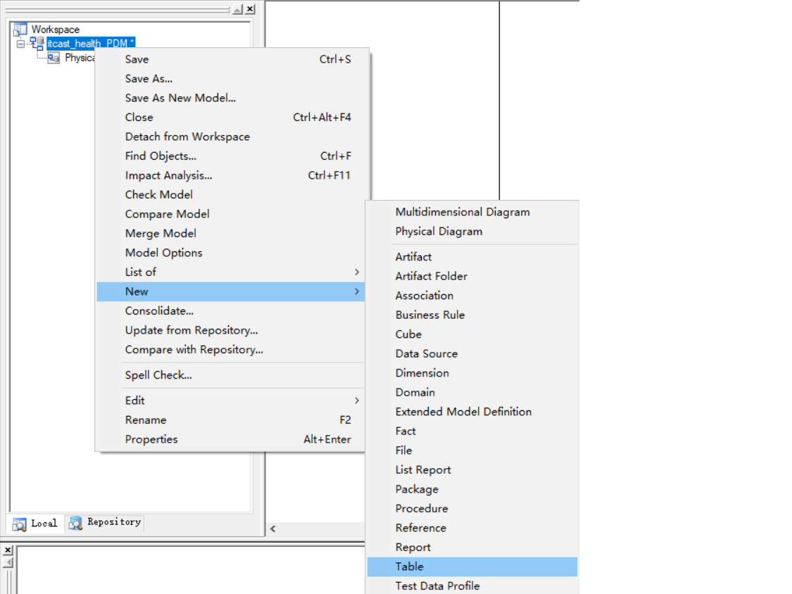

指定表名


创建字段

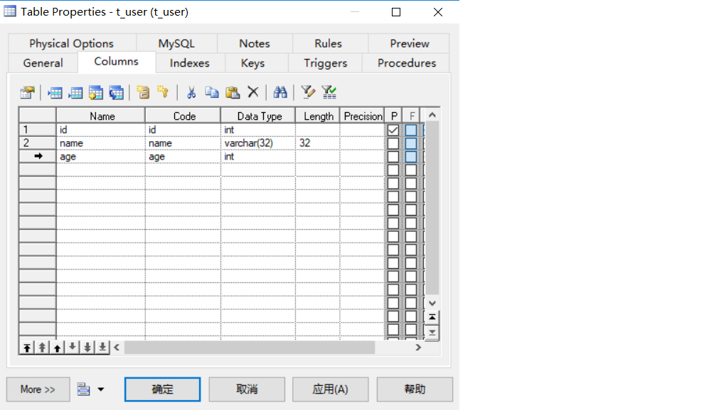

设置某个字段属性，在字段上右键


添加外键约束


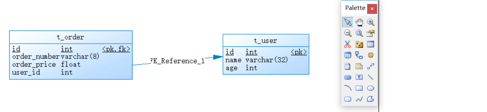


#### 3.2.2 从PDM导出SQL脚本

可以通过PowerDesigner设计的PDM模型导出为SQL脚本，如下：

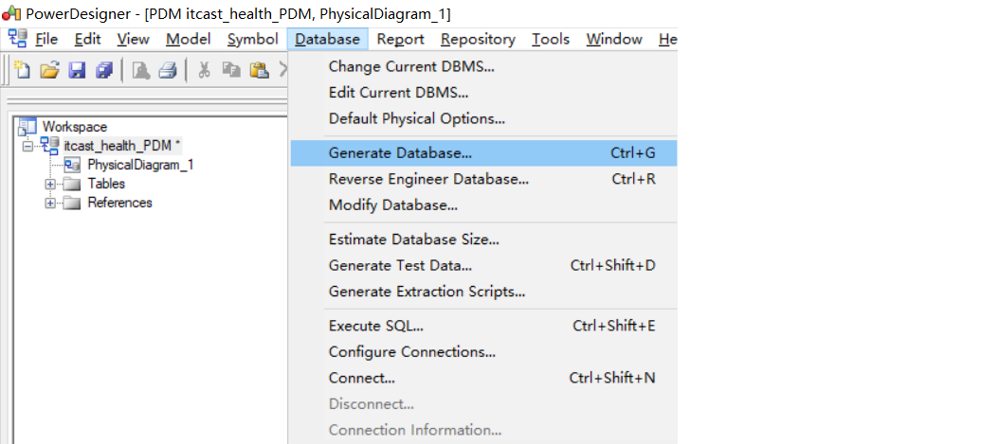


#### 3.2.3 逆向工程

上面我们是首先创建PDM模型，然后通过PowerDesigner提供的功能导出SQL脚本。实际上这个过程也可以反过来，也就是我们可以通过SQL脚本逆向生成PDM模型，这称为逆向工程，操作如下：


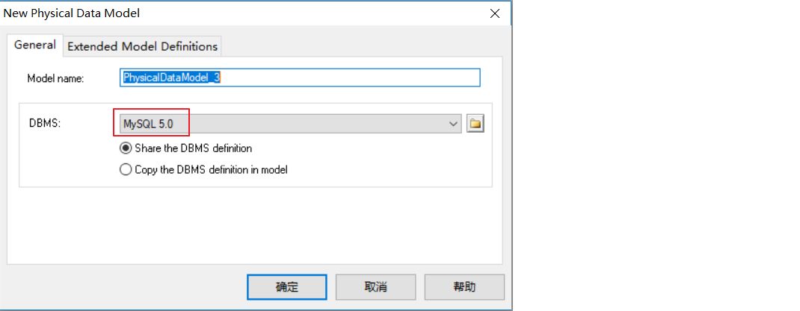


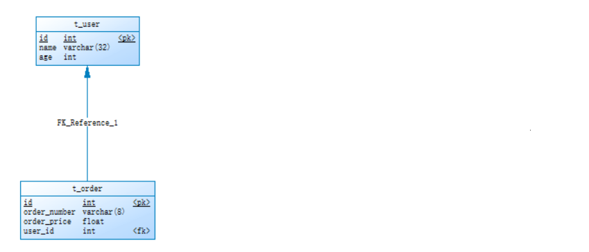

#### 3.2.4 生成数据库报表文件

通过PowerDesigner提供的功能，可以将PDM模型生成报表文件，具体操作如下：

（1）打开报表向导窗口


（2）指定报表名称和语言


（3）选择报表格式和样式

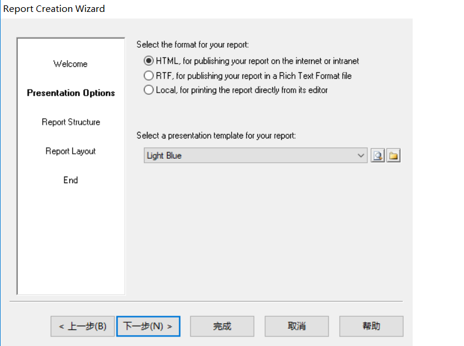


（4）选择对象类型

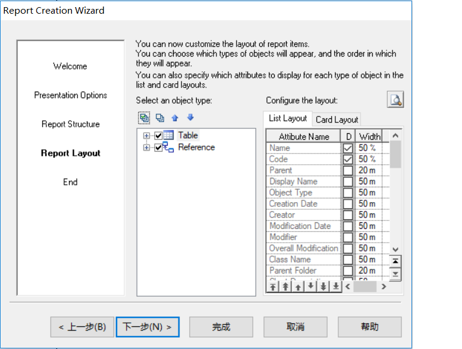

（5）执行生成操作


## 4. ElementUI

### 4.1 ElementUI介绍


ElementUI是一套基于VUE2.0的桌面端组件库，ElementUI提供了丰富的组件帮助开发人员快速构建功能强大、风格统一的页面。

官网地址：http://element-cn.eleme.io/#/zh-CN

饿了么  me 

网站快速成型工具
Element，一套为开发者、设计师和产品经理准备的基于 Vue 2.0 的桌面端组件库

传智健康项目后台系统就是使用ElementUI来构建页面，在页面上引入 js 和 css 文件即可开始使用，如下：

```html
<!-- 引入ElementUI样式 -->
<link rel="stylesheet" href="https://unpkg.com/element-ui/lib/theme-chalk/index.css">
<script src="https://unpkg.com/vue/dist/vue.js"></script>
<!-- 引入ElementUI组件库 -->
<script src="https://unpkg.com/element-ui/lib/index.js"></script>
```

### 4.2 常用组件

#### 4.2.1 Container 布局容器

用于布局的容器组件，方便快速搭建页面的基本结构：

container  外层容器 

用于布局的容器组件，方便快速搭建页面的基本结构：

<el-container>：外层容器。当子元素中包含 <el-header> 或 <el-footer> 时，全部子元素会垂直上下排列，否则会水平左右排列。

<el-header>：顶栏容器。

<el-aside>：侧边栏容器。

<el-main>：主要区域容器。

<el-footer>：底栏容器。

以上组件采用了 flex 布局，使用前请确定目标浏览器是否兼容。此外，<el-container> 的子元素只能是后四者，后四者的父元素也只能是 <el-container>。

```html
<body>
  <div id="app">
    <el-container>
      <el-header>Header</el-header>
      <el-container>
        <el-aside width="200px">Aside</el-aside>
        <el-container>
          <el-main>Main</el-main>
          <el-footer>Footer</el-footer>
        </el-container>
      </el-container>
    </el-container>
  </div>
  <style>
    .el-header, .el-footer {
      background-color: #B3C0D1;
      color: #333;
      text-align: left;
      line-height: 60px;
    }

    .el-aside {
      background-color: #D3DCE6;
      color: #333;
      text-align: center;
      line-height: 200px;
    }

    .el-main {
      background-color: #E9EEF3;
      color: #333;
      text-align: center;
      line-height: 590px;
    }
  </style>
</body>
<script>
  new Vue({
    el:'#app'
  });
</script>
```

#### 4.2.2 Dropdown 下拉菜单

将动作或菜单折叠到下拉菜单中。

```
<el-dropdown split-button size="small" trigger="click">
  个人中心
  <el-dropdown-menu>
    <el-dropdown-item >退出系统</el-dropdown-item>
    <el-dropdown-item divided>修改密码</el-dropdown-item>
    <el-dropdown-item divided>联系管理员</el-dropdown-item>
  </el-dropdown-menu>
</el-dropdown>
```

#### 4.2.3 NavMenu 导航菜单

为网站提供导航功能的菜单。

```
<el-menu>
  <el-submenu index="1">
    <template slot="title">
      <i class="el-icon-location"></i>
      <span slot="title">导航一</span>
    </template>
    <el-menu-item>选项1</el-menu-item>
    <el-menu-item>选项2</el-menu-item>
    <el-menu-item>选项3</el-menu-item>
  </el-submenu>
  <el-submenu index="2">
    <template slot="title">
      <i class="el-icon-menu"></i>
      <span slot="title">导航二</span>
    </template>
    <el-menu-item>选项1</el-menu-item>
    <el-menu-item>选项2</el-menu-item>
    <el-menu-item>选项3</el-menu-item>
  </el-submenu>
</el-menu>
```

#### 4.2.4 Table 表格

用于展示多条结构类似的数据，可对数据进行排序、筛选、对比或其他自定义操作。

```
<el-table :data="tableData" stripe>
  <el-table-column prop="date" label="日期"></el-table-column>
  <el-table-column prop="name" label="姓名"></el-table-column>
  <el-table-column prop="address" label="地址"></el-table-column>
  <el-table-column label="操作" align="center">
    <!--
        slot-scope：作用域插槽，可以获取表格数据
        scope：代表表格数据，可以通过scope.row来获取表格当前行数据，scope不是固定写法
    -->
    <template slot-scope="scope">
      <el-button type="primary" size="mini" @click="handleUpdate(scope.row)">编辑</el-button>
      <el-button type="danger" size="mini"  @click="handleDelete(scope.row)">删除</el-button>
    </template>
  </el-table-column>
</el-table>
<script>
  new Vue({
    el:'#app',
    data:{
      tableData: [{
        date: '2016-05-02',
        name: '王小虎',
        address: '上海市普陀区金沙江路 1518 弄'
      }, {
        date: '2016-05-04',
        name: '王小虎',
        address: '上海市普陀区金沙江路 1517 弄'
      }, {
        date: '2016-05-01',
        name: '王小虎',
        address: '上海市普陀区金沙江路 1519 弄'
      }]
    },
    methods:{
      handleUpdate(row){
        alert(row.date);
      },
      handleDelete(row){
        alert(row.date);
      }
    }
  });
</script>
```

#### 4.2.5 Pagination 分页

当数据量过多时，使用分页分解数据。

```
<!--
    current-change：内置的事件，当前页码改变时会触发，可以获取到改变之后的页码
-->
<el-pagination
               @current-change="handleCurrentChange"
               current-page="5"
               page-size="10"
               layout="total, prev, pager, next, jumper"
               :total="305">
</el-pagination>
<script>
  new Vue({
    el:'#app',
    methods:{
      handleCurrentChange(page){
        alert(page);
      }
    }
  });
</script>
```

#### 4.2.6 Message 消息提示

常用于主动操作后的反馈提示。

```
<el-button :plain="true" @click="open1">消息</el-button>
<el-button :plain="true" @click="open2">成功</el-button>
<el-button :plain="true" @click="open3">警告</el-button>
<el-button :plain="true" @click="open4">错误</el-button>
<script>
  new Vue({
    el: '#app',
    methods: {
      open1() {
        this.$message('这是一条消息提示');
      },
      open2() {
        this.$message({
          message: '恭喜你，这是一条成功消息',
          type: 'success'
        });
      },
      open3() {
        this.$message({
          message: '警告哦，这是一条警告消息',
          type: 'warning'
        });
      },
      open4() {
        this.$message.error('错了哦，这是一条错误消息');
      }
    }
  })
</script>
```

#### 4.2.7 Tabs 标签页

分隔内容上有关联但属于不同类别的数据集合。

```
<h3>基础的、简洁的标签页</h3>
<!--
    通过value属性来指定当前选中的标签页
-->
<el-tabs value="first">
  <el-tab-pane label="用户管理" name="first">用户管理</el-tab-pane>
  <el-tab-pane label="配置管理" name="second">配置管理</el-tab-pane>
  <el-tab-pane label="角色管理" name="third">角色管理</el-tab-pane>
  <el-tab-pane label="定时任务补偿" name="fourth">定时任务补偿</el-tab-pane>
</el-tabs>
<h3>选项卡样式的标签页</h3>
<el-tabs value="first" type="card">
  <el-tab-pane label="用户管理" name="first">用户管理</el-tab-pane>
  <el-tab-pane label="配置管理" name="second">配置管理</el-tab-pane>
  <el-tab-pane label="角色管理" name="third">角色管理</el-tab-pane>
  <el-tab-pane label="定时任务补偿" name="fourth">定时任务补偿</el-tab-pane>
</el-tabs>
<h3>卡片化的标签页</h3>
<el-tabs value="first" type="border-card">
  <el-tab-pane label="用户管理" name="first">用户管理</el-tab-pane>
  <el-tab-pane label="配置管理" name="second">配置管理</el-tab-pane>
  <el-tab-pane label="角色管理" name="third">角色管理</el-tab-pane>
  <el-tab-pane label="定时任务补偿" name="fourth">定时任务补偿</el-tab-pane>
</el-tabs>
<script>
  new Vue({
    el: '#app'
  })
</script>
```

#### 4.2.8 Form 表单

由输入框、选择器、单选框、多选框等控件组成，用以收集、校验、提交数据。在 Form 组件中，每一个表单域由一个 Form-Item 组件构成，表单域中可以放置各种类型的表单控件，包括 Input、Select、Checkbox、Radio、Switch、DatePicker、TimePicker。

```
<!--
    rules：表单验证规则
-->
<el-form ref="form" :model="form" :rules="rules" label-width="80px">
  <!--
    prop：表单域 model 字段，在使用 validate、resetFields 方法的情况下，该属性是必填的
  -->
  <el-form-item label="活动名称" prop="name">
    <el-input v-model="form.name"></el-input>
  </el-form-item>
  <el-form-item label="活动区域" prop="region">
    <el-select v-model="form.region" placeholder="请选择活动区域">
      <el-option label="区域一" value="shanghai"></el-option>
      <el-option label="区域二" value="beijing"></el-option>
    </el-select>
  </el-form-item>
  <el-form-item label="活动时间">
    <el-col :span="11">
      <el-date-picker type="date" placeholder="选择日期" v-model="form.date1" style="width: 100%;"></el-date-picker>
    </el-col>
    <el-col class="line" :span="2">-</el-col>
    <el-col :span="11">
      <el-time-picker type="fixed-time" placeholder="选择时间" v-model="form.date2" style="width: 100%;"></el-time-picker>
    </el-col>
  </el-form-item>
  <el-form-item label="即时配送">
    <el-switch v-model="form.delivery"></el-switch>
  </el-form-item>
  <el-form-item label="活动性质">
    <el-checkbox-group v-model="form.type">
      <el-checkbox label="美食/餐厅线上活动" name="type"></el-checkbox>
      <el-checkbox label="地推活动" name="type"></el-checkbox>
      <el-checkbox label="线下主题活动" name="type"></el-checkbox>
      <el-checkbox label="单纯品牌曝光" name="type"></el-checkbox>
    </el-checkbox-group>
  </el-form-item>
  <el-form-item label="特殊资源">
    <el-radio-group v-model="form.resource">
      <el-radio label="线上品牌商赞助"></el-radio>
      <el-radio label="线下场地免费"></el-radio>
    </el-radio-group>
  </el-form-item>
  <el-form-item label="活动形式">
    <el-input type="textarea" v-model="form.desc"></el-input>
  </el-form-item>
  <el-form-item>
    <el-button type="primary" @click="onSubmit">立即创建</el-button>
  </el-form-item>
</el-form>
<script>
  new Vue({
    el: '#app',
    data:{
      form: {
        name: '',
        region: '',
        date1: '',
        date2: '',
        delivery: false,
        type: [],
        resource: '',
        desc: ''
      },
      //定义校验规则
      rules: {
        name: [
          { required: true, message: '请输入活动名称', trigger: 'blur' },
          { min: 3, max: 5, message: '长度在 3 到 5 个字符', trigger: 'blur' }
        ],
        region: [
          { required: true, message: '请选择活动区域', trigger: 'change' }
        ]
      }
    },
    methods:{
      onSubmit() {
        console.log(this.form);
        //validate：对整个表单进行校验的方法，参数为一个回调函数。
        //该回调函数会在校验结束后被调用，并传入两个参数：是否校验成功和未通过校验的字段。
        this.$refs['form'].validate((valid) => {
          if (valid) {
            alert('submit!');
          } else {
            console.log('error submit!!');
            return false;
          }
        });
      }
    }
  })
</script>
```