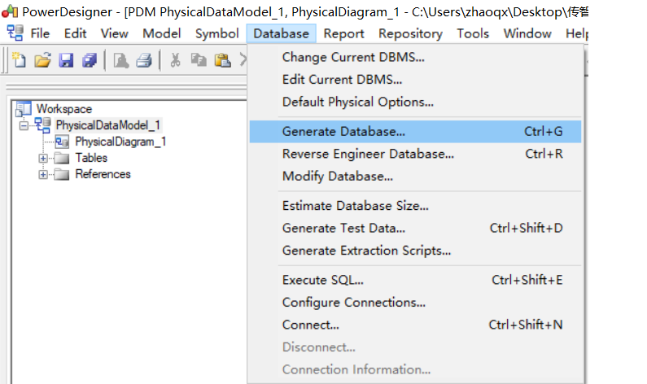

# 第2章 预约管理-检查项管理

## 1. 需求分析

传智健康管理系统是一款应用于健康管理机构的业务系统，实现健康管理机构工作内容可视化、患者管理专业化、健康评估数字化、健康干预流程化、知识库集成化，从而提高健康管理师的工作效率，加强与患者间的互动，增强管理者对健康管理机构运营情况的了解。

可视化 专业化 数字化 流程化 集成化 

系统分为传智健康后台管理系统和移动端应用两部分。其中后台系统提供给健康管理机构内部人员（包括系统管理员、健康管理师等）使用，微信端应用提供给健康管理机构的用户（体检用户）使用。

本项目功能架构图：


通过上面的功能架构图可以看到，传智健康后台管理系统有会员管理、预约管理、健康评估、健康干预等功能。移动端有会员管理、体检预约、体检报告等功能。后台系统和移动端应用都会通过Dubbo调用服务层发布的服务来完成具体的操作。本项目属于典型的SOA架构形式。

本章节完成的功能开发是预约管理功能，包括检查项管理、检查组管理、体检套餐管理、预约设置等（参见产品原型）。预约管理属于系统的基础功能，主要就是管理一些体检的基础数据。

预约管理   后台的 

UP渐若窥宏大
置顶对应的课件、习题作业、相关的资料 https://github.com/liuawen/CS-SE-Resource

2019-10-19 10:576回复

渡边桥谢谢up主，课件为啥下载不了啊
2019-12-02 10:00回复

斑马洗笙课件不对呀，只有谢希仁的，和视频对不上
2020-03-24 23:03回复

渐若窥宏大回复 @斑马洗笙  :没找到对应配套的课件😂 我就搞了下谢希仁的
2020-03-26 12:43回复

比例比例酷考研可以听嘛
2020-03-26 17:24回复

渐若窥宏大回复 @比例比例酷  :可以的，这是计算机网络的基础课程。
2020-03-26 22:40回复

斑马洗笙回复 @渐若窥宏大  :我找到一个，看下全不全？
链接：https://pan.baidu.com/s/1z5Y8V1dNXEvwfg9Zxb-J1A 
提取码：yzcr
2020-03-26 23:142回复

渐若窥宏大回复 @渡边桥  :Github访问下载比较慢,我刚弄到码云上去了。
2020-04-16 22:451回复

渐若窥宏大Github访问下载比较慢，我搞了到码云的https://gitee.com/liuawen/CS-SE-Resource
2020-04-16 22:452回复

时不我待_岁不我与回复 @渐若窥宏大  :谢谢up主
2020-04-17 13:33回复

比例比例酷回复 @渐若窥宏大  :好的谢谢！
2020-05-07 08:34回复
共2页12下一页

UP渐若窥宏大
**软件** || **计科**

核心课程

数据结构：av66396698

Java核心技术：av61317519

Python程序设计：av70193819

数据库：av61985601

计算机组成原理：av70887263

操作系统：av70807448

计算机网络：av71036349

编译原理：av70900366

软件工程：av73746663

设计模式：av63646961

游戏开发：av70885386

2019-11-01 19:0612回复

秀儿他爸
这个很棒，但是为啥明明比较全，却比发的不全的，播放量差这么多..
已经点赞，投币
知识已经不付费了，就不白票！[呲牙]

2020-04-19 23:516回复

UP渐若窥宏大
## 目录

P01-P14 计算机网络概述

P15-P24 物理层

P25-P53 数据链路层

P54-P101 网络层

P102-P121 传输层

P122-P134 应用层

P135-P149 网络安全

P150-P154 Internet上的音频视频

P155-P156 无线网络

2019-10-13 18:164回复

渐若窥宏大156的，全的
2019-11-01 13:021回复

恶搞游虾太强了
2020-07-26 20:34回复

功夫在师外谢谢up,请问这个是全的版本嘛？
2019-11-01 11:05回复

齐楚燕韩赵魏宁
提示：传输层流量控制没有，建议去这里https://www.bilibili.com/video/BV1Hx411D7rn?p=68

2020-07-12 11:053回复

ssskkkeee
支持

来自安卓客户端2019-10-15 01:382回复
UP主觉得很赞

鬼剑灬红眼
这版本是真的细了,比较能对得上书的章节了

2020-07-17 01:041回复

九叶五芯
[滑稽]打卡P141 后面的用不着 就不看了 避免白嫖了

2020-07-09 08:231回复
UP主觉得很赞

DirtMikeyAG
阿婆主救了我的命了，三连[热词系列_三连]

来自iOS客户端2020-04-28 21:441回复
UP主觉得很赞

宝库叔叔
这是哪年到视频啊

来自安卓客户端2020-01-25 06:571回复

UP渐若窥宏大
计算机网络 [微笑]

2019-10-13 16:361回复

渐若窥宏大P103 应用层
2020-01-03 01:13回复

渐若窥宏大P018
2019-11-05 07:40回复

渐若窥宏大好久没弄计网了[喜极而泣]
2019-11-01 00:29回复
共16条回复, 点击查看

编程狮
这个第五版和第七版差别大不大？

8小时前回复

韩立刚的计算机网络
我是韩立刚老师 你未经我的同意 上传我的视频 属于侵权行为 我的课程申请了版权 立即下架我的课程，否则我会采取法律手段维权。 立即下架。

10小时前回复

渐若窥宏大不好意思啦，我马上下架删除。
21分钟前回复

韩立刚的计算机网络
我是韩立刚老师 你未经我的同意 上传我的视频 属于侵权行为 我的课程申请了版权 立即下架我的课程，否则我会采取法律手段维权。立即下架！

10小时前回复

单酒窝好害羞
宏大是什么学校？

来自iOS客户端2020-02-26 01:22回复


## 2. 基础环境搭建

### 2.1 导入预约管理模块数据表

操作步骤：

（1）根据资料中提供的itcasthealth.pdm文件导出SQL脚本



 


（2）创建本项目使用的数据库itcast_health


（3）将PowerDesigner导出的SQL脚本导入itcast_health数据库进行建表


### 2.2 导入预约管理模块实体类

将资料中提供的POJO实体类复制到health_common工程中。

### 2.3 导入项目所需公共资源

项目开发过程中一般会提供一些公共资源，供多个模块或者系统来使用。

本章节我们导入的公共资源有：

（1）返回消息常量类MessageConstant，放到health_common工程中

```
package com.itheima.constant;

/**
 * 消息常量
 */
public class MessageConstant {
    public static final String DELETE_CHECKITEM_FAIL = "删除检查项失败";
    public static final String DELETE_CHECKITEM_SUCCESS = "删除检查项成功";
    public static final String ADD_CHECKITEM_SUCCESS = "新增检查项成功";
    public static final String ADD_CHECKITEM_FAIL = "新增检查项失败";
    public static final String EDIT_CHECKITEM_FAIL = "编辑检查项失败";
    public static final String EDIT_CHECKITEM_SUCCESS = "编辑检查项成功";
    public static final String QUERY_CHECKITEM_SUCCESS = "查询检查项成功";
    public static final String QUERY_CHECKITEM_FAIL = "查询检查项失败";
    public static final String UPLOAD_SUCCESS = "上传成功";
    public static final String ADD_CHECKGROUP_FAIL = "新增检查组失败";
    public static final String ADD_CHECKGROUP_SUCCESS = "新增检查组成功";
    public static final String DELETE_CHECKGROUP_FAIL = "删除检查组失败";
    public static final String DELETE_CHECKGROUP_SUCCESS = "删除检查组成功";
    public static final String QUERY_CHECKGROUP_SUCCESS = "查询检查组成功";
    public static final String QUERY_CHECKGROUP_FAIL = "查询检查组失败";
    public static final String EDIT_CHECKGROUP_FAIL = "编辑检查组失败";
    public static final String EDIT_CHECKGROUP_SUCCESS = "编辑检查组成功";
    public static final String PIC_UPLOAD_SUCCESS = "图片上传成功";
    public static final String PIC_UPLOAD_FAIL = "图片上传失败";
    public static final String ADD_SETMEAL_FAIL = "新增套餐失败";
    public static final String ADD_SETMEAL_SUCCESS = "新增套餐成功";
    public static final String IMPORT_ORDERSETTING_FAIL = "批量导入预约设置数据失败";
    public static final String IMPORT_ORDERSETTING_SUCCESS = "批量导入预约设置数据成功";
    public static final String GET_ORDERSETTING_SUCCESS = "获取预约设置数据成功";
    public static final String GET_ORDERSETTING_FAIL = "获取预约设置数据失败";
    public static final String ORDERSETTING_SUCCESS = "预约设置成功";
    public static final String ORDERSETTING_FAIL = "预约设置失败";
    public static final String ADD_MEMBER_FAIL = "新增会员失败";
    public static final String ADD_MEMBER_SUCCESS = "新增会员成功";
    public static final String DELETE_MEMBER_FAIL = "删除会员失败";
    public static final String DELETE_MEMBER_SUCCESS = "删除会员成功";
    public static final String EDIT_MEMBER_FAIL = "编辑会员失败";
    public static final String EDIT_MEMBER_SUCCESS = "编辑会员成功";
    public static final String TELEPHONE_VALIDATECODE_NOTNULL = "手机号和验证码都不能为空";
    public static final String LOGIN_SUCCESS = "登录成功";
    public static final String VALIDATECODE_ERROR = "验证码输入错误";
    public static final String QUERY_ORDER_SUCCESS = "查询预约信息成功";
    public static final String QUERY_ORDER_FAIL = "查询预约信息失败";
    public static final String QUERY_SETMEALLIST_SUCCESS = "查询套餐列表数据成功";
    public static final String QUERY_SETMEALLIST_FAIL = "查询套餐列表数据失败";
    public static final String QUERY_SETMEAL_SUCCESS = "查询套餐数据成功";
    public static final String QUERY_SETMEAL_FAIL = "查询套餐数据失败";
    public static final String SEND_VALIDATECODE_FAIL = "验证码发送失败";
    public static final String SEND_VALIDATECODE_SUCCESS = "验证码发送成功";
    public static final String SELECTED_DATE_CANNOT_ORDER = "所选日期不能进行体检预约";
    public static final String ORDER_FULL = "预约已满";
    public static final String HAS_ORDERED = "已经完成预约，不能重复预约";
    public static final String ORDER_SUCCESS = "预约成功";
    public static final String GET_USERNAME_SUCCESS = "获取当前登录用户名称成功";
    public static final String GET_USERNAME_FAIL = "获取当前登录用户名称失败";
    public static final String GET_MENU_SUCCESS = "获取当前登录用户菜单成功";
    public static final String GET_MENU_FAIL = "获取当前登录用户菜单失败";
    public static final String GET_MEMBER_NUMBER_REPORT_SUCCESS = "获取会员统计数据成功";
    public static final String GET_MEMBER_NUMBER_REPORT_FAIL = "获取会员统计数据失败";
    public static final String GET_SETMEAL_COUNT_REPORT_SUCCESS = "获取套餐统计数据成功";
    public static final String GET_SETMEAL_COUNT_REPORT_FAIL = "获取套餐统计数据失败";
    public static final String GET_BUSINESS_REPORT_SUCCESS = "获取运营统计数据成功";
    public static final String GET_BUSINESS_REPORT_FAIL = "获取运营统计数据失败";
    public static final String GET_SETMEAL_LIST_SUCCESS = "查询套餐列表数据成功";
    public static final String GET_SETMEAL_LIST_FAIL = "查询套餐列表数据失败";
}
```

（2）返回结果Result和PageResult类，放到health_common工程中

```
package com.itheima.entity;
import java.io.Serializable;
/**
 * 封装返回结果
 */
public class Result implements Serializable{
    private boolean flag;//执行结果，true为执行成功 false为执行失败
    private String message;//返回提示信息，主要用于页面提示信息
    private Object data;//返回数据
    public Result(boolean flag, String message) {
        super();
        this.flag = flag;
        this.message = message;
    }
    public Result(boolean flag, String message, Object data) {
        this.flag = flag;
        this.message = message;
        this.data = data;
    }
    public boolean isFlag() {
        return flag;
    }
    public void setFlag(boolean flag) {
        this.flag = flag;
    }
    public String getMessage() {
        return message;
    }
    public void setMessage(String message) {
        this.message = message;
    }
    public Object getData() {
        return data;
    }
    public void setData(Object data) {
        this.data = data;
    }
}
package com.itheima.entity;
import java.io.Serializable;
import java.util.List;
/**
 * 分页结果封装对象
 */
public class PageResult implements Serializable{
    private Long total;//总记录数
    private List rows;//当前页结果
    public PageResult(Long total, List rows) {
        super();
        this.total = total;
        this.rows = rows;
    }
    public Long getTotal() {
        return total;
    }
    public void setTotal(Long total) {
        this.total = total;
    }
    public List getRows() {
        return rows;
    }
    public void setRows(List rows) {
        this.rows = rows;
    }
}
```

（3）封装查询条件的QueryPageBean类，放到health_common工程中

```
package com.itheima.entity;
import java.io.Serializable;
/**
 * 封装查询条件
 */
public class QueryPageBean implements Serializable{
    private Integer currentPage;//页码
    private Integer pageSize;//每页记录数
    private String queryString;//查询条件
    public Integer getCurrentPage() {
        return currentPage;
    }
    public void setCurrentPage(Integer currentPage) {
        this.currentPage = currentPage;
    }
    public Integer getPageSize() {
        return pageSize;
    }
    public void setPageSize(Integer pageSize) {
        this.pageSize = pageSize;
    }
    public String getQueryString() {
        return queryString;
    }
    public void setQueryString(String queryString) {
        this.queryString = queryString;
    }
}
```

（4）html、js、css、图片等静态资源，放到health_backend工程中

注意：后续随着项目开发还会陆续导入其他一些公共资源。

## 3. 新增检查项

### 3.1 完善页面

检查项管理页面对应的是checkitem.html页面，根据产品设计的原型已经完成了页面基本结构的编写，现在需要完善页面动态效果。

#### 3.1.1 弹出新增窗口

页面中已经提供了新增窗口，只是处于隐藏状态。只需要将控制展示状态的属性dialogFormVisible改为true就可以显示出新增窗口。

新建按钮绑定的方法为handleCreate，所以在handleCreate方法中修改dialogFormVisible属性的值为true即可。同时为了增加用户体验度，需要每次点击新建按钮时清空表单输入项。

```
// 重置表单
resetForm() {
    this.formData = {};
},
// 弹出添加窗口
handleCreate() {
    this.resetForm();
    this.dialogFormVisible = true;
}
```

#### 3.1.2 输入校验

```
rules: {//校验规则
    code: [{ required: true, message: '项目编码为必填项', trigger: 'blur' }],
    name: [{ required: true, message: '项目名称为必填项', trigger: 'blur' }]
}
```

#### 3.1.3 提交表单数据

点击新增窗口中的确定按钮时，触发handleAdd方法，所以需要在handleAdd方法中进行完善。

```
handleAdd () {
  //校验表单输入项是否合法
  this.$refs['dataAddForm'].validate((valid) => {
    if (valid) {
      //表单数据校验通过，发送ajax请求将表单数据提交到后台
      axios.post("/checkitem/add.do",this.formData).then((response)=> {
        //隐藏新增窗口
        this.dialogFormVisible = false;
        //判断后台返回的flag值，true表示添加操作成功，false为添加操作失败
        if(response.data.flag){
          this.$message({
            message: response.data.message,
            type: 'success'
          });
        }else{
          this.$message.error(response.data.message);
        }
      }).finally(()=> {
        this.findPage();
      });
    } else {
      this.$message.error("表单数据校验失败");
      return false;
    }
  });
}
```

### 3.2 后台代码

#### 3.2.1 Controller

在health_backend工程中创建CheckItemController

```
package com.itheima.controller;
import com.alibaba.dubbo.config.annotation.Reference;
import com.itheima.constant.MessageConstant;
import com.itheima.entity.PageResult;
import com.itheima.entity.QueryPageBean;
import com.itheima.entity.Result;
import com.itheima.pojo.CheckItem;
import com.itheima.service.CheckItemService;
import org.springframework.web.bind.annotation.RequestBody;
import org.springframework.web.bind.annotation.RequestMapping;
import org.springframework.web.bind.annotation.RequestParam;
import org.springframework.web.bind.annotation.RestController;
import java.util.List;
/**
 * 体检检查项管理
 */
@RestController
@RequestMapping("/checkitem")
public class CheckItemController {
    @Reference
    private CheckItemService checkItemService;

    //新增
    @RequestMapping("/add")
    public Result add(@RequestBody CheckItem checkItem){
        try {
            checkItemService.add(checkItem);
        }catch (Exception e){
            return new Result(false,MessageConstant.ADD_CHECKITEM_FAIL);
        }
        return new Result(true,MessageConstant.ADD_CHECKITEM_SUCCESS);
    }
}
```

#### 3.2.2 服务接口

在health_interface工程中创建CheckItemService接口

```
package com.itheima.service;
import com.itheima.pojo.CheckItem;
import java.util.List;
/**
 * 检查项服务接口
 */
public interface CheckItemService {
    public void add(CheckItem checkItem);
}
```

#### 3.2.3 服务实现类

在health_service_provider工程中创建CheckItemServiceImpl实现类

```
package com.itheima.service;
import com.alibaba.dubbo.config.annotation.Service;
import com.itheima.dao.CheckItemDao;
import com.itheima.pojo.CheckItem;
import org.springframework.beans.factory.annotation.Autowired;
import org.springframework.transaction.annotation.Transactional;
/**
 * 检查项服务
 */
@Service(interfaceClass = CheckItemService.class)
@Transactional
public class CheckItemServiceImpl implements CheckItemService {
    @Autowired
    private CheckItemDao checkItemDao;
    //新增
    public void add(CheckItem checkItem) {
        checkItemDao.add(checkItem);
    }
}
```

#### 3.2.4 Dao接口

在health_service_provider工程中创建CheckItemDao接口，本项目是基于Mybatis的Mapper代理技术实现持久层操作，故只需要提供接口和Mapper映射文件，无须提供实现类

```
package com.itheima.dao;
import com.itheima.pojo.CheckItem;
/**
 * 持久层Dao接口
 */
public interface CheckItemDao {
    public void add(CheckItem checkItem);
}
```

#### 3.2.5 Mapper映射文件

在health_service_provider工程中创建CheckItemDao.xml映射文件，需要和CheckItemDao接口在同一目录下

```
<?xml version="1.0" encoding="UTF-8" ?>
<!DOCTYPE mapper PUBLIC "-//mybatis.org//DTD Mapper 3.0//EN"
        "http://mybatis.org/dtd/mybatis-3-mapper.dtd" >
<mapper namespace="com.itheima.dao.CheckItemDao">
    <!--新增-->
    <insert id="add" parameterType="com.itheima.pojo.CheckItem">
        insert into t_checkitem(code,name,sex,age,price,type,remark,attention)
                      values 
        (#{code},#{name},#{sex},#{age},#{price},#{type},#{remark},#{attention})
    </insert>
</mapper>
```

## 4. 检查项分页

本项目所有分页功能都是基于ajax的异步请求来完成的，请求参数和后台响应数据格式都使用json数据格式。

请求参数包括页码、每页显示记录数、查询条件。

请求参数的json格式为：{currentPage:1,pageSize:10,queryString:''itcast''}

后台响应数据包括总记录数、当前页需要展示的数据集合。

响应数据的json格式为：{total:1000,rows:[]}

如下图：


### 4.1 完善页面

#### 4.1.1 定义分页相关模型数据

```
pagination: {//分页相关模型数据
  currentPage: 1,//当前页码
  pageSize:10,//每页显示的记录数
  total:0,//总记录数
  queryString:null//查询条件
},
dataList: [],//当前页要展示的分页列表数据
```

#### 4.1.2 定义分页方法

在页面中提供了findPage方法用于分页查询，为了能够在checkitem.html页面加载后直接可以展示分页数据，可以在VUE提供的钩子函数created中调用findPage方法

```
//钩子函数，VUE对象初始化完成后自动执行
created() {
  this.findPage();
}
//分页查询
findPage() {
  //分页参数
  var param = {
    currentPage:this.pagination.currentPage,//页码
    pageSize:this.pagination.pageSize,//每页显示的记录数
    queryString:this.pagination.queryString//查询条件
  };
  //请求后台
  axios.post("/checkitem/findPage.do",param).then((response)=> {
    //为模型数据赋值，基于VUE的双向绑定展示到页面
    this.dataList = response.data.rows;
    this.pagination.total = response.data.total;
  });
}
```

#### 4.1.3 完善分页方法执行时机

除了在created钩子函数中调用findPage方法查询分页数据之外，当用户点击查询按钮或者点击分页条中的页码时也需要调用findPage方法重新发起查询请求。

为查询按钮绑定单击事件，调用findPage方法

```
<el-button @click="findPage()" class="dalfBut">查询</el-button>
```

为分页条组件绑定current-change事件，此事件是分页条组件自己定义的事件，当页码改变时触发，对应的处理函数为handleCurrentChange

```
<el-pagination
               class="pagiantion"
               @current-change="handleCurrentChange"
               :current-page="pagination.currentPage"
               :page-size="pagination.pageSize"
               layout="total, prev, pager, next, jumper"
               :total="pagination.total">
</el-pagination>
```

定义handleCurrentChange方法

```
//切换页码
handleCurrentChange(currentPage) {
  //currentPage为切换后的页码
  this.pagination.currentPage = currentPage;
  this.findPage();
}
```

### 4.2 后台代码

#### 4.2.1 Controller

在CheckItemController中增加分页查询方法

```
//分页查询
@RequestMapping("/findPage")
public PageResult findPage(@RequestBody QueryPageBean queryPageBean){
    PageResult pageResult = checkItemService.pageQuery(
    queryPageBean.getCurrentPage(), 
    queryPageBean.getPageSize(), 
    queryPageBean.getQueryString());
    return pageResult;
}
```

#### 4.2.2 服务接口

在CheckItemService服务接口中扩展分页查询方法

```
public PageResult pageQuery(Integer currentPage, Integer pageSize, String queryString);
```

#### 4.2.3 服务实现类

在CheckItemServiceImpl服务实现类中实现分页查询方法，基于Mybatis分页助手插件实现分页

```
public PageResult pageQuery(Integer currentPage, Integer pageSize, String queryString) {
  PageHelper.startPage(currentPage,pageSize);
  Page<CheckItem> page = checkItemDao.selectByCondition(queryString);
  return new PageResult(page.getTotal(),page.getResult());
}
```

#### 4.2.4 Dao接口

在CheckItemDao接口中扩展分页查询方法

```
public Page<CheckItem> selectByCondition(String queryString);
```

#### 4.2.5 Mapper映射文件

在CheckItemDao.xml文件中增加SQL定义

```
<select id="selectByCondition" parameterType="string" 
        resultType="com.itheima.pojo.CheckItem">
  select * from t_checkitem
  <if test="value != null and value.length > 0">
    where code = #{value} or name = #{value}
  </if>
</select>
```

## 5. 删除检查项

### 5.1 完善页面

为了防止用户误操作，点击删除按钮时需要弹出确认删除的提示，用户点击取消则不做任何操作，用户点击确定按钮再提交删除请求。

#### 5.1.1 绑定单击事件

需要为删除按钮绑定单击事件，并且将当前行数据作为参数传递给处理函数

```
<el-button size="mini" type="danger" @click="handleDelete(scope.row)">删除</el-button>
// 删除
handleDelete(row) {
  alert(row.id);
}
```

#### 5.1.2 弹出确认操作提示

用户点击删除按钮会执行handleDelete方法，此处需要完善handleDelete方法，弹出确认提示信息。ElementUI提供了$confirm方法来实现确认提示信息弹框效果

```
// 删除
handleDelete(row) {
  //alert(row.id);
  this.$confirm("确认删除当前选中记录吗？","提示",{type:'warning'}).then(()=>{
    //点击确定按钮时只需此处代码
    alert('用户点击的是确定按钮');
  });
}
```

#### 5.1.3 发送请求

如果用户点击确定按钮就需要发送ajax请求，并且将当前检查项的id作为参数提交到后台进行删除操作

```
// 删除
handleDelete(row) {
  //alert(row.id);
  this.$confirm("确认删除吗？","提示",{type:'warning'}).then(()=>{
    //点击确定按钮时只需此处代码
    //alert('用户点击的是确定按钮');
    axios.get("/checkitem/delete.do?id=" + row.id).then((res)=> {
      if(!res.data.flag){
        //删除失败
        this.$message.error(res.data.message);
      }else{
        //删除成功
        this.$message({
          message: res.data.message,
          type: 'success'
        });
        //调用分页，获取最新分页数据
        this.findPage();
      }
    });
  });
}
```

### 5.2 后台代码

#### 5.2.1 Controller

在CheckItemController中增加删除方法

```
//删除
@RequestMapping("/delete")
public Result delete(Integer id){
  try {
    checkItemService.delete(id);
  }catch (RuntimeException e){
    return new Result(false,e.getMessage());
  }catch (Exception e){
    return new Result(false, MessageConstant.DELETE_CHECKITEM_FAIL);
  }
  return new Result(true,MessageConstant.DELETE_CHECKITEM_SUCCESS);
}
```

#### 5.2.2 服务接口

在CheckItemService服务接口中扩展删除方法

```
public void delete(Integer id);
```

#### 5.2.3 服务实现类

注意：不能直接删除，需要判断当前检查项是否和检查组关联，如果已经和检查组进行了关联则不允许删除

```
//删除
public void delete(Integer id) throws RuntimeException{
  //查询当前检查项是否和检查组关联
  long count = checkItemDao.findCountByCheckItemId(id);
  if(count > 0){
    //当前检查项被引用，不能删除
    throw new RuntimeException("当前检查项被引用，不能删除");
  }
  checkItemDao.deleteById(id);
}
```

#### 5.2.4 Dao接口

在CheckItemDao接口中扩展方法findCountByCheckItemId和deleteById

```
public void deleteById(Integer id);
public long findCountByCheckItemId(Integer checkItemId);
```

#### 5.2.5 Mapper映射文件

在CheckItemDao.xml中扩展SQL语句

```
<!--删除-->
<delete id="deleteById" parameterType="int">
  delete from t_checkitem where id = #{id}
</delete>
<!--根据检查项id查询中间关系表-->
<select id="findCountByCheckItemId" resultType="long" parameterType="int">
  select count(*) from t_checkgroup_checkitem where checkitem_id = #{checkitem_id}
</select>
```

## 6. 编辑检查项

### 6.1 完善页面

用户点击编辑按钮时，需要弹出编辑窗口并且将当前记录的数据进行回显，用户修改完成后点击确定按钮将修改后的数据提交到后台进行数据库操作。

#### 6.1.1 绑定单击事件

需要为编辑按钮绑定单击事件，并且将当前行数据作为参数传递给处理函数

```
<el-button type="primary" size="mini" @click="handleUpdate(scope.row)">编辑</el-button>
handleUpdate(row) {
  alert(row);
}
```

#### 6.1.2 弹出编辑窗口回显数据

当前页面中的编辑窗口已经提供好了，默认处于隐藏状态。在handleUpdate方法中需要将编辑窗口展示出来，并且需要发送ajax请求查询当前检查项数据用于回显

```
// 弹出编辑窗口
handleUpdate(row) {
  //发送请求获取检查项信息
  axios.get("/checkitem/findById.do?id=" + row.id).then((res)=>{
    if(res.data.flag){
      //设置编辑窗口属性，dialogFormVisible4Edit为true表示显示
      this.dialogFormVisible4Edit = true;
      //为模型数据设置值，基于VUE双向数据绑定回显到页面
      this.formData = res.data.data;
    }else{
      this.$message.error("获取数据失败，请刷新当前页面");
    }
  });
}
```

#### 6.1.3 发送请求

在编辑窗口中修改完成后，点击确定按钮需要提交请求，所以需要为确定按钮绑定事件并提供处理函数handleEdit

```
<el-button type="primary" @click="handleEdit()">确定</el-button>
//编辑
handleEdit() {
  //表单校验
  this.$refs['dataEditForm'].validate((valid)=>{
    if(valid){
      //表单校验通过，发送请求
      axios.post("/checkitem/edit.do",this.formData).then((response)=> {
        //隐藏编辑窗口
        this.dialogFormVisible4Edit = false;
        if(response.data.flag){
          //编辑成功，弹出成功提示信息
          this.$message({
            message: response.data.message,
            type: 'success'
          });
        }else{
          //编辑失败，弹出错误提示信息
          this.$message.error(response.data.message);
        }
      }).finally(()=> {
        //重新发送请求查询分页数据
        this.findPage();
      });
    }else{
      //表单校验失败
      this.$message.error("表单数据校验失败");
      return false;
    }
  });
}
```

### 6.2 后台代码

#### 6.2.1 Controller

在CheckItemController中增加编辑方法

```
//编辑
@RequestMapping("/edit")
public Result edit(@RequestBody CheckItem checkItem){
  try {
    checkItemService.edit(checkItem);
  }catch (Exception e){
    return new Result(false,MessageConstant.EDIT_CHECKITEM_FAIL);
  }
  return new Result(true,MessageConstant.EDIT_CHECKITEM_SUCCESS);
}

@RequestMapping("/findById")
public Result findById(Integer id){
    try{
        CheckItem checkItem = checkItemService.findById(id);
        return  new Result(true, MessageConstant.QUERY_CHECKITEM_SUCCESS,checkItem);
    }catch (Exception e){
        e.printStackTrace();
        //服务调用失败
        return new Result(false, MessageConstant.QUERY_CHECKITEM_FAIL);
    }
}
```

#### 6.2.2 服务接口

在CheckItemService服务接口中扩展编辑方法

```
public void edit(CheckItem checkItem);
public CheckItem findById(Integer id);
```

#### 6.2.3 服务实现类

在CheckItemServiceImpl实现类中实现编辑方法

```
//编辑
public void edit(CheckItem checkItem) {
  checkItemDao.edit(checkItem);
}

public CheckItem findById(Integer id) {
    return checkItemDao.findById(id);
}
```

#### 6.2.4 Dao接口

在CheckItemDao接口中扩展edit方法

```
public void edit(CheckItem checkItem);
public CheckItem findById(Integer id);
```

#### 6.2.5 Mapper映射文件

在CheckItemDao.xml中扩展SQL语句

```
<!--编辑-->
<update id="edit" parameterType="com.itheima.pojo.CheckItem">
  update t_checkitem
  <set>
    <if test="name != null">
      name = #{name},
    </if>
    <if test="sex != null">
      sex = #{sex},
    </if>
    <if test="code != null">
      code = #{code},
    </if>
    <if test="age != null">
      age = #{age},
    </if>
    <if test="price != null">
      price = #{price},
    </if>
    <if test="type != null">
      type = #{type},
    </if>
    <if test="attention != null">
      attention = #{attention},
    </if>
    <if test="remark != null">
      remark = #{remark},
    </if>
  </set>
  where id = #{id}
</update>

<select id="findById" parameterType="int" resultType="com.itheima.pojo.CheckItem">
    select * from t_checkitem where id = #{id}
</select>
```

 