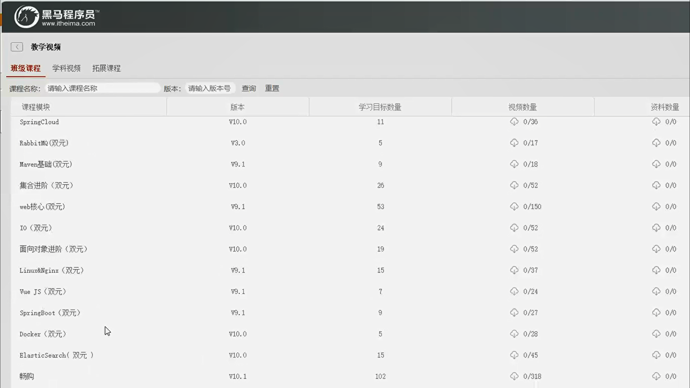

# 第1章 - 项目介绍和工程搭建

学习目标：

- 了解十次方项目需求；
- 了解前后端分离开发模式
- 理解RESTful
- 完成项目开发环境搭建
- 完成父工程、公共模块和文章微服务的搭建
- 掌握mybatis plus的使用，并开发完成文章微服务中文章的增删改查功能
- 掌握公共异常处理类的使用


爱的十次方

1024

第一天 上午 

MySQL优化  深入学习




跑起来 

前后端分离 

了解需求的  整明白    面试的时候   问题  

理解RESTful   

严格  遵循   风格 


项目介绍   工程搭建


# 1 十次方项目需求分析

## 1.1 项目介绍

十次方是程序员的专属社交平台，包括头条、问答、活动、交友、吐槽、招聘六大频道。

头条  抖音  

看新闻  问答  活动 交友  学习  吐槽  招聘 

1024是程序员的专属社交平台 


十次方名称的由来：2的10次方为1024，程序员都懂的。

如果你是一位技术大咖，那么赶快发布文章，增加知名度吧。

如果你是一名技术小白，那么赶快到问答频道寻求帮助的，这里高手如云哦！

如果你不想错过各种技术交流会，那么请经常关注活动频道吧。

如果你还是单身，那么赶快到交友频道找到你心仪的另一半。

如果你有太多的苦恼，那么赶快吐个槽吧。

如果你正在找工作或是想跳槽拿高薪，那么来招聘频道淘金吧。

ten  square  十次方

## 1.2 项目需求

> 详见： 资源\文档\十次方需求规格说明书.docx

# 2 系统设计

## 2.1 开发模式

十次方项目采用前后端分离的开发模式

开发模式   开发模型    ？？？


开发模型   健康

瀑布模型 

瀑布模型  需求分析 概要设计 简单的设计  初稿

什么情况

详细设计   各种各样  没有问题

设计问题 详细化


开发完了  交付

维护阶段   

传统类型   固定的套路  


运行了好几年  需求  小功能


敏捷开发  

沟通交流  及时  

以人为单位  马上解决    灵活  

一周发布一个版本  或者 修改完了代码 就可以发布版本   

改了就发布  开发人员   测试人员  


敏捷开发   

## 2.2 技术选型

后端：springboot + springcloud + mybatis plus + mysql5.7

前端：nodejs + NUXT + elementUI + vue


持久化  

NUXT 前端渲染技术  

前端  后端  隔离开来  


MySQL5.7

基于Docker的  虚拟机 不会用本地的数据库  

没有必要的


一个系统管理员 能不能维护所有的 不能

超级的系统管理员  

Java  Python   前端 

频道  

也是管理员   


root  

软件工程


行业

OA ERP  传统的   局限的   针对系统  企业的  用户的并发量  

SSM     行业  


SpringCloud


软件工程 

china-pub.com


书  作者  博客   出版社


敏捷开发  是不是很累

功能要做的 


需求  一样的都有任务的   各种各样的事情

敏捷开发  需求经常变更     好处 快速迭代  响应开发 

双十一   Bug   用来多少秒  


## 2.3 技术架构

采用前后端分离的系统架构

用户  管理员   

前端系统页面  前端页面接口路由微服务

后台管理系统页面  后台管理系统接口路由微服务


基础微服务

用户微服务

文章微服务

问答微服务

招聘微服务


接口  路由   好处多多  

路由 连接到对应的  

前端  找路由 


数据 存储  读取 

用户 管理员

前端  页面  后端 数据库 

## 2.4 微服务模块划分

| 模块名称            | 模块中文名称   |
| :------------------ | :------------- |
| tensquare_common    | 公共模块       |
| tensquare_base      | 基础微服务     |
| tensquare_article   | 文章微服务     |
| tensquare_friend    | 交友微服务     |
| tensquare_gathering | 活动微服务     |
| tensquare_qa        | 问答微服务     |
| tensquare_recruit   | 招聘微服务     |
| tensquare_user      | 用户微服务     |
| tensquare_spit      | 吐槽微服务     |
| tensquare_search    | 搜索微服务     |
| tensquare_web       | 前台微服务网关 |
| tensquare_manager   | 后台微服务网关 |
| tensquare_eureka    | 注册中心       |
| tensquare_config    | 配置中心       |
| tensquare_sms       | 短信微服务     |
| tensquare_notice    | 消息通知微服务 |

 gathering 聚集


## 2.5 数据库表结构分析

采用的分库分表设计，每个微服务模块为1个独立的数据库。

tensquare_article 文章

tensquare_base 基础

tensquare_friend 交友

tensquare_gathering 活动

tensquare_qa 问答

tensquare_recruit 招聘

tensquare_user 用户

tensquare_spit 吐槽

> 详见 资源\文档\十次方数据库文档.xlsx

 文章  

基本

交友

活动

问答

招聘

用户

吐槽

## 2.6 API文档

课程提供了前后端开发接口文档（采用Swagger语言进行编写），并与Nginx进行了整 合。双击Nginx执行文件启动后，在地址栏输入http://localhost:801 即可访问API文档

 

前后端约定的返回码列表：

| 状态描述         | 返回码 |
| :--------------- | :----- |
| 成功             | 20000  |
| 失败             | 20001  |
| 用户名或密码错误 | 20002  |
| 权限不足         | 20003  |
| 远程调用失败     | 20004  |
| 重复操作         | 20005  |


很多很多返回码吧

# 3 RESTful架构说明

## 3.1 何为RESTful

RESTful架构是目前最流行的一种互联网软件架构

是Roy Thomas Fielding在他2000年的博士论文中提出的

是Representational State Transfer的缩写，翻译过来是”表现层状态转化”

是所有Web应用都应该遵守的架构设计指导原则

7个HTTP方法：GET、POST、PUT、DELETE、PATCH、HEAD、OPTIONS


RESRful架构是目前最流行的一种互联网软件架构

互联网软件架构  

表现层 状态转化 

表现层状态转化

所有Web应用都应该遵守zun的架构设计指导原则


架构设计指导原则 

## 3.2 接口规范

十次方项目使用GET、POST、PUT、DELETE四种方法

幂等性：不论你请求多少次，资源的状态是一样的。

### 3.2.1 GET

- 安全且幂等
- 获取表示
- 变更时获取表示（缓存）

==适合查询类的接口使用==

 

### 3.2.2 POST

- 不安全且不幂等
- 使用服务端管理的（自动产生）的实例号创建资源
- 创建子资源
- 部分更新资源
- 如果没有被修改，则不过更新资源（乐观锁）

==适合数据提交类的接口使用==

### 3.2.3 PUT

- 不安全但幂等
- 用客户端管理的实例号创建一个资源
- 通过替换的方式更新资源
- 如果未被修改，则更新资源（乐观锁）

==适合更新数据的接口使用==

### 3.2.4 DELETE

- 不安全但幂等
- 删除资源

==适合删除数据的接口使用==

 

请求返回响应码：

| 代码    | 含义                                                         |
| :------ | :----------------------------------------------------------- |
| ==200== | （OK）- 如果现有资源已被更改                                 |
| 201     | （created）- 如果新资源被创建                                |
| 202     | （accepted）- 已接受处理请求但尚未完成（异步处理）           |
| 301     | （Moved Permanently）- 资源的URI被更新                       |
| 303     | （See Other）- 其他（如，负载均衡）                          |
| ==400== | （bad request）- 指代坏请求                                  |
| ==404== | （not found）- 资源不存在                                    |
| 406     | （not acceptable）- 服务端不支持所需表示                     |
| 409     | （conflict）- 通用冲突                                       |
| 412     | （Precondition Failed）- 前置条件失败（如执行条件更新时的冲突） |
| 415     | （unsupported media type）- 接受到的表示不受支持             |
| ==500== | （internal server error）- 通用错误响应                      |
| 503     | （Service Unavailable）- 服务当前无法处理请求                |


# 4 项目开发准备

## 4.1 开发环境

- 虚拟系统环境 VMware Workstation
- 虚拟机系统 CentOS 7
- 容器 docker
- JDK1.8
- 数据库 mysql 5.7
- 开发工具 idea
- 项目构建工具 maven

所有的第三方工具如**mysql**等都是运行在docker容器中的

```
注：虚拟机的帐户名root 密码itcast
```

## 4.2 mysql建库建表

进入安装了docker的虚拟机中，按以下顺序执行命令

（1）下载镜像（此步可省略）

```
docker pull centos/mysql‐57‐centos7
```

注：docker默认从国外的镜像网站拉取镜像，速度很慢。可以使用国内的阿里云镜像加速站点提升镜像拉取速度。具体步骤可以参考文档

> docker配置国内镜像加速站点.pdf

（2）创建容器

```
docker run -di --name=tensquare_mysql -p 3306:3306 -e MYSQL_ROOT_PASSWORD=root centos/mysql-57-centos7
```

（3）连接MYSQL ，并执行资料中的建表脚本，创建article数据库

 

## 4.3 接口测试工具postman

postman是一款强大网页调试工具

- 能够发送任何类型的HTTP 请求 (GET，HEAD， POST，PUT。。。)
- 附带任意数量的参数


# 5 项目工程搭建

## 5.1 父工程搭建

创建项目类型为maven的父工程

1. 打开idea开发工具
2. 选择菜单file-new project ,弹出窗口中左侧菜单选择Maven ，点击next按钮


3.GroupId填写com.tensquare，ArtifacetId填写tensquare_parent，点击next按钮

