Vue.js与Webpack

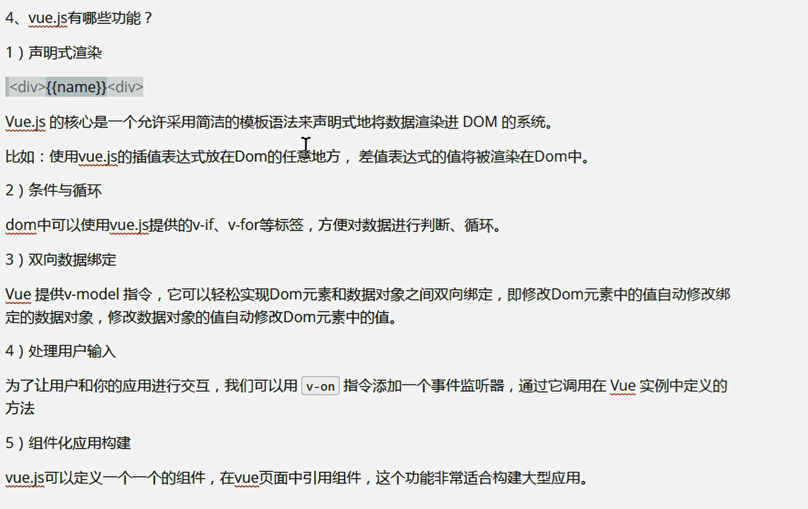

npm  install webpack@3.6.0 -g 

cnpm install 

# webpack-dev-server

cnpm install webpack@3.6.0 webpack-dev-server@2.9.1 html-webpack-plugin@2.30.1 --save-dev

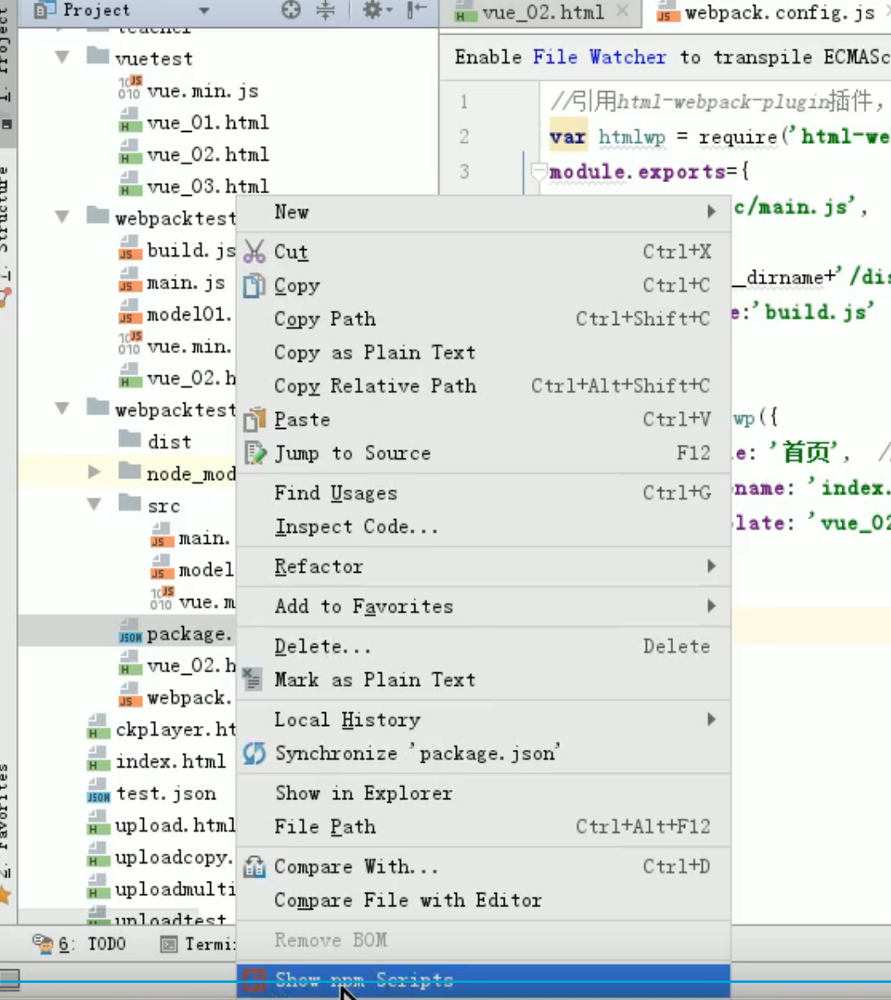

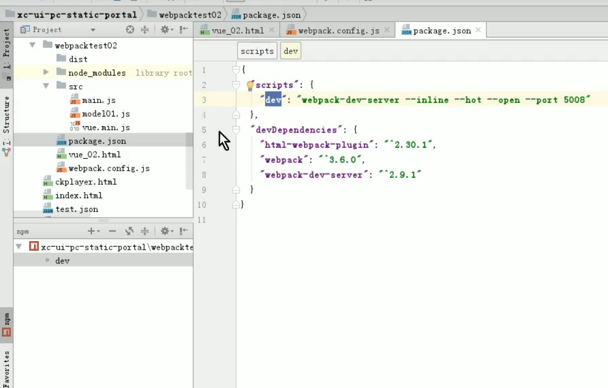

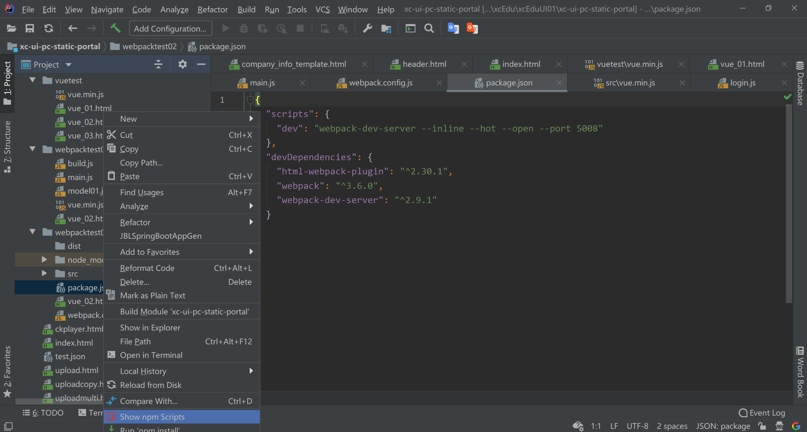

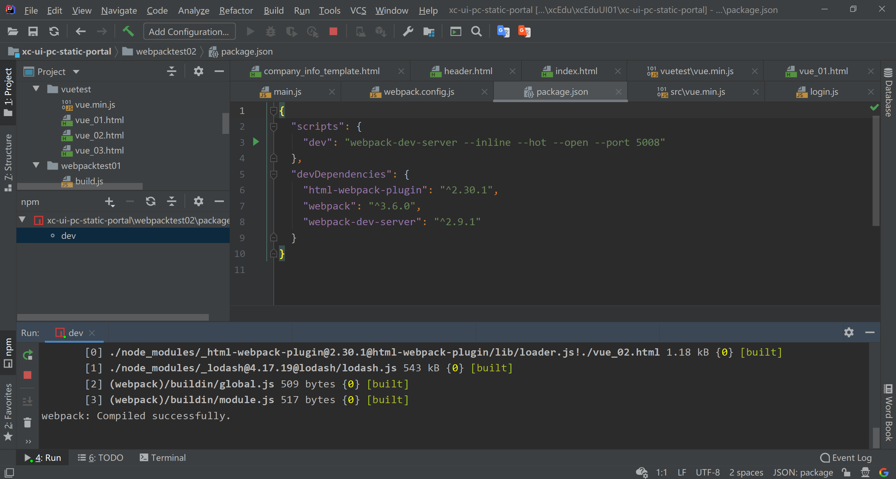

npm run dev 

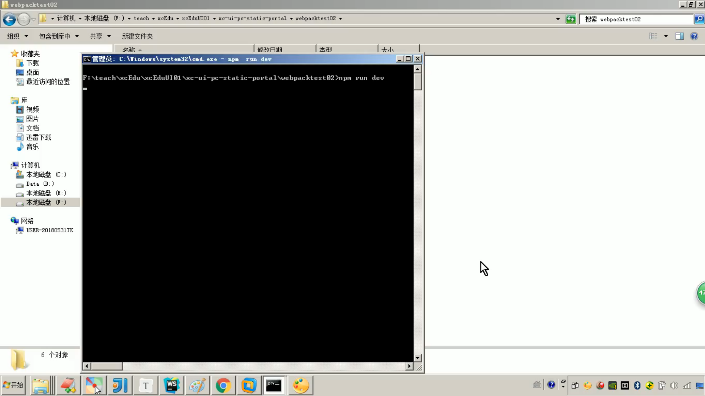

照样运行的

改了会自动刷新的 

打包生成了 

打包文件里面的代码

# debugger 

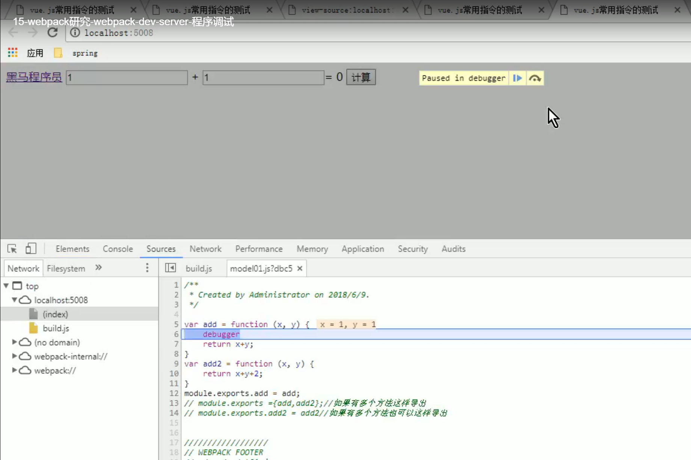

就是一个Debugger

使用debugger进行调试 

# CMS前端工程创建

脚手架

# 学成在线 第2天 讲义-CMS前端开发

# 1 Vue.js与Webpack研究

参考：学成在线-Vue.js与Webpack.pdf

# 2 CMS前端工程创建

## 2.1 导入系统管理前端工程

CMS系统使用Vue-cli脚手架创建， Vue-cli是Vue官方提供的快速构建单页应用的脚手架，github地址：
https://github.com/vuejs/vue-cli（有兴趣的同学可以参考官方指导使用vue-cli创建前端工程），本项目对Vue-cli
创建的工程进行二次封装，下边介绍CMS工程的情况。

### 2.2.1 工程结构

如果我要基于Vue-Cli创建的工程进行开发还需要在它基础上作一些封装，导入课程资料中提供Vue-Cli封装工程。
将课程资料中的xc-ui-pc-sysmanage.7z拷贝到UI工程目录中，并解压，用WebStorm打开xc-ui-pc-sysmanage目
录。
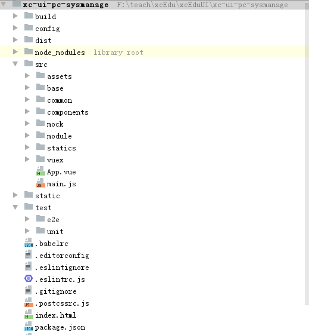

### 2.2.2 package.json

package.json记录了工程所有依赖，及脚本命令：

开发使用：npm run dev
打包使用：npm run build

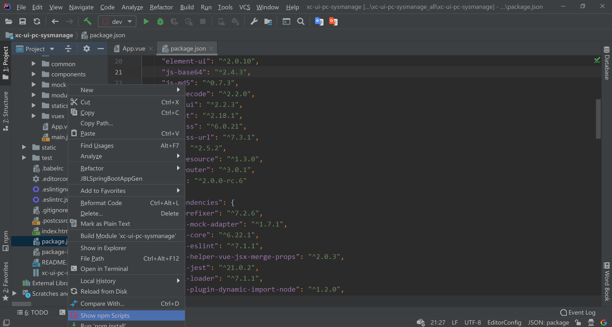

Module build failed: Error: Node Sass does not yet support your current environment: Windows 64-bit with Unsupported runtime (67)
For more information on which environments are supported please see:
https://github.com/sass/node-sass/releases/tag/v4.7.2

最后试成功的版本号是

node -v  10.0

node-sass  4.0

 

解决办法其实很简单，就是sass不支持当前的环境，那么在当前环境重新安装一下就好了

先卸载：（***如果卸载不成功，直接找到node-sass文件夹，删除\***）

> \1. npm uninstall --save node-sass 

再安装

> \2. npm install --save node-sass  (cnpm install --save node-sass  )

问题就解决了

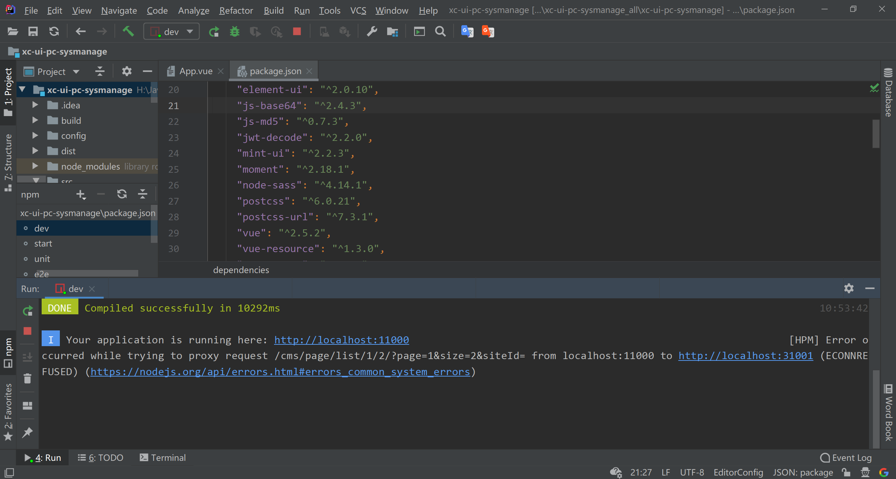

单页应用  缺点  

页面越来越多  加载速度 

SEO    搜索引擎优化 

我被优化了  

抓取不到我们的

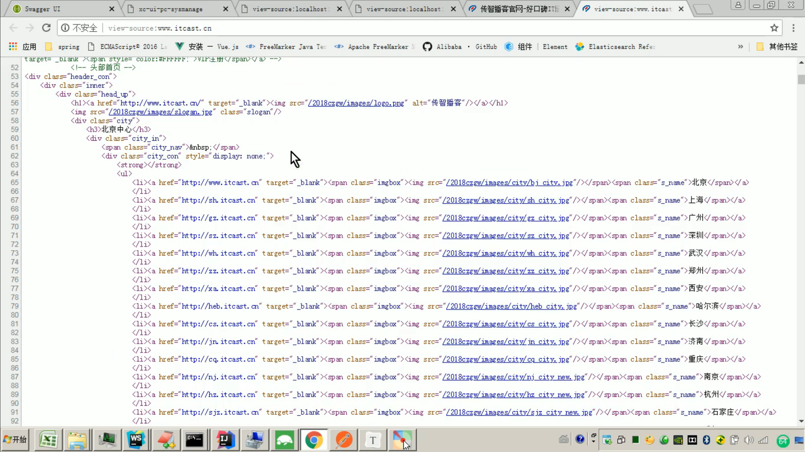

这种页面非常丰富  有利于这个 

单一页面 应用  

SEO 不优好

系统管理中心   你想抓到吗

后台的管理系统  不需要被收录   而且都要登录 才可以 

开发起来非常方便

什么是单页面应用

## 2.2 单页面应用介绍

什么是单页应用？
引用百度百科：

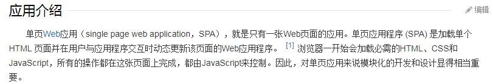

单页面应用的优缺点：
优点：
1、用户操作体验好，用户不用刷新页面，整个交互过程都是通过Ajax来操作。
2、适合前后端分离开发，服务端提供http接口，前端请求http接口获取数据，使用JS进行客户端渲染。
缺点：
1、首页加载慢
单页面应用会将js、 css打包成一个文件，在加载页面显示的时候加载打包文件，如果打包文件较大或者网速慢则
用户体验不好。
2、SEO不友好
SEO（Search Engine Optimization）为搜索引擎优化。它是一种利用搜索引擎的搜索规则来提高网站在搜索引擎
排名的方法。目前各家搜索引擎对JS支持不好，所以使用单页面应用将大大减少搜索引擎对网站的收录。
总结：
本项目的门户、课程介绍不采用单页面应用架构去开发，对于需要用户登录的管理系统采用单页面开发。

# 3 CMS前端页面查询开发

## 3.1 页面原型

3.1.1 创建页面

规范

api  

components

page

router

规范

我的代码量搞上去的

非常不错的

3.1.1 创建页面

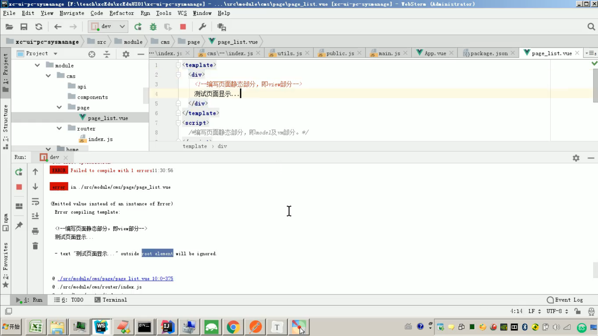

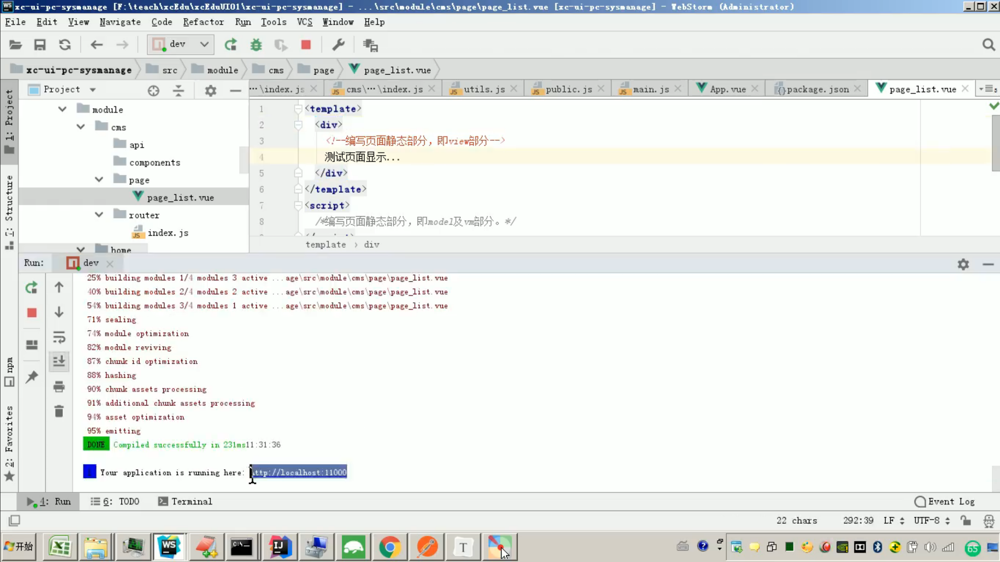

 certificate used to sign the license is not signed by Jetbrains root certificate

### 3.1.1.1 页面结构

## 3.2 Api调用

## 3.3 跨域问题解决

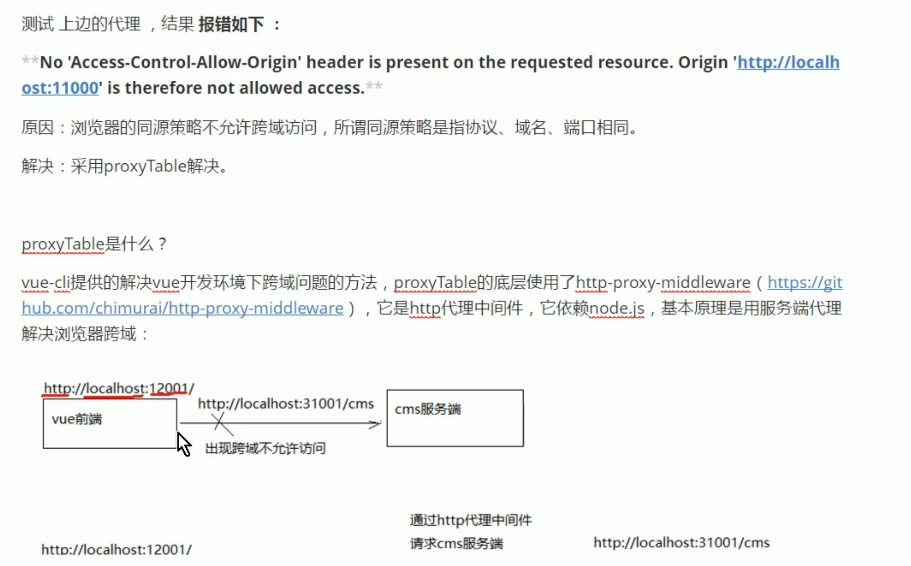

协议 http

域名

端口

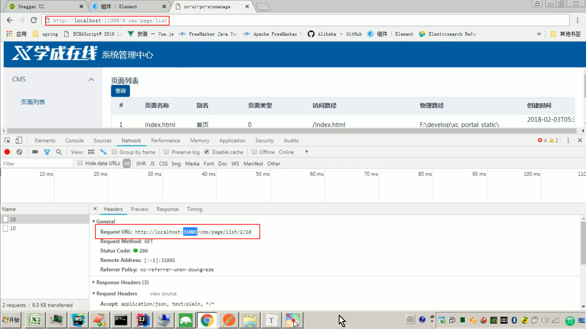

代理

代理中间件

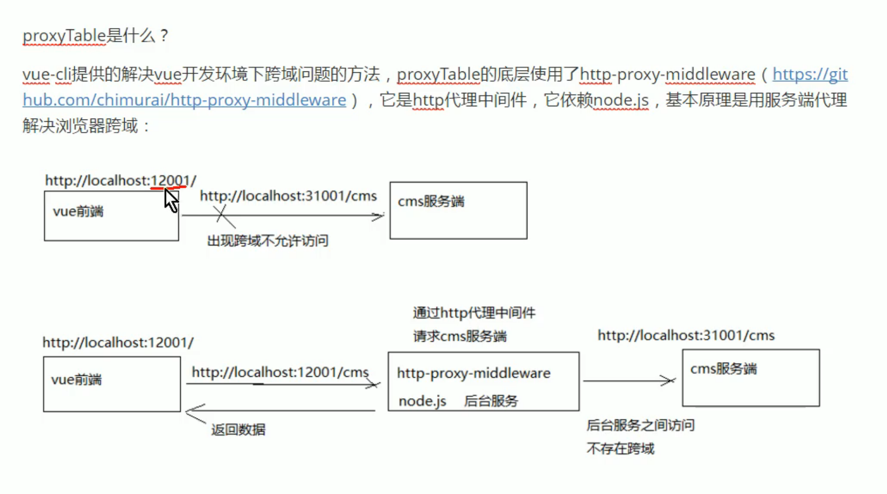

11001

端口

依赖于Node.js   JDK

你去请求  12001/cms   但我想请求31001/cms

代理  转发 

浏览器 去请求   跨域 

服务器   不存在跨域

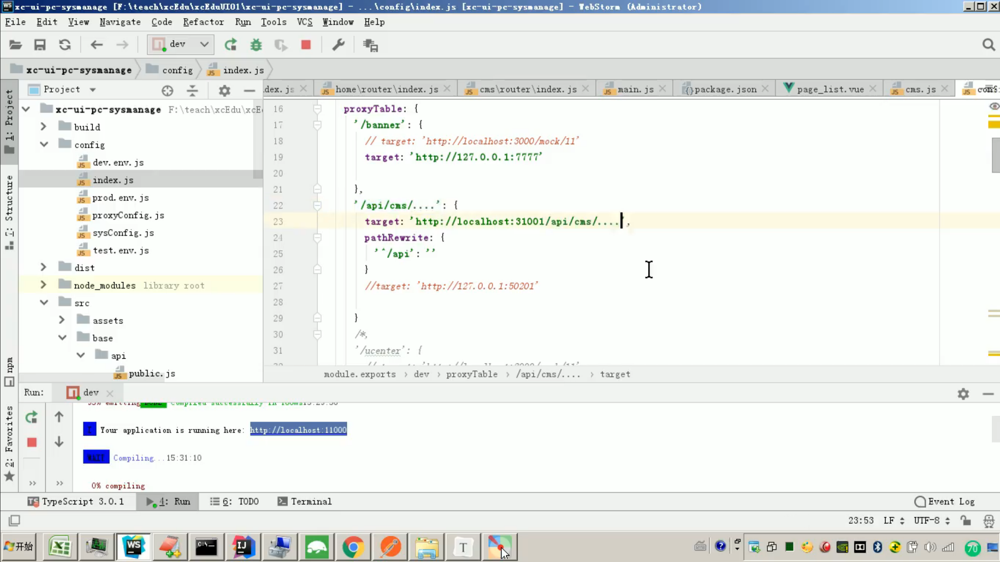

没有 /api

配置的

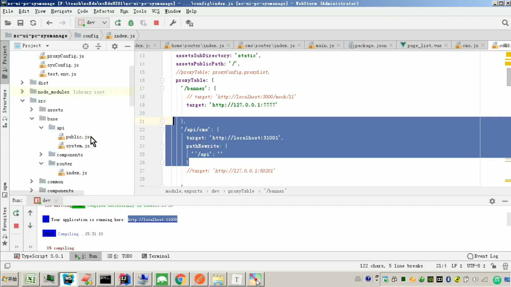

## 3.4 分页查询测试

## 3.5 进入页面立即查询

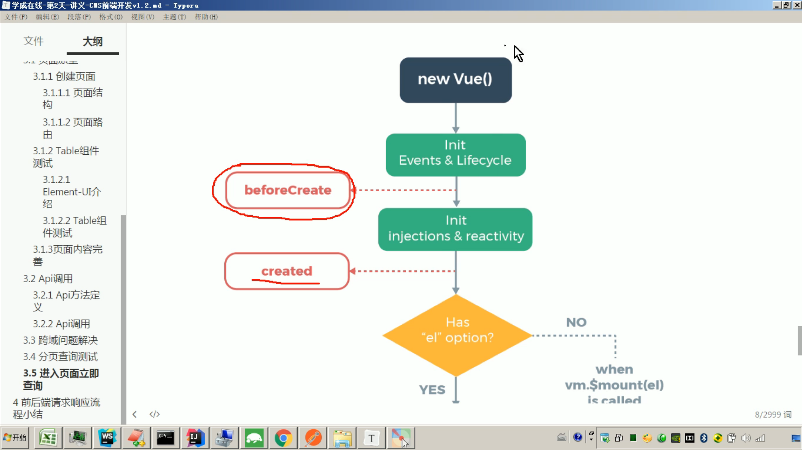

钩子函数 

created 

mounted

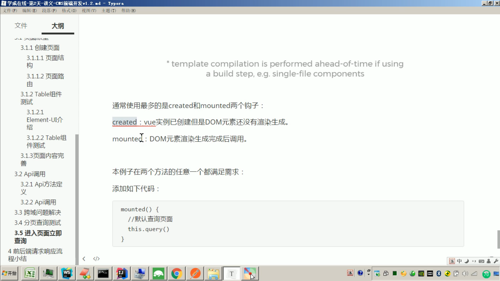

实现进入页面就立即查询 

钩子 

mounted  

# 4 前后端请求响应流程小结

参考 “讲义-->前后端请求响应流程.png”，如下：

1、在浏览器输入前端url
2、前端框架vue.js根据url解析路由，根据路由找到page_list.vue页面
3、首先执行page_list.vue中的钩子方法
4、在钩子方法中调用query方法。
5、在query方法中调用cms.js中的page_list方法
6、cms.js中的page_list方法通过axios请求服务端接口
7、采用proxyTable解决跨域问题，node.js将请求转发到服务端(http://localhost:31001/cms/page/list)
8、服务端处理，将查询结果响应给前端
9、成功响应调用then方法，在then方法中处理响应结果，将查询结果赋值给数据模型中的total和list变量。
10、vue.js通过双向数据绑定将list数据渲染输出。

