# 学成在线 第1天 讲义-项目概述 CMS接口开发

# 项目的功能架构

## 项目背景

受互联网+概念的催化，当今中国在线教育市场的发展可谓是百花齐放、如火如荼。 按照市场领域细分为：学前教
育、K12教育、高等教育、留学教育、职业教育、语言教育、兴趣教育以及综合平台，其中，职业教育和语言教育
的市场优势突出。 根据Analysys易观发布的数据显示，预计2019年中国互联网教育市场交易规模将达到3718亿元
人民币，未来三年互联网教育市场规模保持高速增长。

K12教育 中小学教育

学成在线借鉴了MOOC（大型开放式网络课程，即MOOC（massive open online courses））的设计思想，是一
个提供IT职业课程在线学习的平台，它为即将和已经加入IT领域的技术人才提供在线学习服务，用户通过在线学
习、在线练习、在线考试等学习内容，最终掌握所学的IT技能，并能在工作中熟练应用。

已经加入IT领域的技术人才 

即将加入

博学谷 


功能模块

项目原型

项目的技术架构

技术架构

技术栈

前后端分离 服务器端渲染解决方案

## 功能模块

当前市场的在线教育模式多种多样，包括：B2C、C2C、B2B2C等业务模式，学成在线采用B2B2C业务模式，即向
企业或个人提供在线教育平台提供教学服务，老师和学生通过平台完成整个教学和学习的过程，市场上类似的平台
有：网易云课堂、腾讯课堂等，学成在线的特点是IT职业课程在线教学。


企业或个人提供在线教育平台提供服务

老师和学生通过平台完成整个教学和学习的过程

网易云课堂 腾讯课堂 

IT职业课程在线教学

企业对个人

个人对个人

我是一个老师 


企业 个人 提供在线教育

B2B2C

平台 企业入驻

用户网上学习 

平台模式

学成在线包括门户、学习中心、教学管理中、社交系统、系统管理等功能模块。

门户 

首页 注册/登录 课程搜索 客户服务 职业规划 

专门学习的  

学习中心  

视频点播 我的课程

个人设置  我的订单

学习统计 我的笔记

教学管理中心

媒体 资源  视频 编码 在线播放 

课程管理  媒资管理

订单管理 考试管理

作业管理 统计分析 


社交系统

论坛 问答系统  信息系统 评论系统 ...

教学服务

论坛 问答系统  评论系统

设计系统 最重要的 

评论  质量 


系统管理中心

CMS  分类管理  数据字典  系统参数配置   ...

系统管理员来使用的 

设计 一些 基本的数据字典 

门户  学习中心 教学管理中心 社交系统 系统管理中心 


功能
模块
名称

功能说明

门户在首页、活动页、专题页等页面提供课程学习入口。
学习
中心
学生登录学习中心在线学习课程。
社交
系统
社交系统为老师和学生交流搭建沟通的平台，包括：问答系统、评论系统、论坛等，学生和老师
通过问答系统提问问题、回答问题，通过评论系统对老师授课进行评论。
教学
管理
中心
教师登录教学管理中心进行课程管理、资源管理、考试管理等教学活动。
系统
管理
中心
系统管理员登录系统管理中心进行分类管理、运维管理等功能。


功能说明

门户 在首页、活动页、专题页等页面提供课程学习入口

学习中心 学生登录学习中心在线学习课程

社交系统 社交系统为老师和学生交流搭建沟通的平台

问答系统 论坛系统 论坛等

学生和老师 通过问答系统 提问问题 回答问题

通过评论系统对老师授课进行评论

教学管理中心 教师登录教学管理中心 进程课程管理

资源管理 考试管理等教学活动

系统管理员登录管理中心进行分类管理、运维管理等功能。


## 项目原型

项目原型 进一步了解项目的功能

客户首页

通过项目原型进一步了解项目的功能，包括：门户首页、课程搜索页、在线学习页面、个人中心等参考“项目原型”。


重点了解微服务技术栈：
学成在线服务端基于Spring Boot构建，采用Spring Cloud微服务框架。
持久层：MySQL、MongoDB、Redis、ElasticSearch
数据访问层：使用Spring Data JPA 、Mybatis、Spring Data Mongodb等
业务层：Spring IOC、Aop事务控制、Spring Task任务调度、Feign、Ribbon、Spring AMQP、Spring Data Redis
等。
控制层：Spring MVC、FastJSON、RestTemplate、Spring Security Oauth2+JWT等
微服务治理：Eureka、Zuul、Hystrix、Spring Cloud Config等

# 项目的技术架构

## 技术架构


 

前后端分离架构开发  用户层 UI层 微服务层 数据层  

PC APP  H5 客户端用户提供服务  

技术架构图

技术架构

学成在线采用当前流行的前后端分离架构开发，由用户层、UI层、微服务层、数据层等部分组成，为PC、App、
H5等客户端用户提供服务。下图是系统的技术架构图：

分层的


用户 PC  APP   H5 微信公众号 

CDN 内容分发网络  媒资管理

外部系统接口

微信QQ微博　登录、分享

支付宝　微信　网银　支付　

短信　邮件　微信公众号　点播　　直播　OSS存储　CDN

　

UI层  前端


前端系统  独立的  HTTP协议

UI层

微服务层

前后端分离   有什么好处？


针对XX 写一个小系统   具体的小系统 可以独立部署

好处  前端这一块  不同的用户 使用不同的    界面样式  不同的用户提供不同的用户界面

微服务层 统一一套 供应前端   统一对外 提供服务 

系统的业务扩展  

划分了很多小块  服务的颗粒性？？？  可扩展性

每一块都是独立部署    扩冲 

可维护性

微服务层

数据层 

业务流程举例：
1、用户可以通过pc、手机等客户端访问系统进行在线学习。
2、 系统应用CDN技术，对一些图片、CSS、视频等资源从CDN调度访问。
3、4、对于PC、H5等客户端请求，首先请求UI层，渲染用户界面。
5、客户端UI请求服务层获取进行具体的业务操作。
6、服务层将数据持久化到数据库。

各模块说明如下：

名称 功能描述

用户层  描述了本系统所支持的用户类型 包括 PC用户APP用户 H5用户

PC用户通过浏览器访问系统 

APP用户

H5用户

原来是因为微信集成了移动端阅读器，脱离微信，H5照样可以正常运行，仅仅因为人们习惯了经过朋友圈翻开H5来观看网页。所以，H5并不是微信网页，它是一个更大的概念， 仅仅因为微信巨大的用户群，让H5集中于微信，让人们觉得这个页面就是微信独有的，也让H5和微信朋友圈成为了代名词。

一切的惯例猜测和网上论题引导咱们都证明了，成果全部不建立! 当咱们从新把一切内容放在一同时，你会发现H5它包换了HTML5 的符号标准，运用到了例如 CSS、JS(Java)等多种计算机语言，可以完成多种动效和视听作用，会使用到后端和前端的多种功用，首要在手机端传播，可以跨渠道在PC、平板上阅读等等...

当咱们在这些一切包括的特性上寻觅共性时，咱们得到了一个意外的答案，H5不是 HTML5、不是微信网页、不是移动 PPT。相反，从某种含义上来说，它是这些东西的母级，H5所指的就是移动网页自身，它可以包括一切这些分支!


一切的惯例猜测和网上论题引导咱们都证明了，成果全部不建立! 当咱们从新把一切内容放在一同时，你会发现H5它包换了HTML5 的符号标准，运用到了例如 CSS、JS(Java)等多种计算机语言，可以完成多种动效和视听作用，会使用到后端和前端的多种功用，首要在手机端传播，可以跨渠道在PC、平板上阅读等等...

当咱们在这些一切包括的特性上寻觅共性时，咱们得到了一个意外的答案，H5不是 HTML5、不是微信网页、不是移动 PPT。相反，从某种含义上来说，它是这些东西的母级，H5所指的就是移动网页自身，它可以包括一切这些分支!


H5又是什么鬼？HyperText Mark-up Language 5.0  → HTML5 → H5当然，HTML5是英文规范简称，但H5就完全是国内特定人群的叫法。目前的事实是，H5已经成为微信HTML5网页的专有名词。以现在的定义，H5特指基于HTML5技术的交互网页应用，以商业用途为主。以下列举一些H5商业应用场景，供参考：1、微信H5目前HTML5应用最多的形式，因为移动端完全不支持Flash，而HTML5在动画展现和交互上基本可以满足企业需求，同时也因为微信的大力支持，HTML5网页作为一种营销的形式被广泛应用，营销圈简称H5。

2、交互视频

HTML5对于多媒体的支持，让丰富的视频应用成为可能。iH5的交互视频技术可以将视频、动画、多屏通信等有机结合，极大地丰富了内容的表达方式。

3、户外大屏交互解决方案

传统的户外大屏交互需要复杂的软件实施，不仅成本极高，并且灵活度低。基于HTML5技术，不需软件实施，内容更新方便快捷。iH5的智墙技术提供了户外大屏交互的解决方案，支持多屏拼接和多点触摸。

4、PC HTML5广告

即苹果浏览器不支持Flash之后，谷歌浏览器已在2015年9月不再支持Flash自动播放，在可预见的未来，HTML5将取代Flash作为网页动画广告的首选。

H5是一种用在微信上的PPT。

全世界缺货

对啊，就是幻灯片效果。然后各种浮夸的文字图片、音乐一起上了，不知道为啥能火成这样。难道是因为小而美？？？


不管这句话对不对，先赞一个解解气。每当有人用“你会h5吗？”来向我技术发难的时候，我都想反问一句：“你理解的h5是什么？？？？？？？”

怒赞！！！一听问这个我就想呵呵 我的日常工作极少极少用得上这个 我不明白为什么我必须要会这个东西


手机浏览器吗?


重点掌握 

微服务层  数据层

1 用户层
用户层描述了本系统所支持的用户类型包括：pc用户、app用户、h5用户。pc用户通过
浏览器访问系统、app用户通过android、ios手机访问系统，H5用户通过h5页面访问系
统。
2 CDN
CDN全称Content Delivery Network，即内容分发网络，本系统所有静态资源全部通过
CDN加速来提高访问速度。系统静态资源包括：html页面、js文件、css文件、image图
片、pdf和ppt及doc教学文档、video视频等。

CDN 内容分发网络 

静态资源 通过CDN加速来提高访问速度 系统静态资源 包括 html页面 js文件 css文件

image图片 pdf和ppt及 doc教学文档 video视频

3
负载均
衡
系统的CDN层、UI层、服务层及数据层均设置了负载均衡服务，上图仅在UI层前边标注
了负载均衡。 每一层的负载均衡会根据系统的需求来确定负载均衡器的类型，系统支持
4层负载均衡+7层负载均衡结合的方式，4层负载均衡是指在网络传输层进行流程转发，
根据IP和端口进行转发，7层负载均衡完成HTTP协议负载均衡及反向代理的功能，根据
url进行请求转发。

4层负载均衡 网络传输层进行流程转发  IP和端口进行转发

7层负载均衡  完成HTTP协议负载均衡及后向代理的功能 根据url进行请求转发 

4 UI层
UI层描述了系统向pc用户、app用户、h5用户提供的产品界面。根据系统功能模块特点
确定了UI层包括如下产品界面类型： 1）面向pc用户的门户系统、学习中心系统、教学
管理系统、系统管理中心。 2）面向h5用户的门户系统、学习中心系统。 3）面向app
用户的门户系统、学习中心系统未在上图标注，在app项目中有详细说明。
5
微服务
层
微服务层将系统服务分类三类：前端服务、后端服务及系统服务。 前端服务：主要为学
习用户提供学习服务。 后端服务：主要为管理用户提供教学管理服务。 系统服务：公
共服务，为系统的所有微服务提供公共服务功能。 服务网关：提供服务路由、负载均
衡、认证授权等服务。

前端 后端 系统  服务 

主要为学习用户提供学习服务  后端服务 主要为管理用户提供教学管理服务

系统服务  公共服务 

为系统的所有微服务 提供公共服务功能

服务网关  服务路由 负载均衡 认证授权 

6 数据层
数据层描述了系统的数据存储的内容类型，持久化的业务数据使用MySQL和MongoDB
保存，其中MongoDB中主要保存系统日志信息。 消息队列：存储系统服务间通信的消
息，本身提供消息存取服务，与微服务层的系统服务连接。 索引库：存储课程信息的索
引信息，本身提供索引维护及搜索的服务，与微服务层的系统服务连接。 缓存：作为系
统的缓存服务，存储课程信息、分类信息、用户信息等，与微服务层的所有服务连接。
文件存储：提供系统静态资源文件的分布式存储服务，文件存储服务器作为CDN服务器
的数据来源，CDN上的静态资源将最终在文件存储服务器上保存多份。 流媒体服务：
作为流媒体服务器，存储所有的流媒体文件。

数据层 描述了系统的数据存储的内容类型 

MongoDB  主要保存系统日志信息  

消息队列 存储系统服务间通信的消息 消息存取服务 

缓存 系统的缓存服务  存储课消息 分类信息 用户信息 

文件存储服务器 CDN服务器

流媒体服务器 存储所有的流媒体文件  

7
外部系
统接口
1）微信、QQ、微博登录接口，本系统和微信、QQ、微博系统对接，用户输入微信、
QQ、微博的账号和密码即可登录本系统。 2）微信、QQ、微博分享接口，本系统和微
信、QQ、微博系统对接，可直接将本系统的课程资源信息分享到微信、QQ、微博。
3）支付宝、微信、网银支付接口，本系统提供支付宝、微信、网银三种支付接口。
4）短信接口，本系统与第三方平台对接短信发送接口。 5）邮件接口，本系统需要连
接第三方的smpt邮件服务器对外发送电子邮件。 6）微信公众号，本系统与微信公众号
平台接口，用户通过微信公众号访问H5页面。 7）点播、直播，前期视频点播与直播采
用第三方服务方式，本系统与第三方点、直播服务对接，对外提供视频点播与直播服
务。 8）OSS存储 ，前期静态资源文件的存储采用第三方服务方式，本系统与第三方提
供的OSS存储服务对接，将系统的静态资源文件存储到第三方提供的OSS存储服务器
上。 9）CDN，本系统与第三方CDN服务对接，使用CDN加速服务来提高本系统的访问
速度。

序
号
名称功能描述
8 DevOps
DevOps（英文Development和Operations的组合）是一组过程、方法与系统的统称，
用于促进开发（应用程序/软件工程）、技术运营和质量保障（QA）部门之间的沟通、
协作与整合。本项目供了许多开发、运营、维护支撑的系统，包括： Eureka服务治理
中心：提供服务治理服务，包括：服务注册、服务获取等。 Spring Cloud Config服务
配置管理中心：提供服务配置管理服务，包括：配置文件更新、配置文件下发等。
Hystrix Dashboard服务熔断监控：监控熔断的请求响应时间、成功率等 。 Zipkin服务
追踪监控：监控服务调用链路健康情况。 Jenkins持续集成服务：提供系统持续集成服
务。 Git/GitLab代码管理服务:提供git代码管理服务。 ELK日志分析服务:提供elk日志分
析服务，包括系统运行日志分析、告警服务。 Docker容器化部署服务：将本系统所有
服务采用容器化部署方式。 Maven项目管理工具：提供管理项目所有的Java包依赖、项
目工程打包服务。

DevOps

过程 方法 系统 

促进开发 技术运营  质量保障 QA 沟通 协作 整合 

Eureka服务治理中心：提供服务治理服务，包括：服务注册、服务获取等。

Spring Cloud Config服务配置管理中心：提供服务配置管理服务，包括：配置文件更新、配置文件下发等。
Hystrix Dashboard服务熔断监控：监控熔断的请求响应时间、成功率等 。

 Zipkin服务追踪监控：监控服务调用链路健康情况。 

Jenkins持续集成服务：提供系统持续集成服务。 

Git/GitLab代码管理服务:提供git代码管理服务。 

ELK日志分析服务:提供elk日志分析服务，包括系统运行日志分析、告警服务。 

Docker容器化部署服务：将本系统所有服务采用容器化部署方式。

Maven项目管理工具：提供管理项目所有的Java包依赖、项目工程打包服务。

## 技术栈


重点了解微服务技术栈：
学成在线服务端基于Spring Boot构建，采用Spring Cloud微服务框架。
持久层：MySQL、MongoDB、Redis、ElasticSearch
数据访问层：使用Spring Data JPA 、Mybatis、Spring Data Mongodb等
业务层：Spring IOC、Aop事务控制、Spring Task任务调度、Feign、Ribbon、Spring AMQP、Spring Data Redis
等。
控制层：Spring MVC、FastJSON、RestTemplate、Spring Security Oauth2+JWT等
微服务治理：Eureka、Zuul、Hystrix、Spring Cloud Config等

微服务技术栈

学成在线服务端基于Spring Boot构建 采用SpringCloud微服务框架

持久层  MySQL MongoDB Redis  ElasticSearch


fastDFS

流媒体 

技术栈 

重点  微服务这  基于SpringBoot这部开的  

Spring全家桶

非常方便开发


## 开发步骤

项目是基于前后端分离的架构进行开发，前后端分离架构总体上包括前端和服务端，通常是多人协作并行开发，开
发步骤如下：
1、需求分析
梳理用户的需求，分析业务流程
2、接口定义
根据需求分析定义接口
3、服务端和前端并行开发
依据接口进行服务端接口开发。
前端开发用户操作界面，并请求服务端接口完成业务处理。
4、前后端集成测试
最终前端调用服务端接口完成业务。

1、需求分析 2、接口定义  3、服务端和前端并行开发 4、前后端集成测试

单元测试  服务端  开发一个微服务  基于这个接口 

集成测试

定义接口

项目是基于前后端分离的架构进行开发 

前端 服务端

多人协作并行开发 


接口开发

集成测试


# CMS需求分析

## 什么是CMS

1、CMS是什么 ？
CMS （Content Management System）即内容管理系统，不同的项目对CMS的定位不同，比如：一个在线教育网
站，有些公司认为CMS系统是对所有的课程资源进行管理，而在早期网站刚开始盛行时很多公司的业务是网站制
作，当时对CMS的定位是创建网站，即对网站的页面、图片等静态资源进行管理。
2、CMS有哪些类型？
上边也谈到每个公司对每个项目的CMS定位不同，CMS基本上分为：针对后台数据内容的管理、针对前端页面的
管理、针对样式风格的管理等 。比如：一个给企业做网站的公司，其CMS系统主要是网站页面管理及样式风格的
管理。

CMS 内容管理系统 

不同的类型  

3、本项目CMS的定位是什么？
本项目作为一个大型的在线教育平台，对CMS系统的定位是对各各网站（子站点）页面的管理，主要管理由于运营
需要而经常变动的页面，从而实现根据运营需要快速进行页面开发、上线的需求。


换一下  轮播图    直接换就不行了  

运营的需求 改图片   页面的风格  

CMS解决  

对各网站的页面来管理   HTML   很多小页面

页面来管理出来   页面修改 自动发布   不需要前端来改页面

各个网站 很多网站

门户  小站点   

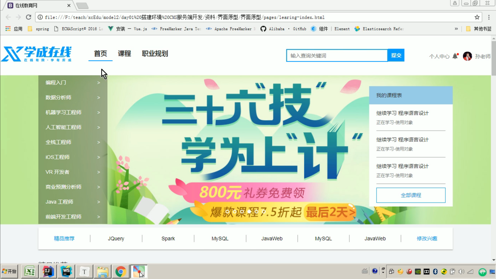

很多很多  站点组成  网站

变动的页面   及时变化


各个子网站   页面的需求 改变很多 

门户


页面管理 采用什么需求变化  

 

## 静态门户工程搭建

本项目CMS是对页面进行管理，对页面如何进行管理呢？我们首先搭建学成网的静态门户工程，根据门户的页面结
构来分析页面的管理方案。
门户，是一个网站的入口，一般网站都有一个对外的门户，学成在线门户效果图如下：

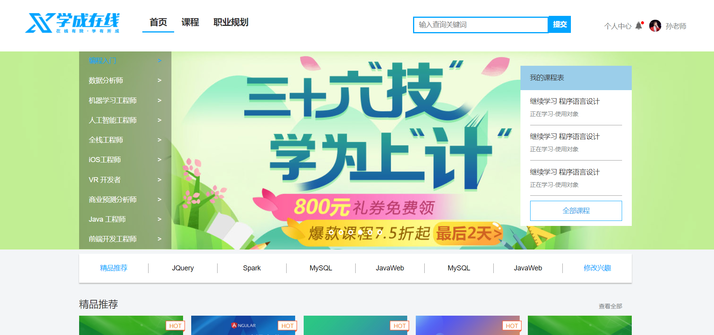


导入门户工程


1、安装WebStorm
参考“WebStorm安装手册.md”安装WebStorm-2018.2.3.exe
2、安装Nginx
下载nginx：http://nginx.org/en/download.html
本教程下载nginx-1.14.0.zip(http://nginx.org/download/nginx-1.14.0.zip)
解压nginx-1.14.0.zip到自己的计算机，双击nginx.exe即可运行。
访问 ：http://localhost

安装Nginx

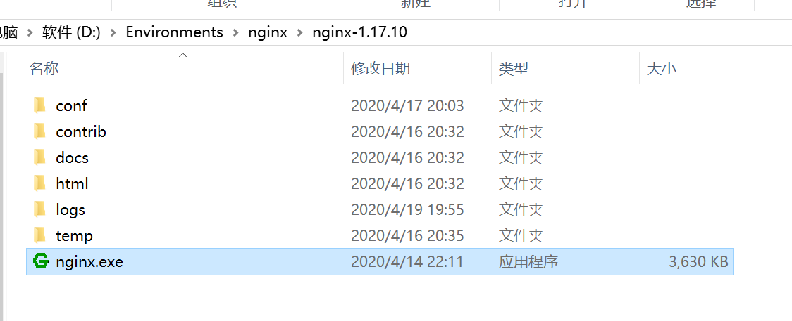

Nginx启动  

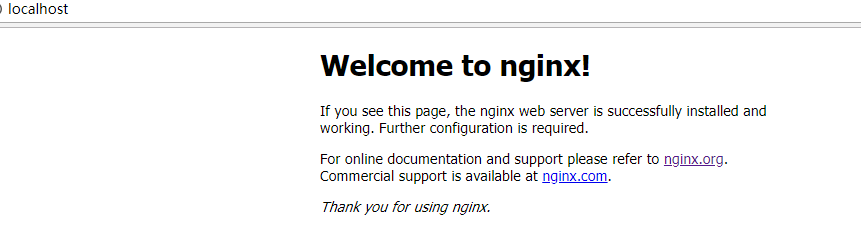

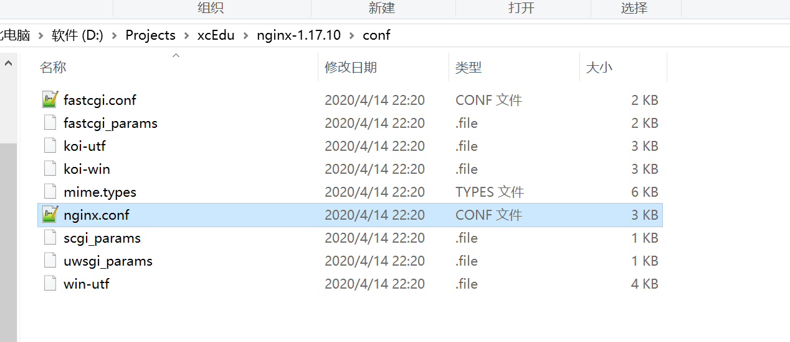


3、导入门户工程
将课程资料中的门户工程拷贝到代码目录。
使用WebStorm打开门户工程目录，目录的结构如下，后期会根据开发的推进进行扩充。

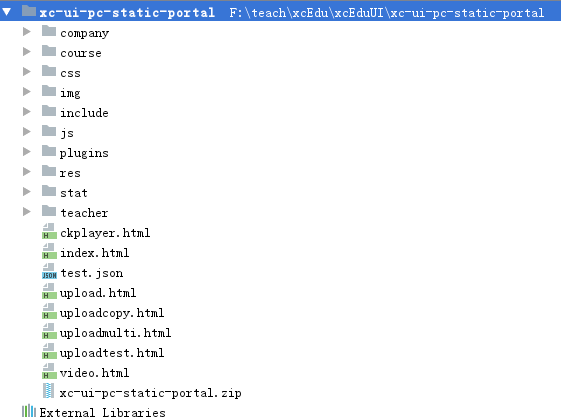

配置虚拟主机

在nginx中配置虚拟主机：

```nginx
server{
listen 80;
server_name www.xuecheng.com;
ssi on;
ssi_silent_errors on;
location / {
alias F:/teach/xcEdu/xcEduUI/xc‐ui‐pc‐static‐portal/;
index index.html;
}
}
```

F:/teach/xcEdu/xcEduUI/xc-ui-pc-static-portal/ 本目录即为门户的主目录。

```nginx
   server {
        listen       80;
        #server_name  localhost;
		#server_name www.liuawen.cn;
        #charset koi8-r;
		server_name www.xuecheng.com;	
        #access_log  logs/host.access.log  main;
		ssi on;
		ssi_silent_errors on;

        location / {
            #root   html;
			alias D:/Projects/xcEdu/xcEduUI01/xc-ui-pc-static-portal/;
            index  index.html index.htm;
        }
}
```

一直404出不来也页面  原来是 nginx.exe  太多了 没有删除

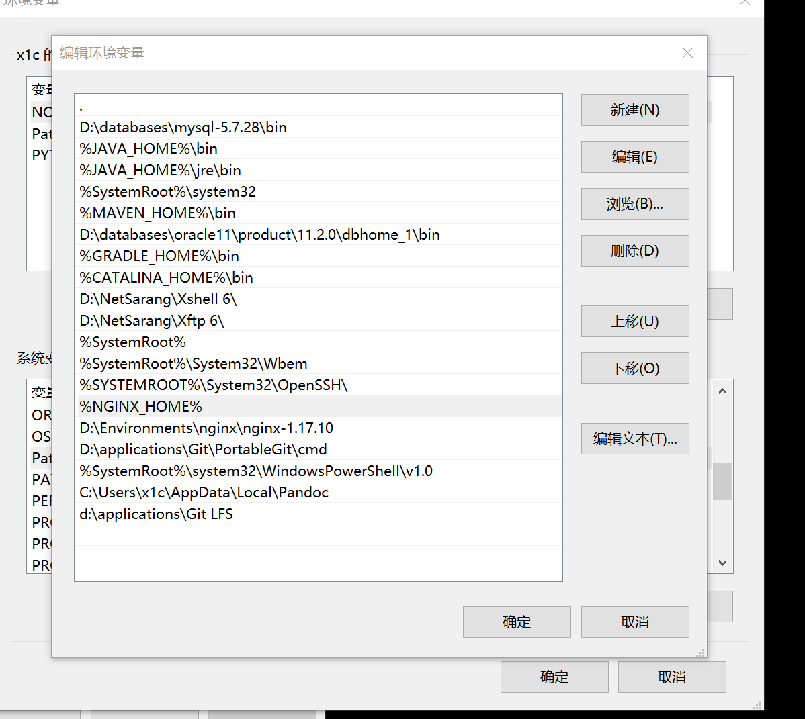

nginx home 


http://127.0.0.1/

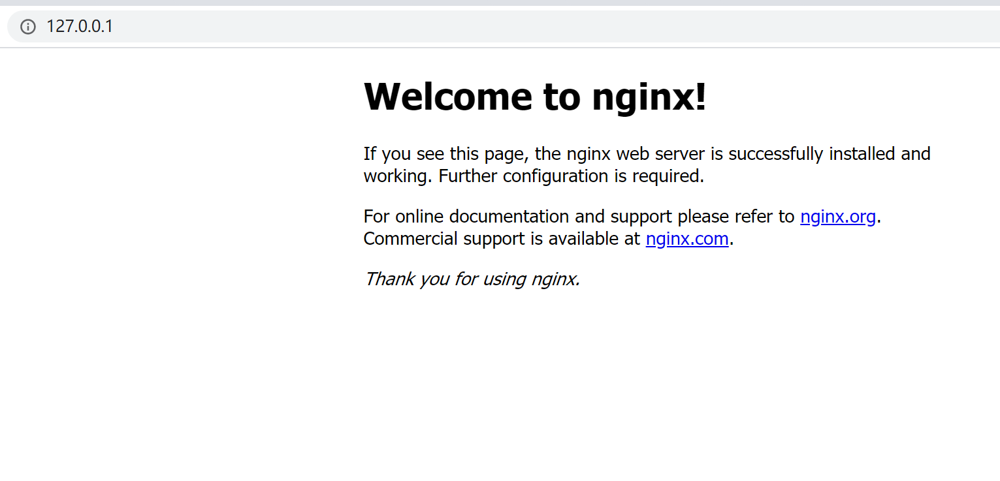


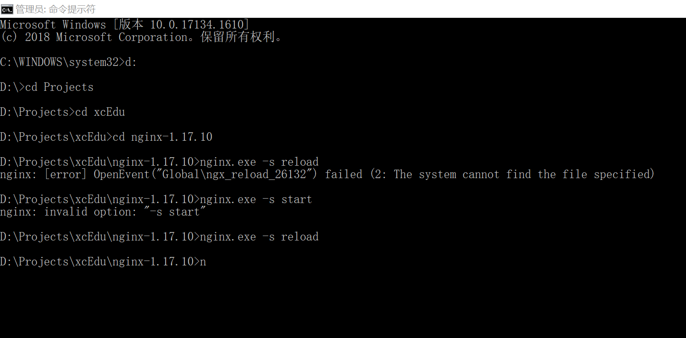

nginx: [error] OpenEvent("Global\ngx_reload_26132") failed (2: The system cannot find the file specified)

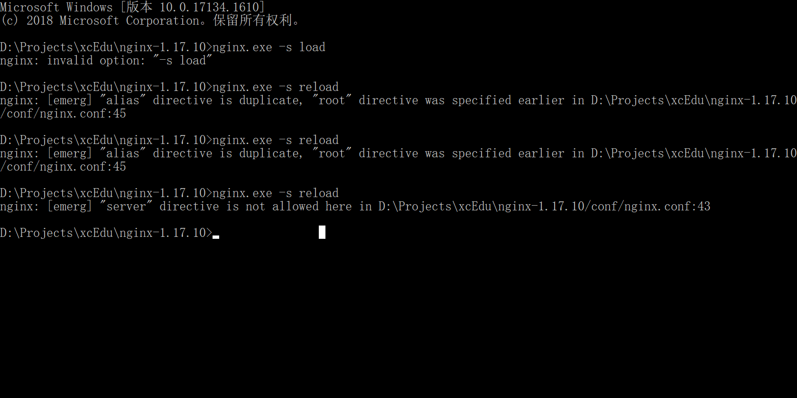


先这里  本地  再去解析的  

127.0.0.1 www.xuecheng.com

```
127.0.0.1 localhost
127.0.0.1 www.xuecheng.com
```


C:\Windows\System32\drivers\etc

ect hosts


域名来访问 我想

D:\Projects\xcEdu\xcEduUI01\xc-ui-pc-static-portal

反斜杠 

```xml
 server {
        listen       80;
        #server_name  localhost;
	#server_name www.liuawen.cn;
        #charset koi8-r;

        #access_log  logs/host.access.log  main;

        location / {
            root   html;
	    alias D:/Projects/xcEdu/xcEduUI01/xc-ui-pc-static-portal;
            index  index.html index.htm;
        }
}
```


5、配置hosts文件
本教程的开发环境使用Windows 7，修改C:\Windows\System32\drivers\etc\hosts文件

```
127.0.0.1 www.xuecheng.com
```

进入浏览器，输入http://www.xuecheng.com

门户跑起来


## SSI服务端包含技术

本节分析首页的管理方案。
1、页面内容多如何管理？
将页面拆分成一个一个的小页面，通过cms去管理这些小页面，当要更改部分页面内容时只需要更改具体某个小页
面即可。
2、页面拆出来怎么样通过web服务浏览呢？
使用web服务(例如nginx)的SSI技术，将多个子页面合并渲染输出。
3、SSI是什么？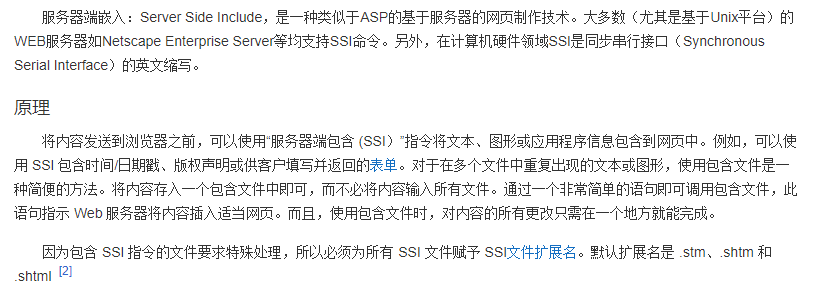

ssi包含类似于jsp页面中的incluce指令，ssi是在web服务端将include指定 的页面包含在网页中，渲染html网页响
应给客户端 。nginx、apache等多数web容器都支持SSI指令。
ssi指令如下：

```
<!‐‐#include virtual="/../....html"‐‐>
```

4、将首页拆分成

```
index.html：首页主体内容
include/header.html：头部区域
include/index_banner.html：轮播图
include/index_category.html：左侧列表导航
include/footer.html：页尾
```

5、在nginx虚拟主机中开通SSI

```
server{
listen 80;
server_name www.xuecheng.com;
ssi on;
ssi_silent_errors on;
......
```

ssi的配置参数如下： ssi on： 开启ssi支持 ssi_silent_errors on：默认为off，设置为on则在处理SSI文件出错时不
输出错误信息 ssi_types：默认为 ssi_types text/html，如果需要支持shtml（服务器执行脚本，类似于jsp）则需
要设置为ssi_types text/shtml
6、测试
去掉某个#include查看页面效果。


## CMS页面管理需求

1、这些页面的管理流程是什么？
1）创建站点：
一个网站有很多子站点，比如：学成在线有主门户、学习中心、问答系统等子站点。具体的哪个页面是归属于具体
的站点，所以要管理页面，先要管理页面所属的站点。

2）创建模板：
页面如何创建呢？比如电商网站的商品详情页面，每个页面的内容布局、板式是相同的，不同的只是内容，这个页
面的布局、板式就是页面模板，模板+数据就组成一个完整的页面，最终要创建一个页面文件需要先定义此页面的
模板，最终拿到页面的数据再结合模板就拼装成一个完整的页面。

3）创建页面：
创建页面是指填写页面的基本信息，如：页面的名称、页面的url地址等。
4）页面预览：
页面预览是页面发布前的一项工作，页面预览使用静态化技术根据页面模板和数据生成页面内容，并通过浏览器预
览页面。页面发布前进行页面预览的目是为了保证页面发布后的正确性。
5）页面发布：
使用计算机技术将页面发送到页面所在站点的服务器，页面发布成功就可以通过浏览器来访问了。
2、本项目要实现什么样的功能？

1）页面管理
管理员在后台添加、修改、删除页面信息
2）页面预览
管理员通过页面预览功能预览页面发布后的效果。
3）页面发布
管理员通过页面发布功能将页面发布到远程门户服务器。
页面发布成功，用户即可在浏览器浏览到最新发布的页面，整个页面添加、发布的过程由于软件自动执行，无需人
工登录服务器操作。

