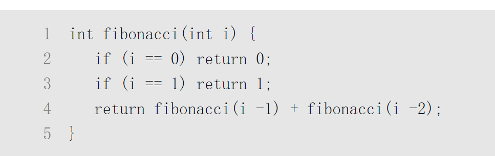
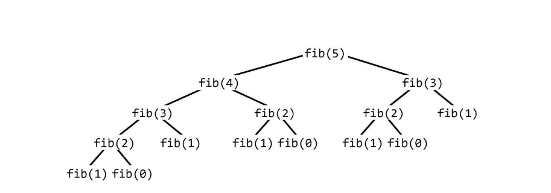
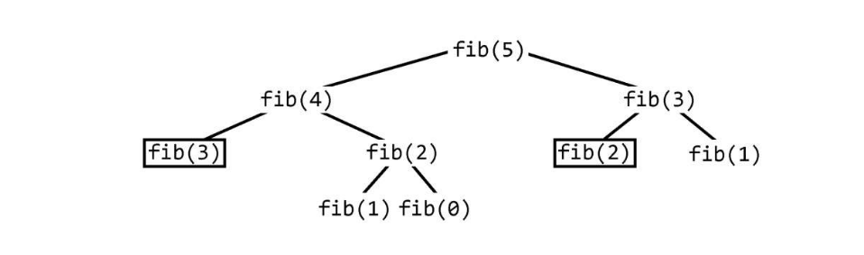
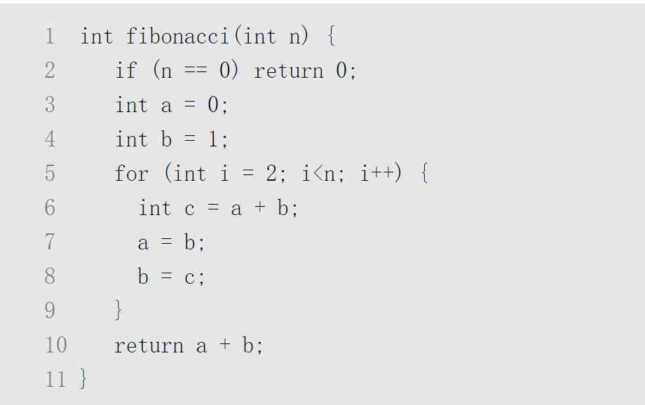
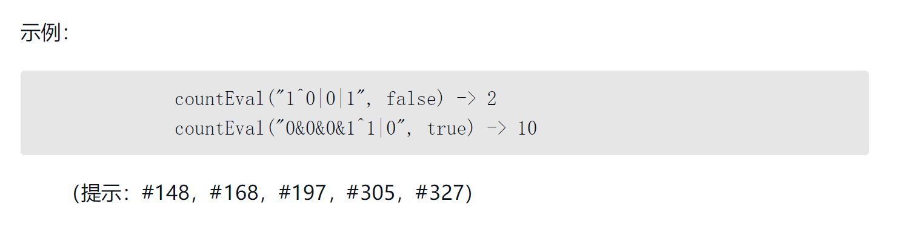

# 第9章 面试题目

请登录我们的网站（http://www.CrackingTheCodingInterview.com），下载完整的题目答案，贡献或查看用其他语言编写的解决方案，与其他读者一起讨论书中的面试题目，提交问题，报告错误，查看本书勘误表，或者寻求其他建议。

# 递归与动态规划

尽管递归问题花样繁多，但题型大都类似。问题属不属于递归问题，就看它是否能分解为子问题。

能否分解为子问题   题型大都类似   递归问题 

当你听到问题的开头是这样的：“设计一个算法计算第n个……”“列出前n个……”“实现一个方法，计算所有……”等，那么这基本上就是递归问题。****

设计一个算法计算第n个 列出前n个 实现一个方法  计算所有的  

小贴士：在我的教学生涯中，求职者对递归问题的直觉精准度通常只有50%。所以我们可以凭直觉判断出一半的递归问题。但是不要单凭直觉，即使你觉得它是递归问题，也不妨从另一个角度看看这个问题。毕竟有一半可能你是错的。

50 我是对的 50  我是错的

熟能生巧！练习得越多，就越容易辨认出递归问题。

联系 联系  练习得越多  越容易辨认出递归问题 

## 解题思路

根据递归的定义，递归的解就是基于子问题的解构建的。通常只要在f(n-1)的解中加入、移除某些东西或者稍作修改就能算出f(n)。而在其他情况下，你可能要分别计算每部分的解，然后合并成最后结果。

递归的定义   递归的解就是基于子问题的解构建的  

f(n-1)的解中加入  移除某些东西  稍作修改就能算法f(n) 

分别计算每部分的解  合并成最后结果

将问题分解为子问题的方式多种多样。其中最常用的三种就是自底向上、自上而下和数据分割。

问题分解为子问题的方法多种多样 

自底向上 自上而下 数据分割 

### 自底向上的递归

自底向上的递归往往最为直观。我们从解决问题的简单情况开始，比如，列表中只有一个元素时。然后再解决有2个元素、3个元素的情况，以此类推。关键在于，如何基于上一种情况的答案（或者前面所有情况）得出后一种情况的解。

自底向上的递归  最为直观 

解决问题的简单情况开始 

自底向上的递归  最为直观  我们从解决问题的简单情况开始 

列表中

前一个情况的答案   得出后一种情况的解

### 自上而下的递归

自上而下的递归比较抽象，可能会较为复杂。但有时这是思考某些问题的最佳方式。遇到这类问题时，试着把变量为N的情况分解成子问题的解。但要注意：分解的子问题间是否有重叠。

自上而下的递归 

递归比较抽象 可能会较为复杂  

有时这里思考某些问题的最佳方式  

遇到 这类问题时  试着把变量为N的情况分解成子问题的解

这是思考某些问题的最佳方式  遇到这类问题时 

尝试 

### 数据分割的递归

除了自底向上和自上而下，有时还需要将数据集分成两半。例如，用数据分割的递归法实现二分查找。在一个排序的数组中寻找某个元素时，我们首先弄清数组的哪一半包含该元素，然后在这一半中递归寻找该元素。归并排序也是一个“数据分割”的递归。我们排序数组的每一半，之后将其合并。

自底向上 和 自上而下  数据集分成两半 

递归法  实现 二分查找   

## 递归与迭代

递归算法极其耗空间。每次递归调用都会增加一层新的方法入栈，简而言之，如果递归深度为n，那么最少占用O(n)的空间。鉴于此，用迭代实现递归算法往往更好。所有的递归都可以用迭代实现，只不过有时会让代码超级复杂。所以有了递归算法之后，不要急于实现。先问问自己用迭代实现难不难，也可以和面试官讨论该如何权衡。

递归算法  极其耗空间 每次递归调用都会增加一层新的方法入栈  

## 动态规划及记忆法

人们对于动态规划问题的恐惧有些小题大做了，根本没必要对此提心吊胆。实际上，一旦掌握了其中窍门，那些问题对你而言不过是小菜一碟。通常来说，动态规划就是使用递归算法发现重叠子问题（也就是重复的调用）。然后你可以缓存结果以备不时之需。

除此之外，你还可以研究递归调用的模式，实现其中重复的部分。这里仍然可以“缓存”中间结果。

术语提示：有些人把自上而下的动态规划称为“记忆模式”，他们认为只有自底向上的才可称为“动态规划”。

本书不作这样的区分，两者都可称为动态规划。动态规划的一个简单例子就是计算第n项斐波那契数列。一种处理这类问题好方法就是实现一个常规的递归解法，并增加缓存。

斐波那契数列

让我们遍历一种解法，计算第n项斐波那契数列。

• 递归

我们先用递归实现。感觉很容易，对吧？

上述代码的运行时间是多少？仔细想一想。如果你想说O(n)或者O(n2)（这么想的大有人在），再好好想一想。深入思考下代码执行路径是什么样子。对于此问题及很多其他递归问题而言，把代码执行路径画成一棵树（也叫递归树）会让人更易理解。

可以观察到，叶节点全都是fib(1)和fib(0)，也就是动态规划中的基线条件。树中节点的总数代表运行时间，因为每个节点在递归调用之外的工作只占用O(1)的时间。因此，运行时间也等于调用的次数。

记住这个技巧，总会派上用场的。画递归调用树可以很好地用来计算递归算法运行时间。

这棵树有多少节点？在到基线条件（叶节点）之前，每个节点分叉2次，即有2个孩子节点。从根节点开始，每个节点都有2个孩子节点，每个孩子节点又有2个孩子节点（所以在第3层有4个节点），以此类推。如果树的深度为n，那么大概有O(2n)个节点，也就是说运行时间大约为O(2n)。

实际上，要比O(2n)略好一些。仔细观察就能发现，右子树总是比左子树小（除了叶节点和其父节点）。如果左右子树大小相同，运行时间就是O(2n)。但显然不是，真实的运行时间接近O(1.6n)。不过说其运行时间是O(2n)严格来讲也不算错，因为O(2n)描述了运行时间的上界（见6.2.1节）。无论如何，运行时间仍是指数级的。

如果在一台计算机上实现该算法，随着n的增大，运行秒数会呈指数级增长。如下图所示。

我们应该找到一种优化方法。• 自上而下的动态规划（记忆法）回头看看这棵递归树。你看到重复节点了吗？重复节点非常多。其中fib(3)就出现了2次，fib(2)甚至出现了3次。为什么每次计算都要重新开始呢？

实际上调用fib(n)时，调用次数不该超过O(n)。原因很简单，在调用fib时所有可能的值一共也就O(n)个。我们只需缓存每次计算fib(i)的结果，以备后续使用。这也是称其为记忆法的原因所在。只要对上面的函数稍作修改，就可以将时间复杂度优化为O(n)。具体做法就是将每次调用fibonacci(i)的结果“缓存”起来。

在一般电脑上，之前的递归函数生成第50项斐波那契数列用时可能超过1分钟，而使用动态规划方法生成第10000项斐波那契数列用时甚至不到几毫秒。当然，若用上面这段代码，int变量不久就会溢出。现在这棵递归树应该长下面这样（黑框代表调用时立即就能返回）。

现在树上有多少节点？可以观察到树中节点是笔直朝下延伸的，直到深度大约为n。这条线上的节点都只有一个另外的孩子节点，树的总节点大约为2n。运行时间就是O(n)。通常可以把这棵树想象成下面这样。

虽然递归实际调用链不长这样，但是扩展下一个节点得到一棵更宽的树比向下扩展得到更深的树更重要（这就像广度优先先于深度优先）。这样可以更容易地计算出树的节点数。你唯一要做的就是把延伸的节点和缓存结果的节点做相应的改变。如果你在计算动态规划的运行时间的问题上束手无策时，不妨试试该方法。

• 自底向上的动态规划

我们也可以采用自底向上的动态规划来实现。还是用递归记忆法来做，只不过这次顺序相反。首先可以从已知的基线条件中得知fib(1)和fib(0)的值，然后利用它们计算fib(2)的值，接着可以根据已知值计算fib(3)、fib(4)的值，以此类推。

如果你仔细思考就会发现，memo[i]只在计算memo[i+1]和memo[i+2]时才用到。因此，我们可以用几个变量来替换memo这个数组。

这本质上是将来自于最后两个斐波那契数列值的结果存储进a和b。每次迭代，计算下个值(c=a+b)，之后将(b, c=a+b)移动到(a, b)。对于这样一个简单的问题，解释这么多看似有些多余，但真正理解这个过程会产生一法通，百法通的效果，解决复杂困难的问题也会变得轻而易举了。去完成本章后面的面试题，其中很多动态规划的问题可以帮你温故知新。

补充阅读：归纳证明（见11.1.6节）面试题目

8.1 三步问题。有个小孩正在上楼梯，楼梯有n阶台阶，小孩一次可以上1阶、2阶或3阶。实现一种方法，计算小孩有多少种上楼梯的方式。（提示：#152，#178，#217，#237，#262，#359）

8.2 迷路的机器人。设想有个机器人坐在一个网格的左上角，网格r行c列。机器人只能向下或向右移动，但不能走到一些被禁止的网格。设计一种算法，寻找机器人从左上角移动到右下角的路径。（提示：#331，#360，#388）

8.3 魔术索引。在数组A[0...n-1]中，有所谓的魔术索引，满足条件A[i]=i。给定一个有序整数数组，元素值各不相同，编写一种方法找出魔术索引，若有的话，在数组A中找出一个魔术索引。进阶：如果数组元素有重复值，又该如何处理呢？（提示：#170，#204，#240，#286，#340）

8.4 幂集。编写一种方法，返回某集合的所有子集。（提示：#273，#290，#338，#354，#373）

8.5 递归乘法。写一个递归函数，不使用*运算符，实现两个正整数的相乘。可以使用加号、减号、位移，但要吝啬一些。（提示：#166，#203，#227，#234，#246，#280）

8.6 汉诺塔问题。在经典汉诺塔问题中，有3根柱子及N个不同大小的穿孔圆盘，盘子可以滑入任意一根柱子。一开始，所有盘子自上而下按升序依次套在第一根柱子上（即每一个盘子只能放在更大的盘子上面）。移动圆盘时受到以下限制：(1) 每次只能移动一个盘子；(2) 盘子只能从柱子顶端滑出移到下一根柱子；(3) 盘子只能叠在比它大的盘子上。请编写程序，用栈将所有盘子从第一根柱子移到最后一根柱子。（提示：#144，#224，#250，#272，#318）

8.7 无重复字符串的排列组合。编写一种方法，计算某字符串的所有排列组合，字符串每个字符均不相同。（提示：#150，#185，#200，#267，#278，#309，#335，#356）8.8 重复字符串的排列组合。编写一种方法，计算字符串所有的排列组合，字符串中可能有字符相同，但结果不能有重复组合。（提示：#161，#190，#222，#255）8.9 括号。设计一种算法，打印n对括号的所有合法的（例如，开闭一一对应）组合。示例：

8.10 颜色填充。编写函数，实现许多图片编辑软件都支持的“颜色填充”功能。给定一个屏幕（以二维数组表示，元素为颜色值）、一个点和一个新的颜色值，将新颜色值填入这个点的周围区域，直到原来的颜色值全都改变。（提示：#364，#382）8.11 硬币。给定数量不限的硬币，币值为25分、10分、5分和1分，编写代码计算n分有几种表示法。（提示：#300，#324，#343，#380，#394）8.12 八皇后。设计一种算法，打印八皇后在8×8棋盘上的各种摆法，其中每个皇后都不同行、不同列，也不在对角线上。这里的“对角线”指的是所有的对角线，不只是平分整个棋盘的那两条对角线。（提示：#308，#350，#371）8.13 堆箱子。给你一堆n个箱子，箱子宽wi、高hi、深di。箱子不能翻转，将箱子堆起来时，下面箱子的宽度、高度和深度必须大于上面的箱子。实现一种方法，搭出最高的一堆箱子。箱堆的高度为每个箱子高度的总和。（提示：#155，#194，#214，#260，#322，#368，#378）

8.14 布尔运算。给定一个布尔表达式和一个期望的布尔结果result，布尔表达式由0、1、&、|和^符号组成。实现一个函数，算出有几种可使该表达式得出result值的括号方法。该表达式要用全括号（如(0)^(1)）表示，而不能包含半括号（如(((0))^(1))）。

参考题目：链表（2.2，2.5，2.6）；栈与队列（3.3）；树与图（4.2，4.3，4.4，4.5，4.8，4.10，4.11，4.12）；数学与概率（6.6）；排序与查找（10.5，10.9，10.10）；C++（12.8）；中等难题（16.11）；高难度题（17.4，17.6，17.12，17.13，17.15，17.16，17.24，17.25）。提示始于附录B。