# 第16章 微人事项目实战

本章概要• 微人事项目介绍• 项目技术架构• 前后端分离项目构建• 登录模块实现• 动态加载用户菜单• 邮件发送• 员工资料导入导出• 在线聊天• 前端项目打包本章将通过一个前后端分离项目带读者掌握目前流行的Spring Boot+Vue前后端分离开发环境的搭建以及项目的开发流程。本章重点向读者介绍前后端分离环境的搭建以及开发流程，也涉及少量的业务逻辑。本章项目的完整代码可以在GitHub上下载，下载地址为https://github.com/lenve/vhr，本章在展示代码时仅展示项目关键步骤的核心代码。

前后端环境的搭建  开发流程

少量的业务逻辑 

## 项目简介

人事管理系统是一种常见的企业后台管理系统，它的主要目的是加强各个部门之间的协调和提高工作效率。人事管理系统提供了员工资料管理、人事管理、工资管理、统计管理以及系统管理等功能，通过人事管理系统，人事组织部门能做到以人为中心，各部门之间实现资源共享，并且实现即时通信，提高工作效率，简化烦琐的手工统计、信息汇总和工资业务等大量的人工工作，让人事组织和工资管理工作在人事组织相关的各部门之间活跃起来。

权限

人事管理系统  常见的企业后台管理系统

加强各个部门之间的协调和提高工作效率 

以人为中心

## 技术架构

本项目采用当下流行的前后端分离的方式开发，后端使用Spring Boot开发，前端使用Vue+ElementUI来构建SPA。SPA是指Single-Page Application，即单页面应用，SPA应用通过动态重写当前页面来与用户交互，而非传统的从服务器重新加载整个新页面。这种方法避免了页面之间切换打断用户体验，使应用程序更像一个桌面应用程序。在SPA中，所有的HTML、JavaScript和CSS都通过单个页面的加载来检索，或者根据用户操作动态装载适当的资源并添加到页面。在SPA中，前端将通过Ajax与后端通信。对于开发者而言，SPA最直观的感受就是项目开发完成后，只有一个HTML页面，所有页面的跳转都通过路由进行导航。前后端分离的另一个好处是一个后端可以对应多个前端，由于后端只负责提供数据，前后端的交互都是通过JSON数据完成的，因此后端开发成功后，前端可以是PC端页面，也可以是Android、iOS以及微信小程序等。

Vue简介

Vue (读音/vjuː/，类似于view)是一套用于构建用户界面的渐进式框架。与其他大型框架不同的是，Vue被设计为可以自底向上逐层应用。Vue的核心库只关注视图层，不仅易于上手，还便于与第三方库或既有项目整合。另一方面，当与现代化的工具链以及各种支持类库结合使用时，Vue完全能够为复杂的单页应用提供驱动。——Vue官网

对于Vue的基础知识，本书不做过多介绍，由于Vue的文档都是中文文档，因此强烈建议初学者通读官方文档来了解Vue的基本使用方法（地址为https://cn.vuejs.org/v2/guide/），本书后面将直接介绍Vue在项目中的使用。

Element简介

Vue桌面端组件库非常多，比较流行的有Element、Vux、iView、mint-ui、muse-ui等，本项目采用Element作为前端页面组件库。要说设计，这些UI库差异都不是很大，基本上都是Material Design风格的，本项目采用Element主要考虑到该库的使用人数较多（截至写作本书时，Element在GitHub上的star数已达29000，接近30000），出了问题容易找到解决方案。关于Element的用法，强烈建议初学者通读官方文档学习（地址为http://element-cn.eleme.io/#/zh-CN/component）。

使用得人  出了问题容易找到解决方案

**其他**

除了前端技术点外，后端用到的技术主要就是第1～15章提到的技术，这里就不详细展开了。


## 项目构建

前端项目构建

Vue项目使用webpack来构建。首先确保本地已经安装了NodeJS，然后在CMD中执行如下命令，可以创建并启动一个名为vuehr的前端项目：[插图]

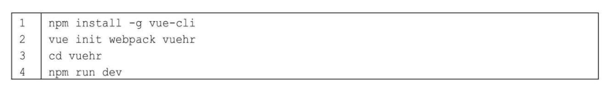

```
npm install -q vue-cli
vue init webpack vuehr
cd vuehr
npm run dev 
```


在执行“vue init webpack vuehr”命令时，会要求依次输入项目的基本信息，如图16-1所示。

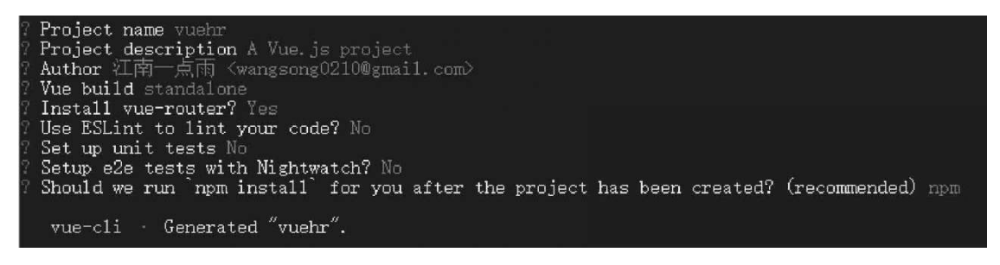

基本信息主要包括：

• 项目名称。• 项目描述。• 项目作者。• Vue项目构建：运行＋编译还是仅运行。• 是否安装vue-router。• 是否使用ESLint。• 是否使用单元测试。• 是否适用Nightwatch e2e测试。• 是否在项目创建成功后自动执行“npm install”安装依赖，若选择否，则在第4行命令执行之前执行“npm install”。

当“npm run dev”命令执行之后，在浏览器中输入http://localhost:8080，显示页面如图16-2所示。

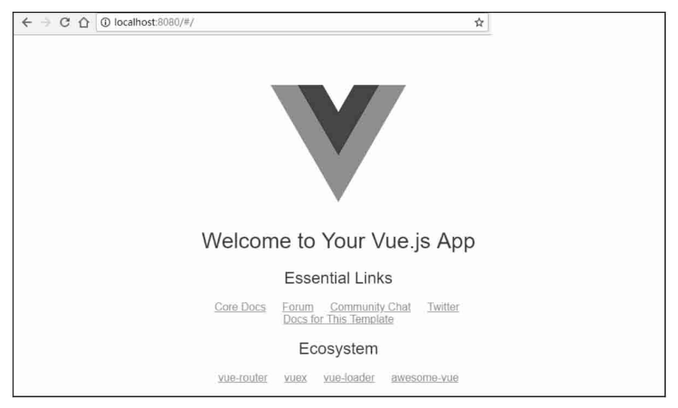

后端项目构建

后端使用Spring Boot创建一个Spring Boot工程，添加spring-boot-starter-web依赖即可：

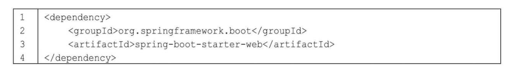

当然，后端所需的依赖不止spring-boot-starter-web，在后文功能不断完善的过程中，再继续添加其他依赖。另外，后端项目所需的Redis配置、邮件发送配置、POI配置、WebSocket配置等，将在涉及相关功能时向读者介绍。

数据模型设计

完整的数据库脚本可以在GitHub上下载，下载地址为https://github.com/lenve/vhr/blob/master/hrserver/src/main/resources/vhr.sql，这里仅展示本项目的数据字典。adjustsalary表（员工调薪表）如表16-1所示。

表16-1 adjustsalary表

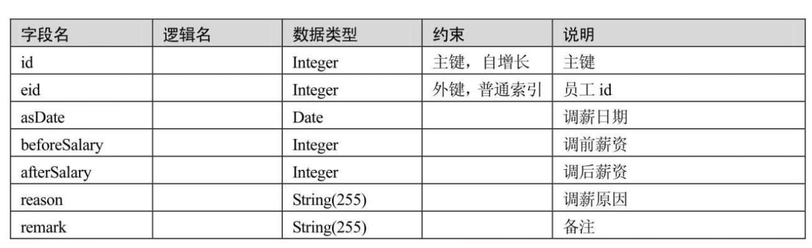

appraise表（员工评价表）如表16-2所示。表16-2 appraise表

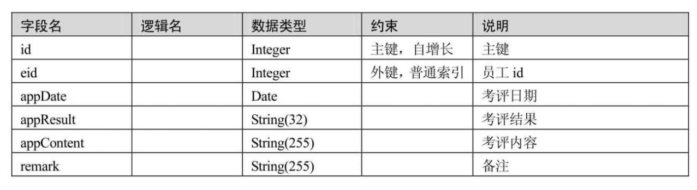


department表（部门表）如表16-3所示。表16-3 department表


employee表（员工信息表）如表16-4所示。表16-4 employee表

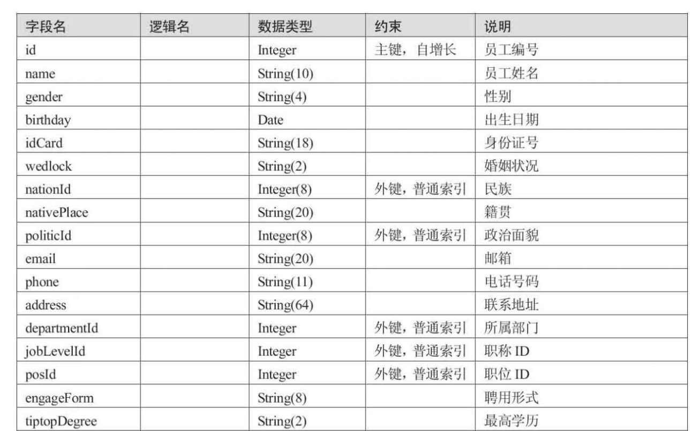


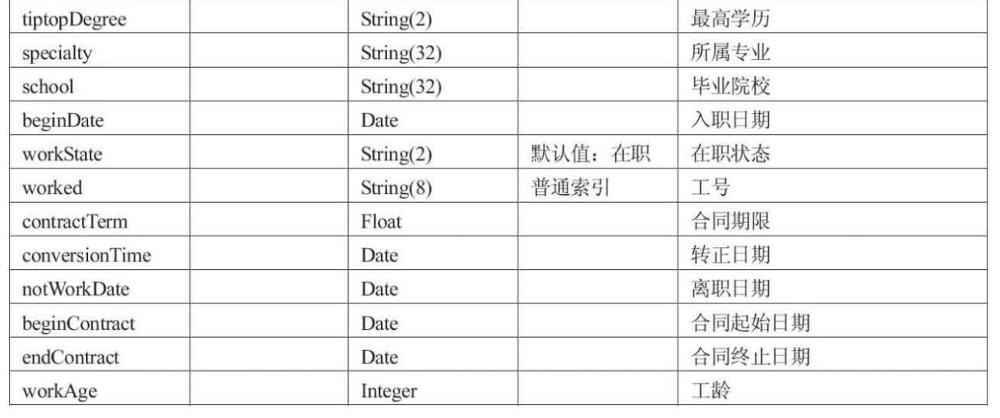


employeeec表（员工奖惩表）如表16-5所示。表16-5 employeeec表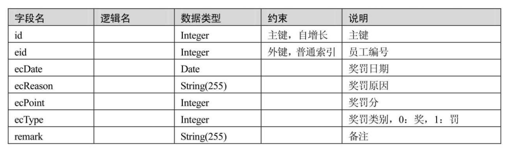

employeeremove表（员工调岗表）如表16-6所示。表16-6 employeeremove表

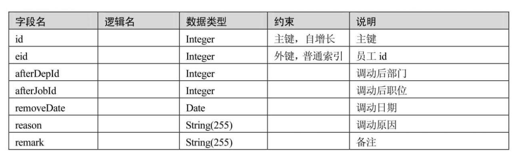

employeetrain表（员工培训表）如表16-7所示。表16-7 employeetrain表

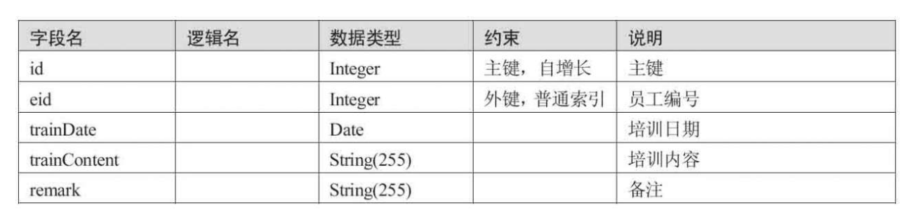

empsalary表（员工薪资关联表）如表16-8所示。表16-8 empsalary表

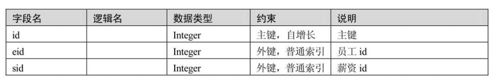

hr表（hr表）如表16-9所示。表16-9 hr表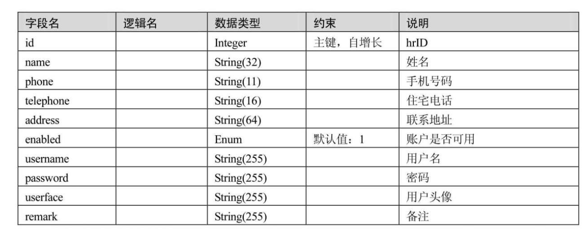

hr_role表（hr角色表）如表16-10所示。表16-10 hr_role表

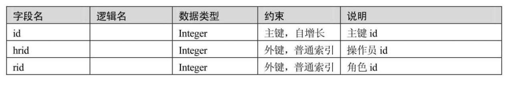

joblevel表（职称表）如表16-11所示。表16-11 joblevel表

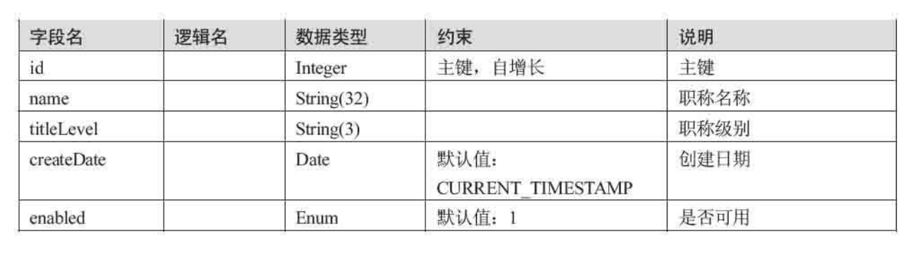

menu表（菜单表）如表16-12所示。表16-12 menu表

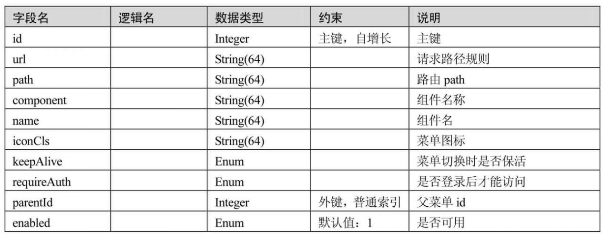


menu_role表（菜单角色关联表）如表16-13所示。表16-13 menu_role表

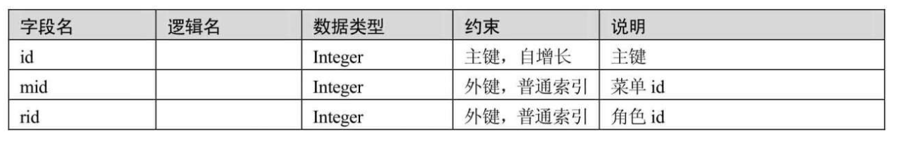

msgcontent表（消息内容表）如表16-14所示。表16-14 msgcontent表

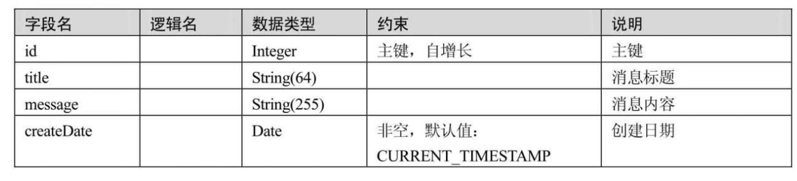

nation表（民族表）如表16-15所示。表16-15 nation表

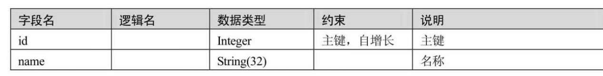

oplog表（操作日志表）如表16-16所示。表16-16 oplog表


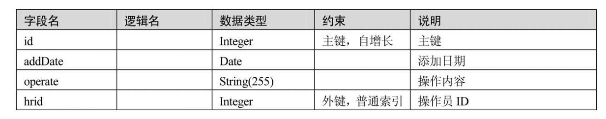


politicsstatus表（政治面貌表）如表16-17所示。表16-17 politicsstatus表

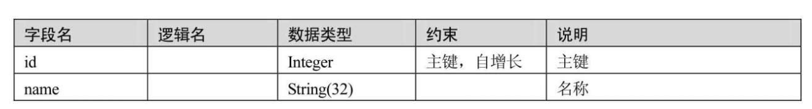

position表（职位表）如表16-18所示。表16-18 position表

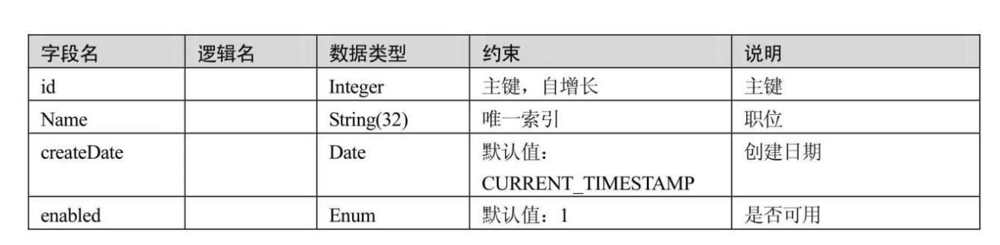


role表（角色表）如表16-19所示。表16-19 role表


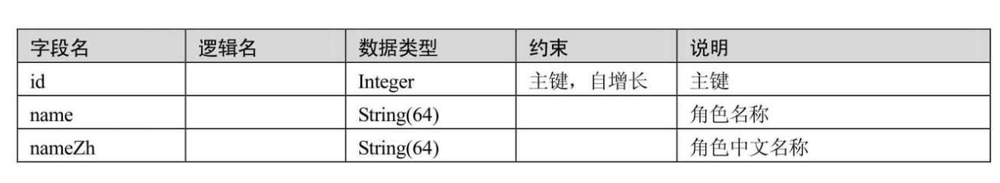


salary表（薪水表）如表16-20所示。表16-20 salary表


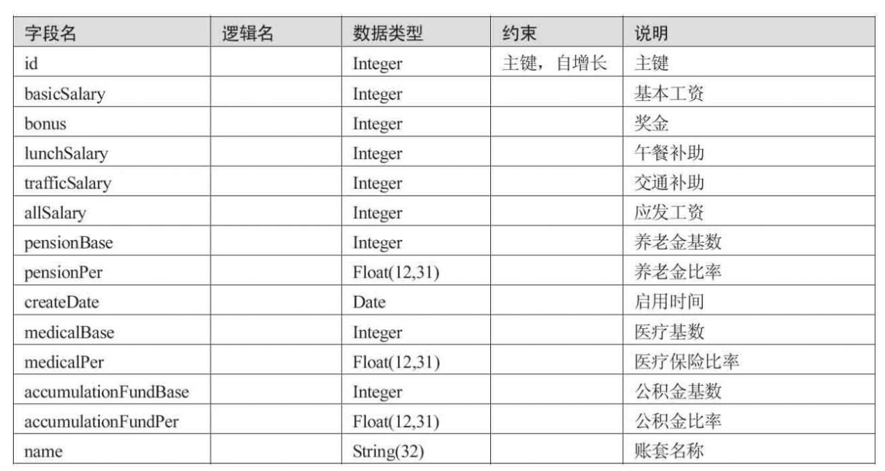

 

sysmsg表（系统消息表）如表16-21所示。表16-21 sysmsg表


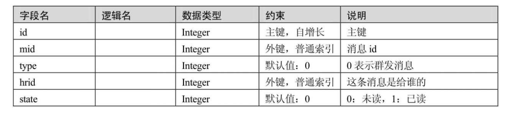


经过以上准备工作，项目环境就已经基本搭建成功了。另外，对于Redis的安装、启动等，读者可以参考第6章，这里不再赘述。

## 登录模块

后端接口实现

后端权限认证采用Spring Security实现（本小节中大量知识点与第10章的内容相关，需要读者熟练掌握第10章的内容），数据库访问使用MyBatis，同时使用Redis实现认证信息缓存。因此，后端首先添加如下依赖（依次是MyBatis依赖、Spring Security依赖、Redis依赖、数据库连接池依赖、数据库驱动依赖以及缓存依赖）：

权限认证  Spring Security 实现  

数据库访问使用Mybatis 同时使用Redis实现认证信息缓存

因此 后端首先添加 依赖  XXX

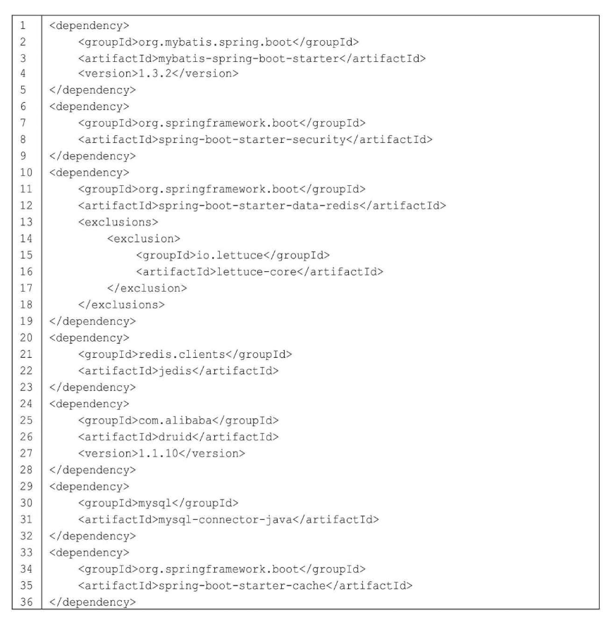

依赖添加完成后，接下来在application.properties中配置数据库连接、Redis连接以及缓存等。

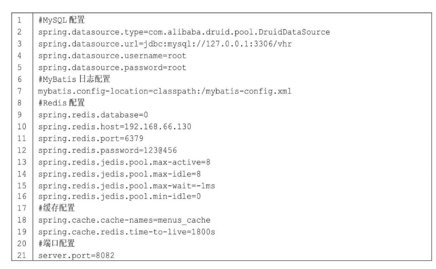

配置完成后，接下来实现用户认证的配置。用户认证使用Spring Security实现，因此需要首先提供一个UserDetails的实例，在人事管理系统中，登录操作是Hr登录，根据前面的Hr表创建Hr实体类并实现UserDetails接口，代码如下：


代码解释：

• 自定义类继承自UserDetails，并实现该接口中相关的方法。前端用户在登录成功后，需要获取当前登录用户的信息，对于一些敏感信息不必返回，使用@JsonIgnore注解即可。• 对于isAccountNonExpired、isAccountNonLocked、isCredentialsNonExpired，由于Hr表并未设计相关字段，因此这里直接返回true，isEnabled方法则根据实际情况返回。• roles属性中存储了当前用户的所有角色信息，在getAuthorities方法中，将这些角色转换为List<GrantedAuthority>的实例返回。

接下来提供一个UserDetailsService实例用来查询用户，代码如下：


自定义HrService实现UserDetailsService接口，并实现该接口中的loadUserByUsername方法，loadUserByUsername方法是根据用户名查询用户的所有信息，包括用户的角色，如果没有查到相关用户，就抛出UsernameNotFoundException异常，表示用户不存在，如果查到了，就直接返回，由Spring Security框架完成密码的比对操作。接下来需要实现动态配置权限，因此还需要提供FilterInvocationSecurityMetadataSource和AccessDecisionManager的实例。FilterInvocationSecurityMetadataSource代码如下：

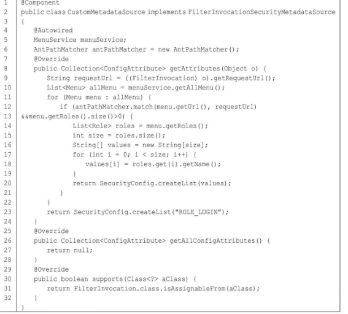

代码解释：

• 在getAttributes方法中首先提取出请求URL，根据请求URL判断该请求需要的角色信息。• 通过MenuService中的getAllMenu方法获取所有的菜单资源进行比对，考虑到getAttributes方法在每一次请求中都会调用，因此可以将getAllMenu方法的返回值缓存下来，下一次请求时直接从缓存中获取。• 对于所有未匹配成功的请求，默认都是登录后访问。

AccessDecisionManager代码如下：

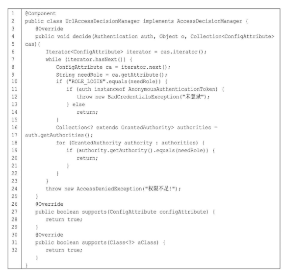

代码解释：

• 在decide方法中判断当前用户是否具备请求需要的角色，若该方法在执行过程中未抛出异常，则说明请求可以通过；若抛出异常，则说明请求权限不足。• 如果所需要的角色是ROLE_LOGIN，那么只需要判断auth不是匿名用户的实例，即表示当前用户已登录。

接下来提供一个AccessDeniedHandler的实例来返回授权失败的信息：

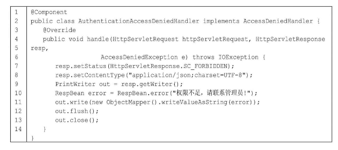


当授权失败时，在这里返回授权失败的信息。当所有准备工作完成后，接下来配置Spring Security，代码如下：

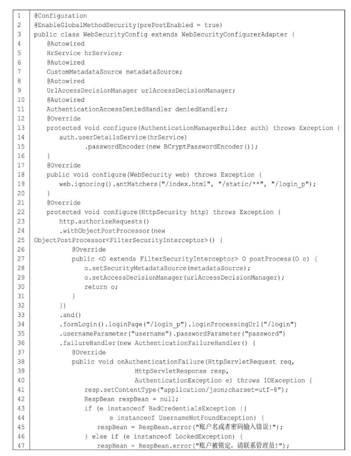


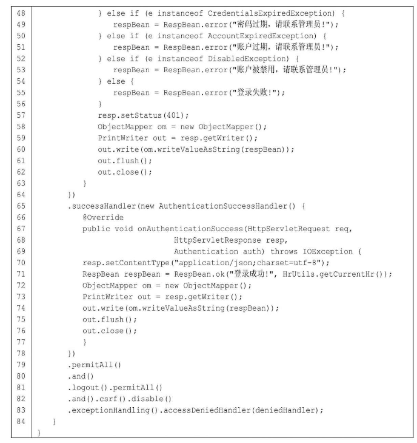


代码解释：

• 首先通过@EnableGlobalMethodSecurity注解开启基于注解的安全配置，启用@PreAuthorize和@PostAuthorize两个注解。• 在配置类中注入之前创建的4个Bean，在AuthenticationManagerBuilder中配置userDetailsService和passwordEncoder。• 在WebSecurity中配置需要忽略的路径。• 在HttpSecurity中配置拦截规则、表单登录、登录成功或失败的响应等。• 最后通过accessDeniedHandler配置异常处理。


另外，前文提到MenuService中的getAllMenu方法在每次请求时都需要查询数据库，效率极低，因此可以将该数据缓存下来，代码如下：

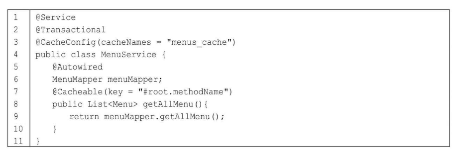

注意这里使用方法名作为缓存的key，另外需要在项目启动类上添加@EnableCaching注解开启缓存。


经过前面这一整套的配置后，登录认证接口已经搭建成功了，接下来可以使用Postman等工具进行测试了。登录测试如图16-3所示。

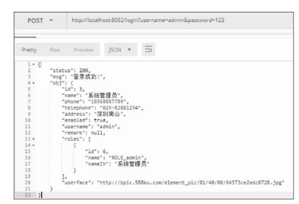

登录成功后，访问http://localhost:8082/employee/advanced/hello接口，由于当前用户不具备相应的角色，访问结果如图16-4所示。

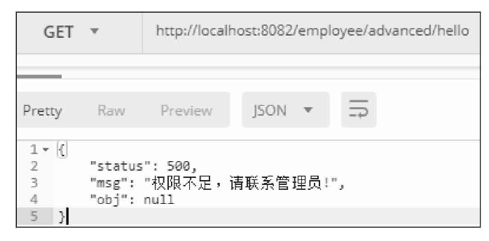

若访问http://localhost:8082/employee/basic/hello地址，则可以看到正常的结果，如图16-5所示。

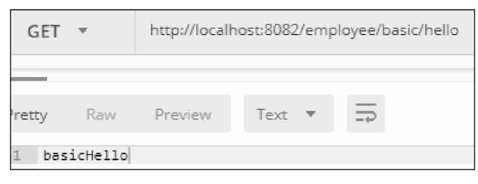

确认后端接口均可以正常运行后，接下来开发前端。

前端实现

