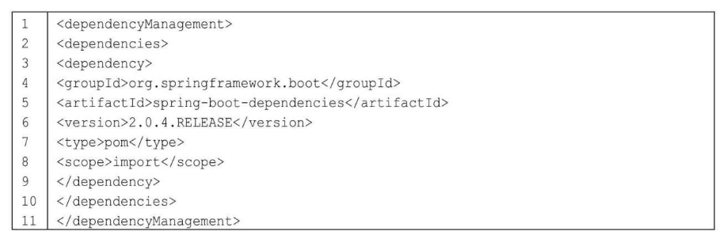
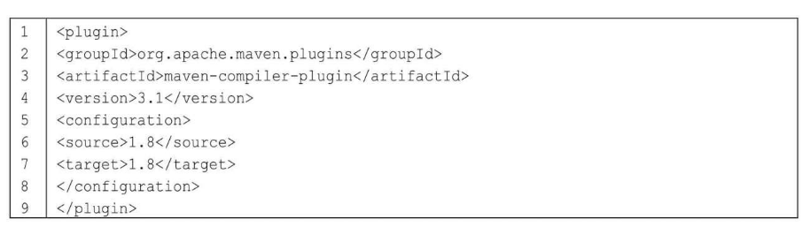
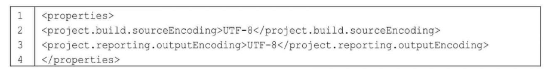
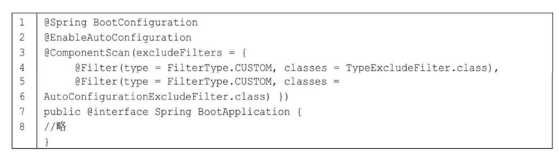
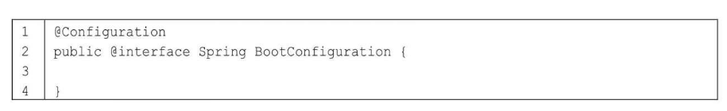
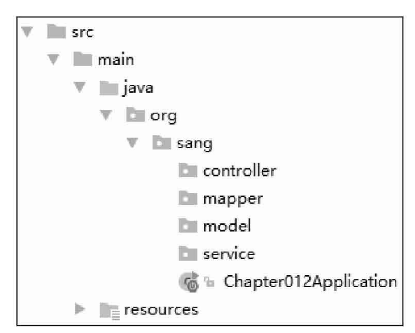
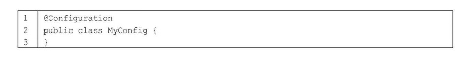
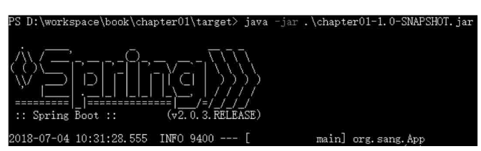
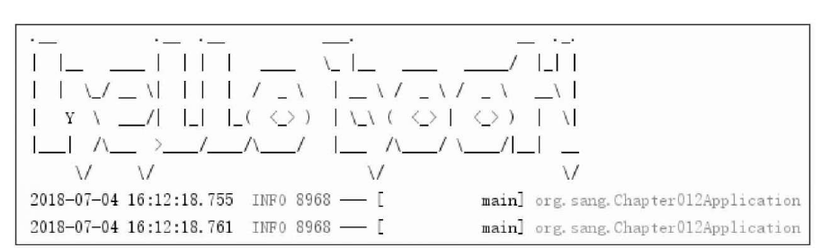
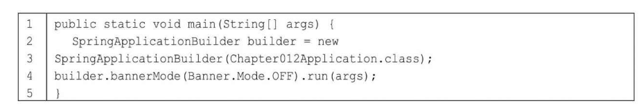

# 第2章 Spring Boot基础配置

本章概要

• 不使用spring-boot-starter-parent• @Spring BootApplication• 定制banner• Web容器配置• Properties配置• 类型安全配置属性• YAML配置• Profile

2.1 不使用spring-boot-starter-parent

从第1章的介绍中读者了解到在向pom.xml文件中添加依赖之前需要先添加spring-boot-starter-parent。spring-boot-starter-parent主要提供了如下默认配置：• Java版本默认使用1.8。• 编码格式默认使用UTF-8。• 提供Dependency Management进行项目依赖的版本管理。• 默认的资源过滤与插件配置。

项目依赖的版本管理

默认的资源过滤与插件配置

spring-boot-starter-parent虽然方便，但是读者在公司中开发微服务项目或者多模块项目时一般需要使用公司自己的parent，这个时候如果还想进行项目依赖版本的统一管理，就需要使用dependencyManagement来实现了。添加如下代码到pom.xml文件中：

dependencyManagement 

此时，就可以不用继承spring-boot-starter-parent了，但是Java的版本、编码的格式等都需要开发者手动配置。Java版本的配置很简单，添加一个plugin即可：

至于编码格式，如果采用了1.3节介绍的方式创建Spring Boot项目，那么编码格式默认会加上；如果是通过普通Maven项目配置成的Spring Boot项目，那么在pom.xml文件中加入如下配置即可：

2.2 @Spring BootApplication

在前文的介绍中，读者已经了解到@Spring BootApplication注解是加在项目的启动类上的。@Spring BootApplication实际上是一个组合注解，定义如下：

这个注解由三个注解组成。①第一个@Spring BootConfiguration的定义如下：

原来就是一个@Configuration，所以@Spring BootConfiguration的功能就是表明这是一个配置类，开发者可以在这个类中配置Bean。从这个角度来讲，这个类所扮演的角色有点类似于Spring中applicationContext.xml文件的角色。

②第二个注解@EnableAutoConfiguration表示开启自动化配置。Spring Boot中的自动化配置是非侵入式的，在任意时刻，开发者都可以使用自定义配置代替自动化配置中的某一个配置。

③第三个注解@ComponentScan完成包扫描，也是Spring中的功能。由于@ComponentScan注解默认扫描的类都位于当前类所在包的下面，因此建议在实际项目开发中把项目启动类放在根包中，如图2-1所示。

虽然项目的启动类也包含@Configuration注解，但是开发者可以创建一个新的类专门用来配置Bean，这样便于配置的管理。这个类只需要加上@Configuration注解即可，代码如下：

项目启动类中的@ComponentScan注解，除了扫描@Service、@Repository、@Component、@Controller和@RestController等之外，也会扫描@Configuration注解的类。

2.3 定制banner

Spring Boot项目在启动时会打印一个banner，如图2-2所示。

这个banner是可以定制的，在resources目录下创建一个banner.txt文件，在这个文件中写入的文本将在项目启动时打印出来。如果想将TXT文本设置成艺术字体，有以下几个在线网站可供参考：

• http://www.network-science.de/ascii/• http://www.kammerl.de/ascii/AsciiSignature.php• http://patorjk.com/software/taag

以第一个网站为例，打开后输入要设置的文本，单击“do it！”按钮，将生成的文本复制到banner.txt文件中，如图2-3所示。

复制完成后再启动项目，就可以看到banner发生了变化，如图2-4所示。

想关闭banner也是可以的，修改项目启动类的main方法，代码如下：

通过SpringApplicationBuilder来设置bannerMode为OFF，这样启动时banner就消失了。

