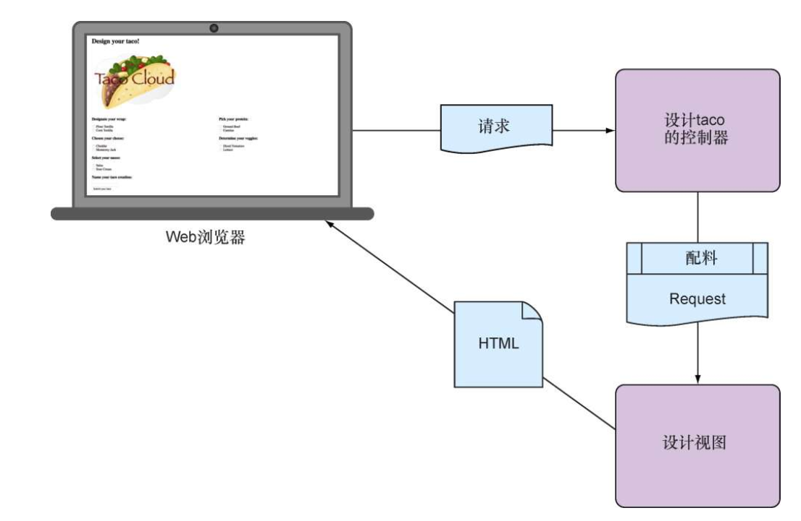
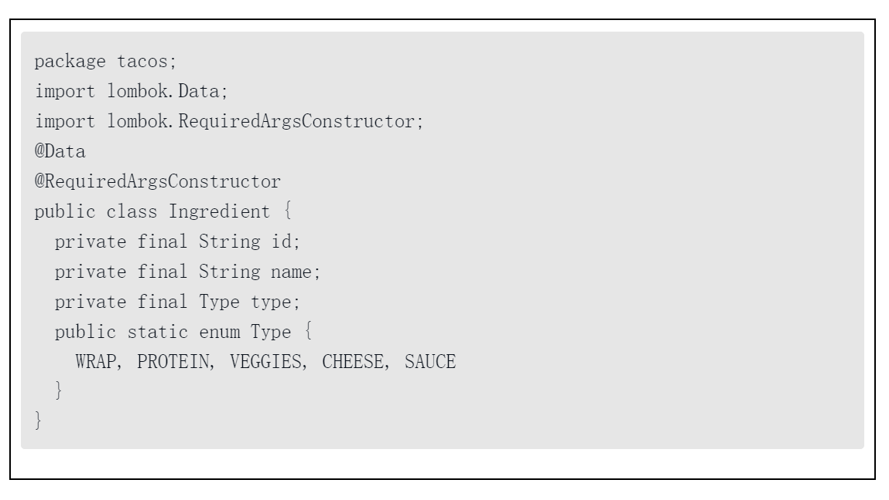
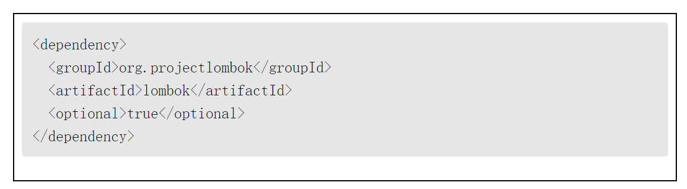
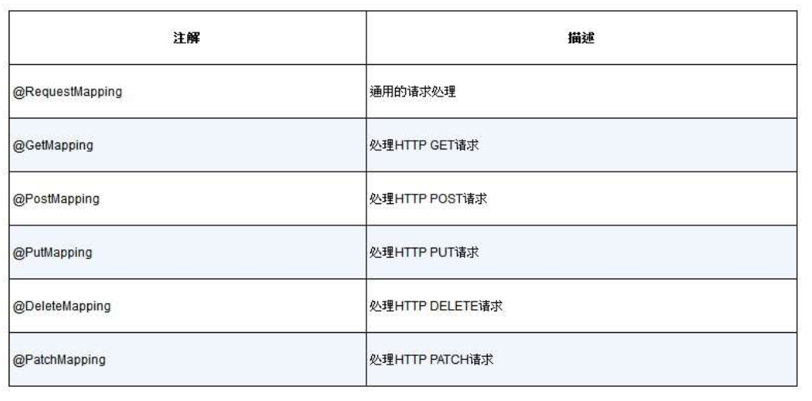

第2章 开发Web应用

本章内容：

* 在浏览器中展现模型数据
* 处理和校验表单输入
* 选择视图模板库

在第1章中，我们创建了第一个Spring MVC控制器来展现应用的主页。但是，Spring MVC能做很多的事情，并不局限于展现静态内容。在本章中，我们将会开发Taco Cloud的第一个主要功能：设计定制taco的能力。在这个过程中，我们将会深入研究Spring MVC并会看到如何展现模型数据和处理表单输入。

# 展现信息

在Spring Web应用中，获取和处理数据是控制器的任务，而将数据渲染到HTML中并在浏览器中展现则是视图的任务。为了支撑taco的创建页面，我们需要构建如下组件。

* 用来定义taco配料属性的领域类。
* 用来获取配料信息并将其传递至视图的Spring MVC控制器类。
* 用来在用户的浏览器中渲染配料列表的视图模板。

典型的Spring MVC请求流

构建领域类

定义taco配料

wrap  protein  veggies  cheese sauce

非常普通的Java领域类 定义描述配料所需的3个属性 id name type 

Ingredient类最不寻常的一点是它似乎缺少了常见的getter和setter方法，以及equals()、hashCode()、toString()等方法。

我们使用了名为Lombok的库（这是一个非常棒的库，它能够在运行时动态生成这些方法）。实际上，类级别的@Data注解就是由Lombok提供的，它会告诉Lombok生成所有缺失的方法，同时还会生成所有以final属性作为参数的构造器。通过使用Lombok，我们能够让Ingredient的代码简洁明了。

在程序清单2.1中没有这些方法，部分原因是节省空间，此外还因为我们使用了名为Lombok的库（这是一个非常棒的库，它能够在运行时动态生成这些方法）。实际上，类级别的@Data注解就是由Lombok提供的，它会告诉Lombok生成所有缺失的方法，同时还会生成所有以final属性作为参数的构造器。通过使用Lombok，我们能够让Ingredient的代码简洁明了。Lombok并不是Spring库，但是它非常有用，我发现如果没有它，开发工作将很难开展。当我需要在书中将代码示例编写得短小简洁时，它简直成了我的救星。要使用Lombok，首先要将其作为依赖添加到项目中。如果你使用Spring Tool Suite，那么只需要用右键点击pom.xml，并从Spring上下文菜单选项中选择“Edit Starters”。在第1章中看到的选择依赖的对话框将会再次出现（见图1.4），这样的话我们就有机会添加依赖或修改已选择的依赖了。找到Lombok选项，并确保它处于已选中的状态，然后点击“OK”，Spring ToolSuite会自动将其添加到构建规范中。另外，你也可以在pom.xml中通过如下条目进行手动添加：

这个依赖将会在开发阶段为你提供Lombok注解（例如@Data），并且会在运行时进行自动化的方法生成。但是，我们还需要将Lombok作为扩展添加到IDE上，否则IDE将会报错，提示缺少方法和final属性没有赋值。参见Lombok项目页面，以查阅如何在你所选择的IDE上安装Lombok。我相信你会发现Lombok非常有用，但你也要知道，它是可选的。在开发Spring应用的时候，它并不是必备的，所以如果你不想使用它的话，完全可以手动编写这些缺失的方法。当你完成之后，我们将会在应用中添加一些控制器，让它们来处理Web请求。

创建控制器类

在Spring MVC框架中，控制器是重要的参与者。它们的主要职责是处理HTTP请求，要么将请求传递给视图以便于渲染HTML（浏览器展现），要么直接将数据写入响应体（RESTful）。在本章中，我们将会关注使用视图来为Web浏览器生成内容的控制器。在第6章中，我们将会看到如何以REST API的形式编写控制器来处理请求。

对于Taco Cloud应用来说，我们需要一个简单的控制器，它要完成如下功能。•处理路径为“/design”的HTTP GET请求。•构建配料的列表。•处理请求，并将配料数据传递给要渲染为HTML的视图模板，发送给发起请求的Web浏览器。

程序清单2.2中的DesignTacoController类解决了这些需求。程序清单2.2 初始的Spring控制器类

对于DesignTacoController，我们先要注意在类级别所应用的注解。首先是@Slf4j，这是Lombok所提供的注解，在运行时，它会在这个类中自动生成一个SLF4J（Simple LoggingFacade for Java）Logger。这个简单的注解和在类中通过如下代码显式声明的效果是一样的：

Spring MVC的请求映射注解

让正确的事情变得更容易在为控制器方法声明请求映射时，越具体越好。这意味着至少要声明路径（或者从类级别的@RequestMapping继承一个路径）以及它所处理的HTTP方法。但是更长的@RequestMapping(method=RequestMethod.GET)注解很容易让开发人员采取懒惰的方式，也就是忽略掉method属性。幸亏有了Spring 4.3的新注解，正确的事情变得更容易了，我们的输入变得更少了。新的请求映射注解具有和@RequestMapping完全相同的属性，所以我们可以在使用@RequestMapping的任何地方使用它们。通常，我喜欢只在类级别上使用@RequestMapping，以便于指定基本路径。在每个处理器方法上，我会使用更具体的@GetMapping、@PostMapping等注解。