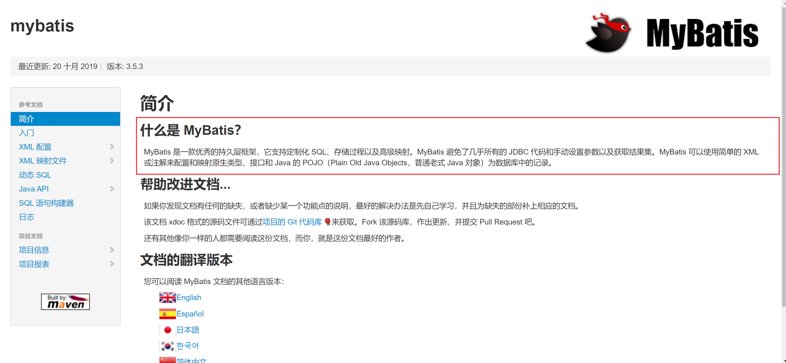
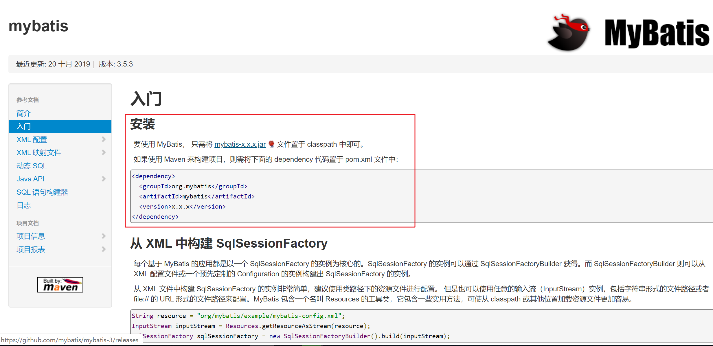
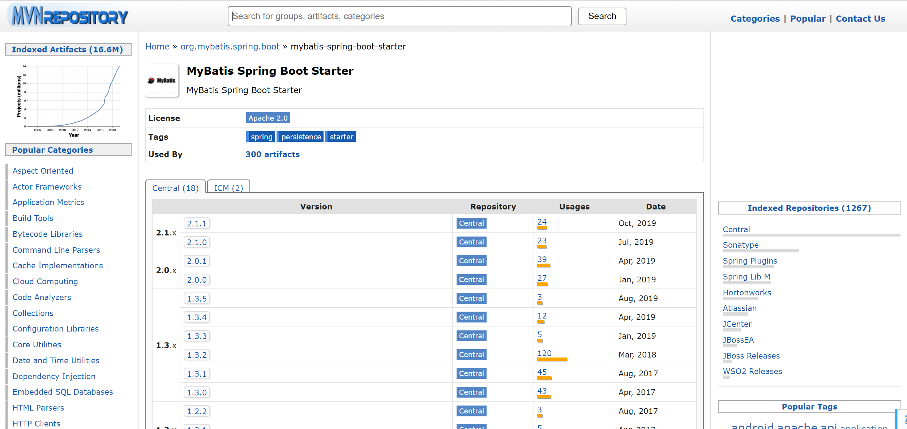
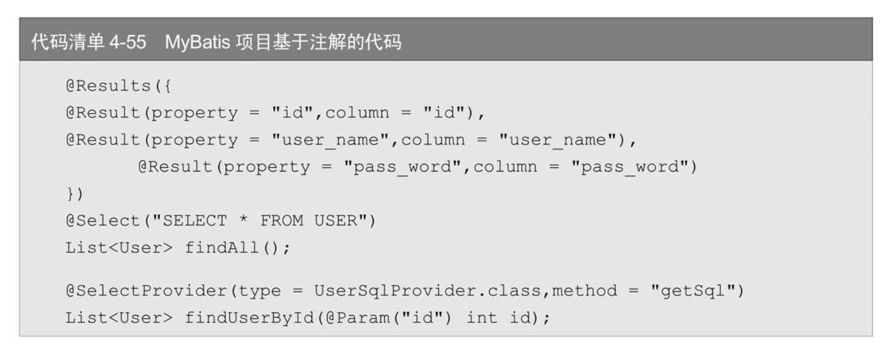
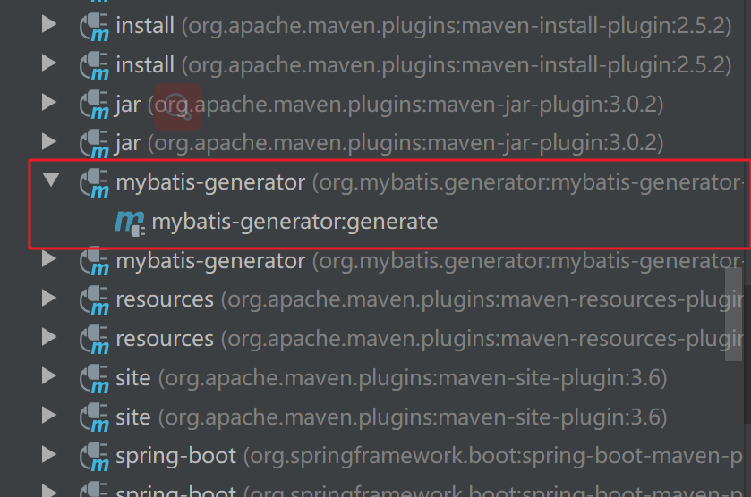
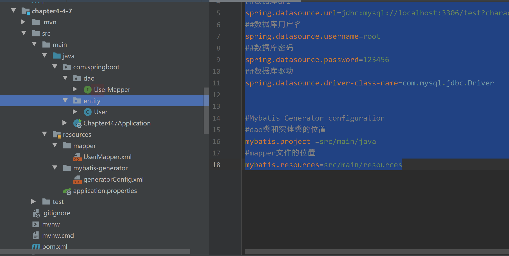

# 4.4　使用MyBatis操作数据库

# 1、MyBatis简介

在MyBatis官网（官网地址：[MyBatis-3](https://mybatis.org/mybatis-3/zh/index.html)             http://www.mybatis.org/mybatis-3/zh/index.html）上是这样介绍MyBatis的：

MyBatis是一款优秀的持久层框架，它支持定制化SQL、存储过程以及高级映射。MyBatis避免了几乎所有的JDBC代码和手动设置参数以及获取结果集。MyBatis可以使用简单的XML或注解来配置和映射原生信息，将接口和Java的POJOs（Plain Old Java Objects，普通的Java对象）映射成数据库中的记录。

持久层框架、定制化SQL、存储过程和高级映射、容易上手、比较灵活。




通俗地理解，MyBatis的优点是：

* 可以手写SQL，比较灵活，对于很多互联网公司、业务迭代速度快的公司或者业务复杂的项目，MyBatis修改、维护等方面更加灵活。
* 从学习成本上来说，MyBatis上手更加容易，基本上没有更多学习成本，这是很多公司选用MyBatis的理由。
* 从SQL优化方面来说，手写的SQL优化起来更加方便。


# 2、MyBatis依赖配置

如果使用 Maven 来构建项目，则需将下面的 dependency 代码置于 pom.xml 文件中：

```xml
<dependency>
  <groupId>org.mybatis</groupId>
  <artifactId>mybatis</artifactId>
  <version>x.x.x</version>
</dependency>
```

https://mybatis.org/mybatis-3/zh/getting-started.html







我们这是创建Spring Boot的项目：在pom文件中加入MyBatis依赖和MySQL数据库依赖，应该这样的。

```xml
  <!-- https://mvnrepository.com/artifact/org.mybatis.spring.boot/mybatis-spring-boot-starter -->
<dependency>
    <groupId>org.mybatis.spring.boot</groupId>
    <artifactId>mybatis-spring-boot-starter</artifactId>
    <version>2.1.1</version>
</dependency>

<dependency>
    <groupId>mysql</groupId>
    <artifactId>mysql-connector-java</artifactId>
    <scope>runtime</scope>
</dependency>


```

# 3、配置文件

在配置文件中需要配置数据库信息以及MyBatis配置。

关于MyBatis主要需要配置以下几种。

•	logging.level.com.springboot.dao.UserMapper：日志的打印级别，

这里的com.awen.springboot.UserMapper是案例中Mapper的位置，实际项目应该配置对应Mapper的位置。

•　mybatis.mapper-locations：Mapper文件的存放位置。

•　mybatis.check-config-location：MyBatis配置是否开启。

•　mybatis.config-location：MyBatis配置文件位置，与mybatis.check-config-location配合使用。

本案例对上述内容都进行了配置，配置文件代码。

application.properties

```
##检查 mybatis 配置是否存在，一般命名为 mybatis-config.xml
mybatis.check-config-location =true
##配置文件位置
mybatis.config-location=classpath:mybatis/mybatis-config.xml
## mapper xml 文件地址
mybatis.mapper-locations=classpath*:mapper/*Mapper.xml
##日志级别
logging.level.com.springboot.dao.UserMapper=debug

##数据库url
spring.datasource.url=jdbc:mysql://localhost:3306/test?characterEncoding=utf8&useSSL=false
##数据库用户名
spring.datasource.username=root
##数据库密码
spring.datasource.password=123456
##数据库驱动
spring.datasource.driver-class-name=com.mysql.jdbc.Driver
```

在src/mian/resources/mybatis下创建mybatis-config.xml，这个文件是MyBatis的全局配置文件，包含以下几种类型的配置：

•　properties（属性）•　settings（全局配置参数）•　typeAliases（类型别名）•　typeHandlers（类型处理器）•　objectFactory（对象工厂）•　plugins（插件）•　environments（环境集合属性对象）•　environment（环境子属性对象）•　transactionManager（事务管理）•　dataSource（数据源）•　mappers（映射器）

案例中仅配置了一些常使用的类型别名typeAliases，Mybatis-config.xml内容如代码清单4-51所示。

```xml
<?xml version="1.0" encoding="UTF-8"?>
<!DOCTYPE configuration PUBLIC "-//mybatis.org//DTD SQL Map Config 3.0//EN"
        "http://mybatis.org/dtd/mybatis-3-config.dtd">
<configuration>
    <typeAliases>
        <typeAlias alias="Integer" type="java.lang.Integer" />
        <typeAlias alias="Long" type="java.lang.Long" />
        <typeAlias alias="HashMap" type="java.util.HashMap" />
        <typeAlias alias="LinkedHashMap" type="java.util.LinkedHashMap" />
        <typeAlias alias="ArrayList" type="java.util.ArrayList" />
        <typeAlias alias="LinkedList" type="java.util.LinkedList" />
        <typeAlias alias="user" type="com.springboot.entity.User"/>
    </typeAliases>
</configuration>
```

创建实体类User，其中使用@Alias注解也可以表明类别名，代码如代码清单4-52所示。

User实体类代码

```java
package com.springboot.entity;

import org.apache.ibatis.type.Alias;

@Alias("user")
public class User {
    private int id;
    private String user_name;
    private String user_password;

    public int getId() {
        return id;
    }

    public void setId(int id) {
        this.id = id;
    }

    public String getUser_name() {
        return user_name;
    }

    public void setUser_name(String user_name) {
        this.user_name = user_name;
    }

    public String getUser_password() {
        return user_password;
    }

    public void setUser_password(String user_password) {
        this.user_password = user_password;
    }

    public User() {
    }

    public User(int id, String user_name, String user_password) {
        this.id = id;
        this.user_name = user_name;
        this.user_password = user_password;
    }

    public User(String user_name, String user_password) {
        this.user_name = user_name;
        this.user_password = user_password;
    }
}

```

# 4、基于XML的使用

创建Mapper对应接口类UserMapper，在类上加入注解@Mapper，表明这是一个Mapper。我们提前定义5个方法，分别是：

•　根据用户名查询用户。•　根据用户名修改用户。•　根据用户名删除用户。•　保存用户。•　获取用户列表。

UserMapper接口代码如代码清单4-53所示。

```java
package com.springboot.dao;

import com.springboot.entity.User;
import com.springboot.provider.UserSqlProvider;
import org.apache.ibatis.annotations.*;

import java.util.List;

@Mapper
public interface UserMapper {
    User findUserByUsername(String username);

    void updateUserByUsername(User user);

    void deleteUserByUsername(String username);

    void saveUser(User user);

    List<User> getUserList();

    @Results({
            @Result(property = "id",column = "id"),
            @Result(property = "user_name",column = "user_name"),
            @Result(property = "pass_word",column = "pass_word")
    })
    @Select("SELECT * FROM USER")
    List<User> findAll();

    @SelectProvider(type = UserSqlProvider.class,method = "getSql")
    List<User> findUserById(@Param("id") int id);

}

```

在src/mian/resources/mapper下创建UserMapper.xml，对应写好在UserMapper接口类的方法，完整内容如代码清单4-54所示。

```xml
<?xml version="1.0" encoding="UTF-8" ?>
<!DOCTYPE mapper PUBLIC "-//mybatis.org//DTD Mapper 3.0//EN" "http://mybatis.org/dtd/mybatis-3-mapper.dtd" >
<mapper namespace="com.springboot.dao.UserMapper">
    <resultMap id="user" type="com.springboot.entity.User"/>
    <parameterMap id="user" type="com.springboot.entity.User"/>
    <select id="findUserByUsername" parameterType="String" resultMap="user">
        SELECT * FROM user
        WHERE user_name=#{1}
    </select>


    <update id="updateUserByUsername" parameterMap="user">
        UPDATE USER SET USER_PASSWORD=#{user_password} WHERE USER_NAME=#{user_name}
    </update>

    <delete id="deleteUserByUsername" parameterType="String">
        DELETE FROM USER WHERE USER_NAME=#{1}
    </delete>

    <!-- 使用alias自定义的parameterType-->
    <insert id="saveUser" parameterType="user">
        INSERT INTO USER (user_password,user_name) VALUES (#{user_password},#{user_name})
    </insert>

    <select id="getUserList" resultMap="user">
        SELECT  * FROM USER
    </select>
</mapper>
```

因为MyBatis深受很多公司的喜爱，所以介绍一下Mapper的标签。标签大致分为以下几种。

（1）定义SQL语句

•　insert：多用于执行插入语句，标签内有两个属性id（唯一标识符）和parameterType（传入的参数类型）。•　delete：多用于执行删除语句，标签内有两个属性id（唯一标识符）和parameterType（传入的参数类型）。•　update：多用于执行修改语句，标签内有两个属性id（唯一标识符）和parameterType（传入的参数类型）。•　select：用于执行查询，与上面三个标签相比，多了一个resultType属性，用于接收返回类型。

注　意比如在insert标签内写delete语句不会报错，但是不建议这样使用。

（2）结果集

•　resultMap：用于建立SQL查询结果字段与实体属性的映射关系信息。

（3）动态SQL拼接

•　if：用于判断，在test属性内加入条件。•　choose：用于判断，与when和otherwise配合使用。•　foreach：循环语句，其中包含属性collection（集合，内容可以是list、array和map）、item（循环遍历的元素）、index（下标）、open（前缀）、close（后缀）、separator（分隔符）。

（4）格式化输出

•　where：根据标签内的值是否存在自动拼接where语句。•　set：根据标签内的值是否存在自动拼接set语句。•　trim：多用于灵活去除多余关键字的标签，一般结合where或set使用

（5）配置关联关系

•　collection：用于配置一对一关系。•　association：用于配置一对多关系。

（6）SQL标签

•　sql：主要用于提取sql片段，便于复用。

（6）SQL标签

# 5、基于注解使用

MyBatis不仅可以使用XML形式操作数据库，还可以使用注解形式操作数据库，比如如下注解。

•　@Select：其中值写查询SQL。•　@Update：其中值写修改SQL。•　@Delete：其中值写删除SQL。•　@Insert：其中值写插入SQL。•　@Results：是以@Result为元素的数据。•　@Result：映射实体类属性和字段之间的关系。•　@ResultMap：用于解决返回结果映射问题，与上面介绍的resultMap标签功能类似。•　@Result：可以用作表明自定义对象，方便内容重用。•　@SelectProvider：相当于直接使用在类中写好的SQL，将SQL封装到类内，方便管理。type属性表明使用哪个类，method对应使用方法。•　@UpdateProvider：功能类似于@SelectProvider。•　@DeleteProvider：功能类似于@SelectProvider。•　@InsertProvider：功能类似于@SelectProvider。

其实现效果和使用XML模式是一样的，并且两种模式可以混用。例子如代码清单4-55所示。



# 6、测试运行

前面对大部分使用场景进行了介绍，接下来进行测试。新建一个Controller，分别对刚刚写的每一个数据库操作写一个方法进行测试，代码内容如代码清单4-56所示。

```java
package com.springboot.controller;

import com.springboot.entity.User;
import com.springboot.dao.UserMapper;
import org.springframework.beans.factory.annotation.Autowired;
import org.springframework.web.bind.annotation.GetMapping;
import org.springframework.web.bind.annotation.RestController;

import java.util.List;

@RestController
public class UserController {

    @Autowired
    private UserMapper userMapper;

    //http://localhost:8080/getUser?username=xiaoli2
    @GetMapping("/getUser")
    public String getUser(String username){
        User user =userMapper.findUserByUsername(username);
        return user!=null ? username+"的密码是："+user.getUser_password():"不存在用户名为"+username+"的用户";
    }

    //http://localhost:8080/updateUser?username=xiaoli2&password=123
    @GetMapping("/updateUser")
    public String updateUser(String password,String username){
        User user = new User(username,password);
        userMapper.updateUserByUsername(user);
        return "success!";
    }


    //http://localhost:8080/addUser?username=xiaoli2&password=123
    @GetMapping("/addUser")
    public String addUser(String username,String password){
        User user = new User(username,password);
        userMapper.saveUser(user);
        return "success!";
    }

    //http://localhost:8080/deleteUser?username=xiaoli2
    @GetMapping("/deleteUser")
    public String deleteUser(String username){
        userMapper.deleteUserByUsername(username);
        return "success!";
    }

    //http://localhost:8080/getUserList
    @GetMapping("/getUserList")
    public List getUserList(){
        return userMapper.getUserList();
    }

    //http://localhost:8080/findAll
    @GetMapping("/findAll")
    public List findAll(){
        return userMapper.findAll();
    }

    //http://localhost:8080/findUserById?id=1
    @GetMapping("/findUserById")
    public List findUserById(int id){
        return userMapper.findUserById(id);
    }
}

```

具体测试可以在浏览器上访问代码中的注释，每一个方法笔者都对应写了测试地址，以上都是笔者亲测无误的。

# 7、Mybatis-Generator插件学习

由于业务的不断增长，数据库中的表也随之增长，造成在没创建表时就需要在项目内反复创建实体类、Mapper文件、dao层文件等，这样的重复工作虽然难度不大，但是会浪费人力，因此MyBatis创建了一个针对这个问题的插件Mybatis-Generator。Mybatis-Generator是MyBatis官方提供的一个便捷型插件，利用它可以根据数据库表结构自动在项目内创建对应的实体类、Mapper文件和dao层。

（1）在pom文件中加入Mybatis-Generator插件

在pom文件中加入Mybatis-Generator插件，为了方便观看，这里展示完整pom文件代码，如代码清单4-57所示。

```xml
<?xml version="1.0" encoding="UTF-8"?>
<project xmlns="http://maven.apache.org/POM/4.0.0" xmlns:xsi="http://www.w3.org/2001/XMLSchema-instance"
	xsi:schemaLocation="http://maven.apache.org/POM/4.0.0 http://maven.apache.org/xsd/maven-4.0.0.xsd">
	<modelVersion>4.0.0</modelVersion>

	<groupId>com.springboot</groupId>
	<artifactId>chapter4-4-7</artifactId>
	<version>0.0.1-SNAPSHOT</version>
	<packaging>jar</packaging>

	<name>chapter4-4-7</name>
	<description>chapter4-4-7</description>

	<parent>
		<groupId>org.springframework.boot</groupId>
		<artifactId>spring-boot-starter-parent</artifactId>
		<version>2.0.3.RELEASE</version>
		<relativePath/> <!-- lookup parent from repository -->
	</parent>

	<properties>
		<project.build.sourceEncoding>UTF-8</project.build.sourceEncoding>
		<project.reporting.outputEncoding>UTF-8</project.reporting.outputEncoding>
		<java.version>1.8</java.version>
	</properties>

	<dependencies>
		<dependency>
			<groupId>org.springframework.boot</groupId>
			<artifactId>spring-boot-starter-web</artifactId>
		</dependency>
		<dependency>
			<groupId>org.mybatis.spring.boot</groupId>
			<artifactId>mybatis-spring-boot-starter</artifactId>
			<version>1.3.2</version>
		</dependency>
		<dependency>
			<groupId>mysql</groupId>
			<artifactId>mysql-connector-java</artifactId>
			<scope>runtime</scope>
		</dependency>
		<dependency>
			<groupId>org.springframework.boot</groupId>
			<artifactId>spring-boot-starter-test</artifactId>
			<scope>test</scope>
		</dependency>
	</dependencies>

	<build>
		<plugins>
			<plugin>
				<groupId>org.mybatis.generator</groupId>
				<artifactId>mybatis-generator-maven-plugin</artifactId>
				<version>1.3.2</version>
				<executions>
					<execution>
						<id>mybatis-generator</id>
						<phase>deploy</phase>
						<goals>
							<goal>generate</goal>
						</goals>
					</execution>
				</executions>
				<configuration>
					<!-- Mybatis-Generator 工具配置文件的位置 -->
					<configurationFile>src/main/resources/mybatis-generator/generatorConfig.xml</configurationFile>
					<verbose>true</verbose>
					<overwrite>true</overwrite>
				</configuration>
				<dependencies>
					<dependency>
						<groupId>mysql</groupId>
						<artifactId>mysql-connector-java</artifactId>
						<version>5.1.46</version>
					</dependency>
					<dependency>
						<groupId>org.mybatis.generator</groupId>
						<artifactId>mybatis-generator-core</artifactId>
						<version>1.3.2</version>
					</dependency>
				</dependencies>
			</plugin>
			<plugin>
				<groupId>org.springframework.boot</groupId>
				<artifactId>spring-boot-maven-plugin</artifactId>
				<configuration>
					<classifier>exec</classifier>
				</configuration>
			</plugin>
		</plugins>
	</build>


</project>

```


这里需要注意的是，configurationFile配置的是Mybatis-Generator插件所存放的位置，本案例是在src/main/resources/mybatis-generator下创建了一个generatorConfig.xml文件，在配置文件中对需要配置的内容做了详细的说明，配置内容如代码清单4-58所示。generatorConfig.xml

```xml
<?xml version="1.0" encoding="UTF-8"?>
<!DOCTYPE generatorConfiguration
        PUBLIC "-//mybatis.org//DTD MyBatis Generator Configuration 1.0//EN"
        "http://mybatis.org/dtd/mybatis-generator-config_1_0.dtd">
<!-- 配置生成器 -->
<generatorConfiguration>
    <!--执行generator插件生成文件的命令： call mvn mybatis-generator:generate -e -->
    <!-- 引入配置文件 -->
    <properties resource="application.properties"/>
    <!--classPathEntry:数据库的JDBC驱动,换成你自己的驱动位置 可选 -->
    <!--<classPathEntry location="D:\generator_mybatis\mysql-connector-java-5.1.24-bin.jar" /> -->

    <!-- 一个数据库一个context -->
    <!--defaultModelType="flat" 大数据字段，不分表 -->
    <context id="MysqlTables" targetRuntime="MyBatis3Simple" defaultModelType="flat">
        <!-- 自动识别数据库关键字，默认false，如果设置为true，根据SqlReservedWords中定义的关键字列表；
        一般保留默认值，遇到数据库关键字（Java关键字），使用columnOverride覆盖 -->
        <property name="autoDelimitKeywords" value="true" />
        <!-- 生成的Java文件的编码 -->
        <property name="javaFileEncoding" value="utf-8" />
        <!-- beginningDelimiter和endingDelimiter：指明数据库的用于标记数据库对象名的符号，比如ORACLE就是双引号，MYSQL默认是`反引号； -->
        <property name="beginningDelimiter" value="`" />
        <property name="endingDelimiter" value="`" />

        <!-- 格式化java代码 -->
        <property name="javaFormatter" value="org.mybatis.generator.api.dom.DefaultJavaFormatter"/>
        <!-- 格式化XML代码 -->
        <property name="xmlFormatter" value="org.mybatis.generator.api.dom.DefaultXmlFormatter"/>
        <plugin type="org.mybatis.generator.plugins.SerializablePlugin" />

        <plugin type="org.mybatis.generator.plugins.ToStringPlugin" />

        <!-- 注释 -->
        <commentGenerator >
            <property name="suppressAllComments" value="false"/><!-- 是否取消注释 -->
            <property name="suppressDate" value="true" /> <!-- 是否生成注释代时间戳-->
        </commentGenerator>

        <!-- jdbc连接 -->
        <jdbcConnection driverClass="${spring.datasource.driver-class-name}" connectionURL="${spring.datasource.url}" userId="${spring.datasource.username}" password="${spring.datasource.password}" />
        <!-- 类型转换 -->
        <javaTypeResolver>
            <!-- 是否使用bigDecimal， false可自动转化以下类型（Long, Integer, Short, etc.） -->
            <property name="forceBigDecimals" value="false"/>
        </javaTypeResolver>

        <!-- 生成实体类地址 -->
        <javaModelGenerator targetPackage="com.springboot.entity" targetProject="${mybatis.project}" >
            <property name="enableSubPackages" value="false"/>
            <property name="trimStrings" value="true"/>
        </javaModelGenerator>
        <!-- 生成mapxml文件 -->
        <sqlMapGenerator targetPackage="mapper" targetProject="${mybatis.resources}" >
            <property name="enableSubPackages" value="false" />
        </sqlMapGenerator>
        <!-- 生成mapxml对应client，也就是接口dao -->
        <javaClientGenerator targetPackage="com.springboot.dao" targetProject="${mybatis.project}" type="XMLMAPPER" >
            <property name="enableSubPackages" value="false" />
        </javaClientGenerator>
        <!-- table可以有多个,每个数据库中的表都可以写一个table，tableName表示要匹配的数据库表,也可以在tableName属性中通过使用%通配符来匹配所有数据库表,只有匹配的表才会自动生成文件 -->
        <table tableName="user" enableCountByExample="true" enableUpdateByExample="true" enableDeleteByExample="true" enableSelectByExample="true" selectByExampleQueryId="true">
            <property name="useActualColumnNames" value="false" />
            <!-- 数据库表主键 -->
            <generatedKey column="id" sqlStatement="Mysql" identity="true" />
        </table>
    </context>
</generatorConfiguration>
```

在Mybatis-Generator中有部分数据这里读取的是application.properties文件中的内容。下面给出application.properties文件中的配置，如代码清单4-59所示。application.properties

```
## mapper xml 文件地址
mybatis.mapper-locations=classpath*:mapper/*Mapper.xml

##数据库url
spring.datasource.url=jdbc:mysql://localhost:3306/test?characterEncoding=utf8&useSSL=false
##数据库用户名
spring.datasource.username=root
##数据库密码
spring.datasource.password=123456
##数据库驱动
spring.datasource.driver-class-name=com.mysql.jdbc.Driver


#Mybatis Generator configuration
#dao类和实体类的位置
mybatis.project =src/main/java
#mapper文件的位置
mybatis.resources=src/main/resources
```


到这里，其实就已经配置完成了。接下来我们查看IntelliJ IDEA中，Maven的工具栏，可以看到已经安装了Mybatis-Generator插件，如图4-15所示。



我们看一下Maven操作日志，提示已经生成了dao层、实体类、Mapper文件，如图4-16所示。去对应目录看看，果然这些都生成了，如图4-17所示。

图4-16　Mybatis-Generator项目执行LOG示例图


Mybatis-Generator项目结构示例图



我们再来查看一下Mapper，其实在Mapper内已经默认生成了几个简单的方法，让我们看一下UserMapper接口的内容，代码如代码清单4-60所示。

```java
package com.springboot.dao;

import com.springboot.entity.User;
import java.util.List;

public interface UserMapper {
    /**
     * This method was generated by MyBatis Generator.
     * This method corresponds to the database table user
     *
     * @mbggenerated
     */
    int deleteByPrimaryKey(Long id);

    /**
     * This method was generated by MyBatis Generator.
     * This method corresponds to the database table user
     *
     * @mbggenerated
     */
    int insert(User record);

    /**
     * This method was generated by MyBatis Generator.
     * This method corresponds to the database table user
     *
     * @mbggenerated
     */
    User selectByPrimaryKey(Long id);

    /**
     * This method was generated by MyBatis Generator.
     * This method corresponds to the database table user
     *
     * @mbggenerated
     */
    List<User> selectAll();

    /**
     * This method was generated by MyBatis Generator.
     * This method corresponds to the database table user
     *
     * @mbggenerated
     */
    int updateByPrimaryKey(User record);
}
```

UserMapper.xml也对应写好了SQL，代码内容如代码清单4-61所示。

```xml
<?xml version="1.0" encoding="UTF-8"?>
<!DOCTYPE mapper PUBLIC "-//mybatis.org//DTD Mapper 3.0//EN" "http://mybatis.org/dtd/mybatis-3-mapper.dtd">
<mapper namespace="com.springboot.dao.UserMapper">
  <resultMap id="BaseResultMap" type="com.springboot.entity.User">
    <!--
      WARNING - @mbggenerated
      This element is automatically generated by MyBatis Generator, do not modify.
    -->
    <id column="id" jdbcType="BIGINT" property="id" />
    <result column="user_name" jdbcType="VARCHAR" property="userName" />
    <result column="user_password" jdbcType="VARCHAR" property="userPassword" />
  </resultMap>
  <delete id="deleteByPrimaryKey" parameterType="java.lang.Long">
    <!--
      WARNING - @mbggenerated
      This element is automatically generated by MyBatis Generator, do not modify.
    -->
    delete from user
    where id = #{id,jdbcType=BIGINT}
  </delete>
  <insert id="insert" parameterType="com.springboot.entity.User">
    <!--
      WARNING - @mbggenerated
      This element is automatically generated by MyBatis Generator, do not modify.
    -->
    <selectKey keyProperty="id" order="AFTER" resultType="java.lang.Long">
      SELECT LAST_INSERT_ID()
    </selectKey>
    insert into user (user_name, user_password)
    values (#{userName,jdbcType=VARCHAR}, #{userPassword,jdbcType=VARCHAR})
  </insert>
  <update id="updateByPrimaryKey" parameterType="com.springboot.entity.User">
    <!--
      WARNING - @mbggenerated
      This element is automatically generated by MyBatis Generator, do not modify.
    -->
    update user
    set user_name = #{userName,jdbcType=VARCHAR},
      user_password = #{userPassword,jdbcType=VARCHAR}
    where id = #{id,jdbcType=BIGINT}
  </update>
  <select id="selectByPrimaryKey" parameterType="java.lang.Long" resultMap="BaseResultMap">
    <!--
      WARNING - @mbggenerated
      This element is automatically generated by MyBatis Generator, do not modify.
    -->
    select id, user_name, user_password
    from user
    where id = #{id,jdbcType=BIGINT}
  </select>
  <select id="selectAll" resultMap="BaseResultMap">
    <!--
      WARNING - @mbggenerated
      This element is automatically generated by MyBatis Generator, do not modify.
    -->
    select id, user_name, user_password
    from user
  </select>
</mapper>
```

这些自动生成的方法都是可以直接使用的，可以使用在Controller内对应的写方法测试，也可以使用测试用例测试，这里就不一一测试了。