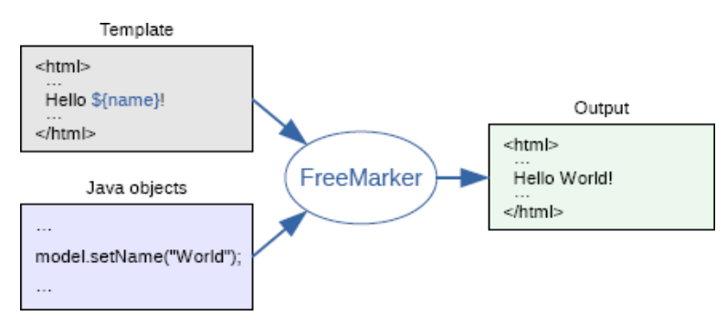
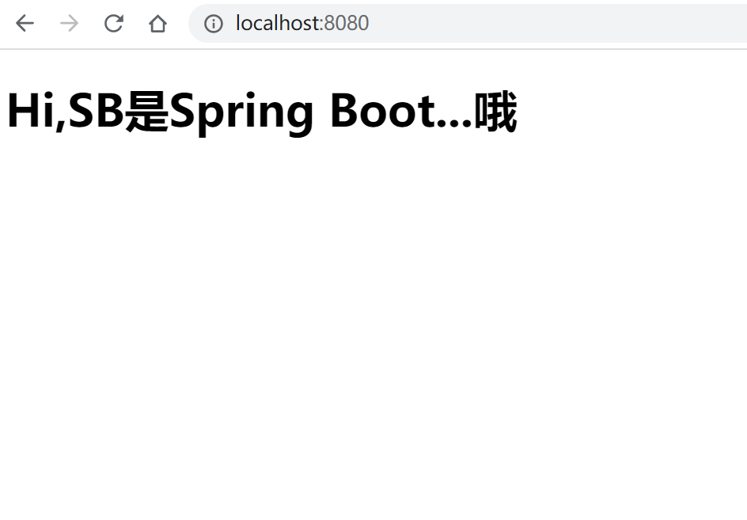

# Thymeleaf

# Spring Boot项目整合FreeMarker模板

[freemarker](https://freemarker.apache.org/)

```english
Apache FreeMarker™ is a *template engine*: a Java library to generate text output (HTML web pages, e-mails, configuration files, source code, etc.) based on templates and changing data. Templates are written in the FreeMarker Template Language (FTL), which is a simple, specialized language (not a full-blown programming language like PHP). Usually, a general-purpose programming language (like Java) is used to prepare the data (issue database queries, do business calculations). Then, Apache FreeMarker displays that prepared data using templates. In the template you are focusing on how to present the data, and outside the template you are focusing on what data to present.
```


FreeMarker 是一款模模板引擎,一种基于模板和要改变的数据, 并用来生成输出文本(HTML网页，电子邮件，配置文件，源代码等)的通用工具。 它不是面向最终用户的，而是一个Java类库，是一款程序员可以嵌入他们所开发产品的组件。

FreeMarker基于模板和要改变的数据,用来生成输出文本 

模板编写为FreeMarker Template Language (FTL)

模板显示已经准备好的数据。在模板中，可以专注于如何展现数据， 而在模板之外可以专注于要展示什么数据。



Spring Boot项目整合FreeMarker模板。新建项目，在项目中加入Freemarker依赖

```xml
 <dependency>
            <groupId>org.springframework.boot</groupId>
            <artifactId>spring-boot-starter</artifactId>
        </dependency>
        <dependency>
            <groupId>org.springframework.boot</groupId>
            <artifactId>spring-boot-starter-test</artifactId>
            <scope>test</scope>
        </dependency>
        <dependency>
            <groupId>org.springframework.boot</groupId>
            <artifactId>spring-boot-starter-freemarker</artifactId>
        </dependency>
        <dependency>
            <groupId>org.springframework.boot</groupId>
            <artifactId>spring-boot-starter-web</artifactId>
        </dependency>
```

接下来配置FreeMarker模板属性

注意的是模板文件后缀配置的是FTL文件,配置文件如代码

```properties
## freemarker\u7F13\u5B58\u662F\u5426\u5F00\u542F
## freemarker缓存是否开启
spring.freemarker.cache=false
## freemarker编码格式
## freemarker\u7F16\u7801\u683C\u5F0F
spring.freemarker.charset=UTF-8
## freemarker模板文件前缀
## freemarker\u6A21\u677F\u6587\u4EF6\u524D\u7F00
spring.freemarker.template-loader-path=classpath:/templates/
## freemarker\u6A21\u677F\u6587\u4EF6\u540E\u7F00\uFF0C\u6CE8\u610F\u8FD9\u91CC\u540E\u7F00\u540D\u662Fftl
## freemarker模板文件后缀，注意这里后缀名.ftl
spring.freemarker.suffix=.ftl
```

接下来，创建一个IndexController进行测试，内容如代码

```java
@Controller
public class IndexController{
    @GetMapping("/")
    public String index(ModelMap modelMap){
        modelMap.addAttribute("msg","Hi,SB是Spring Boot...哦");
        return "index";
    }
}
```

在src/resources/templates下新建index.ftl（注意文件后缀），使用${msg}接收后来传送的数据，文件内容如代码

```html
<!DOCTYPE html>
<head>
    <meta charset="UTF-8">
    <title>Freemarker</title>
</head>
<body>
<h1>${msg}</h1>
</body>
</html>

```


到这里，项目配置完成。启动项目，在浏览器上访问http://localhost:8080，可以看到如下结果：



