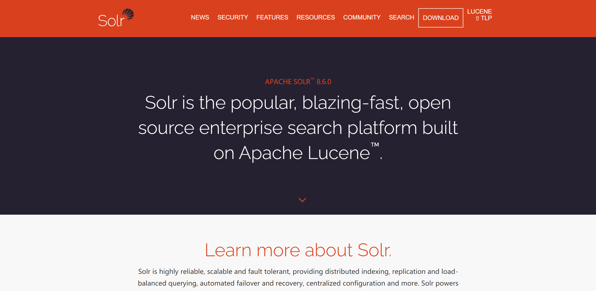

# Spri1ng Boot的搜索之旅

当我们在访问购物网站的时候（比如淘宝、京东），根据意愿输入任意关键字，就可以查询出与关键字相关的内容，实现这项功能是怎么做到的呢？通常这项功能是通过全文检索来实现的。而对于开源常用的全文检索工具，基本上大多数企业都会选用Apache Solr或者Elasticsearch。本章将带领大家学习Spring Boot对二者的使用。

根据意愿输入任意关键字，就可以查询出与关键字相关的内容

全文检索来实现的 

当我们在访问购物网站的时候 

淘宝  京东  

# 使用Solr

## Solr简介

Solr（官网地址：http://lucene.apache.org/solr/）是基于Apache Lucene构建的流行、快速、开源的企业搜索平台。Solr是一个独立的企业搜索服务器，具有类似REST的API。Solr支持多种类型文件创建索引，可以通过JSON、XML、CSV或二进制文件将文档放入其中。可以通过HTTP GET查询它并接收JSON、XML、CSV或二进制结果。Solr是Apache基金会的项目，在官网上可以查看最新版本。

Solr是一个高性能的搜索引擎，其采用Java 5开发，正是由于它基于Lucene的全文搜索服务器，因此提供了比Lucene更为丰富的查询语言，同时实现了可配置、可扩展并对查询性能进行了优化，并且提供了一个完善的功能管理界面，是一款非常优秀的全文搜索引擎。

通常来说，Solr运行在Servlet容器（如Tomcat、Jetty、WebLogic）中，提供了独立的管理平台，便于开发者使用及管理。

Solr is the popular, blazing-fast, open source enterprise search platform built on Apache Lucene™.





## Spring Boot使用Solr

Spring Boot对于Solr的使用其实是很简单的，在Spring Boot的starter中就有Solr的依赖，直接引入即可

```xml
<dependency>
			<groupId>org.springframework.boot</groupId>
			<artifactId>spring-boot-starter-data-solr</artifactId>
		</dependency>
```


接下来，需要在配置文件中配置Solr服务器相关的信息

```properties
## solr服务器地址，可以在后面直接定义索引名称，如http://ip:端口/solr/test_solr
#spring.data.solr.host=http://solr.dalaoyang.cn:8983/solr
spring.data.solr.host=http://solr.liuawen.cn:8983/solr
## solr索引名称（这个是自定义的属性，方便使用。）
spring.data.solr.collectionName=test_solr

```

本小节只是对Spring Boot结合Solr的使用进行介绍，所以没有创建过多的类。接下来创建一个实体类Goods，如代码清单10-3所示。

```java
package com.springboot.entity;
//实体类Goods
public class Goods {
    private Long id;
    private String goodsName;
    private String goodsIntroduce;
    private Double goodsPrice;

    public Long getId() {
        return id;
    }

    public void setId(Long id) {
        this.id = id;
    }

    public String getGoodsName() {
        return goodsName;
    }

    public void setGoodsName(String goodsName) {
        this.goodsName = goodsName;
    }

    public String getGoodsIntroduce() {
        return goodsIntroduce;
    }

    public void setGoodsIntroduce(String goodsIntroduce) {
        this.goodsIntroduce = goodsIntroduce;
    }

    public Double getGoodsPrice() {
        return goodsPrice;
    }

    public void setGoodsPrice(Double goodsPrice) {
        this.goodsPrice = goodsPrice;
    }

    public Goods(Long id, String goodsName, String goodsIntroduce, Double goodsPrice) {
        this.id = id;
        this.goodsName = goodsName;
        this.goodsIntroduce = goodsIntroduce;
        this.goodsPrice = goodsPrice;
    }

    public Goods(String goodsName, String goodsIntroduce, Double goodsPrice) {
        this.goodsName = goodsName;
        this.goodsIntroduce = goodsIntroduce;
        this.goodsPrice = goodsPrice;
    }

    public Goods() {
    }

    @Override
    public String toString() {
        return "Goods{" +
                "id=" + id +
                ", goodsName='" + goodsName + '\'' +
                ", goodsIntroduce='" + goodsIntroduce + '\'' +
                ", goodsPrice=" + goodsPrice +
                '}';
    }
}

```

在Spring Boot操作Solr的时候，所有操作都是通过SolrClient进行的。接下来我们创建一个SolrController进行操作。在类中注入SolrClient（以下简称client），并且将前面介绍的索引名称自定义属性定义进来，如代码清单10-4所示。

Solr 所有操作都是通过SolrClient进行的

创建一个SolrController进行操作 

在类中注入SolrClient client

test_solr


SolrController类基础配置信息

```java
@RestController
public class SolrController {

    @Autowired
    private SolrClient client;

    @Value("${spring.data.solr.collectionName}")
    private String collectionName;
    //给了值 test_solr
}
```

Controller基本上定义好了。接下来从5个方面对Solr的使用进行学习。


1、保存或修改

在保存或修改中，开始对传入Goods对象的Id进行判断，如果不存在，就获取当前系统时间戳作为Id，做保存操作；如果存在，就做修改操作。保存和修改都是通过client.add()进行操作的，在Solr中会判断Id是否存在，若存在，则修改；若不存在，则新增。对于新增、修改或删除操作，需要在行为后使用client.commit()方法。在commit方法中传入操作索引名称提交操作，如代码清单10-5所示。

```java
@PostMapping("saveOrUpdate")
    public String saveOrUpdate(@RequestBody Goods goods) {
        //判断id是否为空 是 赋值  
        if(goods.getId() == null){
            goods.setId(System.currentTimeMillis());
        }
        try {
            SolrInputDocument solrInputDocument = new SolrInputDocument();
            solrInputDocument.setField("id", goods.getId());
            solrInputDocument.setField("goodsName", goods.getGoodsName());
            solrInputDocument.setField("goodsIntroduce", goods.getGoodsIntroduce());
            solrInputDocument.setField("goodsPrice", goods.getGoodsPrice());
            client.add(collectionName, solrInputDocument);
            client.commit(collectionName);
            return goods.toString();
        } catch (Exception e) {
            e.printStackTrace();
        }
        return "error";
    }

```

删除

删除比较简单，调用client.deleteById()方法对指定Id的索引进行删除

删除方法代码


删除所有


删除所有是删除的改进版，使用Solr的通配符


删除所有方法代码

```java

```


根据Id查询

根据Id查询方法调用了client.getById()方法，在方法内传入索引名称和Id

根据Id查询代码


复杂查询

复杂查询是使用Solr的重点，在讲解这个方法之前，先查看如图10-2所示的页面。

代码清单10-2 Solr管理页面


图10-2中的参数说明如下。

1. 查询条件介绍

•　q：查询的关键字，默认值为*:*，代表查询所有，也可以指定条件，比如id:1。•　fq：过虑查询，提供一个可选的筛选器查询。返回在q查询结果中，同时符合fq筛选条件的结果，例如q=id:1&fq=goodsPrice:[90 TO 100]，找关键字id为1并且goodsPrice在90~100之间的结果。•　sort：排序方式，例如sort的值为id desc，表示按照id降序排序。•　start：返回结果的第几条记录开始，一般分页用，默认从0开始。•　rows：指定返回结果最多有多少条记录，默认值为10，配合start实现分页。•　fl：指定返回字段，用逗号或空格分隔。注意字段区分大小写，例如，fl的值为id,goodsName。•　df：默认的查询字段，一般需要开发人员指定。•　wt：指定输出格式，有JSON、XML、Python、Ruby、PHP、CSV。•　indent off：返回的结果是否缩进，默认关闭，用indent=true|on开启，一般调试JSON、PHP、PHPS、Ruby输出才有必要用这个参数。•　debugQuery：设置返回结果是否显示Debug信息。

2. Solr的检索运算符

•　“:”　指定字段查指定值，如返回所有值*:*。•　“?”　表示单个任意字符的通配，比如硬毛的?刷可以匹配硬毛的牙刷。•　“”　表示多个任意字符的通配，比如硬毛刷可以匹配硬毛的牙刷（注意：不能在检索的项开始使用*或者?符号）。•　“~”　表示模糊检索，比如我们想要检索到拼写类似于administrator的项这样写：administrator~，将找到形如administrater和administratior的单词。同时，模糊检索还支持设置相似度，比如我们想要检索到拼写类似于admin的同时相似度0.8以上的项可以这样写：admin~ 0.8，将返回相似度在0.8以上的记录。•　AND、||　布尔操作符。•　OR、&&　布尔操作符。•　NOT、!、-　排除操作符，不能单独与项使用构成查询。•　“+”　存在操作符，要求符号“+”后的项必须在文档相应的域中存在。•　( )　用于构成子查询。•　[]　包含范围检索，如检索某时间段的记录，包含头尾，goodsPrice:[90 TO 100]。•　{}　不包含范围检索，如检索某时间段的记录，不包含头尾，goodsPrice:{90 TO 100}。


到这里，我们对Solr的使用已经有了大致的了解，这些功能已经可以满足我们日常的使用。接下来介绍复杂查询，如代码清单10-9所示。


```java

    /**
     * 综合查询: 在综合查询中, 有按条件查询, 条件过滤, 排序, 分页, 高亮显示, 获取部分域信息
     * @return
     */
    @GetMapping("search")
    public Map<String, Object> search(String keyword){
        //返回集合
        Map<String,Object> returnMap = new HashMap();
        try {
            SolrQuery params = new SolrQuery();
            //查询条件
            params.set("q", keyword);
            //过滤条件
            params.set("fq", "goodsPrice:[100 TO 100000]");
            //排序
            params.addSort("id", SolrQuery.ORDER.asc);
            //分页
            //从第几条记录开始
            params.setStart(0);
            //最多返回多少条记录
            params.setRows(20);
            //默认域
            params.set("df", "goodsIntroduce");
            //只查询指定域
            params.set("fl", "id,goodsName,goodsIntroduce,goodsPrice");
            //高亮
            //打开开关
            params.setHighlight(true);
            //指定高亮域
            params.addHighlightField("goodsIntroduce");
            params.addHighlightField("goodsName");
            //设置高亮前缀
            params.setHighlightSimplePre("<span style='color:red'>");
            //设置高亮后缀
            params.setHighlightSimplePost("</span>");
            QueryResponse queryResponse = client.query(collectionName,params);
            SolrDocumentList results = queryResponse.getResults();
            //返回行数
            long numFound = results.getNumFound();
            //获取高亮显示的结果, 高亮显示的结果和查询结果是分开放的
            Map<String, Map<String, List<String>>> highlight = queryResponse.getHighlighting();
            results.forEach(result->{
                Map map = highlight.get(result.get("id"));
                result.addField("goodsNameHH",map.get("goodsName"));
                result.addField("goodsIntroduceHH",map.get("goodsIntroduce"));
            });
            returnMap.put("numFound", numFound);
            returnMap.put("results", results);
            return returnMap;
        } catch (Exception e) {
            e.printStackTrace();
        }
        return null;
    }
```

代码清单10-9对前面介绍的查询条件进行了一定的使用，需要注意这里使用addHighlightField对高亮字段进行定义，对高亮字段前后都加入span标签并且样式设置为红色，当然也可以根据自己的需求进行修改。

Spring Boot对Solr的操作到这里基本上就结束了。由于篇幅所限，就不给出相关测试了，感兴趣的读者可以自行测试。

