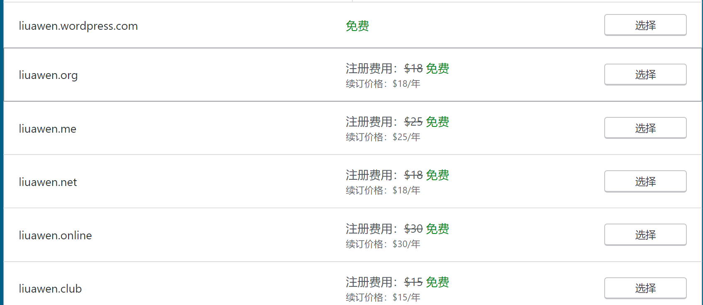
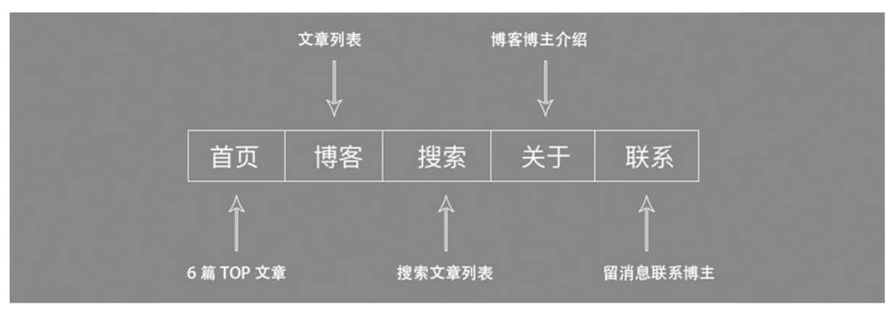
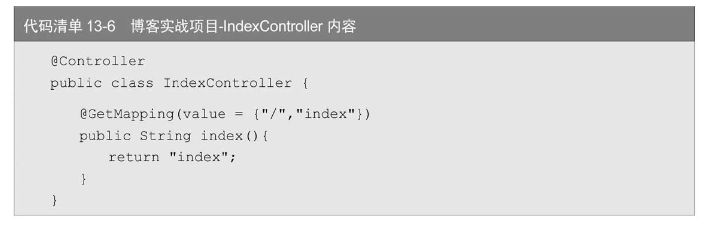
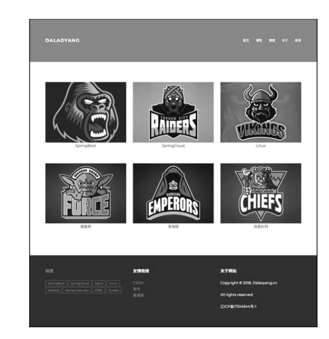
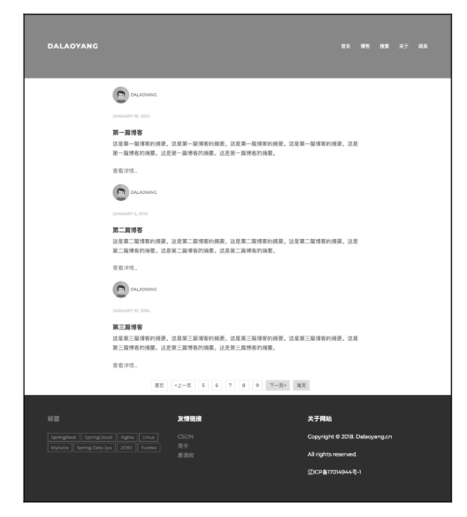
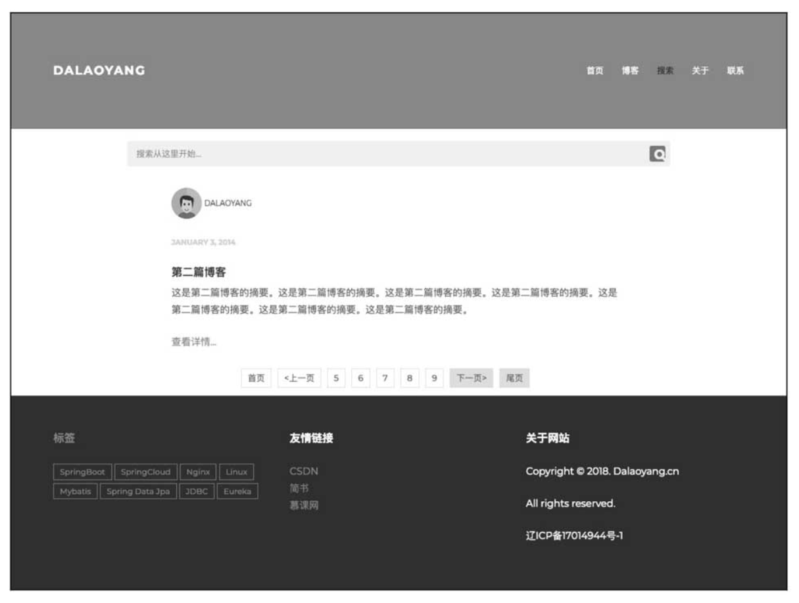
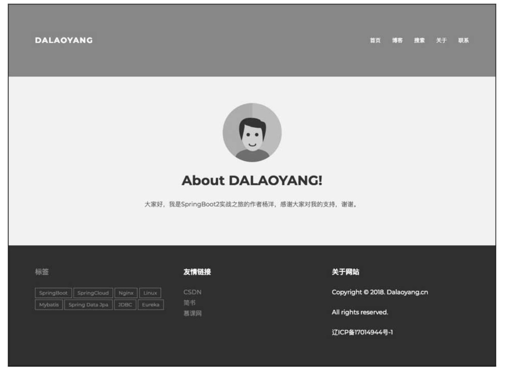
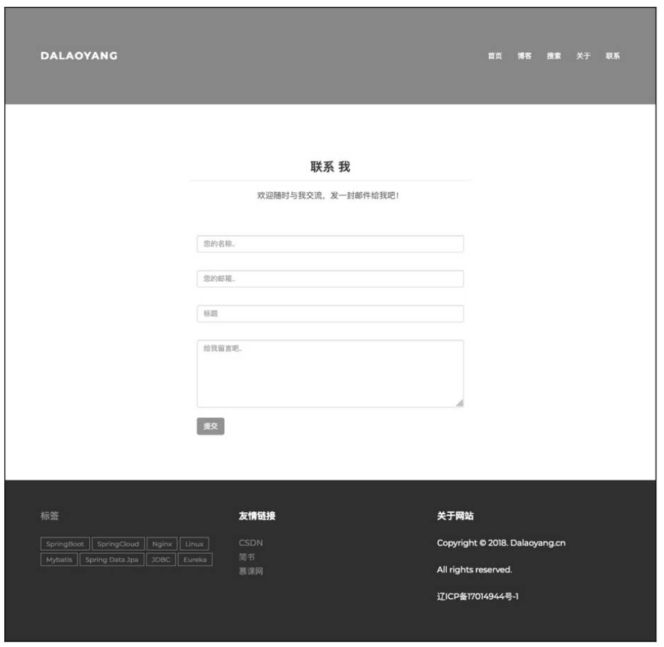
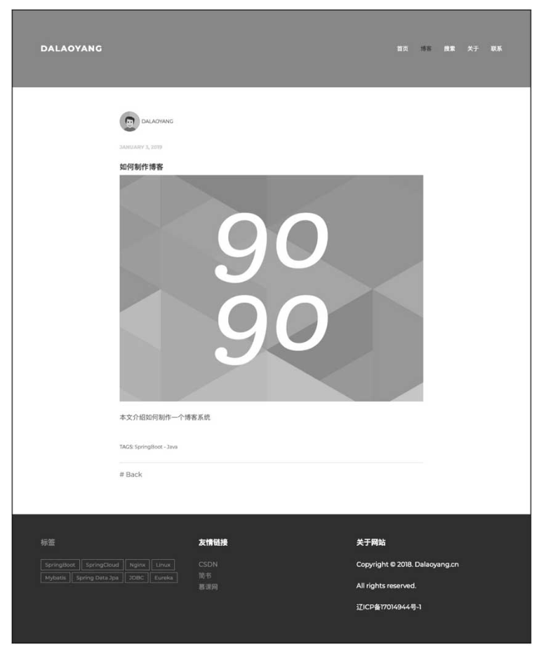
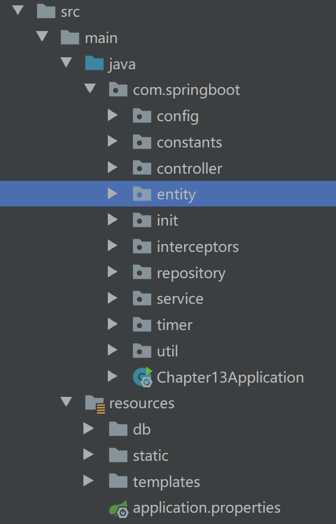

# 第13章　Spring Boot实战之博客系统

前面的章节对Spring Boot进行了阶段性的学习，本章将进行实战演练，利用Spring Boot框架制作一个博客系统。

实战演练 利用Spring Boot框架制作一个博客系统

# 1、博客的制作思路


很多开发者都喜欢利用一些平台进行技术分享，如CSDN、简书、掘金等。当然，也有很多开发者喜欢制作属于自己的博客进行技术分享，如今比较常用的开源博客有Hexo和WordPress。虽然这些开源博客都很不错，但是作为开发者，开发一个个人博客也是很有意思的事情。本章将带领大家开发一个属于自己的博客系统。

[net域名](https://www.west.cn/domains/net.asp)可以不备案吗？net[域名](https://www.west.cn/services/domain/)可以不备案，比如注册的[.net域名](https://www.west.cn/domains/net.asp)使用于投资作用，而非[建站](https://www.west.cn/web/sites/)；或是net域名用于港澳台主机，或国外主机来建站，也是可以不备案。如果net域名用于国内主机做网站域名使用，那么就必须备案。

2018年的新要求规定现在的org域名是不能备案的哦~

如果是国内的主机就需要备案

而.org域名作为老一辈顶级域名也不在体系中，所以2018年后.org域名将不能备案，那么往后工信部会不会在开放了？

互联网一直以来都是个很有趣的东西。而且，以现在的眼光看，互联网还是我们生活中必需的东西，甚至也是个充满着各种势力相互博弈的东西。


但是不管怎么样，要想实现互联网“连接彼此，共享信息”的本质作用，就必需要有以下三种东西：

个人终端：简单说，就是信息的接收端。比如电脑、智能手机、Ipad等等。

企业终端：相关互联网公司把信息集中存储的地方。比如服务器，或者云服务器。

地址：能够让个人终端找到所需要的企业终端的东西，比如IP地址，比如域名。

而关于“地址”，至少在PC互联网时代，最有代表性的就是“域名”了。


所谓的域名，就是一串用“点”分隔的字母，比如weixin .com。域名的具体作用是“和IP地址相互映射的一个分布式数据库”。简单的说，“域名”就是“ip”地址的另一种表现方式。


域名的存在使我们能够通过在浏览器上输入某几个带“.”的字母，就可以直接访问企业终端的服务器，而不用再去记忆复杂的ip地址。


同互联网行业的其他东西一样，域名也是有着巨大的市场价值的。因为服务器的ip地址是唯一的，所以域名也具有唯一性。更何况，域名这种东西，对于中国的互联网企业来说，真正有价值的只有.com.net.org以及.cn这四种后缀。


这也就是为什么会出现“域名抢注”这种现象了。一些容易记忆的，或者有特别含义域名，往往是具有相当大的商业价值的。毕竟物以稀为贵。比如，京东就曾花费几千万购入jd .com。而腾讯则在前不久就fuckqq这一有侮辱性的域名，申请了仲裁。


域名对于互联网行业来说，确实是非常重要的一个东西。不过现在，2018年，有一个很有意思的现象是，国际通用顶级域名市场前三位之一的org域名，竟然不能备案了……

 

虽然你还是可以在域名注册商那里购买到.org域名，不过，不能备案也就意味着你所购买的.org域名不能绑定物理位置在中国境内的服务器。而因为中国有着所说的“长城防火墙”，这也直接导致了.org域名的拥有者，在绑定国外服务器的时候，很可能受到访问速度降低、网络连接可靠性降低等问题。


即使“域名”的作用在移动互联网，在APP大行其道的2018年已经被有所减弱，但是，只要你还有访问网站的需求，那么在相当长的一段时间内，“域名”问题都是值得被关注的。尤其是现在。


虽然org用不了，我们还可以用.com.net.cn甚至.xin.cc等其他域名后缀来代替。不过，在大力鼓吹“互联网+”的中国，如果连世界前三的域名都不能得到官方认可，那么不得不说，是一件很让人觉得不可思议的事。

或者说，这是一件很“丢面子”的事。


小编相信在未来，org域名是能够被开放备案的。不过这个未来，可能是1年，可能是5年，也可能是10年，或者是100年。

“国内注册的域名,没有明确要备案,只要使用国内主机就必须要备案,如果使用美国主机,或者香港主机等国外主机则都不需要备案,国内备案免费不过很慢,而且手续还复杂。”

如果业务主要是国内，那CN也无妨
人家习惯用.COM，但是去不了你的.net，你最好拜托软件COM的不是什么乱七八糟的网站，呵呵，影响形象：）

.com与.net是[国际顶级域名](https://www.baidu.com/s?wd=国际顶级域名&tn=SE_PcZhidaonwhc_ngpagmjz&rsv_dl=gh_pc_zhidao),权重一样。.com好的域名几乎注册已经饱和。.cn是中国国内域名，由于受到国内权限，只能公司注册，是由中国控制注册，权重小于.com与.net，当然全球都可以访问这些域名的网站。如果是建的企业网站，首选是.[com域名](https://www.baidu.com/s?wd=com域名&tn=SE_PcZhidaonwhc_ngpagmjz&rsv_dl=gh_pc_zhidao),在没有合适的.[com域名](https://www.baidu.com/s?wd=com域名&tn=SE_PcZhidaonwhc_ngpagmjz&rsv_dl=gh_pc_zhidao)前掉下选.[cn域名](https://www.baidu.com/s?wd=cn域名&tn=SE_PcZhidaonwhc_ngpagmjz&rsv_dl=gh_pc_zhidao)（如果客户群主要是国内的有公司营业执照的而没有合适的.com前提下注册.[cn域名](https://www.baidu.com/s?wd=cn域名&tn=SE_PcZhidaonwhc_ngpagmjz&rsv_dl=gh_pc_zhidao)比较好）；如果是建的网络公司网站：还是首选.com与.net这两个都可以（在没有合适的.[com域名](https://www.baidu.com/s?wd=com域名&tn=SE_PcZhidaonwhc_ngpagmjz&rsv_dl=gh_pc_zhidao)前提下去选择比较合适的.net域名比较好)。我是专搞网站设计这一块，我的回答希望给你帮助。有什么不懂的也可以找我。baidu下:博路网络


因为，.org域名不能备案这件事儿本身，就怎么想都是不符合逻辑的。而对于不符合逻辑的事，也只好抱着这种乐观积极的心态面对了。

国内注册的域名，没有明确要备案，只要使用国内主机就必须要备案，如果使用美国主机，或者[香港主机](https://www.baidu.com/s?wd=香港主机&tn=SE_PcZhidaonwhc_ngpagmjz&rsv_dl=gh_pc_zhidao)等国外主机则都不需要备案，国内备案免费不过很慢，而且手续还复杂。

　　目前需要审核的域名有以.cn结尾的域名和以.中国　.公司　.网络结尾的域名都需要审核，其它的域名暂时是不需要审核的！所以在注册[com域名](https://www.baidu.com/s?wd=com域名&tn=SE_PcZhidaonwhc_ngpagmjz&rsv_dl=gh_pc_zhidao)的时候只要注解找到[域名注册商](https://www.baidu.com/s?wd=域名注册商&tn=SE_PcZhidaonwhc_ngpagmjz&rsv_dl=gh_pc_zhidao)预测即可。

　　域名备案就是通过国家网监认证的意思，是[工信](https://www.baidu.com/s?wd=工信&tn=SE_PcZhidaonwhc_ngpagmjz&rsv_dl=gh_pc_zhidao)部门为防止一部分人在网络上发布不良信息和做违规犯法的事情而做出的预防措施。其实[域名空间](https://www.baidu.com/s?wd=域名空间&tn=SE_PcZhidaonwhc_ngpagmjz&rsv_dl=gh_pc_zhidao)备案也就和人要上户口一样，备案就是给你的网站上白名单（户口），当黑名单（黑户口）的日子肯定不好过啊！并且如果没有备案，很都搜索引擎都不会收录的。[百度联盟](https://www.baidu.com/s?wd=百度联盟&tn=SE_PcZhidaonwhc_ngpagmjz&rsv_dl=gh_pc_zhidao)也不会通过的，而且很多[免费空间](https://www.baidu.com/s?wd=免费空间&tn=SE_PcZhidaonwhc_ngpagmjz&rsv_dl=gh_pc_zhidao)也不能用！有了备案号。这一切问题就解决了。

为了防止在网上从事非法的网站经营活动，打击不良互联网信息的传播，根据中华人民共和国国务院令第291号《中华人民共和国电信条例》、第292号《互联网信息服务管理办法》（简称ICP管理办法），国家对提供互联网信息服务的ICP实行许可证制度。根据中华人民共和国信息产业部第十二次部务会议审议通过的《非经营性互联网信息服务备案管理办法》条例，在中华人民共和国境内提供非经营性互联网信息服务，应当办理备案。未经备案，不得在中华人民共和国境内从事非经营性互联网信息服务。而对于没有备案的网站将予以罚款或关闭。

.net域名，是互联网最具拓展价值的域名之一。凭借原创性和品质而脱颖而出，.net 已赢得全球人士和企业的信赖，且是当今最受欢迎的域名之一。.net域名是国际顶级域名之一，.net 衍生自 network（网络），最初是为涉及网络技术的公司而开发。如今，.net 是最受欢迎的域名之一，全球各地的很多公司都使用其开始在线业务。与com、edu、org等为最老的一批顶级域名。



制作属于自己的博客进行技术分享 

Hexo  WordPress

开发一个个人博客有意思的事情


（1）静态模板项目制作，将HTML静态项目改为Thymeleaf项目，使用Controller进行跳转。

（2）实体设计，因为使用的是Spring Data JPA，实体设计会决定数据库表的结构。

（3）后台方法代码编写，包含查询数据库、封装数据等。

（4）渲染数据，将后台查询出来的数据动态渲染到Thymeleaf。


静态模板项目制作  HTML静态项目改为Thymeleaf项目  ？？？

Controller进行跳转  

实体设计 因为使用的是Spring Data JPA 实体设计会决定数据库表的结构 

后台方法代码编写 包含查询数据库、封装数据等

渲染数据，将后台查询出来的数据动态渲染到Thymeleaf

## 博客布局介绍

以从网上下载的静态博客模板为例，首先来看博客的布局设计。博客的首页分为上、中、下3部分，其中上方和下方是本博客的公共部分，中间则为每个导航动态显示的内容，分别说明如下。


**网上下载的静态博客模板**

以从网上下载的静态博客模板为例，首先来看博客的布局设计。博客的首页分为上、中、下3部分，其中上方和下方是本博客的公共部分，中间则为每个导航动态显示的内容，分别说明如下。

（1）上方

左边是博客的LOGO，这里以笔者的网名为例，当然读者也可以根据自己的网名或喜欢的名称给博客命名，单击博客LOGO返回博客首页。右边是文章的导航栏，导航栏分为5个模块，即首页、博客页、搜索页、关于页和联系页，单击后可跳转至对应模块。导航栏如图13-1所示。

博客的LOGO  笔者的网名为例

读者    文章的导航栏  首页	博客页	搜索页	关于页  联系页



导航栏

（2）中间

内容为各个模块或功能显示的内容，稍后会详细介绍。

（3）下方

下方分为三部分，左边是标签列表，单击标签列表中的标签会进入标签列表页，单击标签列表页中的某个标签会进入当前标签对应的文章列表页。中间为友情链接列表页，单击链接名会跳转至对应的地址。右边为网站的简介，这里只配置了博客的域名和备案号，读者可以根据自己的需求进行配置。

## 博客功能介绍

博客功能其实就是页面中间部分显示的内容，分为以下几个功能。

（1）首页：首页显示的内容为博客中最后置顶的6篇文章。

置顶的文章  首页

（2）博客页：显示博客中的10篇文章，显示内容包含文章标题、文章作者、头像、文章简介，本页包含分页。

博客页   文章标题  文章作者 头像  文章简介   分页 

（3）搜索页：显示博客中根据关键字搜索出的10篇文章，显示内容包含文章标题、文章作者、头像、文章简介，本页包含分页。

搜索页  显示博客中根据关键字搜索出的10篇文章

显示内容 文章标题 文章作者 头像 文章简介  本页  分页

（4）关于页：关于博主的介绍，这里可以根据系统配置设置一篇文章为关于页的内容。

博主的介绍  关于页  系统配置设置 一篇文章   页的内容  

（5）联系页：可以发送一条消息留言给博主。

联系页  发消息给博主  

评论  回复？？？

（6）标签列表页：显示全部标签，无分页。

标签页

（7）标签对应博客页：根据选择的标签名称显示对应博客列表，暂无分页，读者需要可以加分页。

（8）文章详情页：显示文章的详细内容。

# 2、博客模板制作

本章博客系统使用模板框架Thymeleaf。接下来简单介绍如何将静态HTML页面项目修改为Thymeleaf静态项目。

模板框架 Thymeleaf  

如何将静态HTML页面修改为   Thymeleaf 静态项目 

这里需要提取4个公共模块，提取公共模块与提取公共方法的原因一致，为了避免项目内有太多冗余代码，方便后期修改。这里的公共模块分别说明如下。

•　公共头模块：主要用于引入CSS资源和头部信息。

•　公共导航模块：主要用于引入导航。

•　公共底部模块：主要用于底部信息。

•　公共Js模块：主要用于引入JS资源。


公共头模块

公共导航模块

公共底部模块

公共JS模块

这里以首页为例，其他页面的方法类似。首先制作一个公共头模块，新建HTML页面，这里设置名称为common_head.html，将对应资源放入，使用th:fragment标明当前模块的名称，如代码清单13-1所示。

制作一个公共头模块

新建HTML页面

common_head.html

```html
<html xmlns="http://www.w3.org/1999/xhtml" xmlns:th="http://www.thymeleaf.org">
<!DOCTYPE html>
<html lang="en">
<head th:fragment="commonHeader">
    <meta charset="utf-8">
    <meta http-equiv="X-UA-Compatible" content="IE=edge">
    <meta name="viewport" content="width=device-width, initial-scale=1.0">
    <meta name="description" content="">
    <meta name="author" content="">
    <title>这是一个模板博客</title>
    <link rel="stylesheet" th:href="@{/css/bootstrap.css}" type="text/css">
    <link rel="stylesheet" th:href="@{/css/main.css}" type="text/css">
    <link rel="stylesheet" th:href="@{/css/page.css}">
    <link rel="stylesheet" th:href="@{/css/search.css}">
    <link rel="stylesheet"  th:href="@{/font-awesome-4.4.0/css/font-awesome.min.css}">

</head>
</html>
```

接下来制作其他3个公共模块，新建原理与公共头模块一致。公共导航模块如代码清单13-2所示。


```html
<html xmlns="http://www.w3.org/1999/xhtml" xmlns:th="http://www.thymeleaf.org">
<div th:fragment="commonNavigation">
    <div class="navbar navbar-inverse navbar-static-top">
        <div class="container">
            <div class="navbar-header">
                <button type="button" class="navbar-toggle" data-toggle="collapse" data-target=".navbar-collapse">
                    <span class="icon-bar"></span>
                    <span class="icon-bar"></span>
                    <span class="icon-bar"></span>
                </button>
                <a class="navbar-brand" th:href="@{index}">DALAOYANG</a>
            </div>
            <div class="navbar-collapse collapse">
                <ul class="nav navbar-nav navbar-right">
                    <li><a th:href="@{/index}">首页</a></li>
                    <li><a th:href="@{/blog}">博客</a></li>
                    <li><a th:href="@{/search}">搜索</a></li>
                    <li><a th:href="@{/about}">关于</a></li>
                    <li><a th:href="@{/contact}">联系</a></li>
                </ul>
            </div>
        </div>
    </div>
</div>
```

公共底部模块如代码清单13-3所示

common_footer.html

```html
<html xmlns="http://www.w3.org/1999/xhtml" xmlns:th="http://www.thymeleaf.org">
<div th:fragment="commonFooter">
    <div id="footer">
        <div class="container">
            <div class="row">
                <div class="col-lg-4">
                    <h4><a th:href="@{/tag}">标签</a></h4>
                    <p class="footer-tags">
                         <span th:each="al,iterStat : ${tagList}">
                         <a  target="_blank" th:href="${'/tag/'+al.tagName}" th:text="${al.tagName}"></a>
                        </span>
                    </p>


                </div>

                <div class="col-lg-4">
                    <h4>友情链接</h4>
                    <p >
                        <span th:each="al,iterStat : ${linkList}">
                         <a  target="_blank" th:href="${al.linkUrl}" th:text="${al.linkName}" th:title="${al.remark}"></a><br/>
                        </span>
                    </p>
                </div>

                <div class="col-lg-4">
                    <h4>关于网站</h4>
                    <p>Copyright © 2019. <span th:text="${websiteConfig.domainName}"></span>  </p>
                    <p>All rights reserved.</p>
                    <p><span th:text="${websiteConfig.recordNumber}"></span></p>
                </div>

            </div>

        </div>
    </div>
</div>
```

公共JS模块如代码清单13-4所示。

博客项目实战 - 公共JS模块内容

```html
<html xmlns="http://www.w3.org/1999/xhtml" xmlns:th="http://www.thymeleaf.org">

<!DOCTYPE html>
<html lang="en">
<body>
<div th:fragment="onLoadJs">
    <!-- jQuery -->
    <script th:src="@{/js/jquery-1.10.2.min.js}"></script>
    <script th:src="@{/js/bootstrap.min.js}"></script>
    <script th:src="@{/js/jquery.validate.min.js}"></script>
    <script th:src="@{/js/messages_zh.js}"></script>

    <!-- Custom Theme JavaScript -->
    <script th:src="@{/js/page.js}"></script>
    <script th:src="@{/js/hover.zoom.js}"></script>
    <script th:src="@{/js/hover.zoom.conf.js}"></script>
    <!-- HTML5 shim and Respond.js IE8 support of HTML5 elements and media queries -->
    <!--[if lt IE 9]>
    <script th:src="@{/js/html5shiv.js}"></script>
    <script th:src="@{/js/respond.min.js}"></script>
    <![endif]-->

</div>
</body>
</html>
```

接下来看一下首页的代码。使用th:include引入对应资源，方式为th:include="公共模块位置::公共模块名称"，完整内容如代码清单13-5所示。

index.html

```html
<html xmlns="http://www.w3.org/1999/xhtml" xmlns:th="http://www.thymeleaf.org">
<html lang="en">

  <head th:include="common/common_head::commonHeader"></head>

  <body>

  <div th:include="common/common_navigation :: commonNavigation"></div>
	<div class="container pt">
		<div class="row mt centered">

			<div class="col-lg-4" th:each="al,iterStat : ${articleList}">
				<a class="zoom green" th:href="${'/article/'+al.articleId}"></a>
				<p th:text="${al.articleName}"></p>
			</div>
		</div>
	</div>


	</div>
  <div th:include="common/common_footer :: commonFooter"></div>
  </body>
  <div th:include="common/common_onload_js :: onLoadJs"></div>

</html>

```


其他页面的制作原理类似，这里就不多说了。如果读者感兴趣，可以自己尝试制作，也可以在笔者提供的源代码的基础上开发。关于跳转都是使用Controller，目前的数据都是静态数据，比如首页的跳转如代码清单13-6所示。

```java

```


```java
package com.springboot.controller;

import com.springboot.service.ArticleService;
import org.springframework.beans.factory.annotation.Autowired;
import org.springframework.stereotype.Controller;
import org.springframework.ui.Model;
import org.springframework.web.bind.annotation.GetMapping;


@Controller
public class IndexController {

    @Autowired
    private ArticleService articleService;

    @GetMapping(value = {"/", "index"})
    public String index(Model model) {
        model.addAttribute("articleList", articleService.findIsTopArticleList());
        return "index";
    }
}

```

# 3、效果展示

截至目前，已经完成了Thymeleaf模板项目的制作。接下来我们来看页面效果。首页如图13-2所示。



首页展示图

博客页如图13-3所示。



图13-3　博客页展示图

搜索页如图13-4所示。



图13-4　搜索页展示图

关于页如图13-5所示。



图13-5　关于页展示图

联系页如图13-6所示。



图13-6　联系页展示图

标签页如图13-7所示


图13-7　标签页展示图

标签对应博客页内容与博客列表页一致，这里就不展示了。文章详情页如图13-8所示。



图13-8　文章详情页展示图

# 4、依赖配置

正如前面介绍的，本文使用的前端模板框架是Thymeleaf，数据库为MySQL数据库。因为只有一些简单的查询，所以ORM层使用Spring Data JPA，并且加入了pegdown依赖支持Markdown格式文章转换，依赖内容如代码清单13-7所示。

```xml
	<dependencies>
		<!-- jpa-->
		<dependency>
			<groupId>org.springframework.boot</groupId>
			<artifactId>spring-boot-starter-data-jpa</artifactId>
		</dependency>
		<!-- thymeleaf-->
		<dependency>
			<groupId>org.springframework.boot</groupId>
			<artifactId>spring-boot-starter-thymeleaf</artifactId>
		</dependency>
		<!-- web-->
		<dependency>
			<groupId>org.springframework.boot</groupId>
			<artifactId>spring-boot-starter-web</artifactId>
		</dependency>
		<!-- mysql-->
		<dependency>
			<groupId>mysql</groupId>
			<artifactId>mysql-connector-java</artifactId>
			<scope>runtime</scope>
		</dependency>
		<!-- 去除thymeleaf严格校验-->
		<dependency>
			<groupId>net.sourceforge.nekohtml</groupId>
			<artifactId>nekohtml</artifactId>
			<version>1.9.22</version>
		</dependency>
		<!-- lombok-->
		<dependency>
			<groupId>org.projectlombok</groupId>
			<artifactId>lombok</artifactId>
			<version>1.16.20</version>
		</dependency>
		<!-- 转换markdown-->
		<dependency>
			<groupId>org.pegdown</groupId>
			<artifactId>pegdown</artifactId>
			<version>1.6.0</version>
		</dependency>
		<!-- commons-lang-->
		<dependency>
			<groupId>commons-lang</groupId>
			<artifactId>commons-lang</artifactId>
			<version>2.6</version>
		</dependency>
		<!-- commons-collections-->
		<dependency>
			<groupId>commons-collections</groupId>
			<artifactId>commons-collections</artifactId>
			<version>3.2.2</version>
		</dependency>
	</dependencies>

	<build>
		<plugins>
			<plugin>
				<groupId>org.springframework.boot</groupId>
				<artifactId>spring-boot-maven-plugin</artifactId>
			</plugin>
		</plugins>
	</build>
```

# 5、配置文件

配置文件配置类Thymeleaf的缓存设置，这里暂时设置为false，当全部开发完成后，可以设置为true，剩余只配置了数据库和JPA，端口号设置的是10000。完整配置如代码清单13-8所示。

端口号

禁用thymeleaf缓存

数据库配置

数据库地址

数据库用户名

数据库密码

数据库驱动

none 启动时不做任何操作

控制台打印sql

```
##\u7AEF\u53E3\u53F7
server.port=10000
##\u7981\u7528thymeleaf\u7F13\u5B58
spring.thymeleaf.cache=false

##\u6570\u636E\u5E93\u914D\u7F6E
##\u6570\u636E\u5E93\u5730\u5740
spring.datasource.url=jdbc:mysql://localhost:3306/springbootBlog?characterEncoding=utf8&useSSL=false
##\u6570\u636E\u5E93\u7528\u6237\u540D
spring.datasource.username=root
##\u6570\u636E\u5E93\u5BC6\u7801
spring.datasource.password=root
##\u6570\u636E\u5E93\u9A71\u52A8
spring.datasource.driver-class-name=com.mysql.jdbc.Driver

##none  \u542F\u52A8\u65F6\u4E0D\u505A\u4EFB\u4F55\u64CD\u4F5C
spring.jpa.hibernate.ddl-auto=update
##\u63A7\u5236\u53F0\u6253\u5370sql
spring.jpa.show-sql=true


```

# 6、后台实体

接下来介绍博客需要的几张表，由于使用JPA进行操作，因此创建了对应的实体类，可以在数据库中生成对应的表。

## 文章表

文章表主要记录文章信息，是博客最主要的表，表名为article，针对当前案例设置了以下几个字段属性。


•　articleId：文章主键ID，设置主键自增列。

•　articleName：文章名称。

•　articleContent：文章内容，设置字段类型为TEXT。•　articleAuthors：文章作者。

•　articleInputDate：文章录入日期，设置字段类型为Date。

•　articleReadingTime：文章阅读次数。

•　isTop：是否置顶。

•　isEnable：是否启用（可以理解为是否发布）。

•　tagList：设置与标签表的多对多关系。

springbootBlog

```
INSERT INTO `springbootBlog`.`article`(`article_id`, `article_authors`, `article_content`, `article_input_date`, `article_name`, `article_reading_time`, `is_enable`, `is_top`) VALUES (1, 'dalaoyang', '这是第一篇博客的摘要。这是第一篇博客的摘要。这是第一篇博客的摘要。这是第一篇博客的摘要。这是第一篇博客的摘要。这是第一篇博客的摘要。这是第一篇博客的摘要。', '2019-01-01 00:00:00', '第一篇博客', 1, 1, 1);
```

comment 

bigint 

例子

```sql
DROP TABLE IF EXISTS `mall_product`;
CREATE TABLE `mall_product` (
  `id` int(11) NOT NULL AUTO_INCREMENT COMMENT '商品id',
  `category_id` int(11) NOT NULL COMMENT '分类id,对应mall_category表的主键',
  `name` varchar(100) NOT NULL COMMENT '商品名称',
  `subtitle` varchar(200) DEFAULT NULL COMMENT '商品副标题',
  `main_image` varchar(500) DEFAULT NULL COMMENT '产品主图,url相对地址',
  `sub_images` text COMMENT '图片地址,json格式,扩展用',
  `detail` text COMMENT '商品详情',
  `price` decimal(20,2) NOT NULL COMMENT '价格,单位-元保留两位小数',
  `stock` int(11) NOT NULL COMMENT '库存数量',
  `status` int(6) DEFAULT '1' COMMENT '商品状态.1-在售 2-下架 3-删除',
  `create_time` datetime DEFAULT NULL COMMENT '创建时间',
  `update_time` datetime DEFAULT NULL COMMENT '更新时间',
  PRIMARY KEY (`id`)
) ENGINE=InnoDB DEFAULT CHARSET=utf8;
```


tinyint

datetime

primary key

engine=InnoDB auto_increment=1 default charset = utf8 commit =``

```sql
drop table if exists `article`;
create table `article`(
	`article_id` int(11) NOT NULL AUTO_INCREMENT COMMENT `文章ID`,
    `article_name` varchar(255) DEFAULT NULL  COMMENT `文章名称`,
    `article_content`  text DEFAULT NULL COMMENT `文章内容`,
    `article_input_date` datetime DEFAULT NULL COMMENT '文章录入日期',
    `article_reading_time`  int(11) DEFAULT NULL COMMENT `文章阅读次数`,
    `is_enable` int(4) DEFAULT NULL COMMENT `是否发布`,
    `is_top` int(4) DEFAULT NULL COMMENT `是否置顶`
)
```

`article_id`, `article_authors`, `article_content`, `article_input_date`, `article_name`, `article_reading_time`, `is_enable`, `is_top`

•　articleId：文章主键ID，设置主键自增列。

•　articleName：文章名称。

•　articleContent：文章内容，设置字段类型为TEXT。•　articleAuthors：文章作者。

•　articleInputDate：文章录入日期，设置字段类型为Date。

•　articleReadingTime：文章阅读次数。

•　isTop：是否置顶。

•　isEnable：是否启用（可以理解为是否发布）。

•　tagList：设置与标签表的多对多关系。

default

接下来介绍的几个属性是在项目内使用的，并非数据库字段。

•　imageNo：文章对应图片，案例中只在首页置顶文章中设置了对应的图片。

•　articleIntroduction：文章简介，用于文章列表页、搜索页、标签文章页展示文章简介，案例中是将文章内容去除HTML标签内容后，截取100个字符组成。

•　articleShowContent：展示文章内容，因为支持Markdown语法，所以需要将Markdown格式文章内容直接存储到数据库中，案例中使用这个字段展示文章详细内容。

完整article实体类内容如代码清单13-9所示。

```java
package com.springboot.entity;

import lombok.AllArgsConstructor;
import lombok.Data;
import lombok.NoArgsConstructor;

import javax.persistence.*;
import java.io.Serializable;
import java.util.Date;
import java.util.List;

@Entity
@Table(name = "article")
@Data
@AllArgsConstructor
@NoArgsConstructor
public class Article implements Serializable {

    private static final long serialVersionUID = 4967006908141911451L;
    @Id
    @GeneratedValue(strategy = GenerationType.IDENTITY)
    private Long articleId;
    private String articleName;
    @Lob
    @Column(columnDefinition = "TEXT")
    private String articleContent;
    private String articleAuthors;
    @Temporal(TemporalType.DATE)
    private Date articleInputDate;
    private Integer articleReadingTime;
    private Integer isTop;
    private Integer isEnable;

    @ManyToMany
    @JoinTable(name = "articleTag", joinColumns = {@JoinColumn(name = "articleId")}, inverseJoinColumns = {@JoinColumn(name = "tagId")})
    private List<Tag> tagList;

    //项目内使用，非数据库字段
    @Transient
    private int imageNo;
    @Transient
    private String articleIntroduction;
    @Transient
    private String articleShowContent;

}

```

## 标签表

标签表主要记录标签信息，表名为tag，针对当前案例设置如下字段。

•　tagId：标签表主键ID，设置主键自增列。

•　tagName：标签名称。

•　tagInputDate：标签录入日期，设置字段类型为Date。•　articleList：设置与文章表的多对多关系。

标签固定的吗？  不是     每次用户直接创建咯


完整tag实体类内容如代码清单13-10所示。

```java
package com.springboot.entity;


import lombok.AllArgsConstructor;
import lombok.Data;
import lombok.NoArgsConstructor;

import javax.persistence.*;
import java.io.Serializable;
import java.util.Date;
import java.util.List;

@Entity
@Table(name = "tag")
@Data
@AllArgsConstructor
@NoArgsConstructor
public class Tag implements Serializable {

    private static final long serialVersionUID = -7536613142331362542L;
    @Id
    @GeneratedValue(strategy = GenerationType.IDENTITY)
    private Long tagId;
    private String tagName;
    @Temporal(TemporalType.DATE)
    private Date tagInputDate;

    @ManyToMany
    @JoinTable(name = "articleTag", joinColumns = {@JoinColumn(name = "tagId")}, inverseJoinColumns = {@JoinColumn(name = "articleId")})
    private List<Article> articleList;

}

```

## 链接表

链接表其实可以理解为博客内友情链接存储的数据表，表名为link，针对当前案例设置如下字段。

•　linkId：链接表主键ID，设置主键自增列。

•　linkName：友情链接名称。

•　linkUrl：友情链接地址。

•　remark：友情链接备注。

完整link实体类内容如代码清单13-11所示。

```java
package com.springboot.entity;

import lombok.AllArgsConstructor;
import lombok.Data;
import lombok.NoArgsConstructor;

import javax.persistence.*;
import java.io.Serializable;

@Entity
@Table(name = "link")
@Data
@AllArgsConstructor
@NoArgsConstructor
public class Link implements Serializable {
    private static final long serialVersionUID = -4725937550197599617L;
    @Id
    @GeneratedValue(strategy = GenerationType.IDENTITY)
    private Long linkId;
    private String linkName;
    private String linkUrl;
    private String remark;
}

```

## 消息表

消息表主要用于记录访客在联系页给博主留言的信息，表名为message，针对当前案例设置如下字段。

•　messageId：消息表主键ID，设置主键自增列。•　email：发消息人的邮箱地址。•　name：发消息人的名称。•　subject：消息的主题。•　messageContent：消息的内容，设置字段类型为TEXT。•　messageInputDate：消息发送的时间。•　isRead：是否已读。

完整message实体类内容如代码清单13-12所示。

```java
package com.springboot.entity;

import lombok.AllArgsConstructor;
import lombok.Data;
import lombok.NoArgsConstructor;

import javax.persistence.*;
import java.io.Serializable;
import java.util.Date;

@Entity
@Table(name = "message")
@Data
@AllArgsConstructor
@NoArgsConstructor
public class Message implements Serializable {
    private static final long serialVersionUID = -5529232129767452275L;
    @Id
    @GeneratedValue(strategy = GenerationType.IDENTITY)
    private Long messageId;
    private String email;
    private String name;
    private String subject;
    @Lob
    @Column(columnDefinition="TEXT")
    private String messageContent;
    private Date messageInputDate;
    private Integer isRead;
}

```

## 博客访问记录表

博客访问记录表主要用于记录以日为单位博客的访问次数，表名为website_access，针对当前案例设置如下字段。

•　id：博客访问记录表主键ID，设置主键自增列。•　accessDate：访问记录的日期，设置字段类型为Date。•　accessCount：访问的次数。

完整WebsiteAccess实体类内容如代码清单13-13所示。

```java
package com.springboot.entity;

import lombok.AllArgsConstructor;
import lombok.Data;
import lombok.NoArgsConstructor;

import javax.persistence.*;
import java.io.Serializable;
import java.util.Date;

@Entity
@Table(name = "websiteAccess")
@Data
@AllArgsConstructor
@NoArgsConstructor
public class WebsiteAccess implements Serializable {
    private static final long serialVersionUID = 6948407037095536818L;
    @Id
    @GeneratedValue(strategy = GenerationType.IDENTITY)
    private Long id;
    @Temporal(TemporalType.DATE)
    private Date accessDate;
    private Integer accessCount;
}

```

## 博客配置表

博客配置表主要用于记录一些博客的配置信息，表名为website_config，针对当前案例设置了如下字段。•　Id：博客配置表主键ID，设置主键自增列。•　blogName：博客名称。•　authorName：博主名称。•　aboutPageArticleId：介绍博主页面的文章ID。•　recordNumber：备案号。•　domainName：域名。•　emailUsername：博主邮箱地址。

完整WebsiteConfig实体类内容如代码清单13-14所示。

```java
package com.springboot.entity;

import lombok.AllArgsConstructor;
import lombok.Data;
import lombok.NoArgsConstructor;

import javax.persistence.*;
import java.io.Serializable;

@Entity
@Table(name = "websiteConfig")
@Data
@AllArgsConstructor
@NoArgsConstructor
public class WebsiteConfig implements Serializable {
    private static final long serialVersionUID = 7023358255818152969L;
    @Id
    private Long Id;
    private String blogName;
    private String authorName;
    private Long aboutPageArticleId;
    private String recordNumber;
    private String domainName;
    private String emailUsername;
}

```

## init.sql

```sql
## init article
INSERT INTO `springbootBlog`.`article`(`article_id`, `article_authors`, `article_content`, `article_input_date`, `article_name`, `article_reading_time`, `is_enable`, `is_top`) VALUES (1, 'dalaoyang', '这是第一篇博客的摘要。这是第一篇博客的摘要。这是第一篇博客的摘要。这是第一篇博客的摘要。这是第一篇博客的摘要。这是第一篇博客的摘要。这是第一篇博客的摘要。', '2019-01-01 00:00:00', '第一篇博客', 1, 1, 1);
INSERT INTO `springbootBlog`.`article`(`article_id`, `article_authors`, `article_content`, `article_input_date`, `article_name`, `article_reading_time`, `is_enable`, `is_top`) VALUES (2, 'dalaoyang', '这是第二篇博客的摘要。这是第二篇博客的摘要。这是第二篇博客的摘要。这是第二篇博客的摘要。这是第二篇博客的摘要。这是第二篇博客的摘要。这是第二篇博客的摘要。', '2019-01-01 00:00:00', '第二篇博客', 1, 1, 1);
INSERT INTO `springbootBlog`.`article`(`article_id`, `article_authors`, `article_content`, `article_input_date`, `article_name`, `article_reading_time`, `is_enable`, `is_top`) VALUES (3, 'dalaoyang', '这是第三篇博客的摘要。这是第三篇博客的摘要。这是第三篇博客的摘要。这是第三篇博客的摘要。这是第三篇博客的摘要。这是第三篇博客的摘要。这是第三篇博客的摘要。', '2019-01-01 00:00:00', '第三篇博客', 1, 1, 1);
INSERT INTO `springbootBlog`.`article`(`article_id`, `article_authors`, `article_content`, `article_input_date`, `article_name`, `article_reading_time`, `is_enable`, `is_top`) VALUES (4, 'dalaoyang', '这是第四篇博客的摘要。这是第四篇博客的摘要。这是第四篇博客的摘要。这是第四篇博客的摘要。这是第四篇博客的摘要。这是第四篇博客的摘要。这是第四篇博客的摘要。', '2019-01-01 00:00:00', '第四篇博客', 1, 1, 1);
INSERT INTO `springbootBlog`.`article`(`article_id`, `article_authors`, `article_content`, `article_input_date`, `article_name`, `article_reading_time`, `is_enable`, `is_top`) VALUES (5, 'dalaoyang', '这是第五篇博客的摘要。这是第五篇博客的摘要。这是第五篇博客的摘要。这是第五篇博客的摘要。这是第五篇博客的摘要。这是第五篇博客的摘要。这是第五篇博客的摘要。', '2019-01-01 00:00:00', '第五篇博客', 1, 1, 1);
INSERT INTO `springbootBlog`.`article`(`article_id`, `article_authors`, `article_content`, `article_input_date`, `article_name`, `article_reading_time`, `is_enable`, `is_top`) VALUES (6, 'dalaoyang', '这是第六篇博客的摘要。这是第六篇博客的摘要。这是第六篇博客的摘要。这是第六篇博客的摘要。这是第六篇博客的摘要。这是第六篇博客的摘要。这是第六篇博客的摘要。', '2019-01-01 00:00:00', '第六篇博客', 1, 1, 1);
INSERT INTO `springbootBlog`.`article`(`article_id`, `article_authors`, `article_content`, `article_input_date`, `article_name`, `article_reading_time`, `is_enable`, `is_top`) VALUES (7, 'dalaoyang', '大家好，我是SpringBoot2实战之旅的作者杨洋，感谢大家对我的支持，谢谢。\n\n', '2019-02-21', 'About DALAOYANG!\n\n', 0, 0, 0);
## init link
INSERT INTO `springbootBlog`.`link`(`link_id`, `link_name`, `link_url`, `remark`) VALUES (1, '简书', 'https://www.jianshu.com/u/128b6effde53', '简书地址');
INSERT INTO `springbootBlog`.`link`(`link_id`, `link_name`, `link_url`, `remark`) VALUES (2, 'DALAOYANG', 'https://www.dalaoyang.cn', 'dalaoyang的博客');
## init tag
INSERT INTO `springbootBlog`.`tag`(`tag_id`, `tag_name`) VALUES (1, 'SpringBoot');
INSERT INTO `springbootBlog`.`tag`(`tag_id`, `tag_name`) VALUES (2, 'SpringCloud');
INSERT INTO `springbootBlog`.`tag`(`tag_id`, `tag_name`) VALUES (3, 'Nginx');
INSERT INTO `springbootBlog`.`tag`(`tag_id`, `tag_name`) VALUES (4, 'Linux');
INSERT INTO `springbootBlog`.`tag`(`tag_id`, `tag_name`) VALUES (5, 'Tomcat');
INSERT INTO `springbootBlog`.`tag`(`tag_id`, `tag_name`) VALUES (6, 'Java');
## init article_tag
INSERT INTO `springbootBlog`.`article_tag`(`article_id`, `tag_id`) VALUES (1, 1);
INSERT INTO `springbootBlog`.`article_tag`(`article_id`, `tag_id`) VALUES (1, 3);
INSERT INTO `springbootBlog`.`article_tag`(`article_id`, `tag_id`) VALUES (2, 3);
INSERT INTO `springbootBlog`.`article_tag`(`article_id`, `tag_id`) VALUES (2, 6);
INSERT INTO `springbootBlog`.`article_tag`(`article_id`, `tag_id`) VALUES (3, 1);
INSERT INTO `springbootBlog`.`article_tag`(`article_id`, `tag_id`) VALUES (4, 2);
INSERT INTO `springbootBlog`.`article_tag`(`article_id`, `tag_id`) VALUES (5, 1);
INSERT INTO `springbootBlog`.`article_tag`(`article_id`, `tag_id`) VALUES (6, 2);

## maybe error----------
##init website_config
INSERT INTO `springbootBlog`.`website_config`(`id`, `about_page_article_id`, `author_name`, `blog_name`, `email_username`,  `domain_name`, `record_number`) VALUES (1, 7, 'dalaoyang', 'SpringBoot博客', 'smtp.aliyun.com',  'Dalaoyang.cn', '辽ICP备17014944号-1');
##init website_access
INSERT INTO `springbootBlog`.`website_access`(`id`, `access_count`, `access_date`) VALUES (1, 0, now());

```


# 7、主功能

首先来看本案例应用程序的目录结构，如图13-9所示。



[插图]图13-9　项目目标结构图其中，每个包对应的功能如下。•　config：配置，案例中用于配置拦截器。•　constants：常量，案例中常量类所在包。•　controller：控制层，案例中控制层大多只用于封装数据和页面跳转。•　entity：实体，在13.6节已经介绍了。•　init：初始化，用于初始化应用中的数据。•　interceptors：拦截器，案例中用于更新博客访问次数和初始化底部数据。•　repository：数据操作层，用于JPA操作数据库。•　service：业务层，案例中用于调用数据操作层和一些业务逻辑处理。•　timer：定时器，案例中的定时器主要用于在每日凌晨创建博客访问数据表记录。•　util：工具，案例中包含两个工具类：Markdown转换工具类和去除HTML标签工具类。

头部内容是写死的。当然，读者也可以在配置类中配置，然后动态渲染，底部稍后会介绍。这里以博客页、搜索页、文章详情页和联系页为例介绍博客主流程的代码编写。

## 博客页

博客页中间部分是由10条已发布的文章数据组成的，带有分页，并且根据articleId进行倒叙排序，所以我们需要从数据库查询数据展示页面。由于使用了分页并且需要查询已经发布的文章，因此需要传入Pageable分页对象和isEnable是否发布标示。Repository层的方法如代码清单13-15所示。

```java
 Page<Article> findAllByIsEnable(Integer isEnable, Pageable pageable);
```

博客页数数据操作层内容

```java
package com.springboot.repository;

import com.springboot.entity.Article;
import org.springframework.data.domain.Page;
import org.springframework.data.domain.Pageable;
import org.springframework.data.jpa.repository.JpaRepository;
import org.springframework.data.jpa.repository.JpaSpecificationExecutor;


public interface ArticleRepository extends JpaRepository<Article, Long>, JpaSpecificationExecutor<Article> {

    Page<Article> findAllByIsTopAndIsEnable(Integer isTop, Integer isEnable, Pageable pageable);

    Article findByIsEnableAndArticleId(Integer isEnable,Long articleId);

    Page<Article> findAllByIsEnable(Integer isEnable, Pageable pageable);
}

```

在Service层构建分页所需的Pageable，然后调用Repository层的方法，并且在方法上加入@Cacheable注解使用缓存。Service层内容如代码清单13-16所示。

博客页Service层内容

```java
   @Override
    @Cacheable(value = "blogArticle", key = "#page")
    public Page<Article> findBlogArticleList(int page, int size) {
        Pageable pageable = PageRequest.of(page, size, Sort.Direction.DESC, "articleId");
        return articleRepository.findAllByIsEnable(Constants.YES, pageable);
    }
```

博客页Controller层包含两个方法，映射路径分别是/blog和/blog/{pageNumber}，后者使用路径中的pageNumber作为页码进行分页查询，然后将查询到的数据进行循环遍历，文章详情去HTML标签设置到articleIntroduction属性中。完整BlogController内容如代码清单13-17所示。

```java
package com.springboot.controller;

import com.springboot.constants.Constants;
import com.springboot.entity.Article;
import com.springboot.service.ArticleService;
import com.springboot.util.HtmlSpirit;
import org.springframework.beans.factory.annotation.Autowired;
import org.springframework.data.domain.Page;
import org.springframework.stereotype.Controller;
import org.springframework.ui.Model;
import org.springframework.web.bind.annotation.GetMapping;
import org.springframework.web.bind.annotation.PathVariable;

import java.util.List;


@Controller
public class BlogController {
    @Autowired
    private ArticleService articleService;

    @GetMapping("/blog")
    public String blog(Model model) {
        return this.blog(model, 1);
    }

    @GetMapping("/blog/{pageNumber}")
    public String blog(Model model, @PathVariable Integer pageNumber) {
        if (pageNumber == null) {
            pageNumber = 1;
        }
        Page<Article> articlePage = articleService.findBlogArticleList((pageNumber-1)*Constants.defaultPageSize,Constants.defaultPageSize );
        List<Article> articleList = articlePage.getContent();
        articleList.forEach(article -> {
            String articleIntroduction = HtmlSpirit.delHTMLTag(article.getArticleContent());
            article.setArticleIntroduction(articleIntroduction.length() > 100 ? articleIntroduction.substring(0, 100) : articleIntroduction);
        });
        model.addAttribute("articleList", articleList);
        model.addAttribute("totalCount", articlePage.getTotalElements());
        model.addAttribute("pageNumber", pageNumber);
        return "blog";
    }
}

```

最后查看页面展示，使用th:each进行迭代集合，使用th:text进行集合内对象内容的展示。这里的内容很简单，就不做太多介绍了。完整内容如代码清单13-18所示。

博客前端页面

## 搜索页

## 文章详情页

## 联系页

# 8、辅助功能

本案例中的辅助功能其实并不是很多，有拦截器、定时器和初始化数据方法。接下来分别进行介绍。

## 拦截器

案例中拦截器的主要作用是加载底部数据和更新网站访问次数，完整内容如代码清单13-29所示。

拦截器内容

## 定时器

案例中定时器使用Spring定时任务，主要用于在设定时间插入每日访问统计的记录，完整内容如代码清单13-30所示。

定时器内容

## 初始化

这个方法只是在没有数据测试的时候报错才添加的，是在拦截器更新网站访问次数的时候，website_access表内没有数据引起的。所以这里设置了一个方法，查询当天是否存在website_access表的数据，如果不存在，就插入一条。博客配置表也存在同样的问题，不存在数据的话，需要插入一条默认数据来避免这个问题。当然，读者也可以选择别的方式处理这个问题。完整内容如代码清单13-31所示。

辅助功能到这里就大致结束了。其实博客还有很多地方可以扩展，读者可以自由发挥。

# 9、小结

本章介绍了如何使用之前学习的内容构建一个博客系统，建议读者在笔者制作的Thymeleaf模板的基础上进行练习。

另外，笔者写了一个SQL脚本供大家预设数据进行测试，如代码清单13-32所示。