# 第14章　Spring Boot实战之博客后台系统

一个简单的博客系统

第13章介绍了如何利用Spring Boot制作博客，但是只有一个博客系统，每次发布文章时都需要手动向数据库插入数据，这样显然有些麻烦。本章将带领读者结合第13章的博客创建一个博客后台系统。

# 1、博客后台的制作思路

博客后台系统用于维护博客的一些相关信息，如文章的管理、标签的管理、友情链接的管理及博客数据的统计等，制作思路与制作博客系统一致。我们回顾一下制作思路：

（1）静态模板项目制作，将HTML静态项目改为Thymeleaf项目，使用Controller进行跳转。（2）实体设计，因为使用的是Spring Data JPA，所以实体设计决定着数据库表的结构。（3）后台方法代码编写，包含查询数据库、封装数据等。

（4）渲染数据，将后台查询出来的数据动态渲染到Thymeleaf。

## 博客后台布局介绍

案例博客布局分为4部分，其中头部、底部和左侧导航部分是公用部分，右侧为根据左侧导航动态显示的内容。4部分分别说明如下。

头部

底部 

左侧导航部分是公用部分

头部：头部左侧为博客后台系统名称，右侧有3个功能，铃铛图标显示当日博客的内容信息，包括有几条未读消息、几篇新增文章、几个新增标签；邮件图标显示最近有几条未读消息；最右侧为退出登录按钮。

左侧导航：左侧导航分为7个模块，分别是首页、文章管理、标签管理、友情链接管理、用户管理、消息管理、系统管理。其中，文章管理、标签管理、友情链接管理和用户管理包含二级菜单，如图14-1所示。

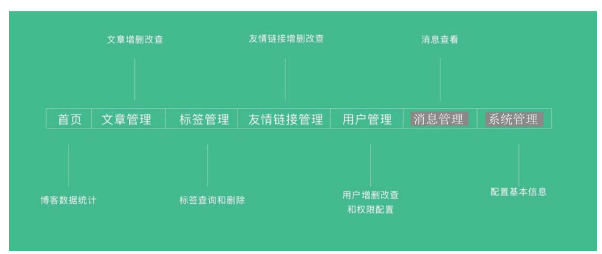

左侧导航结构图

右侧内容：右侧显示模块对应的内容，为各个模块或功能显示的内容，稍后会详细介绍。

底部：底部只显示一些博客配置信息，如域名和备案号，比较简单。

## 博客功能介绍

博客功能部分就是图14-1中单击导航显示的对应内容，分为以下几个功能。

（1）首页：首页主要是统计一些文章的信息，如文章数量统计、标签数量统计、友情链接数量统计、消息数量统计、当日访问量、本周访问量、当月访问量、总访问量和近10日访问统计图表。

首页 统计  文章的信息   文章数量 标签 友情链接   消息 访问量 

访问统计图表

（2）文章管理：文章管理分为两个子菜单：文章列表和新增文章。文章列表页可以查询文章、预览文章（需要跳转到博客系统），单击“修改文章”跳转到修改文章页面，可以启动和禁用文章、删除文章。新增文章页用于增添文章和修改文章。

文章管理  

文章列表   查询文章 预览文章    修改文章  删除文章

新增文章  增添文章

（3）标签管理：标签管理中含有标签列表页子菜单。标签列表页可以查询标签和删除标签。

标签管理    标签列表页  子菜单   

标签列表页  查询标签 删除标签

（4）友情链接管理：友情链接管理包含友情链接列表和新增友情链接，友情链接列表页包含查询友情链接、删除友情链接和修改友情链接。新增友情链接页用于新增和修改友情链接。

（5）用户管理：用户管理中含有用户列表和新增用户。用户列表页可以查询用户、修改用户和禁用用户。新增用户页用于新增和修改用户。

（6）消息管理：消息管理用于查看消息列表和查询某条消息详情。

回复？

（7）系统管理：系统管理用于修改博客系统配置信息。

# 2、博客后台模板制作

博客后台模板制作与第13章一致，大体思路就是将一些通用的配置和模块提取出来，这里不再赘述，读者可以根据第13章的提取方法进行博客后台模板的制作。

# 3、效果展示

本节来看一下博客后台的效果图。登录页如图14-2所示。

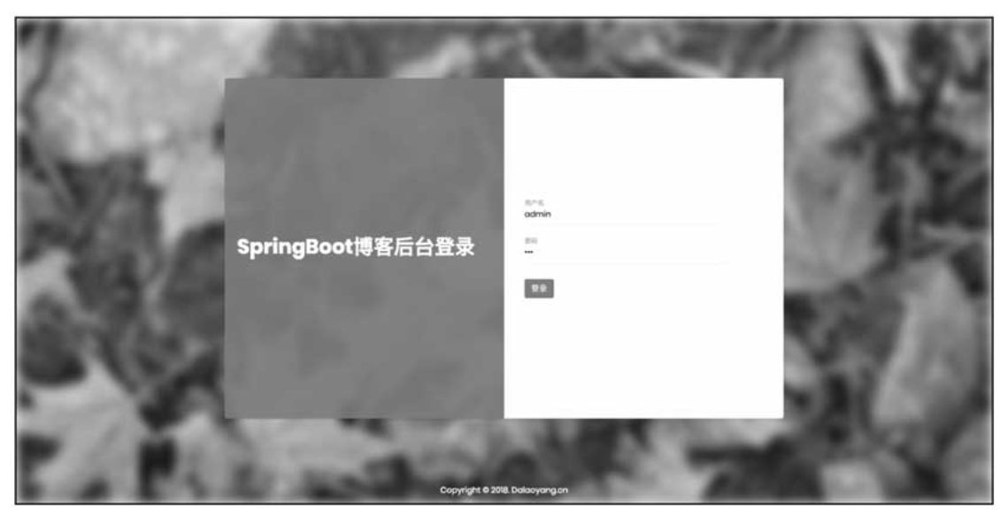

登录页效果图

首页如图14-3所示。

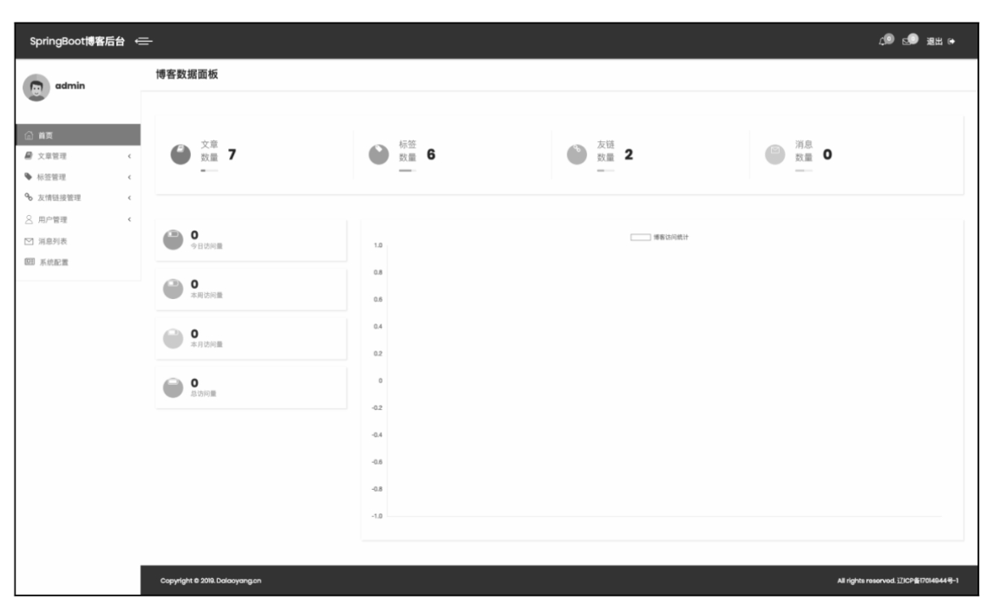

图14-3　首页效果图

文章列表页如图14-4所示。

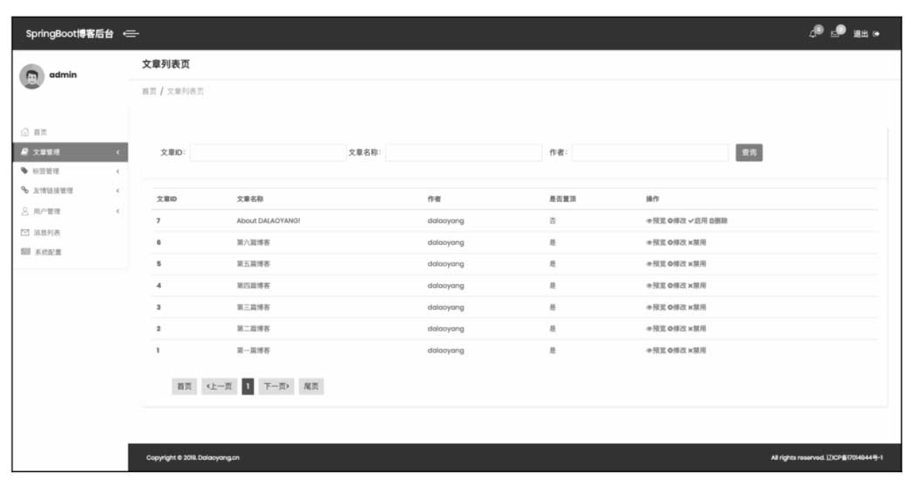

图14-4　文章列表页效果图

文章编辑页如图14-5所示。

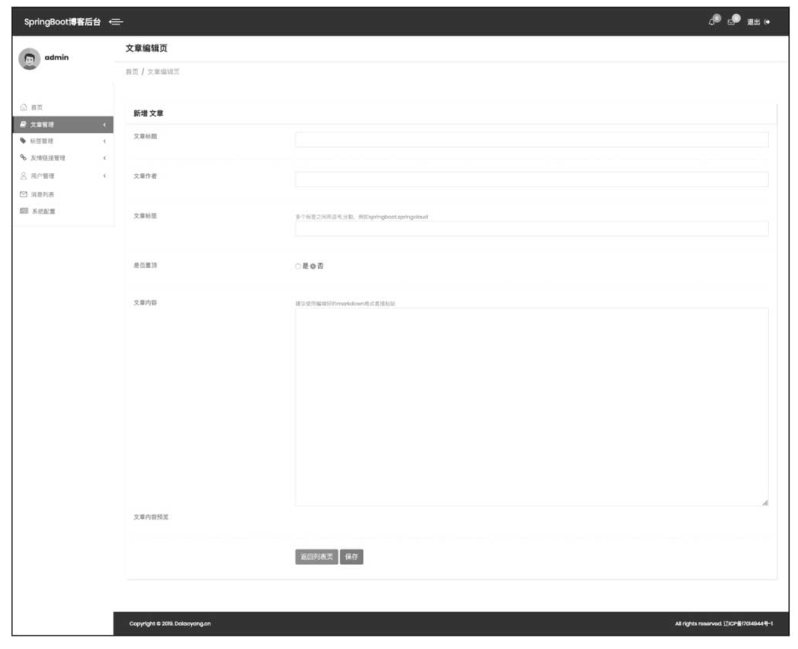

图14-5　文章编辑页效果图

标签列表页如图14-6所示。

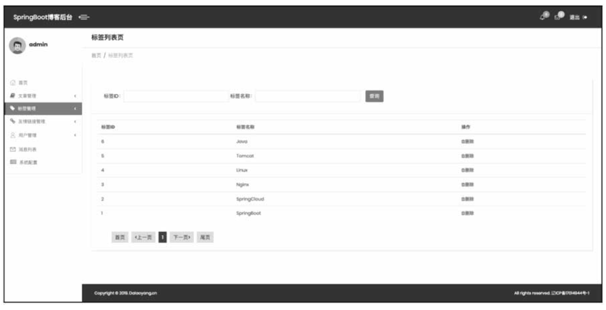

标签列表页效果图

友情链接列表页如图14-7所示。

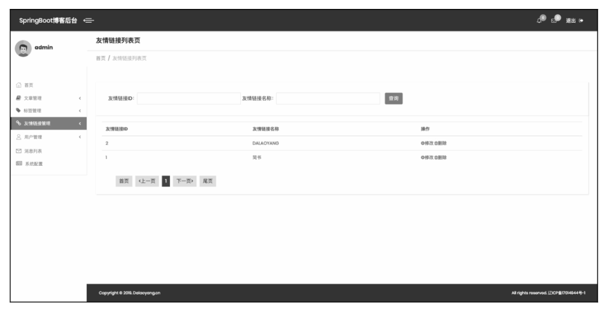

友情链接列表页效果图

友情链接编辑页如图14-8所示。

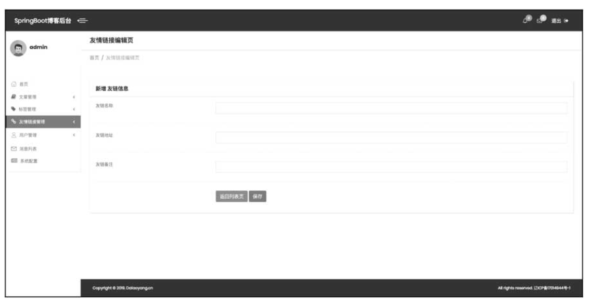

图14-8　友情链接编辑页效果图

用户列表页如图14-9所示。

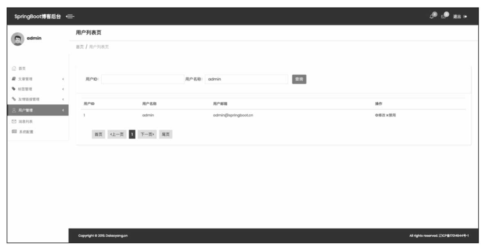

图14-9　用户列表页效果图

用户编辑页如图14-10所示。

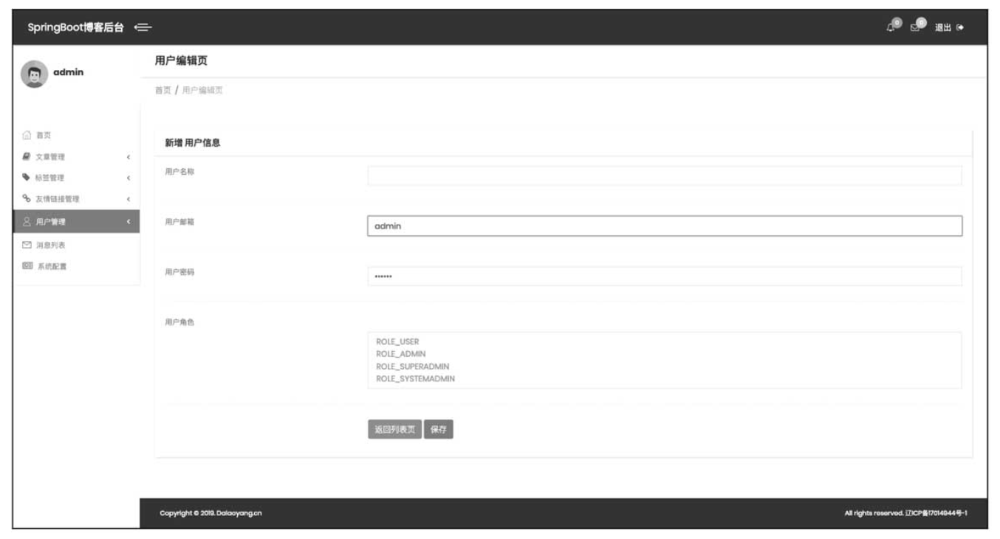

图14-10　用户编辑页效果图

消息列表页如图14-11所示。

系统配置页如图14-12所示。

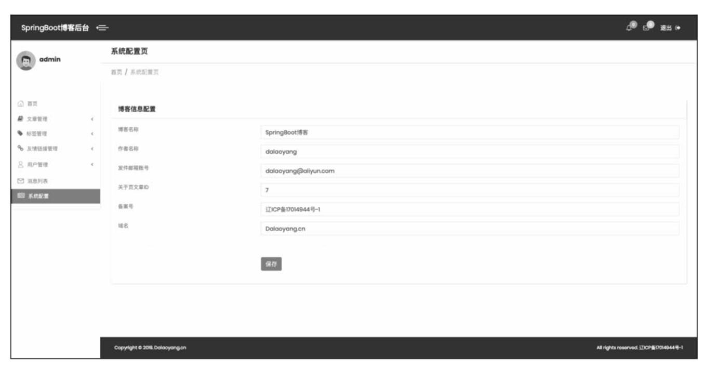

图14-12　系统配置页效果图