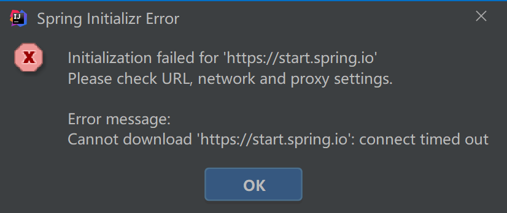

Initialization failed for 'https://start.spring.io'
Please check URL, network and proxy settings.

Error message:
Cannot download 'https://start.spring.io': connect timed out

ping https://start.spring.io

ping http://start.spring.io

ping start.spring.io

在浏览器上url进试试

输入 https://start.spring.io  http://start.spring.io  start.spring.io 

都可以进去，奇了怪了

那说明 idea 也是可以进去的

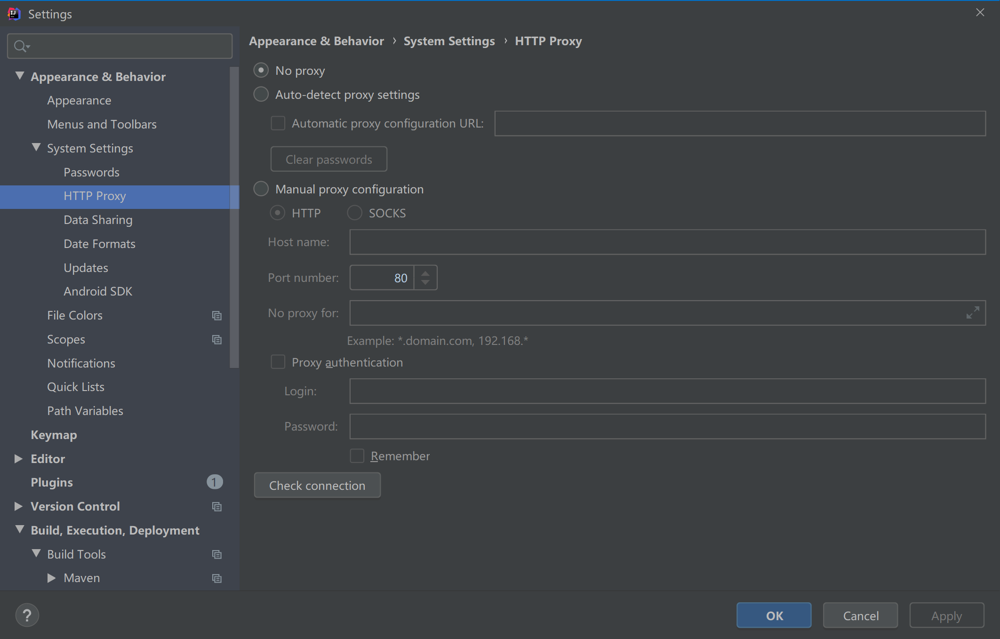

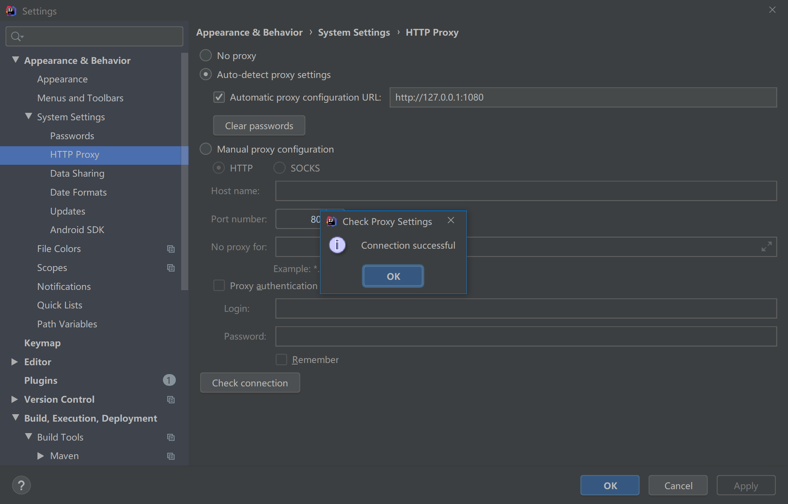

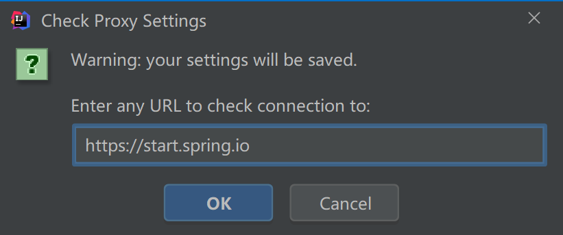

http://127.0.0.1:1080 请问这个是什么

本地机的端口

亲测可用，赞！！

也可能是防火墙的问题，我的就是允许防火墙之后可以的

 [IntelliJ “Initialization failed for 'https://start.spring.io' Please check URL, network and proxy settings”](http://stackoverflow.com/questions/38653809/intellij-initialization-failed-for-https-start-spring-io-please-check-url)

**将地址 'https://start.spring.io' 里的 https 变为 http**

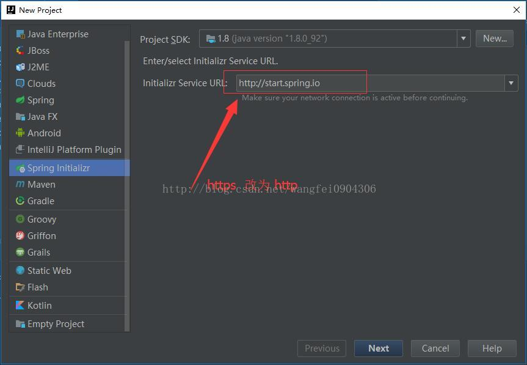


解决办法：
进入到IDEA的setting 
搜索 HTTP Proxy 
选择Auto-detect proxy settings
点击最下面的Check connection弹出如下的输入框，输入地址https://start.spring.io点击ok，如果successful证明连接成功，重新生成一次，完美生成springboot项目

————————————————
版权声明：本文为CSDN博主「朝霞1」的原创文章，遵循 CC 4.0 BY-SA 版权协议，转载请附上原文出处链接及本声明。
原文链接：https://blog.csdn.net/u014417033/article/details/58721184


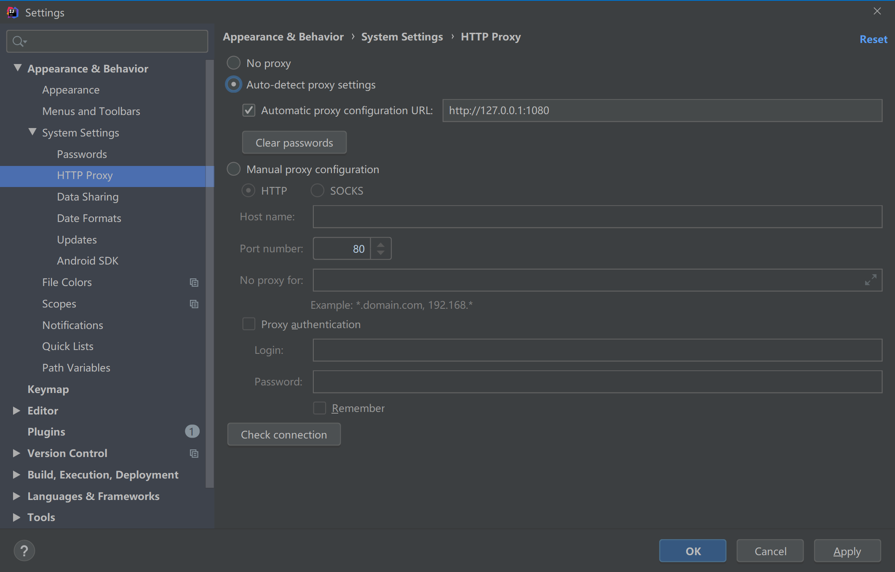


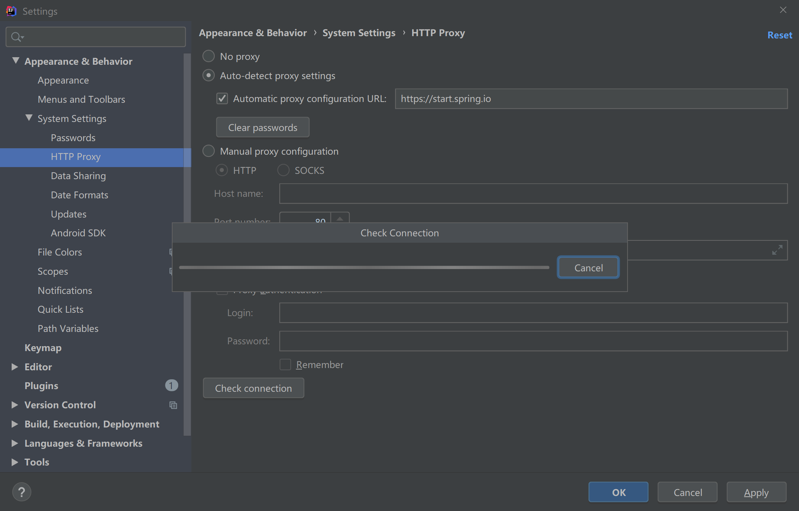


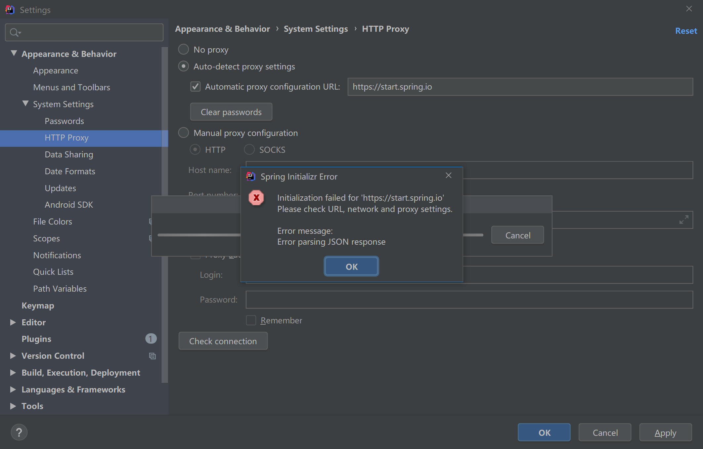


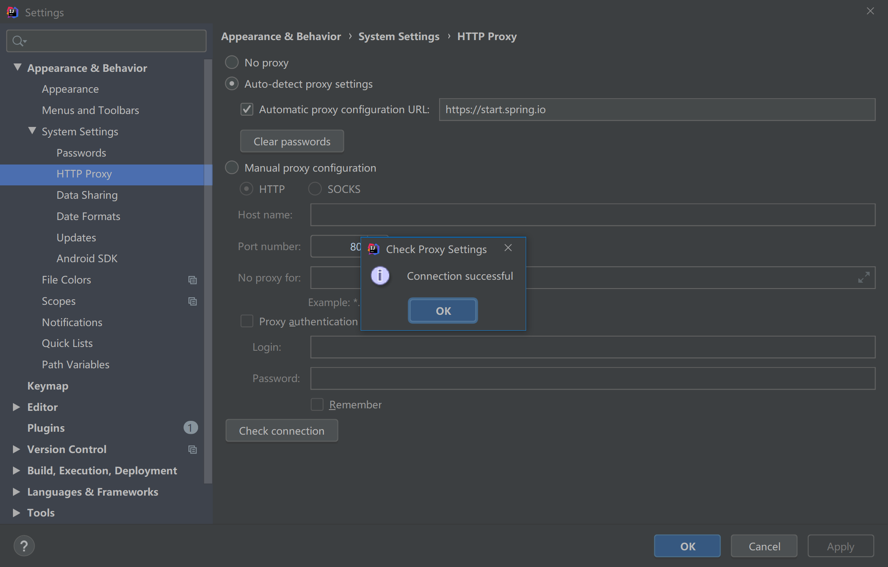


翻墙才能可以   

唉   我去 

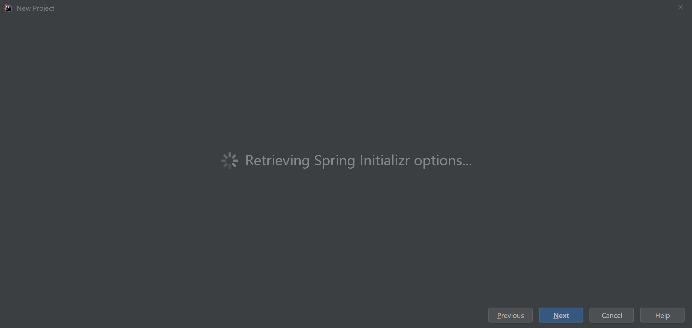


https://start.spring.io/


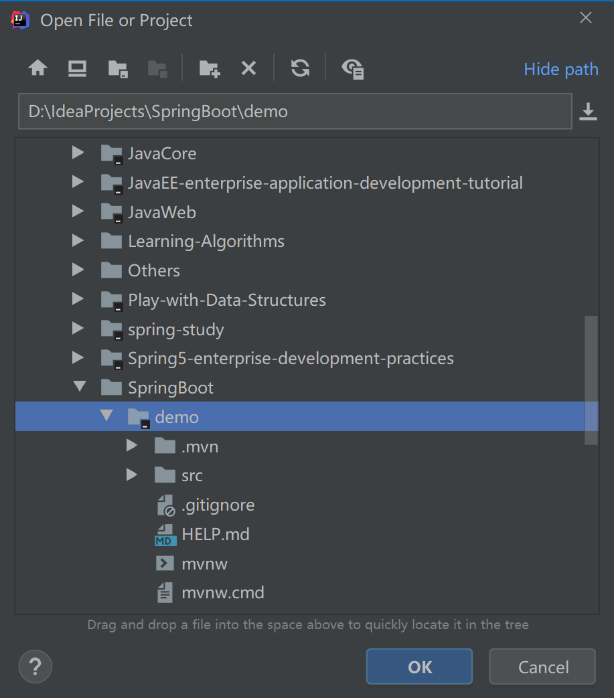


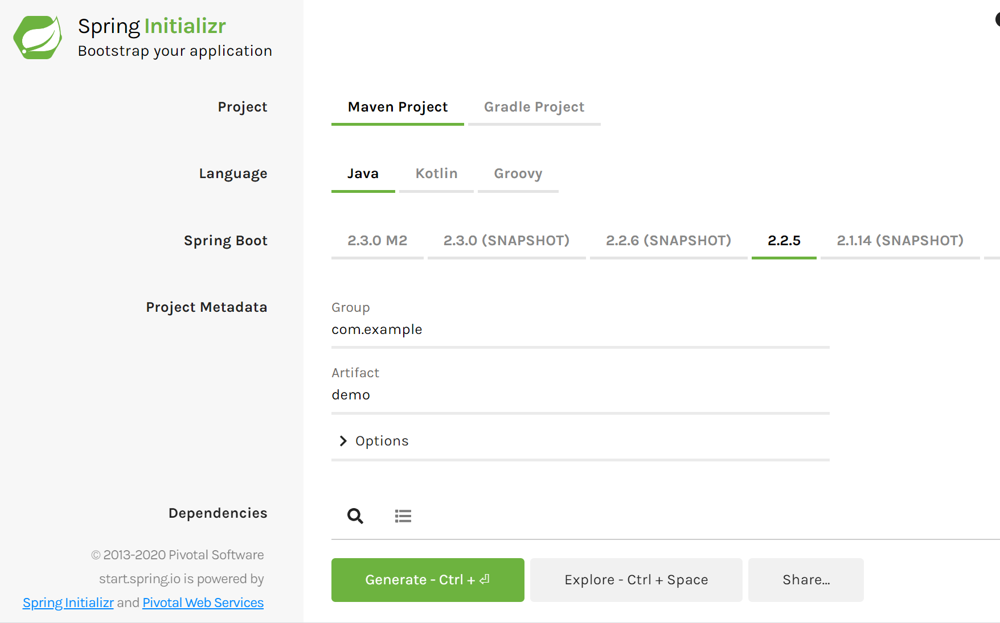


# 走进Spring Boot

搭建Spring Boot的开发环境，简单地构建项目，以及对项目的简单使用。

# 环境搭建

JDK安装配置（http://www.oracle.com/technetwork/java/javase/downloads/index.html）JDK1.8以上的版本

IntelliJ IDEA的安装配置（https://www.jetbrains.com/idea/download/）

Maven的安装配置（https://maven.apache.org/download.cgi）下载一个3.2以上的版本

在默认情况下，Maven下载JAR可能会有一些慢，可以修改为国内阿里云等下载地址。

修改Maven的配置（settings.xml配置），

Maven setting.xml

```xml
<localRepository>D:\Environments\apache-maven-3.6.2\maven-repo</localRepository>
  <!--需要改成自己的Maven的本地仓库地址-->
```

加上阿里镜像

```xml
<mirror>
      <id>alimaven</id>
      <name>aliyun maven</name>
      <url>http://maven.aliyun.com/nexus/content/groups/public/</url>
      <mirrorOf>central</mirrorOf>        
</mirror>
```

# 新建Spring Boot项目

可以https://start.spring.io/ 创建，IDEA打开项目。

或者IntelliJ IDEA使用Spring Initializr创建Spring Boot项目   

下面主要介绍在IDEA中使用Spring Initializr创建Spring Boot项目   

## 开始创建项目


创建项目

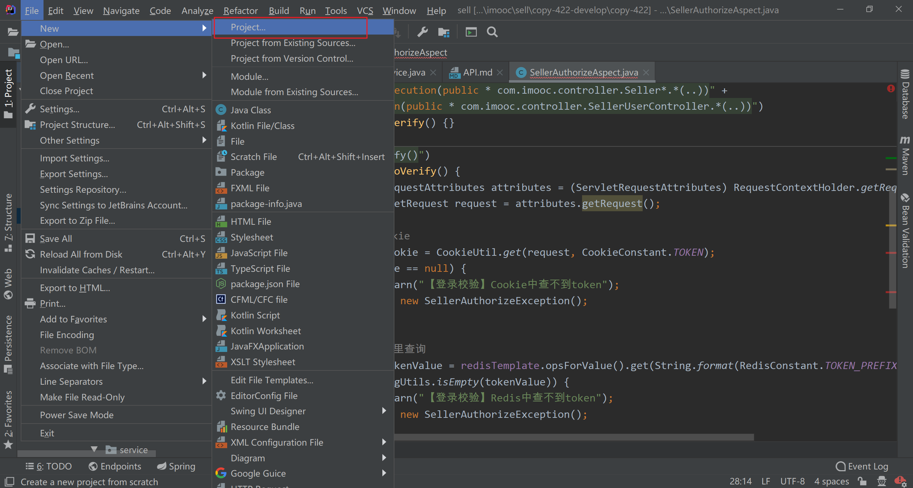

## 配置JDK版本 和 Initializr Service URL 

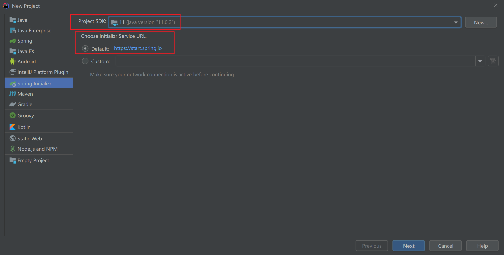

单击Next按钮进入下一步骤

## 配置Project Metadata信息


* Group：	项目组织的标识符。
* Artifact：  项目标识符。
* Type：      构建项目的方式，包含Maven和Gradle，这里选择Maven Project。
* Language：编程语言，这里选择Java。
* Packaging：启动形式，包含JAR和WAR，这里我们选择JAR。
* Java Version： Java版本。
* Version：        项目版本号。
* Name：          项目名称。
* Description：项目描述。
* Package：     实际对应Java包的结构，是main目录里Java的目录结构。

## 配置Spring Boot版本及默认引入组件

在Spring Boot下拉框中选择当前推荐的Spring Boot版本，在下方选择要使用的组件，这是一个demo，简单了解一下项目的结构，直接单击Next按钮


## 配置项目名称和项目位置

在Project Name处配置项目名称，在Project Location处配置项目位置。


配置完成后，单击Finish按钮即可完成项目的创建。

到这里，已经完成了项目的创建，demo创建成功。

# 项目工程介绍

介绍项目的工程目录结构

（1）Java类文件

（2）资源文件

（3）测试类文件

（4）pom文件


## 1、Java类文件

src/main/java下用于放置Java类文件，由于这是一个新建的项目，因此目前只有一个DemoApplication类，这个类是Spring Boot应用的主程序，其中@SpringBootApplication注解用来说明这是Spring Boot应用的启动类，其中包含自动配置、包扫描等功能，main方法是启动应用的入口方法，命令行或者插件等任何方式启动，都会调用这个方法。


## 2、资源文件

配置文件

src/main/resources下面主要用于放置Spring Boot应用的配置文件，新建项目的时候会默认创建一个application.properties（默认是一个空文件），也可以将.properties文件修改为.yml文件，用缩进结构的键值对来进行配置。同时，配置文件可以进行一些应用需要的配置，如端口号等。

默认空文件application.properties


静态资源

src/main/resources/static下面主要放置应用的静态资源文件，如HTML、JavaScript、图片等。


 模板文件

src/main/resources/templates下面主要放置应用的模板文件，比如使用Thymeleaf后的Thymeleaf模板文件等。

## 3、测试类文件

src/test/java下用于放置Spring Boot测试类文件，默认会根据项目名称创建一个测试类，打开该类可以发现@SpringBootTest注解用于标明这是一个Spring Boot测试类。

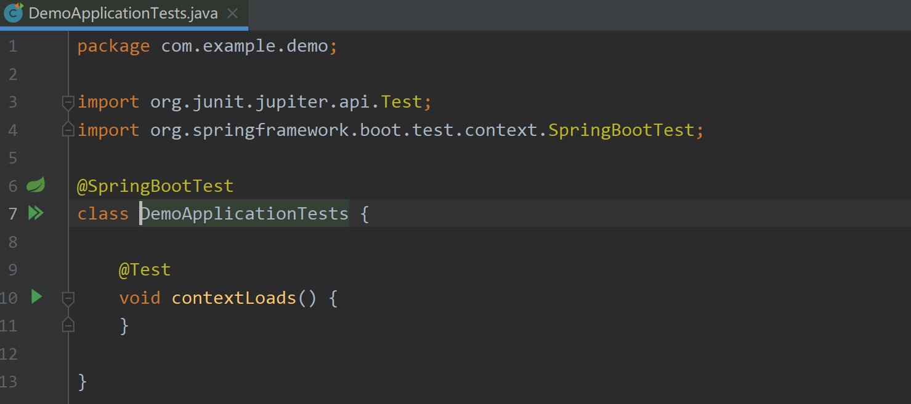


## 4、pom文件

项目中还包含一个pom.xml文件，这是Maven项目用于构建项目的重要组成部分。从pom文件的完整代码中可以看到新建的Spring Boot项目默认的依赖以及版本号、Java版本等消息，


pom.xml

```xml
<?xml version="1.0" encoding="UTF-8"?>
<project xmlns="http://maven.apache.org/POM/4.0.0" xmlns:xsi="http://www.w3.org/2001/XMLSchema-instance"
	xsi:schemaLocation="http://maven.apache.org/POM/4.0.0 https://maven.apache.org/xsd/maven-4.0.0.xsd">
	<modelVersion>4.0.0</modelVersion>
	<parent>
		<groupId>org.springframework.boot</groupId>
		<artifactId>spring-boot-starter-parent</artifactId>
		<version>2.2.5.RELEASE</version>
		<relativePath/> <!-- lookup parent from repository -->
	</parent>
	<groupId>com.example</groupId>
	<artifactId>demo</artifactId>
	<version>0.0.1-SNAPSHOT</version>
	<name>demo</name>
	<description>Demo project for Spring Boot</description>

	<properties>
		<java.version>1.8</java.version>
	</properties>

	<dependencies>
		<dependency>
			<groupId>org.springframework.boot</groupId>
			<artifactId>spring-boot-starter</artifactId>
		</dependency>

		<dependency>
			<groupId>org.springframework.boot</groupId>
			<artifactId>spring-boot-starter-test</artifactId>
			<scope>test</scope>
			<exclusions>
				<exclusion>
					<groupId>org.junit.vintage</groupId>
					<artifactId>junit-vintage-engine</artifactId>
				</exclusion>
			</exclusions>
		</dependency>
	</dependencies>

	<build>
		<plugins>
			<plugin>
				<groupId>org.springframework.boot</groupId>
				<artifactId>spring-boot-maven-plugin</artifactId>
			</plugin>
		</plugins>
	</build>

</project>

```

# 运行项目

简单地搭建了一个Spring Boot项目。

接下来在IntelliJ IDEA上运行项目。

可以直接使用IntelliJ IDEA的Run或者Debug来启动，或者利用Spring Boot主程序，直接运行主程序中的main函数来运行项目。无论采用哪一种，都可以启动项目。然后查看控制台。


```bash
D:\Environments\jdk-11.0.2\bin\java.exe -XX:TieredStopAtLevel=1 -noverify -Dspring.output.ansi.enabled=always -Dcom.sun.management.jmxremote -Dspring.jmx.enabled=true -Dspring.liveBeansView.mbeanDomain -Dspring.application.admin.enabled=true -javaagent:D:\Java\ideaIU-2019.2.win\lib\idea_rt.jar=10390:D:\Java\ideaIU-2019.2.win\bin -Dfile.encoding=UTF-8 -classpath D:\IdeaProjects\SpringBoot\demo\target\classes;D:\Environments\apache-maven-3.6.2\maven-repo\org\springframework\boot\spring-boot-starter\2.2.5.RELEASE\spring-boot-starter-2.2.5.RELEASE.jar;D:\Environments\apache-maven-3.6.2\maven-repo\org\springframework\boot\spring-boot\2.2.5.RELEASE\spring-boot-2.2.5.RELEASE.jar;D:\Environments\apache-maven-3.6.2\maven-repo\org\springframework\spring-context\5.2.4.RELEASE\spring-context-5.2.4.RELEASE.jar;D:\Environments\apache-maven-3.6.2\maven-repo\org\springframework\spring-aop\5.2.4.RELEASE\spring-aop-5.2.4.RELEASE.jar;D:\Environments\apache-maven-3.6.2\maven-repo\org\springframework\spring-beans\5.2.4.RELEASE\spring-beans-5.2.4.RELEASE.jar;D:\Environments\apache-maven-3.6.2\maven-repo\org\springframework\spring-expression\5.2.4.RELEASE\spring-expression-5.2.4.RELEASE.jar;D:\Environments\apache-maven-3.6.2\maven-repo\org\springframework\boot\spring-boot-autoconfigure\2.2.5.RELEASE\spring-boot-autoconfigure-2.2.5.RELEASE.jar;D:\Environments\apache-maven-3.6.2\maven-repo\org\springframework\boot\spring-boot-starter-logging\2.2.5.RELEASE\spring-boot-starter-logging-2.2.5.RELEASE.jar;D:\Environments\apache-maven-3.6.2\maven-repo\ch\qos\logback\logback-classic\1.2.3\logback-classic-1.2.3.jar;D:\Environments\apache-maven-3.6.2\maven-repo\ch\qos\logback\logback-core\1.2.3\logback-core-1.2.3.jar;D:\Environments\apache-maven-3.6.2\maven-repo\org\apache\logging\log4j\log4j-to-slf4j\2.12.1\log4j-to-slf4j-2.12.1.jar;D:\Environments\apache-maven-3.6.2\maven-repo\org\apache\logging\log4j\log4j-api\2.12.1\log4j-api-2.12.1.jar;D:\Environments\apache-maven-3.6.2\maven-repo\org\slf4j\jul-to-slf4j\1.7.30\jul-to-slf4j-1.7.30.jar;D:\Environments\apache-maven-3.6.2\maven-repo\jakarta\annotation\jakarta.annotation-api\1.3.5\jakarta.annotation-api-1.3.5.jar;D:\Environments\apache-maven-3.6.2\maven-repo\org\springframework\spring-core\5.2.4.RELEASE\spring-core-5.2.4.RELEASE.jar;D:\Environments\apache-maven-3.6.2\maven-repo\org\springframework\spring-jcl\5.2.4.RELEASE\spring-jcl-5.2.4.RELEASE.jar;D:\Environments\apache-maven-3.6.2\maven-repo\org\yaml\snakeyaml\1.25\snakeyaml-1.25.jar;D:\Environments\apache-maven-3.6.2\maven-repo\org\slf4j\slf4j-api\1.7.30\slf4j-api-1.7.30.jar com.example.demo.DemoApplication

  .   ____          _            __ _ _
 /\\ / ___'_ __ _ _(_)_ __  __ _ \ \ \ \
( ( )\___ | '_ | '_| | '_ \/ _` | \ \ \ \
 \\/  ___)| |_)| | | | | || (_| |  ) ) ) )
  '  |____| .__|_| |_|_| |_\__, | / / / /
 =========|_|==============|___/=/_/_/_/
 :: Spring Boot ::        (v2.2.5.RELEASE)

2020-03-06 14:54:11.228  INFO 64392 --- [           main] com.example.demo.DemoApplication         : Starting DemoApplication on DESKTOP-HVI7SH0 with PID 64392 (D:\IdeaProjects\SpringBoot\demo\target\classes started by x1c in D:\IdeaProjects\SpringBoot\demo)
2020-03-06 14:54:11.233  INFO 64392 --- [           main] com.example.demo.DemoApplication         : No active profile set, falling back to default profiles: default
2020-03-06 14:54:12.186  INFO 64392 --- [           main] com.example.demo.DemoApplication         : Started DemoApplication in 1.475 seconds (JVM running for 3.965)

Process finished with exit code 0

```

# 小结

记录

* Spring Boot开发环境进行了搭建
* 简单介绍了使用IntelliJ IDEA创建项目的方法和步骤
* 创建后的项目工程结构介绍
* 如何在IntelliJ IDEA中运行Spring Boot项目。