# 第3章　Spring Boot的Web之旅

介绍Spring Boot的Web项目，从构建简单项目、使用模板框架、WebJars等进行系统性的学习。

构建简单项目 、使用模板框架、WebJars

springboot2_book

# Spring Boot的第一个Web项目

打开IntelliJ IDEA，新建一个简单的项目。

## 加入Web依赖

加入Web依赖

pom文件中加入Web依赖

Spring Boot- Web 依赖

```xml
<dependency>
            <groupId>org.springframework.boot</groupId>
            <artifactId>spring-boot-starter-web</artifactId>
</dependency>
```

或者

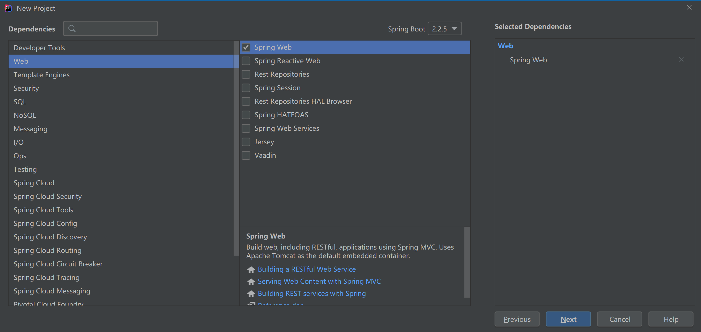


## 创建Controller

新建一个HelloController.java，

在类上加入注解@RestController，这个注解是Spring 4.0版本之后的一个注解，功能相当于@Controller与@ResponseBody两个注解的功能之和。

在HelloController内创建方法hello()，在方法上加入注解@GetMapping("/hello")，这个注解是在Spring后期推出的一个组合注解，是@RequestMapping(method =RequestMethod.GET)的缩写，将HTTP Get映射到方法上。让hello()返回一个字符串“Hello, Spring Boot Web Project !”。

HelloController.java

```java
package com.springboot.controller;


import org.springframework.web.bind.annotation.GetMapping;
import org.springframework.web.bind.annotation.RestController;

@RestController
public class HelloController {

    @GetMapping("/hello")
    public String hello(){
        return "Hello , This is you first SpringBoot Web Project !";
    }
}

```


## 测试运行

简单的Web项目已经创建完成了，接下来启动项目。首先观察一下控制台，，我们似乎得到几个信息：项目的端口是8080、默认使用的Web容器是Tomcat、刚刚写的hello()在控制台有所映射。

在浏览器上访问http://localhost:8080/hello，可以看到浏览器打印了我们在方法内返回的内容。


到这里，一定会有人和笔者第一次接触的时候有同样的想法。Spring Boot项目太神奇了，完全颠覆了我们对传统Web项目的认识，它没有原有的web.xml文件，只需短短的几行代码，就完成了原有Spring MVC项目的烦琐配置，甚至连配置Tomcat都不需要，直接在内部提供了Tomcat。


# WebFlux的使用

前面介绍了Spring Boot使用Spring MVC模式搭建一个简单的WebFlux项目，本节为大家介绍Spring Boot提供的另一种模式—— Spring WebFlux。引用Spring官网的说明，我们在第1章已经看到过，如图3-2所示。

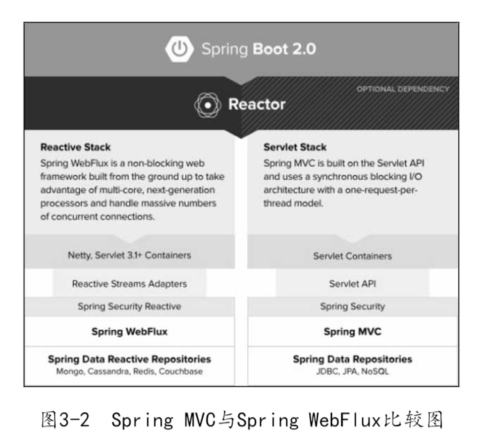

从图3-2可以看到，WebFlux是一个非阻塞的Web框架，它不再完全依赖于Servlet，而是实现了Reactive Streams规范。也就是说，可以使用响应式编程，但是并非无法运行在之前的Servlet容器上，只不过必须是在Servlet 3.1以上，并且默认推荐的是使用Netty这种异步容器。刚才我们提到了响应式编程，接下来利用响应式编程来创建一个Spring Boot WebFlux项目。

## 添加WebFlux依赖

首先创建一个项目，在项目的pom文件中添加WebFlux依赖。Spring WebFlux同样支持传统Spring MVC使用注解的形式进行WebFlux跳转，同时支持函数式编程配置路由进行WebFlux跳转。传统模式就不再赘述了，这里以响应式编程为例，Spring WebFlux依赖的内容如代码清单3-3所示。

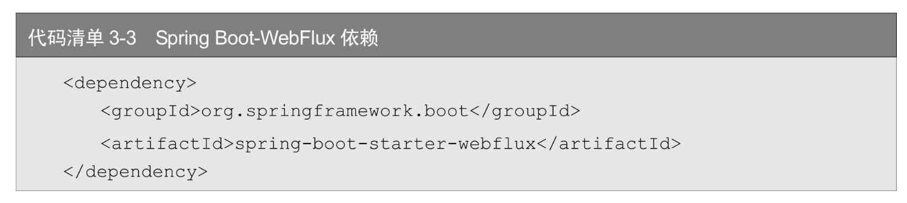

## 创建一个处理方法类

新建类HelloHandle，创建一个hello方法供接下来使用，其中返回值Mono<ServerResponse>作为响应对象，其中ServerResponse包含响应状态、响应头信息等，类上面的@Component注解用于将类实例化到Spring容器中。总的来说，这个方法就是返回一句字符串，HelloHandle类的内容如代码清单3-4所示。


## 创建一个Router类

创建一个HelloRouter类，用来定义路由信息，每个路由都会映射到对应的处理方法（功能类似于@RequestMapping）。当接收到对应HTTP请求后，调用此方法，通过RouterFunctions.route（RequestPredicate, HandlerFunction）提供一个路由器函数的默认实现，HelloRouter的内容如代码清单3-5所示

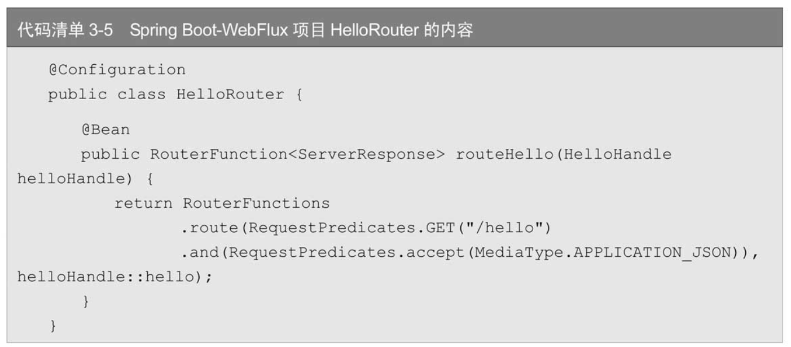

## 测试运行

启动项目，我们来观察一下控制台，如图3-3所示。可以从第4行看到，刚刚写的hello映射已经成功了。正如之前介绍的，默认启用的Netty容器运行端口默认为8080。在浏览器上访问http://localhost:8080/hello可以看到：

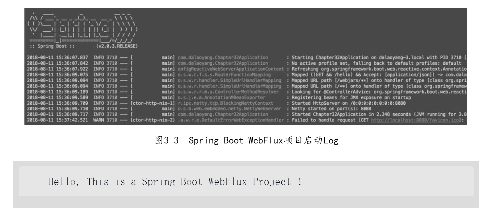

响应式编程的简单实现到这里就结束了，可能在工作和学习上两种方式有不同的使用情况，无论是响应式编程还是非响应式编程，都有各自不同的好处，这里不做更多的比较了，具体可以按照自己的实际需求来选择。


# 使用热部署

热部署这个词汇大家听起来应该并不陌生，在Spring Boot框架中是否提供了相关的热部署呢？其实在第1章介绍Spring Boot框架的特点时已经指出了，只需要引入spring-boot-devtools依赖文件即可，十分简单。引入依赖后，重新编译修改的类文件或配置文件等（笔者默认快捷键是Command+F9），Spring Boot框架会自动替我们重启，spring-boot-devtools依赖如代码清单3-6所示。


# 配置文件

在第2章介绍Spring Boot项目结构的时候简单提到了配置文件，本节将对Spring Boot的配置文件进行介绍。

# 配置文件类型

在使用IntelliJ IDEA创建Spring Boot项目时，IDE会在src/main/java/resources目录下创建一个application.properties文件。在这种情况下，我们使用配置的时候需要使用下面的格式（以端口号配置为例），如代码清单3-7所示。

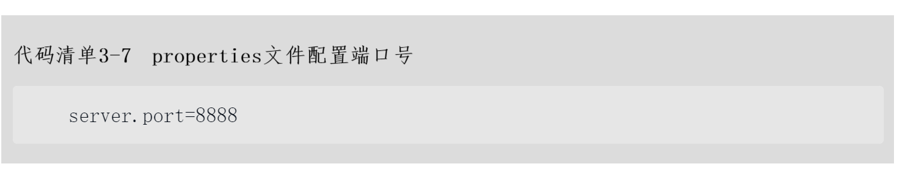

当然，我们也可以将配置文件application.properties后缀修改为.yml格式，即文件全名为application.yml。在这种格式下，端口配置如代码清单3-8所示。

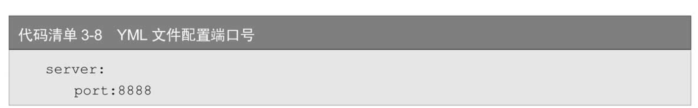

## 自定义属性

前面介绍了两种配置文件的格式，这里以properties文件为例，在application.properties中自定义几个属性，如代码清单3-9所示。

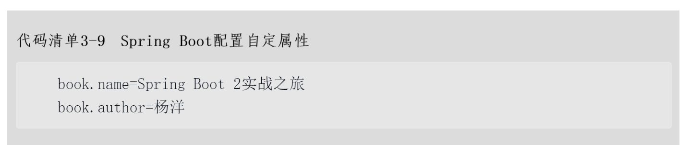

在类中，如果需要读取配置文件的内容，那么只需要在属性上使用@Value("${属性名}")，新建一个TestController，在其中创建一个test1方法进行测试。TestController的完整内容如代码清单3-10所示。

```java
@Value("${book.name}")
```


```properties
book.name=编程之美
```


启动工程，在浏览器上访问http://localhost:8080/test1，可以看到浏览器显示：“本书书名是：Spring Boot 2实战之旅，作者是：杨洋”。

注　意在application.properties中配置中文值，读取时会出现中文乱码问题。因为Java默认会使用ISO-8859-1的编码方式来读取*.properties配置文件，而SpringBoot应用则以UTF-8的编码方式来读取，就导致产生了乱码问题。对于这个问题，官方推荐的做法是：“Characters that cannot be directly represented inthis encoding can be written using Unicode escapes”，大致意思就是使用Unicode的方式来展示字符。例如上述代码中的book.author=杨洋应该配置成book.author=\u6768\u6d0b。

SpringBoot应用则以UTF-8的编码方式来读取，就导致产生了乱码问题。

那就还是这个  

Unicode方式来展示字符

## 使用随机数

在配置文件中，还提供了随机数供我们使用，即在配置文件中使用${random}来生成不同类型的随机数，大致分为随机数、随机uuid、随机字符串等。在配置文件内添加几种利用随机数创建的属性，如代码清单3-11所示。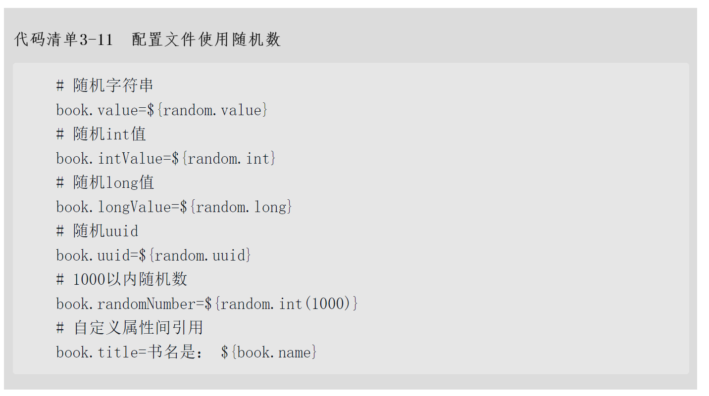

random.value

随机字符串 

random.int

随机int值 

```java
@SpringBootApplication
@EnableConfigurationProperties({BookConfigBean.class,ConfigBean.class})
public class Chapter34Application {

	public static void main(String[] args) {
		SpringApplication.run(Chapter34Application.class, args);
	}
}

```


在配置了这么多属性后，可以使用JavaBean模式来给属性赋值，创建一个BookConfigBean实体类。由于自定义属性的前缀都是由book开头的，因此我们可以在实体类上加入注解@ConfigurationProperties(prefix = "book")，同时需要在启动类上加入注解@EnableConfigurationProperties(BookConfigBean.class)，表明启动这个配置类。实体类内容如代码清单3-12所示（这里省略了set、get方法）。

我的参数是这个 

```properties
book.name=SpringBoot2\u5B9E\u6218\u4E4B\u65C5
book.author=\u6768\u6D0B
#book.author=\u6768\u6d0b

# \u968F\u673A\u5B57\u7B26\u4E32
book.value=${random.value}
# \u968F\u673Aint\u503C
book.intValue=${random.int}
# \u968F\u673Along\u503C
book.longValue=${random.long}
# \u968F\u673Auuid
book.uuid=${random.uuid}
# 1000\u4EE5\u5185\u968F\u673A\u6570
book.randomNumber=${random.int(1000)}
# \u81EA\u5B9A\u4E49\u5C5E\u6027\u95F4\u5F15\u7528
book.title=\u4E66\u540D\u662F\uFF1A ${book.name}

spring.profiles.active=test

```


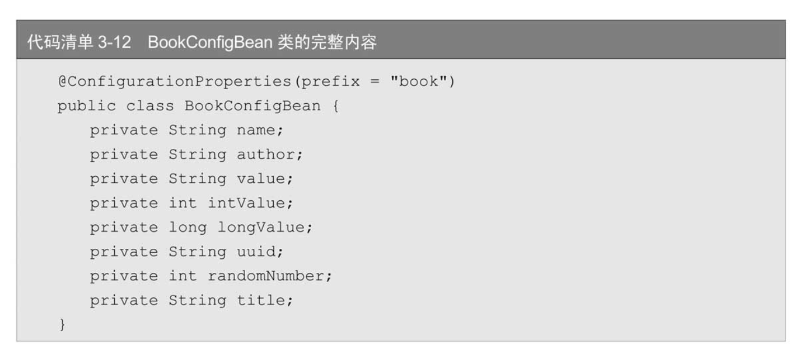

到这里，配置就完成了。接下来在TestController中利用@Autowired注解注入BookConfigBean类，并且创建一个test2方法进行测试。test2方法及注入BookConfigBean类的内容如代码清单3-13所示。

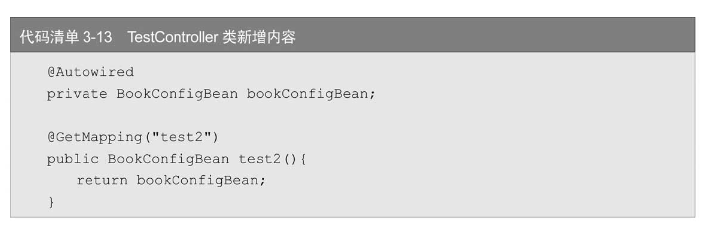

在浏览器上访问http://localhost:8080/test2进行测试，显示结果如下：

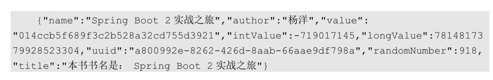

## 多环境配置

在开发Spring Boot项目的时候，可能有这样的情况，一套程序需要在不同的环境中发布，数据库配置、端口配置或者其他配置各不相同，如果每次都需要修改为对应环境配置，不仅耗费人力，而且特别容易出现错误，造成不必要的麻烦。通常情况下，我们可以配置多个配置文件，在不同的情况下进行替换。而在Spring Boot项目中，我们新建几个配置文件，文件名以application-{name}.properties的格式，其中的{name}对应环境标识，比如：•　application-dev.properties：开发环境。•　application-test.properties：测试环境。•　application-prod.properties：生产环境。然后，可以在主配置文件（application.properties）中配置spring.profiles.active来设置当前要使用的配置文件。比如，在主配置文件中配置本次指定使用的配置文件后缀，配置内容如代码清单3-14所示。

```
spring.profiles.active=test
```

 一套程序需要在不同的环境中发布 

配置文件不同  随时切换  

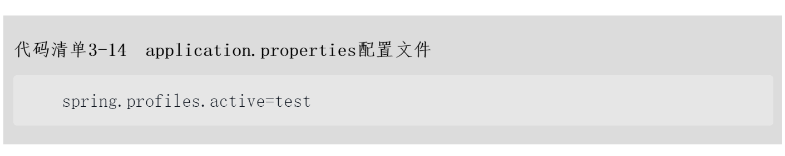

创建application-dev.properties配置文件，在文件中配置端口号为8081，配置文件内容如代码清单3-15所示。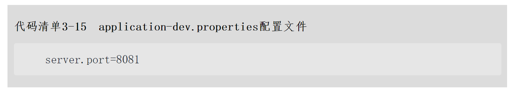

创建application-test.properties配置文件，在文件中配置端口号为8082，配置文件内容如代码清单3-16所示。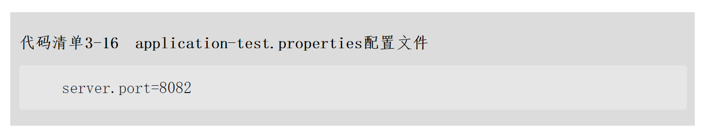

启动项目或者打成JAR包形式都会自动读取对应配置文件，可以在控制台看到启动端口号为8082。

## 自定义配置文件

前面介绍了多环境配置文件，我们也可以使用自定义配置文件，比如新建一个test.properties，配置文件内容如代码清单3-17所示。

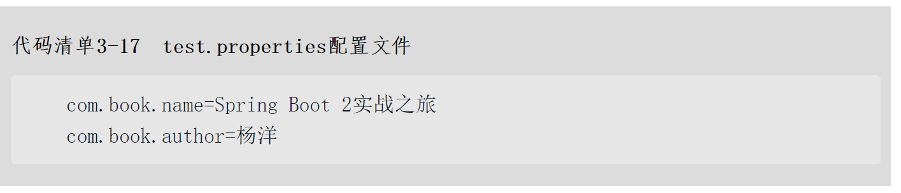

与之前一样，新建一个javabean来读取配置文件。新建一个ConfigBean，在类上加上注解@PropertySource(value = "classpath:test.properties")，并且和之前一样需要加入@ConfigurationProperties(prefix = "com.book")，实体类代码如代码清单3-18所示（省略了set、get方法）。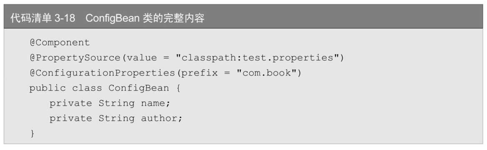

同样，在TstController中注入bean并且创建测试方法，内容如代码清单3-19所示。

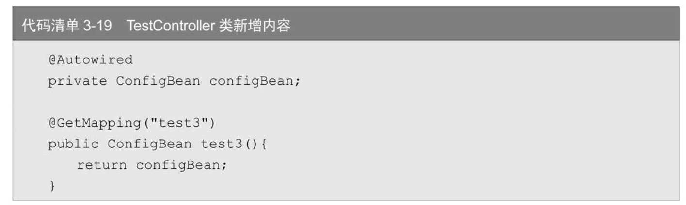


使用浏览器访问http://localhost:8080/test3，可以看到显示如下内容：

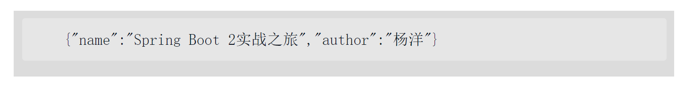

# 使用页面模板

在Web开发过程中，前后端交互是一件不可避免的事情。接下来我们学习Spring Boot常用的页面模板框架。

##  使用Thymeleaf

Thymeleaf是当今比较流行的模板框架，并且是Spring Boot官方推荐使用的模板框架。本小节介绍Spring Boot框架如何使用Thymeleaf，并且会对Thymeleaf框架的使用方法进行介绍。首先创建项目，在项目中加入spring-boot-starter-thymeleaf依赖。这里需要提醒的是，由于Thymeleaf对HTML的校验特别严格，比如标签没有结束等可能会对不熟悉者造成未知的困惑，因此我们还需要加入nekohtml的依赖来避免这个“坑”。Thymeleaf依赖如代码清单3-20所示。

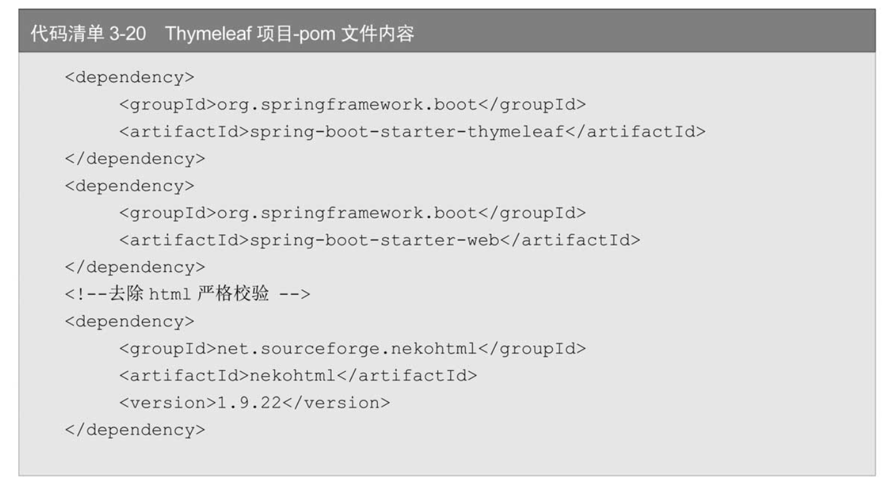

完成依赖的配置之后，我们需要在配置文件中对Thymeleaf进行配置，比如编码格式、缓存设置、文件前后缀等。配置文件内容如代码清单3-21所示。

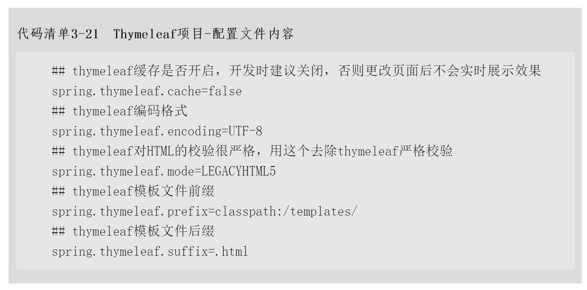

到这里，准备工作已经完成。需要做的是创建一个Controller和HTML进行测试。新建一个IndexController，我们先写一个简单的路由跳转方法并且传一个字符串值进行测试。IndexController内容如代码清单3-22所示。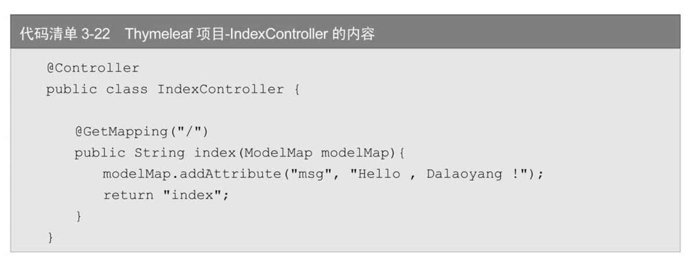

然后，在src/mian/resources/templates下新建一个index.html（需要结合配置文件中spring.thymeleaf.prefix的配置信息存放HTML），使用th:text="${msg}"来接收后台传来的数据。index.html内容如代码清单3-23所示。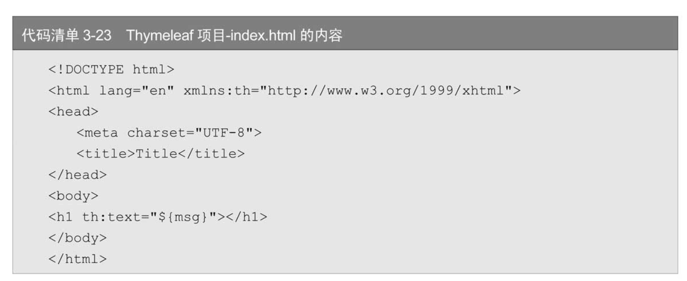

启动项目，在浏览器上访问http://localhost:8080，可以看到有如下显示：


其实到这里Spring Boot整合Thymeleaf已经完成，但是为了方便后面章节的使用，笔者在这里再介绍一下Thymeleaf模板的常用语法。

•　th:text　设置当前元素的文本内容。•　th:value　设置当前元素的值。•　th:each　循环遍历元素，一般配合上面两者使用。•　th:attr　设置当前元素的属性。•　th:if th:switch th:case th:unless　用作条件判断。•　th:insert th:replace th:incloud　代码块引入，一般用作提取公共文件，或者引用公共静态文件等。

当然，Thymeleaf也提供了一些内置方法供我们使用，比如：

•　#numbers　数字方法。•　#dates　日期方法。•　#calendars　日历方法。•　#strings　字符串方法。•　#lists　集合方法。•　#maps　对象方法。

关于Thymeleaf先了解到这里，后面的章节会对它有具体的实战使用，这里就不再赘述了。

## 使用FreeMarker

free  marker

刚刚介绍了Thymeleaf模板，接下来我们学习FreeMarker模板，无论是语法还是配置等，两者都有很多相似的地方。接下来，我们学习Spring Boot项目整合FreeMarker模板。新建项目，在项目中加入Freemarker依赖，如代码清单3-24所示。

我们学习Spring Boot项目整合FreeMarker模板 

新建项目  在项目中加入Freemarker依赖 

```xml
 <dependency>
            <groupId>org.springframework.boot</groupId>
            <artifactId>spring-boot-starter</artifactId>
        </dependency>
        <dependency>
            <groupId>org.springframework.boot</groupId>
            <artifactId>spring-boot-starter-test</artifactId>
            <scope>test</scope>
        </dependency>
        <dependency>
            <groupId>org.springframework.boot</groupId>
            <artifactId>spring-boot-starter-freemarker</artifactId>
        </dependency>
        <dependency>
            <groupId>org.springframework.boot</groupId>
            <artifactId>spring-boot-starter-web</artifactId>
        </dependency>
```


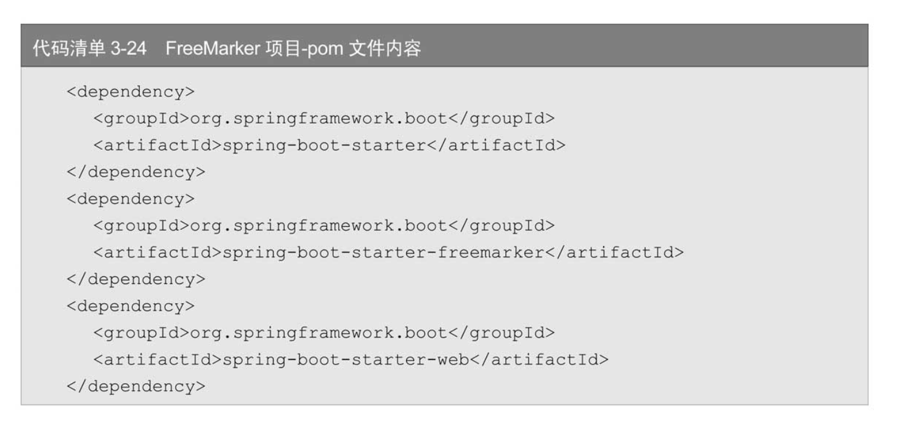

接下来配置FreeMarker模板属性，与Thymeleaf模板配置类似，唯一需要注意的是模板文件后缀配置的是FTL文件。配置文件如代码清单3-25所示。

```properties
## freemarker\u7F13\u5B58\u662F\u5426\u5F00\u542F
## freemarker缓存是否开启
spring.freemarker.cache=false
## freemarker编码格式
## freemarker\u7F16\u7801\u683C\u5F0F
spring.freemarker.charset=UTF-8
## freemarker模板文件前缀
## freemarker\u6A21\u677F\u6587\u4EF6\u524D\u7F00
spring.freemarker.template-loader-path=classpath:/templates/
## freemarker\u6A21\u677F\u6587\u4EF6\u540E\u7F00\uFF0C\u6CE8\u610F\u8FD9\u91CC\u540E\u7F00\u540D\u662Fftl
## freemarker模板文件后缀，注意这里后缀名.ftl
spring.freemarker.suffix=.ftl
```


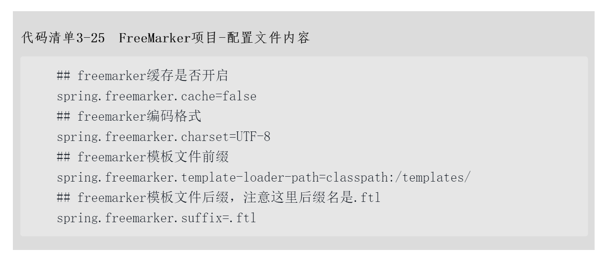

接下来，创建一个IndexController进行测试，内容如代码清单3-26所示。

```java
@Controller
public class IndexController{
    @GetMapping("/")
    public String index(ModelMap modelMap){
        modelMap.addAttribute("msg","Hi,SB是Spring Boot...哦");
        return "index";
    }
}
```


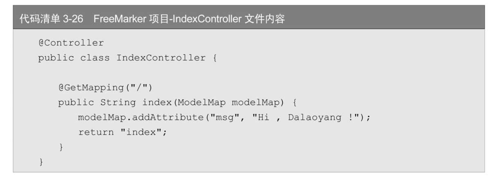

在src/resources/templates下新建index.ftl（注意文件后缀），使用${msg}接收后来传送的数据，文件内容如代码清单3-27所示。

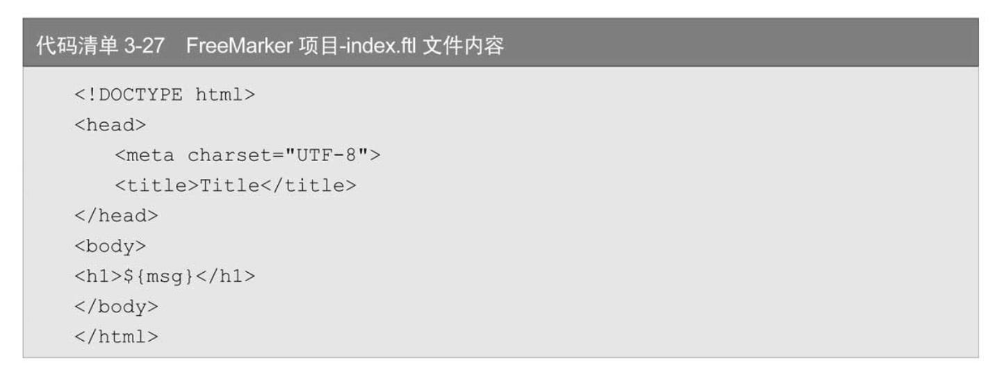

到这里，项目配置完成。启动项目，在浏览器上访问http://localhost:8080，可以看到如下结果：


接下来介绍FreeMarker的常用语法。

（1）通用赋值：${xxx}格式

•　比如后台返回键值aaa=string，可以使用${aaa?string}，输出“Hi , Dalaoyang!”。•　比如后台返回键值aaa="2018-08-01 23:59"，可以使用${aaa?string("EEE,MMMd,yy")}，输出：星期二，八月 14,18。•　比如后台返回键值aaa=false，可以使用${aaa?string("是","否")}，输出：否。

（2）数值赋值：#{xxx}或者#{xxx;format}格式

后者format可以是以下格式（其中X和Y为数字）：

•　mX　小数部分最小X位，比如后台返回值aaa=3.782131，可以使用#{x;m2}，输出3.78。•　MX　小数部分最大X位，比如后台返回值aaa=3.782131，可以使用#{x;M3}，输出3.782。•　mXMY　小数部分最小X位，最大Y位，比如后台返回值aaa=3.782131，可以使用#{x;m1M3}，输出3.782。

（3）常用内建函数

•　html　对字符串进行HTML编码。•　lower_case　字符串转小写。•　upper_case　字符串转大写。•　trim　去前后空格。•　size　获取集合元素数量。•　int　获取数字部分。

（4）常用指令

•　if elseif else　分支控制语句。•　list　输出集合数据。•　import　导入变量。•　include　类似于包含指令。

关于FreeMarker模板的内容到这里暂时结束了，毕竟这是一本关于Spring Boot的书，详细内容可以参考官方文档进行系统学习。

## 使用传统JSP

虽然Spring Boot不建议使用JSP作为渲染页面，但是一定要使用的话，也是可以的。新建项目，加入JSP对应的依赖和JSTL表达式依赖，并且需要注意packaging内不是JAR而是WAR。pom文件代码如代码清单3-28所示。

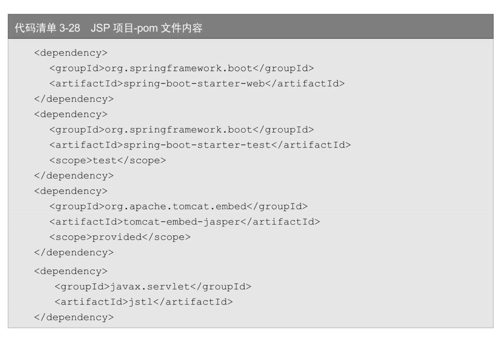

然后，需要在src/mian下新建一个webapp目录，并且在其下新建WEB-INF/jsp文件夹，用于放置JSP页面，结构图如图3-4所示。接下来，我们进行配置文件的配置，主要配置JSP页面文件前缀和后缀，基本上和Thymeleaf、FreeMarker类似，配置如代码清单3-29所示。

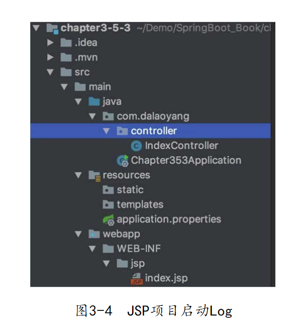

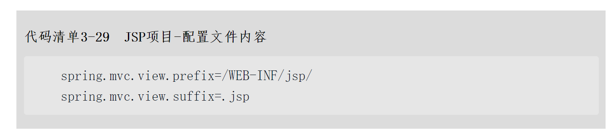

然后创建一个IndexCotroller文件作为跳转，完整内容如代码清单3-30所示。

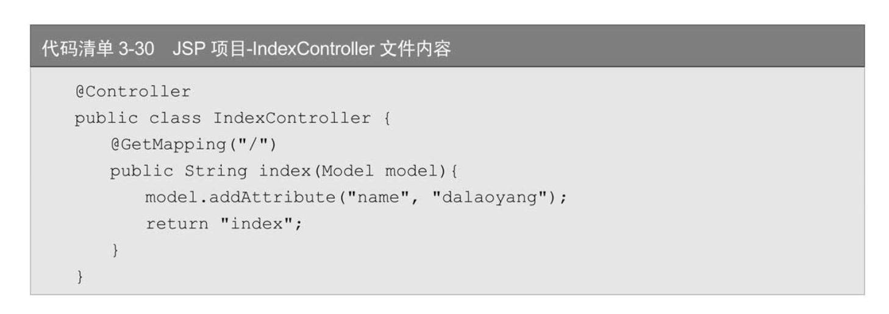

最后，在创建的JSP存放文件夹下创建一个index.jsp，其中${name}用于接收后台传来的值。JSP页面代码如代码清单3-31所示。

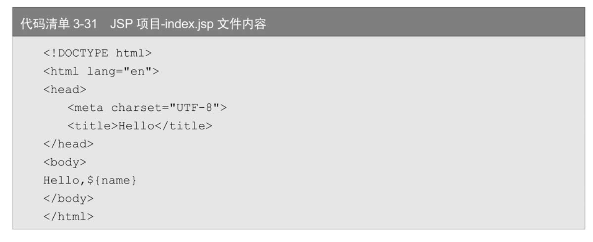

在项目目录下使用命令mvn spring-boot:run启动项目，在浏览器上访问http://localhost:8888/，可以看到如下结果：


到这里，Spring Boot使用JSP介绍完了。对于Spring Boot还有很多模板框架可以使用，如果不是必需的，那么建议不要使用。

# 使用WebJars

在开发的过程中，很多时候需要结合前端进行开发。本节将介绍Spring Boot框架整合WebJars进行前端静态JavaScript和CSS。作为开发者，对Bootstrap和jQuery应该不会陌生。接下来我们将在Spring Boot项目中引入WebJars，对应二者的JAR进行使用，在pom文件中加入二者的依赖文件，如代码清单3-32所示。

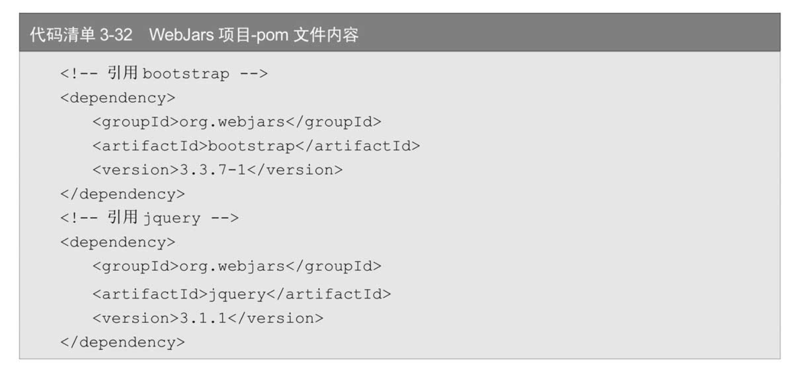

其实到这里整合完毕了，但是为了证实我们是否可以成功引用，在src/main/recources/static文件夹下新建index.html，在HTML中引入刚刚加入依赖的文件。index.html页面代码如代码清单3-33所示。

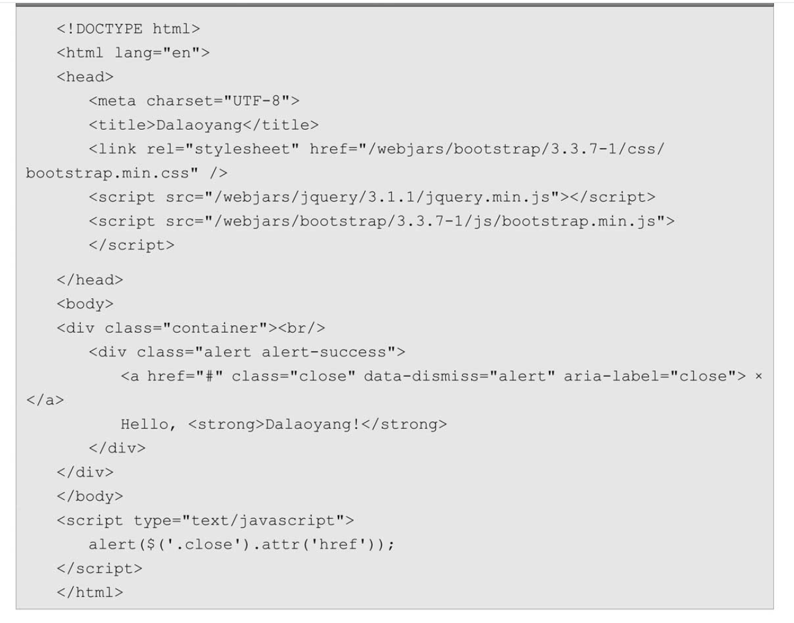

在HTML页面中，我们分别对Bootstrap和jQuery进行了引用，使用Bootstrap对a标签进行了样式的修饰，使用jQuery在打开页面时利用告警输出了a标签的href值。启动项目，让我们来证实一下，在浏览器上访问http://localhost:8080，如图3-5所示。如图3-5所示，可以看到之前的操作都实现了。其实WebJars还提供了很多其他的依赖，具体使用可以查看WebJars官网（官网地址：https://www.webjars.org/）。

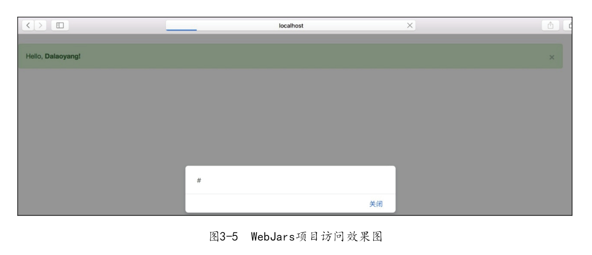

# 国际化使用

对于很多门户网站，可能有很多客户来源于其他国家，这时就需要使用国际化来进行对外的交流。那么，在Spring Boot项目中是如何使用国际化的呢？接下来使用一个小例子介绍Spring Boot项目如何运用国际化。本节使用的依赖文件与3.5节使用Thymeleaf所使用的依赖文件以及配置文件完全一致，这里不再展示。Spring Boot在默认情况下是支持国际化使用的，首先需要在src/main/resources下新建国际化资源文件，这里为了举例说明，分别创建如下三个文件：

•　messages.properties（默认配置），内容如代码清单3-34所示。代码清单3-34　国际化项目-默认语言配置文件内容[插图]

•　messages_en_US.properties（英文配置），内容如代码清单3-35所示。代码清单3-35　国际化项目-英文配置文件内容[插图]

•　messages_zh_CN.properties（汉语配置），内容如代码清单3-36所示。

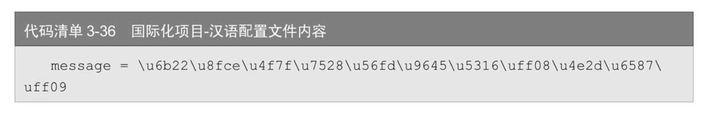

然后就到了国际化的重头戏，需要进行i18n的配置，这里新建配置类i18nConfig，这个类需要继承WebMvcConfigurerAdapter类。其中，在localeResolver()方法中设置默认使用的语言类型，在localeChangeInterceptor()方法中设置识别语言类型的参数，并且从继承类中实现addInterceptors()方法，用于拦截localeChangeInterceptor()方法，进而实现国际化。i18nConfig类代码如代码清单3-37所示。

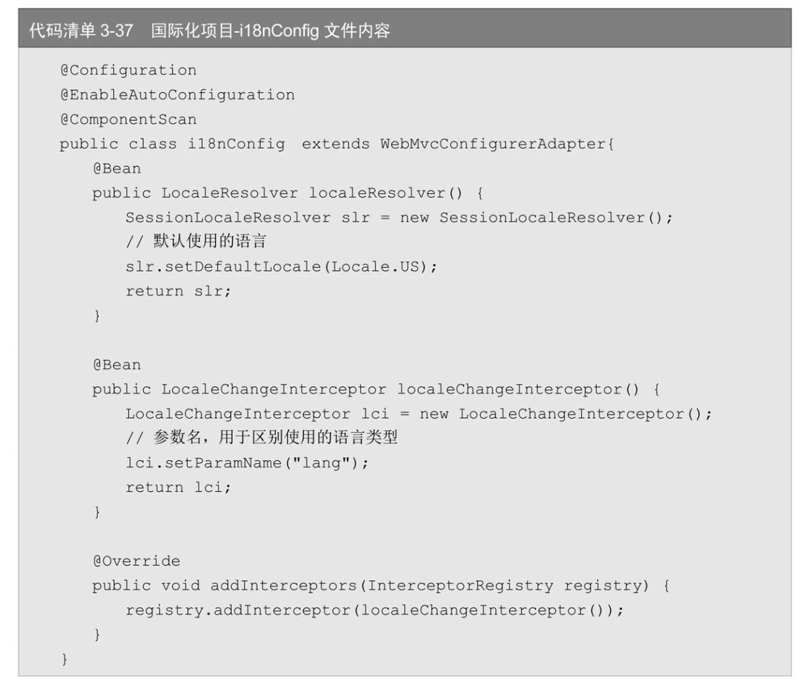

改造默认生成的启动类，在类上加入SpringMVC注解@Controller，注入MessageSource类获取国际化资源，并且创建方法返回资源文件对应的数据，返回到前台。新增代码如代码清单3-38所示。

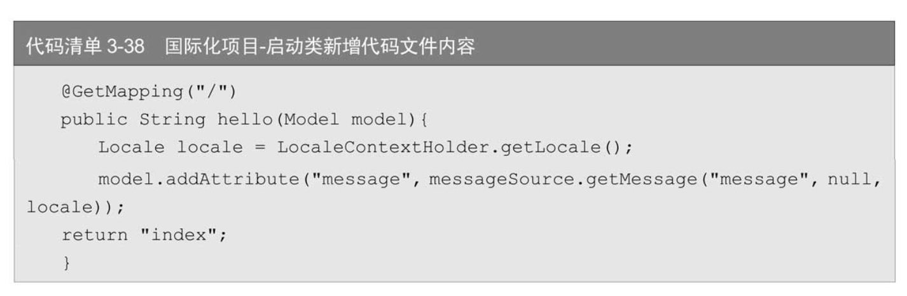

在src/main/resources/template下新建index.html，在页面中创建两个按钮，单击按钮切换语言。index.html页面代码如代码清单3-39所示。

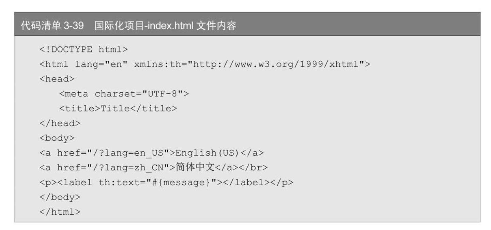

启动项目，在浏览器上访问http://localhost:8080/，显示的内容如图3-6所示。[插图]图3-6　国际化项目，中文显示效果单击页面中的English(US)英文按钮，显示的内容如图3-7所示。[插图]图3-7　国际化项目，英文显示效果

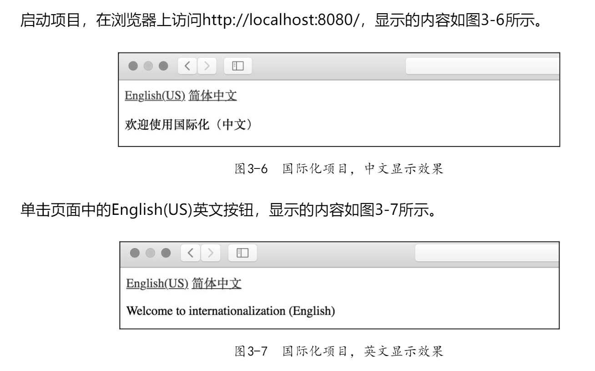

这时你可能会有一个疑问，为什么没有显示默认的配置文件？这是因为在发送HTTP请求的时候，浏览器会根据你的请求头判断区域而进行系统设定。那么问题来了，怎么才会使用到默认的配置文件呢？其实很简单，浏览器根据系统区域在你的程序中找不到语言时，就会使用默认配置，比如，删除项目中英文和中文的配置，只留下一个默认配置，重启项目，再次访问http://localhost:8080/，显示的内容如图3-8所示。

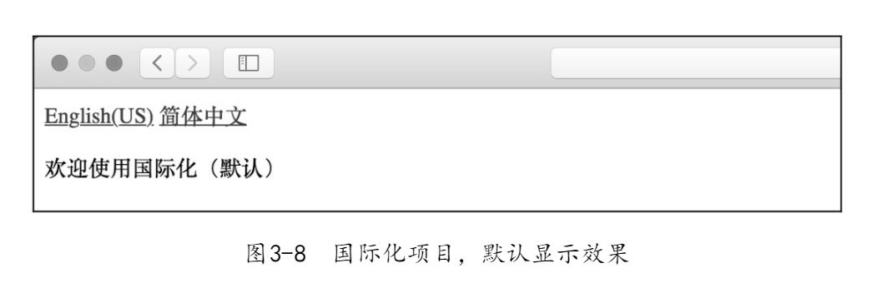

图3-8　国际化项目，默认显示效果


这时就可以看到默认配置，而且即使你单击上面的两个切换语言的按钮，也不会有所改变，因为应用内现在只有这一种配置。

# 文件的上传和下载

3.7节介绍了利用Thymeleaf模板进行国际化的使用，本节将使用FreeMarker模板进行文件的上传和下载，对前面Spring Boot使用模板框架进行一个回顾。创建项目、项目依赖和配置文件与3.5节使用FreeMarker一致。在配置完依赖后，在src/main/resources/templates下新建一个index.ftl文件，文件内分别利用表单提交的方式写了两个表单，用于单个上传和批量上传，并且使用超链接的方式提供了一个下载方法，代码如代码清单3-40所示。

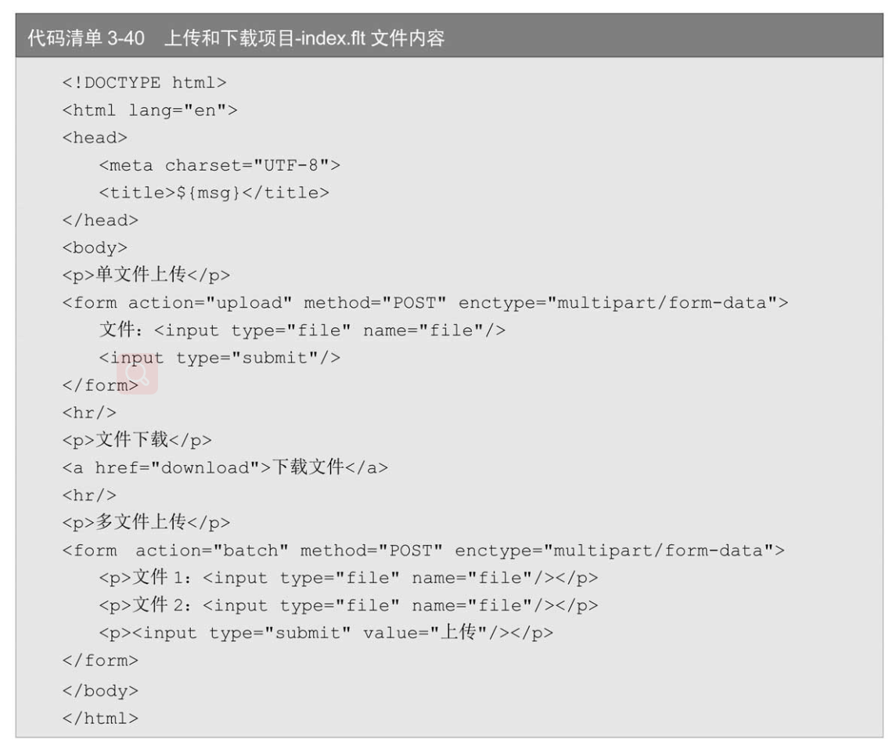

更改启动类，在类上添加注解@Controller，新建index方法用于跳转，向页面传值msg，方法如代码清单3-41所示。

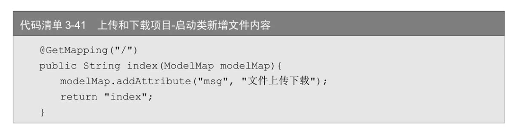

接下来创建一个FileController用于文件上传和下载测试，具体方法如下：

（1）单个上传方法。可以根据页面上使用的input标签的name值获取对应内容，因为是文件，所以可以使用MultipartFile对象来接收文件，由于只是简单测试，因此利用File类自带的transferTo方法直接将文件存入对应存储位置。（2）批量上传方法。获取页面内容的方式和单个上传方法大致相同，不同的是取得文件后，这里使用BufferedOutputStream流来进行上传，如果对Java流不太了解，那么可以学习一下相关流的知识，注意在使用结束后不要忘记关闭流。（3）下载方法。本文中例子只是对固定位置的文件进行下载，在实际应用中，可以根据具体情况进行修改。同样，下载方法也是使用流的方式，并且响应到浏览器。

FileController类代码如代码清单3-42所示。

本节只是进行简单的上传和下载，当然上述方法并不适用于大文件，只是对使用FreeMarker模板进行一个回顾。

# 小结

本章从Spring Boot使用传统Spring MVC模式到Spring 5以后的WebFlux开始介绍，紧接着介绍配置文件、热部署等实用的内容，最后介绍模板框架，让读者可以在本章由浅入深地学习Spring Boot关于Web方面的使用，对Spring Boot关于Web方面的内容有深刻的认识，并能够运用自如。