# 第4章　Spring Boot的数据库之旅

数据库是存储管理数据的仓库，是开发一个应用的必要因素。其实从某种程度上来说，数据库是实现一个系统的根本，甚至有时我们可以理解为：应用实质上就是展示数据库、存储数据库数据等一系列对数据库的操作，所以学习数据库操作对我们来说尤其重要。本章将学习Spring Boot对数据库的操作，让我们开启Spring Boot的数据库之旅。

# 1、使用数据库

数据库分为两种，即关系型数据库和非关系型数据库。关系型数据库是指通过关系模型组织数据的数据库，并且可以利用外键等保持一致性；而非关系型数据库其实不像是数据库，更像是一种以key-value模式存储对象的结构。本节来了解Spring Boot如何使用数据库，以依赖和配置文件为例，后续章节会对数据库进行具体使用。

## 使用MySQL数据库

[插图]图4-1　MySQL数据库LOGOMySQL数据库（官网地址：https://www.mysql.com）是一种关系型数据库，由瑞典的一家公司开发，现在是Oracle公司旗下的产品。MySQL使用C和C++语言开发，提供多种存储引擎，提供多种连接途径，例如ODBC、JDBC、TCP/IP等，并且支持多线程，是当今最流行的数据库之一，并且免费提供给开发者使用。MySQL数据库的LOGO使用一个海豚作为标记，如图4-1所示。海豚标志的名字叫sakila，它是由MySQL的创始人从用户在“海豚命名”的竞赛中建议的大量名字表中选出的。同时，MySQL数据库是一个高性能的数据库，并且支持多种开发语言，如C、C++、Python、Java、Perl、PHP、Eiffel、Ruby和Tcl等。并且，MySQL支持大型的数据库，可以处理拥有上千万条记录的大型数据库。MySQL提供多种存储引擎及索引格式，采用GPL协议，如果有需要的话，可以根据场景修改源码来开发自己的MySQL系统。在Spring Boot中使用MySQL很简单，大致分为两步：

（1）在pom文件中加入依赖，如代码清单4-1所示。

```xml
<!-- mysql-->
		<dependency>
			<groupId>mysql</groupId>
			<artifactId>mysql-connector-java</artifactId>
			<scope>runtime</scope>
		</dependency>
```

（2）在配置文件中配置数据库信息，如代码清单4-2所示。

Mysql配置文件代码

```

```

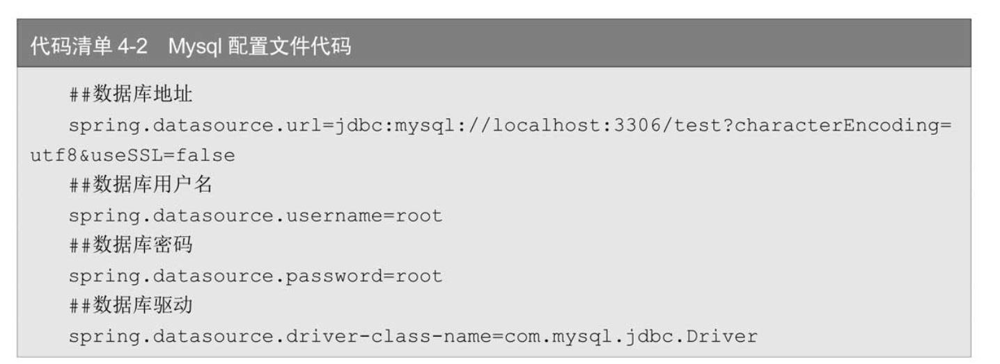

## 使用SQL Server数据库

SQL Server是微软公司推出的关系型数据库（官网地址：https://www.microsoft.com/zh-cn/sql-server），最初是由Microsoft、Sybase和Ashton-Tate三家公司共同开发的，于1988年推出了第一个OS/2版本。在Windows NT推出后，Microsoft与Sybase在SQL Server的开发上就分道扬镳了。Microsoft将SQL Server移植到Windows NT系统上，专注于开发推广SQLServer的Windows NT版本；Sybase则较专注于SQL Server在UNIX操作系统上的应用。SQLServer与MySQL有很多相似的地方，可以跨越多种平台使用，并且提供了更安全可靠的存储功能，方便构建高可用性能的应用程序。SQL Server数据库的LOGO使用微软公司一贯的风格，如图4-2所示。


SQL Server数据库同样提供了很多优点，如易用性、适合分布式组织的可伸缩性、用于决策支持的数据仓库功能、与许多其他服务器软件紧密关联的集成性、良好的性价比等。但是相较于MySQL，其有一定的缺点，如局限性（只能运行在Windows系统上）、当连接数过高时性能不够稳定等。Spring Boot使用SQL Server数据库也很简单，分为两步：

（1）在pom文件中加入依赖，如代码清单4-3所示。

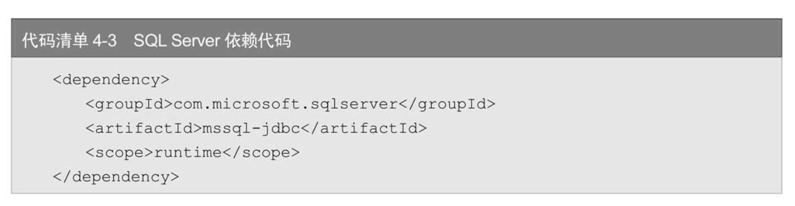


（2）在配置文件中配置数据库信息，如代码清单4-4所示。

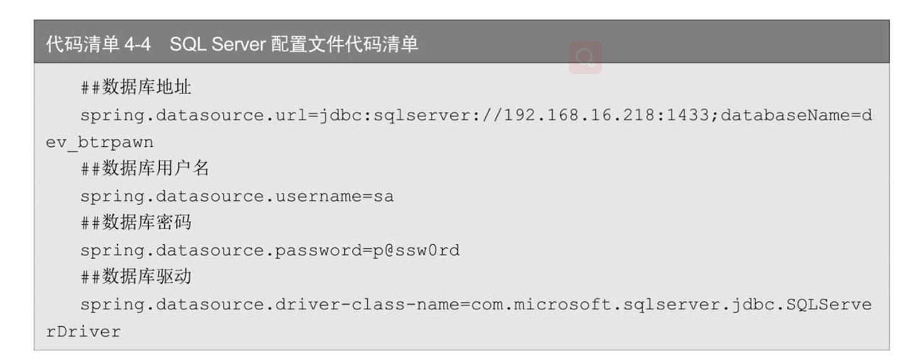


## 使用Oracle数据库

[插图]图4-3　Oracle数据库的LOGOOracle Database（官网地址：https://www.oracle.com）又名OracleRDBMS，简称Oracle。Oracle是甲骨文公司的一款关系数据库管理系统，它在数据库领域一直处于领先地位。Oracle数据库系统是目前世界上流行的关系数据库管理系统，系统可移植性好、使用方便、功能性强，适用于各类大、中、小、微机环境。它是一种高效率的、可靠性好的、适应高吞吐量的数据库解决方案。Oracle数据库的LOGO很简单，就是Oracle公司的图标，如图4-3所示。Spring Boot使用Oracle数据库需要自行下载依赖JAR包，中央仓库没有对应的JAR包，引入JAR之后在配置文件中加入如下配置，如代码清单4-5所示。

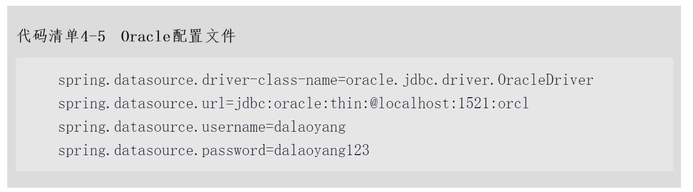

这里延伸一个关于Maven的小技巧，主要介绍常用的导入Jar的方式：

1. 命令行方式

命令行的方式比较简单，比如我们要导入在本地下载文件夹中的ojdbc8.jar到本地仓库，如代码清单4-6所示。

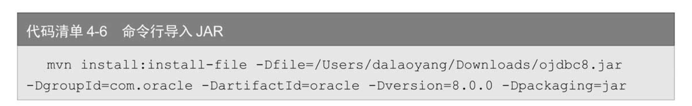

中：•　-Dfile：文件位置。•　-DgroupId：依赖的groupId。•　-DartifactId：依赖的artifactId。•　-Dversion：依赖的版本号。•　-Dpackaging：什么类型的文件（这里使用Jar）。

执行命令后如图4-4所示。

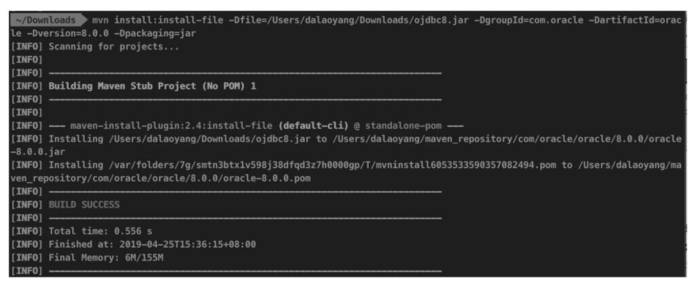

图4-4　命令行导入Jar执行图

然后我们查看一下本地Maven仓库，也可以找到刚刚上传的Jar，如图4-5所示。

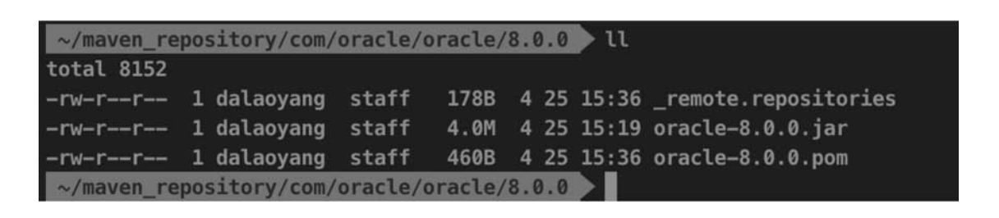

图4-5　查看本地Maven仓库

导入后我们就可以在本地正常引用刚刚导入的Jar文件了。

2. 引用本地Jar

命令行的方式看起来似乎有一些麻烦，不过不要紧，Spring Boot提供了引用本地Jar文件的方式，比如在本地项目src/lib目录下有一个ojdbc8.jar，我们只需要在pom.xml文件中配置如下内容，如代码清单4-7所示。

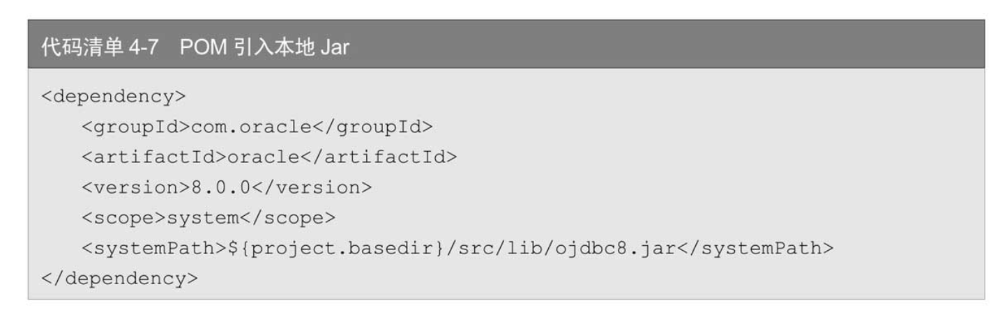

配置后重新导入Jar，如图4-6所示。

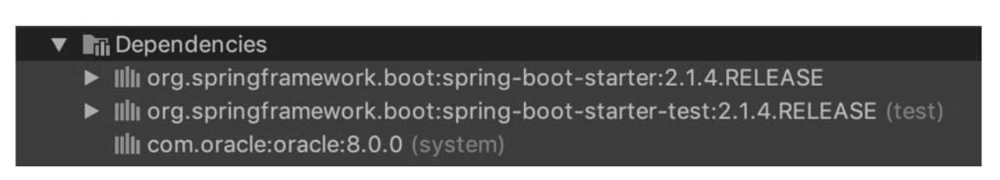

图4-6　查看本地Maven仓库

可以看到，这种方式在本地也可以引用本地Jar文件。不过有一个问题，这种方式在使用SpringBoot项目打Jar包的时候并没有将我们的本地Jar导入，那么怎么解决呢？其实Spring Boot提供了插件解决这个问题，我们只需要在pom.xml文件中引入如下插件即可解决，如代码清单4-8所示。

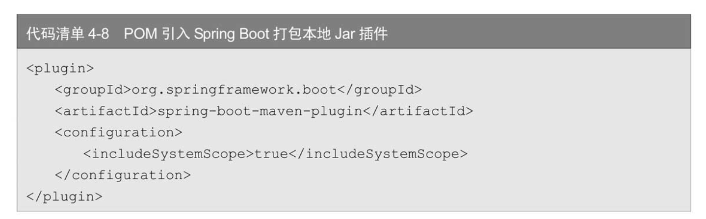

3. 使用Nexus平台导入

这里所说的Nexus平台就是本地私服，与Maven中央仓一致。访问私服地址并登录，如图4-7所示。

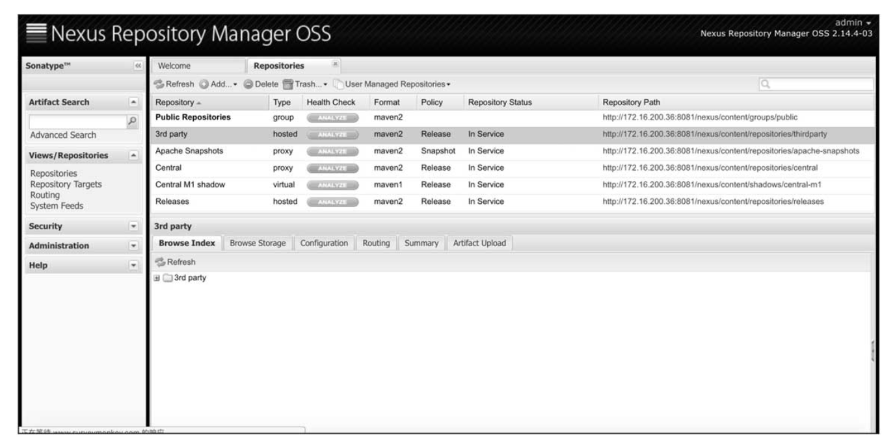

图4-7　查看本地Nexus平台

这里以上传第三方Jar为例，单击Artifact Upload按钮，如图4-8所示。

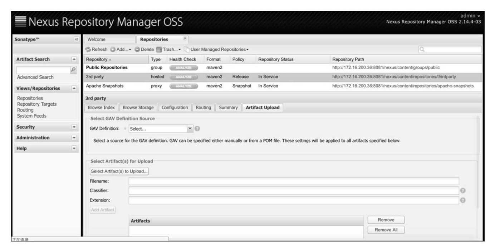

图4-8　查看本地Maven仓库-Artifact Upload

在GAV Definition下拉框中选择GAV Parameters，如图4-9所示。

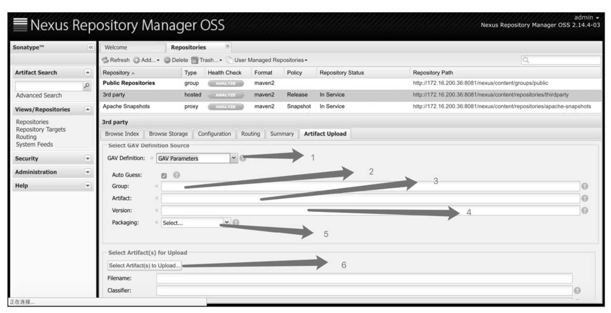

图4-9　查看本地Maven仓库-GAV Parameters

分别填入Group、Artifact、Version并且选择合适的Packaging，设置完成后单击SelectArtifact(s)for Upload按钮，选择Jar文件，都完成后单击左下方的Add Artifact按钮，最后单击Upload Artifact(s)完成上传，结果与使用命令行一致。

## 使用MongoDB数据库

MongoDB（官网地址：https://www.mongodb.com）是一种非关系型数据库，它是一个基于分布式文件存储的数据库。MongoDB由C++语言编写，有高性能、容易部署等优点，官网的介绍如下：MongoDB（来自于英文单词Humongous，中文含义为“庞大”）是可以应用于各种规模的企业、各个行业以及各类应用程序的开源数据库。作为一个适用于敏捷开发的数据库，MongoDB的数据模式可以随着应用程序的发展而灵活地更新。与此同时，它为开发人员提供了传统数据库的功能：二级索引、完整的查询系统以及严格一致性等。MongoDB能够使企业更加具有敏捷性和可扩展性，各种规模的企业都可以通过使用MongoDB来创建新的应用，提高与客户之间的工作效率、加快产品上市时间以及降低企业成本。MongoDB是专为可扩展性、高性能和高可用性而设计的数据库。它可以从单服务器部署扩展到大型、复杂的多数据中心架构。利用内存计算的优势，MongoDB能够提供高性能的数据读写操作。MongoDB的本地复制和自动故障转移功能使你的应用程序具有企业级的可靠性和操作灵活性。[插图]图4-10　MongoDB数据库LOGOMongoDB数据库的LOGO使用一个绿色叶子和mongoDB英文字母组成，如图4-10所示。Spring Boot使用MongoDB数据库很简单，分为两步：

（1）在pom文件加入依赖，如代码清单4-9所示。

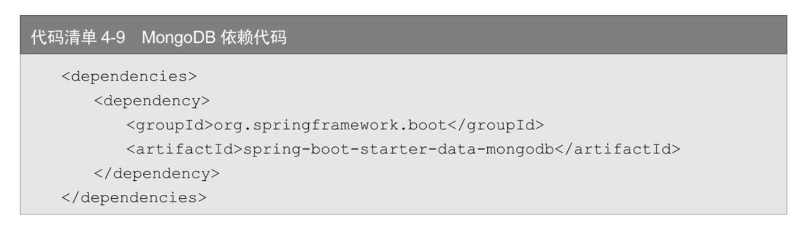

（2）在配置文件中加入MongoDB配置，如代码清单4-10所示。

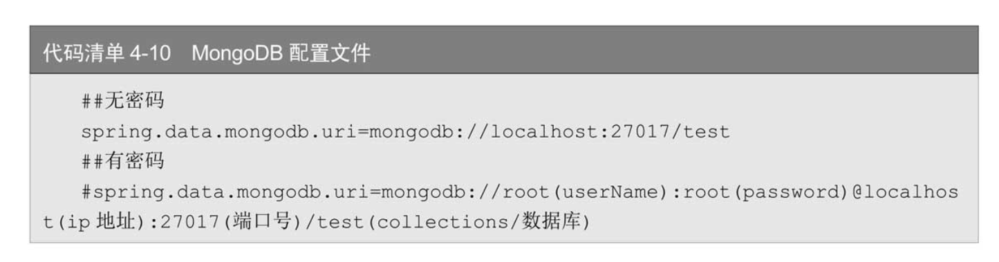

## 　使用Neo4j数据库

[插图]图4-11　Neo4j数据库的LOGONeo4j（官网地址：https://neo4j.com/）是一种非关系型数据库，它是一种图形数据库，将结构化数据存储在网络上而不是表中，同时可以享受到事务特性等优势。Neo4j数据库的LOGO如图4-11所示。Spring Boot使用Neo4j数据库很简单，分为两步：（1）在pom文件中加入依赖，如代码清单4-11所示。

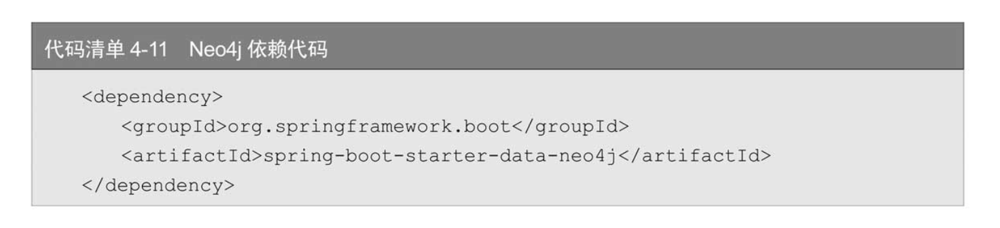

（2）在配置文件中加入配置，如代码清单4-12所示。

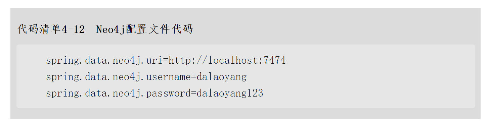

## 使用Redis数据库

[插图]图4-12　Redis数据库的LOGORedis（官网地址：https://redis.io/）是一种非关系型数据库，使用ANSI C语言开发，是一种Key-Value模式的数据库，支持多种value类型，如string（字符串）、list（链表）、set（集合）、zset（sorted set，有序集合）和hash（哈希类型）。如图4-12所示是Redis数据库的LOGO。对于Redis来说，我们可能对它使用的更多的是缓存，毕竟它可以高效地对数据进行操作。其实它还具备很多功能，比如消息队列、发布、订阅消息等。另外，它提供了持久化的方式，在后续章节有详细介绍，这里先简单对依赖和配置进行介绍。Spring Boot使用Redis数据库分为两步：

（1）在pom文件中加入依赖，如代码清单4-13所示。

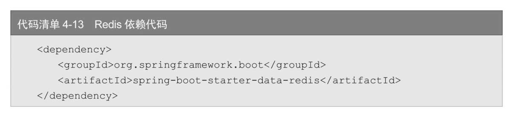

（2）在配置文件中加入配置，如代码清单4-14所示。

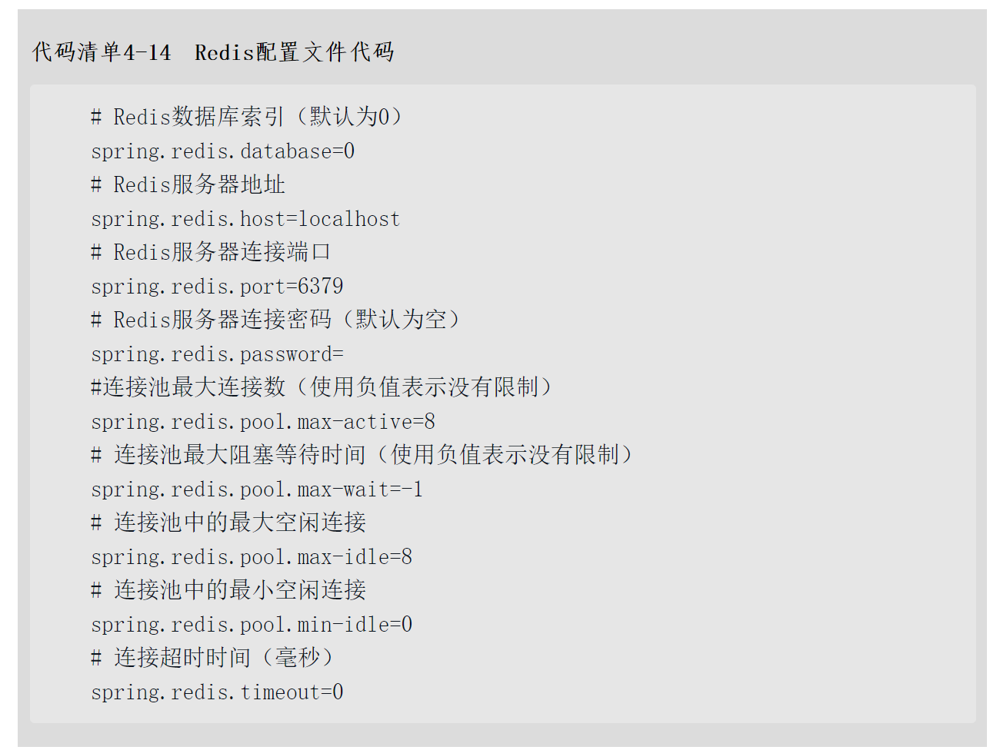

## 使用Memcached数据库

[插图]图4-13　Memcached数据库的LOGOMemcached（官网地址：http://memcached.org/）是一个高性能的分布式内存对象缓存系统，用于动态Web应用以减轻数据库负载。它通过在内存中缓存数据和对象来减少读取数据库的次数，从而提高动态、数据库驱动网站的速度。Memcached基于一个存储键／值对的hashmap。其守护进程（daemon）是用C写的，但是客户端可以用任何语言来编写，并通过Memcached协议与守护进程通信。Memcached数据库的LOGO如图4-13所示。在后续有专门的章节介绍Memcached，这里和Redis一样，只是对依赖和配置进行介绍。Spring Boot使用Memcached数据库分为两步：

在pom文件中加入依赖，如代码清单4-15所示。

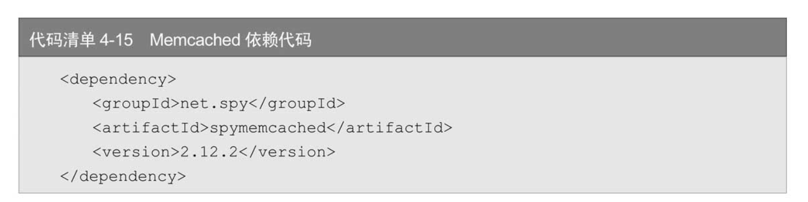

在配置文件中加入配置，如代码清单4-16所示。

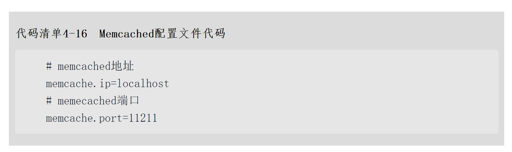

本节介绍了Spring Boot对关系型数据库及非关系型数据库的使用，只是介绍了关于配置和依赖，在具体使用上其实大致都相同。接下来以MySQL为例，具体介绍如何操作数据库。

# 2、使用JDBC操作数据库

JDBC的全名是Java DataBase Connectivity，可能是我们最先接触到的数据库连接，通过JDBC可以直接使用Java编程来操作数据库。其实我们可以这样理解JDBC，它就是一个可以执行SQL语句的Java API。4.1节讲了很多数据库，本节以MySQL为例介绍Spring Boot使用JDBC操作MySQL数据库

## JDBC依赖配置

新建项目，在pom文件中加入JDBC依赖和MySQL依赖以及Web功能的依赖，如代码清单4-17所示。

```xml
<!-- WEB依赖-->
        <dependency>
            <groupId>org.springframework.boot</groupId>
            <artifactId>spring-boot-starter-web</artifactId>
        </dependency>
        <!-- Mysql依赖-->
        <dependency>
            <groupId>mysql</groupId>
            <artifactId>mysql-connector-java</artifactId>
            <scope>runtime</scope>
        </dependency>
        <dependency>
            <groupId>org.springframework.boot</groupId>
            <artifactId>spring-boot-starter-test</artifactId>
            <scope>test</scope>
        </dependency>
```

配置数据库信息


在配置文件中配置数据库信息，与4.1节介绍的一样，配置文件内容如代码清单4-18所示。

```properties
##\u6570\u636E\u5E93\u914D\u7F6E
##\u6570\u636E\u5E93\u5730\u5740
#数据库地址
spring.datasource.url=jdbc:mysql://localhost:3306/test?characterEncoding=utf8&useSSL=false
##\u6570\u636E\u5E93\u7528\u6237\u540D
#数据库用户名
spring.datasource.username=root
##\u6570\u636E\u5E93\u5BC6\u7801
#数据库密码
spring.datasource.password=root
##\u6570\u636E\u5E93\u9A71\u52A8
#数据库驱动
spring.datasource.driver-class-name=com.mysql.jdbc.Driver
```


创建实体类

创建一个实体类，用作接收表数据，这里省略set、get方法，代码如代码清单4-19所示。

```java
package com.springboot.entity;


public class User {
    private int id;
    private String user_name;
    private String user_password;
    public User(int id, String user_name, String user_password) {
        this.id = id;
        this.user_name = user_name;
        this.user_password = user_password;
    }
    public User() {
    }

    public int getId() {
        return id;
    }

    public void setId(int id) {
        this.id = id;
    }

    public String getUser_name() {
        return user_name;
    }

    public void setUser_name(String user_name) {
        this.user_name = user_name;
    }

    public String getUser_password() {
        return user_password;
    }

    public void setUser_password(String user_password) {
        this.user_password = user_password;
    }


}


```

使用Controller进行测试

新建一个UserController，由于这个类只是用来测试使用JDBC操作数据库，因此我们在类上加入@RestController注解，熟悉Spring的人都知道，这个注解其实相当于@ResponseBody和@Controller两个注解结合起来使用。并且在UserController内注入JdbcTemplate，代码如代码清单4-20所示。

其中，@Autowired注解是Spring用于自动装配类的注解，功能和@Resource类似。刚刚我们注入的JdbcTemplate就是Spring Boot使用JDBC操作数据库的核心，接下来进一步对它进行学习。

对于操作数据库来说，其实基本上就是创建（Create）、更新（Update）、读取（Retrieve）和删除（Delete）操作。而对于JdbcTemplate操作数据库的CURD，基本上分为三种方法：

CRUD  

1. execute方法execute方法用来直接执行SQL语句，是最直接的操作数据库的方法。接下来我们在UserController内写一个建表方法createTable来使用它，方法内容如代码清单4-21所示。