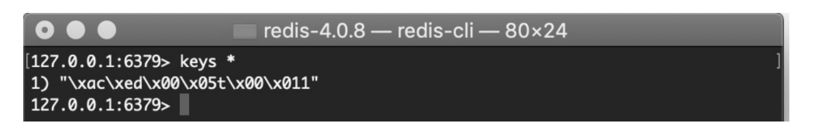

# 第5章　Spring Boot的缓存之旅

第4章我们学习了数据库的使用，但是数据库并不能完全高性能地解决任何事情，这个时候缓存就出现了。缓存这个词对于很多人来说可能并不陌生，无论是从事传统项目的开发者，还是互联网项目的开发者，可能都对缓存有一定的了解。缓存数据交换的缓冲区，一般来说会将访问量比较大的数据从数据库中查询出来放入缓存中，当下次获取数据的时候，直接从缓存中获取。通常缓存会放入内存或硬盘中，方便开发者使用。本章将对Spring Boot如何使用缓存进行学习。

# 5.2　使用Redis

## 1、Redis简介

Redis是一个高性能的缓存存储系统，并且以Key-Value的形式存储数据。目前Value支持5种数据类型，其中包括string（字符串）、list（链表）、set（集合）、zset（sorted set，有序集合）和hash（哈希类型）。Redis支持多种开发语言，如Java、C/C++、C#、PHP、JavaScript、Perl、Objective-C、Python、Ruby、Erlang等。同时，Redis还支持数据的持久化，不只可以将数据存储在内存中，还可以将数据存储到硬盘内，不需要担心数据的丢失。在性能方面，Redis官方（官网地址：https://redis.io/）提供了这样的数据：读的速度是110 000次／s，写的速度是81 000次／s，是一个真正的高性能数据库。

## 2、项目配置

在创建项目之前，需要启动Redis。启动Redis后，新建项目，在pom文件中加入Redis依赖，依赖代码如代码清单5-6所示。

Spring Boot 使用Redis项目依赖文件代码

```xml
<dependencies>
		
		<dependency>
			<groupId>org.springframework.boot</groupId>
			<artifactId>spring-boot-starter-data-redis</artifactId>
		</dependency>
		<dependency>
			<groupId>org.springframework.boot</groupId>
			<artifactId>spring-boot-starter-web</artifactId>
		</dependency>
		<dependency>
			<groupId>org.springframework.boot</groupId>
			<artifactId>spring-boot-starter-test</artifactId>
			<scope>test</scope>
		</dependency>

</dependencies>
```

在配置文件中配置Redis信息，这里我们只配置Redis服务地址和端口，如代码清单5-7所示。

Spring Boot 使用 Redis 项目依赖文件代码

```
# Redis服务器地址
spring.redis.host=localhost
# Redis服务器连接端口
spring.redis.port=6379 
```

对于使用Redis，常用操作无非就是set方法和get方法，所以我们创建一个RedisService对这两个操作进行提取，在类上加入@Service，表明这是一个受Spring管理的JavaBean对象，在RedisService类内注入RedisTemplate，用于对Redis缓存进行操作。创建两个方法：Set方法和Get方法，分别用于使用RedisTemplate进行存放数据和取出数据，如代码清单5-8所示。

Spring Boot使用Redis项目 RedisService类代码

```java
package com.springboot.service;

import org.springframework.beans.factory.annotation.Autowired;
import org.springframework.data.redis.core.RedisTemplate;
import org.springframework.data.redis.core.ValueOperations;
import org.springframework.data.redis.serializer.Jackson2JsonRedisSerializer;
import org.springframework.data.redis.serializer.StringRedisSerializer;
import org.springframework.stereotype.Service;

import java.util.concurrent.TimeUnit;


@Service
public class RedisService {
    @Autowired
    private RedisTemplate redisTemplate;

    public void set(String key, Object value) {
        redisTemplate.setKeySerializer(new StringRedisSerializer());
        redisTemplate.setValueSerializer(new Jackson2JsonRedisSerializer(Object.class));
        ValueOperations<String, Object> vo = redisTemplate.opsForValue();
        vo.set(key, value);
    }

    public void set(String key, Object value, Long time, TimeUnit t) {
        redisTemplate.setKeySerializer(new StringRedisSerializer());
        redisTemplate.setValueSerializer(new Jackson2JsonRedisSerializer(Object.class));
        ValueOperations<String, Object> vo = redisTemplate.opsForValue();
        vo.set(key, value, time, t);
    }

    public Object get(String key) {
        ValueOperations<String, Object> vo = redisTemplate.opsForValue();
        return vo.get(key);
    }
}

```

还是使用之前的User实体类。接下来创建一个UserController进行测试，分别调用RedisService内的Set方法和Get方法，内容比较简单，直接看代码即可，如代码清单5-9所示。

User

```java
package com.springboot.entity;

import javax.persistence.*;
import java.io.Serializable;


@Entity
public class User implements Serializable {

    private static final long serialVersionUID = -4515038763656638346L;
    @Id
    @GeneratedValue(strategy = GenerationType.IDENTITY)
    private Long id;
    @Column(nullable = false, unique = true)
    private String userName;
    @Column
    private String userPassword;

    public Long getId() {
        return id;
    }

    public void setId(Long id) {
        this.id = id;
    }

    public String getUserName() {
        return userName;
    }

    public void setUserName(String userName) {
        this.userName = userName;
    }

    public String getUserPassword() {
        return userPassword;
    }

    public void setUserPassword(String userPassword) {
        this.userPassword = userPassword;
    }

    public User(Long id, String userName, String userPassword) {
        this.id = id;
        this.userName = userName;
        this.userPassword = userPassword;
    }

    public User(String userName, String userPassword) {
        this.userName = userName;
        this.userPassword = userPassword;
    }

    public User() {
    }
}

```

UserController

```java
package com.springboot.controller;

import com.springboot.entity.User;
import com.springboot.repository.UserRepository;
import com.springboot.service.RedisService;
import org.springframework.beans.factory.annotation.Autowired;
import org.springframework.web.bind.annotation.GetMapping;
import org.springframework.web.bind.annotation.RestController;

import java.util.concurrent.TimeUnit;

@RestController
public class UserController {
    @Autowired
    private RedisService redisService;

    @Autowired
    private UserRepository userRepository;

    @GetMapping(value = "saveUser")
    public String saveUser(Long id, String userName, String userPassword) {
        User user = new User(id, userName, userPassword);
        redisService.set(id.toString(), user);
        return "success";
    }

    @GetMapping(value = "getUserById")
    public Object getUserById(Long id) {
        return redisService.get(id.toString());
    }

    @GetMapping("/saveUser2")
    public User saveUser2(Long id, String userName, String userPassword) {
        User user = new User(id, userName, userPassword);
        userRepository.save(user);
        return user;
    }

    @GetMapping(value = "getUser")
    public Object getUser(Long id) {
        Object object = redisService.get(id.toString());
        if (object == null) {
            object = (userRepository.findById(id)).get();
            if (object != null) {
                redisService.set(id.toString(), object, 100L, TimeUnit.SECONDS);
            }
        }
        return object;
    }
}

```

## 3、测试运行

启动项目，访问http://localhost:8080/saveUser?id=1&userName=dalaoyang&userPassword=123，查看控制台发现报错了。

根据控制台提示分析，原因是我们没有对实体类进行序列化，对实体类进行序列化后重启项目，再次访问发现可以保存了。接下来查看一下Redis数据库，发现值虽然存进来了，但是编码格式似乎不对，如图所5-1所示。



图5-1　redis-cli查看图一

从图5-1中可以看出，Redis存入的key编码有一些问题。接下来我们修改一下set方法，将key值进行序列化，修改set方法后的代码如代码清单5-10所示。