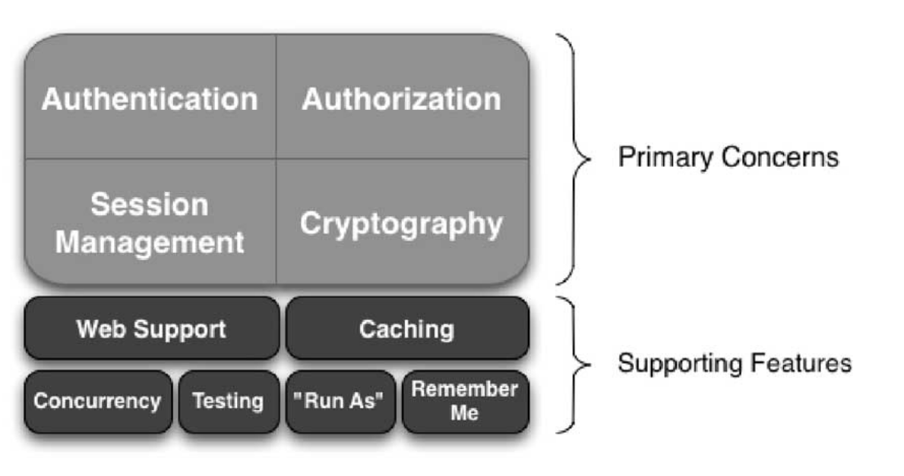
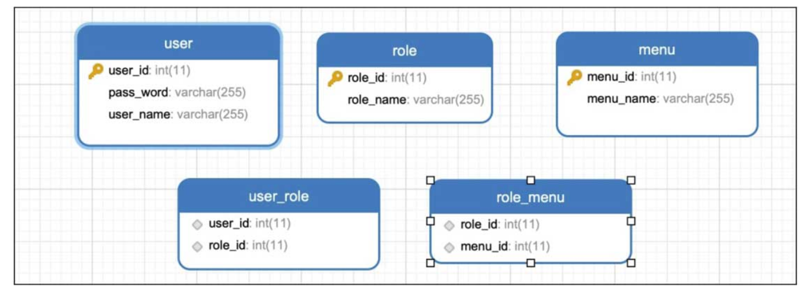

# Spring Boot的安全之旅


安全是每一个应用都必须面对的问题，一个应用如果没有设置好安全框架，那么很容易被别人利用，进而做一些非法的事情。我们可以做一个这样的假设，比如应用中没有安全框架，意味着所有人可以进行所有操作，这样对于一些后台系统来说，就会造成很大程度的风险。还有很多种原因，安全框架就这样诞生。本章将介绍常用的两个Java安全框架：Apache Shiro和Spring Security，并且使用Spring Boot结合二者进行简单的权限控制使用（本章的案例只是将Spring Boot结合安全框架进行认证和授权，由于安全框架的强大及功能性的复杂，因此并没有过多地介绍，如果基础很好，或者对安全框架很了解，可以直接跳过本章）。


没有安全框架  意味着所有人可以进行所有操作

一些后台系统 程度的风险  

安全框架  

利用  做一些非法的事情 


没有安全框架  


Apache Shiro

Spring  Security 

SpringBoot结合两者进行简单的权限控制使用 

只是将SpringBoot结合安全框架进行认证和授权 

# 使用Shiro安全管理

Shiro是由Apache开源的一款强大的安全框架，本节从了解Shiro框架开始，带领大家学习Spring Boot如何使用Shiro进行身份认证和权限认证。

开源的一款强大的安全框架 

了解Shiro框架开始


认证  权限   


Shiro是

安全框架 


身份认证  和  权限认证  

# 什么是Shiro

Apache Shiro（官网地址：http://shiro.apache.org/）是一个功能强大且易于使用的Java安全框架，可以利用它进行身份验证、授权、加密和会话管理。通过使用Shiro易于理解的API文档，可以轻松地构建任何应用程序。

功能强大且易于使用的Java安全框架   可以利用它进行身份验证 授权  加密 和会话管理  通过使用Shiro易于理解的API文档　可以轻松地构建任何应用程序

如Apache Shiro官网所说，Apache Shiro的首要目标是易于使用和理解。安全有时可能非常复杂，甚至是痛苦的，但并非必须如此。框架应尽可能掩盖复杂性，并提供简洁直观的API，以简化开发人员的工作，并确保其应用程序安全地工作。

易于使用和理解

安全　

掩盖复杂性　　提出简洁直观的API

简化开发人员的工作　

易于使用和理解

以下是Apache Shiro可以做的一些事情：

•　验证用户身份。•　为用户执行访问控制，例如确定是否为用户分配了某个安全角色或确定是否允许用户执行某些操作。•　在任何环境中使用Session API，即使没有Web容器或EJB容器也是如此。•　在身份验证、访问控制或会话生命周期内对事件做出反应。•　聚合用户安全数据的一个或多个数据源，并将其全部显示为单个复合用户“视图”。•　启用单点登录（SSO）功能。•　无须登录即可为用户关联启用“记住我”服务。


Apache Shiro是一个具有许多功能的综合应用程序安全框架，如图7-1所示。





Apache Shiro功能图


Shiro提供了Shiro开发团队所称的“应用程序安全的4大基石”——身份验证、授权、会话管理和加密。


•　身份认证：其实身份认证可以理解为“登录”。•　授权：授权是指一些权限的认证，比如管理员可以访问所有页面，但是普通用户只能访问部分页面。•　会话管理：可以理解为Shiro为我们管理用户的会话（如Session）。•　加密：使用加密算法来保证数据的安全。

身份验证

授权

会话管理

加密 

以上是4个主要的功能，如图7-1所示，还提供了其他功能，分别说明如下。


•　Web支持：Shiro的Web支持API可帮助用户轻松保护Web应用程序。•　缓存：Shiro提供了缓存，可以确保安全操作保持快速高效。•　并发：Apache Shiro支持具有并发功能的多线程应用程序。•　测试：存在测试支持以帮助用户编写单元和集成测试，并确保代码按预期受到保护。•　运行方式：允许用户假定其他用户的身份（如果允许）的功能，有时在管理方案中很有用。•　记住我：记住用户在会话中的身份，这样他们只需要在强制要求时登录。


使用Shiro做权限控制

刚刚介绍了Apache Shiro的基本功能，接下来带领大家学习Spring Boot如何使用Shiro框架进行身份认证和权限管理。

1. 场景及数据库介绍

在创建项目之前，先介绍一下需要实现的场景，数据库表设计如图7-2所示。



user  role   menu

user_role  role_menu 

Shiro项目数据库设计图

其中分为两种角色：admin和user，如果用户角色为admin，则可以进行4个菜单的请求（add、delete、update和select，这里只有select和delete），如果用户角色为user，则只可以进行select请求。如果没有权限，就会跳转到401页面，index页面可以不登录访问。为了方便，默认插入了两个用户：dalaoyang有admin权限；xiaoli有user权限。插入数据脚本如代码清单7-1所示。

Shiro项目数据库默认插入SQL

```sql
INSERT INTO `menu`(`menu_id`, `menu_name`) VALUES (1, 'add');
INSERT INTO `menu`(`menu_id`, `menu_name`) VALUES (2, 'delete');
INSERT INTO `menu`(`menu_id`, `menu_name`) VALUES (3, 'update');
INSERT INTO `menu`(`menu_id`, `menu_name`) VALUES (4, 'select');
INSERT INTO `role`(`role_id`, `role_name`) VALUES (1, 'admin');
INSERT INTO `role`(`role_id`, `role_name`) VALUES (2, 'user');
INSERT INTO `role_menu`(`role_id`, `menu_id`) VALUES (1, 1);
INSERT INTO `role_menu`(`role_id`, `menu_id`) VALUES (1, 2);
INSERT INTO `role_menu`(`role_id`, `menu_id`) VALUES (1, 3);
INSERT INTO `role_menu`(`role_id`, `menu_id`) VALUES (1, 4);
INSERT INTO `role_menu`(`role_id`, `menu_id`) VALUES (2, 4);
INSERT INTO `user`(`user_id`, `pass_word`, `user_name`) VALUES (1, '123', 'dalaoyang');
INSERT INTO `user`(`user_id`, `pass_word`, `user_name`) VALUES (2, '123', 'xiaoli');
INSERT INTO `user_role`(`role_id`, `user_id`) VALUES (1, 1);
INSERT INTO `user_role`(`role_id`, `user_id`) VALUES (2, 2);
```

用户多个角色   角色不同的操作  不同的菜单


2. 依赖配置

依赖配置 

接下来我们新建一个项目，由于这里需要使用数据库，因此加入了MySQL和JPA的依赖，模板框架使用的是Thymeleaf，同时加入Shiro依赖，如代码清单7-2所示。


Shiro项目依赖文件代码

```xml
 <dependency>
            <groupId>org.springframework.boot</groupId>
            <artifactId>spring-boot-starter</artifactId>
        </dependency>
        <dependency>
            <groupId>org.springframework.boot</groupId>
            <artifactId>spring-boot-starter-test</artifactId>
            <scope>test</scope>
        </dependency>
        <!-- shiro -->
        <dependency>
            <groupId>org.apache.shiro</groupId>
            <artifactId>shiro-spring</artifactId>
            <version>1.4.0</version>
        </dependency>
        <!-- web -->
        <dependency>
            <groupId>org.springframework.boot</groupId>
            <artifactId>spring-boot-starter-web</artifactId>
        </dependency>
        <!-- thymeleaf -->
        <dependency>
            <groupId>org.springframework.boot</groupId>
            <artifactId>spring-boot-starter-thymeleaf</artifactId>
        </dependency>
        <!-- nekohtml -->
        <dependency>
            <groupId>net.sourceforge.nekohtml</groupId>
            <artifactId>nekohtml</artifactId>
            <version>1.9.15</version>
        </dependency>
        <!-- mysql -->
        <dependency>
            <groupId>mysql</groupId>
            <artifactId>mysql-connector-java</artifactId>
            <scope>runtime</scope>
        </dependency>
        <!-- jpa -->
        <dependency>
            <groupId>org.springframework.boot</groupId>
            <artifactId>spring-boot-starter-data-jpa</artifactId>
        </dependency>
```

配置文件这里不再赘述，都是关于数据库和JPA的配置，如需查阅，可以在本书源码中查看。

3. 实体类及数据操作层

结合上述场景，可以看出user表和role表的关系是多对多，role表和menu表的关系也是多对多，理解了关系，创建实体类就比较容易了。首先创建一个User实体，使用@ManyToMany表明是多对多的关系，在@JoinTable注解中注明中间表的表名以及关联两个表的字段，如代码清单7-3所示。

Shiro项目数据库User实体代码

```java
@Entity
public class User implements Serializable {

    @Id
    @GeneratedValue
    private Integer userId;
    private String userName;
    private String passWord;

    @ManyToMany(fetch= FetchType.EAGER)
    @JoinTable(name = "UserRole", joinColumns = { @JoinColumn(name = "userId") },
            inverseJoinColumns ={@JoinColumn(name = "roleId") })
    private List<Role> roleList;

    public Integer getUserId() {
        return userId;
    }

    public void setUserId(Integer userId) {
        this.userId = userId;
    }

    public String getUserName() {
        return userName;
    }

    public void setUserName(String userName) {
        this.userName = userName;
    }

    public String getPassWord() {
        return passWord;
    }

    public void setPassWord(String passWord) {
        this.passWord = passWord;
    }

    public List<Role> getRoleList() {
        return roleList;
    }

    public void setRoleList(List<Role> roleList) {
        this.roleList = roleList;
    }
}

```

接下来创建Role实体。和User实体类似，分别注明与User和Menu的多对多关系，如代码清单7-4所示。

```java
package com.springboot.entity;

import javax.persistence.*;
import java.io.Serializable;
import java.util.List;

@Entity
public class Role implements Serializable {

    @Id
    @GeneratedValue
    private Integer roleId;
    private String roleName;


    @ManyToMany(fetch= FetchType.EAGER)
    @JoinTable(name="RoleMenu",joinColumns={@JoinColumn(name="roleId")},inverseJoinColumns={@JoinColumn(name="menuId")})
    private List<Menu> menuList;

    @ManyToMany
    @JoinTable(name="UserRole",joinColumns={@JoinColumn(name="roleId")},inverseJoinColumns={@JoinColumn(name="userId")})
    private List<User> userList;

    public Integer getRoleId() {
        return roleId;
    }

    public void setRoleId(Integer roleId) {
        this.roleId = roleId;
    }

    public String getRoleName() {
        return roleName;
    }

    public void setRoleName(String roleName) {
        this.roleName = roleName;
    }

    public List<Menu> getMenuList() {
        return menuList;
    }

    public void setMenuList(List<Menu> menuList) {
        this.menuList = menuList;
    }

    public List<User> getUserList() {
        return userList;
    }

    public void setUserList(List<User> userList) {
        this.userList = userList;
    }

}

```


Shiro项目Role实体类代码

```java
package com.springboot.entity;

import javax.persistence.*;
import java.io.Serializable;
import java.util.List;

@Entity
public class Role implements Serializable {

    @Id
    @GeneratedValue
    private Integer roleId;
    private String roleName;


    @ManyToMany(fetch= FetchType.EAGER)
    @JoinTable(name="RoleMenu",joinColumns={@JoinColumn(name="roleId")},inverseJoinColumns={@JoinColumn(name="menuId")})
    private List<Menu> menuList;

    @ManyToMany
    @JoinTable(name="UserRole",joinColumns={@JoinColumn(name="roleId")},inverseJoinColumns={@JoinColumn(name="userId")})
    private List<User> userList;

    public Integer getRoleId() {
        return roleId;
    }

    public void setRoleId(Integer roleId) {
        this.roleId = roleId;
    }

    public String getRoleName() {
        return roleName;
    }

    public void setRoleName(String roleName) {
        this.roleName = roleName;
    }

    public List<Menu> getMenuList() {
        return menuList;
    }

    public void setMenuList(List<Menu> menuList) {
        this.menuList = menuList;
    }

    public List<User> getUserList() {
        return userList;
    }

    public void setUserList(List<User> userList) {
        this.userList = userList;
    }

}

```


最后是Menu实体，这里表明与Role的多对多关系，如代码清单7-5所示。

```java
package com.springboot.entity;

import javax.persistence.*;
import java.io.Serializable;
import java.util.List;

@Entity
public class Menu  implements Serializable {

    @Id
    @GeneratedValue
    private Integer menuId;
    private String menuName;

    @ManyToMany
    @JoinTable(name="RoleMenu",joinColumns={@JoinColumn(name="menuId")},inverseJoinColumns={@JoinColumn(name="roleId")})
    private List<Role> roleList;

    public Integer getMenuId() {
        return menuId;
    }

    public void setMenuId(Integer menuId) {
        this.menuId = menuId;
    }

    public String getMenuName() {
        return menuName;
    }

    public void setMenuName(String menuName) {
        this.menuName = menuName;
    }

    public List<Role> getRoleList() {
        return roleList;
    }

    public void setRoleList(List<Role> roleList) {
        this.roleList = roleList;
    }

}

```


Menu项目Role实体类代码

创建一个JPA数据操作层，里面加入一个根据用户名查询用户的方法，如代码清单7-6所示。

Shiro项目UserRepository类代码

```java
package com.springboot.repository;

import com.springboot.entity.User;
import org.springframework.data.jpa.repository.JpaRepository;

public interface UserRepository extends JpaRepository<User,Long> {
    User findByUserName(String username);
}

```


```java
public interface UserRepository extends JpaRepository<User,Long> {
    User findByUserName(String username);
}

```

4. Shiro配置

创建一个ShiroConfig，然后创建一个shiroFilter方法。在Shiro使用认证和授权时，其实都是通过ShiroFilterFactoryBean设置一些Shiro的拦截器进行的，拦截器会以LinkedHashMap的形式存储需要拦截的资源及链接，并且会按照顺序执行，其中键为拦截的资源或链接，值为拦截的形式（比如authc:所有URL都必须认证通过才可以访问，anon:所有URL都可以匿名访问），在拦截的过程中可以使用通配符，比如/**为拦截所有，所以一般/**放在最下面。同时，可以通过ShiroFilterFactoryBean设置登录链接、未授权链接、登录成功跳转页等，这里设置的shiroFilter方法内容如代码清单7-7所示。

Shiro项目ShiroConfig类shiroFilter方法代码

```java
 @Bean
    public ShiroFilterFactoryBean shiroFilter(SecurityManager securityManager) {
        ShiroFilterFactoryBean shiroFilterFactoryBean = new ShiroFilterFactoryBean();
        shiroFilterFactoryBean.setSecurityManager(securityManager);
        //shiro拦截器
        Map<String,String> filterChainDefinitionMap = new LinkedHashMap<String,String>();
        //<!-- authc:所有url都必须认证通过才可以访问; anon:所有url都都可以匿名访问-->
        //<!-- 过滤链定义，从上向下顺序执行，一般将/**放在最为下边 -->

        // 配置不被拦截的资源及链接
        filterChainDefinitionMap.put("/static/**", "anon");
        // 退出过滤器
        filterChainDefinitionMap.put("/logout", "logout");

        //配置需要认证权限的
        filterChainDefinitionMap.put("/**", "authc");
        // 默认寻找登录链接
        shiroFilterFactoryBean.setLoginUrl("/login");
        // 登录成功后要跳转的链接
        shiroFilterFactoryBean.setSuccessUrl("/index");

        //未授权的跳转链接
        shiroFilterFactoryBean.setUnauthorizedUrl("/401");
        shiroFilterFactoryBean.setFilterChainDefinitionMap(filterChainDefinitionMap);
        return shiroFilterFactoryBean;
    }

```

同时，需要在ShiroConfig类中开启shiro aop注解支持，如果没有开启，权限验证就会失效，如代码清单7-8所示。

同时，需要在ShiroConfig类中开启shiro aop注解支持，如果没有开启，权限验证就会失效，如代码清单7-8所示。

```java
    //开启shiro aop注解支持，不开启的话权限验证就会失效
    @Bean
    public AuthorizationAttributeSourceAdvisor authorizationAttributeSourceAdvisor(SecurityManager securityManager){
        AuthorizationAttributeSourceAdvisor authorizationAttributeSourceAdvisor = new AuthorizationAttributeSourceAdvisor();
        authorizationAttributeSourceAdvisor.setSecurityManager(securityManager);
        return authorizationAttributeSourceAdvisor;
    }
```

接下来创建一个方法处理一些异常信息，如代码清单7-9所示。

接下来创建一个方法处理一些异常信息，如代码清单7-9所示。

```java
//处理异常，当用户没有权限时设置跳转到401页面
    @Bean(name="simpleMappingExceptionResolver")
    public SimpleMappingExceptionResolver createSimpleMappingExceptionResolver() {
        SimpleMappingExceptionResolver simpleMappingExceptionResolver = new SimpleMappingExceptionResolver();
        Properties mappings = new Properties();
        //数据库异常处理
        mappings.setProperty("DatabaseException", "databaseError");
        //未经过认证
        mappings.setProperty("UnauthorizedException","401");
        // None by default
        simpleMappingExceptionResolver.setExceptionMappings(mappings);
        // No default
        simpleMappingExceptionResolver.setDefaultErrorView("error");
        // Default is "exception"
        simpleMappingExceptionResolver.setExceptionAttribute("ex");
        return simpleMappingExceptionResolver;
    }
```

最后，我们需要在ShiroConfig内设置自定义身份认证的Realm，完整ShiroConfig类代码可在本书源代码中查看。MyShiroRealm类代码如代码清单7-10所示。

```java
package com.springboot.config;

import com.springboot.entity.Menu;
import com.springboot.entity.Role;
import com.springboot.entity.User;
import com.springboot.repository.UserRepository;
import org.apache.shiro.authc.AuthenticationException;
import org.apache.shiro.authc.AuthenticationInfo;
import org.apache.shiro.authc.AuthenticationToken;
import org.apache.shiro.authc.SimpleAuthenticationInfo;
import org.apache.shiro.authz.AuthorizationInfo;
import org.apache.shiro.authz.SimpleAuthorizationInfo;
import org.apache.shiro.realm.AuthorizingRealm;
import org.apache.shiro.subject.PrincipalCollection;
import org.springframework.context.annotation.Configuration;

import javax.annotation.Resource;

@Configuration
public class MyShiroRealm extends AuthorizingRealm {

    @Resource
    private UserRepository userRepository;

    //授权方法，主要用于获取角色的菜单权限
    @Override
    protected AuthorizationInfo doGetAuthorizationInfo(PrincipalCollection principals) {
        SimpleAuthorizationInfo authorizationInfo = new SimpleAuthorizationInfo();
        User userInfo  = (User)principals.getPrimaryPrincipal();
        for(Role role:userInfo.getRoleList()){
            authorizationInfo.addRole(role.getRoleName());
            for(Menu menu:role.getMenuList()){
                authorizationInfo.addStringPermission(menu.getMenuName());
            }
        }
        return authorizationInfo;
    }

    //认证方法，主要用于校验用户名和密码
    @Override
    protected AuthenticationInfo doGetAuthenticationInfo(AuthenticationToken token)
            throws AuthenticationException {
        //获得当前用户的用户名
        String username = (String)token.getPrincipal();
        //根据用户名查询用户
        User user = userRepository.findByUserName(username);
        if(user == null){
            return null;
        }
        //校验用户名密码是否正确
        SimpleAuthenticationInfo authenticationInfo = new SimpleAuthenticationInfo(
                user,
                user.getPassWord(),
                getName()
        );
        return authenticationInfo;
    }
}


```


其中，doGetAuthorizationInfo方法用于授权，doGetAuthenticationInfo方法用于验证用户信息，也就是我们常说的登录。


前端页面

本案例中场景设计为5个页面，分别是401页面、delete页面、index页面、login页面及Select页面401页面的代码。如代码清单7-11所示。

Shiro项目 401页面代码

delete页面的代码如代码清单7-12所示。

Shiro项目delete页面代码

index页面中设置了一个注销按钮，如代码清单7-13所示。

Shiro项目index页面代码

```html

```

login页面通过表单提交数据，如代码清单7-14所示。

Shiro项目login页面代码

最后是select页面，代码如代码清单7-15所示。

Shiro项目select页面代码

```java

```

6. Controller

最后需要创建Controller进行页面跳转，@RequiresPermissions注解设置select方法应该有select权限，@RequiresRoles注解设置delete方法需要有admin的角色。其实Shiro提供了如下几个注解供使用。

•　@RequiresAuthentication：表示当前已经通过了身份认证，即Subject. isAuthenticated()返回true。

•　@RequiresUser：表示当前用户已经通过身份验证或者通过“记住我”登录的。•　@RequiresRoles：可以通过属性值value设置角色，角色可以设置一个或者多个，并且使用logical属性指定角色需要同时包含多个权限还是只包含一个权限。比如@RequiresRoles (value={"admin","user"},logical= Logical.AND)为当前需要用户同时包含admin和user权限。•　@RequiresPermissions：与上面的注解类似，判断用户是否含有菜单权限，属性值与@RequiresRoles一致。•　@RequiresGuest：表明当前用户没有通过身份验证或通过“记住我”登录过，也就是游客身份。


接下来，我们看一下ShiroController的代码，需要注意login方法中根据HttpServletRequest获取Shiro处理的异常信息来给出一些提示，比如用户名不存在或者密码错误。完整代码如代码清单7-16所示。


```java
package com.springboot.controller;

import org.apache.shiro.authc.IncorrectCredentialsException;
import org.apache.shiro.authc.UnknownAccountException;
import org.apache.shiro.authz.annotation.RequiresPermissions;
import org.apache.shiro.authz.annotation.RequiresRoles;
import org.springframework.stereotype.Controller;
import org.springframework.web.bind.annotation.GetMapping;
import org.springframework.web.bind.annotation.RequestMapping;

import javax.servlet.http.HttpServletRequest;
import java.util.Map;

@Controller
public class ShiroController {
    @GetMapping({"/","/index"})
    public String index(){
        return"index";
    }

    @GetMapping("/401")
    public String unauthorizedRole(){
        return "401";
    }

    @GetMapping("/delete")
    @RequiresRoles("admin")
    public String delete(){
        return "delete";
    }

    @GetMapping("/select")
    @RequiresPermissions("select")
    public String select(){
        return "select";
    }

    @RequestMapping("/login")
    public String login(HttpServletRequest request, Map<String, Object> map){
        // 如果登录失败的话，那么就从HttpServletRequest中获取shiro处理的异常信息，获取shiroLoginFailure就是shiro异常类的全名。
        String exception = (String) request.getAttribute("shiroLoginFailure");
        String msg = "";
        //根据异常判断错误类型
        if (exception != null) {
            if (UnknownAccountException.class.getName().equals(exception)) {
                msg = "用户名不存在！";
            } else if (IncorrectCredentialsException.class.getName().equals(exception)) {
                msg = "密码错误！";
            } else {
                msg = exception;
            }
        }
        map.put("msg", msg);
        return "/login";
    }

    @GetMapping("/logout")
    public String logout(){
        return "/login";
    }

}

```

7. 测试

到这里，项目就已经配置完成了。启动项目，这里简单介绍一下笔者用来测试的方法。（1）在不登录的情况下可以访问index和login页面，访问select页面和delete页面会跳转到login页面。（2）使用dalaoyang用户登录的话，可以在登录后访问任意页面。（3）使用xiaoli用户登录的话，除了访问delete页面会跳转到401页面以外，访问其他页面都会正常跳转。通过以上测试，完全可以测试出Shiro框架做到了认证及授权。读者也可以使用其他方式进行测试，如果读者对Shiro感兴趣，可以在此基础上进行扩展，使用更多的功能。


# 使用shiro安全管理

之前介绍了springboot使用security进行权限管理，这篇文件介绍一下springboot使用shiro进行安全管理。

简述本文的场景，本文使用springboot1.5.9+mysql+jpa+thymeleaf+shiro制作一个简单的验证，其中有2个角色，分别是admin和user，admin可以使用select和delete功能，user只能使用select功能。

新建项目，加入shiro依赖，pom文件如下：

```
<?xml version="1.0" encoding="UTF-8"?>
<project xmlns="http://maven.apache.org/POM/4.0.0" xmlns:xsi="http://www.w3.org/2001/XMLSchema-instance"
         xsi:schemaLocation="http://maven.apache.org/POM/4.0.0 http://maven.apache.org/xsd/maven-4.0.0.xsd">
    <modelVersion>4.0.0</modelVersion>

    <groupId>com.dalaoyang</groupId>
    <artifactId>springboot_shiro</artifactId>
    <version>0.0.1-SNAPSHOT</version>
    <packaging>jar</packaging>

    <name>springboot_shiro</name>
    <description>springboot_shiro</description>

    <parent>
        <groupId>org.springframework.boot</groupId>
        <artifactId>spring-boot-starter-parent</artifactId>
        <version>1.5.9.RELEASE</version>
        <relativePath/> <!-- lookup parent from repository -->
    </parent>

    <properties>
        <project.build.sourceEncoding>UTF-8</project.build.sourceEncoding>
        <project.reporting.outputEncoding>UTF-8</project.reporting.outputEncoding>
        <java.version>1.8</java.version>
    </properties>

    <dependencies>
        <dependency>
            <groupId>org.springframework.boot</groupId>
            <artifactId>spring-boot-starter-data-jpa</artifactId>
        </dependency>
        <dependency>
            <groupId>org.springframework.boot</groupId>
            <artifactId>spring-boot-starter-web</artifactId>
        </dependency>

        <dependency>
            <groupId>org.springframework.boot</groupId>
            <artifactId>spring-boot-devtools</artifactId>
            <scope>runtime</scope>
        </dependency>
        <dependency>
            <groupId>mysql</groupId>
            <artifactId>mysql-connector-java</artifactId>
            <scope>runtime</scope>
        </dependency>
        <dependency>
            <groupId>org.springframework.boot</groupId>
            <artifactId>spring-boot-starter-test</artifactId>
            <scope>test</scope>
        </dependency>
        <dependency>
            <groupId>org.springframework.boot</groupId>
            <artifactId>spring-boot-starter-thymeleaf</artifactId>
        </dependency>
        <dependency>
            <groupId>net.sourceforge.nekohtml</groupId>
            <artifactId>nekohtml</artifactId>
            <version>1.9.15</version>
        </dependency>
        <dependency>
            <groupId>org.apache.shiro</groupId>
            <artifactId>shiro-spring</artifactId>
            <version>1.4.0</version>
        </dependency>
    </dependencies>

    <build>
        <plugins>
            <plugin>
                <groupId>org.springframework.boot</groupId>
                <artifactId>spring-boot-maven-plugin</artifactId>
            </plugin>
        </plugins>
    </build>


</project>
```

配置文件如下：

```
##端口号
server.port=8888


##数据库配置
##数据库地址
spring.datasource.url=jdbc:mysql://localhost:3306/shiro?characterEncoding=utf8&useSSL=false
##数据库用户名
spring.datasource.username=root
##数据库密码
spring.datasource.password=root
##数据库驱动
spring.datasource.driver-class-name=com.mysql.jdbc.Driver


##validate  加载hibernate时，验证创建数据库表结构
##create   每次加载hibernate，重新创建数据库表结构，这就是导致数据库表数据丢失的原因。
##create-drop        加载hibernate时创建，退出是删除表结构
##update                 加载hibernate自动更新数据库结构
##validate 启动时验证表的结构，不会创建表
##none  启动时不做任何操作
spring.jpa.hibernate.ddl-auto=update

##控制台打印sql
spring.jpa.show-sql=true


# 建议在开发时关闭缓存,不然没法看到实时页面
spring.thymeleaf.cache=false
##去除thymeleaf的html严格校验
spring.thymeleaf.mode=LEGACYHTML5
```

创建了三个实体类，分别是
SysUser（用户表）

```
package com.dalaoyang.entity;

import org.hibernate.validator.constraints.NotEmpty;

import javax.persistence.*;
import java.io.Serializable;
import java.util.List;

/**
 * @author dalaoyang
 * @Description
 * @project springboot_learn
 * @package com.dalaoyang.entity
 * @email yangyang@dalaoyang.cn
 * @date 2018/5/2
 */
@Entity
public class SysUser implements Serializable {

    @Id
    @GeneratedValue
    private Integer userId;
    @NotEmpty
    private String userName;
    @NotEmpty
    private String passWord;

    //多对多关系
    @ManyToMany(fetch= FetchType.EAGER)
    //急加载，加载一个实体时，定义急加载的属性会立即从数据库中加载
    //FetchType.LAZY：懒加载，加载一个实体时，定义懒加载的属性不会马上从数据库中加载
    @JoinTable(name = "SysUserRole", joinColumns = { @JoinColumn(name = "userId") },
            inverseJoinColumns ={@JoinColumn(name = "roleId") })
    private List<SysRole> roleList;// 一个用户具有多个角色


    public Integer getUserId() {
        return userId;
    }

    public void setUserId(Integer userId) {
        this.userId = userId;
    }

    public String getUserName() {
        return userName;
    }

    public void setUserName(String userName) {
        this.userName = userName;
    }

    public String getPassWord() {
        return passWord;
    }

    public void setPassWord(String passWord) {
        this.passWord = passWord;
    }

    public List<SysRole> getRoleList() {
        return roleList;
    }

    public void setRoleList(List<SysRole> roleList) {
        this.roleList = roleList;
    }
}
```

SysRole（角色表）

```
package com.dalaoyang.entity;

import org.hibernate.validator.constraints.NotEmpty;

import javax.persistence.*;
import java.io.Serializable;
import java.util.List;

/**
 * @author dalaoyang
 * @Description
 * @project springboot_learn
 * @package com.dalaoyang.entity
 * @email yangyang@dalaoyang.cn
 * @date 2018/5/2
 */
@Entity
public class SysRole implements Serializable {

    @Id
    @GeneratedValue
    private Integer roleId;
    private String roleName;

    //多对多关系
    @ManyToMany(fetch= FetchType.EAGER)
    @JoinTable(name="SysRoleMenu",joinColumns={@JoinColumn(name="roleId")},inverseJoinColumns={@JoinColumn(name="menuId")})
    private List<SysMenu> menuList;

    //多对多关系
    @ManyToMany
    @JoinTable(name="SysUserRole",joinColumns={@JoinColumn(name="roleId")},inverseJoinColumns={@JoinColumn(name="userId")})
    private List<SysUser> userList;// 一个角色对应多个用户

    public Integer getRoleId() {
        return roleId;
    }

    public void setRoleId(Integer roleId) {
        this.roleId = roleId;
    }

    public String getRoleName() {
        return roleName;
    }

    public void setRoleName(String roleName) {
        this.roleName = roleName;
    }

    public List<SysMenu> getMenuList() {
        return menuList;
    }

    public void setMenuList(List<SysMenu> menuList) {
        this.menuList = menuList;
    }

    public List<SysUser> getUserList() {
        return userList;
    }

    public void setUserList(List<SysUser> userList) {
        this.userList = userList;
    }
}
```

SysMenu（菜单表）

```
package com.dalaoyang.entity;

import javax.persistence.*;
import java.io.Serializable;
import java.util.List;

/**
 * @author dalaoyang
 * @Description
 * @project springboot_learn
 * @package com.dalaoyang.entity
 * @email yangyang@dalaoyang.cn
 * @date 2018/5/2
 */
@Entity
public class SysMenu implements Serializable {

    @Id
    @GeneratedValue
    private Integer menuId;
    private String menuName;

    @ManyToMany
    @JoinTable(name="SysRoleMenu",joinColumns={@JoinColumn(name="menuId")},inverseJoinColumns={@JoinColumn(name="roleId")})
    private List<SysRole> roleList;

    public Integer getMenuId() {
        return menuId;
    }

    public void setMenuId(Integer menuId) {
        this.menuId = menuId;
    }

    public String getMenuName() {
        return menuName;
    }

    public void setMenuName(String menuName) {
        this.menuName = menuName;
    }

    public List<SysRole> getRoleList() {
        return roleList;
    }

    public void setRoleList(List<SysRole> roleList) {
        this.roleList = roleList;
    }
}
```

创建一个UserRepository用于查询用户信息：

```
package com.dalaoyang.repository;

import com.dalaoyang.entity.SysUser;
import org.springframework.data.repository.CrudRepository;

/**
 * @author dalaoyang
 * @Description
 * @project springboot_learn
 * @package com.dalaoyang.repository
 * @email yangyang@dalaoyang.cn
 * @date 2018/5/2
 */
public interface UserRepository extends CrudRepository<SysUser,Long> {

    SysUser findByUserName(String username);
}
```

创建几个前台页面进行测试，分别是：
login.html:

```
<!DOCTYPE html>
<html lang="en" xmlns:th="http://www.w3.org/1999/xhtml">
<head>
    <meta charset="UTF-8">
    <title>Login</title>
</head>
<body>
错误信息：<h4 th:text="${msg}"></h4>
<form action="" method="post">
    <p>账号：<input type="text" name="username" value="dalaoyang"/></p>
    <p>密码：<input type="text" name="password" value="123"/></p>
    <p><input type="submit" value="登录"/></p>
</form>
</body>
</html>
```

index.html

```
<!DOCTYPE html>
<html lang="en" xmlns:th="http://www.w3.org/1999/xhtml">
<head>
    <meta charset="UTF-8">
    <title>Title</title>
</head>
<body>
index
<br/>
<form th:action="@{/logout}" method="post">
    <p><input type="submit" value="注销"/></p>
</form>
</body>
</html>
```

delete.html

```
<!DOCTYPE html>
<html lang="en">
<head>
    <meta charset="UTF-8">
    <title>Title</title>
</head>
<body>
delete
</body>
</html>
```

select.html

```
<!DOCTYPE html>
<html lang="en">
<head>
    <meta charset="UTF-8">
    <title>Title</title>
</head>
<body>
select
</body>
</html>
```

403.html

```
<!DOCTYPE html>
<html lang="en">
<head>
    <meta charset="UTF-8">
    <title>Title</title>
</head>
<body>
403
</body>
</html>
```

创建一个ShiroConfig，代码如下：

```
package com.dalaoyang.config;

import org.apache.shiro.mgt.SecurityManager;
import org.apache.shiro.spring.security.interceptor.AuthorizationAttributeSourceAdvisor;
import org.apache.shiro.spring.web.ShiroFilterFactoryBean;
import org.apache.shiro.web.mgt.DefaultWebSecurityManager;
import org.slf4j.Logger;
import org.slf4j.LoggerFactory;
import org.springframework.context.annotation.Bean;
import org.springframework.context.annotation.Configuration;
import org.springframework.web.servlet.handler.SimpleMappingExceptionResolver;

import java.util.Date;
import java.util.LinkedHashMap;
import java.util.Map;
import java.util.Properties;

/**
 * @author dalaoyang
 * @Description
 * @project springboot_learn
 * @package com.dalaoyang.config
 * @email yangyang@dalaoyang.cn
 * @date 2018/5/2
 */
@Configuration
public class ShiroConfig {
    private final Logger logger = LoggerFactory.getLogger(this.getClass());

    @Bean
    public ShiroFilterFactoryBean shirFilter(SecurityManager securityManager) {
        logger.info("启动shiroFilter--时间是：" + new Date());
        ShiroFilterFactoryBean shiroFilterFactoryBean = new ShiroFilterFactoryBean();
        shiroFilterFactoryBean.setSecurityManager(securityManager);
        //shiro拦截器
        Map<String,String> filterChainDefinitionMap = new LinkedHashMap<String,String>();
        //<!-- authc:所有url都必须认证通过才可以访问; anon:所有url都都可以匿名访问-->
        //<!-- 过滤链定义，从上向下顺序执行，一般将/**放在最为下边 -->

        // 配置不被拦截的资源及链接
        filterChainDefinitionMap.put("/static/**", "anon");
        // 退出过滤器
        filterChainDefinitionMap.put("/logout", "logout");

        //配置需要认证权限的
        filterChainDefinitionMap.put("/**", "authc");
        // 如果不设置默认会自动寻找Web工程根目录下的"/login"页面，即本文使用的login.html
        shiroFilterFactoryBean.setLoginUrl("/login");
        // 登录成功后要跳转的链接
        shiroFilterFactoryBean.setSuccessUrl("/index");

        //未授权界面
        shiroFilterFactoryBean.setUnauthorizedUrl("/403");
        shiroFilterFactoryBean.setFilterChainDefinitionMap(filterChainDefinitionMap);
        return shiroFilterFactoryBean;
    }

    //自定义身份认证Realm（包含用户名密码校验，权限校验等）
    @Bean
    public MyShiroRealm myShiroRealm(){
        MyShiroRealm myShiroRealm = new MyShiroRealm();
        return myShiroRealm;
    }


    @Bean
    public SecurityManager securityManager(){
        DefaultWebSecurityManager securityManager =  new DefaultWebSecurityManager();
        securityManager.setRealm(myShiroRealm());
        return securityManager;
    }

    //开启shiro aop注解支持，不开启的话权限验证就会失效
    @Bean
    public AuthorizationAttributeSourceAdvisor authorizationAttributeSourceAdvisor(SecurityManager securityManager){
        AuthorizationAttributeSourceAdvisor authorizationAttributeSourceAdvisor = new AuthorizationAttributeSourceAdvisor();
        authorizationAttributeSourceAdvisor.setSecurityManager(securityManager);
        return authorizationAttributeSourceAdvisor;
    }

    //配置异常处理，不配置的话没有权限后台报错，前台不会跳转到403页面
    @Bean(name="simpleMappingExceptionResolver")
    public SimpleMappingExceptionResolver
    createSimpleMappingExceptionResolver() {
        SimpleMappingExceptionResolver simpleMappingExceptionResolver = new SimpleMappingExceptionResolver();
        Properties mappings = new Properties();
        mappings.setProperty("DatabaseException", "databaseError");//数据库异常处理
        mappings.setProperty("UnauthorizedException","403");
        simpleMappingExceptionResolver.setExceptionMappings(mappings);  // None by default
        simpleMappingExceptionResolver.setDefaultErrorView("error");    // No default
        simpleMappingExceptionResolver.setExceptionAttribute("ex");     // Default is "exception"
        return simpleMappingExceptionResolver;
    }
}
```

在配置一个MyShiroRealm用于登录认证和授权认证，代码如下：

```
package com.dalaoyang.config;

import com.dalaoyang.entity.SysMenu;
import com.dalaoyang.entity.SysRole;
import com.dalaoyang.entity.SysUser;
import com.dalaoyang.repository.UserRepository;
import org.apache.shiro.authc.AuthenticationException;
import org.apache.shiro.authc.AuthenticationInfo;
import org.apache.shiro.authc.AuthenticationToken;
import org.apache.shiro.authc.SimpleAuthenticationInfo;
import org.apache.shiro.authz.AuthorizationInfo;
import org.apache.shiro.authz.SimpleAuthorizationInfo;
import org.apache.shiro.realm.AuthorizingRealm;
import org.apache.shiro.subject.PrincipalCollection;

import javax.annotation.Resource;

/**
 * @author dalaoyang
 * @Description
 * @project springboot_learn
 * @package com.dalaoyang.config
 * @email yangyang@dalaoyang.cn
 * @date 2018/5/2
 */
public class MyShiroRealm extends AuthorizingRealm {

    @Resource
    private UserRepository userRepository;

    //授权
    @Override
    protected AuthorizationInfo doGetAuthorizationInfo(PrincipalCollection principals) {
        SimpleAuthorizationInfo authorizationInfo = new SimpleAuthorizationInfo();
        SysUser userInfo  = (SysUser)principals.getPrimaryPrincipal();
        for(SysRole role:userInfo.getRoleList()){
            authorizationInfo.addRole(role.getRoleName());
            for(SysMenu menu:role.getMenuList()){
                authorizationInfo.addStringPermission(menu.getMenuName());
            }
        }
        return authorizationInfo;
    }

    //认证
    @Override
    protected AuthenticationInfo doGetAuthenticationInfo(AuthenticationToken token)
            throws AuthenticationException {
        //获得当前用户的用户名
        String username = (String)token.getPrincipal();
        System.out.println(token.getCredentials());
        //根据用户名找到对象
        //实际项目中，这里可以根据实际情况做缓存，如果不做，Shiro自己也是有时间间隔机制，2分钟内不会重复执行该方法
        SysUser userInfo = userRepository.findByUserName(username);
        if(userInfo == null){
            return null;
        }
        //这里会去校验密码是否正确
        SimpleAuthenticationInfo authenticationInfo = new SimpleAuthenticationInfo(
                userInfo, //用户名
                userInfo.getPassWord(),//密码
                getName()
        );
        return authenticationInfo;
    }
}
```

最后新建一个controller，其中本文使用了2种验证权限的方法，select方法使用@RequiresPermissions(“select”)来验证用户是否具有select权限，delete方法使用@RequiresRoles(“admin”)来验证用户是否是admin，代码如下：

```
package com.dalaoyang.controller;

import org.apache.shiro.authc.IncorrectCredentialsException;
import org.apache.shiro.authc.UnknownAccountException;
import org.apache.shiro.authz.annotation.RequiresPermissions;
import org.apache.shiro.authz.annotation.RequiresRoles;
import org.springframework.stereotype.Controller;
import org.springframework.web.bind.annotation.GetMapping;
import org.springframework.web.bind.annotation.RequestMapping;

import javax.servlet.http.HttpServletRequest;
import java.util.Map;

/**
 * @author dalaoyang
 * @Description
 * @project springboot_learn
 * @package com.dalaoyang.controller
 * @email yangyang@dalaoyang.cn
 * @date 2018/5/2
 */
@Controller
public class TestController {

    @GetMapping({"/","/index"})
    public String index(){
        return"index";
    }

    @GetMapping("/403")
    public String unauthorizedRole(){
        return "403";
    }

    @GetMapping("/delete")
    //@RequiresPermissions("delete")
    @RequiresRoles("admin")
    public String delete(){
        return "delete";
    }

    @GetMapping("/select")
    @RequiresPermissions("select")
    public String select(){
        return "select";
    }

    @RequestMapping("/login")
    public String login(HttpServletRequest request, Map<String, Object> map) throws Exception{
        System.out.println("HomeController.login()");
        // 登录失败从request中获取shiro处理的异常信息。
        // shiroLoginFailure:就是shiro异常类的全类名.
        String exception = (String) request.getAttribute("shiroLoginFailure");
        String msg = "";
        //根据异常判断错误类型
        if (exception != null) {
            if (UnknownAccountException.class.getName().equals(exception)) {
                msg = "账号不存在";
            } else if (IncorrectCredentialsException.class.getName().equals(exception)) {
                msg = "密码不正确";
            } else {
                msg = "else >> "+exception;
            }
        }
        map.put("msg", msg);
        // 此方法不处理登录成功,由shiro进行处理
        return "/login";
    }

    @GetMapping("/logout")
    public String logout(){
        return "/login";
    }
}
```

为了方便测试，本人插入了几条初始数据，sql如下：

```
INSERT INTO `shiro`.`sys_menu`(`menu_id`, `menu_name`) VALUES (1, 'add');
INSERT INTO `shiro`.`sys_menu`(`menu_id`, `menu_name`) VALUES (2, 'delete');
INSERT INTO `shiro`.`sys_menu`(`menu_id`, `menu_name`) VALUES (3, 'update');
INSERT INTO `shiro`.`sys_menu`(`menu_id`, `menu_name`) VALUES (4, 'select');
INSERT INTO `shiro`.`sys_role`(`role_id`, `role_name`) VALUES (1, 'admin');
INSERT INTO `shiro`.`sys_role`(`role_id`, `role_name`) VALUES (2, 'user');
INSERT INTO `shiro`.`sys_role_menu`(`role_id`, `menu_id`) VALUES (1, 1);
INSERT INTO `shiro`.`sys_role_menu`(`role_id`, `menu_id`) VALUES (1, 2);
INSERT INTO `shiro`.`sys_role_menu`(`role_id`, `menu_id`) VALUES (1, 3);
INSERT INTO `shiro`.`sys_role_menu`(`role_id`, `menu_id`) VALUES (1, 4);
INSERT INTO `shiro`.`sys_role_menu`(`role_id`, `menu_id`) VALUES (2, 4);
INSERT INTO `shiro`.`sys_user`(`user_id`, `pass_word`, `user_name`) VALUES (1, '123', 'dalaoyang');
INSERT INTO `shiro`.`sys_user`(`user_id`, `pass_word`, `user_name`) VALUES (2, '123', 'xiaoli');
INSERT INTO `shiro`.`sys_user_role`(`role_id`, `user_id`) VALUES (1, 1);
INSERT INTO `shiro`.`sys_user_role`(`role_id`, `user_id`) VALUES (2, 2);
```

启动项目，我在这里就不一一截图了，口述一下，访问http://localhost:8888/select由于没有登录的原因，会自动跳转到http://localhost:8888/login，输入错误的用户名和密码会出现对应的提示。输入角色user的用户名xiaoli，密码123。访问http://localhost:8888/select页面会正常跳转，访问http://localhost:8888/delete会拦截到403页面。

如果使用角色为admin的用户dalaoyang密码123登录，以上请求全可以正常访问。

源码下载 ：[大老杨码云](https://gitee.com/dalaoyang/springboot_learn)

个人网站：[https://dalaoyang.cn](https://www.dalaoyang.cn/)